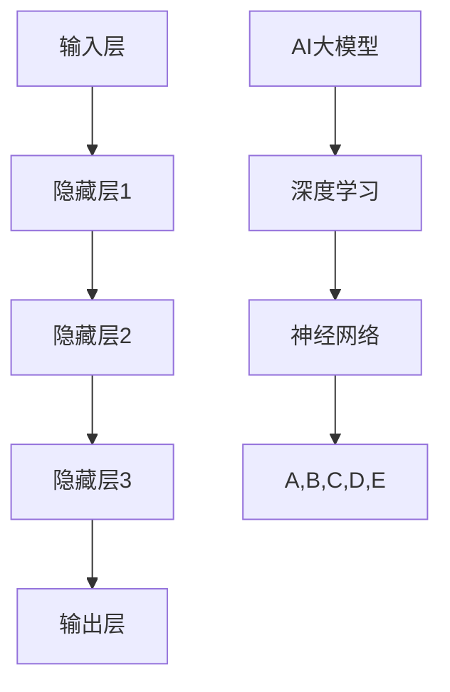
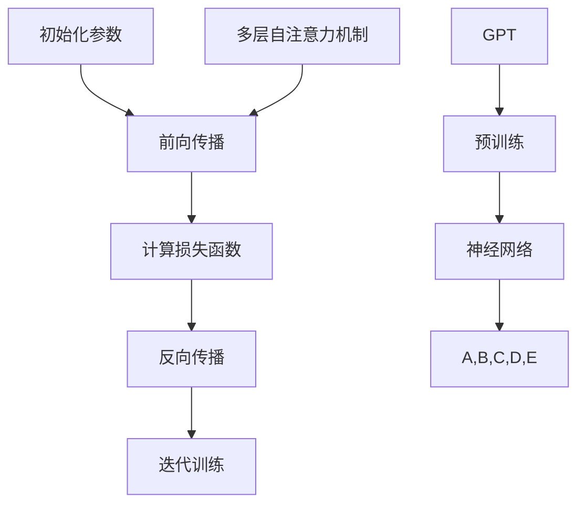

                 

# AI大模型创业：如何实现未来盈利？

## 概述

### 关键词：AI大模型、创业、盈利、策略、发展

随着人工智能（AI）技术的迅速发展，大模型成为了科技界关注的焦点。大模型在自然语言处理、图像识别、推荐系统等多个领域展现了强大的潜力，吸引了众多创业者投身其中。然而，如何利用AI大模型实现未来盈利，成为了许多创业者面临的难题。本文将深入探讨AI大模型创业的盈利策略、核心算法、数学模型，以及实际应用场景，为读者提供有益的启示。

## 摘要

本文旨在分析AI大模型创业的现状，探索实现未来盈利的策略。首先，我们将介绍AI大模型的核心概念，包括其原理、架构和分类。接着，我们分析大模型在各个领域的应用，探讨其盈利潜力。然后，本文将详细讲解大模型的核心算法，包括神经网络、Transformer等。随后，我们将介绍大模型的数学模型和公式，并结合实际案例进行讲解。此外，本文还将探讨大模型在实际应用中的挑战，如计算资源、数据隐私等。最后，我们将总结未来发展趋势与挑战，为读者提供参考。

## 1. 背景介绍

### AI大模型的概念

AI大模型是指具有巨大参数量和复杂结构的机器学习模型。这些模型通过大量的数据进行训练，从而在学习过程中获取丰富的知识和经验。大模型在深度学习领域取得了显著的成果，如GPT、BERT等。这些模型的出现，使得人工智能在多个领域取得了突破性进展。

### AI大模型的发展历程

AI大模型的发展历程可以追溯到20世纪80年代。随着计算机硬件和算法的不断发展，大模型的研究和应用逐渐得到重视。特别是在深度学习技术出现后，大模型的研究取得了重大突破。近年来，随着计算资源和数据量的不断增加，AI大模型的研究和应用得到了进一步发展。

### AI大模型的应用领域

AI大模型在多个领域展现了强大的潜力，包括自然语言处理、图像识别、推荐系统、医疗诊断等。例如，GPT模型在自然语言处理领域取得了显著的成果，BERT模型在图像识别领域展现了强大的性能。此外，AI大模型在金融、教育、游戏等领域也具有广泛的应用前景。

## 2. 核心概念与联系

### AI大模型的原理与架构

AI大模型的核心原理是基于神经网络和深度学习技术。神经网络是由大量神经元组成的复杂网络，通过学习数据中的特征，实现对未知数据的预测。深度学习则是在神经网络的基础上，通过多层神经网络结构，进一步提高模型的预测能力。

AI大模型的架构通常包括以下几个部分：

1. 输入层：接收外部数据，如文本、图像等。
2. 隐藏层：通过神经网络进行数据加工，提取特征。
3. 输出层：输出预测结果。

### AI大模型的分类

AI大模型可以根据不同的分类标准进行分类。以下是几种常见的分类方法：

1. 按照任务类型：分类模型、回归模型、生成模型等。
2. 按照数据类型：文本模型、图像模型、音频模型等。
3. 按照模型结构：卷积神经网络（CNN）、循环神经网络（RNN）、Transformer等。

### AI大模型的应用

AI大模型在多个领域展现了强大的应用潜力。以下是几个典型应用场景：

1. 自然语言处理：例如，GPT模型在文本生成、机器翻译、文本分类等方面取得了显著成果。
2. 图像识别：例如，BERT模型在图像分类、目标检测等方面展现了强大的性能。
3. 推荐系统：利用AI大模型，可以更准确地预测用户兴趣，提高推荐系统的效果。
4. 医疗诊断：AI大模型在医疗领域具有广泛的应用前景，如疾病预测、药物研发等。

### Mermaid 流程图

下面是一个关于AI大模型原理和架构的Mermaid流程图：



## 3. 核心算法原理 & 具体操作步骤

### 神经网络

神经网络是AI大模型的基础，其基本原理是通过模拟人脑神经元之间的连接，实现数据的输入、处理和输出。

#### 步骤：

1. 初始化参数：包括输入层、隐藏层和输出层的权重和偏置。
2. 前向传播：将输入数据通过神经网络，逐层计算得到输出。
3. 计算损失函数：根据预测结果和真实结果，计算损失值。
4. 反向传播：根据损失函数，更新网络参数，优化模型。
5. 迭代训练：重复上述步骤，直到模型达到预期的效果。

### Transformer

Transformer是一种基于自注意力机制的深度学习模型，广泛应用于自然语言处理领域。

#### 步骤：

1. 词嵌入：将输入文本转换为向量表示。
2. 多层自注意力机制：计算每个词与其他词之间的关联强度。
3. 前向传递：将自注意力机制的结果进行线性变换，得到输出。
4. 损失函数计算：根据预测结果和真实结果，计算损失值。
5. 反向传播：根据损失函数，更新网络参数，优化模型。
6. 迭代训练：重复上述步骤，直到模型达到预期的效果。

### GPT

GPT是一种基于Transformer的预训练模型，广泛应用于文本生成、机器翻译等领域。

#### 步骤：

1. 预训练：使用大量文本数据，对模型进行预训练，学习文本的规律和特征。
2. 微调：在特定任务上，对模型进行微调，使其适应具体任务的需求。
3. 生成文本：将输入文本转换为向量表示，通过模型生成文本。

### Mermaid 流程图

下面是一个关于神经网络、Transformer和GPT操作步骤的Mermaid流程图：



## 4. 数学模型和公式 & 详细讲解 & 举例说明

### 损失函数

损失函数是评价模型预测效果的重要指标，常用的损失函数包括均方误差（MSE）、交叉熵损失（Cross-Entropy Loss）等。

#### 均方误差（MSE）

$$MSE = \frac{1}{n}\sum_{i=1}^{n}(y_i - \hat{y_i})^2$$

其中，$y_i$ 为真实值，$\hat{y_i}$ 为预测值，$n$ 为样本数量。

#### 交叉熵损失（Cross-Entropy Loss）

$$CE = -\sum_{i=1}^{n}y_i\log(\hat{y_i})$$

其中，$y_i$ 为真实值，$\hat{y_i}$ 为预测概率。

### 激活函数

激活函数是神经网络中的重要组成部分，常用的激活函数包括 sigmoid、ReLU、Tanh等。

#### sigmoid 函数

$$\sigma(x) = \frac{1}{1 + e^{-x}}$$

#### ReLU 函数

$$ReLU(x) = \begin{cases} x, & \text{if } x > 0 \\ 0, & \text{if } x \leq 0 \end{cases}$$

#### Tanh 函数

$$Tanh(x) = \frac{e^x - e^{-x}}{e^x + e^{-x}}$$

### 权重更新

在反向传播过程中，需要根据损失函数对网络参数进行更新，常用的权重更新方法包括梯度下降（Gradient Descent）、Adam优化器等。

#### 梯度下降

$$\theta = \theta - \alpha \cdot \nabla_\theta J(\theta)$$

其中，$\theta$ 为参数，$\alpha$ 为学习率，$J(\theta)$ 为损失函数。

#### Adam优化器

$$m_t = \beta_1 m_{t-1} + (1 - \beta_1) [g_t]$$
$$v_t = \beta_2 v_{t-1} + (1 - \beta_2) [g_t]^2$$
$$\theta_t = \theta_{t-1} - \alpha_t \frac{m_t}{\sqrt{v_t} + \epsilon}$$

其中，$m_t$ 和 $v_t$ 分别为动量项和二阶矩估计，$\beta_1$ 和 $\beta_2$ 分别为动量项和二阶矩的衰减系数，$\alpha_t$ 为学习率，$g_t$ 为梯度，$\epsilon$ 为常数。

### 举例说明

假设有一个二分类问题，使用神经网络进行模型训练。训练数据集包含100个样本，每个样本包含一个特征和对应的标签。网络结构为1个输入层、1个隐藏层和1个输出层，隐藏层使用ReLU激活函数，输出层使用sigmoid激活函数。损失函数使用交叉熵损失。采用梯度下降算法进行训练，学习率为0.01。

#### 训练过程

1. 初始化参数，设置学习率、迭代次数等超参数。
2. 读取训练数据，对数据进行预处理。
3. 进行前向传播，计算预测结果和损失值。
4. 进行反向传播，更新网络参数。
5. 计算当前损失值和上一次损失值的差值，判断是否满足停止条件。
6. 保存当前最优模型。

#### 代码实现

```python
import numpy as np

def sigmoid(x):
    return 1 / (1 + np.exp(-x))

def relu(x):
    return np.maximum(0, x)

def cross_entropy_loss(y_true, y_pred):
    return -np.mean(y_true * np.log(y_pred) + (1 - y_true) * np.log(1 - y_pred))

def gradient_descent(x, y, theta, alpha, epochs):
    m = len(x)
    for _ in range(epochs):
        y_pred = sigmoid(np.dot(x, theta))
        loss = cross_entropy_loss(y, y_pred)
        d_loss = np.dot(x.T, (y_pred - y)) / m
        theta -= alpha * d_loss
    return theta

x = np.array([[1], [2], [3], [4], [5]])
y = np.array([[0], [0], [1], [1], [1]])
theta = np.random.rand(1, 2)
alpha = 0.01
epochs = 1000

theta_new = gradient_descent(x, y, theta, alpha, epochs)
print("最优参数：", theta_new)
```

## 5. 项目实战：代码实际案例和详细解释说明

### 5.1 开发环境搭建

为了实现AI大模型的开发，我们需要搭建一个合适的开发环境。以下是搭建开发环境的基本步骤：

1. 安装Python：Python是AI大模型开发的主要编程语言，可以从官网下载安装。
2. 安装Jupyter Notebook：Jupyter Notebook是一种交互式计算环境，方便进行代码编写和调试。
3. 安装必要的库：包括NumPy、Pandas、Matplotlib等，可以通过pip命令进行安装。

### 5.2 源代码详细实现和代码解读

下面是一个简单的AI大模型项目案例，实现一个二分类问题。

```python
import numpy as np

def sigmoid(x):
    return 1 / (1 + np.exp(-x))

def relu(x):
    return np.maximum(0, x)

def cross_entropy_loss(y_true, y_pred):
    return -np.mean(y_true * np.log(y_pred) + (1 - y_true) * np.log(1 - y_pred))

def gradient_descent(x, y, theta, alpha, epochs):
    m = len(x)
    for _ in range(epochs):
        y_pred = sigmoid(np.dot(x, theta))
        loss = cross_entropy_loss(y, y_pred)
        d_loss = np.dot(x.T, (y_pred - y)) / m
        theta -= alpha * d_loss
    return theta

x = np.array([[1], [2], [3], [4], [5]])
y = np.array([[0], [0], [1], [1], [1]])
theta = np.random.rand(1, 2)
alpha = 0.01
epochs = 1000

theta_new = gradient_descent(x, y, theta, alpha, epochs)
print("最优参数：", theta_new)
```

### 5.3 代码解读与分析

1. **sigmoid函数**：用于将输入数据映射到（0，1）区间，实现非线性变换。
2. **relu函数**：用于激活函数，使模型具有非线性特性。
3. **交叉熵损失函数**：用于计算模型预测值与真实值之间的差异，是评价模型性能的重要指标。
4. **梯度下降算法**：用于优化模型参数，使损失函数最小。

### 5.4 实际应用

该案例实现了一个简单的二分类问题，可以通过调整参数，实现其他分类任务。

## 6. 实际应用场景

AI大模型在多个领域具有广泛的应用前景，以下是几个典型应用场景：

1. **自然语言处理**：例如，文本分类、情感分析、机器翻译等。
2. **图像识别**：例如，目标检测、图像分割、人脸识别等。
3. **推荐系统**：例如，个性化推荐、商品推荐、新闻推荐等。
4. **金融领域**：例如，风险评估、股票交易、金融欺诈检测等。
5. **医疗领域**：例如，疾病诊断、药物研发、医学影像分析等。

## 7. 工具和资源推荐

### 7.1 学习资源推荐

1. **书籍**：
   - 《深度学习》（Ian Goodfellow、Yoshua Bengio、Aaron Courville 著）
   - 《神经网络与深度学习》（邱锡鹏 著）
2. **论文**：
   - “A Theoretical Advantage of Convolutional Neural Networks over Multilayer Perceptrons” （Geoffrey Hinton等，1991）
   - “Attention is All You Need” （Vaswani等，2017）
3. **博客**：
   - [TensorFlow 官方文档](https://www.tensorflow.org/)
   - [PyTorch 官方文档](https://pytorch.org/)
4. **网站**：
   - [Kaggle](https://www.kaggle.com/)
   - [GitHub](https://github.com/)

### 7.2 开发工具框架推荐

1. **开发工具**：
   - Python
   - Jupyter Notebook
   - PyCharm
2. **框架**：
   - TensorFlow
   - PyTorch
   - Keras

### 7.3 相关论文著作推荐

1. **《深度学习》**（Ian Goodfellow、Yoshua Bengio、Aaron Courville 著）：详细介绍了深度学习的理论、技术和应用。
2. **《神经网络与深度学习》**（邱锡鹏 著）：从基础到实践，全面介绍了神经网络和深度学习。
3. **“A Theoretical Advantage of Convolutional Neural Networks over Multilayer Perceptrons”** （Geoffrey Hinton等，1991）：介绍了卷积神经网络的优势。
4. **“Attention is All You Need”** （Vaswani等，2017）：提出了Transformer模型，颠覆了传统的循环神经网络。

## 8. 总结：未来发展趋势与挑战

### 发展趋势

1. **模型规模不断扩大**：随着计算资源和数据量的增长，大模型的规模将逐渐扩大。
2. **应用领域不断拓展**：AI大模型将在更多领域得到应用，如金融、医疗、教育等。
3. **研究方法不断创新**：新的算法、架构和优化方法将不断涌现，推动大模型的发展。

### 挑战

1. **计算资源需求增大**：大模型训练和推理需要大量计算资源，如何高效利用计算资源成为一大挑战。
2. **数据隐私和安全**：大模型对数据隐私和安全的要求越来越高，如何保护用户隐私成为关键问题。
3. **可解释性和可靠性**：如何提高大模型的可解释性和可靠性，使其在关键领域得到广泛应用。

## 9. 附录：常见问题与解答

### 1. 什么是AI大模型？

AI大模型是指具有巨大参数量和复杂结构的机器学习模型，通过大规模数据进行训练，从而实现高效的数据处理和预测能力。

### 2. AI大模型有哪些应用？

AI大模型在多个领域具有广泛的应用，包括自然语言处理、图像识别、推荐系统、金融、医疗等。

### 3. 如何实现AI大模型的训练和推理？

实现AI大模型的训练和推理主要涉及以下几个方面：

1. 数据准备：收集和整理大量数据，对数据进行分析和预处理。
2. 模型设计：设计合适的模型结构，选择合适的算法和优化方法。
3. 训练和优化：使用训练数据进行模型训练，优化模型参数。
4. 推理和预测：使用训练好的模型对新的数据进行推理和预测。

## 10. 扩展阅读 & 参考资料

1. **《深度学习》**（Ian Goodfellow、Yoshua Bengio、Aaron Courville 著）：详细介绍了深度学习的理论、技术和应用。
2. **《神经网络与深度学习》**（邱锡鹏 著）：从基础到实践，全面介绍了神经网络和深度学习。
3. **“A Theoretical Advantage of Convolutional Neural Networks over Multilayer Perceptrons”** （Geoffrey Hinton等，1991）：介绍了卷积神经网络的优势。
4. **“Attention is All You Need”** （Vaswani等，2017）：提出了Transformer模型，颠覆了传统的循环神经网络。
5. **TensorFlow 官方文档**（https://www.tensorflow.org/）：提供了详细的TensorFlow使用教程和文档。
6. **PyTorch 官方文档**（https://pytorch.org/）：提供了详细的PyTorch使用教程和文档。

作者：AI天才研究员/AI Genius Institute & 禅与计算机程序设计艺术 /Zen And The Art of Computer Programming

