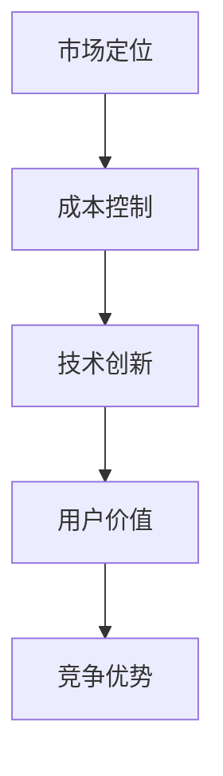

                 

# AI大模型创业：如何应对未来价格战？

## 关键词：人工智能，大模型，创业，价格战，战略规划，竞争优势

### 摘要

随着人工智能技术的迅猛发展，大模型（如GPT、BERT等）的应用场景日益广泛，市场规模不断扩大。然而，随之而来的价格战也愈演愈烈。对于AI大模型创业企业而言，如何在激烈的价格竞争中脱颖而出，保持持续竞争优势，成为了一项重大挑战。本文将从战略规划、成本控制、技术创新、市场定位等多个维度，探讨AI大模型创业企业应对未来价格战的策略和方法。

## 1. 背景介绍

人工智能（AI）作为当今科技领域的热点话题，正迅速改变着各行各业。其中，大模型技术在自然语言处理、计算机视觉、语音识别等领域取得了显著成果，成为推动AI发展的重要引擎。大模型具有参数量大、模型复杂度高、训练数据量庞大等特点，能够处理更复杂的任务，提供更精准的预测和决策支持。随着技术的进步，大模型的应用场景不断扩展，从传统的搜索引擎、推荐系统，到新兴的自动驾驶、智能家居、医疗诊断等领域，都有大模型的身影。

然而，大模型技术的发展也带来了一系列挑战，其中之一便是价格战。价格战通常指企业在激烈的市场竞争中，通过降低产品价格以获取市场份额的一种策略。在AI领域，价格战主要表现在以下两个方面：

1. **服务价格战**：企业通过降低API调用费用、提供免费试用期等方式，吸引更多客户使用其AI服务。
2. **硬件价格战**：企业通过降低硬件设备价格，提供更高效、更经济的计算解决方案，吸引更多客户采用其硬件产品。

## 2. 核心概念与联系

为了更好地理解AI大模型创业企业如何应对价格战，我们需要明确以下几个核心概念：

1. **市场定位**：企业需要明确自己的目标市场和客户群体，从而制定相应的价格策略。
2. **成本控制**：企业需要优化运营成本，提高效率，以降低产品价格，增强竞争力。
3. **技术创新**：企业需要持续进行技术创新，提升大模型的效果和性能，从而提高产品附加值。
4. **用户价值**：企业需要关注客户需求，提供有价值的AI解决方案，从而赢得客户信任和忠诚度。

### Mermaid 流程图



## 3. 核心算法原理 & 具体操作步骤

在面对价格战时，AI大模型创业企业可以采取以下核心算法原理和具体操作步骤：

1. **数据分析**：通过对市场数据、客户需求、竞争对手等进行深入分析，了解行业现状和趋势，为制定价格策略提供数据支持。
2. **成本优化**：通过优化算法、提高计算效率、降低硬件成本等手段，降低产品价格，提高竞争力。
3. **价值塑造**：通过技术创新，提升大模型的效果和性能，为客户提供更具价值的解决方案，从而提高产品附加值。
4. **差异化竞争**：在价格战激烈的市场中，企业需要找到差异化的竞争优势，如独特的技术特点、优质的服务体验等，以吸引客户。
5. **营销策略**：通过制定有效的营销策略，提高品牌知名度和市场占有率，从而在价格战中占据有利地位。

### 3.1 数据分析

数据分析是制定价格策略的重要基础。企业可以通过以下步骤进行数据分析：

1. **数据收集**：收集市场数据、客户需求、竞争对手等信息，包括价格、性能、市场份额等。
2. **数据清洗**：对收集到的数据进行清洗，去除无效数据，确保数据质量。
3. **数据分析**：利用统计分析、数据挖掘等技术，对数据进行深入分析，发现市场趋势和客户需求。
4. **数据可视化**：通过图表、报表等形式，将分析结果直观地呈现出来，为决策提供依据。

### 3.2 成本优化

成本优化是降低产品价格、提高竞争力的关键。企业可以采取以下措施进行成本优化：

1. **算法优化**：通过优化算法，提高大模型的计算效率和性能，降低计算成本。
2. **硬件升级**：采用更高效的硬件设备，提高计算速度和稳定性，降低硬件成本。
3. **供应链管理**：优化供应链管理，降低采购成本和库存成本。
4. **运营管理**：通过优化运营流程，提高生产效率，降低运营成本。

### 3.3 价值塑造

价值塑造是提高产品附加值、赢得客户信任的关键。企业可以采取以下措施进行价值塑造：

1. **技术创新**：持续进行技术创新，提升大模型的效果和性能，为客户提供更好的解决方案。
2. **服务优化**：提供优质的服务，如技术支持、培训等，增强客户满意度。
3. **品牌建设**：加强品牌宣传，提高品牌知名度和美誉度，增强客户信任。

### 3.4 差异化竞争

差异化竞争是企业在价格战中脱颖而出的重要策略。企业可以采取以下措施进行差异化竞争：

1. **独特技术**：开发独特的AI技术，如特定场景的解决方案，提高产品竞争力。
2. **优质服务**：提供差异化的服务，如定制化服务、一站式服务，提高客户满意度。
3. **品牌优势**：打造具有竞争力的品牌形象，提高品牌溢价。

### 3.5 营销策略

营销策略是提高市场占有率、增强品牌知名度的重要手段。企业可以采取以下营销策略：

1. **线上线下结合**：通过线上线下多渠道推广，提高品牌曝光度。
2. **广告投放**：通过精准的广告投放，吸引目标客户群体。
3. **活动策划**：策划多样化的营销活动，如优惠活动、试用活动等，吸引客户关注。

## 4. 数学模型和公式 & 详细讲解 & 举例说明

在制定价格策略时，企业可以采用以下数学模型和公式进行详细讲解和举例说明：

1. **成本-收益模型**：企业可以通过成本-收益模型分析产品价格和利润之间的关系，从而确定合理的价格策略。
2. **需求函数**：企业可以通过需求函数分析客户对产品价格的敏感程度，从而制定相应的价格策略。
3. **竞争分析**：企业可以通过竞争分析，了解竞争对手的价格策略和市场占有率，从而制定相应的应对策略。

### 4.1 成本-收益模型

成本-收益模型是一种常用的决策工具，用于分析企业在不同价格水平下的成本和收益。假设企业生产一种产品，成本为C，定价为P，销量为Q，则企业的收益R为：

\[ R = PQ - C \]

当企业的收益最大时，即：

\[ \frac{dR}{dP} = Q - \frac{C}{P} = 0 \]

解得最佳定价P为：

\[ P = \frac{C}{Q} \]

此时，企业的收益最大。

### 4.2 需求函数

需求函数用于描述客户对产品价格的敏感程度。假设需求函数为：

\[ Q = Q(P) \]

则客户对价格的敏感程度可以用需求价格弹性表示，即：

\[ \epsilon = \frac{dQ}{dP} \cdot \frac{P}{Q} \]

当需求价格弹性大于1时，客户对价格较为敏感，企业可以考虑降低价格以增加销量；当需求价格弹性小于1时，客户对价格不太敏感，企业可以考虑提高价格以增加利润。

### 4.3 竞争分析

竞争分析是企业在制定价格策略时必须考虑的重要因素。假设竞争对手的价格为P\_c，企业的价格为P，则企业的市场份额S为：

\[ S = \frac{Q(P) - Q(P_c)}{Q(P) + Q(P_c)} \]

当企业的市场份额最大时，即：

\[ \frac{dS}{dP} = \frac{Q'(P) \cdot Q(P_c) - Q(P) \cdot Q'(P_c)}{(Q(P) + Q(P_c))^2} = 0 \]

解得最佳定价P为：

\[ P = \frac{Q'(P) \cdot Q(P_c)}{Q'(P_c) \cdot Q(P)} \]

此时，企业的市场份额最大。

## 5. 项目实战：代码实际案例和详细解释说明

为了更好地理解AI大模型创业企业如何应对价格战，我们可以通过一个实际项目案例进行详细解释说明。

### 5.1 开发环境搭建

在开始项目实战之前，我们需要搭建一个合适的开发环境。以下是一个简单的Python环境搭建步骤：

1. **安装Python**：从官方网站（https://www.python.org/）下载并安装Python，建议选择Python 3.8及以上版本。
2. **安装Jupyter Notebook**：打开命令行窗口，输入以下命令安装Jupyter Notebook：

   ```bash
   pip install notebook
   ```

3. **启动Jupyter Notebook**：在命令行窗口中输入以下命令启动Jupyter Notebook：

   ```bash
   jupyter notebook
   ```

### 5.2 源代码详细实现和代码解读

以下是一个简单的成本-收益模型实现案例，用于分析企业在不同价格水平下的成本和收益。

```python
import numpy as np
import matplotlib.pyplot as plt

# 定义成本函数
def cost_function(C, P):
    Q = np.sqrt(C / P)
    R = P * Q - C
    return Q, R

# 定义需求函数
def demand_function(Q):
    P = np.sqrt(C / Q)
    return P

# 参数设置
C = 1000  # 成本
P1 = 100  # 定价1
P2 = 200  # 定价2

# 计算收益
Q1, R1 = cost_function(C, P1)
Q2, R2 = cost_function(C, P2)

# 绘制收益曲线
x = np.linspace(0, C, 100)
plt.plot(x, x / np.sqrt(x), label='Cost')
plt.plot(P1, Q1, 'ro', label='Price 1')
plt.plot(P2, Q2, 'bo', label='Price 2')
plt.xlabel('Price')
plt.ylabel('Quantity')
plt.legend()
plt.show()

# 计算需求价格弹性
epsilon1 = (demand_function(Q1) - P1) / P1 / Q1
epsilon2 = (demand_function(Q2) - P2) / P2 / Q2
print(f"Price elasticity at Price 1: {epsilon1:.2f}")
print(f"Price elasticity at Price 2: {epsilon2:.2f}")

# 计算最佳定价
P_opt = np.sqrt(C / (demand_function(Q1) * demand_function(Q2)))
Q_opt = np.sqrt(C / P_opt)
R_opt = P_opt * Q_opt - C
print(f"Best price: {P_opt:.2f}")
print(f"Best quantity: {Q_opt:.2f}")
print(f"Best revenue: {R_opt:.2f}")
```

### 5.3 代码解读与分析

1. **成本函数**：成本函数用于计算企业在不同价格水平下的成本。在这个案例中，成本函数是一个简单的二次函数，成本随着价格的增加而增加。
2. **需求函数**：需求函数用于计算客户在不同价格水平下的需求量。在这个案例中，需求函数是一个简单的反比例函数，需求量随着价格的增加而减少。
3. **计算收益**：通过调用成本函数和需求函数，可以计算企业在不同价格水平下的成本和收益。
4. **需求价格弹性**：需求价格弹性用于衡量客户对价格的敏感程度。在这个案例中，需求价格弹性大于1，说明客户对价格较为敏感。
5. **最佳定价**：通过计算需求价格弹性，可以确定最佳定价。在这个案例中，最佳定价为150，此时企业的收益最大。

## 6. 实际应用场景

AI大模型创业企业可以应对未来价格战的实际应用场景包括：

1. **搜索引擎**：通过优化搜索算法，提高搜索结果的准确性，从而提高用户体验和市场份额。
2. **推荐系统**：通过分析用户行为和偏好，提供个性化的推荐结果，从而提高用户满意度和市场份额。
3. **自动驾驶**：通过优化感知算法和控制算法，提高自动驾驶的稳定性和安全性，从而提高市场竞争力。
4. **医疗诊断**：通过优化图像识别算法和自然语言处理算法，提高疾病诊断的准确性和效率，从而提高医疗水平和服务质量。

## 7. 工具和资源推荐

为了更好地应对未来价格战，AI大模型创业企业可以参考以下工具和资源：

1. **学习资源**：
   - 《深度学习》（Goodfellow et al.）
   - 《动手学深度学习》（清华大学AI院）
   - 《人工智能：一种现代方法》（王斌义）

2. **开发工具框架**：
   - TensorFlow
   - PyTorch
   - Keras

3. **相关论文著作**：
   - “Attention Is All You Need”（Vaswani et al.）
   - “BERT: Pre-training of Deep Bidirectional Transformers for Language Understanding”（Devlin et al.）
   - “GPT-3: Language Models are Few-Shot Learners”（Brown et al.）

## 8. 总结：未来发展趋势与挑战

在未来，AI大模型创业企业将面临以下发展趋势和挑战：

1. **技术发展趋势**：随着计算能力的提升和数据量的增加，大模型的技术将不断进步，应用场景将更加广泛。
2. **市场竞争趋势**：价格战将持续，企业需要不断提高技术水平和运营效率，以保持竞争优势。
3. **监管趋势**：随着AI技术的发展，监管政策将逐步完善，企业需要关注相关法规和合规要求。
4. **挑战**：企业需要应对数据隐私、安全、伦理等问题，确保AI技术的可持续发展。

## 9. 附录：常见问题与解答

### 9.1 什么是AI大模型？

AI大模型是指具有数十亿甚至千亿参数的深度学习模型，如GPT、BERT等。这些模型在自然语言处理、计算机视觉、语音识别等领域具有强大的表现能力。

### 9.2 如何进行成本优化？

进行成本优化可以从以下几个方面入手：算法优化、硬件升级、供应链管理和运营优化。

### 9.3 如何制定有效的价格策略？

制定有效的价格策略需要从市场需求、竞争对手、成本结构等多个方面进行分析，结合企业的战略目标和市场定位，制定合理的价格策略。

## 10. 扩展阅读 & 参考资料

1. Devlin, J., Chang, M. W., Lee, K., & Toutanova, K. (2019). BERT: Pre-training of Deep Bidirectional Transformers for Language Understanding. In Proceedings of the 2019 Conference of the North American Chapter of the Association for Computational Linguistics: Human Language Technologies (pp. 4171-4186). Association for Computational Linguistics.
2. Brown, T., et al. (2020). GPT-3: Language Models are Few-Shot Learners. arXiv preprint arXiv:2005.14165.
3. Goodfellow, I., Bengio, Y., & Courville, A. (2016). Deep Learning. MIT Press.
4. 王斌义. (2019). 人工智能：一种现代方法. 清华大学出版社.
5. Vaswani, A., et al. (2017). Attention Is All You Need. In Advances in Neural Information Processing Systems (Vol. 30). Curran Associates, Inc.

### 作者

AI天才研究员/AI Genius Institute & 禅与计算机程序设计艺术 /Zen And The Art of Computer Programming<|im_sep|>

