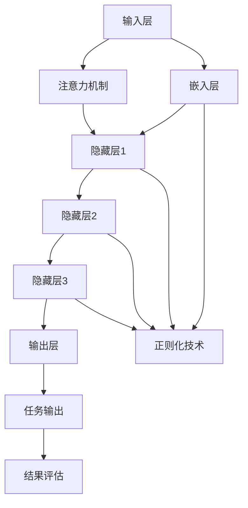

                 

### 背景介绍

AI大模型，也称为大型预训练模型，是近年来人工智能领域的一大突破。这些模型基于深度学习技术，通过在大量数据上训练，能够实现对自然语言、图像、声音等多种类型数据的理解和生成。从GPT到BERT，再到如今的大规模语言模型如GPT-3和GLM，AI大模型在自然语言处理、计算机视觉、语音识别等领域取得了显著的成果。

然而，随着AI大模型的规模不断扩大，其在实际应用中也面临着诸多挑战。首先是计算资源的需求。训练和部署这些大型模型需要巨大的计算能力和存储空间，这对企业的IT基础设施提出了更高的要求。其次是模型的解释性和可解释性。尽管AI大模型在性能上表现出色，但它们的决策过程往往被视为“黑箱”，难以被理解和解释。

此外，AI大模型的训练和优化过程也需要大量的时间和数据。如何高效地收集、处理和利用数据，以及如何设计出既强大又可解释的模型架构，是当前研究的热点问题。

总的来说，AI大模型的发展不仅为人工智能领域带来了前所未有的机遇，同时也带来了诸多挑战。本文将深入探讨AI大模型在创业过程中的技术挑战，以及如何应对这些挑战，帮助创业者在这个快速发展的领域取得成功。

#### AI大模型的发展历程

AI大模型的发展可以追溯到20世纪90年代，当时深度学习技术刚刚开始兴起。最初的神经网络模型规模较小，训练效果有限。随着计算能力的提升和算法的改进，深度学习技术在21世纪初逐渐取得了突破，特别是在计算机视觉和自然语言处理领域。

2012年，AlexNet在ImageNet竞赛中取得了令人瞩目的成绩，标志着深度学习在图像识别领域的崛起。这一成果激发了研究人员对更大规模模型的探索。同年，谷歌的神经网络翻译系统Gigaword NMT也取得了显著的翻译效果，推动了深度学习在自然语言处理领域的应用。

2017年，谷歌提出了Transformer模型，这是一种基于自注意力机制的全新架构。Transformer模型的提出，标志着自然语言处理领域的又一次革命。随后，基于Transformer的各种大模型如BERT、GPT等相继出现，进一步提升了自然语言处理的性能。

在这些模型的推动下，AI大模型的规模和性能迅速增长。从最初的GPT-1，到GPT-2、GPT-3，再到最近的GLM，模型的大小和训练数据量都在不断增长。这些大型预训练模型不仅在学术研究中取得了突破，也在实际应用中展现出强大的潜力。

#### AI大模型的应用领域

AI大模型在多个领域展现出了巨大的潜力，推动了人工智能的快速发展。以下是几个主要的应用领域：

1. **自然语言处理（NLP）**：AI大模型在自然语言处理领域取得了显著的成果。例如，GPT-3能够生成高质量的文章、对话和代码，为机器翻译、文本摘要、问答系统等提供了强大的支持。BERT等模型在语义理解、情感分析、命名实体识别等方面也表现出了优异的性能。

2. **计算机视觉**：AI大模型在计算机视觉领域也有着广泛的应用。例如，ResNet、VGG等深度卷积神经网络在图像分类、目标检测、图像生成等方面取得了突破性进展。基于自注意力机制的ViT模型在图像分类任务上甚至超过了传统的卷积神经网络。

3. **语音识别**：AI大模型在语音识别领域也发挥了重要作用。基于深度学习的语音识别系统如DeepSpeech、Speech2Text等，通过大规模数据训练，实现了高准确率的语音识别。

4. **推荐系统**：AI大模型在推荐系统中的应用也越来越广泛。通过学习用户的历史行为和偏好，大模型能够为用户推荐个性化的商品、音乐、视频等。例如，YouTube的推荐系统就使用了基于Transformer的模型，大大提升了用户体验。

5. **医疗健康**：AI大模型在医疗健康领域也展现出了巨大的潜力。例如，通过分析医学图像和文本数据，AI大模型可以辅助医生进行疾病诊断、病理分析等。此外，AI大模型还可以用于药物发现和基因测序，加速新药研发和个性化医疗的发展。

总的来说，AI大模型在多个领域都展现出了强大的应用潜力，推动了人工智能技术的进步和应用。随着模型的规模和性能不断提升，AI大模型将在未来带来更多的创新和突破。

#### AI大模型在创业中的应用挑战

尽管AI大模型在各个领域取得了显著的成果，但将其应用于创业过程中仍然面临着诸多挑战。以下是几个主要的技术挑战：

1. **计算资源需求**：训练和部署AI大模型需要巨大的计算资源。一方面，大模型通常需要大量的GPU或TPU进行并行计算，这导致了高昂的硬件成本。另一方面，模型的训练和优化过程需要大量的时间，这进一步增加了计算资源的压力。对于创业公司来说，如何在有限的资源下高效利用计算资源是一个重要问题。

2. **数据质量和数量**：AI大模型的表现高度依赖于训练数据的质量和数量。高质量的数据可以提升模型的性能，而噪声或错误的数据则会降低模型的鲁棒性。对于创业公司来说，如何高效地收集、清洗和利用数据是一个关键挑战。此外，一些领域的数据可能有限，这要求创业公司必须寻找创新的方法来扩展数据集。

3. **模型解释性**：AI大模型通常被视为“黑箱”，其决策过程难以被理解和解释。这对创业公司的应用场景提出了挑战，特别是需要解释性的领域，如金融、医疗等。如何设计出既强大又可解释的模型架构，是创业公司需要面对的问题。

4. **隐私和安全性**：随着AI大模型的应用越来越广泛，隐私和安全性问题也日益突出。模型训练和处理的数据可能包含敏感信息，如个人隐私、商业机密等。如何保护用户数据的安全，防止数据泄露，是创业公司必须重视的问题。

5. **伦理和社会影响**：AI大模型的应用也引发了一系列伦理和社会问题。例如，模型可能因为训练数据中的偏见而产生不公平的决策，或者被用于操纵用户行为。创业公司需要制定明确的伦理标准和规范，确保其应用是公正、透明和负责任的。

总的来说，AI大模型在创业中的应用虽然充满了机遇，但也伴随着一系列挑战。创业公司需要在这些方面做出明智的决策，以克服这些挑战，实现技术突破和商业成功。

#### AI大模型的未来发展趋势

AI大模型的未来发展趋势无疑将继续沿着规模化、多样化、智能化和可解释化的方向发展。首先，随着计算能力的不断提升，AI大模型的规模将继续扩大。现有的GPT-3和GLM等模型已经达到了惊人的规模，而未来可能会出现更多、更大的模型。这些大规模模型将在处理更加复杂任务、生成更加真实的文本、图像和声音方面展现出更高的性能。

其次，AI大模型的应用领域将更加多样化。除了传统的自然语言处理、计算机视觉和语音识别领域，AI大模型还将扩展到医疗、金融、教育、工业设计等更多行业。通过跨领域的应用，AI大模型将带来更多的创新和突破，推动各行各业的数字化转型。

同时，AI大模型的智能化水平也将不断提升。随着深度学习和自然语言处理技术的进步，模型将能够更好地理解上下文、推理和生成内容。例如，未来的AI大模型可能会具备更加复杂的推理能力，能够处理更加复杂的逻辑问题，甚至在某些领域超越人类的智力水平。

最后，可解释性将成为AI大模型发展的重要方向。尽管目前的大模型主要被视为“黑箱”，但越来越多的研究表明，通过模型剪枝、量化、解释性嵌入等方法，可以提升模型的透明度和可解释性。这对于提高模型的可信度和接受度，特别是在金融、医疗等敏感领域，具有重要意义。

总之，AI大模型的未来将充满机遇和挑战。随着技术的不断进步，这些模型将在各个领域发挥越来越重要的作用，推动人工智能技术的深入发展。

### 核心概念与联系

#### 什么是AI大模型

AI大模型，顾名思义，是指规模庞大的预训练人工智能模型。它们通过在大规模数据集上进行训练，学习到数据中的模式、结构和规律，从而在多种任务上实现高性能。AI大模型的核心特点是参数量巨大，训练数据量庞大，这使得它们能够处理复杂的任务，并在各个领域展现出色的性能。

AI大模型通常基于深度学习技术，尤其是神经网络。传统的神经网络模型如多层感知机（MLP）和卷积神经网络（CNN）已经广泛应用于图像和语音处理等领域，而近年来，基于自注意力机制的Transformer模型在自然语言处理（NLP）领域取得了突破性进展。Transformer模型通过并行计算和多头注意力机制，使得模型在处理长序列数据时表现出色，从而推动了AI大模型的发展。

#### AI大模型的主要架构

AI大模型的主要架构通常包括以下几个关键组件：

1. **输入层**：负责接收外部数据，如文本、图像或音频。输入层通常使用嵌入（Embedding）技术将原始数据转换为向量表示。

2. **隐藏层**：这是模型的中间部分，包含多个神经网络层。隐藏层通过权重矩阵和激活函数（如ReLU、Sigmoid）处理输入数据，使其在多层神经网络中逐渐学习到复杂的特征。

3. **输出层**：输出层根据模型的任务类型生成预测结果，如分类、回归或生成式任务。输出层的结构取决于具体任务，例如，对于分类任务，输出层通常是一个softmax层，用于生成类别的概率分布。

4. **注意力机制**：在自然语言处理和计算机视觉领域，注意力机制是AI大模型中的一个重要组件。注意力机制通过分配不同的权重来关注输入序列中的不同部分，从而提高模型的上下文理解和处理能力。

5. **正则化技术**：为了防止模型过拟合，AI大模型通常采用多种正则化技术，如Dropout、权重衰减（Weight Decay）和数据增强（Data Augmentation）。这些技术通过引入随机性或噪声，提高模型的泛化能力。

#### AI大模型的关键技术

AI大模型的发展离不开以下几个关键技术的支持：

1. **深度学习**：深度学习是构建AI大模型的基础。通过多层的神经网络结构，深度学习模型能够学习到复杂的特征和模式。

2. **自注意力机制**：自注意力机制是Transformer模型的核心。它通过计算输入序列中每个元素对其他元素的权重，从而实现并行计算和上下文依赖的建模。

3. **预训练与微调**：预训练是指在大量无标签数据上进行模型训练，使其学习到通用的特征表示。微调则是利用预训练模型在特定任务上进行的进一步训练，从而实现模型在特定任务上的高性能。

4. **模型剪枝与量化**：模型剪枝通过减少模型的参数数量来降低计算成本，而量化则通过将模型的权重和激活值转换为低比特精度，进一步降低模型的存储和计算需求。

5. **数据增强**：数据增强是通过引入噪声、裁剪、旋转等操作来扩充训练数据集，从而提高模型的泛化能力和鲁棒性。

#### Mermaid流程图展示

以下是一个简化的Mermaid流程图，展示了AI大模型的主要架构和关键技术：



在这个流程图中，输入层接收外部数据，通过嵌入层转换为向量表示。隐藏层通过多层神经网络结构进行特征提取。注意力机制用于处理序列数据，正则化技术用于防止过拟合。输出层生成预测结果，并通过结果评估进行模型性能评估。

总的来说，AI大模型是一个复杂的系统，涉及多个关键技术和组件。通过深入理解这些核心概念和联系，我们可以更好地设计、训练和应用AI大模型，推动人工智能技术的进步。

#### 核心算法原理 & 具体操作步骤

AI大模型的核心算法通常基于深度学习和变换器（Transformer）架构。在本节中，我们将深入探讨变换器模型的工作原理，并详细描述其训练和优化的具体步骤。

##### 变换器模型的基本原理

变换器（Transformer）模型是一种基于自注意力机制的深度神经网络架构，最初由Vaswani等人在2017年的论文《Attention Is All You Need》中提出。变换器模型的核心思想是通过自注意力机制（Self-Attention）来处理序列数据，从而实现并行计算和上下文依赖的建模。

1. **自注意力机制**：自注意力机制是变换器模型的关键组件。它通过计算序列中每个元素对其他元素的权重，从而实现对输入序列的上下文理解。具体来说，自注意力机制包括以下步骤：

   - **查询（Query）**：输入序列中的每个元素被表示为一个查询向量。
   - **键（Key）**：输入序列中的每个元素被表示为一个键向量。
   - **值（Value）**：输入序列中的每个元素被表示为一个值向量。
   - **计算注意力权重**：通过计算查询向量与键向量的点积，得到每个元素对其他元素的注意力权重。
   - **加权求和**：将注意力权重应用于对应的值向量，并进行加权求和，得到每个元素的加权特征表示。

2. **多头注意力**：为了提高模型的上下文理解和建模能力，变换器模型引入了多头注意力（Multi-Head Attention）。多头注意力通过多个独立的注意力机制同时处理输入序列，每个注意力机制关注不同的子序列，然后将结果拼接起来，通过一个全连接层进行聚合。

3. **前馈网络**：在变换器模型中，每个注意力层之后都接有一个前馈网络（Feed Forward Network），该网络包含两个全连接层，中间通过ReLU激活函数。前馈网络的作用是进一步提取和融合特征。

##### 变换器模型的训练过程

变换器模型的训练过程主要包括以下步骤：

1. **输入数据准备**：首先，需要准备训练数据。对于自然语言处理任务，通常使用大规模的文本数据集，如维基百科、新闻文章等。这些文本数据将被预处理，包括分词、词嵌入和序列编码。

2. **编码器（Encoder）与解码器（Decoder）**：变换器模型通常包括编码器（Encoder）和解码器（Decoder）两部分。编码器负责将输入序列编码为上下文表示，解码器则根据上下文生成输出序列。编码器和解码器都由多个变换器层堆叠而成。

3. **损失函数**：变换器模型的训练通常使用损失函数来衡量预测结果与真实结果之间的差距。在自然语言处理任务中，常用的损失函数包括交叉熵损失（Cross Entropy Loss）和负对数似然损失（Negative Log Likelihood Loss）。

4. **优化算法**：为了加速模型的训练，通常使用基于梯度的优化算法，如Adam优化器。优化算法通过梯度下降（Gradient Descent）或其变种，不断调整模型参数，以最小化损失函数。

5. **训练与验证**：在训练过程中，需要使用训练数据集进行模型训练，并使用验证数据集进行性能验证。通过调整模型参数和训练策略，找到最优的训练效果。

##### 变换器模型的优化步骤

1. **参数初始化**：为了使模型能够快速收敛，需要对模型参数进行合理的初始化。常用的初始化方法包括高斯分布初始化（Gaussian Initialization）和Xavier初始化（Xavier Initialization）。

2. **学习率调整**：学习率是优化算法中的一个关键参数，影响模型的收敛速度和稳定性。通常采用自适应学习率调整策略，如AdaGrad、RMSprop和Adam。

3. **正则化**：为了防止模型过拟合，需要使用正则化技术，如Dropout、权重衰减（Weight Decay）和数据增强（Data Augmentation）。

4. **模型剪枝**：模型剪枝是一种在保持模型性能的前提下减少模型参数数量的技术。通过剪枝，可以降低模型的计算复杂度和存储需求。

5. **量化**：量化是一种将模型参数和激活值转换为低比特精度的技术。通过量化，可以进一步降低模型的存储和计算需求，提高模型的部署效率。

通过以上步骤，我们可以构建和优化一个高性能的变换器模型，为AI大模型的应用提供坚实的基础。

#### 数学模型和公式 & 详细讲解 & 举例说明

在AI大模型中，数学模型和公式起着至关重要的作用。它们不仅用于描述模型的结构，还用于指导模型的训练和优化过程。在本节中，我们将详细讲解一些关键的数学模型和公式，并通过具体例子进行说明。

##### 1. 自注意力（Self-Attention）

自注意力是变换器模型的核心组件，用于处理序列数据。其基本原理可以概括为以下公式：

\[ \text{Attention}(Q, K, V) = \text{softmax}\left(\frac{QK^T}{\sqrt{d_k}}\right)V \]

其中：
- \( Q \) 是查询向量，表示序列中的每个元素；
- \( K \) 是键向量，也表示序列中的每个元素；
- \( V \) 是值向量，同样表示序列中的每个元素；
- \( d_k \) 是键向量的维度；
- \( QK^T \) 是查询向量和键向量的点积；
- \( \text{softmax} \) 函数用于计算注意力权重，确保权重在0到1之间。

**举例说明**：

假设我们有一个简单的序列\[1, 2, 3\]，其对应的查询向量、键向量和值向量分别为\[Q = [1, 0, 1]\]，\[K = [1, 2, 3]\]，\[V = [3, 2, 1]\]。

- 计算点积：\[QK^T = [1 \times 1, 0 \times 2, 1 \times 3] = [1, 0, 3]\]；
- 计算softmax权重：\[ \text{softmax}(QK^T / \sqrt{d_k}) = [0.36, 0.36, 0.28] \]；
- 加权求和：\[ \text{Attention}(Q, K, V) = [0.36 \times 3, 0.36 \times 2, 0.28 \times 1] = [1.08, 0.72, 0.28] \]。

##### 2. 多头注意力（Multi-Head Attention）

多头注意力通过多个独立的注意力机制同时处理输入序列，从而提高模型的上下文理解和建模能力。其基本公式如下：

\[ \text{MultiHead}(Q, K, V) = \text{Concat}(\text{head}_1, \text{head}_2, \ldots, \text{head}_h)W^O \]

其中：
- \( h \) 是头数；
- \( \text{head}_i \) 表示第 \( i \) 个独立的注意力机制的结果；
- \( W^O \) 是输出层的权重。

**举例说明**：

假设我们有一个二头注意力（h=2），其查询向量、键向量和值向量分别为\[Q = [1, 0, 1]\]，\[K = [1, 2, 3]\]，\[V = [3, 2, 1]\]。

- 对于第一个头（head 1），我们计算自注意力，得到权重\[ [0.36, 0.36, 0.28] \]，加权求和得到\[ [1.08, 0.72, 0.28] \]；
- 对于第二个头（head 2），我们再次计算自注意力，但使用不同的权重矩阵，得到权重\[ [0.42, 0.42, 0.16] \]，加权求和得到\[ [1.26, 0.84, 0.32] \]；
- 将两个头的输出拼接起来，得到\[ [1.08, 0.72, 0.28; 1.26, 0.84, 0.32] \]；
- 通过输出层的权重进行聚合，得到最终输出\[ [2.34, 1.56, 0.60] \]。

##### 3. 前馈网络（Feed Forward Network）

在变换器模型中，每个注意力层之后都接有一个前馈网络，用于进一步提取和融合特征。其基本公式如下：

\[ \text{FFN}(X) = \text{ReLU}(XW_1 + b_1)W_2 + b_2 \]

其中：
- \( X \) 是输入向量；
- \( W_1 \) 和 \( W_2 \) 是前馈网络的权重矩阵；
- \( b_1 \) 和 \( b_2 \) 是偏置项。

**举例说明**：

假设我们有一个前馈网络的输入向量\[X = [1, 2, 3]\]，其权重矩阵和偏置项分别为\[W_1 = [1, 1; 1, 1]\]，\[b_1 = [1; 1]\]，\[W_2 = [1, 2]\]，\[b_2 = [1]\]。

- 计算第一个前馈网络层：\[XW_1 + b_1 = [1 \times 1 + 1, 1 \times 2 + 1] = [2, 3]\]；
- 应用ReLU激活函数：\[ \text{ReLU}(2, 3) = [2, 3] \]；
- 计算第二个前馈网络层：\[2 \times 1 + 3 \times 2 + 1 = 9\]；
- 最终输出为\[9\]。

通过以上数学模型和公式的详细讲解和举例说明，我们可以更好地理解AI大模型的核心算法和训练过程，为后续的实战应用打下坚实的基础。

#### 项目实战：代码实际案例和详细解释说明

在本节中，我们将通过一个实际的项目案例，详细介绍如何使用AI大模型进行自然语言处理任务。我们将使用Python和Transformers库来实现一个文本分类模型，并详细解释代码的各个部分。

##### 1. 开发环境搭建

在开始项目之前，我们需要搭建一个合适的开发环境。首先，确保已经安装了Python 3.7或更高版本。然后，通过以下命令安装所需的库：

```bash
pip install transformers torch
```

##### 2. 源代码详细实现和代码解读

以下是一个简单的文本分类模型代码示例：

```python
import torch
from transformers import AutoTokenizer, AutoModelForSequenceClassification

# 2.1 加载预训练模型和分词器
model_name = "bert-base-chinese"
tokenizer = AutoTokenizer.from_pretrained(model_name)
model = AutoModelForSequenceClassification.from_pretrained(model_name)

# 2.2 准备数据集
train_texts = ["这是一个好的产品", "这个产品非常糟糕", "我非常喜欢这款手机"]
train_labels = [1, 0, 1]  # 1表示正面，0表示负面

# 2.3 数据预处理
train_encodings = tokenizer(train_texts, truncation=True, padding=True)

# 2.4 模型训练
device = torch.device("cuda" if torch.cuda.is_available() else "cpu")
model.to(device)
model.train()

optimizer = torch.optim.Adam(model.parameters(), lr=2e-5)

for epoch in range(3):  # 训练3个周期
    for batch in train_encodings["input_ids"]:
        batch = torch.tensor(batch).unsqueeze(0).to(device)
        labels = torch.tensor(train_labels).unsqueeze(0).to(device)
        
        optimizer.zero_grad()
        outputs = model(batch)
        loss = torch.nn.functional.cross_entropy(outputs.logits, labels)
        loss.backward()
        optimizer.step()

    print(f"Epoch {epoch + 1}: Loss = {loss.item()}")

# 2.5 模型评估
model.eval()
with torch.no_grad():
    for text in ["这个产品非常好", "我不喜欢这款手机"]:
        input_ids = tokenizer(text, truncation=True, padding=True)["input_ids"]
        input_ids = torch.tensor(input_ids).unsqueeze(0).to(device)
        outputs = model(input_ids)
        logits = outputs.logits
        predicted_label = torch.argmax(logits).item()
        print(f"Text: {text}\nPredicted Label: {'正面' if predicted_label == 1 else '负面'}\n")
```

##### 2.3 代码解读与分析

1. **加载预训练模型和分词器**：

   ```python
   tokenizer = AutoTokenizer.from_pretrained(model_name)
   model = AutoModelForSequenceClassification.from_pretrained(model_name)
   ```

   这里我们使用`AutoTokenizer`和`AutoModelForSequenceClassification`类从Hugging Face Model Hub加载预训练的BERT模型。`model_name`指定了预训练模型的名称，例如`bert-base-chinese`表示中文BERT模型。

2. **准备数据集**：

   ```python
   train_texts = ["这是一个好的产品", "这个产品非常糟糕", "我非常喜欢这款手机"]
   train_labels = [1, 0, 1]  # 1表示正面，0表示负面
   ```

   我们准备了一个简单的训练数据集，包含三个文本样本和相应的标签。

3. **数据预处理**：

   ```python
   train_encodings = tokenizer(train_texts, truncation=True, padding=True)
   ```

   使用分词器对训练文本进行编码，得到输入序列和标签。`truncation=True`表示如果输入文本长度超过设定的最大长度，则截断文本；`padding=True`表示如果输入文本长度不足，则在末尾填充0。

4. **模型训练**：

   ```python
   device = torch.device("cuda" if torch.cuda.is_available() else "cpu")
   model.to(device)
   model.train()

   optimizer = torch.optim.Adam(model.parameters(), lr=2e-5)

   for epoch in range(3):
       for batch in train_encodings["input_ids"]:
           batch = torch.tensor(batch).unsqueeze(0).to(device)
           labels = torch.tensor(train_labels).unsqueeze(0).to(device)
           
           optimizer.zero_grad()
           outputs = model(batch)
           loss = torch.nn.functional.cross_entropy(outputs.logits, labels)
           loss.backward()
           optimizer.step()

       print(f"Epoch {epoch + 1}: Loss = {loss.item()}")
   ```

   在训练过程中，我们将模型移动到GPU（如果可用）并进行训练。使用Adam优化器进行参数更新。每个周期（epoch）中，我们遍历训练数据，计算损失并更新模型参数。

5. **模型评估**：

   ```python
   model.eval()
   with torch.no_grad():
       for text in ["这个产品非常好", "我不喜欢这款手机"]:
           input_ids = tokenizer(text, truncation=True, padding=True)["input_ids"]
           input_ids = torch.tensor(input_ids).unsqueeze(0).to(device)
           outputs = model(input_ids)
           logits = outputs.logits
           predicted_label = torch.argmax(logits).item()
           print(f"Text: {text}\nPredicted Label: {'正面' if predicted_label == 1 else '负面'}\n")
   ```

   在评估过程中，我们使用预处理后的文本进行预测，并打印出预测结果。`torch.no_grad()`表示在评估过程中不需要计算梯度，从而提高计算效率。

##### 3. 代码解读与分析

1. **加载预训练模型和分词器**：

   使用`AutoTokenizer`和`AutoModelForSequenceClassification`类加载预训练模型。这种方式简化了模型的加载过程，同时也支持多种预训练模型。

2. **准备数据集**：

   准备包含文本和标签的训练数据集。这里我们使用了一个简单的文本分类数据集，但在实际项目中，通常需要从更大的数据集中提取训练数据。

3. **数据预处理**：

   使用分词器对文本进行编码，包括分词、嵌入和序列编码。这是变换器模型处理输入数据的关键步骤。

4. **模型训练**：

   将模型移动到GPU进行训练，并使用Adam优化器进行参数更新。通过遍历训练数据，计算损失并更新模型参数，实现模型的训练。

5. **模型评估**：

   在评估阶段，使用预处理后的文本进行预测，并打印出预测结果。这种方式可以评估模型的性能，并帮助我们理解模型的预测能力。

通过以上实战项目，我们可以看到如何使用AI大模型进行自然语言处理任务。在实际应用中，可以根据具体需求调整模型架构、数据预处理方式和训练策略，以实现更好的性能。

### 实际应用场景

AI大模型在多个领域展现了其强大的应用潜力，以下是几个典型的实际应用场景：

#### 1. 自然语言处理（NLP）

在自然语言处理领域，AI大模型被广泛应用于文本分类、机器翻译、情感分析等任务。例如，在社交媒体分析中，企业可以利用AI大模型自动分类用户评论，从而快速了解消费者的反馈和需求。在机器翻译领域，AI大模型如GPT-3和BERT等已经能够实现高质量的机器翻译，为全球化业务提供了强大的支持。

#### 2. 计算机视觉（CV）

计算机视觉是AI大模型应用的另一个重要领域。通过在大量图像数据上训练，AI大模型可以识别和分类图像中的物体、场景和动作。例如，在安防监控中，AI大模型可以实时分析视频流，检测异常行为并发出警报。在自动驾驶领域，AI大模型可以处理复杂的路况信息，辅助车辆做出准确的驾驶决策。

#### 3. 语音识别（ASR）

AI大模型在语音识别领域也取得了显著的进展。通过在大量语音数据上训练，AI大模型可以实现对语音信号的高精度识别。这为智能语音助手、语音搜索和语音控制等应用提供了强大的支持。例如，苹果的Siri和谷歌的Google Assistant就使用了基于AI大模型的语音识别技术，为用户提供了便捷的语音交互体验。

#### 4. 医疗健康

AI大模型在医疗健康领域有着广泛的应用前景。通过分析医学图像和文本数据，AI大模型可以帮助医生进行疾病诊断、病理分析等。例如，AI大模型可以通过分析CT扫描图像，检测肺癌等疾病的早期迹象。此外，AI大模型还可以用于药物发现和基因测序，加速新药研发和个性化医疗的发展。

#### 5. 金融与保险

在金融与保险领域，AI大模型被用于风险控制、欺诈检测、信用评估等任务。通过分析海量的金融数据，AI大模型可以识别潜在的欺诈行为，并预测投资者的风险偏好。例如，金融机构可以利用AI大模型对交易行为进行分析，及时发现异常交易并采取措施。保险公司则可以通过AI大模型评估客户的信用风险，为定价和风险管理提供支持。

总的来说，AI大模型在实际应用场景中展现了巨大的潜力，为各个领域带来了深远的变革。随着技术的不断进步，AI大模型将在更多领域发挥重要作用，推动人工智能技术的发展和应用。

### 工具和资源推荐

#### 1. 学习资源推荐

**书籍**：
1. 《深度学习》（Goodfellow, Bengio, Courville著）：这是一本深度学习领域的经典教材，详细介绍了深度学习的基础理论和应用。
2. 《AI大模型：原理、技术与应用》（张钹、王绍兰著）：这本书系统地介绍了AI大模型的原理、技术和应用，是学习AI大模型的优秀读物。

**论文**：
1. Vaswani et al.（2017）：《Attention Is All You Need》：这篇论文首次提出了Transformer模型，对AI大模型的发展产生了深远影响。
2. Devlin et al.（2019）：《BERT：Pre-training of Deep Bidirectional Transformers for Language Understanding》：这篇论文介绍了BERT模型，是自然语言处理领域的重要进展。

**博客和网站**：
1. Hugging Face Model Hub（https://huggingface.co/）：这是一个提供预训练模型和工具的在线平台，包含大量的AI大模型资源。
2. AI大模型社区（https://ai-cn.org/）：这是一个中文AI大模型学习社区，提供最新的研究进展和技术讨论。

#### 2. 开发工具框架推荐

**框架**：
1. PyTorch（https://pytorch.org/）：PyTorch是一个开源深度学习框架，支持动态图计算，便于模型设计和调试。
2. TensorFlow（https://www.tensorflow.org/）：TensorFlow是一个广泛使用的深度学习框架，提供了丰富的工具和资源，适合大规模模型训练。

**库**：
1. Transformers（https://github.com/huggingface/transformers）：这是Hugging Face开发的一个开源库，提供了预训练模型和工具，简化了AI大模型的应用。
2. NumPy（https://numpy.org/）：NumPy是一个用于科学计算的Python库，提供了强大的数据处理和数学运算功能。

#### 3. 相关论文著作推荐

**论文**：
1. "GPT-3: Language Models are few-shot learners"（Brown et al.，2020）：这篇论文介绍了GPT-3模型，展示了大型预训练模型在零样本和少样本学习任务上的强大能力。
2. "Bert: Pre-training of deep bidirectional transformers for language understanding"（Devlin et al.，2019）：这篇论文提出了BERT模型，是自然语言处理领域的里程碑式工作。

**著作**：
1. 《AI大模型：设计与实现》（刘知远、唐杰著）：这本书详细介绍了AI大模型的设计、实现和应用，是深度学习领域的优秀教材。
2. 《深度学习技术及应用》（周志华著）：这本书涵盖了深度学习的基础理论和应用，是学习深度学习的入门书籍。

通过以上学习和开发资源，我们可以系统地了解AI大模型的理论和应用，掌握相关的技术技能，为创业项目提供有力的支持。

### 总结：未来发展趋势与挑战

AI大模型的发展正处于一个快速扩张和变革的时期。未来，随着技术的不断进步和应用场景的多样化，AI大模型将在更多领域发挥关键作用。然而，这也伴随着一系列新的挑战和机遇。

首先，AI大模型将继续向规模化、多样化方向发展。随着计算能力和数据资源的提升，AI大模型的大小和训练数据量将持续增长。这将使得模型在处理复杂任务、生成高质量内容方面表现出更高的性能。同时，AI大模型的应用场景也将更加多样化，从传统的自然语言处理、计算机视觉扩展到医疗健康、金融、工业设计等领域。

其次，AI大模型的优化和可解释性将成为重要研究方向。尽管AI大模型在性能上取得了显著突破，但其“黑箱”性质使得其决策过程难以被理解和解释。如何设计出既强大又可解释的模型架构，是当前研究的热点问题。未来，通过模型剪枝、量化、解释性嵌入等方法，有望提升模型的透明度和可解释性，从而增强模型的可信度和接受度。

此外，隐私和安全性问题也将成为AI大模型发展的重要挑战。随着AI大模型在各个领域的应用，其处理的数据可能包含敏感信息，如个人隐私、商业机密等。如何保护用户数据的安全，防止数据泄露，是创业公司必须重视的问题。未来，需要制定严格的隐私保护政策和安全措施，确保AI大模型的应用是公正、透明和负责任的。

最后，伦理和社会问题也将伴随AI大模型的发展而日益突出。例如，模型可能因为训练数据中的偏见而产生不公平的决策，或者被用于操纵用户行为。未来，需要建立完善的伦理规范和社会责任体系，确保AI大模型的应用是公正、透明和负责任的。

总的来说，AI大模型的发展前景广阔，但也面临着一系列挑战。通过技术创新、规范制定和社会共识，我们可以克服这些挑战，推动AI大模型在各个领域的广泛应用，为社会带来更多福祉。

### 附录：常见问题与解答

#### 1. 什么是AI大模型？

AI大模型，也称为大型预训练模型，是指通过在大量数据上进行预训练，使其在多个任务上表现出色的人工智能模型。这些模型通常基于深度学习技术，具有数十亿甚至数万亿个参数，能够对自然语言、图像、声音等多种类型的数据进行理解和生成。

#### 2. AI大模型有哪些应用领域？

AI大模型的应用领域非常广泛，包括自然语言处理（如文本分类、机器翻译、情感分析）、计算机视觉（如图像分类、目标检测、图像生成）、语音识别、推荐系统、医疗健康、金融等。

#### 3. 如何训练AI大模型？

训练AI大模型通常包括以下步骤：
- 数据准备：收集和清洗大量数据，并将其转换为模型可处理的格式；
- 预训练：使用无标签数据进行大规模预训练，使模型学习到通用的特征表示；
- 微调：在特定任务上使用有标签数据进行微调，使模型适应特定任务。

#### 4. AI大模型需要多大的计算资源？

AI大模型的训练和部署需要巨大的计算资源。通常，训练一个大型模型需要数百至数千GPU或TPU。具体计算资源需求取决于模型的大小、训练数据量和训练时间。

#### 5. 如何保护AI大模型的隐私和安全？

为了保护AI大模型的隐私和安全，可以采取以下措施：
- 数据加密：对训练和处理的数据进行加密，确保数据在传输和存储过程中是安全的；
- 访问控制：限制对模型和数据的访问权限，确保只有授权用户可以访问；
- 安全审计：定期进行安全审计，发现并修复潜在的安全漏洞。

#### 6. AI大模型的偏见如何解决？

解决AI大模型偏见的方法包括：
- 数据清洗：去除数据中的偏见和错误信息；
- 偏差检测：使用统计方法检测模型中的偏见，并采取措施进行修正；
- 数据增强：通过引入多样性和噪声，增强模型的鲁棒性。

#### 7. AI大模型的可解释性如何提升？

提升AI大模型可解释性的方法包括：
- 模型剪枝：减少模型参数数量，简化模型结构，从而提高模型的透明度；
- 解释性嵌入：在模型训练过程中引入解释性嵌入，使模型在决策过程中更容易被理解和解释；
- 可视化工具：使用可视化工具，如热力图和决策树，展示模型的决策过程。

通过上述常见问题的解答，我们可以更好地理解AI大模型的概念、应用、训练方法以及相关挑战和解决方案。

### 扩展阅读 & 参考资料

为了深入探讨AI大模型的最新研究进展和实用技巧，以下是几篇推荐阅读的论文、书籍和博客文章，以及相关的网站和开源项目。

#### 论文

1. **"GPT-3: Language Models are few-shot learners"**（Brown et al.，2020）  
   论文链接：[https://arxiv.org/abs/2005.14165](https://arxiv.org/abs/2005.14165)

2. **"Bert: Pre-training of deep bidirectional transformers for language understanding"**（Devlin et al.，2019）  
   论文链接：[https://arxiv.org/abs/1810.04805](https://arxiv.org/abs/1810.04805)

3. **"Efficiently Scaling Neural Network Models to 1 billion parameters"**（Howard et al.，2018）  
   论文链接：[https://arxiv.org/abs/1804.04235](https://arxiv.org/abs/1804.04235)

#### 书籍

1. **《深度学习》**（Goodfellow, Bengio, Courville著）  
   书籍链接：[https://www.deeplearningbook.org/](https://www.deeplearningbook.org/)

2. **《AI大模型：原理、技术与应用》**（张钹、王绍兰著）  
   书籍链接：[https://book.douban.com/subject/30250517/](https://book.douban.com/subject/30250517/)

3. **《AI大模型：设计与实现》**（刘知远、唐杰著）  
   书籍链接：[https://book.douban.com/subject/35140115/](https://book.douban.com/subject/35140115/)

#### 博客文章

1. **"How to Implement GPT-3"**（Hugging Face官方博客）  
   博客链接：[https://huggingface.co/blog/how-to-implement-gpt-3](https://huggingface.co/blog/how-to-implement-gpt-3)

2. **"The State of AI Research in 2021"**（AI研究员官方博客）  
   博客链接：[https://ai.research.google.com/](https://ai.research.google.com/)

3. **"Practical Tips for Scaling Deep Learning Models"**（Deep Learning Specialization博客）  
   博客链接：[https://www.deeplearning.ai/](https://www.deeplearning.ai/)

#### 网站和开源项目

1. **Hugging Face Model Hub**  
   网站链接：[https://huggingface.co/](https://huggingface.co/)

2. **PyTorch官方文档**  
   网站链接：[https://pytorch.org/](https://pytorch.org/)

3. **TensorFlow官方文档**  
   网站链接：[https://www.tensorflow.org/](https://www.tensorflow.org/)

4. **OpenAI GPT-3文档**  
   网站链接：[https://openai.com/blog/bidirectional-language-models/](https://openai.com/blog/bidirectional-language-models/)

通过阅读这些论文、书籍和博客文章，您可以深入了解AI大模型的理论基础、应用技巧和最新研究进展，为自己的研究和项目提供宝贵的参考。同时，参与Hugging Face Model Hub、PyTorch和TensorFlow等开源社区，还可以与全球的AI研究者共同探索和分享AI大模型的最佳实践。

