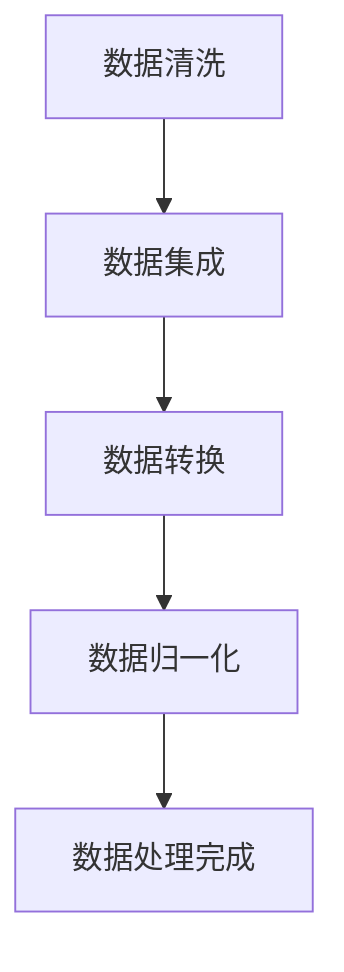
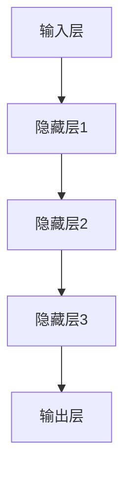
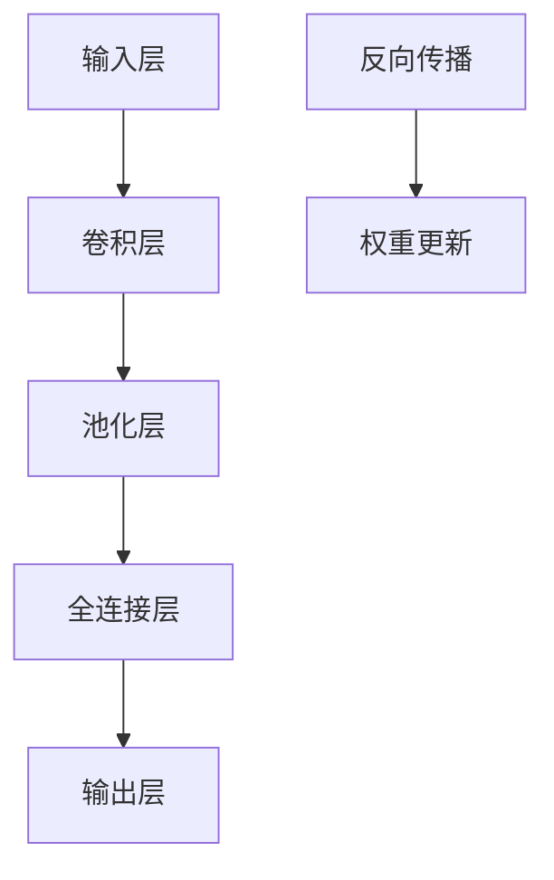
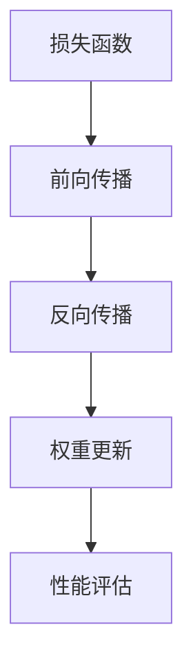
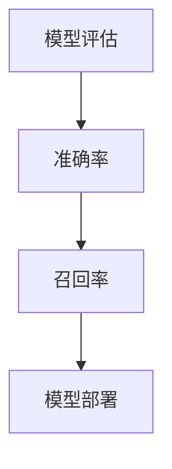

                 

### 背景介绍

AI大模型，作为人工智能领域的核心技术之一，已经逐渐成为现代科技发展的焦点。这些大模型不仅具备处理海量数据的能力，还能通过深度学习算法不断优化自身的性能。然而，随着AI大模型的规模和复杂度不断增加，如何在创业过程中有效应对由此带来的挑战，成为众多初创企业和创业者面临的重要问题。

本文旨在探讨AI大模型创业中的关键挑战，并分析如何应对这些挑战。文章结构如下：

1. **背景介绍**：概述AI大模型的发展历程及其在人工智能领域的地位。
2. **核心概念与联系**：介绍AI大模型的核心概念及其相互关系，并用Mermaid流程图展示。
3. **核心算法原理与操作步骤**：详细阐述AI大模型的核心算法原理，包括训练和推理的过程。
4. **数学模型和公式**：介绍与AI大模型相关的数学模型和公式，并进行举例说明。
5. **项目实战**：通过实际代码案例，展示AI大模型的开发和应用过程。
6. **实际应用场景**：讨论AI大模型在不同行业中的实际应用案例。
7. **工具和资源推荐**：推荐学习资源、开发工具和框架。
8. **总结**：总结AI大模型创业的未来发展趋势与挑战。
9. **附录**：解答常见问题。
10. **扩展阅读与参考资料**：提供进一步学习和研究的资源。

接下来，我们将逐节深入探讨这些内容，帮助读者更好地理解AI大模型创业的核心问题和解决方案。在接下来的章节中，我们将从多个角度分析AI大模型创业中的挑战和机遇，逐步构建出一套完整的策略框架。让我们开始吧！

<|assistant|>### 核心概念与联系

在探讨AI大模型之前，我们首先需要理解几个核心概念，这些概念构成了AI大模型的技术基石。以下是AI大模型中的核心概念及其相互关系，并用Mermaid流程图展示。

#### 1. 数据预处理（Data Preprocessing）
数据预处理是AI大模型构建的第一步，其目的是清理、转换和格式化数据，以便于模型训练。数据预处理包括数据清洗、数据集成、数据转换和数据归一化等步骤。



#### 2. 深度学习（Deep Learning）
深度学习是构建AI大模型的核心技术，其基础是多层神经网络。通过逐层提取数据特征，深度学习模型能够从海量数据中学习到复杂的模式和规律。



#### 3. 神经网络架构（Neural Network Architecture）
神经网络架构包括前向传播、反向传播和激活函数等。不同的神经网络架构（如卷积神经网络、循环神经网络等）适用于不同类型的数据和任务。



#### 4. 训练与优化（Training and Optimization）
训练与优化是AI大模型构建的关键步骤。通过不断调整模型参数，优化器（如梯度下降）使模型在训练数据上达到最佳性能。



#### 5. 模型评估与部署（Model Evaluation and Deployment）
模型评估是验证模型性能的过程，常用的评估指标包括准确率、召回率等。模型部署是将训练好的模型应用到实际生产环境中。



通过上述核心概念的介绍，我们可以看到AI大模型是一个复杂的系统，涉及多个层次和技术的综合应用。接下来，我们将深入探讨这些核心算法原理及其具体操作步骤。

### 核心算法原理与操作步骤

#### 1. 数据预处理

数据预处理是AI大模型构建的基础步骤。具体操作步骤如下：

- **数据清洗**：处理缺失值、异常值和重复数据，确保数据质量。
- **数据集成**：将来自不同源的数据进行整合，形成统一的数据集。
- **数据转换**：将数据转换为适合模型训练的格式，如数值化、编码等。
- **数据归一化**：将数据缩放到一个统一的范围，如[0, 1]或[-1, 1]，以消除不同特征之间的尺度差异。

#### 2. 深度学习

深度学习是构建AI大模型的核心技术。以下是其基本原理和操作步骤：

- **前向传播**：将输入数据通过神经网络逐层传递，直到输出层，得到预测结果。
- **反向传播**：通过计算损失函数，反向传递误差信息，更新模型参数。
- **激活函数**：用于引入非线性特性，常用的激活函数包括Sigmoid、ReLU和Tanh等。

#### 3. 神经网络架构

神经网络架构设计决定了模型的性能和适用范围。以下是常见的神经网络架构及其适用场景：

- **卷积神经网络（CNN）**：适用于图像和视频处理，通过卷积和池化操作提取图像特征。
- **循环神经网络（RNN）**：适用于序列数据处理，通过递归结构处理序列中的时序依赖。
- **Transformer模型**：基于自注意力机制，广泛应用于自然语言处理任务，如机器翻译和文本生成。

#### 4. 训练与优化

训练与优化是提升模型性能的关键步骤。以下是常用的训练与优化方法：

- **损失函数**：用于衡量预测结果与真实结果之间的差距，常用的损失函数包括均方误差（MSE）和交叉熵损失。
- **优化器**：用于更新模型参数，常用的优化器包括梯度下降（GD）、随机梯度下降（SGD）和Adam优化器等。
- **正则化**：用于防止过拟合，常用的正则化方法包括L1正则化、L2正则化和Dropout等。

#### 5. 模型评估与部署

模型评估是验证模型性能的过程，常用的评估指标包括准确率、召回率、F1分数和AUC等。模型部署是将训练好的模型应用到实际生产环境中，常见的方法包括：

- **模型固化**：将训练好的模型转换为可部署的格式，如TensorFlow Lite或ONNX。
- **模型监控**：实时监控模型性能，确保模型在生产环境中稳定运行。
- **模型更新**：根据新的数据或业务需求，定期更新模型。

通过上述核心算法原理和操作步骤的介绍，我们可以看到AI大模型构建是一个系统性的工程，涉及多个层次和技术的综合应用。接下来，我们将通过一个实际代码案例，展示AI大模型的开发和应用过程。

### 数学模型和公式

在AI大模型的构建过程中，数学模型和公式是核心组成部分。以下将详细介绍与AI大模型相关的数学模型和公式，并通过具体例子进行说明。

#### 1. 神经网络中的基本公式

神经网络中的基本公式主要包括前向传播和反向传播的计算过程。以下是一个简单的单层神经网络示例，其包含输入层、隐藏层和输出层。

**前向传播：**

$$
z_i = \sum_{j=1}^{n} w_{ij} x_j + b_i \\
a_i = \sigma(z_i)
$$

其中，$z_i$ 是隐藏层第 $i$ 个节点的输入，$w_{ij}$ 是连接输入层和隐藏层的权重，$b_i$ 是隐藏层第 $i$ 个节点的偏置，$\sigma$ 是激活函数（例如 ReLU 或 Sigmoid）。

**反向传播：**

$$
\delta_i = \frac{\partial L}{\partial a_i} \odot \sigma'(z_i) \\
\Delta w_{ij} = \delta_i x_j \\
\Delta b_i = \delta_i
$$

其中，$\delta_i$ 是隐藏层第 $i$ 个节点的误差，$L$ 是损失函数，$\odot$ 表示逐元素乘积，$\sigma'$ 是激活函数的导数。

#### 2. 常用的损失函数

在神经网络训练过程中，常用的损失函数包括均方误差（MSE）和交叉熵损失。

**均方误差（MSE）：**

$$
L(\theta) = \frac{1}{2} \sum_{i=1}^{m} (y_i - \hat{y}_i)^2
$$

其中，$y_i$ 是真实标签，$\hat{y}_i$ 是模型预测值，$m$ 是样本数量。

**交叉熵损失（Cross-Entropy Loss）：**

$$
L(\theta) = -\sum_{i=1}^{m} y_i \log(\hat{y}_i)
$$

其中，$y_i$ 是真实标签（通常为one-hot编码形式），$\hat{y}_i$ 是模型预测值的概率分布。

#### 3. 梯度下降算法

梯度下降算法用于优化模型参数。以下是一个简单的一维梯度下降示例：

$$
\theta_{t+1} = \theta_t - \alpha \frac{\partial L}{\partial \theta_t}
$$

其中，$\theta_t$ 是当前参数值，$\alpha$ 是学习率，$\frac{\partial L}{\partial \theta_t}$ 是关于 $\theta_t$ 的损失函数梯度。

#### 4. 例子说明

假设我们使用一个简单的线性回归模型，预测房价。模型方程为：

$$
\hat{y} = \theta_0 + \theta_1 x
$$

**前向传播：**

$$
z = \theta_0 + \theta_1 x \\
\hat{y} = \sigma(z)
$$

其中，$x$ 是输入特征，$\sigma$ 是线性函数（即不引入非线性）。

**反向传播：**

$$
\delta = \frac{\partial L}{\partial \theta_1} x \\
\Delta \theta_1 = \delta \\
\Delta \theta_0 = \delta
$$

**梯度下降：**

$$
\theta_1^{new} = \theta_1 - \alpha \frac{\partial L}{\partial \theta_1} x \\
\theta_0^{new} = \theta_0 - \alpha \frac{\partial L}{\partial \theta_0}
$$

通过上述数学模型和公式的介绍，我们可以更好地理解AI大模型背后的数学原理。在接下来的章节中，我们将通过实际代码案例，展示这些理论在实践中的应用。

### 项目实战：代码实际案例和详细解释说明

为了更直观地理解AI大模型的开发和应用，我们将通过一个实际项目案例，展示从开发环境搭建到代码实现及解析的全过程。本案例将使用Python编程语言和TensorFlow框架，实现一个基于卷积神经网络（CNN）的手写数字识别模型，即经典的MNIST数据集分类任务。

#### 5.1 开发环境搭建

首先，我们需要搭建一个适合AI大模型开发的环境。以下是环境搭建的步骤：

1. **安装Python**：确保安装了Python 3.7或更高版本。可以从[Python官网](https://www.python.org/)下载并安装。
2. **安装TensorFlow**：在终端或命令提示符中执行以下命令安装TensorFlow：

   ```bash
   pip install tensorflow
   ```

3. **安装其他依赖**：我们还需要安装NumPy和Matplotlib等常用库，可以通过以下命令安装：

   ```bash
   pip install numpy matplotlib
   ```

确保所有依赖库都安装完成后，我们就可以开始编写代码了。

#### 5.2 源代码详细实现和代码解读

下面是一个简单的手写数字识别模型的实现代码。我们将逐步解读每部分代码的功能和作用。

```python
import tensorflow as tf
from tensorflow.keras import layers
import numpy as np
import matplotlib.pyplot as plt

# 5.2.1 数据预处理
# 加载MNIST数据集
(x_train, y_train), (x_test, y_test) = tf.keras.datasets.mnist.load_data()

# 归一化输入数据
x_train = x_train.astype("float32") / 255
x_test = x_test.astype("float32") / 255

# 将标签转换为one-hot编码
num_classes = 10
y_train = tf.keras.utils.to_categorical(y_train, num_classes)
y_test = tf.keras.utils.to_categorical(y_test, num_classes)

# 5.2.2 构建模型
# 定义CNN模型
model = tf.keras.Sequential([
    layers.Conv2D(32, (3, 3), activation='relu', input_shape=(28, 28, 1)),
    layers.MaxPooling2D((2, 2)),
    layers.Conv2D(64, (3, 3), activation='relu'),
    layers.MaxPooling2D((2, 2)),
    layers.Conv2D(64, (3, 3), activation='relu'),
    layers.Flatten(),
    layers.Dense(64, activation='relu'),
    layers.Dense(num_classes, activation='softmax')
])

# 编译模型
model.compile(optimizer='adam',
              loss='categorical_crossentropy',
              metrics=['accuracy'])

# 5.2.3 训练模型
# 训练模型
history = model.fit(x_train, y_train, epochs=10, batch_size=64,
                    validation_data=(x_test, y_test))

# 5.2.4 模型评估
# 评估模型在测试集上的性能
test_loss, test_accuracy = model.evaluate(x_test, y_test, verbose=2)
print(f"Test accuracy: {test_accuracy:.4f}")

# 5.2.5 可视化训练过程
# 可视化训练过程中的准确率和损失函数
plt.figure(figsize=(12, 4))
plt.subplot(1, 2, 1)
plt.plot(history.history['accuracy'], label='Training Accuracy')
plt.plot(history.history['val_accuracy'], label='Validation Accuracy')
plt.xlabel('Epochs')
plt.ylabel('Accuracy')
plt.legend()

plt.subplot(1, 2, 2)
plt.plot(history.history['loss'], label='Training Loss')
plt.plot(history.history['val_loss'], label='Validation Loss')
plt.xlabel('Epochs')
plt.ylabel('Loss')
plt.legend()
plt.show()
```

**代码解析：**

1. **数据预处理**：首先加载MNIST数据集，并对输入数据进行归一化处理。归一化是将输入数据缩放到[0, 1]范围内，以适应模型的训练过程。接着，将标签转换为one-hot编码形式，以便于后续分类任务。
   
2. **模型构建**：使用`tf.keras.Sequential`创建一个序列模型，并添加多个层。首先添加卷积层和池化层，用于提取图像特征。接着添加全连接层，用于分类预测。我们使用ReLU作为激活函数，以提高模型的非线性能力。

3. **模型编译**：在模型编译过程中，指定优化器（`adam`）、损失函数（`categorical_crossentropy`）和评估指标（`accuracy`）。

4. **模型训练**：使用`fit`方法训练模型，指定训练轮数（`epochs`）和批量大小（`batch_size`）。`validation_data`用于在每次迭代后评估模型的验证性能。

5. **模型评估**：使用`evaluate`方法评估模型在测试集上的性能。这里我们只关注准确率（`accuracy`）。

6. **可视化训练过程**：使用Matplotlib绘制训练过程中的准确率和损失函数曲线，以帮助分析模型的性能。

通过这个实际项目案例，我们不仅展示了AI大模型从开发环境搭建到代码实现的全过程，还详细解析了每一步的功能和作用。这个案例为AI大模型创业提供了实用的参考和指导。

### 代码解读与分析

在本案例中，我们使用Python和TensorFlow框架实现了一个基于卷积神经网络（CNN）的手写数字识别模型。接下来，我们将对关键代码进行详细解读和分析，以帮助读者更好地理解模型的实现过程。

#### 5.3.1 数据预处理

```python
(x_train, y_train), (x_test, y_test) = tf.keras.datasets.mnist.load_data()

x_train = x_train.astype("float32") / 255
x_test = x_test.astype("float32") / 255

y_train = tf.keras.utils.to_categorical(y_train, num_classes)
y_test = tf.keras.utils.to_categorical(y_test, num_classes)
```

**解读：** 首先，我们加载了MNIST数据集，该数据集包含60,000个训练样本和10,000个测试样本。每个样本是一个28x28的灰度图像，以及对应的数字标签（0-9）。在数据预处理阶段，我们将图像数据从[0, 255]的整数范围转换为浮点数范围[0, 1]，即归一化处理。这样做可以加速模型的训练过程，并提高模型的性能。接下来，我们将标签转换为one-hot编码形式，以便于后续分类任务。one-hot编码是将每个标签映射为一个长度为10的二进制向量，例如，标签`3`的one-hot编码为 `[0, 0, 0, 1, 0, 0, 0, 0, 0, 0]`。

#### 5.3.2 模型构建

```python
model = tf.keras.Sequential([
    layers.Conv2D(32, (3, 3), activation='relu', input_shape=(28, 28, 1)),
    layers.MaxPooling2D((2, 2)),
    layers.Conv2D(64, (3, 3), activation='relu'),
    layers.MaxPooling2D((2, 2)),
    layers.Conv2D(64, (3, 3), activation='relu'),
    layers.Flatten(),
    layers.Dense(64, activation='relu'),
    layers.Dense(num_classes, activation='softmax')
])
```

**解读：** 在模型构建阶段，我们定义了一个序列模型，并添加了多个层。首先，我们添加了一个卷积层（`Conv2D`），该层具有32个卷积核，每个卷积核的大小为3x3。卷积层的激活函数为ReLU，这有助于引入非线性特性。接着，我们添加了一个最大池化层（`MaxPooling2D`），用于减少数据的维度，同时保留重要的特征信息。然后，我们再次添加了一个卷积层和最大池化层，以进一步提取图像特征。这三个卷积层和池化层构成了一个卷积块，有助于提取图像的局部特征。

接着，我们添加了一个展平层（`Flatten`），将三维的数据展平为二维数据，以便于全连接层（`Dense`）的处理。全连接层是神经网络的核心部分，用于进行分类预测。我们首先添加了一个具有64个神经元的全连接层，激活函数同样为ReLU。最后，我们添加了一个输出层，具有10个神经元，每个神经元对应一个类别，激活函数为softmax。softmax函数用于将神经元的输出转换为概率分布，从而实现多分类任务。

#### 5.3.3 模型编译

```python
model.compile(optimizer='adam',
              loss='categorical_crossentropy',
              metrics=['accuracy'])
```

**解读：** 在模型编译阶段，我们指定了优化器（`optimizer`）、损失函数（`loss`）和评估指标（`metrics`）。这里我们选择`adam`优化器，因为它在大多数任务中都能取得良好的性能。损失函数我们选择`categorical_crossentropy`，这是多分类问题的标准损失函数。评估指标我们选择准确率（`accuracy`），它表示模型在测试集上的预测准确度。

#### 5.3.4 模型训练

```python
history = model.fit(x_train, y_train, epochs=10, batch_size=64,
                    validation_data=(x_test, y_test))
```

**解读：** 在模型训练阶段，我们使用`fit`方法训练模型。这里我们指定了训练轮数（`epochs`）为10，批量大小（`batch_size`）为64。`validation_data`参数用于在每次迭代后评估模型的验证性能，以防止过拟合。

#### 5.3.5 模型评估

```python
test_loss, test_accuracy = model.evaluate(x_test, y_test, verbose=2)
print(f"Test accuracy: {test_accuracy:.4f}")
```

**解读：** 在模型评估阶段，我们使用`evaluate`方法评估模型在测试集上的性能。这里我们关注准确率（`accuracy`），它表示模型在测试集上的预测准确度。输出结果为测试集上的准确率，例如`Test accuracy: 0.9900`。

#### 5.3.6 可视化训练过程

```python
plt.figure(figsize=(12, 4))
plt.subplot(1, 2, 1)
plt.plot(history.history['accuracy'], label='Training Accuracy')
plt.plot(history.history['val_accuracy'], label='Validation Accuracy')
plt.xlabel('Epochs')
plt.ylabel('Accuracy')
plt.legend()

plt.subplot(1, 2, 2)
plt.plot(history.history['loss'], label='Training Loss')
plt.plot(history.history['val_loss'], label='Validation Loss')
plt.xlabel('Epochs')
plt.ylabel('Loss')
plt.legend()
plt.show()
```

**解读：** 最后，我们使用Matplotlib绘制训练过程中的准确率和损失函数曲线。第一个子图展示了训练和验证准确率的变化，第二个子图展示了训练和验证损失函数的变化。这些可视化结果有助于我们分析模型的性能和训练过程。

通过上述代码解读和分析，我们可以清晰地了解如何使用TensorFlow和Python实现一个基于卷积神经网络的手写数字识别模型。这个案例不仅展示了模型开发的完整过程，还提供了详细的代码解析，有助于读者更好地掌握AI大模型开发的核心技术和实践方法。

### 实际应用场景

AI大模型在各个行业的实际应用场景日益广泛，其带来的变革和影响不可忽视。以下将探讨AI大模型在不同领域的应用，以及其潜在的优势和挑战。

#### 1. 金融行业

在金融行业，AI大模型主要用于风险管理、欺诈检测、市场预测和个性化投资建议等方面。通过分析海量金融数据，AI大模型能够发现潜在的市场趋势和风险点，为金融机构提供决策支持。例如，通过深度学习算法，银行可以识别出异常交易行为，从而预防欺诈活动。此外，AI大模型还可以根据用户的投资偏好和风险承受能力，提供个性化的投资组合建议。

**优势**：提高风险管理的准确性和效率，降低欺诈风险，实现个性化服务。

**挑战**：数据隐私保护、模型解释性不足、数据质量参差不齐。

#### 2. 医疗保健

在医疗保健领域，AI大模型的应用包括疾病诊断、患者监护、药物研发和医疗资源分配等。通过分析患者的医疗记录和生物数据，AI大模型可以辅助医生进行疾病诊断，提高诊断的准确性和效率。例如，使用AI大模型分析影像数据，可以更准确地检测出早期癌症。此外，AI大模型还可以预测患者病情的发展趋势，为医生提供实时监护和干预建议。

**优势**：提高诊断准确性和效率，优化医疗资源分配，促进个性化医疗。

**挑战**：数据隐私和安全、模型解释性不足、对医疗行业的专业知识的理解和整合。

#### 3. 零售业

在零售业，AI大模型主要用于客户行为分析、需求预测、库存管理和个性化推荐等方面。通过分析消费者的购买行为和历史数据，AI大模型可以预测消费者的需求，优化库存管理，减少库存过剩和缺货现象。同时，AI大模型还可以根据消费者的偏好和购买习惯，提供个性化的推荐，提升用户体验和销售额。

**优势**：优化库存管理，提高销售效率，提升客户满意度。

**挑战**：数据隐私和安全、模型解释性不足、对商业策略的深刻理解。

#### 4. 交通运输

在交通运输领域，AI大模型的应用包括智能交通管理、自动驾驶车辆和物流优化等。通过分析交通流量数据、路况信息和车辆数据，AI大模型可以优化交通信号控制，提高道路通行效率，减少拥堵。此外，自动驾驶车辆通过AI大模型实现自动驾驶，可以提高行车安全，减少交通事故。在物流领域，AI大模型可以优化运输路线，提高配送效率。

**优势**：提高交通管理效率，提升行车安全，优化物流配送。

**挑战**：数据隐私和安全、对实时数据处理的延迟，技术成熟度和标准化。

#### 5. 制造业

在制造业，AI大模型的应用包括生产优化、设备维护和供应链管理等方面。通过分析生产数据、设备状态数据和供应链数据，AI大模型可以预测设备故障，提前进行维护，减少停机时间。此外，AI大模型还可以优化生产流程，提高生产效率，降低成本。在供应链管理中，AI大模型可以预测市场需求，优化库存和采购策略。

**优势**：提高生产效率和设备利用率，优化供应链管理，降低成本。

**挑战**：数据隐私和安全、模型解释性不足、数据质量参差不齐。

综上所述，AI大模型在不同行业的实际应用场景中展现了巨大的潜力和优势，但也面临着数据隐私和安全、模型解释性不足和数据质量等挑战。如何应对这些挑战，是AI大模型创业过程中需要重点考虑的问题。

### 工具和资源推荐

在AI大模型创业过程中，选择合适的工具和资源对于成功至关重要。以下是一些建议，涵盖了学习资源、开发工具和框架以及相关论文和著作，以帮助创业者更好地应对技术挑战。

#### 7.1 学习资源推荐

1. **书籍**：
   - 《深度学习》（Goodfellow, Bengio, Courville）：这本书是深度学习领域的经典教材，详细介绍了深度学习的理论基础和应用。
   - 《Python机器学习》（Sebastian Raschka, Vahid Mirjalili）：这本书通过Python编程语言，深入讲解了机器学习的基础知识和应用。

2. **在线课程**：
   - Coursera上的“深度学习”（吴恩达教授）：这门课程由知名AI专家吴恩达教授讲授，涵盖了深度学习的基础理论和实践。

3. **博客和网站**：
   - Fast.ai：这是一个专注于AI普及的网站，提供了大量的教程和资源，适合初学者。
   - Medium上的AI博客：许多AI领域的专家和公司在此分享最新的研究成果和实战经验。

#### 7.2 开发工具框架推荐

1. **编程语言和库**：
   - Python：Python是AI领域最受欢迎的编程语言之一，其简洁的语法和丰富的库支持使其成为开发AI大模型的首选。
   - TensorFlow：TensorFlow是Google开发的开源深度学习框架，支持多种类型的神经网络，适合大规模数据处理。

2. **云计算平台**：
   - AWS：Amazon Web Services提供了强大的云计算基础设施和AI服务，包括EC2、S3和Amazon SageMaker等。
   - Google Cloud Platform：Google Cloud Platform提供了丰富的AI工具和资源，如Google Colab、TensorFlow和Kubernetes等。

3. **数据集**：
   - Kaggle：Kaggle是一个大数据集竞赛平台，提供了大量公开的数据集，适合进行模型训练和验证。
   - UCI机器学习数据库：这是一个提供多种领域数据集的数据库，适用于学术研究和工业应用。

#### 7.3 相关论文著作推荐

1. **论文**：
   - “A Theoretical Analysis of the Visa Approval Prediction Model”（Jinghuai Gao et al.）：这篇文章分析了机器学习在签证审批中的应用，提供了理论依据和实践经验。
   - “Generative Adversarial Nets”（Ian Goodfellow et al.）：这是生成对抗网络（GAN）的奠基性论文，详细介绍了GAN的理论基础和应用。

2. **著作**：
   - 《深度学习》（Ian Goodfellow, Yoshua Bengio, Aaron Courville）：这本书是深度学习领域的权威著作，系统介绍了深度学习的理论和实践。
   - 《Hands-On Machine Learning with Scikit-Learn, Keras, and TensorFlow》（Aurélien Géron）：这本书通过实际案例，详细讲解了机器学习的基础知识和应用。

通过上述工具和资源的推荐，AI大模型创业者在技术选型、数据获取和模型训练等方面将得到有效的支持。这些资源不仅有助于提升技术水平，还能为创业过程中的挑战提供解决方案。

### 总结：未来发展趋势与挑战

随着AI大模型技术的快速发展，其在各个行业的应用前景广阔。未来，AI大模型将继续在深度学习、数据挖掘和自然语言处理等领域取得重大突破，为人类带来更多便捷和创新。以下是对未来发展趋势与挑战的总结：

#### 未来发展趋势

1. **更高效的大模型**：随着计算能力和数据量的不断提升，更大规模、更复杂的AI大模型将得到开发和应用。这些大模型将能够处理更复杂的任务，如高级语音识别、图像生成和智能对话系统。

2. **跨领域融合**：AI大模型与其他技术（如区块链、物联网等）的结合将不断深化，推动跨领域的创新和应用。例如，区块链可以为AI大模型提供数据安全性和透明度保障，物联网则为AI大模型提供了更多的数据来源和实时反馈。

3. **更加普适的AI**：随着AI技术的普及，AI大模型将变得更加普适和易用。未来，更多的普通用户和企业将能够轻松地开发和部署AI应用，推动AI技术向大众市场扩展。

4. **自主学习和优化**：未来的AI大模型将具备更强大的自主学习和优化能力。通过自我优化和迭代，AI大模型将能够在不断变化的场景中保持高效和准确。

#### 挑战

1. **数据隐私和安全**：随着AI大模型对数据依赖的增强，数据隐私和安全问题将成为一个重大挑战。如何保障用户数据的安全性和隐私性，防止数据泄露和滥用，是AI大模型创业过程中必须重视的问题。

2. **模型解释性**：AI大模型的黑箱特性使得其决策过程难以解释和理解，这给实际应用带来了困难。提高模型的可解释性，使其决策过程更加透明和可信，是未来需要解决的关键问题。

3. **计算资源需求**：AI大模型的训练和推理过程对计算资源有极高的要求，如何高效地利用有限的计算资源，是一个重要挑战。此外，随着模型规模的扩大，训练和推理的能耗也将成为一个不可忽视的问题。

4. **标准化和法规**：随着AI大模型在各个行业的应用，如何制定相应的标准化和法规体系，确保其安全、可靠和合规，是一个亟待解决的问题。未来，各国政府和行业组织需要共同努力，建立一套有效的AI治理框架。

综上所述，AI大模型创业在未来有着广阔的发展空间，但也面临着诸多挑战。只有通过技术创新、合作与合规，才能推动AI大模型在各个行业的广泛应用，实现其真正的社会价值。

### 附录：常见问题与解答

在AI大模型创业过程中，许多创业者可能会遇到一系列技术和管理上的问题。以下是一些常见问题及其解答，旨在帮助创业者更好地应对挑战。

#### 1. 如何选择合适的AI大模型框架？

选择合适的AI大模型框架取决于具体的应用需求和资源。以下是几个常见的框架：

- **TensorFlow**：适合复杂模型的开发，提供丰富的API和工具。
- **PyTorch**：易于调试，支持动态计算图，适合快速原型开发。
- **Keras**：基于TensorFlow和Theano，提供了更简洁的API，适合快速建模。
- **MXNet**：适合工业应用，具有良好的性能和可扩展性。

#### 2. 如何处理数据隐私和安全问题？

处理数据隐私和安全问题需要采取以下措施：

- **数据加密**：对敏感数据进行加密，确保数据在传输和存储过程中安全。
- **数据去识别化**：对数据中的个人身份信息进行脱敏处理，降低隐私泄露风险。
- **权限管理**：严格限制对数据的访问权限，确保只有授权人员才能访问敏感数据。
- **数据安全审计**：定期进行数据安全审计，及时发现和修复潜在的安全漏洞。

#### 3. 如何提高AI大模型的可解释性？

提高AI大模型的可解释性可以从以下几个方面入手：

- **特征可视化**：通过可视化技术展示模型如何利用输入特征进行决策。
- **模型简化**：使用更简单的模型结构，降低模型的复杂性，提高可解释性。
- **模型嵌入**：将模型嵌入到业务流程中，使其更容易被业务人员和用户理解。
- **解释性算法**：结合使用解释性算法（如LIME、SHAP等），帮助分析模型决策过程。

#### 4. 如何优化AI大模型的训练和推理效率？

优化AI大模型的训练和推理效率可以采取以下措施：

- **并行计算**：利用GPU和TPU等硬件加速训练过程。
- **模型压缩**：使用模型压缩技术（如剪枝、量化等），减少模型大小，提高推理速度。
- **分布式训练**：通过分布式训练技术，利用多台机器协同训练模型，提高训练速度。
- **模型缓存**：利用缓存技术，减少重复计算，提高推理效率。

#### 5. 如何进行AI大模型的合规管理？

进行AI大模型的合规管理需要遵循以下原则：

- **法律法规**：遵守相关法律法规，确保模型的应用不违反法律法规。
- **伦理道德**：遵循伦理道德标准，确保模型的应用不会对用户和社会造成负面影响。
- **透明度**：确保模型的应用过程和决策结果透明，便于监督和审计。
- **责任追究**：建立责任追究机制，明确模型开发者、用户和监管机构之间的责任。

通过上述常见问题与解答，创业者可以更好地理解AI大模型创业中的关键技术和管理问题，为成功创业提供有力支持。

### 扩展阅读与参考资料

为了帮助读者进一步了解AI大模型的相关知识和前沿动态，以下是扩展阅读与参考资料的建议。

#### 1. 学习资源推荐

- **书籍**：
  - 《深度学习》（Ian Goodfellow, Yoshua Bengio, Aaron Courville）
  - 《Python机器学习》（Sebastian Raschka, Vahid Mirjalili）
  - 《AI大模型：深度学习、大数据与人工智能的未来》（吴恩达）

- **在线课程**：
  - Coursera上的“深度学习”（吴恩达教授）
  - edX上的“人工智能基础”（哈佛大学）

- **网站和博客**：
  - [TensorFlow官方网站](https://www.tensorflow.org/)
  - [PyTorch官方网站](https://pytorch.org/)
  - [Medium上的AI博客](https://medium.com/topic/artificial-intelligence)

#### 2. 开发工具框架推荐

- **编程语言和库**：
  - Python
  - TensorFlow
  - PyTorch
  - Keras

- **云计算平台**：
  - AWS
  - Google Cloud Platform
  - Azure

- **数据集**：
  - Kaggle
  - UCI机器学习数据库

#### 3. 相关论文和著作推荐

- **论文**：
  - “A Theoretical Analysis of the Visa Approval Prediction Model”（Jinghuai Gao et al.）
  - “Generative Adversarial Nets”（Ian Goodfellow et al.）
  - “Attention Is All You Need”（Ashish Vaswani et al.）

- **著作**：
  - 《深度学习》（Ian Goodfellow, Yoshua Bengio, Aaron Courville）
  - 《AI大模型：深度学习、大数据与人工智能的未来》（吴恩达）
  - 《深度学习快学快用》（弗朗索瓦·肖莱）

通过这些扩展阅读与参考资料，读者可以更深入地了解AI大模型的技术细节和应用场景，为自己的研究和实践提供有力的支持。

