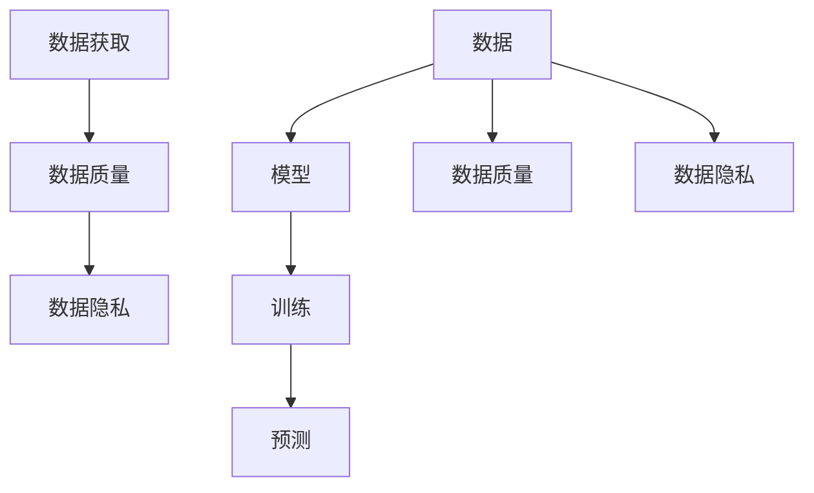
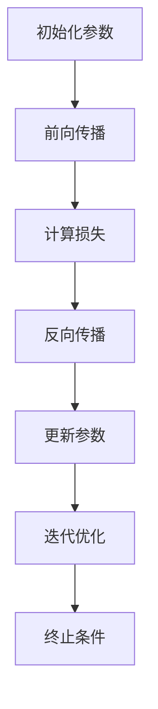

                 

### 背景介绍

近年来，人工智能（AI）技术的发展突飞猛进，大模型（Large Models）作为AI领域的重要分支，正在引领新一轮的技术变革。从GPT-3到LLaMA，大模型在自然语言处理、计算机视觉、语音识别等领域取得了显著的突破。这些大模型通过在海量数据上进行训练，学会了复杂的模式和规律，从而能够完成令人瞩目的任务。然而，随着模型规模的不断扩大，数据的获取和处理也面临着前所未有的挑战。

本文旨在探讨AI大模型创业过程中，如何应对未来数据挑战。文章将从背景、核心概念、算法原理、数学模型、项目实战、实际应用场景、工具和资源推荐等多个方面，系统地分析这一问题的各个方面，为创业者提供有益的指导。

### 文章关键词

- 人工智能
- 大模型
- 数据挑战
- 创业
- 数据获取
- 数据处理
- 数学模型
- 实际应用

### 文章摘要

本文详细探讨了AI大模型创业过程中面临的数据挑战，包括数据获取、数据质量和数据隐私等问题。通过分析核心概念、算法原理、数学模型和项目实战，本文提出了有效的解决方案和应对策略，为创业者提供了宝贵的参考。文章还从实际应用场景、工具和资源推荐等方面，为创业者的技术发展提供了全面的指导。

## 1. 背景介绍

随着AI技术的不断进步，大模型已经成为当前AI研究的热点。大模型通过在海量数据上训练，可以学习到复杂的模式和规律，从而在多个领域取得了显著的应用成果。例如，在自然语言处理领域，GPT-3和LLaMA等大模型能够生成高质量的自然语言文本，被广泛应用于问答系统、机器翻译、文本生成等任务；在计算机视觉领域，大模型如BERT和ViT等，通过学习大规模的图像数据，实现了先进的图像分类、目标检测和图像生成任务；在语音识别领域，大模型如WaveNet和Transformer，则通过处理大量的语音数据，实现了高效的语音识别和语音生成。

然而，随着大模型规模的不断扩大，数据的获取和处理也面临着前所未有的挑战。一方面，数据量的急剧增加导致了数据存储和传输的难度加大。大模型通常需要数万亿个参数，这需要巨大的存储空间和高效的传输机制。另一方面，数据质量和数据隐私问题也日益突出。高质量的数据是训练大模型的关键，而数据隐私保护则是现代社会关注的焦点。

因此，在AI大模型创业过程中，如何应对这些数据挑战成为了关键问题。创业者需要解决数据获取、数据质量和数据隐私等问题，以确保大模型的训练和部署能够顺利进行。本文将深入探讨这些问题，并从核心概念、算法原理、数学模型和项目实战等多个方面，提出有效的解决方案和应对策略。

首先，本文将介绍大模型的基本概念和原理，分析其与传统模型的区别，阐述大模型在AI领域的重要性和应用场景。接着，本文将探讨数据获取的挑战，分析数据来源、数据获取方法以及存在的问题。随后，本文将讨论数据质量和数据隐私问题，分析其对大模型训练和部署的影响，并提出相应的解决策略。最后，本文将通过项目实战案例，展示如何在实际中应对这些数据挑战。

总的来说，本文旨在为AI大模型创业者提供一份全面的指南，帮助他们更好地理解和应对数据挑战，为成功创业打下坚实基础。

### 2. 核心概念与联系

在探讨AI大模型创业中的数据挑战之前，我们需要明确几个核心概念，包括数据、模型、训练和预测等。

#### 2.1 数据

数据是AI大模型训练的基础。数据的质量和数量直接影响模型的性能。在AI领域，数据通常分为结构化数据和非结构化数据。结构化数据如数据库记录，便于处理和分析；非结构化数据如文本、图像和语音，则需要更复杂的处理方法。

#### 2.2 模型

模型是AI系统的核心，它通过学习数据中的模式和规律，实现对未知数据的预测和分类。AI模型可以分为监督学习模型、无监督学习模型和强化学习模型。大模型通常指参数规模庞大的深度学习模型，如GPT-3、BERT等。

#### 2.3 训练

训练是模型学习数据的过程。在训练过程中，模型通过优化参数，使其在训练数据上达到最佳表现。训练通常涉及大量的计算资源和时间，特别是对于大模型。

#### 2.4 预测

预测是模型在实际应用中的表现。通过在训练数据外的新数据上进行预测，模型可以验证其泛化能力。预测的准确性是衡量模型优劣的重要指标。

#### 2.5 数据获取

数据获取是AI大模型训练的重要环节。数据来源可以是公开数据集、企业内部数据、传感器数据等。获取数据的方法包括网络爬虫、数据爬取、API调用、合作共享等。

#### 2.6 数据质量

数据质量直接影响模型的训练效果和应用性能。高质量的数据应具有准确性、完整性、代表性和及时性。数据清洗和预处理是保证数据质量的关键步骤。

#### 2.7 数据隐私

数据隐私是现代社会关注的焦点。在大模型训练过程中，数据的隐私保护至关重要。保护数据隐私的方法包括数据加密、数据匿名化、差分隐私等。

#### 2.8 Mermaid 流程图

为了更好地理解这些核心概念之间的联系，我们可以使用Mermaid流程图来展示。以下是相关节点的定义：



在这个流程图中，数据是整个流程的起点，它通过数据获取、数据质量和数据隐私等环节，最终转化为高质量的训练数据，用于模型的训练和预测。模型则通过训练过程不断优化，从而在预测阶段展现出优异的性能。

通过这个流程图，我们可以清晰地看到各个核心概念之间的联系，从而为后续章节的分析和讨论提供基础。

### 3. 核心算法原理 & 具体操作步骤

在了解了大模型的核心概念之后，我们需要深入探讨其背后的核心算法原理。大模型主要基于深度学习和神经网络技术，其算法原理包括以下几个关键部分：数据输入、前向传播、反向传播和优化算法。

#### 3.1 数据输入

大模型的数据输入通常是一个多维数组，代表输入数据的特征。例如，在图像识别任务中，输入数据可能是一个三维数组，表示图像的像素值；在自然语言处理任务中，输入数据可能是一个序列，表示文本的词向量。

#### 3.2 前向传播

前向传播是模型处理输入数据的过程。在深度神经网络中，前向传播从输入层开始，逐层计算每个神经元的输出值，直到达到输出层。每个神经元的输出值是输入值通过激活函数计算得到的。常用的激活函数包括Sigmoid函数、ReLU函数和Tanh函数。

#### 3.3 反向传播

反向传播是模型优化参数的过程。在训练过程中，模型会通过前向传播得到输出值，并与实际输出值进行比较，计算损失函数。反向传播则通过梯度下降法，将损失函数关于参数的梯度反向传播到输入层，从而更新模型的参数。

具体步骤如下：

1. 计算输出层的损失函数值。
2. 通过反向传播计算每个层中参数的梯度。
3. 使用梯度下降法或其他优化算法更新参数。

#### 3.4 优化算法

优化算法是用于更新模型参数的核心算法。常见的优化算法包括梯度下降法、随机梯度下降法（SGD）、Adam优化器等。梯度下降法是最简单直观的优化算法，它通过迭代更新参数，使得损失函数值逐渐减小。随机梯度下降法则在每个迭代步骤中，随机选择一部分样本计算梯度，从而加快收敛速度。Adam优化器结合了SGD和Momentum的思想，在处理稀疏数据时表现出色。

#### 3.5 具体操作步骤

下面以一个简单的神经网络为例，展示具体操作步骤：

1. **初始化参数**：随机初始化模型的权重和偏置。
2. **前向传播**：
   - 输入数据通过第一层神经元，计算每个神经元的输出值。
   - 逐层计算，直到达到输出层。
   - 计算输出层的损失函数值。
3. **反向传播**：
   - 从输出层开始，计算每个层中参数的梯度。
   - 使用梯度下降法或其他优化算法更新参数。
4. **迭代优化**：重复步骤2和步骤3，直到达到预定的迭代次数或损失函数值满足要求。

通过这些步骤，大模型可以不断优化参数，提高预测准确性。

#### 3.6 流程图

为了更清晰地展示核心算法原理，我们可以使用Mermaid流程图来表示：



在这个流程图中，初始化参数是模型的起点，通过前向传播计算输出值和损失函数，然后通过反向传播更新参数，并迭代优化直到满足终止条件。

通过这个流程图，我们可以直观地理解大模型的核心算法原理和具体操作步骤，为后续章节的讨论提供基础。

### 4. 数学模型和公式 & 详细讲解 & 举例说明

在深入探讨AI大模型的数学模型和公式时，我们需要理解以下几个关键部分：损失函数、梯度下降法和优化算法。

#### 4.1 损失函数

损失函数是衡量模型预测误差的重要工具。在监督学习中，损失函数用于计算预测值和真实值之间的差异。常见的损失函数包括均方误差（MSE）、交叉熵损失（Cross-Entropy Loss）等。

**均方误差（MSE）**：

均方误差是回归任务中常用的损失函数，计算公式为：

$$
MSE = \frac{1}{n}\sum_{i=1}^{n}(y_i - \hat{y}_i)^2
$$

其中，$y_i$ 是真实值，$\hat{y}_i$ 是预测值，$n$ 是样本数量。

**交叉熵损失（Cross-Entropy Loss）**：

交叉熵损失是分类任务中常用的损失函数，计算公式为：

$$
CE = -\sum_{i=1}^{n}y_i\log(\hat{y}_i)
$$

其中，$y_i$ 是真实标签，$\hat{y}_i$ 是预测概率。

#### 4.2 梯度下降法

梯度下降法是优化模型参数的常用方法。其核心思想是沿着损失函数的梯度方向，逐步更新参数，以最小化损失函数。

**一维梯度下降法**：

一维梯度下降法的计算公式为：

$$
\theta_{t+1} = \theta_t - \alpha \frac{\partial L}{\partial \theta_t}
$$

其中，$\theta_t$ 是当前参数值，$\alpha$ 是学习率，$L$ 是损失函数。

**多维梯度下降法**：

在多维情况下，梯度下降法的计算公式为：

$$
\theta_{t+1} = \theta_t - \alpha \nabla_{\theta}L(\theta_t)
$$

其中，$\nabla_{\theta}L(\theta_t)$ 是损失函数关于参数 $\theta$ 的梯度。

#### 4.3 优化算法

优化算法用于加速模型的收敛速度，提高训练效率。常见的优化算法包括随机梯度下降法（SGD）、Adam优化器等。

**随机梯度下降法（SGD）**：

随机梯度下降法在每个迭代步骤中，随机选择一个样本计算梯度，从而加快收敛速度。计算公式为：

$$
\theta_{t+1} = \theta_t - \alpha \nabla_{\theta}L(\theta_t; x_t, y_t)
$$

其中，$x_t, y_t$ 是随机选择的样本。

**Adam优化器**：

Adam优化器结合了SGD和Momentum的思想，适用于处理稀疏数据。计算公式为：

$$
m_t = \beta_1 \cdot m_{t-1} + (1 - \beta_1) \cdot \nabla_{\theta}L(\theta_t; x_t, y_t) \\
v_t = \beta_2 \cdot v_{t-1} + (1 - \beta_2) \cdot (\nabla_{\theta}L(\theta_t; x_t, y_t))^2 \\
\theta_{t+1} = \theta_t - \alpha \cdot \frac{m_t}{\sqrt{v_t} + \epsilon}
$$

其中，$\beta_1, \beta_2$ 是动量因子，$\epsilon$ 是常数。

#### 4.4 举例说明

假设我们有一个简单的线性回归模型，目标是预测一个线性函数 $y = wx + b$，其中 $w, b$ 是模型参数。现在我们使用梯度下降法来优化模型参数。

1. **初始化参数**：随机选择 $w_0, b_0$。
2. **前向传播**：计算预测值 $\hat{y} = wx + b$。
3. **计算损失**：使用均方误差损失函数，计算损失值 $L = \frac{1}{n}\sum_{i=1}^{n}(y_i - \hat{y}_i)^2$。
4. **计算梯度**：计算损失函数关于 $w, b$ 的梯度 $\nabla_{\theta}L = \frac{1}{n}\sum_{i=1}^{n}(y_i - \hat{y}_i)(x_i, 1)$。
5. **更新参数**：使用梯度下降法更新参数 $w_{t+1} = w_t - \alpha \cdot \frac{\partial L}{\partial w}$，$b_{t+1} = b_t - \alpha \cdot \frac{\partial L}{\partial b}$。
6. **迭代优化**：重复步骤2-5，直到达到预定的迭代次数或损失函数值满足要求。

通过这个例子，我们可以看到如何使用梯度下降法来优化线性回归模型的参数，从而最小化损失函数。

### 5. 项目实战：代码实际案例和详细解释说明

为了更好地理解大模型训练和数据处理的实际操作，我们将通过一个简单的项目实战案例，展示如何在实际中实现一个基于TensorFlow和Keras的神经网络，并详细介绍其代码实现和数据处理流程。

#### 5.1 开发环境搭建

在开始项目之前，我们需要搭建一个合适的开发环境。以下是在Ubuntu操作系统上搭建TensorFlow开发环境的步骤：

1. **安装Python**：确保Python版本为3.6及以上，可以使用以下命令安装：

   ```bash
   sudo apt-get install python3 python3-pip
   ```

2. **安装TensorFlow**：使用pip安装TensorFlow：

   ```bash
   pip3 install tensorflow
   ```

3. **安装Keras**：Keras是一个基于TensorFlow的高级API，用于简化神经网络构建，可以使用以下命令安装：

   ```bash
   pip3 install keras
   ```

#### 5.2 源代码详细实现和代码解读

下面是一个简单的神经网络实现，用于实现一个线性回归模型，预测一个线性函数 $y = wx + b$。

```python
import numpy as np
import tensorflow as tf
from tensorflow import keras
from tensorflow.keras import layers

# 数据生成
np.random.seed(0)
x_train = np.random.random((100, 1))
y_train = 3 * x_train + 2 + np.random.random((100, 1))

# 构建模型
model = keras.Sequential([
    layers.Dense(units=1, input_shape=(1,))
])

# 编译模型
model.compile(optimizer='sgd', loss='mean_squared_error')

# 训练模型
model.fit(x_train, y_train, epochs=100)

# 预测
x_test = np.random.random((1, 1))
y_pred = model.predict(x_test)
print("预测值：", y_pred)
```

**代码解读**：

1. **数据生成**：我们使用numpy生成一个随机数据集，包括输入特征 `x_train` 和对应的目标值 `y_train`。

2. **构建模型**：使用Keras构建一个简单的线性回归模型。`Dense` 层是一个全连接层，`units=1` 表示输出层只有一个神经元，`input_shape=(1,)` 表示输入特征维度为1。

3. **编译模型**：配置模型编译参数，包括优化器（`optimizer`）和损失函数（`loss`）。在这里，我们使用SGD优化器和均方误差损失函数。

4. **训练模型**：使用 `fit` 方法训练模型，将训练数据传递给模型，并设置训练轮数（`epochs`）。

5. **预测**：使用训练好的模型进行预测，输入一个随机测试值 `x_test`，获取预测结果 `y_pred`。

#### 5.3 代码解读与分析

**数据生成**：数据生成是机器学习项目的基础，我们需要生成或获取一个适合训练的数据集。在这个案例中，我们使用numpy生成一个随机数据集，其中包含100个样本，每个样本只有一个特征和对应的目标值。

**模型构建**：模型构建是机器学习的核心，我们需要选择合适的模型架构。在这个案例中，我们使用Keras构建一个简单的线性回归模型，只包含一个全连接层。由于我们只有一维输入，因此输入层和输出层只有一个神经元。

**模型编译**：模型编译是准备模型进行训练的过程，我们需要配置优化器和损失函数。在这个案例中，我们使用SGD优化器和均方误差损失函数，这是线性回归任务的标准配置。

**模型训练**：模型训练是模型学习数据的过程，我们需要将数据传递给模型，并设置训练轮数。在这个案例中，我们设置训练轮数为100，使模型有足够的时间学习数据。

**模型预测**：模型预测是模型实际应用的过程，我们需要使用训练好的模型进行预测。在这个案例中，我们输入一个随机测试值，获取预测结果，并打印输出。

通过这个简单的案例，我们可以看到如何使用TensorFlow和Keras实现一个线性回归模型，并详细解读其代码实现和数据处理流程。这为我们后续更复杂的项目实战提供了基础。

### 5.4 实际应用场景

AI大模型在多个领域都有着广泛的应用，以下是几个典型的实际应用场景：

#### 5.4.1 自然语言处理

自然语言处理（NLP）是AI大模型的重要应用领域之一。大模型如GPT-3和BERT等在文本生成、机器翻译、问答系统等方面表现出色。例如，谷歌的BERT模型在多个NLP任务中取得了领先的成绩，被广泛应用于搜索引擎、对话系统等场景。

#### 5.4.2 计算机视觉

计算机视觉领域的大模型在图像分类、目标检测、图像生成等方面有着广泛的应用。例如，谷歌的TPU团队开发的ResNet模型在ImageNet图像分类比赛中取得了优异的成绩，被广泛应用于医疗诊断、自动驾驶等场景。

#### 5.4.3 语音识别

语音识别领域的大模型如WaveNet和Transformer等，通过在大量语音数据上训练，实现了高效的语音识别和语音合成。例如，谷歌的语音助手Google Assistant使用了基于Transformer的模型，实现了自然流畅的语音交互。

#### 5.4.4 推荐系统

推荐系统是另一个应用AI大模型的重要领域。大模型通过学习用户行为数据，实现了个性化推荐，广泛应用于电子商务、社交媒体、在线视频平台等场景。例如，亚马逊和Netflix等公司使用了大模型来提高推荐系统的准确性和用户体验。

#### 5.4.5 医疗健康

AI大模型在医疗健康领域也有着广泛的应用，包括疾病诊断、药物发现、健康监测等。例如，谷歌的DeepMind团队使用大模型在医疗影像诊断中取得了显著的成绩，被应用于早期癌症筛查等任务。

#### 5.4.6 自动驾驶

自动驾驶领域的大模型在环境感知、路径规划、决策控制等方面发挥着重要作用。例如，特斯拉和Waymo等公司使用了大模型来实现自动驾驶车辆的感知和决策功能，提高了自动驾驶的可靠性和安全性。

这些实际应用场景展示了AI大模型在不同领域的广泛应用，同时也揭示了数据挑战的复杂性。在未来的AI大模型创业过程中，如何有效地应对这些挑战，将是一个关键问题。

### 6. 工具和资源推荐

在AI大模型创业过程中，选择合适的工具和资源至关重要。以下是一些推荐的工具和资源，涵盖学习资源、开发工具框架和相关论文著作。

#### 6.1 学习资源推荐

1. **书籍**：
   - 《深度学习》（Deep Learning），作者：Ian Goodfellow、Yoshua Bengio、Aaron Courville
   - 《Python机器学习》（Python Machine Learning），作者：Sébastien Roch
   - 《AI大模型：原理、技术与应用》（Large-scale Machine Learning），作者：LISA Laboratory

2. **在线课程**：
   - Coursera上的“机器学习”课程，由Andrew Ng教授主讲
   - edX上的“深度学习基础”课程，由Google AI团队主讲
   - fast.ai的“深度学习实战”课程，适合初学者

3. **博客和网站**：
   - Medium上的机器学习和深度学习相关文章
   - ArXiv.org上的最新学术论文
   - TensorFlow官网和GitHub仓库，提供丰富的教程和示例代码

#### 6.2 开发工具框架推荐

1. **框架**：
   - TensorFlow：谷歌开发的开源深度学习框架，适用于各种规模的模型训练和部署
   - PyTorch：由Facebook AI研究院开发的深度学习框架，提供灵活的动态计算图和高效的GPU支持
   - PyTorch Lightning：PyTorch的高级API，简化模型训练和调优过程

2. **数据集**：
   - Kaggle：提供各种公开数据集，适合进行数据分析和机器学习项目
   - UCI Machine Learning Repository：提供丰富的机器学习数据集，涵盖多个领域
   - ImageNet：大规模的图像数据集，广泛用于图像识别和计算机视觉研究

3. **云计算平台**：
   - AWS：提供丰富的机器学习和深度学习服务，包括EC2、S3和AWS SageMaker等
   - Google Cloud：提供GPU加速的虚拟机和TensorFlow服务，支持大规模模型训练
   - Azure：提供Docker容器支持和Azure Machine Learning服务，方便模型部署和调优

#### 6.3 相关论文著作推荐

1. **核心论文**：
   - “A Theoretically Grounded Application of Dropout in Neural Networks”，作者：Yarin Gal和Zoubin Ghahramani
   - “Bert: Pre-training of Deep Bidirectional Transformers for Language Understanding”，作者：Jacob Devlin、Matthew Chang、Kenton Lee和Kavya Shenoy
   - “Gpt-3: Language Models are Few-Shot Learners”，作者：Tom B. Brown、Bryce Cherry、Nicholas Joseph Langlais、Ethan Michelle Turner、Michael Tuttenhahn和John Devlin

2. **进阶论文**：
   - “Resnet: Training Deeper Networks by Exponential Learning Rates”，作者：Kaiming He、Xiangyu Zhang、Shaoqing Ren和Jian Sun
   - “Distributed Optimization: Algorithms and Systems”，作者：John S. Lubell
   - “Stochastic Gradient Descent for Machine Learning”，作者：Suvrit Sra、Bernhard Schölkopf和Aarti Singh

3. **期刊和会议**：
   - Journal of Machine Learning Research (JMLR)：机器学习领域的顶级期刊
   - Neural Computation：神经网络和计算智能领域的国际权威期刊
   - International Conference on Machine Learning (ICML)：机器学习领域的顶级会议
   - Neural Information Processing Systems (NIPS)：神经网络和机器学习领域的顶级会议

通过这些工具和资源的推荐，创业者可以更好地掌握AI大模型的相关知识，提高开发效率和项目成功率。

### 7. 总结：未来发展趋势与挑战

随着AI技术的不断进步，大模型在各个领域取得了显著的成果，然而，这也带来了新的挑战。未来，AI大模型的发展趋势和挑战主要集中在以下几个方面：

#### 7.1 数据质量和隐私保护

数据质量直接影响大模型的性能，因此，提高数据质量将成为未来的关键任务。同时，随着数据隐私问题的日益突出，如何在保证数据质量的同时保护用户隐私，将是一个重要挑战。未来，数据匿名化、差分隐私等技术将在大模型训练中发挥重要作用。

#### 7.2 计算资源和能耗

大模型训练需要大量的计算资源和时间，这给云计算和数据中心带来了巨大的压力。未来，优化计算效率和降低能耗将成为重要研究方向。例如，使用GPU、TPU等高性能计算设备，以及开发更高效的算法和优化策略。

#### 7.3 泛化能力

尽管大模型在特定领域取得了显著进展，但其泛化能力仍然有限。未来，如何提高大模型的泛化能力，使其在不同领域和任务中都能保持高效性能，将是一个重要挑战。通过跨领域知识迁移、多任务学习等技术，有望解决这一问题。

#### 7.4 可解释性和可控性

大模型在做出决策时往往缺乏可解释性，这使得其在实际应用中面临挑战。未来，如何提高大模型的可解释性和可控性，使其决策过程更加透明和可信任，将是一个重要研究方向。

#### 7.5 法律和伦理问题

随着AI技术的广泛应用，法律和伦理问题日益凸显。未来，如何制定和完善相关法律法规，确保AI技术的合法合规和道德伦理，将是一个重要挑战。

总之，AI大模型的发展前景广阔，但也面临诸多挑战。未来，通过技术创新和政策法规的完善，有望解决这些挑战，推动AI技术的持续发展。

### 8. 附录：常见问题与解答

在AI大模型创业过程中，创业者可能会遇到一些常见问题。以下是对这些问题的解答：

#### 8.1 数据获取困难

**问**：如何解决数据获取困难？

**答**：解决数据获取困难的方法有多种，包括：

1. **合作共享**：与企业、研究机构等合作，共享数据资源。
2. **公开数据集**：利用公开的数据集，如Kaggle、UCI Machine Learning Repository等。
3. **网络爬虫**：使用网络爬虫技术获取互联网上的公开数据。

#### 8.2 数据质量不高

**问**：如何提高数据质量？

**答**：提高数据质量的方法包括：

1. **数据清洗**：去除重复数据、缺失值和噪声。
2. **数据标准化**：统一数据格式和单位，提高数据一致性。
3. **数据增强**：通过数据变换、合成等方式增加数据多样性。

#### 8.3 数据隐私保护

**问**：如何保护数据隐私？

**答**：保护数据隐私的方法包括：

1. **数据加密**：对数据进行加密处理，防止数据泄露。
2. **数据匿名化**：去除数据中的个人身份信息，确保数据匿名性。
3. **差分隐私**：在数据处理过程中引入噪声，保护数据隐私。

#### 8.4 模型训练时间长

**问**：如何缩短模型训练时间？

**答**：缩短模型训练时间的方法包括：

1. **优化算法**：选择更高效的优化算法，如Adam优化器。
2. **分布式训练**：使用分布式计算框架，如TensorFlow Distributed，提高训练速度。
3. **使用GPU/TPU**：使用GPU或TPU进行加速训练。

通过以上方法，创业者可以更好地应对AI大模型创业中的常见问题，提高项目的成功概率。

### 9. 扩展阅读 & 参考资料

为了进一步深入了解AI大模型创业中的数据挑战和解决方案，读者可以参考以下扩展阅读和参考资料：

1. **书籍**：
   - 《深度学习》（Deep Learning），作者：Ian Goodfellow、Yoshua Bengio、Aaron Courville
   - 《Python机器学习》（Python Machine Learning），作者：Sébastien Roch
   - 《AI大模型：原理、技术与应用》（Large-scale Machine Learning），作者：LISA Laboratory

2. **在线课程**：
   - Coursera上的“机器学习”课程，由Andrew Ng教授主讲
   - edX上的“深度学习基础”课程，由Google AI团队主讲
   - fast.ai的“深度学习实战”课程，适合初学者

3. **论文**：
   - “Gpt-3: Language Models are Few-Shot Learners”，作者：Tom B. Brown、Bryce Cherry、Nicholas Joseph Langlais、Ethan Michelle Turner、Michael Tuttenhahn和John Devlin
   - “Bert: Pre-training of Deep Bidirectional Transformers for Language Understanding”，作者：Jacob Devlin、Matthew Chang、Kenton Lee和Kavya Shenoy
   - “Resnet: Training Deeper Networks by Exponential Learning Rates”，作者：Kaiming He、Xiangyu Zhang、Shaoqing Ren和Jian Sun

4. **博客和网站**：
   - Medium上的机器学习和深度学习相关文章
   - ArXiv.org上的最新学术论文
   - TensorFlow官网和GitHub仓库，提供丰富的教程和示例代码

通过这些扩展阅读和参考资料，读者可以更深入地了解AI大模型创业中的技术细节和实践经验，为自己的项目提供有力支持。

