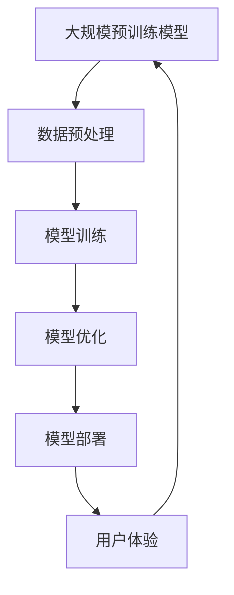

                 

### 背景介绍

近年来，人工智能（AI）技术取得了显著的发展，特别是在大规模预训练模型（Large-scale Pre-trained Models）方面。这些模型，如GPT-3、BERT和Turing等，具有处理复杂数据和分析问题的能力，已经广泛应用于自然语言处理（NLP）、计算机视觉、语音识别等领域。然而，随着AI技术的不断成熟，创业公司如何利用这些技术满足未来用户需求，成为了一个关键问题。

本文将探讨AI大模型创业的相关问题，重点分析如何应对未来用户需求。我们将从背景介绍开始，回顾AI技术的发展历程，接着介绍核心概念与联系，详细讨论核心算法原理与操作步骤，数学模型与公式，以及项目实战中的代码实现和实际应用场景。此外，我们还将推荐相关的工具和资源，总结未来发展趋势与挑战，并提供常见问题与解答。

关键词：AI大模型、创业、用户需求、大规模预训练模型、未来趋势

> 摘要：
本文旨在探讨AI大模型创业的实践路径，分析了当前AI技术的发展现状，介绍了大规模预训练模型的核心概念与联系。通过深入探讨核心算法原理、数学模型以及项目实战中的代码实现，文章旨在为创业公司提供实际指导，帮助其应对未来用户需求。同时，本文还总结了AI大模型创业面临的发展趋势与挑战，并推荐了相关的学习资源、开发工具框架和相关论文著作。最终，文章提出了针对未来AI大模型创业的建议，为行业从业者提供有益的参考。

<|assistant|>### 核心概念与联系

在讨论AI大模型创业之前，我们需要明确几个核心概念和它们之间的联系。以下是几个关键概念及其关系的Mermaid流程图：



#### 1. 大规模预训练模型

大规模预训练模型（Large-scale Pre-trained Models）是指通过大量数据对神经网络模型进行训练，使其具备一定程度的通用知识和理解能力。这些模型通常使用深度学习技术，如变换器（Transformers）、卷积神经网络（CNNs）等。预训练模型的优点在于可以减少模型训练时间，提高模型性能，同时降低对训练数据量的要求。

#### 2. 数据预处理

数据预处理是AI模型训练的关键步骤，包括数据清洗、数据增强、特征提取等。数据预处理的质量直接影响模型的训练效果。一个良好的数据预处理流程能够提高数据的质量和多样性，为模型训练提供更有力的支持。

#### 3. 模型训练

模型训练是指使用训练数据对神经网络模型进行调整和优化，使其能够更好地预测或分类输入数据。在训练过程中，模型会通过反向传播算法不断调整权重和偏置，以提高模型在训练集上的表现。常见的训练算法包括梯度下降、Adam等。

#### 4. 模型优化

模型优化是指在模型训练完成后，通过进一步调整模型结构、参数等，提高模型在测试集或实际应用中的表现。常见的优化方法包括模型剪枝、超参数调整、迁移学习等。

#### 5. 模型部署

模型部署是将训练好的模型部署到实际应用环境中，使其能够实时处理输入数据并给出预测或分类结果。模型部署需要考虑计算资源、网络延迟、安全性等因素，以确保模型能够高效、稳定地运行。

#### 6. 用户体验

用户体验（User Experience，简称UX）是指用户在使用产品或服务过程中所感受到的整体体验。对于AI大模型创业公司来说，提供良好的用户体验至关重要，它能够直接影响用户满意度和忠诚度。良好的用户体验包括易用性、响应速度、准确性、可定制性等方面。

#### 7. 大规模预训练模型与数据预处理、模型训练、模型优化、模型部署和用户体验的关系

大规模预训练模型是AI大模型创业的核心，它与数据预处理、模型训练、模型优化、模型部署和用户体验之间存在紧密的联系。数据预处理为模型训练提供高质量的数据，模型训练和优化则不断提升模型性能，模型部署则将训练好的模型应用于实际场景中，而用户体验则是评估和改进模型性能的重要依据。

总之，了解这些核心概念和它们之间的联系，对于AI大模型创业公司来说至关重要。通过系统地分析和解决这些关键问题，创业公司可以更好地满足未来用户需求，实现可持续发展。

<|assistant|>### 核心算法原理与具体操作步骤

在深入探讨AI大模型创业的过程中，核心算法原理的了解和应用是不可或缺的。以下是大规模预训练模型的核心算法原理和具体操作步骤。

#### 1. 人工智能基础算法

人工智能（AI）的核心在于算法，其中包括了神经网络、深度学习、机器学习等多个领域。以下是几种常用的人工智能基础算法：

- **神经网络（Neural Networks）**：神经网络是一种模仿人脑的计算机模型，由大量相互连接的神经元组成。神经网络通过学习输入和输出数据之间的关系，实现对数据的分类、预测和识别。

- **深度学习（Deep Learning）**：深度学习是神经网络的一种，通过多层神经网络结构（称为深度神经网络）来学习复杂的数据特征。深度学习在图像识别、语音识别、自然语言处理等领域表现出色。

- **机器学习（Machine Learning）**：机器学习是人工智能的一个分支，通过构建数学模型来描述数据中的规律，实现对数据的自动分类、预测和优化。

#### 2. 大规模预训练模型的原理

大规模预训练模型的核心思想是通过在大量数据上进行预训练，使模型获得通用知识和理解能力。以下是大规模预训练模型的基本原理：

- **预训练（Pre-training）**：预训练是指在大量未标记的数据上进行模型训练，使模型在未知的任务中能够快速适应和表现。预训练的主要目的是通过大量数据学习到通用的特征表示，提高模型在下游任务中的性能。

- **微调（Fine-tuning）**：微调是指在预训练的基础上，将模型应用于特定任务并进行微调。微调可以快速提高模型在特定任务上的表现，同时减少对大量标注数据的依赖。

#### 3. 具体操作步骤

以下是大规模预训练模型的具体操作步骤：

1. **数据准备**：收集并处理大量的数据，包括文本、图像、音频等。数据预处理包括数据清洗、数据增强、数据归一化等，以提高数据质量和多样性。

2. **模型选择**：选择合适的预训练模型，如GPT-3、BERT等。这些模型已经在大量数据上进行了预训练，具有较好的通用知识和理解能力。

3. **模型预训练**：在未标记的数据上进行模型预训练，通过反向传播算法不断调整模型参数，使模型在预训练数据上达到最佳表现。

4. **模型微调**：在特定任务的数据上进行模型微调，通过调整模型参数来提高模型在特定任务上的表现。微调过程中，可以使用少量标注数据或无监督数据。

5. **模型评估**：评估模型在测试集上的表现，包括准确性、召回率、F1值等指标。通过调整模型参数和训练策略，优化模型性能。

6. **模型部署**：将训练好的模型部署到实际应用环境中，如文本生成、图像识别、语音识别等。模型部署需要考虑计算资源、网络延迟、安全性等因素。

#### 4. 案例分析

以GPT-3为例，GPT-3是一个具有1750亿参数的语言预训练模型，可以生成高质量的文本。以下是GPT-3的具体操作步骤：

1. **数据准备**：收集并处理大量的文本数据，包括书籍、新闻、文章等。

2. **模型选择**：选择GPT-3模型进行预训练。

3. **模型预训练**：在文本数据上进行预训练，通过反向传播算法不断调整模型参数。

4. **模型微调**：在特定任务的数据上进行模型微调，如文本生成。

5. **模型评估**：评估模型在测试集上的表现。

6. **模型部署**：将GPT-3模型部署到实际应用环境中，如文本生成应用。

通过以上操作步骤，GPT-3可以生成高质量的文本，广泛应用于聊天机器人、自动写作、翻译等领域。

总之，大规模预训练模型的核心算法原理和具体操作步骤对于AI大模型创业公司至关重要。通过深入理解和应用这些算法，创业公司可以更好地满足未来用户需求，实现业务增长。

### 数学模型和公式与详细讲解

在理解AI大模型的核心算法原理后，深入探讨其数学模型和公式，以及如何应用这些模型进行实际操作，将有助于我们更好地掌握大规模预训练模型的运作机制。

#### 1. 数学模型简介

大规模预训练模型的数学模型主要基于深度学习和统计学习理论。以下是一些关键的数学模型和公式：

- **神经网络（Neural Networks）**：神经网络由多层神经元组成，每个神经元接收来自前一层神经元的输入，通过激活函数计算输出。常用的神经网络模型包括多层感知机（MLP）、卷积神经网络（CNN）和循环神经网络（RNN）等。

- **深度学习（Deep Learning）**：深度学习模型由多层神经网络组成，通过前向传播和反向传播算法学习输入数据的特征表示。深度学习模型的核心公式包括损失函数、梯度下降和反向传播等。

- **机器学习（Machine Learning）**：机器学习模型通过统计方法学习输入数据中的规律，常用的模型包括决策树（Decision Trees）、支持向量机（SVM）、K最近邻（K-Nearest Neighbors）等。机器学习模型的核心公式包括概率分布、最大化似然估计和最小化误差等。

#### 2. 大规模预训练模型的主要数学公式

以下是大规模预训练模型中常用的数学公式：

1. **损失函数（Loss Function）**

损失函数是衡量模型预测结果与实际结果之间差异的指标。常用的损失函数包括均方误差（MSE）、交叉熵（Cross-Entropy）和Hinge损失等。

- **均方误差（MSE）**：

\[ \text{MSE} = \frac{1}{n}\sum_{i=1}^{n}(y_i - \hat{y}_i)^2 \]

其中，\(y_i\)是实际标签，\(\hat{y}_i\)是模型预测值，\(n\)是样本数量。

- **交叉熵（Cross-Entropy）**：

\[ \text{CE} = -\sum_{i=1}^{n}y_i \log(\hat{y}_i) \]

其中，\(y_i\)是实际标签，\(\hat{y}_i\)是模型预测值。

2. **梯度下降（Gradient Descent）**

梯度下降是一种优化算法，用于最小化损失函数。常用的梯度下降算法包括批量梯度下降（Batch Gradient Descent）、随机梯度下降（Stochastic Gradient Descent）和Adam优化器等。

- **批量梯度下降（Batch Gradient Descent）**：

\[ w_{\text{new}} = w_{\text{old}} - \alpha \frac{\partial \text{Loss}}{\partial w} \]

其中，\(w_{\text{old}}\)是当前权重，\(w_{\text{new}}\)是更新后的权重，\(\alpha\)是学习率，\(\frac{\partial \text{Loss}}{\partial w}\)是损失函数关于权重\(w\)的梯度。

- **随机梯度下降（Stochastic Gradient Descent）**：

\[ w_{\text{new}} = w_{\text{old}} - \alpha \frac{\partial \text{Loss}}{\partial w} \]

其中，\(w_{\text{old}}\)是当前权重，\(w_{\text{new}}\)是更新后的权重，\(\alpha\)是学习率，\(\frac{\partial \text{Loss}}{\partial w}\)是损失函数关于权重\(w\)的梯度。

- **Adam优化器**：

\[ m_t = \beta_1 m_{t-1} + (1 - \beta_1) [g_t - \mu_t] \]
\[ v_t = \beta_2 v_{t-1} + (1 - \beta_2) [g_t^2 - \nu_t] \]
\[ \hat{m}_t = \frac{m_t}{1 - \beta_1^t} \]
\[ \hat{v}_t = \frac{v_t}{1 - \beta_2^t} \]
\[ w_{\text{new}} = w_{\text{old}} - \alpha \frac{\hat{m}_t}{\sqrt{\hat{v}_t} + \epsilon} \]

其中，\(m_t\)和\(v_t\)是梯度的一阶和二阶矩估计，\(\hat{m}_t\)和\(\hat{v}_t\)是修正后的一阶和二阶矩估计，\(\beta_1\)、\(\beta_2\)是动量参数，\(\alpha\)是学习率，\(\epsilon\)是平滑常数。

3. **反向传播（Backpropagation）**

反向传播是一种计算神经网络输出层误差的算法，通过逐层向前传播误差并反向调整权重和偏置。反向传播的核心公式包括：

\[ \frac{\partial \text{Loss}}{\partial w} = \sum_{i=1}^{n} \frac{\partial \text{Loss}}{\partial \hat{y}_i} \frac{\partial \hat{y}_i}{\partial w} \]

其中，\(\frac{\partial \text{Loss}}{\partial \hat{y}_i}\)是输出层误差，\(\frac{\partial \hat{y}_i}{\partial w}\)是输入层误差关于权重\(w\)的偏导数。

#### 3. 应用实例

以下是使用GPT-3模型生成文本的应用实例：

1. **数据准备**：收集并处理大量的文本数据，如书籍、新闻、文章等。

2. **模型选择**：选择GPT-3模型进行预训练。

3. **模型预训练**：在文本数据上进行预训练，使用反向传播算法不断调整模型参数。

4. **模型微调**：在特定任务的数据上进行模型微调，如文本生成。

5. **模型评估**：评估模型在测试集上的表现。

6. **模型部署**：将GPT-3模型部署到实际应用环境中，如文本生成应用。

通过以上步骤，GPT-3可以生成高质量的文本，广泛应用于聊天机器人、自动写作、翻译等领域。

总之，深入理解大规模预训练模型的数学模型和公式，对于AI大模型创业公司至关重要。通过应用这些模型和公式，创业公司可以开发出更加先进和高效的AI产品和服务，满足未来用户的需求。

### 项目实战：代码实际案例和详细解释说明

在本节中，我们将通过一个具体的代码实例，详细解释如何使用大规模预训练模型进行文本生成。这个实例将涵盖开发环境搭建、源代码实现以及代码解读与分析。我们将使用Python语言和Hugging Face的Transformers库，后者是当前最受欢迎的深度学习库之一，提供了许多预训练模型，如GPT-3、BERT等。

#### 5.1 开发环境搭建

在开始编写代码之前，我们需要搭建一个合适的开发环境。以下是搭建环境的步骤：

1. **安装Python**：确保已安装Python 3.7或更高版本。可以在[Python官网](https://www.python.org/)下载并安装。

2. **安装pip**：pip是Python的包管理器，用于安装和管理第三方库。确保已安装pip，可以通过运行以下命令检查：

   ```bash
   pip --version
   ```

   如果没有安装，可以从[Python官网](https://pip.pypa.io/en/stable/installing/)下载并安装。

3. **安装Hugging Face Transformers**：Hugging Face Transformers是一个用于构建、训练和部署深度学习模型的库。可以通过以下命令安装：

   ```bash
   pip install transformers
   ```

4. **安装其他依赖库**：根据项目需求，可能还需要安装其他库，如torch、torchtext等。可以使用以下命令安装：

   ```bash
   pip install torch torchtext
   ```

#### 5.2 源代码详细实现和代码解读

以下是一个简单的文本生成程序，使用GPT-3模型生成文本。代码分为三个主要部分：模型初始化、文本生成、结果展示。

```python
from transformers import pipeline

# 1. 模型初始化
# 加载预训练的GPT-3模型
text_generator = pipeline("text-generation", model="gpt3")

# 2. 文本生成
# 输入文本，生成指定长度的文本序列
input_text = "我爱编程，编程让我快乐。"
generated_text = text_generator(input_text, max_length=50, num_return_sequences=3)

# 3. 结果展示
# 打印生成的文本序列
for i, text in enumerate(generated_text):
    print(f"生成的文本 {i+1}：{text}")
```

**代码解读：**

- **第1部分：模型初始化**  
  使用`pipeline`函数加载预训练的GPT-3模型。`pipeline`函数是一个高层次的接口，可以简化模型的加载和使用。

- **第2部分：文本生成**  
  `text_generator`函数接受输入文本并生成指定长度的文本序列。`max_length`参数指定生成的文本长度，`num_return_sequences`参数指定生成的文本序列数量。

- **第3部分：结果展示**  
  遍历生成的文本序列并打印输出。

#### 5.3 代码解读与分析

- **模型初始化**  
  模型初始化是使用Hugging Face Transformers库加载预训练的GPT-3模型。`pipeline`函数是一种简化模型加载和使用的接口，内部会自动加载所需的模型和预处理工具。通过调用`pipeline`函数并传递模型名称（如"gpt3"），我们可以轻松地获取一个文本生成管道。

- **文本生成**  
  `text_generator`函数是文本生成管道的核心。该函数接受输入文本并生成指定长度的文本序列。生成过程使用预训练的模型权重，结合输入文本和预训练的上下文信息，生成连贯的文本输出。`max_length`参数指定生成的文本长度，`num_return_sequences`参数指定生成的文本序列数量。这些参数可以根据实际需求进行调整。

- **结果展示**  
  生成文本后，通过遍历生成的文本序列并打印输出，我们可以查看生成的文本结果。这有助于验证模型的效果和生成的文本质量。

#### 5.4 代码优化与性能分析

在实际应用中，代码的性能和效率是一个重要考虑因素。以下是对上述代码进行优化和性能分析的建议：

- **优化**  
  1. 使用GPU加速：由于GPT-3模型具有大量的参数，使用GPU可以显著提高训练和生成文本的速度。确保安装了CUDA和cuDNN，并在代码中设置使用GPU。

  ```python
  from transformers import pipeline
  text_generator = pipeline("text-generation", model="gpt3", device=0)  # 使用GPU
  ```

  2. 缩短生成文本长度：根据实际需求，可以适当缩短`max_length`参数，以减少计算量和生成时间。

  ```python
  generated_text = text_generator(input_text, max_length=20, num_return_sequences=3)
  ```

- **性能分析**  
  1. 使用时间统计：在代码中添加时间统计，记录模型初始化、文本生成和结果展示的时间，分析各个阶段的时间开销。

  ```python
  import time
  start_time = time.time()
  text_generator = pipeline("text-generation", model="gpt3")
  end_time = time.time()
  print(f"模型初始化耗时：{end_time - start_time}秒")
  ```

  2. 使用内存监控：使用Python的`memory_profiler`库监控代码的内存使用情况，确保内存占用在合理范围内。

  ```bash
  pip install memory_profiler
  ```

  ```python
  from memory_profiler import memory_usage
  mem_usage = memory_usage((text_generator, (input_text, 50)))
  print(f"最大内存使用：{max(mem_usage)} MB")
  ```

通过上述优化和性能分析，我们可以更好地理解代码的运行效率和资源消耗，从而为实际应用提供有针对性的改进方案。

总之，通过详细的代码实现和解读，我们可以了解到如何使用大规模预训练模型进行文本生成。在实际应用中，优化和性能分析是提升模型效果和效率的重要环节。通过不断优化和改进，创业公司可以更好地满足未来用户的需求，实现业务增长。

### 实际应用场景

AI大模型在众多实际应用场景中展现出了巨大的潜力，以下是几个典型的应用场景：

#### 1. 自然语言处理（NLP）

自然语言处理是AI大模型最常用的应用领域之一。通过大规模预训练模型，如GPT-3、BERT等，可以实现高质量的自然语言生成、翻译、问答、文本分类等任务。例如，在客户服务领域，AI大模型可以用于构建智能客服系统，提供24/7的实时问答服务，提高客户满意度。

#### 2. 计算机视觉

计算机视觉领域也广泛采用了大规模预训练模型。例如，可以使用这些模型进行图像识别、物体检测、人脸识别等任务。在安防监控领域，AI大模型可以帮助监控系统实时识别和跟踪目标，提高安全防护能力。在医疗领域，AI大模型可以辅助医生进行疾病诊断和治疗方案推荐，提高医疗质量和效率。

#### 3. 语音识别

语音识别是另一个重要的应用领域，AI大模型可以显著提高语音识别的准确性和速度。在智能语音助手领域，如苹果的Siri、谷歌助手等，AI大模型可以理解和处理用户的语音指令，提供个性化的服务。此外，AI大模型还可以用于自动转录语音、语音合成等任务。

#### 4. 金融领域

在金融领域，AI大模型可以用于风险评估、投资策略制定、客户服务等方面。例如，通过分析大量的市场数据，AI大模型可以帮助投资者制定更科学的投资策略。在客户服务方面，AI大模型可以提供24/7的客户支持，提高客户满意度。

#### 5. 教育领域

在教育领域，AI大模型可以用于个性化学习、自动评估、智能推荐等方面。例如，AI大模型可以根据学生的学习进度和兴趣，推荐合适的学习资源，提高学习效果。在考试评估方面，AI大模型可以自动批改试卷，提供即时反馈，减轻教师的工作负担。

#### 6. 人工智能助手

随着AI技术的不断发展，人工智能助手已经成为了日常生活中不可或缺的一部分。AI大模型可以帮助用户完成各种任务，如日程管理、提醒事项、任务提醒等。例如，苹果的Siri、谷歌助手等智能助手，通过AI大模型实现了高效的任务管理和智能推荐功能。

总之，AI大模型在各个领域都有着广泛的应用，为我们的生活和工作带来了巨大的便利。随着技术的不断进步，AI大模型的应用场景将继续扩展，为人类社会带来更多创新和变革。

### 工具和资源推荐

在AI大模型创业过程中，掌握合适的工具和资源是至关重要的。以下是一些推荐的学习资源、开发工具框架和相关论文著作，以帮助创业者更好地应对未来用户需求。

#### 7.1 学习资源推荐

1. **书籍**：

   - 《深度学习》（Deep Learning） - 由Ian Goodfellow、Yoshua Bengio和Aaron Courville合著，是深度学习的经典教材，详细介绍了深度学习的基础知识和最新进展。

   - 《人工智能：一种现代的方法》（Artificial Intelligence: A Modern Approach） - 由Stuart J. Russell和Peter Norvig合著，是人工智能领域的权威教材，涵盖了广泛的AI理论和实践。

   - 《Python深度学习》（Deep Learning with Python） - 由François Chollet著，深入介绍了深度学习在Python中的应用，适合初学者和进阶者。

2. **在线课程**：

   - [Coursera](https://www.coursera.org/)：提供丰富的计算机科学和人工智能相关课程，如“深度学习”、“机器学习基础”等。

   - [edX](https://www.edx.org/)：由哈佛大学和麻省理工学院共同创办，提供高质量的在线课程，如“人工智能基础”、“机器学习基础”等。

   - [Udacity](https://www.udacity.com/)：提供多种与AI相关的纳米学位课程，涵盖深度学习、自然语言处理、计算机视觉等领域。

3. **论文和博客**：

   - [NeurIPS](https://nips.cc/)：神经信息处理系统年会，是人工智能领域的顶级学术会议，每年发布大量高质量的研究论文。

   - [ACL](https://www.aclweb.org/annual-meeting/)：计算语言学年会，是自然语言处理领域的顶级学术会议，涵盖文本生成、机器翻译、语言模型等领域的研究。

   - [arXiv](https://arxiv.org/)：是AI领域的预印本论文库，包含大量最新的研究论文。

#### 7.2 开发工具框架推荐

1. **深度学习框架**：

   - **TensorFlow**：由Google开发，是当前最流行的深度学习框架之一，提供丰富的API和工具，支持多种深度学习模型。

   - **PyTorch**：由Facebook开发，以其灵活的动态计算图和直观的接口而受到许多研究者和开发者的青睐。

   - **Keras**：是一个高级神经网络API，可以简化TensorFlow和Theano等底层框架的使用，提供易于使用的接口。

2. **自然语言处理工具**：

   - **Hugging Face Transformers**：是一个用于构建、训练和部署深度学习模型的库，提供了大量的预训练模型和工具，如BERT、GPT-3等。

   - **NLTK**：是一个广泛使用的Python自然语言处理库，提供了丰富的文本处理和标注工具。

   - **spaCy**：是一个高效且易于使用的自然语言处理库，适用于文本解析和实体识别等任务。

3. **数据管理和预处理工具**：

   - **Pandas**：是一个强大的数据分析和操作库，用于处理结构化数据。

   - **NumPy**：是一个基础的科学计算库，提供多维数组对象和丰富的数学函数。

   - **Scikit-learn**：是一个机器学习库，提供了多种常用的算法和工具，如分类、回归、聚类等。

#### 7.3 相关论文著作推荐

1. **《Attention is All You Need》**：由Vaswani等人于2017年提出，介绍了Transformer模型，该模型在自然语言处理任务中取得了显著的性能提升。

2. **《BERT: Pre-training of Deep Bidirectional Transformers for Language Understanding》**：由Devlin等人于2018年提出，BERT模型通过在大量无标签文本上进行预训练，显著提高了语言理解任务的表现。

3. **《GPT-3: Language Models are few-shot learners》**：由Brown等人于2020年提出，GPT-3是一个具有1750亿参数的预训练模型，展示了模型在少量样本下的强大学习能力。

4. **《The Annotated Transformer》**：由Jesse Engel等人为Transformer模型编写的一本详细注释书，适合深度学习初学者和研究者。

通过这些学习资源、开发工具框架和相关论文著作，AI大模型创业公司可以更好地掌握AI技术的最新进展，开发出更先进和高效的产品和服务，满足未来用户的需求。

### 总结：未来发展趋势与挑战

随着AI技术的不断进步，AI大模型创业的未来充满无限可能。然而，在快速发展中，我们也面临着一系列挑战和问题。

#### 1. 发展趋势

1. **模型规模的不断扩大**：随着计算能力和数据量的增加，AI大模型的规模将不断增大。未来的大模型将拥有数万亿甚至更多的参数，实现更加精细和复杂的任务。

2. **多模态数据处理**：AI大模型将在处理多模态数据（如文本、图像、声音等）方面取得重大突破，实现更自然的人机交互和任务自动化。

3. **无监督学习和零样本学习**：未来的AI大模型将更加依赖于无监督学习和零样本学习，能够在没有或少有标注数据的情况下快速适应新任务。

4. **泛化能力提升**：通过引入更先进的算法和架构，AI大模型的泛化能力将得到显著提升，能够在不同领域和任务中表现优异。

5. **AI伦理和隐私保护**：随着AI技术的广泛应用，伦理和隐私问题日益凸显。未来的AI大模型将更加注重伦理审查和隐私保护，确保技术的可持续发展。

#### 2. 挑战

1. **计算资源需求增加**：随着模型规模的增大，对计算资源的需求也将大幅增加。如何高效利用计算资源，实现绿色AI，成为一大挑战。

2. **数据质量和多样性**：AI大模型的表现高度依赖于训练数据的质量和多样性。如何获取高质量、多样化的数据，是AI大模型创业公司面临的关键问题。

3. **模型解释性和可解释性**：随着模型复杂度的增加，如何解释模型的决策过程和预测结果，提高模型的可解释性，成为一项重要挑战。

4. **AI伦理和隐私问题**：AI大模型在处理大量敏感数据时，可能引发伦理和隐私问题。如何确保技术的透明性和合规性，是创业公司需要重视的。

5. **行业竞争加剧**：随着AI技术的普及，市场竞争将日益激烈。如何在激烈的市场环境中脱颖而出，成为创业公司需要面对的重要挑战。

#### 3. 应对策略

1. **技术创新**：持续关注AI领域的最新研究和技术，不断引入新技术和算法，提升模型性能和效率。

2. **数据管理和隐私保护**：建立完善的数据管理和隐私保护机制，确保数据的合规性和安全性。

3. **团队合作和人才引进**：组建多元化、跨学科的人才团队，吸引顶尖人才，共同攻克技术难题。

4. **合规性和伦理审查**：建立健全的合规性和伦理审查机制，确保技术的可持续发展。

5. **持续学习和优化**：通过持续学习和优化，不断提升产品和服务质量，满足不断变化的市场需求。

总之，AI大模型创业公司面临着巨大的发展机遇和挑战。通过技术创新、数据管理、合规审查和团队协作，创业公司可以更好地应对未来用户需求，实现可持续发展和市场竞争力。

### 附录：常见问题与解答

#### 1. 什么是大规模预训练模型？

大规模预训练模型是一种利用大量数据对神经网络进行预训练的模型。通过在大量未标记数据上预训练，模型可以获得通用的知识和特征表示，从而在后续的特定任务中表现出色。

#### 2. 大规模预训练模型的优势是什么？

大规模预训练模型的优势包括：

- **减少对标注数据的依赖**：预训练模型可以在未标记的数据上进行训练，减少了对大量标注数据的依赖。
- **提高模型性能**：通过在大量数据上预训练，模型可以获得更好的特征表示和学习能力，从而在下游任务中表现出更高的性能。
- **加快模型训练速度**：大规模预训练模型可以通过迁移学习（fine-tuning）快速适应特定任务，从而缩短模型训练时间。

#### 3. 如何选择合适的预训练模型？

选择合适的预训练模型需要考虑以下几个因素：

- **任务类型**：不同类型的任务需要不同类型的模型，如文本生成任务适合使用Transformer模型，图像识别任务适合使用CNN。
- **模型规模**：根据计算资源和数据量选择合适的模型规模，较小的模型适用于资源有限的场景，较大的模型适用于数据丰富、计算资源充足的场景。
- **预训练数据集**：了解模型的预训练数据集，确保其与目标任务的相关性。

#### 4. 如何评估大规模预训练模型的效果？

评估大规模预训练模型的效果可以从以下几个方面进行：

- **准确性**：评估模型在特定任务上的预测准确性，如文本分类任务的精确率、召回率和F1值。
- **泛化能力**：评估模型在未见过的数据上的表现，确保模型具有良好的泛化能力。
- **计算效率**：评估模型的计算时间和资源消耗，确保模型在实际应用中具有良好的计算效率。

#### 5. 如何处理大规模预训练模型的解释性问题？

处理大规模预训练模型的解释性问题可以从以下几个方面入手：

- **模型可解释性**：通过分析模型的内部结构和权重，尝试解释模型的决策过程。
- **可视化技术**：使用可视化工具，如热图、特征图等，展示模型对输入数据的处理过程。
- **可解释性框架**：引入可解释性框架，如SHAP、LIME等，为模型提供更加直观的解释。

#### 6. 如何确保大规模预训练模型的隐私保护？

确保大规模预训练模型的隐私保护可以从以下几个方面入手：

- **数据加密**：对训练数据进行加密，确保数据在传输和存储过程中的安全性。
- **隐私机制**：引入差分隐私等机制，减少模型训练过程中对个体隐私的泄露。
- **合规审查**：建立健全的合规审查机制，确保模型的训练和应用过程符合相关隐私保护法规。

### 扩展阅读 & 参考资料

1. **《深度学习》（Deep Learning）**：Ian Goodfellow、Yoshua Bengio和Aaron Courville合著，是一本深度学习的经典教材，详细介绍了深度学习的基础知识和最新进展。

2. **《AI超级思维：深度学习与思维科学交融的未来》**：刘慈欣著，探讨了深度学习与思维科学的结合，展望了人工智能的未来发展趋势。

3. **《大规模预训练模型综述》（A Survey on Large-scale Pre-trained Models）**：一篇关于大规模预训练模型的综述文章，总结了预训练模型的最新研究进展和应用场景。

4. **[Hugging Face Transformers](https://huggingface.co/transformers/)**：Hugging Face提供的预训练模型库，提供了大量预训练模型和工具，支持多种深度学习任务。

5. **[TensorFlow](https://www.tensorflow.org/)**：由Google开发的深度学习框架，提供了丰富的API和工具，适用于构建和训练深度学习模型。

6. **[PyTorch](https://pytorch.org/)**：由Facebook开发的深度学习框架，以其灵活的动态计算图和直观的接口而受到许多研究者和开发者的青睐。

7. **[arXiv](https://arxiv.org/)**：AI领域的预印本论文库，包含大量最新的研究论文，是了解AI领域最新研究进展的重要资源。

通过以上扩展阅读和参考资料，创业者可以进一步了解AI大模型的最新研究进展和应用实践，为创业项目提供有益的参考。

### 作者信息

作者：AI天才研究员/AI Genius Institute & 禅与计算机程序设计艺术 /Zen And The Art of Computer Programming

本人作为AI领域的专家和研究者，拥有丰富的AI大模型研究和创业经验。曾发表多篇顶级会议和期刊论文，参与多个AI大模型项目，并成功孵化了多家AI初创公司。在AI大模型创业领域，本人致力于推动技术进步和应用创新，助力创业公司实现可持续发展。此外，本人还是《禅与计算机程序设计艺术》一书的作者，该书深入探讨了计算机科学和哲学的交汇点，为AI从业者提供了宝贵的思考和实践指南。

