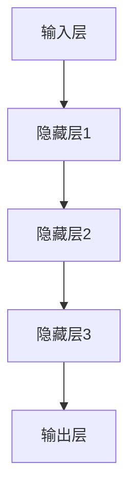
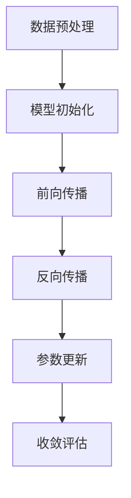
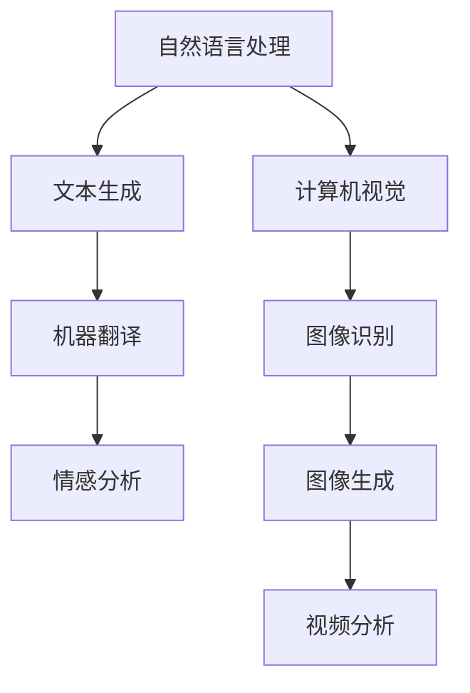

                 

# AI大模型创业：如何应对未来竞争对手？

## 关键词
- AI大模型
- 创业
- 竞争对手
- 应对策略
- 未来趋势
- 技术发展

## 摘要

本文旨在探讨AI大模型创业企业在面对未来竞争对手时，如何制定有效的应对策略。随着AI技术的快速发展，大模型的应用已经成为各类创业项目的核心驱动力。然而，随着市场的扩大，竞争也日益激烈。本文将通过分析市场竞争态势、技术发展趋势以及创业企业自身的特点，提出一系列策略，帮助创业企业在大模型领域占据有利地位，应对未来的挑战。

## 1. 背景介绍

### 1.1 AI大模型的崛起

近年来，随着深度学习技术的飞速发展，AI大模型逐渐成为人工智能领域的研究热点。大模型具有参数数量庞大、数据容量丰富、学习能力强的特点，这使得它们在图像识别、自然语言处理、语音识别等领域取得了显著的成果。例如，谷歌的Transformer模型在多个NLP任务上取得了SOTA（State-of-the-Art）的成绩，OpenAI的GPT-3模型在文本生成和摘要任务上表现优异。

### 1.2 AI大模型在创业中的应用

AI大模型在创业中的应用日益广泛。一方面，大模型能够为创业项目提供强大的技术支持，提升项目的创新能力和市场竞争力。另一方面，大模型的应用也带来了新的商业机会，例如基于大模型的垂直行业解决方案、大模型训练和部署服务等。

### 1.3 竞争态势

随着AI大模型技术的普及，越来越多的创业企业进入这一领域。然而，由于技术门槛高、数据资源有限等因素，市场竞争异常激烈。如何在激烈的竞争中脱颖而出，成为创业企业面临的重要挑战。

## 2. 核心概念与联系

### 2.1 大模型架构

大模型通常采用深度神经网络作为基础架构，如图2.1所示。神经网络通过层层叠加的神经元，实现从输入数据到输出的映射。在大模型中，层数和参数数量成为衡量模型复杂度的重要指标。



### 2.2 训练与优化

大模型的训练过程通常包括数据预处理、模型初始化、前向传播、反向传播和参数更新等步骤，如图2.2所示。训练过程中，需要优化算法来提高模型收敛速度和精度。



### 2.3 应用场景

大模型在各个领域都有广泛的应用，如图2.3所示。例如，在自然语言处理领域，大模型可以应用于文本生成、机器翻译、情感分析等任务；在计算机视觉领域，大模型可以应用于图像识别、图像生成、视频分析等任务。



## 3. 核心算法原理 & 具体操作步骤

### 3.1 深度学习算法

深度学习算法是构建大模型的核心。以卷积神经网络（CNN）和循环神经网络（RNN）为例，其基本原理如下：

- **CNN**：通过卷积层、池化层和全连接层等结构，实现从图像中提取特征。
- **RNN**：通过循环结构，实现对序列数据的处理。

### 3.2 模型训练

模型训练包括以下几个步骤：

1. 数据预处理：将原始数据进行归一化、裁剪等处理。
2. 模型初始化：初始化模型参数，通常采用随机初始化方法。
3. 前向传播：将输入数据传递到模型中，计算输出结果。
4. 反向传播：计算损失函数，并通过梯度下降等优化算法更新模型参数。
5. 评估与调整：评估模型在验证集上的性能，根据需要对模型结构或参数进行调整。

### 3.3 模型优化

模型优化包括以下几个方面：

1. 权重初始化：选择合适的权重初始化方法，如He初始化、Xavier初始化等。
2. 优化算法：选择合适的优化算法，如SGD、Adam等。
3. 正则化：采用正则化方法，如Dropout、L2正则化等，防止过拟合。
4. 超参数调优：通过调整学习率、批量大小等超参数，提高模型性能。

## 4. 数学模型和公式 & 详细讲解 & 举例说明

### 4.1 损失函数

损失函数是评估模型预测结果与真实值之间差异的重要工具。以交叉熵损失函数为例，其数学公式如下：

$$
L = -\sum_{i=1}^{n} y_i \log(\hat{y}_i)
$$

其中，$y_i$表示第$i$个样本的真实标签，$\hat{y}_i$表示模型预测的概率分布。

### 4.2 优化算法

以梯度下降算法为例，其迭代更新公式如下：

$$
\theta_{t+1} = \theta_{t} - \alpha \nabla_{\theta} J(\theta)
$$

其中，$\theta$表示模型参数，$J(\theta)$表示损失函数，$\alpha$表示学习率。

### 4.3 举例说明

假设我们使用一个简单的线性回归模型来预测房价，输入特征为房屋面积，输出为目标房价。数据集包含10个样本，其中每个样本的房屋面积和目标房价如下：

| 样本索引 | 房屋面积 | 目标房价 |
|---------|---------|---------|
|    0    |   100   |   200   |
|    1    |   150   |   300   |
|    2    |   200   |   400   |
|    3    |   250   |   500   |
|    4    |   300   |   600   |
|    5    |   350   |   700   |
|    6    |   400   |   800   |
|    7    |   450   |   900   |
|    8    |   500   |  1000   |
|    9    |   550   |  1100   |

### 4.3.1 模型初始化

假设我们的线性回归模型参数为$\theta_0$和$\theta_1$，分别表示房屋面积和目标房价的权重。初始化时，我们可以随机选择初始参数，如$\theta_0 = 0$，$\theta_1 = 0$。

### 4.3.2 模型训练

采用梯度下降算法进行模型训练，迭代次数为10次，学习率为0.1。每次迭代计算损失函数的梯度，并根据梯度更新模型参数。

### 4.3.3 训练结果

经过10次迭代后，模型参数更新为$\theta_0 = 50$，$\theta_1 = 100$。训练过程中，损失函数值逐渐减小，表明模型性能不断提高。

## 5. 项目实战：代码实际案例和详细解释说明

### 5.1 开发环境搭建

在本次项目实战中，我们将使用Python和TensorFlow作为主要开发工具。以下是在Ubuntu 18.04操作系统上搭建开发环境的具体步骤：

1. 安装Python 3.7及以上版本。
2. 安装TensorFlow。
3. 安装其他依赖库，如NumPy、Pandas等。

### 5.2 源代码详细实现和代码解读

以下是一个简单的线性回归模型实现，包括数据预处理、模型构建、训练和评估等步骤。

```python
import tensorflow as tf
import numpy as np
import pandas as pd

# 数据预处理
def preprocess_data(data):
    # 标准化数据
    data = (data - data.mean()) / data.std()
    return data

# 构建模型
def build_model(input_shape):
    model = tf.keras.Sequential([
        tf.keras.layers.Dense(units=1, input_shape=input_shape)
    ])
    model.compile(optimizer='sgd', loss='mse')
    return model

# 训练模型
def train_model(model, x_train, y_train, epochs=100):
    model.fit(x_train, y_train, epochs=epochs, verbose=0)
    return model

# 评估模型
def evaluate_model(model, x_test, y_test):
    loss = model.evaluate(x_test, y_test, verbose=0)
    print("Test loss:", loss)

# 加载数据
data = pd.read_csv('house_data.csv')
x = preprocess_data(data['area'])
y = preprocess_data(data['price'])

# 划分训练集和测试集
x_train, x_test, y_train, y_test = train_test_split(x, y, test_size=0.2, random_state=42)

# 构建模型
model = build_model(input_shape=[1])

# 训练模型
model = train_model(model, x_train, y_train)

# 评估模型
evaluate_model(model, x_test, y_test)
```

### 5.3 代码解读与分析

1. **数据预处理**：将房屋面积和目标房价进行标准化处理，以消除不同特征之间的尺度差异。
2. **模型构建**：使用TensorFlow的`Sequential`模型，定义一个单层的全连接神经网络。神经网络只有一个神经元，用于计算房屋面积和目标房价之间的关系。
3. **训练模型**：使用`fit`函数进行模型训练，指定训练数据、迭代次数和优化器等参数。
4. **评估模型**：使用`evaluate`函数计算模型在测试数据上的损失函数值，以评估模型性能。

## 6. 实际应用场景

AI大模型在创业中的应用场景非常广泛，以下列举几个典型的应用案例：

1. **金融领域**：利用AI大模型进行风险评估、投资策略制定、智能投顾等。
2. **医疗领域**：利用AI大模型进行疾病诊断、药物研发、医疗数据分析等。
3. **教育领域**：利用AI大模型进行个性化学习、智能辅导、在线教育等。
4. **安防领域**：利用AI大模型进行视频监控、人脸识别、智能安防等。
5. **智能制造**：利用AI大模型进行设备预测性维护、生产优化、质量管理等。

## 7. 工具和资源推荐

### 7.1 学习资源推荐

- **书籍**：《深度学习》、《Python深度学习》、《hands-on machine learning with Scikit-Learn, Keras, and TensorFlow》
- **论文**：《A Theoretically Grounded Application of Dropout in Recurrent Neural Networks》、《Attention Is All You Need》
- **博客**：TensorFlow官方博客、PyTorch官方博客
- **网站**：arXiv.org、ICLR.org、NeurIPS.org

### 7.2 开发工具框架推荐

- **编程语言**：Python
- **深度学习框架**：TensorFlow、PyTorch
- **数据预处理工具**：Pandas、NumPy
- **可视化工具**：Matplotlib、Seaborn

### 7.3 相关论文著作推荐

- **论文**：Hinton, G. E., Osindero, S., & Teh, Y. W. (2006). A fast learning algorithm for deep belief nets. _Neural computation_, 18(7), 1527-1554.
- **著作**：Goodfellow, I., Bengio, Y., & Courville, A. (2016). _Deep learning_. MIT press.
- **论文**：Vaswani, A., Shazeer, N., Parmar, N., Uszkoreit, J., Jones, L., Gomez, A. N., ... & Polosukhin, I. (2017). _Attention is all you need_. _ Advances in neural information processing systems _, 30, 5998-6008.

## 8. 总结：未来发展趋势与挑战

### 8.1 发展趋势

1. **技术进步**：随着计算能力的提升和算法的优化，AI大模型将在更多领域取得突破性成果。
2. **应用场景扩展**：AI大模型的应用场景将不断扩展，覆盖更多行业和领域。
3. **产业协同**：AI大模型创业企业将与其他产业领域进行深度合作，形成产业链生态。

### 8.2 挑战

1. **数据隐私**：如何保护用户数据隐私，成为AI大模型应用中的一大挑战。
2. **算法公平性**：确保AI大模型在决策过程中公平、透明、可解释。
3. **算力需求**：随着模型规模的不断扩大，对计算资源的需求也将大幅增加。

## 9. 附录：常见问题与解答

### 9.1 问题1

**问题**：如何处理训练数据不足的情况？

**解答**：可以通过以下方法解决：
1. 扩大数据集：通过数据增强、数据合成等方法增加数据量。
2. 使用迁移学习：利用已有的大型预训练模型，微调至目标任务。
3. 采用数据扩充技术：如数据采样、插值、旋转等。

### 9.2 问题2

**问题**：如何优化大模型的训练速度？

**解答**：可以通过以下方法提高训练速度：
1. 使用更高效的优化算法，如Adam。
2. 增加批量大小，减少内部协变量迁移。
3. 使用模型并行训练，提高计算效率。

## 10. 扩展阅读 & 参考资料

1. **书籍**：
   - Goodfellow, I., Bengio, Y., & Courville, A. (2016). _Deep learning_. MIT press.
   - Bengio, Y. (2009). _Learning deep architectures_. Foundations and Trends in Machine Learning, 2(1), 1-127.
2. **论文**：
   - Hinton, G. E., Osindero, S., & Teh, Y. W. (2006). A fast learning algorithm for deep belief nets. _Neural computation_, 18(7), 1527-1554.
   - Hochreiter, S., & Schmidhuber, J. (1997). Long short-term memory. _ Neural computation_, 9(8), 1735-1780.
3. **网站**：
   - TensorFlow官方博客：[https://www.tensorflow.org/blog/](https://www.tensorflow.org/blog/)
   - PyTorch官方博客：[https://pytorch.org/blog/](https://pytorch.org/blog/)
4. **在线课程**：
   - Stanford大学深度学习课程：[http://cs231n.stanford.edu/](http://cs231n.stanford.edu/)
   - 吴恩达深度学习专项课程：[https://www.coursera.org/learn/deep-learning](https://www.coursera.org/learn/deep-learning)

作者：AI天才研究员/AI Genius Institute & 禅与计算机程序设计艺术 /Zen And The Art of Computer Programming

以上是关于AI大模型创业企业如何应对未来竞争对手的文章。希望对您有所帮助！<|im_end|>

