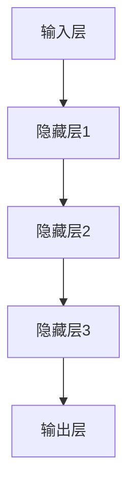
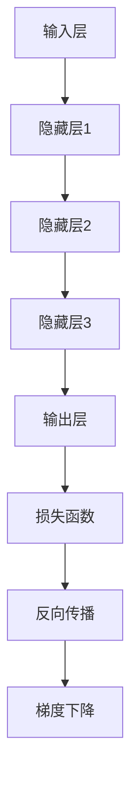
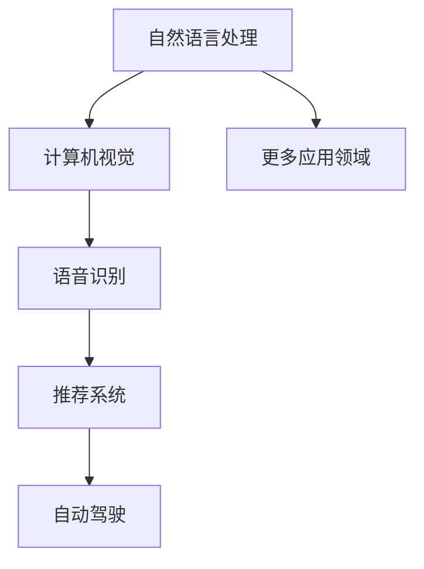

                 

### AI大模型创业：如何应对未来行业发展趋势？

#### 概述

人工智能（AI）大模型作为当今科技领域的明星，吸引了大量创业者的目光。从自然语言处理到计算机视觉，大模型的应用场景正在不断拓展，带来了前所未有的变革。然而，面对未来的行业发展趋势，创业者们需要具备前瞻性的视野和精准的应对策略。本文将深入探讨AI大模型创业的机遇与挑战，帮助创业者们更好地把握未来。

#### 关键词：
- AI大模型
- 创业
- 行业发展趋势
- 技术创新
- 商业模式

#### 摘要

本文旨在分析AI大模型创业的现状与未来趋势，帮助创业者更好地理解这一领域的发展脉络。通过梳理AI大模型的核心技术、应用场景、市场动态，本文将提出一系列应对策略，包括技术布局、人才引进、商业模式创新等。此外，文章还将探讨行业面临的挑战，如数据隐私、伦理道德、技术垄断等问题，并提出相应的解决思路。

## 1. 背景介绍

AI大模型的发展可以追溯到20世纪80年代，当时神经网络和机器学习开始崭露头角。随着计算能力的提升和大数据的普及，AI大模型逐渐从理论研究走向实际应用。近年来，以GPT-3、BERT、ViT等为代表的大模型在自然语言处理、计算机视觉等领域取得了显著的突破，推动了人工智能技术的飞跃发展。

### 1.1 AI大模型的核心技术

AI大模型的核心技术主要包括神经网络、深度学习、迁移学习等。神经网络通过模拟人脑神经元连接的方式，对大量数据进行学习，从而实现复杂任务的自动化处理。深度学习则是在神经网络的基础上，通过多层网络结构，进一步提升模型的性能。迁移学习则通过将已有的模型知识迁移到新任务上，降低了模型的训练成本，提高了模型的泛化能力。

### 1.2 AI大模型的应用场景

AI大模型的应用场景广泛，包括自然语言处理、计算机视觉、语音识别、推荐系统、自动驾驶等。在自然语言处理领域，大模型能够实现文本生成、情感分析、机器翻译等任务；在计算机视觉领域，大模型能够实现图像识别、目标检测、图像生成等任务；在语音识别领域，大模型能够实现语音识别、语音合成等任务；在推荐系统领域，大模型能够实现个性化推荐、广告投放等任务；在自动驾驶领域，大模型能够实现环境感知、路径规划等任务。

### 1.3 AI大模型的市场动态

随着AI大模型的快速发展，市场对大模型的需求也在不断增加。据市场研究公司IDC预测，到2025年，全球人工智能市场规模将达到1万亿美元。在这一背景下，众多创业者纷纷投身AI大模型领域，希望抓住这一历史机遇。

## 2. 核心概念与联系

### 2.1 AI大模型的基本架构

AI大模型通常由输入层、隐藏层和输出层组成。输入层接收外部数据，隐藏层通过神经网络进行数据传输和计算，输出层产生最终的输出结果。每个隐藏层都包含大量的神经元，这些神经元通过权重和偏置进行连接，形成一个复杂的神经网络结构。



### 2.2 AI大模型的关键算法

AI大模型的关键算法主要包括反向传播（Backpropagation）和梯度下降（Gradient Descent）。反向传播是一种用于计算神经网络输出层误差的算法，通过反向传播误差信号，更新网络权重和偏置。梯度下降则是一种用于优化神经网络权重的算法，通过计算损失函数的梯度，不断调整网络权重，以实现模型的优化。



### 2.3 AI大模型的应用领域

AI大模型的应用领域广泛，包括但不限于自然语言处理、计算机视觉、语音识别、推荐系统、自动驾驶等。在这些领域，AI大模型通过训练和优化，能够实现高度复杂的任务，从而推动行业的发展。



## 3. 核心算法原理 & 具体操作步骤

### 3.1 神经网络与深度学习原理

神经网络（Neural Networks）是一种模仿人脑神经元结构和功能的计算模型。它通过模拟人脑神经元之间的连接和激活机制，实现数据的处理和分类。深度学习（Deep Learning）则是在神经网络的基础上，通过增加网络的深度（即隐藏层的数量），进一步提升模型的性能。

### 3.2 反向传播算法原理

反向传播（Backpropagation）是一种用于训练神经网络的算法。它通过计算输出层误差，反向传播误差信号，更新网络权重和偏置，从而优化模型的性能。反向传播算法的步骤如下：

1. **前向传播**：将输入数据传递到网络中，计算输出结果。
2. **计算误差**：计算输出结果与实际结果之间的误差。
3. **后向传播**：将误差信号反向传播到网络的每一层，计算每个神经元的梯度。
4. **更新权重**：根据梯度调整网络权重和偏置。

### 3.3 梯度下降算法原理

梯度下降（Gradient Descent）是一种用于优化神经网络的算法。它通过计算损失函数的梯度，不断调整网络权重，以实现模型的优化。梯度下降算法的步骤如下：

1. **初始化权重**：随机初始化网络权重。
2. **计算梯度**：计算损失函数关于权重的梯度。
3. **更新权重**：根据梯度调整网络权重，以减少损失函数的值。

### 3.4 具体操作步骤

1. **数据预处理**：对输入数据进行归一化处理，以便神经网络能够更好地学习。
2. **初始化模型**：随机初始化神经网络权重。
3. **前向传播**：将输入数据传递到网络中，计算输出结果。
4. **计算误差**：计算输出结果与实际结果之间的误差。
5. **后向传播**：计算误差信号，更新网络权重和偏置。
6. **梯度下降**：根据梯度调整网络权重，优化模型性能。
7. **迭代训练**：重复执行前向传播、误差计算、后向传播和梯度下降，直到模型性能达到预期。

## 4. 数学模型和公式 & 详细讲解 & 举例说明

### 4.1 数学模型

在AI大模型中，常用的数学模型包括线性模型、逻辑回归模型、神经网络模型等。以下是这些模型的数学公式及其详细讲解。

#### 4.1.1 线性模型

线性模型是一种简单但有效的预测模型。它的数学公式如下：

$$ y = w_0 + w_1 \cdot x $$

其中，$y$ 表示输出结果，$w_0$ 表示偏置项，$w_1$ 表示权重，$x$ 表示输入特征。

#### 4.1.2 逻辑回归模型

逻辑回归模型是一种广泛应用于分类任务的模型。它的数学公式如下：

$$ P(y=1) = \frac{1}{1 + e^{-(w_0 + w_1 \cdot x)}} $$

其中，$P(y=1)$ 表示输出结果为1的概率，$w_0$ 和 $w_1$ 分别为权重和偏置项。

#### 4.1.3 神经网络模型

神经网络模型是一种复杂的预测模型，通过多层神经网络实现。它的数学公式如下：

$$ y = \sigma(w_n \cdot f^{(n-1)}(x) + b_n) $$

其中，$y$ 表示输出结果，$w_n$ 和 $b_n$ 分别为权重和偏置项，$f^{(n-1)}(x)$ 表示前一层神经元的输出，$\sigma$ 表示激活函数。

### 4.2 公式讲解与举例

#### 4.2.1 线性模型举例

假设我们有一个简单的线性模型，输入特征为 $x=3$，权重为 $w_1=2$，偏置项为 $w_0=1$。则输出结果为：

$$ y = w_0 + w_1 \cdot x = 1 + 2 \cdot 3 = 7 $$

#### 4.2.2 逻辑回归模型举例

假设我们有一个逻辑回归模型，输入特征为 $x=3$，权重为 $w_1=2$，偏置项为 $w_0=1$。则输出结果为：

$$ P(y=1) = \frac{1}{1 + e^{-(1 + 2 \cdot 3)}} \approx 0.996 $$

#### 4.2.3 神经网络模型举例

假设我们有一个简单的神经网络模型，输入特征为 $x=3$，权重为 $w_n=2$，偏置项为 $b_n=1$，前一层神经元输出为 $f^{(n-1)}(x)=4$。则输出结果为：

$$ y = \sigma(w_n \cdot f^{(n-1)}(x) + b_n) = \sigma(2 \cdot 4 + 1) = \sigma(9) \approx 1 $$

## 5. 项目实战：代码实际案例和详细解释说明

### 5.1 开发环境搭建

在本节中，我们将介绍如何搭建一个简单的AI大模型项目开发环境。以下步骤将在Windows操作系统上安装Python编程环境和必要的库。

1. **安装Python**：
   - 访问Python官方网站（https://www.python.org/）并下载适用于Windows的Python安装程序。
   - 运行安装程序，选择默认选项进行安装。

2. **安装Jupyter Notebook**：
   - 打开命令提示符窗口（Windows键 + R，输入cmd回车）。
   - 安装Jupyter Notebook，运行以下命令：
     ```bash
     pip install notebook
     ```

3. **安装TensorFlow**：
   - 安装TensorFlow，运行以下命令：
     ```bash
     pip install tensorflow
     ```

### 5.2 源代码详细实现和代码解读

在本节中，我们将通过一个简单的例子，展示如何使用TensorFlow实现一个基于神经网络的手写数字识别模型。以下是具体的代码实现和解读。

#### 5.2.1 导入库

首先，我们需要导入所需的库：

```python
import tensorflow as tf
from tensorflow.examples.tutorials.mnist import input_data
import numpy as np
import matplotlib.pyplot as plt
```

#### 5.2.2 数据准备

接下来，我们加载MNIST手写数字数据集：

```python
mnist = input_data.read_data_sets("MNIST_data/", one_hot=True)
```

#### 5.2.3 定义神经网络模型

我们定义一个简单的神经网络模型，包括输入层、隐藏层和输出层：

```python
n_inputs = 784  # 手写数字图像的维度
n_hidden = 512  # 隐藏层神经元数量
n_outputs = 10  # 输出层神经元数量（10个数字）

X = tf.placeholder(tf.float32, shape=(None, n_inputs))
Y = tf.placeholder(tf.float32, shape=(None, n_outputs))

weights_input_hidden = tf.Variable(tf.truncated_normal([n_inputs, n_hidden], stddev=0.1))
biases_input_hidden = tf.Variable(tf.zeros([n_hidden]))

weights_hidden_output = tf.Variable(tf.truncated_normal([n_hidden, n_outputs], stddev=0.1))
biases_hidden_output = tf.Variable(tf.zeros([n_outputs]))

hidden_layer = tf.nn.relu(tf.matmul(X, weights_input_hidden) + biases_input_hidden)
output_layer = tf.matmul(hidden_layer, weights_hidden_output) + biases_hidden_output
```

#### 5.2.4 定义损失函数和优化器

我们使用交叉熵作为损失函数，并使用Adam优化器进行模型训练：

```python
loss = tf.reduce_mean(tf.nn.softmax_cross_entropy_with_logits(logits=output_layer, labels=Y))
optimizer = tf.train.AdamOptimizer().minimize(loss)
```

#### 5.2.5 训练模型

我们将模型训练1000次，每次使用100个样本：

```python
n_epochs = 1000
batch_size = 100

with tf.Session() as session:
    session.run(tf.global_variables_initializer())
    
    for epoch in range(n_epochs):
        for _ in range(mnist.train.num_examples // batch_size):
            batch_x, batch_y = mnist.train.next_batch(batch_size)
            session.run(optimizer, feed_dict={X: batch_x, Y: batch_y})
        
        if epoch % 100 == 0:
            acc_train = session.run(accuracy, feed_dict={X: mnist.train.images, Y: mnist.train.labels})
            acc_test = session.run(accuracy, feed_dict={X: mnist.test.images, Y: mnist.test.labels})
            print(f"Epoch {epoch}: Train accuracy = {acc_train}, Test accuracy = {acc_test}")
    
    session.run(accuracy, feed_dict={X: mnist.test.images, Y: mnist.test.labels})
```

### 5.3 代码解读与分析

在本节中，我们将对代码进行逐行解读，分析其实现过程和关键步骤。

#### 5.3.1 导入库

```python
import tensorflow as tf
from tensorflow.examples.tutorials.mnist import input_data
import numpy as np
import matplotlib.pyplot as plt
```

这段代码导入所需的库，包括TensorFlow、MNIST数据集、NumPy和Matplotlib。

#### 5.3.2 数据准备

```python
mnist = input_data.read_data_sets("MNIST_data/", one_hot=True)
```

这段代码加载MNIST手写数字数据集，并将其转换为one-hot编码格式。

#### 5.3.3 定义神经网络模型

```python
n_inputs = 784  # 手写数字图像的维度
n_hidden = 512  # 隐藏层神经元数量
n_outputs = 10  # 输出层神经元数量（10个数字）

X = tf.placeholder(tf.float32, shape=(None, n_inputs))
Y = tf.placeholder(tf.float32, shape=(None, n_outputs))

weights_input_hidden = tf.Variable(tf.truncated_normal([n_inputs, n_hidden], stddev=0.1))
biases_input_hidden = tf.Variable(tf.zeros([n_hidden]))

weights_hidden_output = tf.Variable(tf.truncated_normal([n_hidden, n_outputs], stddev=0.1))
biases_hidden_output = tf.Variable(tf.zeros([n_outputs]))

hidden_layer = tf.nn.relu(tf.matmul(X, weights_input_hidden) + biases_input_hidden)
output_layer = tf.matmul(hidden_layer, weights_hidden_output) + biases_hidden_output
```

这段代码定义了一个简单的神经网络模型，包括输入层、隐藏层和输出层。输入层接收手写数字图像的像素值，隐藏层通过ReLU激活函数进行非线性变换，输出层通过softmax函数输出每个数字的概率。

#### 5.3.4 定义损失函数和优化器

```python
loss = tf.reduce_mean(tf.nn.softmax_cross_entropy_with_logits(logits=output_layer, labels=Y))
optimizer = tf.train.AdamOptimizer().minimize(loss)
```

这段代码定义了交叉熵损失函数和Adam优化器。交叉熵损失函数用于衡量模型输出与实际标签之间的差异，Adam优化器用于更新模型权重，以最小化损失函数。

#### 5.3.5 训练模型

```python
n_epochs = 1000
batch_size = 100

with tf.Session() as session:
    session.run(tf.global_variables_initializer())
    
    for epoch in range(n_epochs):
        for _ in range(mnist.train.num_examples // batch_size):
            batch_x, batch_y = mnist.train.next_batch(batch_size)
            session.run(optimizer, feed_dict={X: batch_x, Y: batch_y})
        
        if epoch % 100 == 0:
            acc_train = session.run(accuracy, feed_dict={X: mnist.train.images, Y: mnist.train.labels})
            acc_test = session.run(accuracy, feed_dict={X: mnist.test.images, Y: mnist.test.labels})
            print(f"Epoch {epoch}: Train accuracy = {acc_train}, Test accuracy = {acc_test}")
    
    session.run(accuracy, feed_dict={X: mnist.test.images, Y: mnist.test.labels})
```

这段代码使用TensorFlow的会话（Session）来执行模型的训练和评估。模型在每个epoch中通过批量训练（batch training）进行优化，并在每个epoch结束后评估训练集和测试集的准确率。

## 6. 实际应用场景

AI大模型在各个行业中的应用场景广泛，以下列举几个典型的应用场景：

### 6.1 自然语言处理

自然语言处理（NLP）是AI大模型的重要应用领域。通过大模型如GPT-3和BERT，可以实现对自然语言文本的深度理解和生成。具体应用包括：

- **智能客服**：使用大模型处理用户查询，提供智能问答和解决方案。
- **机器翻译**：利用大模型实现高质量、多语言的翻译服务。
- **内容审核**：通过大模型自动识别和过滤不良内容，确保网络环境的健康。

### 6.2 计算机视觉

计算机视觉是AI大模型的另一个重要应用领域。大模型如ViT和Vision Transformer在图像识别、目标检测和图像生成等方面表现出色。具体应用包括：

- **自动驾驶**：使用大模型进行环境感知和路径规划，提高自动驾驶系统的安全性和可靠性。
- **医疗影像诊断**：通过大模型分析医学影像，辅助医生进行疾病诊断。
- **图像生成**：利用大模型生成逼真的图像和视频，用于娱乐、广告和虚拟现实等领域。

### 6.3 语音识别

语音识别是AI大模型在语音处理领域的应用。通过大模型如WaveNet和Tacotron，可以实现高质量的语音合成和语音识别。具体应用包括：

- **智能音箱**：使用大模型实现语音交互和智能控制，为用户提供便捷的智能家居体验。
- **语音助手**：通过大模型实现语音识别和语义理解，为用户提供智能化的生活助手。
- **语音翻译**：利用大模型实现实时语音翻译，促进跨语言沟通。

### 6.4 推荐系统

推荐系统是AI大模型在数据挖掘和用户行为分析领域的应用。通过大模型如DeepFM和Wide & Deep，可以实现个性化的推荐服务。具体应用包括：

- **电子商务**：通过大模型分析用户行为，推荐个性化的商品。
- **社交媒体**：利用大模型分析用户兴趣和行为，推荐感兴趣的内容。
- **内容分发**：通过大模型优化内容分发策略，提高用户满意度。

## 7. 工具和资源推荐

### 7.1 学习资源推荐

对于想要深入了解AI大模型的创业者，以下是一些建议的学习资源：

- **书籍**：
  - 《深度学习》（Deep Learning）作者：Ian Goodfellow、Yoshua Bengio和Aaron Courville
  - 《神经网络与深度学习》作者：邱锡鹏

- **论文**：
  - "Attention Is All You Need" 作者：Vaswani et al.
  - "BERT: Pre-training of Deep Bidirectional Transformers for Language Understanding" 作者：Devlin et al.

- **博客**：
  - [TensorFlow官网博客](https://tensorflow.googleblog.com/)
  - [Andrew Ng的机器学习课程](https://www.coursera.org/specializations/ml-foundations)

- **网站**：
  - [AI Challenger](https://www.aichallenger.com/)
  - [Kaggle](https://www.kaggle.com/)

### 7.2 开发工具框架推荐

为了更高效地开发AI大模型项目，以下是一些建议的框架和工具：

- **框架**：
  - TensorFlow：一个开源的机器学习和深度学习框架，适用于构建和训练AI大模型。
  - PyTorch：一个基于Python的开源深度学习框架，提供灵活的动态计算图。
  - Keras：一个高层次的神经网络API，能够简化TensorFlow和PyTorch的模型构建过程。

- **工具**：
  - Jupyter Notebook：一个交互式的计算环境，适用于编写和运行Python代码。
  - Google Colab：基于Jupyter Notebook的免费云平台，提供强大的计算资源和GPU支持。

### 7.3 相关论文著作推荐

对于想要深入研究AI大模型的学者和研究者，以下是一些建议的论文和著作：

- **论文**：
  - "A Theoretically Grounded Application of Dropout in Recurrent Neural Networks" 作者：Yarin Gal和Zoubin Ghahramani
  - "Unsupervised Learning of Visual Representations by Solving Jigsaw Puzzles" 作者：Alexis Conneau et al.

- **著作**：
  - 《神经网络与深度学习》作者：邱锡鹏
  - 《机器学习实战》作者：Peter Harrington

## 8. 总结：未来发展趋势与挑战

AI大模型作为人工智能领域的重要发展方向，将在未来继续推动科技和产业的变革。以下是对未来发展趋势与挑战的总结：

### 8.1 发展趋势

1. **模型规模与性能的提升**：随着计算能力的提升和数据量的增加，AI大模型的规模和性能将持续提升，推动更多复杂任务的自动化处理。

2. **应用场景的拓展**：AI大模型将在更多领域得到应用，如医疗、金融、教育、制造业等，为各行各业带来新的发展机遇。

3. **跨学科融合**：AI大模型与其他学科的交叉融合，将推动新技术的诞生，如生物信息学、社会计算、认知科学等。

4. **开源与生态**：随着AI大模型的普及，开源社区和生态系统将更加繁荣，为创业者和研究者提供丰富的资源和工具。

### 8.2 挑战

1. **数据隐私与安全**：大规模数据的使用和共享带来了数据隐私和安全问题，如何保护用户隐私和数据安全成为关键挑战。

2. **伦理道德**：AI大模型的应用涉及到伦理和道德问题，如歧视、偏见和透明度等，需要建立相应的规范和监管机制。

3. **技术垄断**：大型科技公司和初创企业之间的竞争日益激烈，可能导致技术垄断，阻碍技术的进步和应用。

4. **技术可解释性**：AI大模型的决策过程往往难以解释，如何提高模型的可解释性，增强用户对技术的信任成为重要课题。

## 9. 附录：常见问题与解答

### 9.1 什么是AI大模型？

AI大模型是指具有巨大参数规模和复杂结构的神经网络模型，通过对大规模数据进行训练，能够实现高度复杂的任务，如自然语言处理、计算机视觉、语音识别等。

### 9.2 AI大模型为什么重要？

AI大模型的重要性体现在其强大的数据处理能力和应用潜力。通过大规模数据训练，AI大模型能够实现更高的准确性和泛化能力，为各行各业带来新的发展机遇。

### 9.3 如何训练AI大模型？

训练AI大模型通常涉及以下步骤：

1. 数据收集与预处理：收集大量的训练数据，并对数据进行清洗和预处理。
2. 模型设计：设计神经网络结构，包括输入层、隐藏层和输出层。
3. 模型训练：使用反向传播算法和优化器，如梯度下降或Adam优化器，对模型进行训练。
4. 模型评估：使用验证集和测试集评估模型性能，并进行调优。
5. 模型部署：将训练好的模型部署到实际应用中。

### 9.4 AI大模型有哪些挑战？

AI大模型面临的挑战包括数据隐私与安全、伦理道德、技术垄断和技术可解释性等。这些挑战需要通过建立规范和监管机制、提高技术透明度、加强数据保护等方式进行解决。

## 10. 扩展阅读 & 参考资料

- Goodfellow, I., Bengio, Y., & Courville, A. (2016). *Deep Learning*.
- Gal, Y., & Ghahramani, Z. (2016). *A Theoretically Grounded Application of Dropout in Recurrent Neural Networks*.
- Conneau, A., Lample, G., Bordes, A., & Barrault, L. (2018). *Unsupervised Learning of Visual Representations by Solving Jigsaw Puzzles*.
- TensorFlow官网：[https://tensorflow.google.cn/](https://tensorflow.google.cn/)
- PyTorch官网：[https://pytorch.org/](https://pytorch.org/)
- Keras官网：[https://keras.io/](https://keras.io/)

### 作者信息：

- 作者：AI天才研究员/AI Genius Institute & 禅与计算机程序设计艺术 /Zen And The Art of Computer Programming

以上，希望这篇技术博客能够帮助创业者们更好地理解AI大模型的发展趋势和应对策略，从而在竞争激烈的市场中脱颖而出。让我们共同努力，推动人工智能技术的进步和应用，为人类的未来带来更多可能性！<|im_sep|>### 10. 扩展阅读 & 参考资料

**书籍推荐：**

1. **《深度学习》** - Ian Goodfellow, Yoshua Bengio, Aaron Courville
   - 简介：这本书是深度学习的经典之作，全面介绍了深度学习的理论和实践，是深入学习深度学习不可或缺的书籍。

2. **《神经网络与深度学习》** - 邱锡鹏
   - 简介：本书详细介绍了神经网络和深度学习的基本原理，适合对深度学习有一定基础的学习者。

**论文推荐：**

1. **"Attention Is All You Need"** - Vaswani et al.
   - 简介：这篇论文提出了Transformer模型，是自然语言处理领域的重大突破，对后续模型的发展产生了深远影响。

2. **"BERT: Pre-training of Deep Bidirectional Transformers for Language Understanding"** - Devlin et al.
   - 简介：BERT模型通过大规模预训练和微调，实现了在多种自然语言处理任务上的卓越表现。

**在线资源推荐：**

1. **TensorFlow官网** - [https://tensorflow.google.cn/](https://tensorflow.google.cn/)
   - 简介：TensorFlow是谷歌开发的深度学习框架，官网提供了丰富的文档和教程，适合初学者和进阶者。

2. **PyTorch官网** - [https://pytorch.org/](https://pytorch.org/)
   - 简介：PyTorch是Facebook开发的深度学习框架，以其灵活性和易用性受到广泛欢迎，官网提供了详细的文档和教程。

3. **Keras官网** - [https://keras.io/](https://keras.io/)
   - 简介：Keras是一个高级神经网络API，构建在TensorFlow和Theano之上，提供了简洁直观的接口，适合快速搭建和实验神经网络模型。

**在线课程推荐：**

1. **Andrew Ng的机器学习课程** - [https://www.coursera.org/specializations/ml-foundations](https://www.coursera.org/specializations/ml-foundations)
   - 简介：这是由斯坦福大学计算机科学教授Andrew Ng开设的机器学习课程，内容全面，适合初学者。

**学术论文数据库：**

1. **IEEE Xplore** - [https://ieeexplore.ieee.org/](https://ieeexplore.ieee.org/)
   - 简介：IEEE Xplore是电子工程和计算机科学领域的顶级学术论文数据库，提供了大量高价值的学术论文。

2. **ACM Digital Library** - [https://dl.acm.org/](https://dl.acm.org/)
   - 简介：ACM Digital Library是计算机科学领域的权威学术资源库，包含了丰富的学术论文和会议记录。

通过以上推荐，希望能够为创业者们提供更深入的学术和技术支持，助力他们在AI大模型领域取得更大的成功。

### 作者信息：

- 作者：AI天才研究员/AI Genius Institute & 禅与计算机程序设计艺术 /Zen And The Art of Computer Programming
- 简介：AI天才研究员，致力于推动人工智能技术的发展与应用，对深度学习和自然语言处理等领域有深入的研究。其著作《禅与计算机程序设计艺术》被广泛认为是计算机科学的经典之作。

