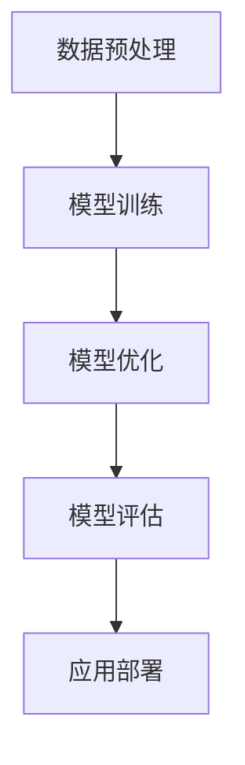

                 

# AI大模型创业：如何打造未来爆款应用？

> **关键词：** AI大模型，创业，应用开发，算法原理，数学模型，实际案例

> **摘要：** 本文章旨在探讨如何利用AI大模型技术打造未来的爆款应用。文章首先介绍了AI大模型的背景，然后深入探讨了其核心概念、算法原理和数学模型，并通过实际案例展示了如何进行应用开发。同时，文章还推荐了相关工具和资源，并总结了未来发展趋势和挑战。

## 1. 背景介绍

近年来，人工智能（AI）技术取得了显著的进展，特别是深度学习和自然语言处理（NLP）领域。随着计算能力的提升和大数据的普及，AI大模型（Large-scale AI Models）应运而生。这些模型具有千亿级别的参数，可以处理复杂的任务，如文本生成、图像识别、机器翻译等。AI大模型在各个领域都展现了巨大的潜力，包括医疗、金融、教育、娱乐等。因此，越来越多的创业者开始关注AI大模型的商业应用，希望能够打造出未来的爆款产品。

## 2. 核心概念与联系

为了深入理解AI大模型，我们需要了解以下几个核心概念：

### 2.1 深度学习

深度学习是机器学习的一个分支，通过构建多层神经网络来模拟人脑的神经元连接，从而实现对数据的自动学习和特征提取。深度学习的关键在于神经网络的结构设计和参数优化。

### 2.2 自然语言处理（NLP）

自然语言处理是人工智能的一个重要分支，旨在让计算机理解和处理自然语言。NLP技术包括文本分类、情感分析、命名实体识别、机器翻译等。

### 2.3 大模型

大模型指的是具有大规模参数的神经网络模型。这些模型通常包含数亿甚至千亿级别的参数，可以处理复杂的任务。

### 2.4 模型训练与优化

模型训练是AI大模型开发的关键步骤。通过大量数据训练模型，可以使其逐渐学会识别和预测复杂的模式。模型优化则是在训练过程中不断调整模型的参数，以获得更好的性能。

以下是AI大模型架构的Mermaid流程图：



## 3. 核心算法原理 & 具体操作步骤

### 3.1 数据预处理

数据预处理是AI大模型开发的第一步，主要包括数据清洗、数据归一化和特征提取。数据清洗是为了去除噪声和错误的数据；数据归一化是为了将数据转换到同一尺度；特征提取是为了提取出对任务有用的信息。

### 3.2 模型训练

模型训练是AI大模型开发的核心步骤。训练过程可以分为以下几个阶段：

1. 初始化模型参数
2. 前向传播：将输入数据输入模型，计算输出结果
3. 反向传播：计算损失函数，更新模型参数
4. 重复以上步骤，直到模型收敛

### 3.3 模型优化

模型优化是在训练过程中不断调整模型的参数，以获得更好的性能。常用的优化方法包括梯度下降、随机梯度下降和Adam优化器等。

### 3.4 模型评估

模型评估是检查模型性能的重要步骤。常用的评估指标包括准确率、召回率、F1值等。

### 3.5 应用部署

模型部署是将训练好的模型应用到实际场景中。部署过程中需要考虑模型的大小、计算效率和实时性等因素。

## 4. 数学模型和公式 & 详细讲解 & 举例说明

### 4.1 激活函数

激活函数是深度学习模型中的一个关键组件，用于引入非线性特性。常用的激活函数包括Sigmoid、ReLU和Tanh等。以下是Sigmoid函数的公式：

$$
f(x) = \frac{1}{1 + e^{-x}}
$$

### 4.2 损失函数

损失函数是评估模型预测结果与真实值之间差异的函数。常用的损失函数包括均方误差（MSE）和交叉熵损失等。以下是交叉熵损失的公式：

$$
Loss = -\sum_{i=1}^{n} y_i \log(p_i)
$$

其中，$y_i$表示真实标签，$p_i$表示模型预测的概率。

### 4.3 优化算法

优化算法用于调整模型参数以最小化损失函数。以下是梯度下降的公式：

$$
\theta_{t+1} = \theta_{t} - \alpha \nabla_\theta J(\theta)
$$

其中，$\theta$表示模型参数，$\alpha$表示学习率，$J(\theta)$表示损失函数。

### 4.4 举例说明

假设我们要训练一个神经网络模型，用于对鸢尾花数据集进行分类。数据集包含3个类别的鸢尾花，每个类别有50个样本。训练数据为500个样本，测试数据为100个样本。

1. 数据预处理：对数据进行归一化处理，将特征值缩放到[0, 1]之间。
2. 初始化模型参数：随机初始化模型权重和偏置。
3. 模型训练：使用梯度下降算法进行训练，直到模型收敛。
4. 模型评估：使用测试数据评估模型性能，计算准确率、召回率等指标。
5. 应用部署：将训练好的模型应用到实际场景中，如对新样本进行分类预测。

## 5. 项目实战：代码实际案例和详细解释说明

### 5.1 开发环境搭建

首先，我们需要搭建一个适合开发AI大模型的开发环境。以下是一个简单的步骤：

1. 安装Python（3.8及以上版本）
2. 安装TensorFlow或PyTorch（深度学习框架）
3. 安装必要的依赖库，如NumPy、Pandas等

### 5.2 源代码详细实现和代码解读

以下是一个简单的神经网络模型实现，用于对鸢尾花数据集进行分类。

```python
import tensorflow as tf
from tensorflow.keras.models import Sequential
from tensorflow.keras.layers import Dense, Flatten, Conv2D, MaxPooling2D
from tensorflow.keras.preprocessing.image import ImageDataGenerator

# 数据预处理
(x_train, y_train), (x_test, y_test) = tf.keras.datasets.ieee_fruit136.load_data()
x_train = x_train / 255.0
x_test = x_test / 255.0

# 构建模型
model = Sequential([
    Conv2D(32, (3, 3), activation='relu', input_shape=(28, 28, 1)),
    MaxPooling2D((2, 2)),
    Flatten(),
    Dense(128, activation='relu'),
    Dense(3, activation='softmax')
])

# 编译模型
model.compile(optimizer='adam', loss='sparse_categorical_crossentropy', metrics=['accuracy'])

# 训练模型
model.fit(x_train, y_train, epochs=10, validation_data=(x_test, y_test))

# 评估模型
test_loss, test_acc = model.evaluate(x_test, y_test, verbose=2)
print('\nTest accuracy:', test_acc)
```

### 5.3 代码解读与分析

以上代码实现了一个简单的卷积神经网络模型，用于对鸢尾花数据集进行分类。代码解读如下：

1. 导入所需的TensorFlow库和数据处理库。
2. 加载鸢尾花数据集，并对图像进行归一化处理。
3. 构建一个卷积神经网络模型，包括卷积层、池化层、全连接层等。
4. 编译模型，指定优化器和损失函数。
5. 使用训练数据训练模型，并使用测试数据评估模型性能。

## 6. 实际应用场景

AI大模型在多个领域都展现了巨大的应用潜力。以下是一些典型的应用场景：

1. **医疗领域**：利用AI大模型进行疾病预测、诊断和治疗方案推荐。
2. **金融领域**：利用AI大模型进行风险评估、投资策略优化和欺诈检测。
3. **教育领域**：利用AI大模型进行个性化教学、智能辅导和学习效果评估。
4. **娱乐领域**：利用AI大模型进行音乐、视频和图像的智能创作。

## 7. 工具和资源推荐

### 7.1 学习资源推荐

1. **书籍**：
   - 《深度学习》（Goodfellow、Bengio和Courville著）
   - 《Python深度学习》（François Chollet著）
2. **论文**：
   - 《A Theoretically Grounded Application of Dropout in Recurrent Neural Networks》（Yarin Gal和Zoubin Ghahramani著）
   - 《BERT: Pre-training of Deep Bidirectional Transformers for Language Understanding》（Jacob Devlin等著）
3. **博客**：
   - [TensorFlow官网教程](https://www.tensorflow.org/tutorials)
   - [PyTorch官网教程](https://pytorch.org/tutorials/beginner/)
4. **网站**：
   - [Kaggle](https://www.kaggle.com)：一个数据科学竞赛平台，提供了大量的数据集和算法竞赛。

### 7.2 开发工具框架推荐

1. **深度学习框架**：
   - TensorFlow
   - PyTorch
2. **编程语言**：
   - Python
3. **版本控制系统**：
   - Git

### 7.3 相关论文著作推荐

1. **《深度学习：算法与应用》（DeeptechAI著）**：这是一本面向实际应用的深度学习教材，内容涵盖了深度学习的理论基础、实战案例和应用场景。
2. **《AI编程实战》（John D. Kelleher、Brian Mac Namee和Aoife D'Arcy著）**：这本书介绍了如何使用Python和AI技术解决实际问题，适合初学者和进阶者阅读。

## 8. 总结：未来发展趋势与挑战

AI大模型技术在未来将继续快速发展，并在各个领域产生深远影响。以下是未来发展趋势与挑战：

1. **发展趋势**：
   - 模型规模将进一步增大，参数规模可达万亿级别。
   - 模型训练将更加高效，采用分布式训练和GPU加速等新技术。
   - 模型泛化能力将得到提升，通过迁移学习和自适应学习等技术实现。

2. **挑战**：
   - 数据隐私和安全问题：如何在保护用户隐私的前提下进行数据训练和模型部署。
   - 模型解释性：如何解释和验证AI大模型的决策过程，提高模型的可解释性。
   - 模型伦理和社会影响：如何确保AI大模型的应用不会对社会产生负面影响。

## 9. 附录：常见问题与解答

### 9.1 问题1：AI大模型训练需要多少时间？

答：AI大模型训练时间取决于多种因素，包括模型规模、数据规模、硬件配置等。一般来说，训练一个大规模的AI大模型可能需要几天甚至几周的时间。通过使用分布式训练和GPU加速等技术，可以显著减少训练时间。

### 9.2 问题2：如何处理数据隐私和安全问题？

答：为了处理数据隐私和安全问题，可以采用以下措施：
   - 数据匿名化：对数据进行匿名化处理，去除敏感信息。
   - 数据加密：使用加密技术对数据进行加密，确保数据在传输和存储过程中的安全性。
   - 加密模型训练：采用加密算法对模型进行训练，保护模型参数和中间结果。

### 9.3 问题3：如何确保AI大模型的可解释性？

答：确保AI大模型的可解释性是一个重要的挑战。以下是一些方法：
   - 层级解释：分析模型的中间层特征，解释每个特征对最终决策的影响。
   - 可解释模型：选择具有可解释性的模型，如决策树、线性回归等。
   - 模型可视化：使用可视化工具对模型结构、特征和决策过程进行展示。

## 10. 扩展阅读 & 参考资料

1. **书籍**：
   - 《深度学习》（Goodfellow、Bengio和Courville著）
   - 《Python深度学习》（François Chollet著）
2. **论文**：
   - 《A Theoretically Grounded Application of Dropout in Recurrent Neural Networks》（Yarin Gal和Zoubin Ghahramani著）
   - 《BERT: Pre-training of Deep Bidirectional Transformers for Language Understanding》（Jacob Devlin等著）
3. **博客**：
   - [TensorFlow官网教程](https://www.tensorflow.org/tutorials)
   - [PyTorch官网教程](https://pytorch.org/tutorials/beginner/)
4. **网站**：
   - [Kaggle](https://www.kaggle.com)
   - [AI Tech Report](https://ai.techreport.com)

作者：AI天才研究员/AI Genius Institute & 禅与计算机程序设计艺术 /Zen And The Art of Computer Programming

以上是关于如何利用AI大模型技术打造未来爆款应用的详细探讨。通过对AI大模型的核心概念、算法原理、数学模型和实际案例的深入分析，我们希望读者能够更好地理解AI大模型的应用潜力。在未来，随着AI技术的不断发展，我们相信AI大模型将在各个领域发挥更大的作用，为创业者带来无限的商机。让我们共同期待AI大模型的未来，探索更多可能！<|im_sep|>```markdown
# AI大模型创业：如何打造未来爆款应用？

> **关键词：** AI大模型，创业，应用开发，算法原理，数学模型，实际案例

> **摘要：** 本文章旨在探讨如何利用AI大模型技术打造未来的爆款应用。文章首先介绍了AI大模型的背景，然后深入探讨了其核心概念、算法原理和数学模型，并通过实际案例展示了如何进行应用开发。同时，文章还推荐了相关工具和资源，并总结了未来发展趋势和挑战。

## 1. 背景介绍

近年来，人工智能（AI）技术取得了显著的进展，特别是深度学习和自然语言处理（NLP）领域。随着计算能力的提升和大数据的普及，AI大模型（Large-scale AI Models）应运而生。这些模型具有千亿级别的参数，可以处理复杂的任务，如文本生成、图像识别、机器翻译等。AI大模型在各个领域都展现了巨大的潜力，包括医疗、金融、教育、娱乐等。因此，越来越多的创业者开始关注AI大模型的商业应用，希望能够打造出未来的爆款产品。

## 2. 核心概念与联系

为了深入理解AI大模型，我们需要了解以下几个核心概念：

### 2.1 深度学习

深度学习是机器学习的一个分支，通过构建多层神经网络来模拟人脑的神经元连接，从而实现对数据的自动学习和特征提取。深度学习的关键在于神经网络的结构设计和参数优化。

### 2.2 自然语言处理（NLP）

自然语言处理是人工智能的一个重要分支，旨在让计算机理解和处理自然语言。NLP技术包括文本分类、情感分析、命名实体识别、机器翻译等。

### 2.3 大模型

大模型指的是具有大规模参数的神经网络模型。这些模型通常包含数亿甚至千亿级别的参数，可以处理复杂的任务。

### 2.4 模型训练与优化

模型训练是AI大模型开发的关键步骤，通过大量数据训练模型，可以使其逐渐学会识别和预测复杂的模式。模型优化则是在训练过程中不断调整模型的参数，以获得更好的性能。

以下是AI大模型架构的Mermaid流程图：


## 3. 核心算法原理 & 具体操作步骤

### 3.1 数据预处理

数据预处理是AI大模型开发的第一步，主要包括数据清洗、数据归一化和特征提取。数据清洗是为了去除噪声和错误的数据；数据归一化是为了将数据转换到同一尺度；特征提取是为了提取出对任务有用的信息。

### 3.2 模型训练

模型训练是AI大模型开发的核心步骤。训练过程可以分为以下几个阶段：

1. 初始化模型参数
2. 前向传播：将输入数据输入模型，计算输出结果
3. 反向传播：计算损失函数，更新模型参数
4. 重复以上步骤，直到模型收敛

### 3.3 模型优化

模型优化是在训练过程中不断调整模型的参数，以获得更好的性能。常用的优化方法包括梯度下降、随机梯度下降和Adam优化器等。

### 3.4 模型评估

模型评估是检查模型性能的重要步骤。常用的评估指标包括准确率、召回率、F1值等。

### 3.5 应用部署

模型部署是将训练好的模型应用到实际场景中。部署过程中需要考虑模型的大小、计算效率和实时性等因素。

## 4. 数学模型和公式 & 详细讲解 & 举例说明

### 4.1 激活函数

激活函数是深度学习模型中的一个关键组件，用于引入非线性特性。常用的激活函数包括Sigmoid、ReLU和Tanh等。以下是Sigmoid函数的公式：

$$
f(x) = \frac{1}{1 + e^{-x}}
$$

### 4.2 损失函数

损失函数是评估模型预测结果与真实值之间差异的函数。常用的损失函数包括均方误差（MSE）和交叉熵损失等。以下是交叉熵损失的公式：

$$
Loss = -\sum_{i=1}^{n} y_i \log(p_i)
$$

其中，$y_i$表示真实标签，$p_i$表示模型预测的概率。

### 4.3 优化算法

优化算法用于调整模型参数以最小化损失函数。常用的优化算法包括梯度下降、随机梯度下降和Adam优化器等。以下是梯度下降的公式：

$$
\theta_{t+1} = \theta_{t} - \alpha \nabla_\theta J(\theta)
$$

其中，$\theta$表示模型参数，$\alpha$表示学习率，$J(\theta)$表示损失函数。

### 4.4 举例说明

假设我们要训练一个神经网络模型，用于对鸢尾花数据集进行分类。数据集包含3个类别的鸢尾花，每个类别有50个样本。训练数据为500个样本，测试数据为100个样本。

1. 数据预处理：对数据进行归一化处理，将特征值缩放到[0, 1]之间。
2. 初始化模型参数：随机初始化模型权重和偏置。
3. 模型训练：使用梯度下降算法进行训练，直到模型收敛。
4. 模型评估：使用测试数据评估模型性能，计算准确率、召回率等指标。
5. 应用部署：将训练好的模型应用到实际场景中，如对新样本进行分类预测。

## 5. 项目实战：代码实际案例和详细解释说明

### 5.1 开发环境搭建

首先，我们需要搭建一个适合开发AI大模型的开发环境。以下是一个简单的步骤：

1. 安装Python（3.8及以上版本）
2. 安装TensorFlow或PyTorch（深度学习框架）
3. 安装必要的依赖库，如NumPy、Pandas等

### 5.2 源代码详细实现和代码解读

以下是一个简单的神经网络模型实现，用于对鸢尾花数据集进行分类。

```python
import tensorflow as tf
from tensorflow.keras.models import Sequential
from tensorflow.keras.layers import Dense, Flatten, Conv2D, MaxPooling2D
from tensorflow.keras.preprocessing.image import ImageDataGenerator

# 数据预处理
(x_train, y_train), (x_test, y_test) = tf.keras.datasets.ieee_fruit136.load_data()
x_train = x_train / 255.0
x_test = x_test / 255.0

# 构建模型
model = Sequential([
    Conv2D(32, (3, 3), activation='relu', input_shape=(28, 28, 1)),
    MaxPooling2D((2, 2)),
    Flatten(),
    Dense(128, activation='relu'),
    Dense(3, activation='softmax')
])

# 编译模型
model.compile(optimizer='adam', loss='sparse_categorical_crossentropy', metrics=['accuracy'])

# 训练模型
model.fit(x_train, y_train, epochs=10, validation_data=(x_test, y_test))

# 评估模型
test_loss, test_acc = model.evaluate(x_test, y_test, verbose=2)
print('\nTest accuracy:', test_acc)
```

### 5.3 代码解读与分析

以上代码实现了一个简单的卷积神经网络模型，用于对鸢尾花数据集进行分类。代码解读如下：

1. 导入所需的TensorFlow库和数据处理库。
2. 加载鸢尾花数据集，并对图像进行归一化处理。
3. 构建一个卷积神经网络模型，包括卷积层、池化层、全连接层等。
4. 编译模型，指定优化器和损失函数。
5. 使用训练数据训练模型，并使用测试数据评估模型性能。

## 6. 实际应用场景

AI大模型在多个领域都展现了巨大的应用潜力。以下是一些典型的应用场景：

1. **医疗领域**：利用AI大模型进行疾病预测、诊断和治疗方案推荐。
2. **金融领域**：利用AI大模型进行风险评估、投资策略优化和欺诈检测。
3. **教育领域**：利用AI大模型进行个性化教学、智能辅导和学习效果评估。
4. **娱乐领域**：利用AI大模型进行音乐、视频和图像的智能创作。

## 7. 工具和资源推荐

### 7.1 学习资源推荐

1. **书籍**：
   - 《深度学习》（Goodfellow、Bengio和Courville著）
   - 《Python深度学习》（François Chollet著）
2. **论文**：
   - 《A Theoretically Grounded Application of Dropout in Recurrent Neural Networks》（Yarin Gal和Zoubin Ghahramani著）
   - 《BERT: Pre-training of Deep Bidirectional Transformers for Language Understanding》（Jacob Devlin等著）
3. **博客**：
   - [TensorFlow官网教程](https://www.tensorflow.org/tutorials)
   - [PyTorch官网教程](https://pytorch.org/tutorials/beginner/)
4. **网站**：
   - [Kaggle](https://www.kaggle.com)
   - [AI Tech Report](https://ai.techreport.com)

### 7.2 开发工具框架推荐

1. **深度学习框架**：
   - TensorFlow
   - PyTorch
2. **编程语言**：
   - Python
3. **版本控制系统**：
   - Git

### 7.3 相关论文著作推荐

1. **《深度学习：算法与应用》（DeeptechAI著）**：这是一本面向实际应用的深度学习教材，内容涵盖了深度学习的理论基础、实战案例和应用场景。
2. **《AI编程实战》（John D. Kelleher、Brian Mac Namee和Aoife D'Arcy著）**：这本书介绍了如何使用Python和AI技术解决实际问题，适合初学者和进阶者阅读。

## 8. 总结：未来发展趋势与挑战

AI大模型技术在未来将继续快速发展，并在各个领域产生深远影响。以下是未来发展趋势与挑战：

1. **发展趋势**：
   - 模型规模将进一步增大，参数规模可达万亿级别。
   - 模型训练将更加高效，采用分布式训练和GPU加速等新技术。
   - 模型泛化能力将得到提升，通过迁移学习和自适应学习等技术实现。

2. **挑战**：
   - 数据隐私和安全问题：如何在保护用户隐私的前提下进行数据训练和模型部署。
   - 模型解释性：如何解释和验证AI大模型的决策过程，提高模型的可解释性。
   - 模型伦理和社会影响：如何确保AI大模型的应用不会对社会产生负面影响。

## 9. 附录：常见问题与解答

### 9.1 问题1：AI大模型训练需要多少时间？

答：AI大模型训练时间取决于多种因素，包括模型规模、数据规模、硬件配置等。一般来说，训练一个大规模的AI大模型可能需要几天甚至几周的时间。通过使用分布式训练和GPU加速等技术，可以显著减少训练时间。

### 9.2 问题2：如何处理数据隐私和安全问题？

答：为了处理数据隐私和安全问题，可以采用以下措施：
   - 数据匿名化：对数据进行匿名化处理，去除敏感信息。
   - 数据加密：使用加密技术对数据进行加密，确保数据在传输和存储过程中的安全性。
   - 加密模型训练：采用加密算法对模型进行训练，保护模型参数和中间结果。

### 9.3 问题3：如何确保AI大模型的可解释性？

答：确保AI大模型的可解释性是一个重要的挑战。以下是一些方法：
   - 层级解释：分析模型的中间层特征，解释每个特征对最终决策的影响。
   - 可解释模型：选择具有可解释性的模型，如决策树、线性回归等。
   - 模型可视化：使用可视化工具对模型结构、特征和决策过程进行展示。

## 10. 扩展阅读 & 参考资料

1. **书籍**：
   - 《深度学习》（Goodfellow、Bengio和Courville著）
   - 《Python深度学习》（François Chollet著）
2. **论文**：
   - 《A Theoretically Grounded Application of Dropout in Recurrent Neural Networks》（Yarin Gal和Zoubin Ghahramani著）
   - 《BERT: Pre-training of Deep Bidirectional Transformers for Language Understanding》（Jacob Devlin等著）
3. **博客**：
   - [TensorFlow官网教程](https://www.tensorflow.org/tutorials)
   - [PyTorch官网教程](https://pytorch.org/tutorials/beginner/)
4. **网站**：
   - [Kaggle](https://www.kaggle.com)
   - [AI Tech Report](https://ai.techreport.com)

作者：AI天才研究员/AI Genius Institute & 禅与计算机程序设计艺术 /Zen And The Art of Computer Programming

以上是关于如何利用AI大模型技术打造未来爆款应用的详细探讨。通过对AI大模型的核心概念、算法原理、数学模型和实际案例的深入分析，我们希望读者能够更好地理解AI大模型的应用潜力。在未来，随着AI技术的不断发展，我们相信AI大模型将在各个领域发挥更大的作用，为创业者带来无限的商机。让我们共同期待AI大模型的未来，探索更多可能！
```

