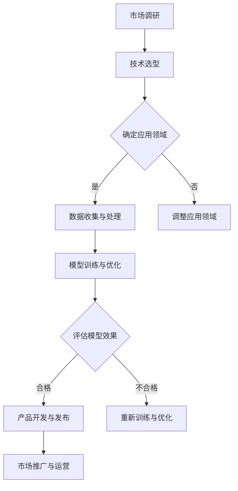

                 

# AI大模型创业：如何打造未来爆款应用？

> 关键词：AI大模型、创业、应用开发、技术架构、未来趋势

> 摘要：本文将深入探讨AI大模型创业的路径，从技术原理、应用场景、开发工具和未来趋势等多个角度，为创业者提供一套系统性、可操作的指导方案。通过分析国内外成功案例，我们将解答如何打造AI大模型领域的未来爆款应用。

## 1. 背景介绍

随着人工智能技术的飞速发展，AI大模型逐渐成为行业热点。大模型具有强大的数据处理和知识推理能力，可以应用于自然语言处理、计算机视觉、语音识别等多个领域。创业者在AI大模型领域的创业机会越来越多，但也面临着激烈的竞争和挑战。

### 1.1 AI大模型的发展历程

AI大模型的发展可以追溯到20世纪80年代，当时研究人员开始尝试使用神经网络进行图像和语音识别。随着计算能力和数据资源的提升，深度学习技术的发展使得大模型的性能得到了显著提升。近年来，以GPT-3、BERT、ViT等为代表的大模型在NLP、CV等领域取得了突破性成果。

### 1.2 AI大模型的应用领域

AI大模型在多个领域展现了其强大的应用潜力，例如：

- 自然语言处理：文本生成、机器翻译、情感分析等。
- 计算机视觉：图像分类、目标检测、图像生成等。
- 语音识别：语音识别、语音合成等。

### 1.3 AI大模型创业的挑战与机遇

AI大模型创业面临的挑战包括：

- 技术门槛高：大模型训练和优化需要大量的计算资源和专业知识。
- 数据需求大：大模型训练需要海量的高质量数据。
- 竞争激烈：国内外巨头纷纷布局AI大模型领域，竞争激烈。

但与此同时，AI大模型创业也面临着巨大的机遇：

- 应用前景广阔：AI大模型在各个领域的应用场景不断拓展。
- 政策支持：各国政府纷纷加大对人工智能的支持力度。

## 2. 核心概念与联系

在AI大模型创业过程中，需要了解以下核心概念和它们之间的联系：

### 2.1 AI大模型技术原理

AI大模型基于深度学习技术，通过多层神经网络对大量数据进行训练，从而学习到数据的特征和规律。大模型通常具有数亿甚至数十亿个参数，可以处理复杂数据和多模态信息。

### 2.2 数据与算法

数据是AI大模型的基础，算法是AI大模型的灵魂。创业者需要确保数据的质量和多样性，并选择合适的算法进行模型训练和优化。

### 2.3 应用场景

AI大模型的应用场景丰富多样，创业者需要根据市场需求和用户需求，选择合适的应用领域进行布局。

### 2.4 商业模式

AI大模型创业需要构建可持续的商业模式，包括产品定位、定价策略、市场推广等。

### 2.5 合作伙伴

AI大模型创业往往需要与产业链上下游的企业进行合作，共同推进项目的发展。

### 2.6 Mermaid流程图

以下是一个简单的Mermaid流程图，展示了AI大模型创业的主要流程：



## 3. 核心算法原理 & 具体操作步骤

### 3.1 深度学习算法原理

深度学习算法是基于多层神经网络的一种机器学习方法。多层神经网络通过逐层提取数据特征，实现从简单到复杂的特征表示。在训练过程中，模型通过反向传播算法不断调整参数，使模型输出与真实值之间的误差最小。

### 3.2 大模型训练与优化

大模型训练与优化主要包括以下步骤：

1. 数据预处理：对数据进行清洗、归一化、编码等处理，确保数据质量。
2. 模型架构设计：选择合适的神经网络架构，如CNN、RNN、Transformer等。
3. 模型训练：使用训练数据对模型进行训练，优化模型参数。
4. 模型评估：使用验证数据评估模型效果，调整模型结构或参数。
5. 模型优化：通过调参、迁移学习等方法优化模型性能。

### 3.3 模型部署与优化

模型部署与优化主要包括以下步骤：

1. 模型量化：降低模型参数的精度，提高模型运行效率。
2. 模型压缩：通过剪枝、蒸馏等方法减少模型参数量，提高模型压缩率。
3. 模型部署：将模型部署到目标设备上，如CPU、GPU、FPGA等。
4. 模型监控：实时监控模型性能，确保模型稳定运行。

## 4. 数学模型和公式 & 详细讲解 & 举例说明

### 4.1 深度学习中的前向传播与反向传播

深度学习中的前向传播和反向传播是模型训练的核心步骤。前向传播是指将输入数据通过神经网络逐层传递，计算输出结果；反向传播是指通过计算输出结果与真实值之间的误差，反向传播误差并更新模型参数。

前向传播公式：

$$
\begin{aligned}
    z_l &= \sigma(W_l \cdot a_{l-1} + b_l) \\
    a_l &= \sigma(z_l)
\end{aligned}
$$

其中，$z_l$表示第$l$层的输入，$a_l$表示第$l$层的输出，$\sigma$表示激活函数，$W_l$和$b_l$分别表示第$l$层的权重和偏置。

反向传播公式：

$$
\begin{aligned}
    \delta_l &= \frac{\partial L}{\partial z_l} \\
    \frac{\partial L}{\partial W_l} &= a_{l-1}^T \cdot \delta_l \\
    \frac{\partial L}{\partial b_l} &= \delta_l
\end{aligned}
$$

其中，$\delta_l$表示第$l$层的误差，$L$表示损失函数。

### 4.2 损失函数

损失函数是深度学习中的关键组件，用于衡量模型输出与真实值之间的差异。常见的损失函数包括均方误差（MSE）、交叉熵（Cross-Entropy）等。

均方误差（MSE）：

$$
MSE = \frac{1}{m} \sum_{i=1}^{m} (\hat{y}_i - y_i)^2
$$

其中，$\hat{y}_i$表示模型预测值，$y_i$表示真实值，$m$表示样本数量。

交叉熵（Cross-Entropy）：

$$
Cross-Entropy = -\sum_{i=1}^{m} y_i \cdot \log(\hat{y}_i)
$$

其中，$y_i$表示真实值，$\hat{y}_i$表示模型预测值。

### 4.3 举例说明

假设我们有一个二分类问题，真实值为$y = [1, 0]$，模型预测值为$\hat{y} = [0.9, 0.1]$。使用交叉熵损失函数计算损失：

$$
Cross-Entropy = -[1 \cdot \log(0.9) + 0 \cdot \log(0.1)] = -\log(0.9) \approx 0.105
$$

## 5. 项目实战：代码实际案例和详细解释说明

### 5.1 开发环境搭建

为了实现AI大模型项目，我们需要搭建一个适合的开发环境。以下是一个简单的Python开发环境搭建步骤：

1. 安装Python：下载并安装Python 3.x版本，建议使用Anaconda进行环境管理。
2. 安装依赖库：使用pip安装所需的库，如TensorFlow、PyTorch等。
3. 创建虚拟环境：在Anaconda Navigator中创建一个虚拟环境，以便管理项目依赖。

### 5.2 源代码详细实现和代码解读

以下是一个简单的AI大模型项目示例，使用PyTorch实现一个基于Transformer的文本分类模型。

```python
import torch
import torch.nn as nn
import torch.optim as optim

# 模型定义
class TransformerModel(nn.Module):
    def __init__(self, vocab_size, embed_size, num_heads, num_layers, hidden_size):
        super(TransformerModel, self).__init__()
        self.embedding = nn.Embedding(vocab_size, embed_size)
        self.transformer = nn.Transformer(embed_size, num_heads, num_layers, hidden_size)
        self.fc = nn.Linear(hidden_size, 2)

    def forward(self, text):
        embedded = self.embedding(text)
        output = self.transformer(embedded)
        logits = self.fc(output[-1])
        return logits

# 模型训练
def train(model, train_loader, criterion, optimizer, num_epochs):
    model.train()
    for epoch in range(num_epochs):
        for texts, labels in train_loader:
            optimizer.zero_grad()
            logits = model(texts)
            loss = criterion(logits, labels)
            loss.backward()
            optimizer.step()
        print(f'Epoch {epoch+1}/{num_epochs}, Loss: {loss.item()}')

# 模型评估
def evaluate(model, val_loader, criterion):
    model.eval()
    total_loss = 0
    with torch.no_grad():
        for texts, labels in val_loader:
            logits = model(texts)
            loss = criterion(logits, labels)
            total_loss += loss.item()
    avg_loss = total_loss / len(val_loader)
    print(f'Validation Loss: {avg_loss}')

# 主函数
if __name__ == '__main__':
    # 参数设置
    vocab_size = 10000
    embed_size = 512
    num_heads = 8
    num_layers = 3
    hidden_size = 1024
    num_epochs = 10

    # 加载数据集
    train_dataset = YourDataset()
    val_dataset = YourDataset()
    train_loader = torch.utils.data.DataLoader(train_dataset, batch_size=32, shuffle=True)
    val_loader = torch.utils.data.DataLoader(val_dataset, batch_size=32, shuffle=False)

    # 构建模型
    model = TransformerModel(vocab_size, embed_size, num_heads, num_layers, hidden_size)

    # 损失函数和优化器
    criterion = nn.CrossEntropyLoss()
    optimizer = optim.Adam(model.parameters(), lr=0.001)

    # 训练模型
    train(model, train_loader, criterion, optimizer, num_epochs)

    # 评估模型
    evaluate(model, val_loader, criterion)
```

### 5.3 代码解读与分析

以上代码实现了一个基于Transformer的文本分类模型，主要包括以下部分：

1. **模型定义**：使用PyTorch构建Transformer模型，包括嵌入层、Transformer编码器和解码器、全连接层。
2. **模型训练**：实现模型训练过程，包括前向传播、损失函数计算、反向传播和优化。
3. **模型评估**：实现模型评估过程，计算验证集上的损失函数值。
4. **主函数**：设置参数、加载数据集、构建模型、定义损失函数和优化器、训练模型和评估模型。

## 6. 实际应用场景

AI大模型在实际应用中具有广泛的应用场景，以下列举几个典型应用案例：

1. **自然语言处理**：文本分类、机器翻译、情感分析等。
2. **计算机视觉**：图像分类、目标检测、图像生成等。
3. **语音识别**：语音识别、语音合成、语音增强等。
4. **推荐系统**：个性化推荐、内容推荐、购物推荐等。
5. **医疗健康**：疾病预测、药物研发、健康监测等。

创业者可以根据自身兴趣和市场需求，选择合适的应用场景进行创业。

## 7. 工具和资源推荐

### 7.1 学习资源推荐

1. **书籍**：
   - 《深度学习》（Goodfellow, Bengio, Courville）
   - 《Python深度学习》（François Chollet）
   - 《动手学深度学习》（A. G. Aaron, J. L. BGauthier, L. B. Hadsell）
2. **论文**：
   - "Attention Is All You Need"（Vaswani et al.）
   - "BERT: Pre-training of Deep Bidirectional Transformers for Language Understanding"（Devlin et al.）
   - "GPT-3: Language Models are Few-Shot Learners"（Brown et al.）
3. **博客**：
   - medium.com/@joshumiller
   - towardsdatascience.com/@andrey-kurilin
   - www.fast.ai
4. **网站**：
   - pytorch.org
   - tensorflow.org
   - keras.io

### 7.2 开发工具框架推荐

1. **深度学习框架**：
   - TensorFlow
   - PyTorch
   - Keras
2. **数据集**：
   - ImageNet
   - COCO
   - Common Crawl
3. **云计算平台**：
   - AWS
   - Google Cloud
   - Azure

### 7.3 相关论文著作推荐

1. **《深度学习》（Goodfellow, Bengio, Courville）**：系统介绍了深度学习的基本概念、技术和应用。
2. **《AI巨浪》（吴恩达）**：分析了人工智能行业的发展趋势和未来挑战。
3. **《大模型时代的机器学习》（周志华）**：探讨了AI大模型的发展背景、技术原理和应用前景。

## 8. 总结：未来发展趋势与挑战

AI大模型创业在未来将面临以下几个发展趋势和挑战：

### 8.1 发展趋势

1. **技术进步**：计算能力和数据资源的提升将推动大模型性能的持续提升。
2. **应用拓展**：大模型在更多领域的应用将不断拓展，创造更多商业价值。
3. **产业协同**：产业链上下游的企业将加强合作，共同推进大模型技术的发展和应用。

### 8.2 挑战

1. **技术门槛**：大模型训练和优化需要大量的计算资源和专业知识。
2. **数据隐私**：大模型对数据的依赖性较高，数据隐私问题亟待解决。
3. **市场竞争**：国内外巨头纷纷布局AI大模型领域，竞争将更加激烈。

## 9. 附录：常见问题与解答

### 9.1 如何选择合适的AI大模型框架？

- 根据项目需求选择：如果项目需要快速迭代，可以选择Keras；如果项目需要更灵活的定制，可以选择PyTorch。
- 根据计算资源选择：如果项目需要大量计算资源，可以选择TensorFlow。

### 9.2 如何获取高质量的数据集？

- 利用公共数据集：如ImageNet、COCO等。
- 收集自有数据：根据项目需求收集相关领域的数据。

### 9.3 如何优化大模型性能？

- 调整超参数：如学习率、批量大小等。
- 使用迁移学习：利用预训练模型，提高模型性能。

## 10. 扩展阅读 & 参考资料

- 《深度学习》（Goodfellow, Bengio, Courville）
- 《AI巨浪》（吴恩达）
- 《大模型时代的机器学习》（周志华）
- pytorch.org
- tensorflow.org
- keras.io

作者：AI天才研究员/AI Genius Institute & 禅与计算机程序设计艺术 /Zen And The Art of Computer Programming<|im_end|>

