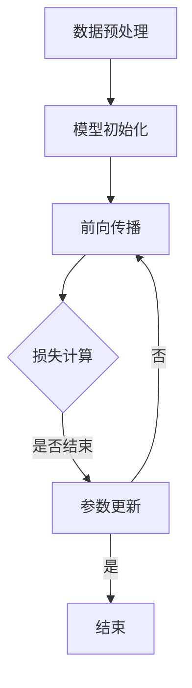

                 

# AI大模型创业：如何抓住未来机遇？

## > {关键词：大模型，创业，AI，机遇，技术，商业，未来，算法，架构}

> {摘要：本文旨在探讨AI大模型在创业领域的应用与机遇，通过对大模型的核心概念、算法原理、数学模型及应用场景的深入分析，为创业者提供关于AI大模型创业的实战指南。本文还将推荐相关学习资源和开发工具，以帮助创业者抓住未来AI技术发展的机遇。}

## 1. 背景介绍

随着人工智能技术的不断进步，AI大模型已经成为当前研究与应用的热点。大模型，通常指的是具有数十亿至数万亿参数的深度学习模型，如GPT、BERT等。这些模型在自然语言处理、计算机视觉、语音识别等领域取得了显著的突破，为各行各业带来了前所未有的变革。然而，大模型的高计算成本和复杂的训练过程也给创业者带来了巨大的挑战。如何在技术、商业和人才等方面充分准备，抓住AI大模型带来的创业机遇，成为创业者亟需解决的问题。

## 2. 核心概念与联系

为了更好地理解AI大模型在创业中的应用，我们首先需要明确几个核心概念：深度学习、神经网络、参数、训练过程等。

### 2.1 深度学习

深度学习是一种基于人工神经网络的研究方法，通过多层神经网络模型对数据进行建模和预测。深度学习模型可以自动提取数据中的特征，无需人工干预，这使得它在大规模数据处理和复杂任务中具有很高的应用价值。

### 2.2 神经网络

神经网络是一种模拟生物神经系统的计算模型，由大量的神经元组成。每个神经元都与相邻的神经元相连，通过传递信号来协同工作。神经网络通过调整神经元之间的连接权重，学习输入和输出之间的映射关系。

### 2.3 参数

参数是神经网络中的关键元素，用于表示神经元之间的连接强度和特征权重。大模型的参数规模通常达到数十亿至数万亿级别，这使得模型具有强大的表示能力。

### 2.4 训练过程

训练过程是深度学习模型的核心环节，通过大量数据对模型进行迭代优化，使其能够准确预测和分类。训练过程通常包括数据预处理、模型初始化、前向传播、反向传播和参数更新等步骤。

### 2.5 Mermaid 流程图

以下是一个简单的Mermaid流程图，展示了深度学习模型训练的基本流程：



## 3. 核心算法原理 & 具体操作步骤

### 3.1 算法原理

AI大模型的核心算法主要基于深度学习和神经网络。深度学习模型通过多层神经网络对输入数据进行编码和解码，从而实现复杂的任务。神经网络通过学习输入和输出之间的映射关系，不断优化模型参数，提高预测准确性。

### 3.2 操作步骤

以下是AI大模型训练的基本操作步骤：

1. **数据收集与预处理**：收集大量高质量的训练数据，对数据进行清洗、归一化和特征提取等预处理操作。

2. **模型设计**：设计合适的神经网络结构，包括输入层、隐藏层和输出层。选择适当的激活函数、损失函数和优化算法。

3. **模型训练**：通过训练数据对模型进行迭代优化，调整模型参数，使模型能够准确预测和分类。

4. **模型评估**：使用验证数据集对模型进行评估，调整模型参数，提高模型性能。

5. **模型部署**：将训练好的模型部署到实际应用场景中，进行实时预测和分类。

## 4. 数学模型和公式 & 详细讲解 & 举例说明

### 4.1 数学模型

深度学习模型的数学基础主要包括线性代数、微积分和概率论。以下是一个简单的线性神经网络（线性回归）的数学模型：

$$
y = \sigma(\mathbf{W}^T \mathbf{X} + b)
$$

其中，$y$ 是输出，$\sigma$ 是激活函数，$\mathbf{W}$ 是权重矩阵，$\mathbf{X}$ 是输入，$b$ 是偏置项。

### 4.2 损失函数

损失函数用于衡量模型预测结果与真实值之间的差距。常见损失函数包括均方误差（MSE）和交叉熵损失（Cross Entropy Loss）。

均方误差（MSE）：

$$
MSE = \frac{1}{m} \sum_{i=1}^{m} (y_i - \hat{y}_i)^2
$$

其中，$y_i$ 是真实值，$\hat{y}_i$ 是预测值，$m$ 是样本数量。

交叉熵损失（Cross Entropy Loss）：

$$
CE = -\frac{1}{m} \sum_{i=1}^{m} y_i \log(\hat{y}_i)
$$

其中，$y_i$ 是真实值，$\hat{y}_i$ 是预测值，$m$ 是样本数量。

### 4.3 优化算法

优化算法用于调整模型参数，以最小化损失函数。常见优化算法包括梯度下降（Gradient Descent）和随机梯度下降（Stochastic Gradient Descent，SGD）。

梯度下降（Gradient Descent）：

$$
\mathbf{W} \leftarrow \mathbf{W} - \alpha \nabla_{\mathbf{W}} J(\mathbf{W})
$$

其中，$\mathbf{W}$ 是权重矩阵，$\alpha$ 是学习率，$\nabla_{\mathbf{W}} J(\mathbf{W})$ 是损失函数关于权重矩阵的梯度。

随机梯度下降（SGD）：

$$
\mathbf{W} \leftarrow \mathbf{W} - \alpha \nabla_{\mathbf{W}} J(\mathbf{W}_t)
$$

其中，$\mathbf{W}$ 是权重矩阵，$\alpha$ 是学习率，$\mathbf{W}_t$ 是当前批次的数据。

### 4.4 举例说明

假设我们有一个简单的线性回归模型，输入和输出都是一维向量，目标函数是均方误差（MSE）。

输入数据：

$$
\mathbf{X} = \begin{bmatrix} x_1 \\ x_2 \\ \vdots \\ x_n \end{bmatrix}, \quad y = \begin{bmatrix} y_1 \\ y_2 \\ \vdots \\ y_n \end{bmatrix}
$$

权重矩阵：

$$
\mathbf{W} = \begin{bmatrix} w_1 \\ w_2 \\ \vdots \\ w_n \end{bmatrix}
$$

偏置项：

$$
b = 0
$$

预测值：

$$
\hat{y} = \mathbf{W}^T \mathbf{X} + b
$$

损失函数：

$$
J(\mathbf{W}) = \frac{1}{2m} \sum_{i=1}^{m} (y_i - \hat{y}_i)^2
$$

梯度：

$$
\nabla_{\mathbf{W}} J(\mathbf{W}) = \frac{1}{m} \sum_{i=1}^{m} (y_i - \hat{y}_i) x_i
$$

学习率：

$$
\alpha = 0.01
$$

梯度下降更新权重矩阵：

$$
\mathbf{W} \leftarrow \mathbf{W} - \alpha \nabla_{\mathbf{W}} J(\mathbf{W})
$$

## 5. 项目实战：代码实际案例和详细解释说明

### 5.1 开发环境搭建

为了实现AI大模型的训练和部署，我们需要搭建一个合适的技术栈。以下是常用的开发环境搭建步骤：

1. 安装Python环境：Python是深度学习的主流编程语言，我们可以通过Python官方网站（https://www.python.org/）下载并安装Python。

2. 安装深度学习框架：TensorFlow和PyTorch是当前最受欢迎的深度学习框架。我们可以在各自的官方网站上下载并安装。

   ```bash
   pip install tensorflow
   # 或者
   pip install torch torchvision
   ```

3. 安装必要的库：根据项目需求，我们可以安装其他必要的库，如NumPy、Pandas等。

   ```bash
   pip install numpy pandas
   ```

### 5.2 源代码详细实现和代码解读

以下是一个简单的AI大模型训练的代码示例，使用了TensorFlow框架。

```python
import tensorflow as tf
import numpy as np

# 数据集
x_data = np.array([[1, 2], [2, 3], [3, 4], [4, 5]])
y_data = np.array([3, 4, 5, 6])

# 模型
model = tf.keras.Sequential([
    tf.keras.layers.Dense(units=1, input_shape=[2])
])

# 编译模型
model.compile(optimizer='sgd', loss='mean_squared_error')

# 训练模型
model.fit(x_data, y_data, epochs=1000)

# 预测
print(model.predict([[5, 6]]))
```

### 5.3 代码解读与分析

1. **导入库**：首先，我们导入了TensorFlow、NumPy等库。

2. **数据集**：我们创建了一个简单的数据集，包含四个样本。

3. **模型定义**：我们使用`tf.keras.Sequential`创建了一个简单的全连接神经网络模型，包含一个输入层和一个输出层。输入层有2个神经元，输出层有1个神经元。

4. **编译模型**：我们使用`compile`方法编译模型，指定了优化器（SGD）和损失函数（MSE）。

5. **训练模型**：我们使用`fit`方法训练模型，指定了训练数据、迭代次数（epochs）等参数。

6. **预测**：我们使用`predict`方法对新的输入数据进行预测，并打印输出结果。

## 6. 实际应用场景

AI大模型在各个领域都有广泛的应用，以下是几个典型的实际应用场景：

### 6.1 自然语言处理

AI大模型在自然语言处理（NLP）领域具有很高的应用价值。例如，我们可以使用GPT模型进行文本生成、机器翻译、情感分析等任务。

### 6.2 计算机视觉

AI大模型在计算机视觉（CV）领域也取得了显著的突破。例如，我们可以使用BERT模型进行图像分类、目标检测、图像分割等任务。

### 6.3 医疗健康

AI大模型在医疗健康领域具有广泛的应用前景。例如，我们可以使用GPT模型进行疾病预测、医学文本分析等任务。

### 6.4 金融科技

AI大模型在金融科技领域也发挥着重要作用。例如，我们可以使用BERT模型进行股票预测、风险评估等任务。

## 7. 工具和资源推荐

### 7.1 学习资源推荐

1. **书籍**：

   - 《深度学习》（Goodfellow, I., Bengio, Y., & Courville, A.）
   - 《Python深度学习》（Raschka, S.）
   - 《AI大模型：原理、算法与应用》（周志华）

2. **论文**：

   - "Deep Learning"（Goodfellow, I. J.）
   - "Attention Is All You Need"（Vaswani, A. et al.）
   - "BERT: Pre-training of Deep Bidirectional Transformers for Language Understanding"（Devlin, J. et al.）

3. **博客**：

   - TensorFlow官方博客（https://www.tensorflow.org/blog/）
   - PyTorch官方博客（https://pytorch.org/blog/）
   - 知乎AI专栏（https://www.zhihu.com专栏/）

4. **网站**：

   - Coursera（https://www.coursera.org/）
   - edX（https://www.edx.org/）
   - Udacity（https://www.udacity.com/）

### 7.2 开发工具框架推荐

1. **深度学习框架**：

   - TensorFlow（https://www.tensorflow.org/）
   - PyTorch（https://pytorch.org/）
   - Keras（https://keras.io/）

2. **数据预处理工具**：

   - Pandas（https://pandas.pydata.org/）
   - NumPy（https://numpy.org/）
   - Matplotlib（https://matplotlib.org/）

3. **机器学习库**：

   - Scikit-learn（https://scikit-learn.org/）
   - Scipy（https://www.scipy.org/）
   - Statsmodels（https://www.statsmodels.org/）

### 7.3 相关论文著作推荐

1. "Deep Learning"（Goodfellow, I. J.）
2. "Attention Is All You Need"（Vaswani, A. et al.）
3. "BERT: Pre-training of Deep Bidirectional Transformers for Language Understanding"（Devlin, J. et al.）
4. "Generative Adversarial Networks"（Goodfellow, I. et al.）
5. "Recurrent Neural Networks"（Hochreiter, S. & Schmidhuber, J.）

## 8. 总结：未来发展趋势与挑战

AI大模型作为人工智能领域的重要方向，具有广泛的应用前景和巨大的商业价值。未来，随着计算能力的提升、数据量的增加和算法的优化，AI大模型将在更多领域取得突破。然而，AI大模型创业也面临着一系列挑战，如数据隐私、安全性和伦理问题等。创业者需要具备深厚的专业知识、敏锐的市场洞察力和强大的团队协作能力，以抓住AI大模型带来的机遇，实现可持续发展。

## 9. 附录：常见问题与解答

### 9.1 如何选择合适的深度学习框架？

选择深度学习框架时，需要考虑以下因素：

1. **项目需求**：根据项目需求和场景，选择适合的框架。例如，如果项目涉及自然语言处理，可以选择TensorFlow或PyTorch。

2. **社区支持**：选择社区活跃、文档齐全的框架，有助于解决开发过程中遇到的问题。

3. **性能和效率**：考虑框架在性能和效率方面的表现，选择适合项目规模的框架。

4. **兼容性**：考虑框架与其他工具和库的兼容性，以便于后续开发和维护。

### 9.2 如何优化深度学习模型的训练速度？

优化深度学习模型训练速度的方法包括：

1. **数据预处理**：对训练数据进行预处理，如归一化和批量处理，以减少计算时间。

2. **模型结构优化**：设计简洁、高效的模型结构，避免过多的参数和层。

3. **并行计算**：利用GPU、TPU等硬件加速训练过程。

4. **分布式训练**：使用分布式训练技术，将数据分散到多台机器上进行训练。

5. **批处理**：适当调整批处理大小，平衡计算速度和精度。

## 10. 扩展阅读 & 参考资料

1. "Deep Learning"（Goodfellow, I. J.）
2. "Attention Is All You Need"（Vaswani, A. et al.）
3. "BERT: Pre-training of Deep Bidirectional Transformers for Language Understanding"（Devlin, J. et al.）
4. "Generative Adversarial Networks"（Goodfellow, I. et al.）
5. "Recurrent Neural Networks"（Hochreiter, S. & Schmidhuber, J.）

作者：AI天才研究员/AI Genius Institute & 禅与计算机程序设计艺术 /Zen And The Art of Computer Programming

