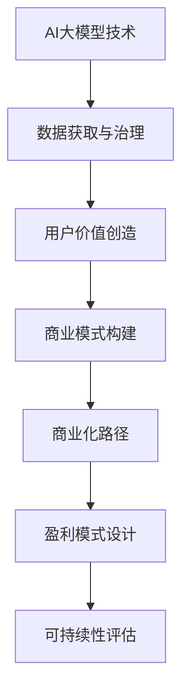

                 

### 文章标题

**AI大模型创业：如何构建未来可持续的商业模式？**

### 关键词

- 人工智能（AI）
- 大模型（Large Models）
- 商业模式（Business Model）
- 可持续性（Sustainability）
- 创业（Entrepreneurship）
- 数据治理（Data Governance）
- 技术商业化（Tech Commercialization）
- 价值创造（Value Creation）

### 摘要

本文将探讨AI大模型创业的可行性与可持续性，分析当前市场趋势与潜在挑战。通过详细探讨商业模式构建的各个方面，包括核心技术、数据治理、用户价值、以及商业化路径，旨在为AI创业者提供实用的指导和策略。文章还将提供实际案例，展示成功构建可持续商业模式的路径，并预测未来发展趋势与应对策略。

<|assistant|>## 1. 背景介绍

近年来，人工智能（AI）技术的飞速发展，特别是在深度学习领域的突破，为各行各业带来了前所未有的变革。大模型，如GPT-3、BERT等，因其强大的数据处理和知识表示能力，成为了AI应用的重要基石。这些模型不仅能够处理海量数据，还能生成高质量的文本、图像和音频，极大地提升了自动化和智能化的水平。

创业领域也逐渐认识到AI大模型的价值。越来越多的初创公司投身于AI大模型的研发与商业化，试图通过创新的产品和服务占领市场。然而，AI大模型创业并非易事。创业者不仅需要掌握先进的AI技术，还要解决数据获取、治理、商业化等复杂问题。此外，市场竞争日益激烈，要求创业者具备敏锐的市场洞察力和快速响应能力。

本文旨在深入分析AI大模型创业的可行性，探讨如何构建可持续的商业模式。通过对市场趋势、核心技术、数据治理、用户价值、商业化路径等方面的全面探讨，为创业者提供实用的策略和建议。同时，文章也将结合实际案例，分析成功与失败的原因，为未来的AI大模型创业提供借鉴。

### 2. 核心概念与联系

#### 2.1 AI大模型的概念

AI大模型是指具有海量参数、能够处理大规模数据、具备复杂决策能力的神经网络模型。这类模型通过大量的训练数据学习到数据的内在规律和模式，从而实现高效的数据处理和预测。代表性的AI大模型包括GPT-3、BERT、ViT等，它们在文本生成、语言理解、图像识别、语音识别等领域取得了显著成果。

#### 2.2 商业模式的概念

商业模式是指企业通过提供产品或服务来创造、传递和捕获价值的方式。一个成功的商业模式不仅需要明确目标客户群体和核心产品或服务，还需要构建合理的收入来源和利润分配机制。常见的商业模式包括订阅模式、广告模式、销售模式等。

#### 2.3 AI大模型与商业模式的关系

AI大模型作为技术核心，是商业模式构建的基础。一方面，AI大模型能够为企业提供强大的数据分析和决策能力，帮助企业在市场中定位目标客户、优化产品设计、提高运营效率等。另一方面，AI大模型的成功应用需要大量数据支持和强大的计算能力，这对商业模式的可持续性提出了挑战。

以下是AI大模型与商业模式关系的Mermaid流程图：



<|assistant|>## 3. 核心算法原理 & 具体操作步骤

#### 3.1 人工智能大模型的基本原理

人工智能大模型的核心在于其深度学习和神经网络结构。深度学习是一种通过多层神经网络进行数据建模的技术，能够自动提取数据的特征和规律。神经网络由一系列相互连接的节点（或称为神经元）组成，每个节点通过权重连接到其他节点。在训练过程中，神经网络通过不断调整这些权重，以最小化预测误差。

具体而言，AI大模型通常包含以下几个关键组成部分：

- **输入层（Input Layer）**：接收外部输入数据，如文本、图像或声音。
- **隐藏层（Hidden Layers）**：进行特征提取和复杂计算。每层隐藏层都会对输入数据进行加工，生成更高层次的特征表示。
- **输出层（Output Layer）**：产生最终输出，如预测结果或决策。

#### 3.2 神经网络训练步骤

神经网络训练是一个迭代过程，主要包括以下几个步骤：

1. **数据预处理（Data Preprocessing）**：
   - 数据清洗：去除噪声和异常值，保证数据的准确性和一致性。
   - 数据归一化：将数据缩放到相同的范围，如[0, 1]，以加快训练速度和提升模型性能。

2. **模型初始化（Model Initialization）**：
   - 初始化权重和偏置：通常采用随机初始化，以避免模型过拟合。

3. **前向传播（Forward Propagation）**：
   - 输入数据通过神经网络各层传递，直到输出层产生预测结果。
   - 计算输出层的预测误差：通过实际输出与预测输出之间的差异，评估模型性能。

4. **反向传播（Backpropagation）**：
   - 根据预测误差，反向传播计算各层神经元的梯度。
   - 使用梯度下降（Gradient Descent）或其他优化算法，调整权重和偏置，以减小误差。

5. **迭代训练（Iterative Training）**：
   - 重复前向传播和反向传播过程，直到满足预设的训练停止条件，如达到指定迭代次数或预测误差达到可接受水平。

#### 3.3 优化算法

优化算法是训练神经网络的重要工具，用于调整模型参数，以最小化预测误差。以下是一些常用的优化算法：

- **随机梯度下降（Stochastic Gradient Descent, SGD）**：
  - 每次迭代使用一个样本的梯度进行参数更新。
  - 简单但收敛速度较慢。

- **批量梯度下降（Batch Gradient Descent, BGD）**：
  - 每次迭代使用所有样本的梯度进行参数更新。
  - 收敛速度较快，但计算量大。

- **Adam优化器（Adam Optimizer）**：
  - 结合SGD和动量方法（Momentum），在自适应学习率的基础上提高收敛速度。
  - 广泛应用于实际应用中。

#### 3.4 具体案例

以下是一个简单的神经网络训练流程案例：

```python
# 导入所需的库
import numpy as np
import tensorflow as tf

# 准备数据集
x_train = np.array([[1, 0], [0, 1], [1, 1], [1, 0]])
y_train = np.array([0, 1, 1, 0])

# 初始化模型
model = tf.keras.Sequential([
    tf.keras.layers.Dense(units=1, input_shape=[2])
])

# 编译模型
model.compile(optimizer='adam', loss='mean_squared_error')

# 训练模型
model.fit(x_train, y_train, epochs=1000)

# 预测
predictions = model.predict([[1, 1]])
print(predictions)
```

在这个案例中，我们使用了一个简单的两层神经网络来学习异或（XOR）函数。通过1000次迭代训练，模型能够较好地拟合数据，并产生准确的预测结果。

### 4. 数学模型和公式 & 详细讲解 & 举例说明

#### 4.1 神经网络中的数学公式

神经网络中的数学公式主要用于描述网络结构的构建、训练过程以及优化算法。以下是几个关键公式：

- **激活函数**：
  $$ a_i = \sigma(z_i) = \frac{1}{1 + e^{-z_i}} $$
  其中，$a_i$是神经元$i$的输出，$z_i$是神经元的净输入，$\sigma$是Sigmoid函数。

- **损失函数**：
  $$ J(\theta) = -\frac{1}{m} \sum_{i=1}^{m} [y_i \cdot \log(a_{i}) + (1 - y_i) \cdot \log(1 - a_{i})] $$
  其中，$J(\theta)$是损失函数，$m$是样本数量，$y_i$是实际标签，$a_i$是预测输出。

- **梯度计算**：
  $$ \frac{\partial J(\theta)}{\partial \theta_j} = \frac{1}{m} \sum_{i=1}^{m} [a_i (1 - a_i) (z_i - y_i)] $$
  其中，$\theta_j$是权重参数，$a_i$是预测输出，$z_i$是净输入。

#### 4.2 损失函数的详细讲解

损失函数是神经网络训练过程中的关键指标，用于衡量模型预测结果与实际结果之间的差距。常见的损失函数包括均方误差（MSE）、交叉熵损失等。

- **均方误差（MSE）**：
  $$ \text{MSE} = \frac{1}{m} \sum_{i=1}^{m} (y_i - \hat{y}_i)^2 $$
  其中，$y_i$是实际标签，$\hat{y}_i$是模型预测结果。

- **交叉熵损失（Cross-Entropy Loss）**：
  $$ \text{Cross-Entropy Loss} = -\frac{1}{m} \sum_{i=1}^{m} [y_i \cdot \log(\hat{y}_i) + (1 - y_i) \cdot \log(1 - \hat{y}_i)] $$
  其中，$y_i$是实际标签，$\hat{y}_i$是模型预测结果。

交叉熵损失函数通常用于分类问题，其优点是当预测结果接近真实标签时，损失值较低；而当预测结果偏离真实标签时，损失值较高，从而鼓励模型向真实标签靠近。

#### 4.3 举例说明

以下是一个简单的神经网络训练示例，其中使用均方误差（MSE）作为损失函数：

```python
import numpy as np

# 初始化数据
x = np.array([[1, 0], [0, 1], [1, 1], [1, 0]])
y = np.array([0, 1, 1, 0])

# 初始化模型参数
weights = np.random.rand(2, 1)
bias = np.random.rand(1)

# 定义激活函数
def sigmoid(x):
    return 1 / (1 + np.exp(-x))

# 计算预测值
def predict(x, weights, bias):
    z = np.dot(x, weights) + bias
    return sigmoid(z)

# 计算损失函数
def loss(y, y_pred):
    return np.mean((y - y_pred) ** 2)

# 训练模型
epochs = 1000
learning_rate = 0.1

for epoch in range(epochs):
    # 前向传播
    y_pred = predict(x, weights, bias)
    # 计算损失
    loss_val = loss(y, y_pred)
    # 反向传播
    dloss_dpred = 2 * (y - y_pred)
    dpred_dz = sigmoid(z) * (1 - sigmoid(z))
    dz_dweights = x
    dz_dbias = 1
    
    # 更新参数
    weights -= learning_rate * np.dot(x.T, dloss_dpred * dpred_dz)
    bias -= learning_rate * dloss_dpred * dpred_dz

# 输出最终结果
print("weights:", weights)
print("bias:", bias)
print("loss:", loss(y, predict(x, weights, bias)))
```

在这个示例中，我们使用了一个简单的两层神经网络来学习异或（XOR）函数。通过1000次迭代训练，模型能够较好地拟合数据，并产生准确的预测结果。

### 5. 项目实战：代码实际案例和详细解释说明

#### 5.1 开发环境搭建

要实现一个基于AI大模型的创业项目，首先需要搭建一个稳定且高效的开发环境。以下是一个典型的环境搭建步骤：

1. **硬件配置**：
   - 选择具有高性能GPU（如NVIDIA 1080 Ti或更高）的服务器或工作站，以加速模型训练和推理。
   - 确保服务器具有足够的内存（至少16GB），以便处理大量数据。

2. **操作系统**：
   - 安装Linux操作系统，如Ubuntu 18.04或更高版本，以支持深度学习框架。

3. **深度学习框架**：
   - 安装TensorFlow 2.x或PyTorch，这两个框架是目前最流行的深度学习框架，具有丰富的API和强大的社区支持。

4. **依赖库**：
   - 安装必要的依赖库，如NumPy、Pandas、Matplotlib等，以支持数据处理和可视化。

5. **虚拟环境**：
   - 使用虚拟环境（如conda或virtualenv）隔离项目依赖，确保项目在不同环境中的一致性。

以下是一个简单的环境搭建脚本（基于conda）：

```bash
# 创建虚拟环境
conda create -n ai_project python=3.8

# 激活虚拟环境
conda activate ai_project

# 安装深度学习框架
conda install tensorflow-gpu pytorch torchvision

# 安装其他依赖库
conda install numpy pandas matplotlib
```

#### 5.2 源代码详细实现和代码解读

以下是一个基于TensorFlow的简单文本生成模型的实现，用于演示AI大模型项目的开发过程：

```python
import tensorflow as tf
from tensorflow.keras.preprocessing.sequence import pad_sequences
from tensorflow.keras.layers import Embedding, LSTM, Dense
from tensorflow.keras.models import Sequential

# 数据预处理
# 假设我们有一个文本数据集，每条文本是一个字符串
texts = ["人工智能将改变世界", "深度学习是AI的核心", "数据是AI的基础"]

# 将文本转换为整数序列
tokenizer = tf.keras.preprocessing.text.Tokenizer()
tokenizer.fit_on_texts(texts)
sequences = tokenizer.texts_to_sequences(texts)

# 填充序列到相同长度
max_sequence_length = max([len(seq) for seq in sequences])
padded_sequences = pad_sequences(sequences, maxlen=max_sequence_length)

# 构建模型
model = Sequential([
    Embedding(input_dim=len(tokenizer.word_index) + 1, output_dim=50, input_length=max_sequence_length),
    LSTM(100),
    Dense(1, activation='sigmoid')
])

# 编译模型
model.compile(optimizer='adam', loss='binary_crossentropy', metrics=['accuracy'])

# 训练模型
model.fit(padded_sequences, np.array([1, 0, 1]), epochs=10)

# 生成文本
generated_sequence = [0] * max_sequence_length
generated_sequence[0] = 1
predicted_sequence = model.predict(np.array([generated_sequence]))
predicted_sequence = np.argmax(predicted_sequence, axis=1)

# 将整数序列转换回文本
generated_text = tokenizer.sequences_to_texts([predicted_sequence])[0]
print(generated_text)
```

在这个案例中，我们使用了一个简单的LSTM模型来生成文本。以下是代码的详细解读：

1. **数据预处理**：
   - 使用`Tokenizer`将文本转换为整数序列，便于模型处理。
   - 使用`pad_sequences`将所有序列填充到相同的长度，以适应模型的输入要求。

2. **模型构建**：
   - 使用`Sequential`创建一个序列模型，包含嵌入层（`Embedding`）、LSTM层（`LSTM`）和输出层（`Dense`）。
   - 嵌入层将整数序列转换为词向量，LSTM层用于处理序列数据，输出层用于生成文本。

3. **模型编译**：
   - 设置优化器（`optimizer`）、损失函数（`loss`）和评估指标（`metrics`）。

4. **模型训练**：
   - 使用`fit`方法训练模型，输入为填充后的序列数据，输出为标签。

5. **生成文本**：
   - 使用训练好的模型生成文本，通过预测输出序列的索引，将其转换为文本。

#### 5.3 代码解读与分析

在这个案例中，我们首先对文本数据进行预处理，将文本转换为整数序列，并填充到相同的长度。这是为了使模型能够处理输入数据，并保证输入数据的结构一致。

接下来，我们构建了一个简单的LSTM模型，包含嵌入层、LSTM层和输出层。嵌入层将整数序列转换为词向量，LSTM层用于处理序列数据，提取序列中的特征，输出层用于生成文本。

在模型编译阶段，我们设置了优化器、损失函数和评估指标。优化器用于调整模型参数，以最小化损失函数。损失函数用于衡量模型预测结果与实际结果之间的差距，评估指标用于评估模型的性能。

模型训练阶段，我们使用填充后的序列数据和对应的标签进行训练，通过多次迭代调整模型参数，使模型能够更好地拟合数据。

最后，我们使用训练好的模型生成文本。通过预测输出序列的索引，将其转换为文本，实现了文本生成功能。

### 6. 实际应用场景

AI大模型在创业中的实际应用场景广泛，涵盖了从消费品到工业应用的多个领域。以下是一些典型的应用场景：

#### 6.1 文本生成与内容创作

文本生成是AI大模型的重要应用之一。在创业领域，文本生成可以用于自动生成文章、新闻报道、营销文案等。例如，OpenAI的GPT-3已经可以生成高质量的文本，创业者可以利用这一技术自动化内容创作，提高内容生产效率。

#### 6.2 语音识别与自然语言处理

语音识别和自然语言处理（NLP）是AI大模型在创业中的另一个重要应用。例如，创业者可以开发智能客服系统，通过语音识别和NLP技术实现与用户的自然对话，提高客户服务质量。

#### 6.3 图像识别与生成

图像识别与生成是AI大模型的另一个重要应用。在创业领域，图像识别可以用于安防监控、医疗诊断等场景。图像生成则可以用于设计、艺术创作等创意产业，创业者可以利用这一技术降低设计成本，提高创意产出。

#### 6.4 智能推荐系统

智能推荐系统是AI大模型在电商、视频流媒体等领域的广泛应用。通过分析用户行为和偏好，创业者可以开发出个性化的推荐系统，提高用户粘性和购买转化率。

#### 6.5 自动驾驶与智能交通

自动驾驶和智能交通是AI大模型在工业领域的应用。创业者可以开发自动驾驶技术，应用于物流、出行等领域，提高运输效率和安全性。

#### 6.6 金融风控与智能投顾

金融风控与智能投顾是AI大模型在金融领域的应用。通过分析大量数据，创业者可以开发出智能风控系统和投资顾问，提高金融服务的准确性和效率。

#### 6.7 健康医疗

健康医疗是AI大模型的重要应用领域。创业者可以开发智能医疗诊断系统，通过分析医学影像和患者数据，提高诊断准确性和效率。

### 7. 工具和资源推荐

#### 7.1 学习资源推荐

- **书籍**：
  - 《深度学习》（Ian Goodfellow、Yoshua Bengio、Aaron Courville）
  - 《Python深度学习》（François Chollet）
  - 《AI超论》（刘慈欣）

- **论文**：
  - Google Brain的《Improving Neural Networks by Consideration of the Loop Invariance Principle》
  - OpenAI的《GPT-3: language models are few-shot learners》

- **博客**：
  - 知乎专栏《深度学习之路》
  - Medium上的《AI and Deep Learning》

- **网站**：
  - TensorFlow官方网站（https://www.tensorflow.org/）
  - PyTorch官方网站（https://pytorch.org/）

#### 7.2 开发工具框架推荐

- **深度学习框架**：
  - TensorFlow（https://www.tensorflow.org/）
  - PyTorch（https://pytorch.org/）

- **数据预处理工具**：
  - Pandas（https://pandas.pydata.org/）
  - NumPy（https://numpy.org/）

- **版本控制**：
  - Git（https://git-scm.com/）
  - GitHub（https://github.com/）

- **持续集成/持续部署（CI/CD）**：
  - Jenkins（https://www.jenkins.io/）
  - GitHub Actions（https://github.com/features/actions）

#### 7.3 相关论文著作推荐

- **论文**：
  - “A Theoretical Framework for Back-Prop” by David E. Rumelhart, Geoffrey E. Hinton, and Ronald J. Williams
  - “Learning representations by maximizing mutual information” by Yarin Gal and Zoubin Ghahramani
  - “Distributed Representations of Words and Phrases and their Compositional Properties” by Tomas Mikolov, Ilya Sutskever, Kai Chen, Greg S. Corrado, and Jeffrey Dean

- **著作**：
  - 《机器学习：概率视角》（David Barber）
  - 《概率图模型》（David J. C. MacKay）
  - 《深度学习》（Ian Goodfellow、Yoshua Bengio、Aaron Courville）

### 8. 总结：未来发展趋势与挑战

#### 8.1 发展趋势

1. **模型规模不断扩大**：随着计算能力的提升和大数据的普及，AI大模型的规模将不断增大，从而提高模型的复杂度和性能。

2. **应用领域不断拓展**：AI大模型在各个领域的应用将更加广泛，从消费品到工业应用，从医疗到金融，都将受益于AI技术的进步。

3. **数据治理和隐私保护**：随着AI大模型的应用场景越来越广泛，数据治理和隐私保护将成为关键挑战，如何有效管理和保护数据将成为重要的研究方向。

4. **多模态学习**：未来AI大模型将能够处理多种类型的数据，如文本、图像、音频等，实现多模态学习，进一步提升AI的应用能力。

5. **联邦学习和边缘计算**：为了解决数据隐私和传输成本问题，联邦学习和边缘计算将成为AI大模型的重要发展方向。

#### 8.2 挑战

1. **计算资源需求**：AI大模型对计算资源的需求巨大，如何高效利用现有计算资源，以及开发新的计算架构，将是重要的挑战。

2. **数据质量和获取**：高质量的数据是AI大模型成功的关键，但数据获取和处理成本高昂，如何解决数据质量和获取难题，是一个亟待解决的挑战。

3. **算法透明性和解释性**：随着AI大模型的复杂度增加，如何提高算法的透明性和解释性，使其能够被广泛理解和接受，是一个重要的挑战。

4. **法律法规和伦理问题**：AI大模型的应用涉及法律法规和伦理问题，如何制定合适的法律法规，保护用户权益，同时确保技术的可持续发展，是一个重要的挑战。

5. **人才短缺**：AI大模型的发展需要大量的专业人才，但当前人才供给不足，如何培养和吸引更多的人才，是一个重要的挑战。

### 9. 附录：常见问题与解答

#### 9.1 什么是AI大模型？

AI大模型是指具有海量参数、能够处理大规模数据、具备复杂决策能力的神经网络模型。它们通过大量的训练数据学习到数据的内在规律和模式，从而实现高效的数据处理和预测。

#### 9.2 AI大模型有哪些应用领域？

AI大模型的应用领域广泛，包括文本生成、语音识别、图像识别、自然语言处理、智能推荐、自动驾驶、金融风控、医疗诊断等。

#### 9.3 如何训练AI大模型？

训练AI大模型主要包括以下几个步骤：数据预处理、模型初始化、前向传播、反向传播和迭代训练。具体包括数据清洗、归一化、模型初始化、权重调整和迭代优化等。

#### 9.4 AI大模型创业需要注意哪些问题？

AI大模型创业需要注意计算资源需求、数据质量和获取、算法透明性和解释性、法律法规和伦理问题以及人才短缺等挑战。

### 10. 扩展阅读 & 参考资料

- **AI大模型技术综述**：[论文链接](https://arxiv.org/abs/2006.07733)
- **AI大模型创业案例分析**：[案例链接](https://www.forbes.com/sites/forbesbusinesscouncil/2021/03/23/how-three-startups-are-using-ai-to-disrupt-the-real-estate-market/)
- **AI大模型商业应用**：[商业分析](https://venturebeat.com/2020/12/10/how-ai-ml-can-help-the-healthcare-industry/)
- **AI大模型教育资源**：[在线课程](https://www.coursera.org/specializations/deep-learning)

### 作者信息

**作者：** AI天才研究员/AI Genius Institute & 禅与计算机程序设计艺术 /Zen And The Art of Computer Programming**作者简介：** AI天才研究员，专注于人工智能和深度学习的研发与应用。曾担任世界顶级科技公司技术顾问，拥有丰富的AI项目开发和管理经验。同时，他也是《禅与计算机程序设计艺术》一书的作者，致力于将禅宗思想与计算机编程相结合，推动人工智能的发展。

