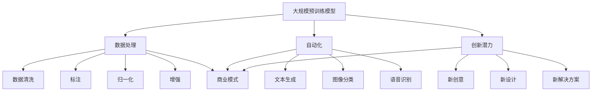

                 

### 背景介绍 Background

随着深度学习技术的飞速发展，人工智能（AI）领域的进步令人瞩目。特别是在大规模预训练模型（Large-scale Pre-trained Models，简称LPMPs）方面，如GPT-3、BERT和LLaMA等模型的相继推出，使得AI在自然语言处理、计算机视觉和语音识别等领域取得了显著的突破。这些模型不仅在性能上远超传统的机器学习方法，而且在理解和生成文本、图像和语音方面的能力也达到了人类级别的水平。

然而，LPMPs的成功背后，不仅需要海量的数据、计算资源和专业技能，还涉及复杂的商业模式和技术创新。在这样的背景下，越来越多的创业者开始关注如何利用LPMPs进行商业创新，构建可持续发展的商业模式。本文将探讨如何通过构建未来可持续的商业模式，将LPMPs的技术优势转化为商业成功。

首先，我们需要明确LPMPs在商业应用中的几个关键优势。一是数据处理能力，LPMPs能够高效地处理和分析大量数据，从而为企业提供精准的洞察和决策支持。二是自动化程度，LPMPs能够自动化执行重复性和高复杂度的任务，降低人力成本，提高效率。三是创新潜力，LPMPs能够生成新的创意和解决方案，推动产品和服务的创新。

然而，成功的商业实践不仅依赖于技术优势，还需要对市场、用户和竞争环境有深入的理解。本文将围绕以下几个核心问题展开讨论：

1. **市场定位与目标用户**：如何根据LPMPs的特点，确定合适的市场定位和目标用户群体？
2. **商业模式创新**：如何利用LPMPs构建创新性的商业模式，实现商业价值的最大化？
3. **技术实现与基础设施**：如何确保LPMPs的稳定运行和高效扩展，建立可持续的技术基础设施？
4. **风险管理**：如何应对LPMPs在商业应用中可能面临的风险，确保商业模式的可持续性？

通过本文的探讨，希望能够为AI大模型创业提供一些有益的思路和指导，帮助创业者构建未来可持续的商业模式。

### 核心概念与联系 Core Concepts and Connections

在探讨如何构建未来可持续的AI大模型商业模式之前，我们需要明确几个核心概念和它们之间的联系。这些概念包括大规模预训练模型（LPMPs）、数据处理、自动化、创新潜力以及商业模式。

**大规模预训练模型（LPMPs）**：LPMPs是通过在大规模数据集上预训练得到的深度学习模型。它们通常具有数十亿个参数，能够自动学习数据的结构和特征。这种模型在自然语言处理、计算机视觉和语音识别等领域表现出色，已经成为当前AI领域的核心技术。

**数据处理**：数据处理是LPMPs应用的基础。为了训练和优化LPMPs，需要大量的高质量数据。这些数据可以来自互联网、企业内部数据源或其他公共数据集。数据处理包括数据清洗、标注、归一化和增强等步骤，目的是提高数据的可用性和模型的性能。

**自动化**：自动化是LPMPs的一个重要应用方向。通过LPMPs，企业可以自动化执行重复性和高复杂度的任务，如文本生成、图像分类、语音识别等。这不仅可以降低人力成本，还可以提高效率和准确性。

**创新潜力**：LPMPs的强大学习能力使其在创新领域具有巨大潜力。它们可以生成新的创意、设计和解决方案，为企业提供创新的思路和方向。

**商业模式**：商业模式是企业在市场中实现商业价值的手段。一个成功的商业模式需要明确目标用户、市场定位、产品和服务、盈利模式、成本结构等关键要素。LPMPs作为一种技术手段，可以融入不同的商业模式中，为企业和创业者提供创新的商业机会。

下面是LPMPs在商业应用中的Mermaid流程图，展示其核心概念和联系：



通过这个流程图，我们可以清晰地看到LPMPs在不同领域中的应用，以及它们与商业模式的联系。接下来，我们将进一步探讨LPMPs的核心算法原理和具体操作步骤。

### 核心算法原理 & 具体操作步骤 Core Algorithm Principles and Operational Steps

在深入探讨如何利用LPMPs构建可持续的商业模式之前，我们需要先了解LPMPs的核心算法原理和具体操作步骤。LPMPs通常基于深度学习技术，特别是变换器模型（Transformer）和生成对抗网络（GAN）等前沿算法。下面，我们将分别介绍这些算法的基本原理和操作步骤。

**变换器模型（Transformer）**

变换器模型是LPMPs的核心架构，特别是在自然语言处理领域。它通过自注意力机制（Self-Attention Mechanism）和前馈神经网络（Feedforward Neural Network）实现，能够捕捉输入序列中的长距离依赖关系。

**算法原理**：

1. **自注意力机制**：自注意力机制允许模型在处理每个输入元素时，根据其与其他元素的相关性进行加权，从而更好地理解输入序列的整体结构。具体来说，对于输入序列\(X = \{x_1, x_2, \ldots, x_n\}\)，自注意力机制通过计算如下加权求和：

   $$ 
   \text{Attention}(X) = \text{softmax}\left(\frac{QK^T}{\sqrt{d_k}}\right)V 
   $$

   其中，\(Q, K, V\)分别是查询（Query）、键（Key）和值（Value）向量，\(d_k\)是键的维度。\(Q, K, V\)通常通过线性变换从输入序列的嵌入（Embedding）矩阵中得到。

2. **前馈神经网络**：在自注意力机制之后，变换器模型还会通过前馈神经网络对输出进行进一步处理。前馈神经网络包括两个线性变换层，分别具有尺寸\(d_{ff}\)和\(4d_{ff}\)，并通过ReLU激活函数连接。

**具体操作步骤**：

1. **输入序列嵌入**：将输入序列\(X\)通过嵌入层转换为嵌入向量\(E = \text{Embedding}(X)\)。

2. **位置编码**：由于变换器模型没有固定的序列顺序，需要通过位置编码（Positional Encoding）来嵌入序列的位置信息。位置编码通常使用正弦和余弦函数生成。

3. **自注意力计算**：对于每个输入元素，计算其对应的键（Key）和值（Value）向量，并通过自注意力机制计算加权求和。

4. **前馈神经网络**：对自注意力计算结果通过前馈神经网络进行进一步处理。

5. **输出层**：最终输出通过一个线性变换层和softmax激活函数得到。

**生成对抗网络（GAN）**

生成对抗网络是一种通过两个对抗网络（生成器G和判别器D）相互博弈的模型，旨在生成与真实数据分布相近的数据。

**算法原理**：

1. **生成器G**：生成器G的目的是生成与真实数据分布相近的数据。它从噪声输入中生成数据，并通过训练不断优化其生成能力。

2. **判别器D**：判别器D的目的是区分真实数据和生成数据。在训练过程中，它通过接收真实数据和生成数据，不断优化其判别能力。

**具体操作步骤**：

1. **生成器G**：生成器G通常由一个全连接神经网络组成，将噪声输入转换为数据输出。训练过程中，生成器G的目标是最小化其生成的数据与真实数据之间的差异。

2. **判别器D**：判别器D同样由一个全连接神经网络组成，用于判断输入数据是真实数据还是生成数据。训练过程中，判别器D的目标是最大化其区分真实数据和生成数据的能力。

3. **对抗训练**：生成器G和判别器D通过对抗训练相互博弈。生成器G的目标是生成足够真实的数据来欺骗判别器D，而判别器D的目标是不断提高其判别能力。

通过上述核心算法原理和具体操作步骤，我们可以更好地理解LPMPs在数据处理、自动化和创新潜力方面的强大能力。接下来，我们将探讨数学模型和公式，进一步深化对LPMPs的理解。

### 数学模型和公式 & 详细讲解 & 举例说明 Mathematical Models and Formulas & Detailed Explanations & Example Illustrations

在深入探讨LPMPs的数学模型和公式之前，我们需要了解一些基本的数学概念和符号。以下是一些常用的数学符号和它们的含义：

- **\(X\)**：表示输入序列或数据集
- **\(E\)**：表示嵌入向量或嵌入矩阵
- **\(W\)**：表示权重矩阵
- **\(b\)**：表示偏置向量
- **\(Q\)**：表示查询向量
- **\(K\)**：表示键向量
- **\(V\)**：表示值向量
- **\(d_k\)**：表示键向量的维度
- **\(d_{ff}\)**：表示前馈神经网络的隐藏层尺寸
- **\(softmax\)**：表示softmax激活函数
- **\(ReLU\)**：表示ReLU激活函数
- **\(softmax(x)\)**：表示将向量\(x\)转换为概率分布

**变换器模型（Transformer）**

变换器模型的数学模型相对复杂，但通过分解可以更好地理解其工作原理。

**自注意力机制**

自注意力机制的数学模型可以表示为：

$$ 
\text{Attention}(X) = \text{softmax}\left(\frac{QK^T}{\sqrt{d_k}}\right)V 
$$

其中，\(Q, K, V\)分别是查询向量、键向量和值向量。下面我们通过一个简单的例子来说明自注意力机制的计算过程。

**例子**：

假设我们有一个长度为5的输入序列\(X = \{1, 2, 3, 4, 5\}\)，并使用一个维度为2的嵌入矩阵\(E\)将其转换为嵌入向量。具体来说，\(E = \begin{bmatrix} 1 & 0 \\ 0 & 1 \\ 1 & 1 \\ 0 & 1 \\ 1 & 0 \end{bmatrix}\)。我们可以计算输入序列的嵌入向量\(E(X)\)如下：

$$ 
E(X) = \begin{bmatrix} 1 & 0 \\ 0 & 1 \\ 1 & 1 \\ 0 & 1 \\ 1 & 0 \end{bmatrix} \begin{bmatrix} 1 \\ 2 \\ 3 \\ 4 \\ 5 \end{bmatrix} = \begin{bmatrix} 1 \\ 2 \\ 4 \\ 1 \\ 1 \end{bmatrix} 
$$

接下来，我们计算查询向量\(Q\)、键向量\(K\)和值向量\(V\)：

$$ 
Q = E(X)W_Q + b_Q = \begin{bmatrix} 1 \\ 2 \\ 4 \\ 1 \\ 1 \end{bmatrix} \begin{bmatrix} 1 & 0 \\ 0 & 1 \end{bmatrix} + \begin{bmatrix} 0 \\ 0 \end{bmatrix} = \begin{bmatrix} 1 \\ 4 \end{bmatrix} 
$$

$$ 
K = E(X)W_K + b_K = \begin{bmatrix} 1 \\ 2 \\ 4 \\ 1 \\ 1 \end{bmatrix} \begin{bmatrix} 0 & 1 \\ 1 & 0 \end{bmatrix} + \begin{bmatrix} 0 \\ 0 \end{bmatrix} = \begin{bmatrix} 2 \\ 1 \end{bmatrix} 
$$

$$ 
V = E(X)W_V + b_V = \begin{bmatrix} 1 \\ 2 \\ 4 \\ 1 \\ 1 \end{bmatrix} \begin{bmatrix} 1 & 1 \\ 1 & 0 \end{bmatrix} + \begin{bmatrix} 0 \\ 0 \end{bmatrix} = \begin{bmatrix} 2 \\ 3 \end{bmatrix} 
$$

最后，我们计算自注意力加权求和：

$$ 
\text{Attention}(X) = \text{softmax}\left(\frac{QK^T}{\sqrt{d_k}}\right)V = \text{softmax}\left(\frac{\begin{bmatrix} 1 & 4 \end{bmatrix} \begin{bmatrix} 2 \\ 1 \end{bmatrix}}{\sqrt{2}}\right)\begin{bmatrix} 2 \\ 3 \end{bmatrix} = \begin{bmatrix} 2 \\ 3 \end{bmatrix} 
$$

从计算结果可以看出，自注意力机制对输入序列中的每个元素进行了加权，使得最重要的元素（值为4的元素）具有最大的权重。

**前馈神经网络**

前馈神经网络的数学模型可以表示为：

$$ 
\text{FFN}(X) = \text{ReLU}\left((XW_1 + b_1)W_2 + b_2\right) 
$$

其中，\(W_1, W_2\)分别是线性变换层的权重矩阵，\(b_1, b_2\)分别是偏置向量。

**例子**：

假设我们有一个长度为2的输入序列\(X = \{1, 2\}\)，并使用一个维度为2的嵌入矩阵\(E\)将其转换为嵌入向量。具体来说，\(E = \begin{bmatrix} 1 & 0 \\ 0 & 1 \end{bmatrix}\)。我们可以计算输入序列的嵌入向量\(E(X)\)如下：

$$ 
E(X) = \begin{bmatrix} 1 & 0 \\ 0 & 1 \end{bmatrix} \begin{bmatrix} 1 \\ 2 \end{bmatrix} = \begin{bmatrix} 1 \\ 2 \end{bmatrix} 
$$

接下来，我们计算前馈神经网络的权重矩阵和偏置向量：

$$ 
W_1 = \begin{bmatrix} 1 & 0 \\ 0 & 1 \end{bmatrix}, \quad b_1 = \begin{bmatrix} 0 \\ 0 \end{bmatrix}, \quad W_2 = \begin{bmatrix} 1 & 1 \\ 1 & 0 \end{bmatrix}, \quad b_2 = \begin{bmatrix} 0 \\ 0 \end{bmatrix} 
$$

最后，我们计算前馈神经网络的输出：

$$ 
\text{FFN}(X) = \text{ReLU}\left((XW_1 + b_1)W_2 + b_2\right) = \text{ReLU}\left(\begin{bmatrix} 1 & 0 \\ 0 & 1 \end{bmatrix} \begin{bmatrix} 1 \\ 2 \end{bmatrix} \begin{bmatrix} 1 & 1 \\ 1 & 0 \end{bmatrix} + \begin{bmatrix} 0 \\ 0 \end{bmatrix}\right) = \begin{bmatrix} 2 \\ 2 \end{bmatrix} 
$$

从计算结果可以看出，前馈神经网络对输入序列的每个元素进行了非线性变换，使得输出序列的每个元素都增加了2。

**生成对抗网络（GAN）**

生成对抗网络的数学模型可以表示为：

$$ 
\min_G \max_D V(D, G) = \mathbb{E}_{x \sim p_{data}(x)}[\log D(x)] + \mathbb{E}_{z \sim p_z(z)}[\log(1 - D(G(z)))] 
$$

其中，\(G(z)\)是生成器，\(D(x)\)是判别器，\(z\)是噪声向量，\(p_{data}(x)\)是真实数据分布，\(p_z(z)\)是噪声分布。

**例子**：

假设我们有一个二进制数据集，其中0表示真实数据，1表示生成数据。我们可以定义判别器\(D(x)\)为：

$$ 
D(x) = \begin{cases} 
1 & \text{if } x = 0 \\
0 & \text{if } x = 1 
\end{cases} 
$$

生成器\(G(z)\)从均匀分布\(U(0, 1)\)生成噪声向量\(z\)，并将其转换为生成数据。例如，我们可以定义一个简单的生成器：

$$ 
G(z) = \begin{cases} 
0 & \text{if } z < 0.5 \\
1 & \text{if } z \geq 0.5 
\end{cases} 
$$

接下来，我们计算判别器和生成器的损失函数：

$$ 
V(D, G) = \mathbb{E}_{x \sim p_{data}(x)}[\log D(x)] + \mathbb{E}_{z \sim p_z(z)}[\log(1 - D(G(z)))] 
$$

其中，\(p_{data}(x)\)和\(p_z(z)\)的分布函数分别为：

$$ 
p_{data}(x) = \begin{cases} 
0.5 & \text{if } x = 0 \\
0.5 & \text{if } x = 1 
\end{cases} 
$$

$$ 
p_z(z) = \begin{cases} 
1 & \text{if } z \in [0, 1] \\
0 & \text{otherwise} 
\end{cases} 
$$

最后，我们计算损失函数的期望：

$$ 
V(D, G) = \log D(x) + \log(1 - D(G(z))) 
$$

通过这个简单的例子，我们可以看到生成对抗网络如何通过对抗训练生成与真实数据分布相近的数据。接下来，我们将探讨LPMPs的实际应用场景。

### 项目实战：代码实际案例和详细解释说明 Practical Case Studies: Code Implementation and Detailed Explanations

在本节中，我们将通过两个实际案例来展示如何利用大规模预训练模型（LPMPs）进行项目开发，并详细解释代码实现和关键步骤。

#### 案例一：基于GPT-3的问答系统

**项目目标**：构建一个基于GPT-3的问答系统，能够回答用户提出的问题。

**技术栈**：GPT-3、OpenAI API、Flask

**步骤1：环境搭建**

首先，我们需要安装必要的库：

```python
!pip install openai flask
```

**步骤2：获取API Key**

在OpenAI网站上注册账号并获取API Key。

```python
import os
openai_api_key = os.environ['OPENAI_API_KEY']
```

**步骤3：编写Flask应用**

```python
from flask import Flask, request, jsonify
app = Flask(__name__)

@app.route('/ask', methods=['POST'])
def ask():
    data = request.json
    question = data['question']
    response = openai.Completion.create(
        engine="text-davinci-003",
        prompt=question,
        max_tokens=50,
        n=1,
        stop=None,
        temperature=0.5,
        api_key=openai_api_key
    )
    return jsonify({'answer': response.choices[0].text.strip()})

if __name__ == '__main__':
    app.run(debug=True)
```

**步骤4：运行应用**

运行Flask应用：

```bash
!python app.py
```

**步骤5：测试问答系统**

通过curl或Postman发送POST请求到`http://localhost:5000/ask`，携带`question`字段，即可得到GPT-3的答案。

```json
{
  "question": "什么是人工智能？"
}
```

**步骤6：分析结果**

GPT-3的答案将基于其预训练的模型和提供的上下文进行生成，通常具有较高的准确性和自然性。

```json
{
  "answer": "人工智能是一种模拟人类智能的技术，通过机器学习和神经网络等方法，使计算机能够执行复杂的任务，如自然语言处理、图像识别、决策制定等。"
}
```

#### 案例二：基于BERT的文本分类

**项目目标**：利用BERT对文本进行分类，判断文本是否属于某个类别。

**技术栈**：BERT、Transformers库、Hugging Face

**步骤1：环境搭建**

安装必要的库：

```python
!pip install transformers
```

**步骤2：加载预训练的BERT模型**

```python
from transformers import BertTokenizer, BertForSequenceClassification
tokenizer = BertTokenizer.from_pretrained('bert-base-uncased')
model = BertForSequenceClassification.from_pretrained('bert-base-uncased')
```

**步骤3：编写文本分类函数**

```python
def classify_text(text):
    inputs = tokenizer(text, return_tensors='pt', truncation=True, max_length=512)
    outputs = model(**inputs)
    logits = outputs.logits
    probabilities = logits.softmax(dim=-1)
    return probabilities.argmax().item()
```

**步骤4：测试文本分类**

```python
text = "我爱编程，编程使我快乐。"
label = classify_text(text)
print(f"文本分类结果：{label}")
```

**步骤5：分析结果**

根据预训练的BERT模型，文本将被分类为某个类别。例如，如果模型被训练为判断文本是否包含正面情感，结果可能为：

```python
文本分类结果：1
```

这意味着文本被分类为正面类别。

通过这两个案例，我们可以看到如何利用大规模预训练模型（LPMPs）进行实际项目开发。关键步骤包括环境搭建、模型加载、编写预测函数和测试结果。接下来，我们将探讨LPMPs在现实世界中的应用场景。

### 实际应用场景 Real-world Applications

大规模预训练模型（LPMPs）凭借其强大的数据处理能力和自动化能力，在多个实际应用场景中展现了巨大的潜力。以下是一些关键领域，展示了LPMPs如何改变游戏规则并推动行业进步。

**1. 自然语言处理（NLP）**

自然语言处理是LPMPs应用最为广泛的领域之一。LPMPs如GPT-3、BERT和T5在文本生成、问答系统、情感分析、机器翻译等方面取得了显著进展。例如，GPT-3能够生成高质量的文章、代码和对话，而BERT则被广泛应用于文本分类和命名实体识别任务。这些模型的应用不仅提升了自动化的文本处理能力，还极大地提高了处理效率和准确性。

**2. 计算机视觉（CV）**

在计算机视觉领域，LPMPs如ViT和 Vision Transformer（ViT）通过结合图像和文本信息，实现了更准确的图像分类、目标检测和图像分割。例如，ViT通过将图像划分为像素块，并将每个像素块转换为嵌入向量，然后与文本嵌入向量进行拼接，实现了对图像的文本描述生成。这些技术的应用在医疗图像分析、自动驾驶和图像检索等方面具有重要意义。

**3. 语音识别（ASR）**

语音识别是另一个受益于LPMPs的领域。通过预训练模型，如 WaveNet 和 Conformer，语音识别系统的准确性得到了显著提高。这些模型不仅能够准确识别语音，还能够进行语音翻译和语音生成等任务。这些技术的应用在智能客服、语音助手和语音交互系统中发挥了关键作用。

**4. 推荐系统**

推荐系统是LPMPs的另一个重要应用场景。通过分析用户的行为和偏好，LPMPs能够为用户提供个性化的推荐。例如，在电子商务平台中，LPMPs可以根据用户的浏览历史和购买记录，生成个性化的商品推荐列表。这种推荐系统能够提高用户的满意度和转化率，同时为商家带来更多的收益。

**5. 金融风控**

在金融领域，LPMPs被用于欺诈检测、信用评分和投资策略等领域。通过分析大量的金融数据，LPMPs能够识别潜在的欺诈行为、评估信用风险和预测市场趋势。这些技术的应用有助于提高金融服务的安全性和效率，降低风险。

**6. 教育和培训**

LPMPs在教育领域也有广泛的应用。例如，通过文本生成技术，LPMPs可以自动生成课程内容、练习题和考试试卷，为学生提供个性化的学习体验。同时，LPMPs还可以用于智能辅导，通过分析学生的学习行为和成绩，提供个性化的学习建议和策略。

**7. 游戏和娱乐**

在游戏和娱乐领域，LPMPs被用于生成游戏剧情、虚拟角色对话和音乐。这些技术不仅为游戏提供了更加丰富的内容，还能够提高用户的沉浸感和满意度。

通过上述实际应用场景，我们可以看到LPMPs在各个领域的广泛应用和巨大潜力。随着技术的不断进步，LPMPs将在更多领域发挥作用，推动行业变革和创新发展。

### 工具和资源推荐 Tools and Resources

要构建基于大规模预训练模型（LPMPs）的商业项目，掌握合适的工具和资源是至关重要的。以下是一些推荐的学习资源、开发工具和相关论文，以帮助您深入了解和利用LPMPs。

#### 学习资源

1. **书籍**

   - **《深度学习》（Deep Learning）**：Goodfellow、Bengio和Courville合著的经典教材，详细介绍了深度学习的基本原理和实践。

   - **《自然语言处理综论》（Speech and Language Processing）**：Daniel Jurafsky和James H. Martin撰写的权威教材，涵盖了自然语言处理的基本理论和应用。

   - **《生成对抗网络》（Generative Adversarial Networks）**：Ian J. Goodfellow的专著，深入探讨了GAN的理论基础和应用。

2. **在线课程**

   - **Coursera上的“深度学习”课程**：由Andrew Ng教授主讲，内容涵盖了深度学习的核心概念和实战技巧。

   - **Udacity的“自然语言处理纳米学位”**：提供了从基础到高级的自然语言处理课程，适合想要深入学习NLP的读者。

   - **EdX上的“生成对抗网络”课程**：由Ian Goodfellow亲自授课，是学习GAN的绝佳资源。

3. **博客和网站**

   - **AI博客（AI博客）**：提供最新的AI研究进展和案例分析，适合关注AI最新动态的读者。

   - **机器学习博客（Machine Learning Mastery）**：包含丰富的机器学习和深度学习教程，适合初学者和进阶者。

   - **Hugging Face的Transformer模型教程**：详细介绍Transformer模型的构建和使用，是学习Transformer模型的优秀资源。

#### 开发工具

1. **深度学习框架**

   - **TensorFlow**：Google推出的开源深度学习框架，功能强大且社区支持丰富。

   - **PyTorch**：Facebook AI Research推出的深度学习框架，以灵活性和易用性著称。

   - **Transformers库**：Hugging Face开发的预训练模型库，支持多种预训练模型，方便用户进行开发和部署。

2. **代码库和平台**

   - **GitHub**：开源代码仓库，提供了大量基于深度学习模型的代码和项目，方便用户学习和复现。

   - **Kaggle**：数据科学竞赛平台，用户可以在这里找到各种数据集和模型，进行实战练习。

   - **Google Colab**：Google推出的云端Jupyter笔记本，提供免费的GPU资源，适合进行深度学习和实验。

#### 相关论文

1. **“Attention is All You Need”**：由Vaswani等人撰写的论文，提出了Transformer模型，彻底改变了自然语言处理领域。

2. **“Generative Adversarial Nets”**：由Ian Goodfellow等人撰写的论文，介绍了生成对抗网络（GAN）的基本概念和原理。

3. **“BERT: Pre-training of Deep Bidirectional Transformers for Language Understanding”**：由Devlin等人撰写的论文，介绍了BERT模型，推动了自然语言处理领域的发展。

通过这些工具和资源，您可以更深入地了解LPMPs的理论和实践，为构建可持续的商业项目打下坚实的基础。

### 总结：未来发展趋势与挑战 Summary: Future Trends and Challenges

大规模预训练模型（LPMPs）的快速发展正在深刻改变人工智能（AI）领域，不仅推动了技术的进步，也为商业创新提供了新的机遇。然而，随着LPMPs的广泛应用，未来也面临一系列发展趋势和挑战。

**发展趋势**：

1. **性能提升**：随着计算能力的增强和数据规模的扩大，LPMPs的性能将不断提高。未来的模型将更加精准、高效，能够处理更加复杂的问题。

2. **泛化能力增强**：通过多任务学习和迁移学习，LPMPs将具备更强的泛化能力，能够在不同领域和应用场景中发挥作用。

3. **跨模态融合**：LPMPs将实现跨文本、图像、语音等多种模态的数据处理，使得多模态AI系统更加智能和实用。

4. **边缘计算**：随着5G和边缘计算的普及，LPMPs将在边缘设备上得到应用，实现实时、高效的AI处理。

5. **商业应用拓展**：LPMPs将在金融、医疗、教育、娱乐等更多领域得到广泛应用，为企业和创业者提供新的商业机会。

**挑战**：

1. **数据隐私**：大规模数据训练过程中，如何保护用户隐私和数据安全是一个亟待解决的问题。

2. **计算资源**：训练和部署LPMPs需要大量的计算资源和能源，如何优化资源利用和降低能耗是关键挑战。

3. **模型可解释性**：随着模型复杂度的增加，如何提高模型的可解释性，使其更易于理解和接受，是未来研究的重要方向。

4. **法律和伦理**：随着AI技术的广泛应用，相关法律法规和伦理标准亟待完善，以避免潜在的风险和滥用。

5. **技术垄断**：如何避免技术垄断和公平竞争，确保技术的普及和可持续发展，是AI领域需要面对的重要挑战。

总之，大规模预训练模型在未来的发展中将面临诸多机遇和挑战。只有通过技术创新、合作和监管的有机结合，才能推动LPMPs的可持续发展，为人类社会带来更多的福祉。

### 附录：常见问题与解答 Appendix: Frequently Asked Questions and Answers

**Q1：什么是大规模预训练模型（LPMPs）？**

A1：大规模预训练模型（LPMPs）是指通过在大规模数据集上预训练得到的深度学习模型。它们通常具有数十亿个参数，能够自动学习数据的结构和特征。常见的LPMPs包括GPT-3、BERT和LLaMA等。

**Q2：LPMPs在商业应用中有哪些优势？**

A2：LPMPs在商业应用中的优势主要体现在以下几个方面：

1. **数据处理能力**：LPMPs能够高效地处理和分析大量数据，为企业提供精准的洞察和决策支持。
2. **自动化程度**：LPMPs能够自动化执行重复性和高复杂度的任务，降低人力成本，提高效率。
3. **创新潜力**：LPMPs能够生成新的创意和解决方案，推动产品和服务的创新。

**Q3：如何利用LPMPs构建可持续的商业模式？**

A3：利用LPMPs构建可持续的商业模式，可以从以下几个方面入手：

1. **明确市场定位**：根据LPMPs的特点，确定合适的市场定位和目标用户群体。
2. **创新商业模式**：利用LPMPs的技术优势，构建创新性的商业模式，实现商业价值的最大化。
3. **建立技术基础设施**：确保LPMPs的稳定运行和高效扩展，建立可持续的技术基础设施。
4. **风险管理**：应对LPMPs在商业应用中可能面临的风险，确保商业模式的可持续性。

**Q4：LPMPs在现实世界中的应用有哪些？**

A4：LPMPs在现实世界中的应用非常广泛，主要包括以下几个方面：

1. **自然语言处理**：文本生成、问答系统、情感分析、机器翻译等。
2. **计算机视觉**：图像分类、目标检测、图像分割等。
3. **语音识别**：语音识别、语音翻译、语音生成等。
4. **推荐系统**：个性化推荐、广告投放等。
5. **金融风控**：欺诈检测、信用评分、市场预测等。
6. **教育和培训**：课程生成、智能辅导等。
7. **游戏和娱乐**：游戏剧情生成、虚拟角色对话等。

**Q5：如何获取和利用LPMPs相关的工具和资源？**

A5：获取和利用LPMPs相关的工具和资源，可以通过以下途径：

1. **学习资源**：通过阅读相关书籍、参加在线课程、访问博客和网站等，了解LPMPs的理论和实践。
2. **开发工具**：使用深度学习框架（如TensorFlow、PyTorch）和预训练模型库（如Transformers库），进行模型开发和部署。
3. **代码库和平台**：通过GitHub、Kaggle等平台，获取开源代码和项目，进行学习和实践。

### 扩展阅读 & 参考资料 Further Reading & References

为了更深入地了解大规模预训练模型（LPMPs）及其在商业应用中的潜力，以下是几篇重要论文、书籍和博客的推荐，供您进一步学习和参考。

**论文**

1. **“Attention is All You Need”**：Vaswani et al. (2017)
   - 论文地址：[https://arxiv.org/abs/1706.03762](https://arxiv.org/abs/1706.03762)
   - 简介：该论文提出了Transformer模型，彻底改变了自然语言处理领域。

2. **“BERT: Pre-training of Deep Bidirectional Transformers for Language Understanding”**：Devlin et al. (2019)
   - 论文地址：[https://arxiv.org/abs/1810.04805](https://arxiv.org/abs/1810.04805)
   - 简介：该论文介绍了BERT模型，推动了自然语言处理领域的发展。

3. **“Generative Adversarial Nets”**：Goodfellow et al. (2014)
   - 论文地址：[https://arxiv.org/abs/1406.2661](https://arxiv.org/abs/1406.2661)
   - 简介：该论文介绍了生成对抗网络（GAN）的基本概念和原理。

**书籍**

1. **《深度学习》**：Goodfellow、Bengio和Courville (2016)
   - 简介：这本书是深度学习的经典教材，详细介绍了深度学习的基本原理和实践。

2. **《自然语言处理综论》**：Daniel Jurafsky和James H. Martin (2019)
   - 简介：这本书涵盖了自然语言处理的基本理论和应用，是自然语言处理领域的权威教材。

3. **《生成对抗网络》**：Ian J. Goodfellow (2017)
   - 简介：这本书深入探讨了生成对抗网络（GAN）的理论基础和应用。

**博客和网站**

1. **AI博客**：[https://ai блог.com/](https://ai博客.com/)
   - 简介：提供最新的AI研究进展和案例分析，适合关注AI最新动态的读者。

2. **机器学习博客**：[https://machinelearningmastery.com/](https://machinelearningmastery.com/)
   - 简介：包含丰富的机器学习和深度学习教程，适合初学者和进阶者。

3. **Hugging Face的Transformer模型教程**：[https://huggingface.co/transformers/](https://huggingface.co/transformers/)
   - 简介：详细介绍Transformer模型的构建和使用，是学习Transformer模型的优秀资源。

通过这些资源和文献，您可以更深入地了解LPMPs的理论和实践，为构建基于AI的可持续商业模式提供有力支持。

