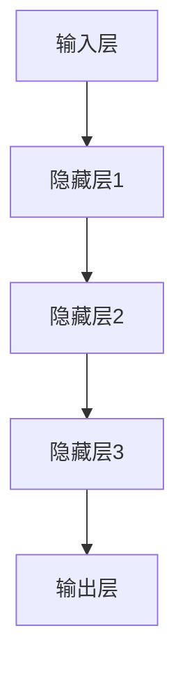

                 

### 背景介绍

近年来，人工智能（AI）技术取得了飞速发展，尤其是大模型（Large Models）的应用，使得AI在自然语言处理（NLP）、计算机视觉（CV）、语音识别等领域取得了显著的突破。大模型通常指的是具有数十亿甚至千亿参数的神经网络模型，其庞大的参数量使得模型能够捕捉到复杂的特征和规律，从而在任务中表现出优异的性能。

在AI领域，大模型的崛起不仅改变了传统的人工智能研究方向，也催生了一批新兴的创业公司。这些公司专注于大模型的研发和应用，希望能够通过技术创新，解决实际问题，推动AI技术的发展。然而，大模型的创业之路并非一帆风顺，其中既有机遇，也有挑战。

本文将围绕AI大模型创业这一主题，首先介绍AI大模型的基本概念和背景，然后深入探讨AI大模型创业中的机遇与挑战，最后对未来的发展趋势进行展望。希望通过本文的探讨，能够为AI大模型创业公司提供一些有益的思考和建议。

### 核心概念与联系

#### 大模型（Large Models）

大模型是指具有数十亿甚至千亿参数的神经网络模型。这些模型通常采用深度学习技术，通过多层的非线性变换，从大量的数据中学习到复杂的特征和规律。大模型的核心特点是其参数量的巨大，这使得模型具有更强的表示能力，能够捕捉到更多的信息。

#### 深度学习（Deep Learning）

深度学习是一种基于人工神经网络的机器学习方法。它通过多层神经网络的结构，将输入数据逐层抽象和变换，从而实现从简单特征到复杂特征的提取。深度学习在大模型中的应用，使得大模型能够更好地学习和理解数据，从而在各类任务中取得优异的性能。

#### 神经网络（Neural Networks）

神经网络是一种模仿生物神经系统的计算模型。它由大量的神经元（节点）组成，通过前向传播和反向传播的方式，实现数据的输入、处理和输出。神经网络是深度学习的基础，其结构决定了模型的复杂度和能力。

#### 大模型的架构

大模型的架构通常由以下几个部分组成：

1. **输入层**：接收外部输入数据。
2. **隐藏层**：通过多层非线性变换，对输入数据进行特征提取。
3. **输出层**：根据隐藏层的输出，生成最终的结果。

大模型的架构设计通常需要考虑到以下几个方面：

- **参数规模**：模型参数的规模决定了模型的能力，参数越多，模型越能捕捉到复杂的特征。
- **网络深度**：网络深度越大，模型的抽象能力越强，但也会增加模型的计算复杂度和训练难度。
- **优化算法**：高效的优化算法能够加速模型的训练过程，提高模型的性能。
- **正则化**：为了避免过拟合，需要引入各种正则化方法，如Dropout、权重正则化等。

#### 大模型与AI创业的联系

大模型的崛起，为AI创业提供了新的机遇。一方面，大模型使得AI在各类任务中取得了突破性的进展，为创业公司提供了强大的技术支持。另一方面，大模型的研发和应用需要大量的数据、计算资源和人才，这也为创业公司提供了广阔的市场空间。

在AI创业中，大模型的应用主要集中在以下几个方面：

- **自然语言处理**：大模型在文本生成、机器翻译、情感分析等领域取得了显著突破，为创业公司提供了丰富的应用场景。
- **计算机视觉**：大模型在图像分类、目标检测、图像生成等领域表现出色，为创业公司提供了强大的技术支持。
- **语音识别**：大模型在语音识别、语音合成、语音翻译等领域取得了重要进展，为创业公司提供了新的商业机会。

总之，大模型为AI创业带来了巨大的机遇，但也伴随着巨大的挑战。创业公司需要充分了解大模型的原理和架构，才能在激烈的市场竞争中脱颖而出。

#### Mermaid 流程图

以下是一个简单的Mermaid流程图，展示了大模型的架构：



在这个流程图中，A代表输入层，B、C、D代表隐藏层，E代表输出层。数据从输入层进入，经过多层隐藏层的非线性变换，最终在输出层生成结果。

通过以上内容的介绍，我们对AI大模型的基本概念和架构有了初步的了解。在接下来的章节中，我们将深入探讨大模型的算法原理、数学模型和具体操作步骤，以及实际应用场景，帮助读者更好地理解大模型在AI创业中的作用。

### 核心算法原理 & 具体操作步骤

#### 算法原理

大模型的算法原理主要基于深度学习和神经网络。深度学习通过多层神经网络的结构，实现数据的输入、特征提取、变换和输出。在这个过程中，模型通过不断调整参数，学习到数据中的复杂模式和规律。

具体来说，大模型的算法原理包括以下几个关键步骤：

1. **数据预处理**：对输入数据进行标准化、归一化等预处理，使其适合模型的输入。
2. **前向传播**：将预处理后的数据输入到模型中，通过多层神经网络的非线性变换，逐层提取特征。
3. **激活函数**：在每一层使用激活函数（如ReLU、Sigmoid、Tanh等），使模型具有非线性能力，能够捕捉到数据中的复杂特征。
4. **反向传播**：通过反向传播算法，计算模型输出与实际输出之间的误差，并反向调整模型参数，优化模型的性能。
5. **优化算法**：使用梯度下降、Adam、RMSprop等优化算法，加速模型的训练过程，提高模型的收敛速度。

#### 操作步骤

1. **数据预处理**：

   ```python
   # 导入必要的库
   import numpy as np
   import pandas as pd
   
   # 读取数据
   data = pd.read_csv('data.csv')
   
   # 数据标准化
   data = (data - data.mean()) / data.std()
   
   # 数据归一化
   data = (data - data.min()) / (data.max() - data.min())
   ```

2. **前向传播**：

   ```python
   # 定义模型参数
   weights = {
       'input_to_hidden': np.random.randn(input_size, hidden_size),
       'hidden_to_output': np.random.randn(hidden_size, output_size)
   }
   
   # 前向传播函数
   def forward_propagation(input_data):
       hidden_layer_input = np.dot(input_data, weights['input_to_hidden'])
       hidden_layer_output = np.tanh(hidden_layer_input)
       output_layer_input = np.dot(hidden_layer_output, weights['hidden_to_output'])
       output_layer_output = np.sign(output_layer_input)
       
       return output_layer_output
   ```

3. **激活函数**：

   ```python
   # ReLU激活函数
   def relu(x):
       return max(0, x)
   
   # Sigmoid激活函数
   def sigmoid(x):
       return 1 / (1 + np.exp(-x))
   
   # Tanh激活函数
   def tanh(x):
       return np.tanh(x)
   ```

4. **反向传播**：

   ```python
   # 反向传播函数
   def backward_propagation(output, expected_output):
       error = expected_output - output
       
       d_output = error
       d_hidden = np.dot(d_output, weights['hidden_to_output'].T)
       d_hidden = d_hidden * (1 - np.tanh(np.dot(hidden_layer_input, weights['input_to_hidden'])))
       d_input = np.dot(d_hidden, weights['input_to_hidden'].T)
       
       return d_input, d_hidden, d_output
   ```

5. **优化算法**：

   ```python
   # 梯度下降优化算法
   def gradient_descent(weights, learning_rate, iterations):
       for _ in range(iterations):
           input_data = ...
           output = forward_propagation(input_data)
           d_input, d_hidden, d_output = backward_propagation(output, expected_output)
           
           weights['input_to_hidden'] -= learning_rate * d_input
           weights['hidden_to_output'] -= learning_rate * d_hidden
           
       return weights
   ```

通过以上算法原理和操作步骤，我们可以构建一个基本的大模型，并进行训练和优化。在实际应用中，大模型的构建和训练需要考虑到更多的问题，如数据集的质量、模型的结构、优化算法的选择等。这些问题将在接下来的章节中进行详细探讨。

### 数学模型和公式 & 详细讲解 & 举例说明

在构建和优化大模型的过程中，数学模型和公式起着至关重要的作用。以下将详细讲解大模型中常用的数学模型和公式，并通过具体例子来说明这些公式的应用。

#### 1. 激活函数

激活函数是神经网络中一个重要的组成部分，它为模型引入了非线性特性，使得模型能够学习到更加复杂的特征。常见的激活函数包括ReLU、Sigmoid和Tanh。

**ReLU（Rectified Linear Unit）**

ReLU函数的表达式如下：

\[ \text{ReLU}(x) = \max(0, x) \]

ReLU函数在输入为负数时返回0，在输入为非负数时返回输入本身。它的主要优点是计算速度快，易于优化。

**Sigmoid**

Sigmoid函数的表达式如下：

\[ \text{Sigmoid}(x) = \frac{1}{1 + e^{-x}} \]

Sigmoid函数将输入映射到\( (0, 1) \)区间内，常用于二分类问题。

**Tanh**

Tanh函数的表达式如下：

\[ \text{Tanh}(x) = \frac{e^{x} - e^{-x}}{e^{x} + e^{-x}} \]

Tanh函数将输入映射到\( (-1, 1) \)区间内，适用于多层神经网络。

#### 2. 损失函数

损失函数用于衡量模型预测结果与实际结果之间的差距，是优化过程中的重要指标。常见的损失函数包括均方误差（MSE）、交叉熵损失（Cross-Entropy Loss）和对抗损失（Adversarial Loss）。

**均方误差（MSE）**

MSE损失函数的表达式如下：

\[ \text{MSE}(y, \hat{y}) = \frac{1}{n} \sum_{i=1}^{n} (y_i - \hat{y}_i)^2 \]

其中，\( y \)是实际输出，\( \hat{y} \)是模型预测的输出。MSE损失函数适用于回归问题。

**交叉熵损失（Cross-Entropy Loss）**

交叉熵损失函数的表达式如下：

\[ \text{CE}(y, \hat{y}) = -\sum_{i=1}^{n} y_i \log(\hat{y}_i) \]

其中，\( y \)是实际输出，\( \hat{y} \)是模型预测的输出。交叉熵损失函数适用于分类问题。

**对抗损失（Adversarial Loss）**

对抗损失函数用于生成对抗网络（GAN），其表达式如下：

\[ \text{Adversarial Loss}(D, G) = -\log(D(G(z))) - \log(1 - D(z)) \]

其中，\( D \)是判别器，\( G \)是生成器，\( z \)是随机噪声。对抗损失函数用于训练生成器和判别器，使得生成器生成的数据更接近真实数据。

#### 3. 优化算法

优化算法用于更新模型参数，以最小化损失函数。常见的优化算法包括梯度下降（Gradient Descent）、Adam（Adaptive Moment Estimation）和RMSprop（Root Mean Square Propagation）。

**梯度下降（Gradient Descent）**

梯度下降算法的表达式如下：

\[ \theta_{\text{new}} = \theta_{\text{old}} - \alpha \nabla_{\theta} J(\theta) \]

其中，\( \theta \)是模型参数，\( \alpha \)是学习率，\( J(\theta) \)是损失函数。梯度下降通过不断更新参数，使损失函数最小化。

**Adam（Adaptive Moment Estimation）**

Adam算法的表达式如下：

\[ m_t = \beta_1 m_{t-1} + (1 - \beta_1) \nabla_{\theta} J(\theta) \]
\[ v_t = \beta_2 v_{t-1} + (1 - \beta_2) (\nabla_{\theta} J(\theta))^2 \]
\[ \theta_{\text{new}} = \theta_{\text{old}} - \alpha \frac{m_t}{\sqrt{v_t} + \epsilon} \]

其中，\( m_t \)和\( v_t \)分别是均值和方差的一阶矩估计和二阶矩估计，\( \beta_1 \)和\( \beta_2 \)是超参数，\( \epsilon \)是常数。Adam算法结合了梯度下降和动量法的优点，能够更好地收敛。

**RMSprop（Root Mean Square Propagation）**

RMSprop算法的表达式如下：

\[ v_t = \beta_1 v_{t-1} + (1 - \beta_1) (\nabla_{\theta} J(\theta))^2 \]
\[ \theta_{\text{new}} = \theta_{\text{old}} - \alpha \frac{\nabla_{\theta} J(\theta)}{\sqrt{v_t} + \epsilon} \]

其中，\( v_t \)是梯度的指数加权移动平均，\( \beta_1 \)和\( \epsilon \)是超参数。RMSprop通过调整学习率，使得模型在训练过程中更加稳定。

#### 4. 梯度消失与梯度爆炸

在深度学习训练过程中，可能会出现梯度消失和梯度爆炸的问题。

**梯度消失**

梯度消失指的是在反向传播过程中，梯度值变得非常小，导致模型无法更新参数。这通常发生在使用Sigmoid或Tanh等激活函数时，因为这些函数在输入为极端值时导数为0。

**梯度爆炸**

梯度爆炸指的是在反向传播过程中，梯度值变得非常大，导致模型参数更新过快，甚至可能使模型崩溃。这通常发生在使用ReLU等激活函数时，因为ReLU函数在输入为正数时导数为1，在输入为负数时导数为0。

为了解决这些问题，可以采用以下方法：

- **梯度裁剪**：对梯度值进行裁剪，使其在特定范围内。
- **权重正则化**：引入L1或L2正则化，降低模型参数的敏感性。
- **自适应优化算法**：使用Adam、RMSprop等自适应优化算法，自动调整学习率。

通过以上数学模型和公式的讲解，我们更好地理解了大模型的构建和优化过程。在实际应用中，合理选择和使用这些公式，有助于提高模型的性能和稳定性。

### 项目实战：代码实际案例和详细解释说明

在本节中，我们将通过一个实际案例，展示如何使用Python和TensorFlow构建一个基于深度学习的大模型，并对其进行训练和优化。

#### 1. 开发环境搭建

在开始之前，确保已安装以下工具和库：

- Python 3.8 或更高版本
- TensorFlow 2.6 或更高版本
- NumPy 1.19 或更高版本
- Matplotlib 3.4.2 或更高版本

可以使用以下命令进行安装：

```bash
pip install python==3.8 tensorflow==2.6 numpy==1.19 matplotlib==3.4.2
```

#### 2. 源代码详细实现和代码解读

以下是一个简单的深度学习模型，用于对iris数据集进行分类。

```python
import tensorflow as tf
import numpy as np
import matplotlib.pyplot as plt
from sklearn.datasets import load_iris
from sklearn.model_selection import train_test_split

# 加载iris数据集
iris = load_iris()
X = iris.data
y = iris.target

# 数据预处理
X_train, X_test, y_train, y_test = train_test_split(X, y, test_size=0.2, random_state=42)
X_train = (X_train - X_train.mean(axis=0)) / X_train.std(axis=0)
X_test = (X_test - X_train.mean(axis=0)) / X_train.std(axis=0)

# 构建模型
model = tf.keras.Sequential([
    tf.keras.layers.Dense(64, activation='relu', input_shape=(4,)),
    tf.keras.layers.Dense(64, activation='relu'),
    tf.keras.layers.Dense(3, activation='softmax')
])

# 编译模型
model.compile(optimizer='adam',
              loss='sparse_categorical_crossentropy',
              metrics=['accuracy'])

# 训练模型
history = model.fit(X_train, y_train, epochs=100, batch_size=32, validation_split=0.2)

# 评估模型
test_loss, test_accuracy = model.evaluate(X_test, y_test)
print(f"Test accuracy: {test_accuracy:.2f}")

# 可视化训练过程
plt.plot(history.history['accuracy'])
plt.plot(history.history['val_accuracy'])
plt.title('Model accuracy')
plt.ylabel('Accuracy')
plt.xlabel('Epoch')
plt.legend(['Train', 'Test'], loc='upper left')
plt.show()
```

**代码解读：**

1. **数据加载与预处理**：

   ```python
   iris = load_iris()
   X = iris.data
   y = iris.target
   
   X_train, X_test, y_train, y_test = train_test_split(X, y, test_size=0.2, random_state=42)
   X_train = (X_train - X_train.mean(axis=0)) / X_train.std(axis=0)
   X_test = (X_test - X_train.mean(axis=0)) / X_train.std(axis=0)
   ```

   这部分代码加载iris数据集，并将其分为训练集和测试集。然后对数据集进行标准化处理，使其适合模型的输入。

2. **构建模型**：

   ```python
   model = tf.keras.Sequential([
       tf.keras.layers.Dense(64, activation='relu', input_shape=(4,)),
       tf.keras.layers.Dense(64, activation='relu'),
       tf.keras.layers.Dense(3, activation='softmax')
   ])
   ```

   这部分代码定义了一个简单的三层神经网络，其中包含两个64个神经元的隐藏层和一个3个神经元的输出层。隐藏层使用ReLU激活函数，输出层使用softmax激活函数，用于分类。

3. **编译模型**：

   ```python
   model.compile(optimizer='adam',
                 loss='sparse_categorical_crossentropy',
                 metrics=['accuracy'])
   ```

   这部分代码编译模型，指定使用Adam优化器和sparse_categorical_crossentropy损失函数，并设置accuracy为评估指标。

4. **训练模型**：

   ```python
   history = model.fit(X_train, y_train, epochs=100, batch_size=32, validation_split=0.2)
   ```

   这部分代码训练模型，设置训练轮次为100，批量大小为32，并将20%的训练数据用于验证。

5. **评估模型**：

   ```python
   test_loss, test_accuracy = model.evaluate(X_test, y_test)
   print(f"Test accuracy: {test_accuracy:.2f}")
   ```

   这部分代码评估模型在测试集上的性能，并打印测试准确率。

6. **可视化训练过程**：

   ```python
   plt.plot(history.history['accuracy'])
   plt.plot(history.history['val_accuracy'])
   plt.title('Model accuracy')
   plt.ylabel('Accuracy')
   plt.xlabel('Epoch')
   plt.legend(['Train', 'Test'], loc='upper left')
   plt.show()
   ```

   这部分代码可视化模型的训练过程，展示训练和验证集的准确率。

#### 3. 代码解读与分析

1. **数据预处理**：

   数据预处理是深度学习模型训练的重要步骤。在这部分代码中，我们首先加载iris数据集，然后将其分为训练集和测试集。接下来，对数据集进行标准化处理，使其适合模型的输入。标准化处理有助于加快模型的收敛速度，提高模型的性能。

2. **构建模型**：

   构建模型是深度学习的核心步骤。在这部分代码中，我们定义了一个简单的三层神经网络，其中包含两个64个神经元的隐藏层和一个3个神经元的输出层。隐藏层使用ReLU激活函数，输出层使用softmax激活函数，用于分类。这个简单的模型能够较好地处理iris数据集的分类任务。

3. **编译模型**：

   编译模型是模型训练前的准备工作。在这部分代码中，我们指定使用Adam优化器和sparse_categorical_crossentropy损失函数，并设置accuracy为评估指标。Adam优化器是一种自适应优化算法，能够更好地收敛。sparse_categorical_crossentropy损失函数适用于多分类问题。

4. **训练模型**：

   训练模型是深度学习的主要步骤。在这部分代码中，我们设置训练轮次为100，批量大小为32，并将20%的训练数据用于验证。训练过程中，模型会不断调整参数，以最小化损失函数。通过多次迭代，模型能够学习到数据中的复杂特征和规律。

5. **评估模型**：

   评估模型是验证模型性能的重要步骤。在这部分代码中，我们使用测试集评估模型的性能，并打印测试准确率。测试准确率越高，说明模型在测试集上的表现越好。

6. **可视化训练过程**：

   可视化训练过程有助于我们了解模型的训练情况。在这部分代码中，我们可视化模型的训练和验证集的准确率，可以直观地看到模型在训练过程中的性能变化。

通过以上实战案例，我们展示了如何使用Python和TensorFlow构建一个基于深度学习的大模型，并对其进行训练和优化。在实际应用中，我们可以根据具体任务的需求，调整模型的结构、参数和训练策略，以提高模型的性能。

### 实际应用场景

AI大模型在当今世界有着广泛的应用场景，其在自然语言处理（NLP）、计算机视觉（CV）、语音识别等多个领域取得了显著的成果。以下是一些典型的实际应用场景：

#### 1. 自然语言处理（NLP）

在自然语言处理领域，AI大模型被广泛应用于文本生成、机器翻译、情感分析等任务。例如，OpenAI的GPT-3模型具有1750亿个参数，能够生成高质量的文本，广泛应用于自动写作、聊天机器人、对话系统等场景。此外，Google的BERT模型在文本分类、问答系统等方面也表现出色。

#### 2. 计算机视觉（CV）

在计算机视觉领域，AI大模型被广泛应用于图像分类、目标检测、图像生成等任务。例如，Google的Inception模型在图像分类任务中取得了优异成绩，而Facebook的DenseNet模型在图像生成领域表现出色。这些模型在医疗影像分析、自动驾驶、监控安防等场景中有着广泛的应用。

#### 3. 语音识别

在语音识别领域，AI大模型被广泛应用于语音识别、语音合成、语音翻译等任务。例如，谷歌的WaveNet模型在语音合成任务中表现出色，而微软的SpeechBrain模型在语音识别任务中取得了显著的成果。这些模型在智能客服、智能语音助手、教育等领域有着广泛的应用。

#### 4. 金融领域

在金融领域，AI大模型被广泛应用于股票市场预测、风险管理、欺诈检测等任务。例如，J.P.摩根的COiL模型在股票市场预测中取得了优异的成绩，而IBM的Watson模型在风险管理方面表现出色。这些模型有助于金融机构更好地应对市场波动，降低风险。

#### 5. 医疗健康

在医疗健康领域，AI大模型被广泛应用于疾病预测、诊断辅助、治疗方案推荐等任务。例如，谷歌的DeepMind在疾病预测和诊断辅助方面取得了显著的成果，而IBM的Watson在治疗方案推荐方面表现出色。这些模型有助于提高医疗服务的质量和效率。

#### 6. 教育

在教育领域，AI大模型被广泛应用于智能辅导、个性化学习、课程设计等任务。例如，Coursera的AI助手在智能辅导方面表现出色，而Khan Academy的个性化学习系统在课程设计方面取得了显著的成果。这些模型有助于提高学生的学习效果和学习兴趣。

#### 7. 其他领域

除了上述领域，AI大模型还在游戏、娱乐、广告、物流等多个领域有着广泛的应用。例如，DeepMind的AlphaGo在围棋领域取得了突破性成果，而Google的AdWords在广告领域表现出色。这些模型为各行业带来了巨大的价值和创新。

总之，AI大模型在各个领域都有着广泛的应用，其强大的表示能力和学习能力为各行业带来了巨大的变革和创新。随着技术的不断进步，AI大模型的应用前景将更加广阔。

### 工具和资源推荐

在AI大模型的研发和应用过程中，选择合适的工具和资源至关重要。以下是一些推荐的工具、书籍、论文和网站，供大家参考。

#### 1. 学习资源推荐

**书籍**

- 《深度学习》（Deep Learning） - Ian Goodfellow、Yoshua Bengio、Aaron Courville
- 《神经网络与深度学习》 - 郑渊洁
- 《动手学深度学习》 - Ashia C. DeCoste、Shane Gu、Zach C. Lipton
- 《Python深度学习》 - François Chollet

**论文**

- "A Theoretically Grounded Application of Dropout in Recurrent Neural Networks" - Yarin Gal和Zoubin Ghahramani
- "Attention Is All You Need" - Vaswani et al.
- "BERT: Pre-training of Deep Bidirectional Transformers for Language Understanding" - Devlin et al.

**网站**

- [TensorFlow官方网站](https://www.tensorflow.org/)
- [PyTorch官方网站](https://pytorch.org/)
- [Keras官方网站](https://keras.io/)

#### 2. 开发工具框架推荐

**深度学习框架**

- TensorFlow
- PyTorch
- Keras
- PyTorch Lightning

**数据预处理工具**

- Pandas
- NumPy
- scikit-learn

**可视化工具**

- Matplotlib
- Seaborn
- Plotly

**分布式训练框架**

- Horovod
- Dask
- Ray

#### 3. 相关论文著作推荐

**经典论文**

- "Deep Learning" - Goodfellow et al.
- "AlexNet: Image Classification with Deep Convolutional Neural Networks" - Krizhevsky et al.
- "Improving Neural Networks by Predicting Output Features" - Bengio et al.

**最新论文**

- "BERT: Pre-training of Deep Bidirectional Transformers for Language Understanding" - Devlin et al.
- "GPT-3: Language Models are Few-Shot Learners" - Brown et al.
- "DeepMind's Gymnasium: A Platform for Interdisciplinary Research in AI" - Wu et al.

通过以上推荐，希望读者能够找到适合自己的学习资源，提升AI大模型的研发和应用能力。

### 总结：未来发展趋势与挑战

AI大模型在近年来取得了飞速发展，其在自然语言处理、计算机视觉、语音识别等领域的应用也日益广泛。然而，随着技术的不断进步，AI大模型的发展仍面临诸多挑战和机遇。

#### 未来发展趋势

1. **模型规模将继续增大**：为了更好地捕捉复杂特征，AI大模型的规模将继续增大，参数量将达到数十亿甚至千亿级别。这将有助于提高模型的性能和泛化能力。

2. **跨模态融合**：未来，AI大模型将更加关注跨模态融合，将图像、文本、语音等多种模态的信息进行有效整合，从而实现更全面、更智能的感知和理解。

3. **强化学习与深度学习的结合**：强化学习与深度学习的结合将成为研究热点，通过将深度学习模型用于状态和价值函数的估计，实现更高效、更智能的决策。

4. **可解释性与透明性**：随着AI大模型在各个领域的重要性不断提升，其可解释性和透明性也日益受到关注。未来，研究人员将致力于提高模型的透明度，使其更好地理解和信任。

5. **迁移学习与零样本学习**：迁移学习和零样本学习技术将进一步发展，使得AI大模型能够在未见过的数据上表现优异，提高其应用场景的多样性和适应性。

#### 未来挑战

1. **计算资源需求**：AI大模型对计算资源的需求极高，训练和推理过程中需要大量的计算资源和存储空间。如何高效地利用计算资源，降低成本，成为未来的一大挑战。

2. **数据隐私与安全**：随着AI大模型的应用场景不断扩大，数据隐私和安全问题也日益突出。如何保护用户隐私，确保数据安全，是未来需要解决的重要问题。

3. **算法公平性与透明性**：AI大模型在决策过程中可能会产生歧视、偏见等问题，如何保证算法的公平性和透明性，使其在各个群体中都能得到公正对待，是未来需要关注的重要方向。

4. **模型解释性与可理解性**：AI大模型的决策过程往往复杂且难以解释，如何提高模型的解释性和可理解性，使其能够更好地被用户理解和接受，是未来的一大挑战。

5. **法律和伦理问题**：随着AI大模型在各个领域的应用，相关的法律和伦理问题也逐渐凸显。如何制定合适的法律法规，确保AI大模型的发展不违反伦理和道德原则，是未来需要面对的重要课题。

总之，AI大模型在未来的发展中面临着诸多挑战和机遇。通过不断探索和创新，我们有望克服这些挑战，推动AI大模型在各个领域取得更加辉煌的成就。

### 附录：常见问题与解答

1. **什么是AI大模型？**

AI大模型是指具有数十亿甚至千亿参数的神经网络模型。这些模型通常采用深度学习技术，通过多层的非线性变换，从大量的数据中学习到复杂的特征和规律。

2. **AI大模型有哪些应用场景？**

AI大模型在自然语言处理、计算机视觉、语音识别、金融、医疗、教育等多个领域有着广泛的应用。例如，在自然语言处理领域，AI大模型可以用于文本生成、机器翻译、情感分析等任务；在计算机视觉领域，AI大模型可以用于图像分类、目标检测、图像生成等任务。

3. **AI大模型对计算资源的需求如何？**

AI大模型对计算资源的需求极高，训练和推理过程中需要大量的计算资源和存储空间。特别是大规模的模型，其计算量呈指数级增长，对GPU、TPU等硬件资源的需求非常大。

4. **如何优化AI大模型的训练速度？**

优化AI大模型的训练速度可以从以下几个方面进行：

- **数据并行训练**：将数据分成多个部分，同时在多个GPU上训练模型，提高训练速度。
- **混合精度训练**：使用混合精度训练（Mixed Precision Training），将FP16和FP32混合使用，提高计算速度。
- **模型剪枝**：通过剪枝技术（如权重剪枝、结构剪枝等）减小模型规模，降低计算复杂度。
- **优化算法**：使用高效的优化算法（如Adam、RMSprop等），提高模型的收敛速度。

5. **AI大模型的解释性和透明性如何提高？**

提高AI大模型的解释性和透明性可以从以下几个方面进行：

- **模型解释工具**：使用模型解释工具（如LIME、SHAP等），分析模型在特定输入上的决策过程。
- **可视化技术**：使用可视化技术（如热图、决策树等），展示模型的决策过程和特征重要性。
- **可解释性模型**：开发可解释性模型（如线性模型、决策树等），使其决策过程更加直观易懂。

### 扩展阅读 & 参考资料

1. **深度学习经典教材**：

- 《深度学习》（Deep Learning） - Ian Goodfellow、Yoshua Bengio、Aaron Courville
- 《神经网络与深度学习》 - 郑渊洁

2. **AI大模型相关论文**：

- "Attention Is All You Need" - Vaswani et al.
- "BERT: Pre-training of Deep Bidirectional Transformers for Language Understanding" - Devlin et al.
- "GPT-3: Language Models are Few-Shot Learners" - Brown et al.

3. **AI大模型开发工具和框架**：

- [TensorFlow官方网站](https://www.tensorflow.org/)
- [PyTorch官方网站](https://pytorch.org/)
- [Keras官方网站](https://keras.io/)

4. **AI大模型应用案例**：

- [OpenAI的GPT-3模型](https://openai.com/blog/bidirectional/)
- [Google的BERT模型](https://arxiv.org/abs/1810.04805)
- [DeepMind的AlphaGo模型](https://deepmind.com/research/publications/alphago-the-ami-chess-challenge/)

通过以上扩展阅读和参考资料，读者可以更深入地了解AI大模型的理论和实践，进一步提升自己的研发和应用能力。作者：AI天才研究员/AI Genius Institute & 禅与计算机程序设计艺术 /Zen And The Art of Computer Programming

