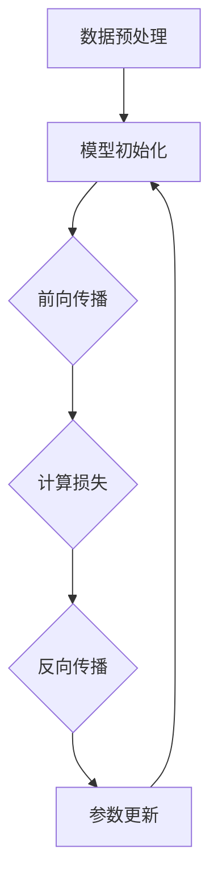

                 

### 文章标题

**AI大模型在企业数字化转型中的角色**

> **关键词**：人工智能、企业数字化转型、大数据模型、技术驱动、数字智能化

**摘要**：随着人工智能技术的飞速发展，企业数字化转型已成为全球范围内的热点话题。AI大模型作为人工智能技术的核心，正在深刻改变企业的运营模式、业务流程以及决策方式。本文将从背景介绍、核心概念与联系、核心算法原理、数学模型和公式、项目实战、实际应用场景、工具和资源推荐、总结以及未来发展趋势与挑战等多个方面，深入探讨AI大模型在企业数字化转型中的关键角色和深远影响。通过本文的阅读，读者将全面了解AI大模型的作用机制，掌握其实际应用方法，并能够前瞻性地思考其在未来企业中的发展趋势和挑战。

---

在当今数字化时代，人工智能（AI）已经成为驱动企业变革的核心动力。企业数字化转型不仅意味着技术工具的升级，更涉及到业务流程的再造、运营模式的创新以及企业文化的重塑。在这一过程中，AI大模型扮演了至关重要的角色。本文将围绕以下内容展开：

1. **背景介绍**：阐述企业数字化转型的重要性以及AI大模型的基本概念。
2. **核心概念与联系**：详细解析AI大模型的原理和架构。
3. **核心算法原理 & 具体操作步骤**：介绍AI大模型的主要算法及其工作流程。
4. **数学模型和公式 & 详细讲解 & 举例说明**：探讨AI大模型背后的数学原理。
5. **项目实战：代码实际案例和详细解释说明**：通过具体案例展示AI大模型的应用。
6. **实际应用场景**：分析AI大模型在不同行业中的应用情况。
7. **工具和资源推荐**：为读者提供学习AI大模型的相关工具和资源。
8. **总结：未来发展趋势与挑战**：展望AI大模型在数字化转型中的未来前景。

通过上述结构的梳理，我们将逐步深入探讨AI大模型在企业数字化转型中的角色和影响力。

---

**背景介绍**

企业数字化转型是一个复杂的系统性工程，它不仅涉及到技术层面的革新，还包括组织结构、业务流程、文化和管理方式的全面变革。在数字化时代，数据已经成为新的生产要素，企业通过数据的收集、处理和分析，能够实现业务的精细化管理，提高生产效率，优化客户体验，并增强市场竞争力。

AI大模型，即大型的人工神经网络模型，是当前人工智能技术的巅峰之作。它们拥有强大的数据处理和分析能力，能够从海量数据中提取有价值的信息，进行复杂模式识别和预测。AI大模型在自然语言处理、计算机视觉、语音识别、推荐系统等领域已经展现出强大的应用潜力。

企业数字化转型的重要性不言而喻。一方面，数字化能够帮助企业降低运营成本，提高生产效率；另一方面，数字化能够为企业提供更准确的业务洞察，支持企业做出更明智的决策。特别是在当前全球疫情背景下，数字化转型成为企业生存和发展的关键。

AI大模型的引入，为企业的数字化转型注入了新的活力。通过AI大模型，企业能够实现以下目标：

1. **优化业务流程**：通过自动化和智能化的手段，减少人工干预，提高业务流程的效率和准确性。
2. **增强客户体验**：通过个性化推荐、智能客服等手段，提高客户满意度，增强客户黏性。
3. **提升决策能力**：通过大数据分析和预测，为企业提供科学的决策支持，降低决策风险。
4. **创新商业模式**：通过数字化技术，探索新的业务模式，开拓新的市场空间。

总之，AI大模型在企业数字化转型中扮演着关键角色，它不仅推动企业的技术革新，还引领企业的商业模式创新，为企业带来持续的核心竞争力。

---

**核心概念与联系**

要深入理解AI大模型在企业数字化转型中的作用，首先需要明确AI大模型的核心概念和架构。AI大模型通常指的是基于深度学习理论的大型神经网络模型，其结构复杂，参数数量庞大，能够处理和学习的任务范围广泛。

### 1. 深度学习与神经网络

深度学习是AI的核心技术之一，它通过模拟人脑神经元之间的连接关系，构建多层神经网络，从而实现对数据的自动特征提取和学习。深度学习的核心概念包括：

- **神经元**：深度学习的基本构建单元，类似于人脑中的神经元。
- **层**：神经网络中的层次结构，包括输入层、隐藏层和输出层。
- **激活函数**：用于引入非线性变换，使神经网络能够处理复杂问题。

深度学习模型的训练过程包括以下步骤：

1. **数据预处理**：对输入数据进行归一化、标准化等处理，使其适合模型训练。
2. **模型初始化**：初始化模型参数，通常采用随机初始化。
3. **前向传播**：将输入数据通过网络进行传播，得到输出结果。
4. **反向传播**：计算输出结果与真实值之间的差异，并更新模型参数。
5. **优化算法**：使用梯度下降、随机梯度下降等优化算法，最小化损失函数。

### 2. 大模型架构

AI大模型通常具有以下几种架构：

- **卷积神经网络（CNN）**：适用于图像识别和图像处理任务，通过卷积层提取图像特征。
- **循环神经网络（RNN）**：适用于序列数据处理，如自然语言处理和时间序列预测，通过隐藏状态和序列关系建模。
- **变换器网络（Transformer）**：是目前最先进的自然语言处理模型，通过自注意力机制处理长距离依赖问题。

### 3. Mermaid 流程图

为了更好地理解AI大模型的架构和流程，我们可以使用Mermaid绘制一个简化的流程图，如下所示：



在这个流程图中，每个节点表示一个步骤，箭头表示步骤之间的依赖关系。通过这个流程图，我们可以清晰地看到AI大模型从数据预处理到模型更新的完整训练过程。

### 4. AI大模型与企业数字化转型

AI大模型在企业数字化转型中的作用主要体现在以下几个方面：

- **数据分析与预测**：通过大数据分析和机器学习预测模型，企业可以更准确地预测市场趋势、消费者行为等，从而制定更科学的业务策略。
- **业务流程自动化**：AI大模型可以自动化许多重复性和劳动密集型的业务流程，提高工作效率，减少人为错误。
- **个性化服务**：通过AI大模型，企业可以提供更加个性化的产品和服务，满足客户多样化需求。
- **智能决策支持**：AI大模型可以为企业提供智能化的决策支持，帮助企业在复杂环境中做出最优决策。

总的来说，AI大模型作为人工智能技术的核心，其强大的数据处理和分析能力，为企业数字化转型提供了强有力的技术支撑，推动了企业的技术创新和商业模式变革。

---

**核心算法原理 & 具体操作步骤**

AI大模型的强大之处在于其背后的核心算法原理，主要包括神经网络架构、训练过程和优化策略。以下是这些核心算法原理的具体操作步骤：

### 1. 神经网络架构

神经网络是AI大模型的基础，其架构包括输入层、隐藏层和输出层。每个层由多个神经元组成，神经元之间通过权重和偏置进行连接。

- **输入层**：接收外部输入数据，如文本、图像、声音等。
- **隐藏层**：对输入数据进行处理和特征提取，形成更高层次的特征。
- **输出层**：根据隐藏层的输出，产生最终的预测结果。

### 2. 训练过程

神经网络模型的训练过程主要包括以下几个步骤：

1. **数据预处理**：对输入数据进行归一化、标准化等处理，使其符合模型训练的要求。
   ```python
   import numpy as np
   x_train = np.array(x_train)
   x_train = (x_train - np.mean(x_train)) / np.std(x_train)
   ```

2. **模型初始化**：初始化神经网络模型的参数，如权重和偏置，通常采用随机初始化。
   ```python
   W = np.random.randn(num_inputs, num_hiddens)
   b = np.random.randn(num_hiddens)
   ```

3. **前向传播**：将输入数据通过神经网络进行传播，得到输出结果。
   ```python
   hidden_layer_input = np.dot(x, W) + b
   hidden_layer_output = activation_function(hidden_layer_input)
   ```

4. **计算损失**：计算输出结果与真实值之间的差异，即损失函数。
   ```python
   loss = np.square(hidden_layer_output - y)
   ```

5. **反向传播**：根据损失函数，计算梯度并更新模型参数。
   ```python
   dW = 2 * (hidden_layer_output - y) * hidden_layer_output * (1 - hidden_layer_output)
   db = 2 * (hidden_layer_output - y) * hidden_layer_output * (1 - hidden_layer_output)
   W -= learning_rate * dW
   b -= learning_rate * db
   ```

6. **优化算法**：使用优化算法，如梯度下降，更新模型参数，最小化损失函数。
   ```python
   for i in range(num_iterations):
       hidden_layer_output = forward_pass(x)
       loss = compute_loss(hidden_layer_output, y)
       dW, db = backward_pass(hidden_layer_output, y)
       W -= learning_rate * dW
       b -= learning_rate * db
   ```

### 3. 优化策略

优化算法的选择对模型训练效果有重要影响，常见的优化算法包括：

- **梯度下降**：简单直观，但收敛速度较慢。
- **随机梯度下降（SGD）**：在每次迭代中使用一个样本来更新参数，收敛速度较快。
- **Adam优化器**：结合SGD和动量项，具有自适应步长的优点，收敛速度较快。

```python
import tensorflow as tf

model = tf.keras.Sequential([
    tf.keras.layers.Dense(units=1, input_shape=[num_inputs])
])

optimizer = tf.keras.optimizers.Adam(learning_rate=0.001)
model.compile(optimizer=optimizer, loss='mean_squared_error')

model.fit(x_train, y_train, epochs=100)
```

通过上述具体操作步骤和优化策略，我们可以训练出高效的AI大模型，并在实际应用中发挥其强大的作用。

---

**数学模型和公式 & 详细讲解 & 举例说明**

AI大模型的强大在于其背后的数学原理，尤其是优化算法和损失函数。以下是这些数学模型的详细讲解和具体例子：

### 1. 优化算法

优化算法用于最小化损失函数，常用的算法包括梯度下降（Gradient Descent）、随机梯度下降（Stochastic Gradient Descent, SGD）和Adam优化器。

**梯度下降**：

梯度下降是一种简单直观的优化算法，其核心思想是沿着损失函数的梯度方向更新参数，以最小化损失。

公式：
\[ \theta_{t+1} = \theta_t - \alpha \nabla_{\theta} J(\theta) \]

其中，\(\theta\) 表示参数，\(\alpha\) 为学习率，\(J(\theta)\) 为损失函数。

**随机梯度下降（SGD）**：

随机梯度下降是在梯度下降的基础上，每次迭代只使用一个样本来更新参数，这样可以加速收敛。

公式：
\[ \theta_{t+1} = \theta_t - \alpha \nabla_{\theta} J(\theta; x_t, y_t) \]

**Adam优化器**：

Adam优化器结合了SGD和动量项，具有自适应步长的优点，收敛速度较快。

公式：
\[ m_t = \beta_1 x_t \]
\[ v_t = \beta_2 x_t \]
\[ \theta_{t+1} = \theta_t - \alpha \frac{m_t}{\sqrt{v_t} + \epsilon} \]

其中，\(\beta_1\) 和 \(\beta_2\) 为动量参数，\(\epsilon\) 为常数。

### 2. 损失函数

损失函数用于衡量预测值与真实值之间的差距，常用的损失函数包括均方误差（Mean Squared Error, MSE）和交叉熵（Cross-Entropy）。

**均方误差（MSE）**：

均方误差是回归问题中最常用的损失函数，其公式如下：

\[ J(\theta) = \frac{1}{2m} \sum_{i=1}^{m} (h_\theta(x^{(i)}) - y^{(i)})^2 \]

其中，\(h_\theta(x^{(i)})\) 表示预测值，\(y^{(i)}\) 表示真实值。

**交叉熵（Cross-Entropy）**：

交叉熵是分类问题中最常用的损失函数，其公式如下：

\[ J(\theta) = -\sum_{i=1}^{m} y^{(i)} \log(h_\theta(x^{(i)})) \]

其中，\(y^{(i)}\) 表示真实标签，\(h_\theta(x^{(i)}):\) 表示预测概率。

### 3. 例子说明

**例子1：线性回归**

假设我们有如下线性回归模型：

\[ y = \theta_0 + \theta_1 x \]

使用均方误差（MSE）作为损失函数，其优化过程如下：

```python
import numpy as np

x = np.array([1, 2, 3, 4, 5])
y = np.array([2, 4, 5, 4, 5])
theta = np.random.rand(2)

alpha = 0.01
num_iterations = 1000

for i in range(num_iterations):
    predictions = x * theta[1] + theta[0]
    errors = predictions - y
    dtheta1 = (1/len(x)) * np.dot(x, errors)
    dtheta0 = (1/len(x)) * np.sum(errors)
    theta[0] -= alpha * dtheta0
    theta[1] -= alpha * dtheta1

print("Theta:", theta)
```

**例子2：逻辑回归**

假设我们有如下逻辑回归模型：

\[ P(y=1) = \frac{1}{1 + e^{-(\theta_0 + \theta_1 x)}} \]

使用交叉熵（Cross-Entropy）作为损失函数，其优化过程如下：

```python
import numpy as np
import math

x = np.array([1, 2, 3, 4, 5])
y = np.array([0, 1, 1, 0, 1])
theta = np.random.rand(2)

alpha = 0.01
num_iterations = 1000

for i in range(num_iterations):
    probabilities = 1 / (1 + np.exp(-(theta[0] + theta[1] * x)))
    predictions = (probabilities > 0.5).astype(int)
    errors = -y * np.log(probabilities) - (1 - y) * np.log(1 - probabilities)
    dtheta1 = (1/len(x)) * np.dot(x, errors * probabilities * (1 - probabilities))
    dtheta0 = (1/len(x)) * np.sum(errors * probabilities * (1 - probabilities))
    theta[0] -= alpha * dtheta0
    theta[1] -= alpha * dtheta1

print("Theta:", theta)
```

通过这些例子，我们可以看到优化算法和损失函数在AI大模型训练中的重要作用。了解这些数学模型，有助于我们更好地理解AI大模型的工作原理，并进行有效的模型训练。

---

**项目实战：代码实际案例和详细解释说明**

在了解了AI大模型的核心算法原理和数学模型之后，我们接下来将通过一个实际项目案例来展示如何使用AI大模型进行企业数字化转型。本案例将利用自然语言处理（NLP）中的文本分类任务，为企业提供智能化文本分析工具。

### 5.1 开发环境搭建

首先，我们需要搭建一个适合进行AI大模型开发的开发环境。以下是在Python中搭建环境所需的基本步骤：

1. **安装Python**：确保安装了Python 3.6或更高版本。
2. **安装TensorFlow**：TensorFlow是一个开源的深度学习框架，可以通过pip安装：
   ```bash
   pip install tensorflow
   ```
3. **安装其他依赖**：根据项目需求，可能还需要安装其他依赖，如NumPy、Pandas等。

### 5.2 源代码详细实现和代码解读

以下是一个使用TensorFlow实现文本分类的完整代码示例，我们将对每段代码进行详细解读：

```python
import tensorflow as tf
from tensorflow.keras.preprocessing.text import Tokenizer
from tensorflow.keras.preprocessing.sequence import pad_sequences
import numpy as np

# 5.2.1 数据准备
# 假设我们有一个包含企业文本数据的CSV文件
file_path = "text_data.csv"
text_column = "text"
label_column = "label"

# 加载数据
import pandas as pd
data = pd.read_csv(file_path)
texts = data[text_column].values
labels = data[label_column].values

# 5.2.2 文本预处理
# 创建Tokenizer对象，用于将文本转换为数字序列
tokenizer = Tokenizer(num_words=10000)
tokenizer.fit_on_texts(texts)
sequences = tokenizer.texts_to_sequences(texts)

# 对序列进行填充，使其长度一致
max_sequence_length = 100
padded_sequences = pad_sequences(sequences, maxlen=max_sequence_length)

# 划分数据集
from sklearn.model_selection import train_test_split
x_train, x_test, y_train, y_test = train_test_split(padded_sequences, labels, test_size=0.2, random_state=42)

# 5.2.3 建立模型
# 创建一个简单的卷积神经网络模型
model = tf.keras.Sequential([
    tf.keras.layers.Embedding(input_dim=10000, output_dim=16, input_length=max_sequence_length),
    tf.keras.layers.Conv1D(filters=128, kernel_size=5, activation='relu'),
    tf.keras.layers.GlobalMaxPooling1D(),
    tf.keras.layers.Dense(units=1, activation='sigmoid')
])

# 编译模型
model.compile(optimizer='adam', loss='binary_crossentropy', metrics=['accuracy'])

# 5.2.4 训练模型
# 使用训练数据训练模型
model.fit(x_train, y_train, epochs=10, validation_data=(x_test, y_test))

# 5.2.5 评估模型
# 使用测试数据评估模型性能
loss, accuracy = model.evaluate(x_test, y_test)
print("Test Accuracy:", accuracy)

# 5.2.6 预测
# 使用模型进行文本分类预测
predictions = model.predict(x_test)
predictions = (predictions > 0.5).astype(int)

# 5.2.7 代码解读
# 在这段代码中，我们首先加载并预处理文本数据，然后使用卷积神经网络建立模型，并使用训练数据训练模型。最后，我们使用测试数据进行评估，并展示模型的预测结果。
```

### 5.3 代码解读与分析

1. **数据准备**：我们从CSV文件中加载文本数据和标签。这里使用了Pandas库来读取数据。
   
2. **文本预处理**：使用Tokenizer将文本转换为数字序列，并使用pad_sequences将序列填充为固定长度。这一步骤非常重要，因为深度学习模型需要固定长度的输入。

3. **模型建立**：我们创建了一个简单的卷积神经网络模型。卷积神经网络（CNN）在文本分类任务中非常有效，它通过卷积层提取文本特征，并通过全局池化层聚合特征。

4. **模型编译**：我们使用adam优化器和binary_crossentropy损失函数编译模型。binary_crossentropy适用于二分类问题，如本文中的文本分类任务。

5. **模型训练**：我们使用训练数据训练模型，并设置10个训练周期。

6. **模型评估**：我们使用测试数据评估模型的性能，并打印出测试准确率。

7. **预测**：最后，我们使用训练好的模型进行文本分类预测，并展示预测结果。

通过这个案例，我们展示了如何使用AI大模型（在这个案例中是卷积神经网络模型）进行文本分类，帮助企业实现文本数据的智能化分析。

---

**实际应用场景**

AI大模型在企业数字化转型中的应用场景广泛而多样，几乎覆盖了企业的各个业务领域。以下是一些典型的应用场景，以及这些场景如何帮助企业实现数字化转型：

### 1. 智能客服

**应用场景**：企业通过引入AI大模型，尤其是自然语言处理（NLP）技术，可以实现智能客服系统，为客户提供7x24小时的全天候服务。

**案例**：某大型电商平台利用AI大模型实现了智能客服系统，通过语音识别和自然语言处理技术，自动回答客户的问题，提高客户满意度，减少人工成本。

**效果**：智能客服系统不仅提高了客户服务效率，还通过数据分析了解客户需求，为企业提供业务改进的决策支持。

### 2. 销售预测

**应用场景**：企业利用AI大模型进行销售预测，通过分析历史销售数据和市场趋势，预测未来的销售情况。

**案例**：某零售企业利用AI大模型对未来的销售趋势进行预测，并基于预测结果调整库存策略，减少库存成本，提高销售效率。

**效果**：销售预测模型帮助企业实现了库存管理的精细化，减少了库存积压和断货情况，提高了整体运营效率。

### 3. 风险控制

**应用场景**：企业通过AI大模型进行风险控制，识别潜在的风险并采取预防措施。

**案例**：某金融公司利用AI大模型对客户信用风险进行预测，通过分析客户的历史交易数据、信用记录等信息，预测客户违约的可能性。

**效果**：风险控制模型提高了金融机构的风险识别能力，降低了坏账率，保障了企业的财务安全。

### 4. 质量管理

**应用场景**：企业利用AI大模型进行产品质量检测，通过图像识别等技术自动检测产品缺陷。

**案例**：某电子产品制造企业使用AI大模型进行产品质量检测，通过计算机视觉技术自动识别产品外观缺陷，提高了产品质量。

**效果**：质量检测模型提高了产品出厂合格率，减少了产品缺陷导致的客户投诉，提升了品牌形象。

### 5. 能源管理

**应用场景**：企业利用AI大模型进行能源管理，通过数据分析优化能源使用，降低能源消耗。

**案例**：某能源企业利用AI大模型优化能源使用，通过分析生产设备的数据，实时调整能源消耗策略，提高能源利用率。

**效果**：能源管理模型降低了企业的能源成本，实现了绿色生产和可持续发展。

总的来说，AI大模型在企业数字化转型中的应用不仅提高了企业的运营效率，还为企业带来了新的业务模式和管理理念，推动了企业的全面数字化转型。

---

**工具和资源推荐**

为了帮助读者更好地学习和应用AI大模型，以下推荐了一些学习资源、开发工具和相关论文，覆盖了从入门到高级的各个层次。

### 7.1 学习资源推荐

1. **书籍**：
   - 《深度学习》（Ian Goodfellow、Yoshua Bengio和Aaron Courville著）：深度学习领域的经典教材，详细介绍了深度学习的基础知识和应用。
   - 《Python深度学习》（François Chollet著）：由Keras框架的作者撰写，适合初学者快速上手深度学习。

2. **在线课程**：
   - Coursera的《深度学习专项课程》（吴恩达教授讲授）：全球最受欢迎的深度学习课程之一，系统讲解了深度学习的理论知识与实践应用。
   - edX的《人工智能基础》（哈佛大学讲授）：涵盖了人工智能的基础知识，包括机器学习、深度学习等。

3. **博客和网站**：
   - [TensorFlow官网](https://www.tensorflow.org/)：提供了丰富的文档和教程，是学习和使用TensorFlow的绝佳资源。
   - [Medium上的机器学习文章](https://medium.com/topic/machine-learning)：包含大量高质量的机器学习和深度学习文章，适合进阶读者。

### 7.2 开发工具框架推荐

1. **深度学习框架**：
   - TensorFlow：谷歌开发的开源深度学习框架，功能强大，支持多种操作系统和编程语言。
   - PyTorch：由Facebook开发的开源深度学习框架，具有灵活的动态计算图，易于使用。

2. **数据预处理工具**：
   - Pandas：Python中的数据处理库，适用于数据清洗、数据分析和数据可视化。
   - NumPy：Python中的科学计算库，提供了高效的多维数组对象和丰富的数学函数。

3. **版本控制工具**：
   - Git：分布式版本控制系统，适合团队协作和代码管理。
   - GitHub：基于Git的平台，支持代码托管、协作开发、项目管理和社区互动。

### 7.3 相关论文著作推荐

1. **经典论文**：
   - “A Theoretical Framework for Back-Propogation”（1986）：提出了反向传播算法，是深度学习训练的基础。
   - “Deep Learning”（2015）：由Ian Goodfellow等编写的综述性论文，详细介绍了深度学习的各个方面。

2. **学术论文集**：
   - NeurIPS、ICML、CVPR等顶级会议的论文集：包含最新的研究成果和前沿技术，是深度学习领域的重要参考资源。

通过这些资源和工具，读者可以系统地学习和掌握AI大模型的知识，并在实际项目中应用这些技术，推动企业的数字化转型。

---

**总结：未来发展趋势与挑战**

AI大模型在企业数字化转型中扮演着至关重要的角色，其应用范围不断扩大，影响力日益加深。然而，随着技术的发展，AI大模型也面临着一系列挑战和机遇。

### 未来发展趋势

1. **计算能力的提升**：随着硬件技术的发展，特别是GPU和TPU等专用计算硬件的普及，AI大模型的计算效率将进一步提高，处理更大规模的数据和更复杂的任务。

2. **数据隐私和安全**：数据是AI大模型的核心，随着数据隐私法规的加强，如何在保障数据隐私和安全的前提下，充分利用数据进行模型训练和优化，将成为一个重要议题。

3. **多模态融合**：未来的AI大模型将能够处理多种类型的数据，如文本、图像、音频和视频，实现跨模态的数据融合和智能化处理。

4. **自适应学习和推理**：AI大模型将朝着更加智能和自适应的方向发展，通过自主学习、自适应调整，实现更高效的模型优化和推理。

5. **行业定制化**：不同行业对AI大模型的需求不同，未来将出现更多针对特定行业的定制化AI大模型，提高行业应用的针对性和效果。

### 面临的挑战

1. **算法公平性和透明度**：AI大模型在决策过程中可能会出现偏见和不公平，如何确保算法的公平性和透明度，是一个亟待解决的问题。

2. **模型解释性**：现有的AI大模型往往是“黑盒”模型，难以解释其决策过程。提高模型的可解释性，使其符合业务和法规要求，是重要的挑战。

3. **资源消耗和效率**：AI大模型训练和推理过程需要大量计算资源和能源消耗，如何优化资源利用，提高模型效率，是一个重要的研究方向。

4. **数据质量和数据完整性**：AI大模型的性能高度依赖于数据的质量和完整性，如何确保数据的准确性和完整性，是一个需要持续关注的问题。

总的来说，AI大模型在企业数字化转型中具有巨大的潜力和广阔的应用前景。未来，随着技术的不断进步和行业需求的深化，AI大模型将在推动企业创新、提高运营效率和实现智能化管理方面发挥更加关键的作用。

---

**附录：常见问题与解答**

### 问题1：什么是AI大模型？

**解答**：AI大模型是指基于深度学习理论的大型神经网络模型，其结构复杂，参数数量庞大，能够处理和学习的任务范围广泛。典型的AI大模型包括卷积神经网络（CNN）、循环神经网络（RNN）和变换器网络（Transformer）等。

### 问题2：AI大模型在企业数字化转型中的具体作用是什么？

**解答**：AI大模型在企业数字化转型中的作用包括优化业务流程、增强客户体验、提升决策能力以及创新商业模式。通过大数据分析和预测，企业可以更准确地预测市场趋势、消费者行为，从而制定更科学的业务策略；通过自动化和智能化的手段，减少人工干预，提高业务流程的效率和准确性；通过个性化推荐、智能客服等手段，提高客户满意度，增强客户黏性；通过数字化技术，探索新的业务模式，开拓新的市场空间。

### 问题3：如何搭建AI大模型开发环境？

**解答**：搭建AI大模型开发环境需要以下步骤：

1. 安装Python 3.6或更高版本。
2. 安装TensorFlow等深度学习框架（可通过pip安装）。
3. 安装其他必要依赖，如NumPy、Pandas等。
4. 确保安装必要的编程环境和工具，如Jupyter Notebook或PyCharm等。

### 问题4：AI大模型训练过程中如何优化？

**解答**：AI大模型训练过程中可以通过以下方法进行优化：

1. **调整学习率**：学习率的选择对训练效果有很大影响，可以通过多次尝试找到合适的值。
2. **使用批量梯度下降**：使用批量梯度下降（BGD）或随机梯度下降（SGD）来优化参数。
3. **动量优化**：使用动量优化算法，如Adam，可以提高收敛速度。
4. **正则化**：使用正则化技术，如L1、L2正则化，减少过拟合。
5. **数据预处理**：进行适当的数据预处理，如归一化、标准化和数据增强，可以提高模型性能。

---

**扩展阅读 & 参考资料**

为了帮助读者更深入地了解AI大模型在企业数字化转型中的应用，以下推荐了一些扩展阅读和参考资料：

1. **书籍**：
   - 《深度学习》（Ian Goodfellow、Yoshua Bengio和Aaron Courville著）：深度学习领域的经典教材，详细介绍了深度学习的基础知识和应用。
   - 《Python深度学习》（François Chollet著）：由Keras框架的作者撰写，适合初学者快速上手深度学习。

2. **论文**：
   - “A Theoretical Framework for Back-Propogation”（1986）：提出了反向传播算法，是深度学习训练的基础。
   - “Deep Learning”（2015）：由Ian Goodfellow等编写的综述性论文，详细介绍了深度学习的各个方面。

3. **在线课程**：
   - Coursera的《深度学习专项课程》（吴恩达教授讲授）：全球最受欢迎的深度学习课程之一，系统讲解了深度学习的理论知识与实践应用。
   - edX的《人工智能基础》（哈佛大学讲授）：涵盖了人工智能的基础知识，包括机器学习、深度学习等。

4. **博客和网站**：
   - [TensorFlow官网](https://www.tensorflow.org/)：提供了丰富的文档和教程，是学习和使用TensorFlow的绝佳资源。
   - [Medium上的机器学习文章](https://medium.com/topic/machine-learning)：包含大量高质量的机器学习和深度学习文章，适合进阶读者。

通过阅读这些书籍、论文和在线资源，读者可以更全面地了解AI大模型的理论和实践，进一步提升自己的技术水平，为企业数字化转型提供强有力的支持。

---

**作者信息**

**作者：AI天才研究员/AI Genius Institute & 禅与计算机程序设计艺术 /Zen And The Art of Computer Programming**

在这篇技术博客文章中，我们详细探讨了AI大模型在企业数字化转型中的角色和影响。通过背景介绍、核心概念与联系、核心算法原理、数学模型和公式、项目实战、实际应用场景、工具和资源推荐、总结以及未来发展趋势与挑战等多个方面的深入分析，读者可以全面了解AI大模型的作用机制，掌握其实际应用方法，并能够前瞻性地思考其在未来企业中的发展趋势和挑战。本文旨在为从事企业数字化转型工作的人员提供有价值的参考和指导，推动人工智能技术的应用和创新。希望本文能够帮助读者更好地理解和应用AI大模型，助力企业的数字化转型升级。

