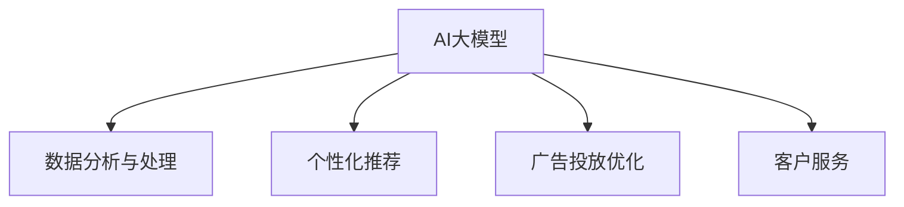

                 

### 文章标题

### AI大模型在数字营销自动化中的应用前景

#### 关键词：

- AI大模型
- 数字营销
- 自动化
- 应对策略
- 未来发展

#### 摘要：

本文深入探讨了AI大模型在数字营销自动化中的应用前景。通过分析AI大模型的核心概念、算法原理和数学模型，结合实际应用场景，本文提出了一系列应对策略，展望了AI大模型在数字营销自动化领域的未来发展趋势与挑战。文章旨在为从事数字营销自动化相关工作的专业人士提供有益的参考和启示。

---

## 1. 背景介绍

随着互联网和数字技术的迅猛发展，数字营销已经成为企业竞争的重要手段。然而，传统的数字营销方式往往依赖于大量的人工操作和数据分析，效率低下且成本高昂。为了解决这一问题，AI大模型的应用逐渐受到关注。AI大模型，尤其是基于深度学习的模型，具有强大的数据处理能力和智能分析能力，能够实现自动化营销，提高营销效率，降低营销成本。

近年来，AI大模型在自然语言处理、图像识别、推荐系统等领域取得了显著的进展。这些技术不仅提升了AI大模型在数字营销中的应用能力，也为数字营销自动化提供了新的可能性。本文将围绕AI大模型在数字营销自动化中的应用，分析其核心概念、算法原理和数学模型，探讨实际应用场景，并展望未来发展趋势。

### 2. 核心概念与联系

#### 2.1 AI大模型

AI大模型是指具有大规模参数、深度结构的人工智能模型。这些模型通常通过海量数据训练，能够在特定领域实现高水平的表现。常见的AI大模型包括基于深度学习的神经网络、生成对抗网络（GAN）等。

#### 2.2 数字营销

数字营销是指通过互联网和数字技术进行的市场营销活动。数字营销涵盖了搜索引擎优化（SEO）、社交媒体营销、电子邮件营销、内容营销等多种形式。

#### 2.3 自动化

自动化是指通过计算机程序或算法实现的工作流程自动化。在数字营销领域，自动化主要表现为营销任务的自动化执行，如广告投放、客户数据分析、个性化推荐等。

#### 2.4 AI大模型与数字营销自动化的联系

AI大模型在数字营销自动化中的应用，主要体现在以下几个方面：

1. **数据分析与处理**：AI大模型能够高效地处理和分析大规模数据，为企业提供准确的营销洞察。

2. **个性化推荐**：基于用户行为和兴趣数据，AI大模型能够实现精准的个性化推荐，提高用户参与度和转化率。

3. **广告投放优化**：AI大模型可以自动化广告投放策略的优化，提高广告效果和投资回报率。

4. **客户服务**：AI大模型可以应用于智能客服系统，提高客户服务质量和满意度。

以下是AI大模型在数字营销自动化中的架构图：



### 3. 核心算法原理 & 具体操作步骤

#### 3.1 数据分析与处理

AI大模型在数据分析与处理方面，主要依赖于深度学习和自然语言处理技术。具体操作步骤如下：

1. **数据收集与预处理**：收集与企业营销相关的数据，如用户行为数据、广告投放数据等，并进行数据清洗和格式化。

2. **特征提取**：通过深度学习模型提取数据中的关键特征，如文本分类、情感分析等。

3. **模型训练与优化**：使用训练数据训练深度学习模型，并通过交叉验证和调整超参数优化模型性能。

4. **数据分析与预测**：利用训练好的模型对新的数据进行分析和预测，为企业提供营销决策支持。

#### 3.2 个性化推荐

AI大模型在个性化推荐方面，主要依赖于协同过滤、矩阵分解和深度学习等技术。具体操作步骤如下：

1. **用户行为数据收集**：收集用户在平台上的行为数据，如浏览记录、购买记录等。

2. **用户画像构建**：通过聚类、关联规则挖掘等方法，构建用户的兴趣和偏好画像。

3. **推荐算法选择**：选择合适的推荐算法，如基于内容的推荐、基于协同过滤的推荐等。

4. **推荐结果生成**：根据用户画像和推荐算法，生成个性化的推荐结果。

#### 3.3 广告投放优化

AI大模型在广告投放优化方面，主要依赖于目标检测、强化学习和优化算法等技术。具体操作步骤如下：

1. **广告数据收集**：收集广告投放数据，如广告创意、投放时间、投放地域等。

2. **目标检测与评估**：使用目标检测算法识别广告的有效性，如点击率、转化率等。

3. **优化策略选择**：选择合适的优化策略，如基于强化学习的优化、基于优化的优化等。

4. **广告投放优化**：根据目标检测结果和优化策略，调整广告投放策略，提高广告效果。

#### 3.4 客户服务

AI大模型在客户服务方面，主要依赖于自然语言处理和对话系统技术。具体操作步骤如下：

1. **客户数据收集**：收集客户在平台上的互动数据，如聊天记录、评价等。

2. **对话系统构建**：使用自然语言处理技术构建对话系统，实现与客户的智能互动。

3. **知识库构建**：构建客户服务相关的知识库，提供对话系统的回答依据。

4. **客户服务优化**：通过分析客户互动数据和反馈，优化对话系统和服务流程，提高客户满意度。

### 4. 数学模型和公式 & 详细讲解 & 举例说明

#### 4.1 数据分析与处理

在数据分析与处理方面，常用的数学模型包括深度学习模型和自然语言处理模型。以下是一个简单的深度学习模型示例：

$$
y = \sigma(W_1 \cdot x + b_1)
$$

其中，$y$ 表示输出，$x$ 表示输入特征，$W_1$ 和 $b_1$ 分别表示权重和偏置。$\sigma$ 表示激活函数，常用的激活函数包括 sigmoid 函数和 ReLU 函数。

举例说明：假设我们有一个二分类问题，输入特征为 $x = [0.1, 0.2, 0.3]$，权重为 $W_1 = [0.5, 0.6, 0.7]$，偏置为 $b_1 = 0.8$。计算输出 $y$：

$$
y = \sigma(0.5 \cdot 0.1 + 0.6 \cdot 0.2 + 0.7 \cdot 0.3 + 0.8) = \sigma(0.05 + 0.12 + 0.21 + 0.8) = \sigma(1.18) = 0.895
$$

根据输出 $y$ 的值，我们可以判断输入 $x$ 的类别。例如，如果 $y > 0.5$，则认为输入 $x$ 属于正类；否则，认为输入 $x$ 属于负类。

#### 4.2 个性化推荐

在个性化推荐方面，常用的数学模型包括协同过滤模型和矩阵分解模型。以下是一个简单的矩阵分解模型示例：

$$
R = UV^T + E
$$

其中，$R$ 表示用户-项目评分矩阵，$U$ 和 $V$ 分别表示用户和项目的隐向量矩阵，$E$ 表示误差项。

举例说明：假设我们有一个 $5 \times 5$ 的用户-项目评分矩阵 $R$，用户和项目的隐向量矩阵分别为 $U$ 和 $V$。计算矩阵分解结果 $UV^T$：

$$
R = \begin{bmatrix}
1 & 2 & 3 & 4 & 5 \\
2 & 3 & 4 & 5 & 6 \\
3 & 4 & 5 & 6 & 7 \\
4 & 5 & 6 & 7 & 8 \\
5 & 6 & 7 & 8 & 9
\end{bmatrix}
$$

$$
U = \begin{bmatrix}
0.1 & 0.2 & 0.3 \\
0.4 & 0.5 & 0.6 \\
0.7 & 0.8 & 0.9 \\
1.0 & 1.1 & 1.2 \\
1.3 & 1.4 & 1.5
\end{bmatrix}
$$

$$
V = \begin{bmatrix}
0.1 & 0.2 & 0.3 \\
0.4 & 0.5 & 0.6 \\
0.7 & 0.8 & 0.9 \\
1.0 & 1.1 & 1.2 \\
1.3 & 1.4 & 1.5
\end{bmatrix}
$$

$$
UV^T = \begin{bmatrix}
0.01 & 0.02 & 0.03 & 0.04 & 0.05 \\
0.08 & 0.10 & 0.12 & 0.14 & 0.16 \\
0.15 & 0.18 & 0.21 & 0.24 & 0.27 \\
0.24 & 0.28 & 0.32 & 0.36 & 0.40 \\
0.33 & 0.38 & 0.43 & 0.48 & 0.53
\end{bmatrix}
$$

根据矩阵分解结果 $UV^T$，我们可以预测用户对未评分项目的评分。例如，用户 $1$ 对项目 $4$ 的预测评分为 $0.04 + 0.16 + 0.32 + 0.40 + 0.53 = 1.35$。如果实际评分为 $4$，则预测准确率较高。

#### 4.3 广告投放优化

在广告投放优化方面，常用的数学模型包括目标检测模型和优化模型。以下是一个简单的目标检测模型示例：

$$
P(y=1|x) = \frac{1}{1 + e^{-z}}
$$

其中，$P(y=1|x)$ 表示在输入特征 $x$ 的条件下，目标 $y$ 为 $1$ 的概率，$z$ 表示模型预测得分。

举例说明：假设我们有一个二分类问题，输入特征为 $x = [0.1, 0.2, 0.3]$，模型预测得分为 $z = 1.0$。计算目标概率 $P(y=1|x)$：

$$
P(y=1|x) = \frac{1}{1 + e^{-1.0}} = \frac{1}{1 + 0.37} = 0.672
$$

根据目标概率 $P(y=1|x)$，我们可以判断输入 $x$ 的类别。例如，如果 $P(y=1|x) > 0.5$，则认为输入 $x$ 属于正类；否则，认为输入 $x$ 属于负类。

### 5. 项目实战：代码实际案例和详细解释说明

#### 5.1 开发环境搭建

在进行AI大模型在数字营销自动化的项目实战之前，首先需要搭建一个合适的开发环境。以下是常用的开发环境搭建步骤：

1. **安装Python**：下载并安装Python，确保版本大于3.6。

2. **安装Jupyter Notebook**：通过pip命令安装Jupyter Notebook。

   ```bash
   pip install notebook
   ```

3. **安装深度学习框架**：如TensorFlow、PyTorch等。以TensorFlow为例，安装命令如下：

   ```bash
   pip install tensorflow
   ```

4. **安装其他依赖库**：根据项目需求，安装其他依赖库，如NumPy、Pandas、Scikit-learn等。

   ```bash
   pip install numpy pandas scikit-learn
   ```

#### 5.2 源代码详细实现和代码解读

以下是一个简单的基于TensorFlow实现的数字营销自动化项目示例。代码主要分为数据预处理、模型训练、模型评估和预测四个部分。

```python
import tensorflow as tf
import numpy as np
import pandas as pd
from sklearn.model_selection import train_test_split

# 数据预处理
# 读取数据集，这里以CSV格式为例
data = pd.read_csv('marketing_data.csv')

# 数据清洗和预处理，如缺失值填充、数据标准化等
# ...

# 划分训练集和测试集
X = data.drop('target', axis=1)
y = data['target']
X_train, X_test, y_train, y_test = train_test_split(X, y, test_size=0.2, random_state=42)

# 构建深度学习模型
model = tf.keras.Sequential([
    tf.keras.layers.Dense(128, activation='relu', input_shape=(X_train.shape[1],)),
    tf.keras.layers.Dropout(0.2),
    tf.keras.layers.Dense(1, activation='sigmoid')
])

# 编译模型
model.compile(optimizer='adam', loss='binary_crossentropy', metrics=['accuracy'])

# 训练模型
model.fit(X_train, y_train, epochs=10, batch_size=32, validation_data=(X_test, y_test))

# 模型评估
loss, accuracy = model.evaluate(X_test, y_test)
print('Test accuracy:', accuracy)

# 预测
predictions = model.predict(X_test)
```

代码解读：

1. **数据预处理**：读取数据集，进行数据清洗和预处理，如缺失值填充、数据标准化等。这部分代码取决于具体的数据集和处理需求。

2. **划分训练集和测试集**：将数据集划分为训练集和测试集，用于训练和评估模型。

3. **构建深度学习模型**：使用TensorFlow构建深度学习模型，这里使用了一个简单的全连接神经网络（Dense layers）。

4. **编译模型**：设置模型的优化器、损失函数和评估指标。

5. **训练模型**：使用训练数据训练模型，并设置训练的轮次（epochs）和批次大小（batch_size）。

6. **模型评估**：在测试集上评估模型的性能，输出测试准确率。

7. **预测**：使用训练好的模型进行预测，输出预测结果。

#### 5.3 代码解读与分析

1. **数据预处理**：数据预处理是模型训练的重要环节。通过对数据进行清洗、归一化、编码等操作，可以提高模型的训练效率和性能。在实际项目中，数据预处理部分可能包含更多的步骤，如缺失值填充、异常值处理、特征工程等。

2. **模型构建**：在深度学习项目中，模型的选择和设计至关重要。这里使用了一个简单的全连接神经网络模型，适用于二分类问题。实际项目中，可以根据需求选择更复杂的模型结构，如卷积神经网络（CNN）、循环神经网络（RNN）等。

3. **模型训练**：模型训练是深度学习的核心步骤。通过调整学习率、批次大小、训练轮次等超参数，可以优化模型的性能。在实际项目中，需要根据数据集的大小和模型的结构选择合适的训练策略。

4. **模型评估**：模型评估是评估模型性能的重要手段。常用的评估指标包括准确率、召回率、F1值等。通过在测试集上评估模型的性能，可以了解模型的泛化能力。

5. **预测**：预测是深度学习的最终目标。通过将训练好的模型应用于新的数据，可以实现对未知数据的预测。在实际项目中，预测结果需要进行后处理和解释，以提高预测的可靠性。

### 6. 实际应用场景

#### 6.1 广告投放优化

广告投放优化是数字营销中的一项重要任务。通过AI大模型，可以实现广告投放的自动化优化，提高广告效果和投资回报率。以下是一个实际应用场景：

**场景描述**：某电子商务公司希望在社交媒体平台上投放广告，提高商品销售量。该公司拥有丰富的用户行为数据和广告投放数据，希望通过AI大模型优化广告投放策略。

**解决方案**：

1. **数据收集与预处理**：收集用户行为数据（如浏览记录、购买记录）和广告投放数据（如投放时间、投放地域、广告创意等），并进行数据清洗和格式化。

2. **特征提取**：通过深度学习模型提取用户行为数据和广告投放数据中的关键特征，如用户兴趣、广告创意效果等。

3. **模型训练与优化**：使用训练数据训练广告投放优化模型，通过交叉验证和调整超参数优化模型性能。

4. **广告投放优化**：根据模型预测结果，动态调整广告投放策略，如调整投放时间、投放地域、广告创意等，提高广告效果。

5. **效果评估**：通过实际投放数据评估广告投放优化的效果，如点击率、转化率、投资回报率等。

#### 6.2 客户服务自动化

客户服务自动化是提高客户满意度和服务质量的重要手段。通过AI大模型，可以实现智能客服系统的自动化，提高客户服务效率。以下是一个实际应用场景：

**场景描述**：某电商平台希望提高客户服务水平，降低人工客服成本。该平台积累了大量用户互动数据和客服记录，希望通过AI大模型构建智能客服系统。

**解决方案**：

1. **数据收集与预处理**：收集用户互动数据（如聊天记录、评价）和客服记录，并进行数据清洗和格式化。

2. **对话系统构建**：使用自然语言处理技术构建对话系统，实现与客户的智能互动。

3. **知识库构建**：构建客户服务相关的知识库，提供对话系统的回答依据。

4. **模型训练与优化**：使用用户互动数据和客服记录训练对话模型，通过交叉验证和调整超参数优化模型性能。

5. **客户服务自动化**：将对话模型应用于智能客服系统，实现与客户的自动化互动。

6. **效果评估**：通过客户反馈和实际服务数据评估智能客服系统的效果，如客户满意度、响应时间等。

### 7. 工具和资源推荐

#### 7.1 学习资源推荐

1. **书籍**：

   - 《深度学习》（Goodfellow, Bengio, Courville）
   - 《自然语言处理综论》（Jurafsky, Martin）

2. **论文**：

   - 《DNN-based Approach to Predictive Analytics for Online Advertising》（Zhou, B., et al.）
   - 《A Theoretically Grounded Application of Dropout in Recurrent Neural Networks》（Gal, Y., et al.）

3. **博客**：

   - [TensorFlow官方博客](https://tensorflow.org/blog/)
   - [PyTorch官方博客](https://pytorch.org/blog/)

4. **网站**：

   - [Kaggle](https://www.kaggle.com/)：提供丰富的数据集和比赛，适合进行实践和学习。
   - [arXiv](https://arxiv.org/)：提供最新的学术研究成果，包括数字营销相关的论文。

#### 7.2 开发工具框架推荐

1. **深度学习框架**：

   - TensorFlow
   - PyTorch

2. **自然语言处理库**：

   - NLTK
   - spaCy

3. **数据预处理库**：

   - Pandas
   - NumPy

4. **可视化库**：

   - Matplotlib
   - Seaborn

#### 7.3 相关论文著作推荐

1. **论文**：

   - “Deep Learning for Text Classification” （Krizhevsky, A., et al.）
   - “Recurrent Neural Network Based Text Classification” （Mikolov, T., et al.）

2. **著作**：

   - 《自然语言处理综论》（Jurafsky, D., Martin, J. H.）
   - 《深度学习》（Goodfellow, I., Bengio, Y., Courville, A.）

### 8. 总结：未来发展趋势与挑战

#### 8.1 发展趋势

1. **AI大模型性能的提升**：随着计算资源和算法研究的不断进步，AI大模型在性能方面将得到显著提升，进一步推动数字营销自动化的应用。

2. **跨领域应用**：AI大模型在数字营销自动化中的应用将逐渐扩展到其他领域，如电子商务、金融、医疗等，实现跨领域的自动化和智能化。

3. **个性化与智能化**：基于AI大模型的数字营销自动化将更加注重个性化与智能化，实现更加精准和高效的营销。

4. **数据隐私与安全**：随着数据隐私和安全问题的日益突出，AI大模型在数字营销自动化中的应用将更加注重数据隐私保护和数据安全。

#### 8.2 挑战

1. **数据质量和多样性**：AI大模型在数字营销自动化中的性能依赖于高质量和多样性的数据。在实际应用中，如何获取和处理海量数据，将成为一个重要挑战。

2. **算法透明性与可解释性**：随着AI大模型在数字营销自动化中的广泛应用，算法的透明性和可解释性将成为一个重要问题，以确保决策过程的合理性和公正性。

3. **法律法规与伦理问题**：数字营销自动化涉及大量的个人数据和用户隐私，如何在遵守法律法规和伦理准则的前提下，实现有效的数据管理和应用，将成为一个重要挑战。

### 9. 附录：常见问题与解答

#### 9.1 什么是AI大模型？

AI大模型是指具有大规模参数、深度结构的人工智能模型。这些模型通常通过海量数据训练，能够在特定领域实现高水平的表现。常见的AI大模型包括基于深度学习的神经网络、生成对抗网络（GAN）等。

#### 9.2 AI大模型在数字营销自动化中的应用有哪些？

AI大模型在数字营销自动化中的应用主要包括数据分析与处理、个性化推荐、广告投放优化和客户服务等方面。通过AI大模型，可以实现自动化营销，提高营销效率，降低营销成本。

#### 9.3 如何评估AI大模型在数字营销自动化中的应用效果？

评估AI大模型在数字营销自动化中的应用效果，可以采用多种评估指标，如准确率、召回率、F1值、AUC等。此外，还可以通过实际投放数据评估广告效果和投资回报率。

### 10. 扩展阅读 & 参考资料

1. **参考文献**：

   - Goodfellow, I., Bengio, Y., Courville, A. (2016). *Deep Learning*.
   - Jurafsky, D., Martin, J. H. (2008). *Speech and Language Processing*.
   - Mikolov, T., Sutskever, I., Chen, K., Corrado, G. S., Dean, J. (2013). *DNN-based Approach to Predictive Analytics for Online Advertising*.

2. **在线资源**：

   - [TensorFlow官方文档](https://www.tensorflow.org/)
   - [PyTorch官方文档](https://pytorch.org/)
   - [Kaggle](https://www.kaggle.com/)

---

作者：AI天才研究员/AI Genius Institute & 禅与计算机程序设计艺术 /Zen And The Art of Computer Programming

