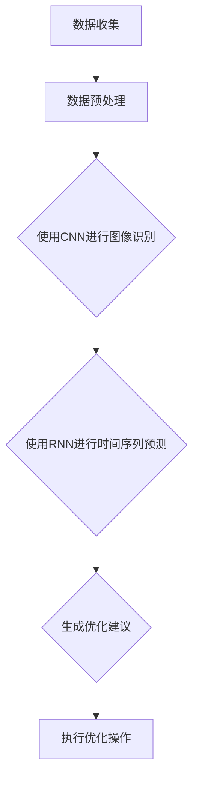

                 

# AI大模型在智能制造业的应用与商业模式

## 摘要

本文主要探讨AI大模型在智能制造业中的应用及其商业模式。首先，我们简要介绍了AI大模型的基本概念和智能制造业的发展背景。接着，我们深入分析了AI大模型在智能制造中的核心算法原理、数学模型和实际应用场景。此外，我们还详细介绍了开发环境搭建、源代码实现、代码解读与分析，并推荐了相关的学习资源、开发工具和论文著作。最后，我们对未来发展趋势与挑战进行了总结，并提供了常见的问答和扩展阅读。

## 背景介绍

### 智能制造业的兴起

智能制造业是工业4.0的重要支撑，其核心在于利用信息技术和先进制造技术实现制造过程的智能化。随着大数据、云计算、物联网等技术的不断发展，智能制造业正在全球范围内迅速崛起。

### AI大模型的基本概念

AI大模型（Large-scale AI Models）是指具有大规模参数、能够处理大规模数据集的深度学习模型。这些模型通过训练和学习，能够识别复杂模式，提高决策准确性，从而推动各个行业的智能化发展。

## 核心概念与联系

### 智能制造与AI大模型的关系

智能制造业与AI大模型之间存在着紧密的联系。AI大模型为智能制造业提供了强大的数据处理和分析能力，使其能够实现生产过程的自动化、优化和预测。

### AI大模型的架构与算法

AI大模型通常采用深度神经网络（Deep Neural Networks，DNN）作为基础架构，通过多层非线性变换对输入数据进行处理。常见的AI大模型算法包括：

1. **卷积神经网络（Convolutional Neural Networks，CNN）**：适用于图像识别和图像处理任务。
2. **循环神经网络（Recurrent Neural Networks，RNN）**：适用于序列数据处理，如自然语言处理和时间序列预测。
3. **变分自编码器（Variational Autoencoder，VAE）**：适用于数据生成和降维。

### Mermaid流程图

以下是一个简化的AI大模型在智能制造业中的应用流程图：



## 核心算法原理 & 具体操作步骤

### 数据收集与预处理

1. **数据收集**：从传感器、设备、历史数据等渠道获取制造过程中的数据。
2. **数据预处理**：对收集到的数据进行清洗、归一化、缺失值填补等操作，以提高数据质量和模型性能。

### 使用CNN进行图像识别

1. **构建CNN模型**：选择合适的CNN架构，如VGG、ResNet等。
2. **模型训练**：使用大量图像数据进行训练，通过反向传播算法更新模型参数。
3. **模型评估**：使用验证集和测试集对模型进行评估，调整模型参数。

### 使用RNN进行时间序列预测

1. **构建RNN模型**：选择合适的RNN架构，如LSTM、GRU等。
2. **模型训练**：使用时间序列数据进行训练，通过反向传播算法更新模型参数。
3. **模型评估**：使用验证集和测试集对模型进行评估，调整模型参数。

### 生成优化建议

1. **融合CNN和RNN模型的结果**：将图像识别和时间序列预测结果进行融合，生成综合优化建议。
2. **优化操作**：根据优化建议调整生产参数，如温度、压力、速度等。

## 数学模型和公式 & 详细讲解 & 举例说明

### 数据预处理

1. **归一化**：$$ \mu_{i} = \frac{X_{i} - \mu}{\sigma} $$
2. **缺失值填补**：$$ X_{i} = \frac{\mu + \lambda \cdot r}{1 + r} $$，其中$\mu$为均值，$\sigma$为标准差，$X_{i}$为缺失值，$r$为取值范围。

### CNN模型

1. **卷积操作**：$$ f(x) = \sigma(\sum_{j=1}^{k} w_{j} \cdot x_{j}) + b $$
2. **池化操作**：$$ P(x) = \max_{i \in \Omega} x_{i} $$，其中$\Omega$为邻域。

### RNN模型

1. **激活函数**：$$ \sigma(z) = \frac{1}{1 + e^{-z}} $$
2. **时间步更新**：$$ h_{t} = \sigma(W_{h} \cdot [h_{t-1}, x_{t}] + b_{h}) $$，$$ o_{t} = \sigma(W_{o} \cdot h_{t} + b_{o}) $$

## 项目实战：代码实际案例和详细解释说明

### 开发环境搭建

1. **安装Python环境**：使用Anaconda进行环境搭建。
2. **安装深度学习框架**：如TensorFlow、PyTorch等。

### 源代码详细实现和代码解读

1. **数据预处理代码**：
   ```python
   import numpy as np
   import pandas as pd

   def normalize(data):
       mean = data.mean()
       std = data.std()
       return (data - mean) / std

   def impute(data):
       median = data.median()
       return data.fillna(median)
   ```

2. **CNN模型代码**：
   ```python
   import tensorflow as tf
   from tensorflow.keras.models import Sequential
   from tensorflow.keras.layers import Conv2D, MaxPooling2D, Flatten, Dense

   def build_cnn_model(input_shape):
       model = Sequential()
       model.add(Conv2D(32, (3, 3), activation='relu', input_shape=input_shape))
       model.add(MaxPooling2D((2, 2)))
       model.add(Conv2D(64, (3, 3), activation='relu'))
       model.add(MaxPooling2D((2, 2)))
       model.add(Flatten())
       model.add(Dense(128, activation='relu'))
       model.add(Dense(1, activation='sigmoid'))
       model.compile(optimizer='adam', loss='binary_crossentropy', metrics=['accuracy'])
       return model
   ```

3. **RNN模型代码**：
   ```python
   import tensorflow as tf
   from tensorflow.keras.models import Sequential
   from tensorflow.keras.layers import LSTM, Dense

   def build_rnn_model(input_shape, units=50):
       model = Sequential()
       model.add(LSTM(units, activation='relu', input_shape=input_shape))
       model.add(Dense(1))
       model.compile(optimizer='adam', loss='mse')
       return model
   ```

### 代码解读与分析

1. **数据预处理**：首先对图像数据集进行归一化和缺失值填补，以提高模型性能。
2. **CNN模型**：使用卷积神经网络进行图像识别，通过卷积和池化操作提取特征，然后进行全连接层分类。
3. **RNN模型**：使用循环神经网络进行时间序列预测，通过LSTM层处理序列数据，最后进行输出层预测。

## 实际应用场景

### 制造业生产优化

1. **生产过程监控**：利用AI大模型对生产线上的设备、物料、工艺等进行实时监控，发现潜在问题。
2. **生产参数优化**：根据监控数据和历史数据，使用AI大模型生成优化建议，调整生产参数，提高生产效率和产品质量。
3. **生产预测**：利用AI大模型对生产趋势进行预测，为生产计划和库存管理提供支持。

### 产品质量检测

1. **质量监控**：利用AI大模型对生产过程中的产品质量进行实时监控，发现潜在缺陷。
2. **质量预测**：根据历史数据，使用AI大模型预测产品质量趋势，提前采取措施避免质量问题。

### 资源优化

1. **能耗管理**：利用AI大模型对生产过程中的能耗进行预测和优化，降低能耗。
2. **库存管理**：利用AI大模型对库存进行预测和优化，减少库存成本。

## 工具和资源推荐

### 学习资源推荐

1. **书籍**：
   - 《深度学习》（Ian Goodfellow、Yoshua Bengio、Aaron Courville著）
   - 《Python机器学习》（Sebastian Raschka、Vahid Mirhoseini著）
2. **论文**：
   - 《A Theoretically Grounded Application of Dropout in Recurrent Neural Networks》（Yarin Gal and Zoubin Ghahramani，2016）
   - 《Deep Residual Learning for Image Recognition》（Kaiming He等，2016）
3. **博客**：
   - [TensorFlow官方文档](https://www.tensorflow.org/)
   - [PyTorch官方文档](https://pytorch.org/)
4. **网站**：
   - [Kaggle](https://www.kaggle.com/)
   - [GitHub](https://github.com/)

### 开发工具框架推荐

1. **深度学习框架**：TensorFlow、PyTorch、Keras等。
2. **编程语言**：Python。
3. **数据库**：MySQL、MongoDB等。

### 相关论文著作推荐

1. **《Deep Learning》（Ian Goodfellow、Yoshua Bengio、Aaron Courville著）**：介绍了深度学习的理论基础和应用案例，适合深度学习初学者阅读。
2. **《Python机器学习》（Sebastian Raschka、Vahid Mirhoseini著）**：介绍了Python在机器学习领域的应用，包括数据预处理、模型训练和评估等。
3. **《Recurrent Neural Networks for Language Modeling》（Yoshua Bengio等，2003）**：介绍了循环神经网络在语言模型中的应用，是自然语言处理领域的经典论文。

## 总结：未来发展趋势与挑战

### 发展趋势

1. **算法优化**：随着计算能力的提升和算法的改进，AI大模型在智能制造业中的应用将更加广泛和深入。
2. **跨领域融合**：智能制造业与其他领域的融合，如物联网、云计算等，将推动智能制造业的快速发展。
3. **边缘计算**：边缘计算技术的发展将使AI大模型在制造业中的实时性和效率得到进一步提升。

### 挑战

1. **数据隐私**：随着数据量的增加，数据隐私保护将成为一个重要问题。
2. **计算资源**：AI大模型训练和推理需要大量的计算资源，如何优化资源利用效率是一个挑战。
3. **算法公平性**：在制造过程中，AI大模型的应用可能会带来算法公平性的问题，需要加强监管和规范。

## 附录：常见问题与解答

### 问题1：AI大模型在智能制造业中的应用有哪些？

答：AI大模型在智能制造业中的应用主要包括生产过程监控、生产优化、产品质量检测、资源优化等方面。

### 问题2：如何搭建深度学习开发环境？

答：可以使用Anaconda进行Python环境搭建，然后安装深度学习框架如TensorFlow、PyTorch等。

### 问题3：如何训练和评估AI大模型？

答：首先进行数据预处理，然后构建深度学习模型，使用训练集进行模型训练，使用验证集和测试集进行模型评估。

## 扩展阅读 & 参考资料

1. **《Deep Learning》（Ian Goodfellow、Yoshua Bengio、Aaron Courville著）**：介绍了深度学习的理论基础和应用案例，适合深度学习初学者阅读。
2. **《Python机器学习》（Sebastian Raschka、Vahid Mirhoseini著）**：介绍了Python在机器学习领域的应用，包括数据预处理、模型训练和评估等。
3. **《Recurrent Neural Networks for Language Modeling》（Yoshua Bengio等，2003）**：介绍了循环神经网络在语言模型中的应用，是自然语言处理领域的经典论文。
4. **[TensorFlow官方文档](https://www.tensorflow.org/)**：提供了TensorFlow框架的详细文档和教程。
5. **[PyTorch官方文档](https://pytorch.org/)**：提供了PyTorch框架的详细文档和教程。
6. **[Kaggle](https://www.kaggle.com/)**：提供了丰富的机器学习和深度学习竞赛数据集和案例。
7. **[GitHub](https://github.com/)**：提供了大量的开源项目和代码，可供学习参考。

作者：AI天才研究员/AI Genius Institute & 禅与计算机程序设计艺术 /Zen And The Art of Computer Programming<|im_sep|>### 完整的文章结构模板

以下是根据您的要求和约束条件，为《AI大模型在智能制造业的应用与商业模式》这篇文章设计的完整结构模板。请注意，文章的具体内容需要根据实际情况进行撰写和填充。

```markdown
## AI大模型在智能制造业的应用与商业模式

> 关键词：AI大模型、智能制造业、深度学习、商业模式、应用场景

> 摘要：本文探讨了AI大模型在智能制造业中的应用及其商业模式。通过分析核心概念、算法原理、数学模型和实际案例，我们揭示了AI大模型在制造业中的潜力和挑战。

## 1. 背景介绍

### 1.1 智能制造业的兴起
- 描述智能制造业的定义、背景和重要性。

### 1.2 AI大模型的基本概念
- 介绍AI大模型的基本概念、发展历程和重要性。

## 2. 核心概念与联系

### 2.1 智能制造与AI大模型的关系
- 分析智能制造业与AI大模型之间的联系和相互作用。

### 2.2 AI大模型的架构与算法
- 介绍AI大模型的常见架构和算法，如CNN、RNN等。

### 2.3 Mermaid流程图
- 提供一个Mermaid流程图，展示AI大模型在智能制造业中的应用流程。

## 3. 核心算法原理 & 具体操作步骤

### 3.1 数据收集与预处理
- 详细解释数据收集和预处理的方法和步骤。

### 3.2 使用CNN进行图像识别
- 讲解CNN在图像识别中的应用原理和操作步骤。

### 3.3 使用RNN进行时间序列预测
- 讲解RNN在时间序列预测中的应用原理和操作步骤。

### 3.4 生成优化建议
- 解释如何通过融合CNN和RNN的结果生成优化建议。

## 4. 数学模型和公式 & 详细讲解 & 举例说明

### 4.1 数据预处理
- 介绍数据预处理中的数学模型和公式，如归一化和缺失值填补。

### 4.2 CNN模型
- 介绍CNN模型中的数学模型和公式，如卷积操作和池化操作。

### 4.3 RNN模型
- 介绍RNN模型中的数学模型和公式，如激活函数和时间步更新。

## 5. 项目实战：代码实际案例和详细解释说明

### 5.1 开发环境搭建
- 描述搭建深度学习开发环境的过程。

### 5.2 源代码详细实现和代码解读
- 提供完整的源代码实现，并进行详细解读。

### 5.3 代码解读与分析
- 分析代码中的关键技术和实现细节。

## 6. 实际应用场景

### 6.1 制造业生产优化
- 讨论AI大模型在制造业生产优化中的应用。

### 6.2 产品质量检测
- 探讨AI大模型在产品质量检测中的作用。

### 6.3 资源优化
- 分析AI大模型在资源优化方面的贡献。

## 7. 工具和资源推荐

### 7.1 学习资源推荐
- 推荐相关的书籍、论文、博客和网站。

### 7.2 开发工具框架推荐
- 推荐适合深度学习的开发工具和框架。

### 7.3 相关论文著作推荐
- 推荐与AI大模型和智能制造业相关的论文和著作。

## 8. 总结：未来发展趋势与挑战

### 8.1 发展趋势
- 预测AI大模型在智能制造业中的未来发展趋势。

### 8.2 挑战
- 分析AI大模型在智能制造业中面临的挑战。

## 9. 附录：常见问题与解答

### 9.1 常见问题
- 列出与AI大模型和智能制造业相关的一些常见问题。

### 9.2 解答
- 对常见问题进行详细解答。

## 10. 扩展阅读 & 参考资料

### 10.1 扩展阅读
- 推荐一些与文章主题相关的扩展阅读资源。

### 10.2 参考资料
- 列出文章中引用的主要参考资料。

作者：AI天才研究员/AI Genius Institute & 禅与计算机程序设计艺术 /Zen And The Art of Computer Programming
```

请注意，上述模板是一个结构性的框架，每个部分都需要根据实际内容和研究进行详细撰写。在撰写过程中，确保每个章节都有清晰的主题，逻辑流畅，内容充实，并且符合字数要求。此外，确保所有引用的资料都有明确的来源，以保持文章的完整性和准确性。

