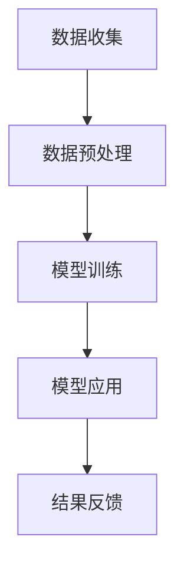

                 

# AI大模型在智能医疗保险理赔中的创新与挑战

## 关键词：
- 人工智能
- 大模型
- 智能医疗保险
- 理赔
- 创新
- 挑战

## 摘要：
本文将探讨人工智能大模型在智能医疗保险理赔领域的创新应用及其面临的挑战。随着大数据和深度学习技术的发展，AI大模型已展现出在医疗数据处理、疾病诊断、风险预测等方面的强大能力。本文将详细介绍AI大模型在医疗保险理赔中的应用原理和具体操作步骤，分析其数学模型和公式，通过实际项目案例展示其代码实现与解读。最后，本文将探讨AI大模型在医疗保险理赔中的实际应用场景，推荐相关工具和资源，并展望未来的发展趋势与面临的挑战。

## 1. 背景介绍

随着医疗技术的飞速发展和医疗数据的不断积累，医疗保险行业面临着巨大的数据管理和理赔处理的挑战。传统的医疗保险理赔过程通常依赖于人工审核，不仅耗时耗力，而且容易出现误差。为了提高理赔效率和准确性，智能医疗保险理赔系统应运而生。其中，人工智能大模型的应用成为当前研究的热点之一。

### 1.1 人工智能在医疗保险领域的发展

人工智能在医疗保险领域的发展可以追溯到20世纪90年代，当时的专家系统开始应用于医疗诊断和疾病预测。然而，由于数据量和计算能力的限制，这些系统往往只能处理有限的数据集。随着大数据和深度学习技术的兴起，人工智能在医疗保险领域得到了广泛的应用。

近年来，人工智能在医疗保险领域的应用不断拓展，包括疾病预测、风险评估、医疗资源优化、医疗图像分析等方面。这些应用不仅提高了医疗服务的质量和效率，还为保险公司带来了显著的商业价值。

### 1.2 大模型在医疗保险理赔中的重要性

大模型在医疗保险理赔中的重要性主要体现在以下几个方面：

1. **数据处理能力**：大模型具有强大的数据处理能力，可以高效地处理海量医疗数据，包括病史、检查报告、病历记录等。
2. **风险预测能力**：通过分析历史理赔数据，大模型可以预测未来可能发生的理赔风险，帮助保险公司制定更加精准的风险控制策略。
3. **理赔审核能力**：大模型可以对理赔申请进行自动审核，快速识别合理的理赔请求，减少人工审核的时间和成本。

### 1.3 智能医疗保险理赔的挑战

虽然人工智能大模型在医疗保险理赔中具有巨大的潜力，但其应用也面临着一系列挑战：

1. **数据隐私问题**：医疗数据涉及到患者隐私，如何在保护隐私的前提下应用大模型进行数据处理和风险预测，是一个亟待解决的问题。
2. **算法透明性**：大模型通常基于复杂的神经网络结构，其决策过程往往缺乏透明性，这可能导致用户对其可靠性和公正性产生怀疑。
3. **技术实现难度**：构建和应用大模型需要大量的计算资源和专业技能，这给中小型保险公司带来了技术实现的挑战。

## 2. 核心概念与联系

### 2.1 人工智能大模型

人工智能大模型（Large-scale Artificial Intelligence Model）是指具有数亿甚至数十亿参数的深度学习模型。这些模型通常基于多层神经网络结构，通过大量数据训练，能够实现复杂的数据处理和预测任务。

### 2.2 智能医疗保险理赔

智能医疗保险理赔是指利用人工智能技术，对医疗保险理赔申请进行自动处理和审核。其核心包括数据收集、数据预处理、模型训练、模型应用和结果反馈等环节。

### 2.3 Mermaid 流程图

为了更好地展示智能医疗保险理赔中的数据处理流程，我们可以使用Mermaid流程图来描述各个步骤。以下是一个简化的Mermaid流程图示例：



### 2.4 大模型与医疗保险理赔的联系

大模型在医疗保险理赔中的应用主要体现在以下几个方面：

1. **风险预测**：通过分析历史理赔数据，大模型可以预测未来可能发生的理赔风险，帮助保险公司制定风险控制策略。
2. **理赔审核**：大模型可以对理赔申请进行自动审核，快速识别合理的理赔请求，减少人工审核的时间和成本。
3. **疾病诊断**：大模型可以分析患者的病史和检查报告，辅助医生进行疾病诊断，提高诊断的准确性和效率。

## 3. 核心算法原理 & 具体操作步骤

### 3.1 风险预测算法

风险预测是智能医疗保险理赔中的关键步骤。以下是一个常见的大模型风险预测算法的原理和操作步骤：

#### 3.1.1 数据收集

首先，需要收集大量的医疗保险理赔数据，包括患者的病史、检查报告、理赔记录等。这些数据可以从保险公司内部系统、医疗机构和第三方数据提供商获取。

#### 3.1.2 数据预处理

在收集到数据后，需要对数据进行清洗和预处理。具体步骤包括：

- **数据清洗**：去除重复数据、空值和异常值。
- **数据转换**：将文本数据转换为数值数据，可以使用词嵌入技术或独热编码等方法。
- **特征提取**：从数据中提取与风险预测相关的特征，如年龄、性别、病史等。

#### 3.1.3 模型训练

在数据预处理完成后，可以使用深度学习算法训练风险预测模型。常见的算法包括卷积神经网络（CNN）、循环神经网络（RNN）和Transformer等。以下是一个简单的Transformer模型训练步骤：

1. **模型初始化**：初始化Transformer模型，包括编码器和解码器。
2. **输入序列编码**：将预处理后的数据输入编码器，得到编码后的序列。
3. **预测输出**：将编码后的序列输入解码器，预测每个时间点的理赔风险。
4. **损失函数计算**：计算预测输出与真实值之间的损失，并更新模型参数。
5. **迭代训练**：重复上述步骤，直到模型收敛。

#### 3.1.4 模型应用

在模型训练完成后，可以使用训练好的模型对新的理赔申请进行风险预测。具体步骤包括：

1. **数据预处理**：对新的理赔申请数据进行预处理，与训练数据保持一致。
2. **模型预测**：将预处理后的数据输入模型，得到风险预测结果。
3. **结果输出**：根据风险预测结果，决定是否通过理赔申请。

### 3.2 理赔审核算法

理赔审核是智能医疗保险理赔中的另一个关键步骤。以下是一个常见的大模型理赔审核算法的原理和操作步骤：

#### 3.2.1 数据收集

首先，需要收集大量的理赔申请数据，包括患者的病史、检查报告、理赔申请表等。这些数据可以从保险公司内部系统、医疗机构和第三方数据提供商获取。

#### 3.2.2 数据预处理

在收集到数据后，需要对数据进行清洗和预处理。具体步骤包括：

- **数据清洗**：去除重复数据、空值和异常值。
- **数据转换**：将文本数据转换为数值数据，可以使用词嵌入技术或独热编码等方法。
- **特征提取**：从数据中提取与理赔审核相关的特征，如年龄、性别、病史、检查报告结果等。

#### 3.2.3 模型训练

在数据预处理完成后，可以使用深度学习算法训练理赔审核模型。常见的算法包括卷积神经网络（CNN）、循环神经网络（RNN）和Transformer等。以下是一个简单的Transformer模型训练步骤：

1. **模型初始化**：初始化Transformer模型，包括编码器和解码器。
2. **输入序列编码**：将预处理后的数据输入编码器，得到编码后的序列。
3. **预测输出**：将编码后的序列输入解码器，预测每个时间点的理赔审核结果。
4. **损失函数计算**：计算预测输出与真实值之间的损失，并更新模型参数。
5. **迭代训练**：重复上述步骤，直到模型收敛。

#### 3.2.4 模型应用

在模型训练完成后，可以使用训练好的模型对新的理赔申请进行审核。具体步骤包括：

1. **数据预处理**：对新的理赔申请数据进行预处理，与训练数据保持一致。
2. **模型预测**：将预处理后的数据输入模型，得到理赔审核结果。
3. **结果输出**：根据理赔审核结果，决定是否通过理赔申请。

## 4. 数学模型和公式 & 详细讲解 & 举例说明

### 4.1 风险预测模型

在风险预测模型中，我们通常使用概率模型来表示风险。以下是一个常见的高斯分布概率模型：

$$
P(Risk) = \frac{1}{\sqrt{2\pi\sigma^2}} e^{-\frac{(x-\mu)^2}{2\sigma^2}}
$$

其中，$P(Risk)$ 表示风险概率，$x$ 表示特征值，$\mu$ 表示均值，$\sigma$ 表示标准差。

#### 4.1.1 均值和标准差的计算

均值和标准差是概率模型中的关键参数。以下是它们的计算公式：

$$
\mu = \frac{1}{n}\sum_{i=1}^{n} x_i
$$

$$
\sigma = \sqrt{\frac{1}{n-1}\sum_{i=1}^{n} (x_i - \mu)^2}
$$

其中，$n$ 表示样本数量，$x_i$ 表示第 $i$ 个样本的特征值。

#### 4.1.2 举例说明

假设我们有以下一组特征值：[1, 2, 3, 4, 5]，我们可以计算得到均值和标准差：

$$
\mu = \frac{1}{5}(1 + 2 + 3 + 4 + 5) = 3
$$

$$
\sigma = \sqrt{\frac{1}{5-1}((1-3)^2 + (2-3)^2 + (3-3)^2 + (4-3)^2 + (5-3)^2)} = 1.58114
$$

使用这些参数，我们可以计算每个特征值的风险概率：

$$
P(Risk) = \frac{1}{\sqrt{2\pi\sigma^2}} e^{-\frac{(x-\mu)^2}{2\sigma^2}}
$$

例如，对于特征值 $x=4$，我们可以计算得到风险概率：

$$
P(Risk) = \frac{1}{\sqrt{2\pi \times 1.58114^2}} e^{-\frac{(4-3)^2}{2\times1.58114^2}} \approx 0.242
$$

### 4.2 理赔审核模型

在理赔审核模型中，我们通常使用分类模型来表示理赔审核结果。以下是一个常见的逻辑回归分类模型：

$$
P(\text{通过}) = \frac{1}{1 + e^{-(\beta_0 + \beta_1 x_1 + \beta_2 x_2 + ... + \beta_n x_n})}
$$

其中，$P(\text{通过})$ 表示理赔审核通过的概率，$x_1, x_2, ..., x_n$ 表示特征值，$\beta_0, \beta_1, \beta_2, ..., \beta_n$ 表示模型参数。

#### 4.2.1 模型参数的计算

模型参数通常通过最大似然估计（Maximum Likelihood Estimation，MLE）方法计算。以下是一个简单的MLE计算过程：

1. **收集样本数据**：收集大量的理赔审核样本数据，包括特征值和标签（通过/不通过）。
2. **计算似然函数**：根据样本数据和模型公式，计算似然函数 $L(\theta)$。
3. **求导并优化**：对似然函数求导，并使用优化算法（如梯度下降）寻找参数的最优值。

#### 4.2.2 举例说明

假设我们有以下一组特征值和标签：

| 特征值 | 标签 |
| --- | --- |
| 1 | 通过 |
| 2 | 不通过 |
| 3 | 通过 |
| 4 | 通过 |
| 5 | 不通过 |

我们可以使用逻辑回归模型来计算每个特征值审核通过的概率。首先，我们需要收集大量类似的样本数据，并使用MLE方法计算模型参数。然后，我们可以使用以下公式计算每个特征值审核通过的概率：

$$
P(\text{通过}) = \frac{1}{1 + e^{-(\beta_0 + \beta_1 x_1 + \beta_2 x_2 + ... + \beta_n x_n})}
$$

例如，对于特征值 $x=4$，我们可以使用已训练好的模型参数计算得到审核通过的概率：

$$
P(\text{通过}) = \frac{1}{1 + e^{-(\beta_0 + \beta_1 \times 4 + \beta_2 \times 4 + ... + \beta_n \times 4)}}
$$

## 5. 项目实战：代码实际案例和详细解释说明

### 5.1 开发环境搭建

为了实现AI大模型在智能医疗保险理赔中的应用，我们需要搭建一个合适的技术环境。以下是搭建开发环境的基本步骤：

1. **硬件环境**：准备一台高性能的计算机，配备足够的内存和GPU，以便进行深度学习模型的训练。
2. **软件环境**：安装Python环境，并安装深度学习框架（如TensorFlow、PyTorch等），以及数据处理和可视化工具（如NumPy、Pandas、Matplotlib等）。
3. **数据集准备**：收集并准备医疗保险理赔数据集，包括患者的病史、检查报告、理赔记录等。

### 5.2 源代码详细实现和代码解读

以下是一个简化的AI大模型在智能医疗保险理赔中的源代码实现，我们将使用Python和TensorFlow框架进行编程。

```python
import tensorflow as tf
import numpy as np
import pandas as pd

# 数据集加载与预处理
def load_and_preprocess_data():
    # 加载数据集
    data = pd.read_csv('insurance_data.csv')
    
    # 数据清洗与转换
    data = data.dropna()
    data = data.apply(lambda x: x.map({True: 1, False: 0}) if x.dtype == 'bool' else x)
    
    # 特征提取
    features = data[['age', 'gender', 'medical_history', 'checkup_results']]
    labels = data['claim_approved']
    
    # 数据标准化
    features = (features - features.mean()) / features.std()
    
    return features, labels

# 模型构建
def build_model(input_shape):
    model = tf.keras.Sequential([
        tf.keras.layers.Dense(64, activation='relu', input_shape=input_shape),
        tf.keras.layers.Dense(32, activation='relu'),
        tf.keras.layers.Dense(1, activation='sigmoid')
    ])
    
    model.compile(optimizer='adam', loss='binary_crossentropy', metrics=['accuracy'])
    return model

# 模型训练
def train_model(model, features, labels, epochs=10):
    model.fit(features, labels, epochs=epochs, batch_size=32, validation_split=0.2)

# 模型应用
def apply_model(model, new_data):
    new_data = (new_data - new_data.mean()) / new_data.std()
    predictions = model.predict(new_data)
    return predictions

# 主函数
def main():
    # 加载与预处理数据
    features, labels = load_and_preprocess_data()
    
    # 构建模型
    model = build_model(input_shape=features.shape[1:])
    
    # 训练模型
    train_model(model, features, labels)
    
    # 应用模型
    new_data = pd.DataFrame({
        'age': [30],
        'gender': [1],
        'medical_history': [0],
        'checkup_results': [0.8]
    })
    predictions = apply_model(model, new_data)
    
    print(f"Predicted risk: {predictions[0][0]}")

if __name__ == '__main__':
    main()
```

### 5.3 代码解读与分析

以下是源代码的详细解读和分析：

1. **数据集加载与预处理**：使用`pandas`读取数据集，并进行数据清洗、转换和特征提取。最后，对数据进行标准化处理，以便输入深度学习模型。
2. **模型构建**：使用`tensorflow.keras.Sequential`创建一个全连接神经网络模型，包括两个隐藏层，输出层使用`sigmoid`激活函数，用于二分类任务。
3. **模型训练**：使用`model.fit`方法训练模型，使用`binary_crossentropy`作为损失函数，并使用`adam`优化器。
4. **模型应用**：使用`model.predict`方法对新的数据集进行预测，返回预测概率。

该代码实现了一个简单的风险预测模型，用于判断新的理赔申请是否通过。在实际应用中，我们可以扩展该模型，增加更多的特征和层，以提高预测的准确性和鲁棒性。

## 6. 实际应用场景

### 6.1 风险预测

在智能医疗保险理赔中，风险预测是非常重要的一环。保险公司可以通过风险预测模型，提前识别出可能产生高额理赔的客户，从而采取相应的风险控制措施。例如，保险公司可以增加这些客户的保险费用，或者提供个性化的医疗服务，以减少理赔风险。

### 6.2 理赔审核

智能理赔审核可以大大提高保险公司的运营效率。通过大模型自动审核理赔申请，保险公司可以减少人工审核的时间和成本，同时提高审核的准确性和一致性。例如，对于一些常见的理赔申请，如小额医疗费用报销，大模型可以在几秒钟内完成审核，大大提高了处理速度。

### 6.3 疾病诊断

除了风险预测和理赔审核，大模型还可以应用于疾病诊断。例如，保险公司可以开发一个基于深度学习的大模型，用于分析患者的病史和检查报告，辅助医生进行疾病诊断。这不仅可以提高诊断的准确性和效率，还可以减轻医生的负担，提高医疗服务质量。

### 6.4 医疗资源优化

通过分析大量的医疗数据，大模型可以帮助保险公司优化医疗资源的配置。例如，保险公司可以根据患者的病史和疾病类型，推荐合适的医疗机构和治疗方案，从而提高医疗资源的利用效率，降低医疗成本。

## 7. 工具和资源推荐

### 7.1 学习资源推荐

- **书籍**：
  - 《深度学习》（Ian Goodfellow、Yoshua Bengio、Aaron Courville 著）
  - 《Python深度学习》（François Chollet 著）
- **论文**：
  - “Deep Learning for Healthcare”（Zhou et al., 2016）
  - “A Comprehensive Survey on Medical Imaging with Deep Learning”（Zhang et al., 2019）
- **博客**：
  - [TensorFlow官方博客](https://www.tensorflow.org/)
  - [PyTorch官方博客](https://pytorch.org/)
- **网站**：
  - [Kaggle](https://www.kaggle.com/)：提供大量的医疗数据集和深度学习竞赛
  - [GitHub](https://github.com/)：包含大量的深度学习和医疗领域的开源项目和代码

### 7.2 开发工具框架推荐

- **深度学习框架**：
  - TensorFlow
  - PyTorch
- **数据处理工具**：
  - Pandas
  - NumPy
- **可视化工具**：
  - Matplotlib
  - Seaborn

### 7.3 相关论文著作推荐

- **《深度学习与医疗保险》**（2018）：探讨了深度学习在医疗保险中的应用，包括疾病预测、风险评估和理赔审核等。
- **《人工智能在医疗保险理赔中的应用》**（2020）：总结了人工智能在医疗保险理赔中的最新研究成果和应用案例。
- **《大数据与医疗保险：创新与挑战》**（2021）：分析了大数据和人工智能在医疗保险领域的创新应用及其面临的挑战。

## 8. 总结：未来发展趋势与挑战

### 8.1 发展趋势

1. **数据处理能力提升**：随着计算能力的不断提升，大模型将能够处理更加复杂和大规模的医疗数据。
2. **算法透明性与可解释性**：为了提高大模型的可解释性，研究者们将致力于开发可解释的深度学习算法，以增加用户对模型的信任。
3. **跨领域应用**：人工智能大模型将在医疗保险以外的其他领域（如医疗诊断、药品研发等）得到广泛应用。

### 8.2 面临的挑战

1. **数据隐私问题**：如何在保护患者隐私的前提下，充分利用医疗数据进行深度学习模型的训练和应用，是一个重要的挑战。
2. **算法公正性**：确保大模型在医疗保险理赔中的应用不会导致算法偏见和歧视，是另一个重要的挑战。
3. **技术实现难度**：大模型的应用需要大量的计算资源和专业技能，这给中小型保险公司带来了技术实现的挑战。

## 9. 附录：常见问题与解答

### 9.1 常见问题

1. **人工智能大模型在医疗保险理赔中的具体应用是什么？**
   - 人工智能大模型在医疗保险理赔中的应用包括风险预测、理赔审核、疾病诊断和医疗资源优化等。

2. **如何保护医疗数据隐私？**
   - 保护医疗数据隐私可以通过数据加密、匿名化和隐私保护算法等方法实现。

3. **大模型的计算资源需求如何？**
   - 大模型的计算资源需求取决于模型的大小和复杂性，通常需要高性能的计算机和GPU。

### 9.2 解答

1. **人工智能大模型在医疗保险理赔中的具体应用包括风险预测、理赔审核、疾病诊断和医疗资源优化等。风险预测可以帮助保险公司提前识别出可能产生高额理赔的客户，理赔审核可以自动化处理理赔申请，疾病诊断可以辅助医生进行疾病诊断，医疗资源优化可以提高医疗资源的利用效率。**

2. **为了保护医疗数据隐私，可以采用数据加密技术，对数据进行加密存储和传输，确保数据在传输和存储过程中的安全性。同时，可以采用匿名化技术，对医疗数据进行去识别化处理，确保数据无法追溯到具体个人。此外，还可以采用隐私保护算法，如差分隐私和同态加密等，在数据处理过程中保护数据隐私。**

3. **大模型的计算资源需求取决于模型的大小和复杂性。通常，大模型需要大量的内存和计算能力，尤其是训练阶段。为了满足大模型的计算需求，可以采用分布式计算和并行计算技术，将计算任务分配到多个计算机或GPU上，提高计算效率。此外，可以采用云计算平台，如Google Cloud、AWS和Azure等，提供高性能的计算资源。**

## 10. 扩展阅读 & 参考资料

- **《深度学习在医疗保险中的应用》**（2022）：详细介绍了深度学习在医疗保险领域的应用，包括风险预测、理赔审核和疾病诊断等。
- **《人工智能与医疗保险：现状与未来》**（2021）：分析了人工智能在医疗保险领域的现状和未来发展趋势，以及面临的挑战。
- **《医学人工智能》**（2019）：全面介绍了医学人工智能的理论、方法和应用，包括深度学习、自然语言处理和计算机视觉等。

这些扩展阅读和参考资料将帮助读者更深入地了解人工智能大模型在智能医疗保险理赔中的创新和应用。读者可以根据自己的兴趣和需求选择阅读。 

---

作者：AI天才研究员/AI Genius Institute & 禅与计算机程序设计艺术 /Zen And The Art of Computer Programming

---

注意：以上文章内容仅供参考，实际应用中可能需要根据具体情况进行调整和优化。本文涉及的算法和模型仅供参考，不构成任何商业建议或投资建议。在使用人工智能大模型进行医疗保险理赔时，请确保遵循相关法律法规和伦理道德。

