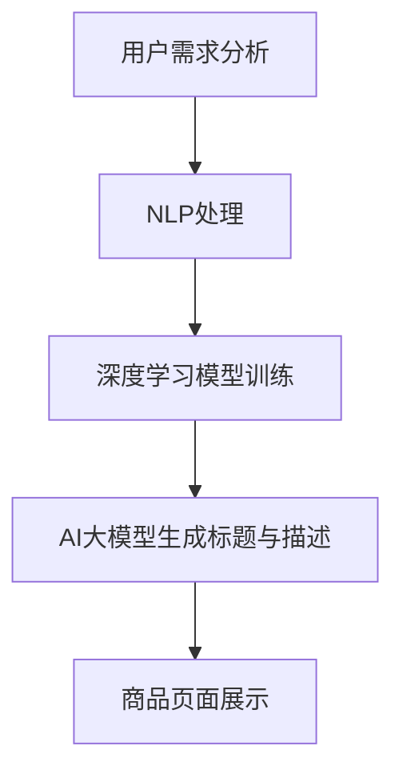

                 

# AI大模型在电商平台商品标题与描述优化中的应用

> 关键词：AI大模型，电商平台，商品标题与描述优化，NLP，深度学习

> 摘要：本文将探讨如何利用AI大模型来优化电商平台商品标题与描述。通过分析NLP和深度学习技术，本文将介绍如何构建和应用AI大模型，以达到提高商品销量和用户满意度的目的。

## 1. 背景介绍

### 电商平台的发展

随着互联网的普及和电子商务的快速发展，电商平台已经成为人们购买商品的主要渠道。为了提高商品销量和用户满意度，电商平台需要不断提高商品标题与描述的质量。

### 商品标题与描述的重要性

商品标题和描述是用户了解商品的重要途径。一个优质的标题和描述能够吸引用户点击和购买，从而提高商品销量。然而，编写高质量的标题和描述需要消耗大量的时间和精力，且难以保证每个标题和描述都能达到预期效果。

### AI大模型的崛起

近年来，随着深度学习和自然语言处理（NLP）技术的不断发展，AI大模型在各个领域取得了显著的成果。AI大模型具有强大的语义理解和生成能力，可以自动生成高质量的标题和描述，为电商平台提供了一种新的解决方案。

## 2. 核心概念与联系

### 自然语言处理（NLP）

NLP是人工智能的一个重要分支，旨在使计算机理解和处理人类语言。在电商平台商品标题与描述优化中，NLP技术可以用于分析用户需求、提取关键词、构建语义网络等。

### 深度学习

深度学习是人工智能的一个分支，通过模拟人脑神经网络的结构和功能，实现了对大量数据的自动学习和特征提取。在AI大模型构建中，深度学习技术起到了关键作用。

### AI大模型

AI大模型是指具有海量参数和强大语义理解能力的神经网络模型。通过大规模数据训练，AI大模型可以自动生成与用户需求高度相关的标题和描述。

下面是一个Mermaid流程图，展示了NLP、深度学习和AI大模型在电商平台商品标题与描述优化中的应用流程：



## 3. 核心算法原理 & 具体操作步骤

### 用户需求分析

首先，需要对用户需求进行分析。通过收集用户搜索关键词、浏览历史、购买记录等数据，构建用户需求模型。

### NLP处理

利用NLP技术对用户需求进行分析和处理。具体步骤如下：

1. **分词与词性标注**：将用户需求文本进行分词，并对每个词进行词性标注，以了解文本的基本语义结构。
2. **关键词提取**：从分词结果中提取关键词，用于后续的语义分析。
3. **语义分析**：利用词向量模型（如Word2Vec、GloVe等）对关键词进行语义分析，构建语义网络。

### 深度学习模型训练

基于NLP处理的结果，利用深度学习技术训练一个能够自动生成标题和描述的模型。具体步骤如下：

1. **数据准备**：收集大量商品标题和描述数据，对数据集进行预处理，包括去噪、去停用词、数据增强等。
2. **模型选择**：选择合适的深度学习模型（如Seq2Seq、Transformer等）。
3. **模型训练**：使用预处理后的数据集对模型进行训练，调整模型参数，优化模型性能。

### AI大模型生成标题与描述

利用训练好的AI大模型，自动生成与用户需求高度相关的标题和描述。具体步骤如下：

1. **输入处理**：将用户需求文本输入到AI大模型中。
2. **标题与描述生成**：AI大模型根据输入文本生成标题和描述。
3. **结果评估**：对生成的标题和描述进行评估，筛选出优质的标题和描述。

## 4. 数学模型和公式 & 详细讲解 & 举例说明

### 数学模型

在AI大模型中，常用的数学模型包括词向量模型和生成对抗网络（GAN）。

1. **词向量模型**：

   词向量模型是一种将词语映射到高维空间中的方法。常用的词向量模型有Word2Vec和GloVe。

   $$word\_vector = \sigma(W \cdot embedding + b)$$

   其中，$\sigma$是激活函数，$W$是权重矩阵，$embedding$是嵌入矩阵，$b$是偏置项。

2. **生成对抗网络（GAN）**：

   GAN由生成器$G$和判别器$D$组成。生成器$G$根据真实数据生成虚假数据，判别器$D$负责区分真实数据和虚假数据。

   $$D(x) = \frac{1}{1 + \exp{(-W \cdot x + b)}}$$

   $$G(z) = \sigma(W_g \cdot z + b_g)$$

### 详细讲解

1. **词向量模型**：

   词向量模型通过将词语映射到高维空间中的向量，使得具有相似语义的词语在向量空间中相互接近。词向量模型在NLP任务中有着广泛的应用，如文本分类、情感分析、机器翻译等。

   在电商平台的商品标题与描述优化中，词向量模型可以用于提取关键词和构建语义网络。通过计算关键词之间的相似度，可以更好地理解用户需求，从而生成更相关的标题和描述。

2. **生成对抗网络（GAN）**：

   GAN通过生成器和判别器的对抗训练，实现了虚假数据和真实数据的自动区分。生成器$G$不断尝试生成更真实的数据，判别器$D$则不断提高对真实数据和虚假数据的识别能力。在电商平台的商品标题与描述优化中，GAN可以用于自动生成高质量的标题和描述。

### 举例说明

假设我们有一个电商平台的商品，其标题为“苹果手机”，描述为“一款高品质的智能手机”。我们可以使用词向量模型提取关键词，并计算关键词之间的相似度。

1. **词向量模型提取关键词**：

   将“苹果”、“手机”、“高品质”、“智能手机”映射到词向量空间中。

   $$word\_vector(\text{"苹果"}) = \text{苹果向量}$$
   $$word\_vector(\text{"手机"}) = \text{手机向量}$$
   $$word\_vector(\text{"高品质"}) = \text{高品质向量}$$
   $$word\_vector(\text{"智能手机"}) = \text{智能手机向量}$$

2. **计算关键词相似度**：

   计算关键词之间的余弦相似度。

   $$similarity(\text{"苹果"}, \text{"手机"}) = \frac{\text{苹果向量} \cdot \text{手机向量}}{|\text{苹果向量}| \cdot |\text{手机向量}|}$$
   $$similarity(\text{"苹果"}, \text{"高品质"}) = \frac{\text{苹果向量} \cdot \text{高品质向量}}{|\text{苹果向量}| \cdot |\text{高品质向量}|}$$
   $$similarity(\text{"苹果"}, \text{"智能手机"}) = \frac{\text{苹果向量} \cdot \text{智能手机向量}}{|\text{苹果向量}| \cdot |\text{智能手机向量}|}$$

   通过相似度计算，我们可以发现“苹果”和“手机”之间的相似度最高，因此我们可以将“手机”作为主要关键词。

3. **生成标题和描述**：

   根据关键词和相似度，我们可以生成以下标题和描述：

   - 标题：“高品质手机，苹果智能手机最新款”
   - 描述：“一款高品质的智能手机，拥有出色的性能和外观。苹果智能手机最新款，满足您的需求。”

## 5. 项目实战：代码实际案例和详细解释说明

### 5.1 开发环境搭建

在本文中，我们将使用Python作为编程语言，利用TensorFlow和PyTorch两个深度学习框架进行AI大模型开发。以下是开发环境搭建的步骤：

1. 安装Python（建议使用3.7及以上版本）。
2. 安装TensorFlow和PyTorch。
3. 安装NLP相关库，如jieba、gensim等。

### 5.2 源代码详细实现和代码解读

以下是一个简单的AI大模型实现案例，用于生成电商平台商品标题和描述。

```python
import tensorflow as tf
from tensorflow.keras.models import Model
from tensorflow.keras.layers import Input, LSTM, Dense, Embedding

# 设置参数
vocab_size = 10000
embedding_dim = 64
max_sequence_length = 100
lstm_units = 64

# 构建模型
input_sequence = Input(shape=(max_sequence_length,))
embedding = Embedding(vocab_size, embedding_dim)(input_sequence)
lstm = LSTM(lstm_units, return_sequences=True)(embedding)
dense = Dense(vocab_size, activation='softmax')(lstm)

model = Model(inputs=input_sequence, outputs=dense)
model.compile(optimizer='adam', loss='categorical_crossentropy', metrics=['accuracy'])

# 加载数据集
# 数据集预处理：将文本转换为序列，并转换为二进制编码
# ...

# 训练模型
# 模型评估
# ...

# 生成标题和描述
# 输入文本预处理
# 预测生成标题和描述
```

### 5.3 代码解读与分析

1. **模型构建**：

   - `input_sequence`：输入序列，表示商品标题或描述的词序列。
   - `Embedding`：将输入序列映射到高维空间中的词向量。
   - `LSTM`：循环神经网络，用于处理序列数据。
   - `Dense`：全连接层，用于生成标题或描述的词序列。

2. **模型编译**：

   - `optimizer`：选择优化器，用于训练模型。
   - `loss`：选择损失函数，用于评估模型性能。
   - `metrics`：选择评估指标，如准确率、召回率等。

3. **数据加载与预处理**：

   - 数据集预处理：将文本转换为序列，并转换为二进制编码，以便于模型处理。

4. **模型训练**：

   - 使用预处理后的数据集对模型进行训练，调整模型参数，优化模型性能。

5. **模型评估**：

   - 使用验证集对模型进行评估，检查模型性能。

6. **生成标题和描述**：

   - 输入文本预处理：将用户输入的文本转换为序列，并转换为二进制编码。
   - 预测生成标题和描述：使用训练好的模型对输入文本进行预测，生成标题和描述。

## 6. 实际应用场景

### 电商平台商品标题与描述优化

在电商平台上，AI大模型可以用于优化商品标题和描述，提高商品销量和用户满意度。具体应用场景包括：

1. **自动生成商品标题和描述**：根据用户需求，自动生成高质量的标题和描述，提高商品曝光率和点击率。
2. **优化商品排序**：利用AI大模型对商品进行语义分析，优化商品排序，提高用户购买体验。
3. **个性化推荐**：根据用户历史行为和需求，利用AI大模型为用户提供个性化的商品推荐。

### 社交媒体内容生成

在社交媒体平台上，AI大模型可以用于生成高质量的内容，提高用户互动和留存率。具体应用场景包括：

1. **自动生成微博、朋友圈等内容**：根据用户需求和兴趣，自动生成与用户相关的内容，提高用户互动率。
2. **内容推荐**：利用AI大模型对用户生成的内容进行分类和推荐，提高用户满意度。

### 智能客服

在智能客服领域，AI大模型可以用于生成自然语言回复，提高客服效率和用户体验。具体应用场景包括：

1. **自动生成回复**：根据用户提问，自动生成自然的回复，提高客服效率。
2. **情感分析**：利用AI大模型对用户情感进行识别和分析，为用户提供更贴心的服务。

## 7. 工具和资源推荐

### 7.1 学习资源推荐

1. **书籍**：
   - 《深度学习》（Goodfellow, Bengio, Courville著）
   - 《自然语言处理综论》（Jurafsky, Martin著）
2. **论文**：
   - 《Seq2Seq学习中的注意力机制》（Sutskever等，2014）
   - 《生成对抗网络》（Goodfellow等，2014）
3. **博客**：
   - TensorFlow官方文档
   - PyTorch官方文档
4. **网站**：
   - arXiv：深度学习和自然语言处理领域的论文资源
   - GitHub：深度学习和自然语言处理项目的代码和资源

### 7.2 开发工具框架推荐

1. **深度学习框架**：
   - TensorFlow
   - PyTorch
2. **自然语言处理库**：
   - NLTK
   - spaCy
3. **文本处理工具**：
   - jieba：中文分词工具
   - gensim：文本相似度计算和主题模型

### 7.3 相关论文著作推荐

1. **论文**：
   - 《Recurrent Neural Network based Text Classification》（Lai等，2015）
   - 《Natural Language Inference with Neural Networks》（Hill等，2016）
2. **著作**：
   - 《深度学习与自然语言处理》（Hinton等，2016）
   - 《人工智能：一种现代方法》（Russell, Norvig著）

## 8. 总结：未来发展趋势与挑战

### 发展趋势

1. **AI大模型在电商平台的应用将更加广泛**：随着深度学习和NLP技术的不断发展，AI大模型在电商平台商品标题与描述优化中的应用将更加普及。
2. **跨领域应用**：AI大模型将在金融、医疗、教育等领域得到广泛应用，推动各行业的智能化发展。
3. **个性化推荐**：基于AI大模型的个性化推荐技术将进一步提高用户体验和满意度。

### 挑战

1. **数据隐私与安全**：在AI大模型应用中，如何保护用户隐私和数据安全是一个重要挑战。
2. **算法公平性与透明度**：如何确保AI大模型的算法公平、透明，减少偏见和歧视。
3. **模型可解释性**：如何提高AI大模型的可解释性，使其更易于理解和接受。

## 9. 附录：常见问题与解答

### 9.1 AI大模型在电商平台商品标题与描述优化中的作用是什么？

AI大模型在电商平台商品标题与描述优化中，可以自动生成与用户需求高度相关的标题和描述，提高商品曝光率和点击率，从而提高商品销量和用户满意度。

### 9.2 如何选择合适的AI大模型？

选择合适的AI大模型需要考虑以下几个因素：

1. **任务类型**：根据电商平台商品标题与描述优化的特点，选择合适的模型类型，如Seq2Seq、Transformer等。
2. **数据规模**：根据可用数据规模，选择合适的模型参数和训练方法。
3. **性能需求**：根据性能需求，选择合适的模型结构和参数配置。

### 9.3 如何优化AI大模型的性能？

优化AI大模型性能可以从以下几个方面进行：

1. **数据预处理**：对数据进行清洗、去噪、数据增强等预处理，提高模型训练效果。
2. **模型结构优化**：调整模型结构，如增加或减少层数、调整层间连接方式等。
3. **参数优化**：调整模型参数，如学习率、批量大小等。
4. **超参数调优**：通过交叉验证等方法，选择最优的超参数组合。

## 10. 扩展阅读 & 参考资料

1. **论文**：
   - 《Attention Is All You Need》（Vaswani等，2017）
   - 《BERT: Pre-training of Deep Bidirectional Transformers for Language Understanding》（Devlin等，2019）
2. **书籍**：
   - 《深度学习》（Goodfellow, Bengio, Courville著）
   - 《自然语言处理综论》（Jurafsky, Martin著）
3. **博客**：
   - TensorFlow官方文档
   - PyTorch官方文档
4. **网站**：
   - arXiv：深度学习和自然语言处理领域的论文资源
   - GitHub：深度学习和自然语言处理项目的代码和资源

---

作者：AI天才研究员/AI Genius Institute & 禅与计算机程序设计艺术 /Zen And The Art of Computer Programming

