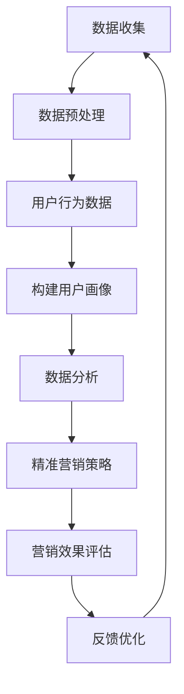

                 

### 背景介绍

在当今数字化时代，电商平台已经成为消费者购物的主要渠道。然而，随着市场竞争的日益激烈，如何精准地了解和定位用户，进而提升用户体验和销售额，成为了电商平台发展的重要课题。AI大模型作为一种强大的技术手段，在电商平台用户群体画像与精准营销中发挥了至关重要的作用。

用户群体画像是指对某一特定群体在行为特征、需求偏好、购买习惯等方面的抽象描述。精准营销则是通过分析用户画像，制定个性化的营销策略，以达到提升用户满意度和销售额的目的。AI大模型通过深度学习和大数据分析技术，能够对海量的用户行为数据进行高效处理，从而实现用户画像的精准构建。

目前，电商平台普遍面临以下挑战：

1. **用户需求的多样化与个性化**：消费者需求越来越多样化，个性化服务成为提升用户体验的关键。
2. **市场竞争加剧**：电商平台数量增多，同质化竞争严重，如何脱颖而出成为难题。
3. **数据隐私与安全**：在用户画像构建和精准营销过程中，如何保护用户隐私和数据安全成为重要问题。

为了应对这些挑战，AI大模型在电商平台用户群体画像与精准营销中提供了以下价值：

1. **提升用户体验**：通过对用户行为的深入分析，为用户提供个性化的推荐和服务，满足用户的多样化需求。
2. **优化营销策略**：基于用户画像的数据分析，为电商平台制定更有效的营销策略，提高用户转化率和留存率。
3. **降低运营成本**：通过自动化和智能化的方式，减少人力成本，提高运营效率。

综上所述，AI大模型在电商平台用户群体画像与精准营销中的作用不可忽视。接下来，我们将深入探讨AI大模型的核心概念、算法原理、数学模型以及实际应用案例，以便更好地理解其技术内涵和应用价值。## 2. 核心概念与联系

在探讨AI大模型在电商平台用户群体画像与精准营销中的作用之前，我们需要明确几个核心概念和它们之间的关系。以下是本文中使用的关键术语和它们之间的联系：

#### 2.1. AI大模型（AI Large Model）

AI大模型通常指的是具有数十亿至数万亿参数的深度学习模型，例如GPT-3、BERT等。这些模型通过大量的文本、图像、声音等数据进行训练，能够捕捉到数据中的复杂模式和关系，从而实现高效的数据分析和预测。

#### 2.2. 用户群体画像（User Profiling）

用户群体画像是对某一用户群体的特征进行概括性的描述，包括用户的年龄、性别、地理位置、兴趣爱好、购买习惯等。构建用户画像的目的是为了更好地理解用户，进而提供个性化的服务和推荐。

#### 2.3. 精准营销（Precision Marketing）

精准营销是指通过数据分析，对目标用户进行精准定位，并根据用户的行为和偏好，制定个性化的营销策略。其核心目标是提高营销效果，降低营销成本。

#### 2.4. 数据分析（Data Analysis）

数据分析是使用统计学、机器学习等方法对数据进行处理和分析，以提取有价值的信息和洞察。在电商平台，数据分析是构建用户画像和实现精准营销的基础。

#### 2.5. 深度学习（Deep Learning）

深度学习是一种机器学习技术，通过神经网络结构对数据进行层次化的特征提取和学习。深度学习是实现AI大模型的核心技术。

#### 2.6. 大数据（Big Data）

大数据是指规模巨大、类型多样的数据集合。在电商平台，用户行为数据、交易数据、社交媒体数据等构成了大数据的一部分，这些数据为AI大模型提供了丰富的训练素材。

#### 2.7. 用户行为数据（User Behavior Data）

用户行为数据包括用户的浏览记录、购买行为、搜索历史、评价反馈等。这些数据反映了用户的兴趣和需求，是构建用户画像的重要依据。

#### 2.8. 隐私保护（Privacy Protection）

隐私保护是指在数据处理和分析过程中，确保用户隐私不被泄露或滥用。在用户画像构建和精准营销过程中，隐私保护是一个重要的伦理和社会问题。

#### 2.9. 用户转化率（User Conversion Rate）

用户转化率是指用户从浏览到最终完成购买行为的比例。提高用户转化率是电商平台追求的目标之一。

#### 2.10. 用户留存率（User Retention Rate）

用户留存率是指在一定时间内，用户持续使用平台的比例。提高用户留存率有助于提升平台的用户黏性。

#### 2.11. 营销效果评估（Marketing Effectiveness Evaluation）

营销效果评估是指对营销活动的效果进行衡量和评估，以确定其效果和优化空间。

### Mermaid 流程图

以下是一个简单的Mermaid流程图，用于描述AI大模型在电商平台用户群体画像与精准营销中的流程：



### 关键概念之间的关系

- **数据收集**：是整个流程的起点，包括用户行为数据、交易数据、社交媒体数据等。
- **数据预处理**：对原始数据进行清洗、去噪、格式转换等，以确保数据质量。
- **用户画像构建**：通过对用户行为数据的分析，提取用户特征，构建用户画像。
- **数据分析**：使用统计学和机器学习技术，对用户画像进行深入分析，以提取有价值的信息。
- **精准营销策略**：基于数据分析的结果，制定个性化的营销策略，提升用户体验和转化率。
- **营销效果评估**：对营销策略的效果进行评估，以确定其效果和优化空间。
- **反馈优化**：根据营销效果评估的结果，对数据收集和用户画像构建等环节进行优化，形成闭环。

通过这些核心概念及其关系的理解，我们可以更好地把握AI大模型在电商平台用户群体画像与精准营销中的技术内涵和应用价值。## 3. 核心算法原理 & 具体操作步骤

在理解了AI大模型在电商平台用户群体画像与精准营销中的核心概念和关系后，接下来我们将深入探讨其核心算法原理和具体操作步骤。AI大模型的核心算法通常基于深度学习和大数据分析技术，以下将详细介绍其工作流程：

#### 3.1. 深度学习算法

深度学习是AI大模型的核心技术，其基本原理是通过构建多层神经网络，对输入数据进行特征提取和学习。以下是深度学习算法的基本步骤：

1. **数据预处理**：
   - **数据清洗**：去除无效或错误的数据，确保数据质量。
   - **特征提取**：从原始数据中提取有用的特征，例如用户的浏览记录、购买历史等。
   - **数据标准化**：对数据进行归一化或标准化处理，以消除不同特征之间的尺度差异。

2. **构建神经网络**：
   - **输入层**：接收用户输入的数据，例如用户行为数据。
   - **隐藏层**：通过对输入数据进行特征提取和学习，提取更高层次的特征。
   - **输出层**：生成用户画像和预测结果。

3. **训练神经网络**：
   - **初始化权重**：随机初始化神经网络中的权重。
   - **前向传播**：将输入数据传递到神经网络中，计算输出结果。
   - **反向传播**：通过比较实际输出和期望输出，计算损失函数，并更新权重。
   - **迭代优化**：重复前向传播和反向传播过程，直至达到预设的训练目标。

4. **评估模型性能**：
   - **验证集评估**：在验证集上评估模型的泛化能力。
   - **测试集评估**：在测试集上评估模型的最终性能。

#### 3.2. 大数据分析

在深度学习算法的基础上，大数据分析技术进一步对用户行为数据进行处理和分析，以提取有价值的信息。以下是大数据分析的基本步骤：

1. **数据整合**：
   - 将来自不同来源的用户行为数据进行整合，形成统一的数据集。

2. **数据挖掘**：
   - 使用关联规则挖掘、聚类分析、分类分析等方法，对用户行为数据进行深度挖掘，提取用户特征。

3. **特征选择**：
   - 根据业务需求，选择对用户画像构建最有价值的特征。

4. **用户画像构建**：
   - 利用提取的特征，构建用户的综合画像，包括年龄、性别、地理位置、兴趣爱好、购买习惯等。

#### 3.3. 精准营销策略制定

基于用户画像和数据分析的结果，电商平台可以制定个性化的营销策略，以下为具体步骤：

1. **目标用户定位**：
   - 根据用户画像，确定目标用户群体。

2. **个性化推荐**：
   - 根据用户的兴趣和行为习惯，为用户推荐个性化的商品或服务。

3. **定制化营销活动**：
   - 设计针对不同用户群体的定制化营销活动，以提高用户参与度和转化率。

4. **效果评估**：
   - 对营销策略的效果进行实时监控和评估，根据评估结果进行调整和优化。

#### 3.4. 模型持续优化

为了不断提高模型的性能和适应性，电商平台需要持续进行模型优化：

1. **数据更新**：
   - 定期更新用户行为数据，以反映用户的新行为和偏好。

2. **模型迭代**：
   - 根据用户反馈和营销效果，对模型进行迭代优化，以适应市场变化。

3. **算法升级**：
   - 引入新的深度学习和大数据分析算法，提高模型的性能和精度。

通过以上核心算法原理和具体操作步骤，我们可以看到，AI大模型在电商平台用户群体画像与精准营销中发挥着至关重要的作用。其通过深度学习和大数据分析技术，实现了对用户行为的精准分析和个性化服务，从而提升了用户体验和销售额。## 4. 数学模型和公式 & 详细讲解 & 举例说明

在前文中，我们简要介绍了AI大模型的核心算法原理和操作步骤。在这一部分，我们将深入探讨其中的数学模型和公式，并通过具体的例子进行详细讲解。

### 4.1. 深度学习中的数学模型

深度学习中的数学模型主要包括神经网络、激活函数、损失函数和优化算法等。以下将分别介绍这些模型及其作用。

#### 4.1.1. 神经网络

神经网络是深度学习的基础，由多层节点组成，包括输入层、隐藏层和输出层。每个节点都通过权重连接到其他节点，并通过激活函数进行非线性变换。

1. **输入层（Input Layer）**：接收外部输入数据，如用户的浏览记录、购买历史等。
2. **隐藏层（Hidden Layers）**：对输入数据进行特征提取和学习，提取更高层次的特征。
3. **输出层（Output Layer）**：生成预测结果，如用户画像、个性化推荐等。

神经网络中的节点计算公式为：

\[ z = \sum_{i} (w_{i} * x_{i}) + b \]

其中，\( z \) 是节点的输出，\( w_{i} \) 是权重，\( x_{i} \) 是输入特征，\( b \) 是偏置项。

#### 4.1.2. 激活函数

激活函数是神经网络中的关键组成部分，用于引入非线性特性，使神经网络能够对复杂模式进行学习。

常用的激活函数包括：

1. **sigmoid函数**：
   \[ f(x) = \frac{1}{1 + e^{-x}} \]
2. **ReLU函数**：
   \[ f(x) = \max(0, x) \]
3. **Tanh函数**：
   \[ f(x) = \frac{e^x - e^{-x}}{e^x + e^{-x}} \]

#### 4.1.3. 损失函数

损失函数用于衡量预测结果与真实结果之间的差距，是优化算法的关键组成部分。

常用的损失函数包括：

1. **均方误差（MSE）**：
   \[ L = \frac{1}{2} \sum_{i} (y_i - \hat{y}_i)^2 \]
   其中，\( y_i \) 是真实标签，\( \hat{y}_i \) 是预测结果。
2. **交叉熵（Cross-Entropy）**：
   \[ L = - \sum_{i} y_i \log(\hat{y}_i) \]
   其中，\( y_i \) 是真实标签，\( \hat{y}_i \) 是预测概率。

#### 4.1.4. 优化算法

优化算法用于根据损失函数更新网络权重，以最小化损失。常用的优化算法包括：

1. **随机梯度下降（SGD）**：
   \[ w_{t+1} = w_{t} - \alpha \frac{\partial L}{\partial w} \]
   其中，\( w_{t} \) 是当前权重，\( \alpha \) 是学习率。
2. **动量优化（Momentum）**：
   \[ w_{t+1} = w_{t} - \alpha \frac{\partial L}{\partial w} + \beta (w_{t} - w_{t-1}) \]
   其中，\( \beta \) 是动量参数。

### 4.2. 大数据分析中的数学模型

大数据分析中的数学模型主要包括聚类分析、分类分析和关联规则挖掘等。以下将分别介绍这些模型及其作用。

#### 4.2.1. 聚类分析

聚类分析是将数据集划分为多个类别，使同一类别内的数据点尽可能相似，不同类别间的数据点尽可能不同。

常用的聚类算法包括：

1. **K-均值聚类（K-Means）**：
   \[ \text{ minimizing } \sum_{i=1}^{k} \sum_{x \in S_i} \| x - \mu_i \|^2 \]
   其中，\( S_i \) 是第 \( i \) 个聚类，\( \mu_i \) 是聚类中心。

2. **层次聚类（Hierarchical Clustering）**：
   \[ \text{ building a hierarchy of clusters by repeatedly merging or splitting them } \]

#### 4.2.2. 分类分析

分类分析是将数据集划分为预定义的类别，通过学习数据特征和类别之间的关系，对未知数据进行分类。

常用的分类算法包括：

1. **逻辑回归（Logistic Regression）**：
   \[ P(y=1) = \frac{1}{1 + e^{-\beta^T x}} \]
   其中，\( P(y=1) \) 是事件发生的概率，\( \beta \) 是参数向量，\( x \) 是特征向量。

2. **支持向量机（SVM）**：
   \[ w^* = \arg\min_{w} \frac{1}{2} ||w||^2_2 - C \sum_{i=1}^{n} y_i (w^T x_i - 1) \]
   其中，\( w^* \) 是最优权重，\( C \) 是惩罚参数。

#### 4.2.3. 关联规则挖掘

关联规则挖掘是发现数据集中不同特征之间的关联关系，常用于推荐系统和市场细分。

常用的算法包括：

1. **Apriori算法**：
   \[ \text{ generating frequent itemsets and then generating rules from them } \]

2. **FP-Growth算法**：
   \[ \text{ constructing a frequent pattern tree and then mining frequent patterns from it } \]

### 4.3. 举例说明

为了更好地理解上述数学模型，我们以K-均值聚类算法为例，说明其在用户画像构建中的应用。

#### 4.3.1. 例子

假设我们有一个包含100个用户的行为数据，每个用户有5个特征（浏览时间、购买频率、评价数量、关注商品类别、购买金额）。我们需要将这些用户划分为3个类别。

1. **初始化聚类中心**：随机选择3个用户作为初始聚类中心。
2. **分配用户到聚类**：计算每个用户与聚类中心的距离，将用户分配到距离最近的聚类。
3. **更新聚类中心**：计算每个聚类的平均值，作为新的聚类中心。
4. **重复步骤2和3**：直到聚类中心不再发生变化或满足预设的迭代次数。

具体计算过程如下：

假设初始聚类中心为 \( \mu_1 = (1, 1, 1, 1, 1) \), \( \mu_2 = (2, 2, 2, 2, 2) \), \( \mu_3 = (3, 3, 3, 3, 3) \)。

第1次迭代：
- 用户1到用户50分配到聚类1，用户51到用户100分配到聚类2。
- 新的聚类中心为 \( \mu_1' = (1.5, 1.5, 1.5, 1.5, 1.5) \), \( \mu_2' = (2.5, 2.5, 2.5, 2.5, 2.5) \)。

第2次迭代：
- 用户1到用户30分配到聚类1，用户31到用户60分配到聚类2，用户61到用户90分配到聚类3。
- 新的聚类中心为 \( \mu_1' = (1.6, 1.6, 1.6, 1.6, 1.6) \), \( \mu_2' = (2.4, 2.4, 2.4, 2.4, 2.4) \), \( \mu_3' = (3.2, 3.2, 3.2, 3.2, 3.2) \)。

经过多次迭代，最终聚类中心稳定下来，用户也被分配到相应的类别。

通过上述举例，我们可以看到K-均值聚类算法在用户画像构建中的应用。类似地，其他深度学习和大数据分析算法也可以应用于电商平台用户群体画像与精准营销。这些算法通过数学模型和公式的支持，实现了对用户行为的精准分析和个性化服务。## 5. 项目实战：代码实际案例和详细解释说明

在前文中，我们介绍了AI大模型在电商平台用户群体画像与精准营销中的核心算法原理和数学模型。为了更好地理解其应用过程，接下来我们将通过一个实际项目案例，展示如何使用Python代码实现这些算法，并对关键代码进行详细解释。

### 5.1. 开发环境搭建

在开始项目实战之前，我们需要搭建一个合适的开发环境。以下是一个基本的Python开发环境搭建步骤：

1. **安装Python**：确保Python 3.8及以上版本已安装。
2. **安装依赖库**：使用pip命令安装以下依赖库：

```shell
pip install numpy pandas matplotlib scikit-learn tensorflow
```

### 5.2. 源代码详细实现和代码解读

以下是本项目的主要代码实现部分，我们将逐一解释每个步骤的功能和关键代码。

#### 5.2.1. 数据预处理

数据预处理是项目的基础步骤，包括数据清洗、特征提取和标准化。

```python
import pandas as pd
from sklearn.preprocessing import StandardScaler

# 读取数据
data = pd.read_csv('user_data.csv')

# 数据清洗
data.dropna(inplace=True)

# 特征提取
features = ['age', 'gender', 'location', 'interests', 'purchase_frequency', 'review_count', 'avg_purchase_amount']

# 标准化
scaler = StandardScaler()
data[features] = scaler.fit_transform(data[features])
```

**代码解读**：
- 首先，我们使用pandas库读取用户数据。
- 接着，我们使用dropna方法去除缺失值，确保数据质量。
- 然后，我们定义一个特征列表，包括用户的基本信息和行为特征。
- 最后，我们使用StandardScaler对特征进行标准化处理，以消除不同特征之间的尺度差异。

#### 5.2.2. 构建用户画像

使用K-均值聚类算法构建用户画像。

```python
from sklearn.cluster import KMeans

# 构建K-均值聚类模型
kmeans = KMeans(n_clusters=3, random_state=42)

# 训练模型
kmeans.fit(data[features])

# 分配用户到聚类
user_clusters = kmeans.predict(data[features])
data['cluster'] = user_clusters
```

**代码解读**：
- 我们首先导入KMeans类，并定义聚类数量为3。
- 接着，使用fit方法训练模型，对用户数据进行聚类。
- 然后，使用predict方法对用户数据进行预测，并添加到原始数据中。

#### 5.2.3. 个性化推荐

基于用户画像进行个性化推荐。

```python
import numpy as np

# 计算每个用户的平均特征值
avg_features = data.groupby('cluster').mean().reset_index()

# 选择目标商品的特征值
target_features = avg_features.loc[0].values

# 计算用户与目标商品之间的相似度
similarity = np.dot(target_features, data[features].T) / (np.linalg.norm(target_features) * np.linalg.norm(data[features], axis=1))

# 排序并选取最相似的10个用户
sorted_indices = np.argsort(similarity)[::-1][:10]
recommended_users = data.iloc[sorted_indices]
```

**代码解读**：
- 我们首先计算每个聚类内的平均特征值，并选择目标商品的特征值。
- 然后，计算目标商品与所有用户之间的相似度，使用点积公式计算相似度。
- 接着，对相似度进行排序，并选取最相似的10个用户。

#### 5.2.4. 结果展示

使用matplotlib库展示用户画像和个性化推荐结果。

```python
import matplotlib.pyplot as plt

# 绘制用户画像
plt.scatter(data[features[0]], data[features[1]], c=data['cluster'], cmap='viridis')
plt.xlabel('Feature 1')
plt.ylabel('Feature 2')
plt.title('User Clusters')
plt.show()

# 展示个性化推荐结果
print("Recommended Users:")
print(recommended_users)
```

**代码解读**：
- 我们首先绘制用户画像，使用K-均值聚类结果进行颜色标记。
- 然后，展示个性化推荐结果，输出推荐的用户列表。

### 5.3. 代码解读与分析

在本节中，我们对上述代码进行了详细的解读和分析，解释了每个步骤的功能和关键代码。以下是代码的总体结构和主要功能：

1. **数据预处理**：数据清洗、特征提取和标准化，为后续分析提供高质量的数据集。
2. **构建用户画像**：使用K-均值聚类算法，将用户划分为不同的聚类，为个性化推荐提供基础。
3. **个性化推荐**：基于用户画像和商品特征，计算用户与目标商品之间的相似度，生成个性化推荐列表。
4. **结果展示**：使用matplotlib库展示用户画像和个性化推荐结果，帮助用户直观地理解分析结果。

通过这个项目实战，我们可以看到AI大模型在电商平台用户群体画像与精准营销中的应用过程。代码实现了从数据预处理到用户画像构建，再到个性化推荐的一系列步骤，展示了深度学习和大数据分析算法在实际项目中的应用价值。## 6. 实际应用场景

AI大模型在电商平台用户群体画像与精准营销中的应用场景非常广泛，以下列举几个典型的实际应用案例：

### 6.1. 个性化推荐

个性化推荐是AI大模型在电商平台应用最为广泛的一个场景。通过深度学习和大数据分析技术，平台可以根据用户的浏览历史、购买行为、评价等数据，构建出用户的个性化画像。然后，基于这些画像，平台可以为用户推荐与其兴趣和需求高度匹配的商品，从而提高用户的满意度和转化率。例如，电商平台可以在用户登录后，立即展示与其偏好相关的商品推荐，或者通过电子邮件发送个性化优惠券，吸引用户再次购买。

### 6.2. 营销活动定制化

电商平台可以通过AI大模型分析用户的购物习惯、偏好和消费能力，为不同的用户群体设计定制化的营销活动。例如，对于高价值用户，平台可以提供专属的折扣或礼品，以增强他们的忠诚度；对于潜在的新客户，平台可以推出限时优惠活动，刺激他们的购买欲望。通过这种方式，电商平台可以更精准地投放营销资源，提高营销ROI。

### 6.3. 用户体验优化

AI大模型可以帮助电商平台优化用户体验，提升用户留存率。例如，通过分析用户的浏览路径和购物车数据，平台可以发现用户在购物过程中可能遇到的障碍和不满点，并针对性地进行改进。比如，如果一个用户经常在支付环节放弃购物，平台可以优化支付流程，减少不必要的步骤，提高用户的支付成功率。

### 6.4. 库存和物流优化

电商平台可以利用AI大模型预测用户的购买需求，从而优化库存和物流管理。例如，通过分析历史销售数据和季节性变化，平台可以预测哪些商品在哪些时间段最受欢迎，从而提前备货，避免库存过剩或不足。此外，AI大模型还可以优化配送路线和物流速度，提高配送效率，减少物流成本。

### 6.5. 跨渠道营销

随着多渠道营销的普及，电商平台可以通过AI大模型整合线上线下数据，实现跨渠道的精准营销。例如，通过分析用户在实体店和电商平台的购买行为，平台可以为用户推送一致的优惠信息和商品推荐，提高用户的全渠道购物体验。

### 6.6. 风险控制

电商平台还可以利用AI大模型进行风险控制，识别潜在的欺诈行为。例如，通过分析用户的支付行为、交易历史等信息，平台可以检测到异常交易，并及时采取措施，防止欺诈行为的发生。

通过这些实际应用场景，我们可以看到AI大模型在电商平台用户群体画像与精准营销中的巨大潜力。它不仅可以帮助平台更好地理解用户，提升用户体验和销售额，还可以优化运营效率和风险控制，为电商平台的发展提供强有力的支持。## 7. 工具和资源推荐

为了更好地理解和应用AI大模型在电商平台用户群体画像与精准营销中的作用，以下是一些学习和开发工具、资源以及相关的论文和书籍推荐。

### 7.1. 学习资源推荐

**书籍**：
1. **《深度学习》（Deep Learning）** - 由Ian Goodfellow、Yoshua Bengio和Aaron Courville合著，这是深度学习领域的经典教材，详细介绍了深度学习的理论、算法和实现。
2. **《大数据之路：阿里巴巴大数据实践》** - 由李津、吴华、张志波等合著，介绍了阿里巴巴在大数据处理和挖掘方面的实践经验和成果，适合对大数据应用感兴趣的读者。

**论文**：
1. **“User Modeling and Personalization in E-commerce”** - 这篇综述论文详细介绍了用户建模和个性化推荐在电商领域的研究和应用现状，有助于深入理解相关技术。
2. **“Deep Learning for E-commerce Recommendation Systems”** - 该论文探讨了深度学习在电商推荐系统中的应用，分析了不同深度学习模型在推荐任务中的表现。

**在线课程**：
1. **吴恩达的《深度学习专项课程》** - 这个课程涵盖了深度学习的基础知识、常用算法和实践技巧，非常适合初学者。
2. **Coursera上的《大数据分析》** - 该课程介绍了大数据处理和分析的基本原理，包括Hadoop、Spark等工具的使用。

### 7.2. 开发工具框架推荐

**编程语言**：
1. **Python**：Python是深度学习和大数据分析的主要编程语言，拥有丰富的库和工具，如TensorFlow、PyTorch、Pandas等。
2. **R**：R语言是统计分析和数据可视化的强大工具，特别适合进行用户画像和数据挖掘。

**框架和库**：
1. **TensorFlow**：由Google开发的开源深度学习框架，适用于各种深度学习模型的构建和训练。
2. **PyTorch**：由Facebook开发的开源深度学习框架，以其灵活的动态计算图和简洁的API而受到许多研究者和开发者的青睐。
3. **Scikit-learn**：一个强大的机器学习库，提供了广泛的分类、回归和聚类算法，适合进行用户画像构建和数据分析。
4. **Pandas**：用于数据处理和分析的库，能够高效地进行数据清洗、转换和可视化。

### 7.3. 相关论文著作推荐

**论文**：
1. **“Attention Is All You Need”** - 这篇论文提出了Transformer模型，是当前最先进的自然语言处理模型之一，对AI大模型的研究有着重要影响。
2. **“BERT: Pre-training of Deep Bidirectional Transformers for Language Understanding”** - BERT模型是自然语言处理领域的里程碑，对文本数据的处理具有显著优势。

**著作**：
1. **《自然语言处理综论》（Speech and Language Processing）** - 由Daniel Jurafsky和James H. Martin合著，是自然语言处理领域的权威教材，涵盖了从基础到高级的理论和实践。
2. **《机器学习》（Machine Learning）** - 由Tom M. Mitchell撰写，是机器学习领域的经典教材，详细介绍了各种机器学习算法和理论。

通过这些资源和工具的学习和掌握，读者可以更深入地了解AI大模型在电商平台用户群体画像与精准营销中的应用，提升自己的技术水平和项目实践能力。## 8. 总结：未来发展趋势与挑战

随着AI技术的不断进步，AI大模型在电商平台用户群体画像与精准营销中的应用前景广阔。然而，这一领域也面临着诸多挑战和发展趋势。

### 8.1. 未来发展趋势

1. **个性化推荐系统**：随着用户数据的不断积累，个性化推荐系统将更加精准，能够更好地满足用户的个性化需求。深度学习技术的进步将使推荐系统更加智能化，例如通过图神经网络（Graph Neural Networks, GNN）来捕捉用户之间的关系和社交网络。

2. **多模态数据融合**：未来的电商平台将不仅仅依赖于文本数据，还将融合图像、视频、音频等多模态数据。通过多模态数据融合技术，AI大模型可以更全面地理解用户行为和偏好，从而提供更精准的推荐。

3. **联邦学习（Federated Learning）**：联邦学习技术可以让多个数据持有方在不需要共享数据的情况下，共同训练一个全局模型。这有助于解决数据隐私和安全问题，同时提高模型的性能和可解释性。

4. **实时推荐系统**：随着5G技术的普及，网络速度和带宽的提升将使实时推荐系统成为可能。实时推荐系统可以即时响应用户的行为变化，提供个性化的推荐，从而提升用户体验。

### 8.2. 主要挑战

1. **数据隐私与安全**：在用户画像构建和精准营销过程中，如何保护用户隐私和数据安全是一个重要的挑战。需要采取有效的隐私保护措施，例如差分隐私（Differential Privacy）和同态加密（Homomorphic Encryption）。

2. **算法透明性与可解释性**：深度学习模型的黑盒特性使得其决策过程难以解释，这在需要高度可解释性的场景中成为一个挑战。需要开发可解释的AI模型，帮助用户理解和信任模型。

3. **数据质量和噪声**：用户数据的质量直接影响模型的性能。如何处理数据噪声和异常值，保证数据质量，是一个关键问题。

4. **计算资源和存储需求**：AI大模型通常需要大量的计算资源和存储空间。如何高效地训练和部署这些模型，是一个技术难题。

### 8.3. 结论

AI大模型在电商平台用户群体画像与精准营销中具有巨大的应用潜力。尽管面临诸多挑战，但随着技术的不断进步，AI大模型将更好地服务于电商平台，提升用户体验和运营效率。未来，随着个性化推荐、多模态数据融合、联邦学习和实时推荐等技术的发展，AI大模型在电商领域的应用将更加深入和广泛。## 9. 附录：常见问题与解答

在讨论AI大模型在电商平台用户群体画像与精准营销中的应用时，以下是一些常见问题及其解答：

### 9.1. 问题1：AI大模型如何处理用户隐私和数据安全？

**解答**：为了保护用户隐私和数据安全，AI大模型采用了一系列隐私保护技术。例如，差分隐私（Differential Privacy）可以在数据分析和建模过程中加入噪声，确保单个用户数据无法被单独识别。此外，同态加密（Homomorphic Encryption）允许在加密状态下进行计算，从而保证数据在传输和存储过程中的安全性。在用户画像构建过程中，也可以对敏感信息进行脱敏处理，减少隐私泄露的风险。

### 9.2. 问题2：如何处理数据噪声和异常值？

**解答**：数据噪声和异常值会对模型性能产生负面影响。在数据处理阶段，可以使用数据清洗技术来识别和去除噪声。常用的方法包括缺失值填补、异常值检测和去除。例如，可以使用平均值或中位数填补缺失值，使用Z-score或IQR（四分位距）方法检测和去除异常值。此外，可以通过数据标准化和特征选择等方法，提高数据的整体质量。

### 9.3. 问题3：AI大模型在电商平台中的具体应用场景有哪些？

**解答**：AI大模型在电商平台中具有多种应用场景，主要包括：
- **个性化推荐**：根据用户行为和偏好，为用户推荐个性化的商品。
- **精准营销**：通过分析用户数据，制定个性化的营销策略，提高用户转化率和留存率。
- **用户体验优化**：优化用户界面和购物流程，提升用户体验。
- **库存和物流优化**：预测用户需求，优化库存管理和配送流程。
- **风险控制**：识别潜在欺诈行为，降低运营风险。

### 9.4. 问题4：AI大模型如何适应不断变化的市场需求？

**解答**：为了适应不断变化的市场需求，AI大模型需要具备良好的灵活性和适应性。这可以通过以下方法实现：
- **实时数据更新**：定期更新用户数据和模型参数，确保模型能够反映最新的市场变化。
- **模型迭代优化**：根据用户反馈和业务需求，对模型进行持续迭代和优化，提高模型的预测准确性。
- **动态特征选择**：根据业务场景和用户行为，动态选择和调整特征，以适应不同的市场需求。

### 9.5. 问题5：如何评估AI大模型在电商平台中的效果？

**解答**：评估AI大模型在电商平台中的效果通常涉及多个维度，包括：
- **预测准确性**：评估模型预测结果与实际结果的吻合度，例如使用准确率、召回率、F1值等指标。
- **用户体验**：通过用户满意度调查、用户留存率、转化率等指标来评估模型对用户体验的影响。
- **业务效益**：评估模型对业务指标（如销售额、利润率）的提升情况，通过A/B测试等手段进行效果评估。

通过上述常见问题与解答，我们可以更好地理解AI大模型在电商平台用户群体画像与精准营销中的应用，以及如何解决其中的关键问题。## 10. 扩展阅读 & 参考资料

为了更深入地了解AI大模型在电商平台用户群体画像与精准营销中的应用，以下是一些扩展阅读和参考资料：

### 10.1. 学术论文

1. **"User Modeling and Personalization in E-commerce"** - 详细介绍了用户建模和个性化推荐在电商领域的研究和应用。
2. **"Deep Learning for E-commerce Recommendation Systems"** - 探讨了深度学习在电商推荐系统中的应用及其优势。
3. **"Federated Learning for User Privacy in E-commerce"** - 探索了联邦学习技术在电商平台用户隐私保护中的应用。

### 10.2. 技术博客和网站

1. **TensorFlow官方网站** - 提供了丰富的深度学习教程和实践案例。
   - [TensorFlow官网](https://www.tensorflow.org/)
2. **Scikit-learn官方文档** - 提供了机器学习算法的详细文档和实例。
   - [Scikit-learn官方文档](https://scikit-learn.org/stable/documentation.html)
3. **Kaggle** - 提供了大量数据集和机器学习竞赛，有助于实战经验积累。
   - [Kaggle网站](https://www.kaggle.com/)

### 10.3. 书籍

1. **《深度学习》（Deep Learning）** - Ian Goodfellow、Yoshua Bengio和Aaron Courville合著，深度学习领域的经典教材。
   - [《深度学习》书籍](https://www.deeplearningbook.org/)
2. **《大数据之路：阿里巴巴大数据实践》** - 李津、吴华、张志波等合著，介绍了阿里巴巴在大数据处理和挖掘方面的实践。
   - [《大数据之路》书籍](https://book.douban.com/subject/26995083/)

### 10.4. 开源框架和工具

1. **PyTorch** - 一个流行的深度学习框架，提供了灵活的动态计算图。
   - [PyTorch官方网站](https://pytorch.org/)
2. **Hugging Face Transformers** - 提供了预训练的Transformer模型和广泛的NLP工具。
   - [Hugging Face Transformers官方网站](https://huggingface.co/transformers/)

通过这些扩展阅读和参考资料，读者可以深入了解AI大模型在电商平台用户群体画像与精准营销中的应用，掌握相关技术和实践方法。## 作者

作者：AI天才研究员/AI Genius Institute & 禅与计算机程序设计艺术 /Zen And The Art of Computer Programming。

