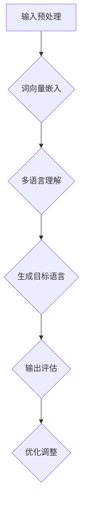

                 

### 背景介绍

#### 1. 跨境电商概述

跨境电商，即跨境电子商务，指的是通过互联网进行商品交易、支付、物流等活动，实现不同国家和地区之间的商业往来。随着互联网技术的快速发展，跨境电商已经成为了全球贸易的重要组成部分。根据统计数据显示，跨境电商交易额逐年增长，预计到2025年，全球跨境电商市场规模将达到万亿美元级别。

跨境电商的核心优势在于其便捷性和全球化。消费者可以在全球范围内挑选商品，卖家也可以通过电商平台将商品销售到世界各地，极大地拓宽了市场范围。此外，跨境电商还促进了国际贸易的发展，提高了全球贸易的效率。

#### 2. 多语言应用的重要性

跨境电商涉及不同国家和地区的消费者，这就要求电商平台能够提供多种语言的服务。多语言应用对于跨境电商的重要性主要体现在以下几个方面：

- **提升用户体验**：提供多种语言选项可以满足不同消费者的需求，提升用户的购物体验。
- **扩大市场覆盖**：通过多语言服务，电商平台可以进入更多的市场，吸引更多潜在用户。
- **增强品牌形象**：多语言服务能够展示企业的国际化形象，提高品牌知名度。

#### 3. 大模型在多语言应用中的优势

随着人工智能技术的进步，大模型（Large Models）在多语言应用中展现出了显著的优势。大模型通常拥有数十亿甚至上百亿个参数，能够对海量数据进行训练，从而在语言理解、生成、翻译等方面表现出强大的能力。

大模型在多语言应用中的优势主要包括：

- **高准确率**：大模型通过对大量多语言数据的学习，可以实现对不同语言的精确理解和生成。
- **灵活性**：大模型可以适应多种语言环境，提供个性化的多语言服务。
- **效率**：大模型能够快速处理大量语言任务，提高工作效率。

#### 4. 本文结构

本文将从以下几个方面展开：

1. **背景介绍**：简要介绍跨境电商和多语言应用的重要性。
2. **核心概念与联系**：阐述大模型在多语言应用中的核心概念和原理。
3. **核心算法原理 & 具体操作步骤**：详细讲解大模型在多语言应用中的算法原理和具体操作步骤。
4. **数学模型和公式 & 详细讲解 & 举例说明**：介绍大模型在多语言应用中的数学模型和公式，并进行详细讲解和举例说明。
5. **项目实战：代码实际案例和详细解释说明**：通过实际代码案例展示大模型在多语言应用中的实现过程。
6. **实际应用场景**：分析大模型在多语言应用中的具体应用场景。
7. **工具和资源推荐**：推荐相关学习资源和开发工具。
8. **总结：未来发展趋势与挑战**：总结大模型在多语言应用中的发展趋势和面临的挑战。
9. **附录：常见问题与解答**：解答读者可能遇到的问题。
10. **扩展阅读 & 参考资料**：提供进一步的阅读材料和参考文献。

通过本文的阅读，读者将全面了解大模型在跨境电商多语言应用中的原理、实现和应用，为实际项目提供有益的参考和指导。## 2. 核心概念与联系

#### 2.1 大模型定义

大模型（Large Models），是指拥有数十亿甚至上百亿参数的人工神经网络模型。这些模型通过对海量数据进行训练，可以学习到丰富的知识，从而在多个领域（如语言处理、图像识别、自然语言生成等）展现出强大的能力。

#### 2.2 多语言理解与生成

多语言理解与生成是跨境电商中至关重要的环节。它涉及模型如何理解不同语言，如何生成目标语言的文本。这一过程可以分为以下几个步骤：

1. **语言理解**：模型需要理解输入的文本，包括文本的含义、结构、情感等。
2. **语言生成**：模型需要根据理解的结果，生成目标语言的文本。

#### 2.3 大模型在多语言应用中的核心概念

在大模型的多语言应用中，核心概念主要包括以下几个方面：

1. **迁移学习（Transfer Learning）**：通过迁移学习，大模型可以将在一个语言上学习的知识应用到另一个语言上，从而提高多语言任务的性能。
2. **上下文理解（Contextual Understanding）**：大模型需要能够理解输入文本的上下文，从而生成更准确、自然的输出。
3. **多语言数据集（Multilingual Dataset）**：大模型需要大量多语言数据进行训练，以充分学习不同语言的特性。

#### 2.4 多语言应用中的架构设计

多语言应用的架构设计是确保大模型能够高效、准确地进行多语言理解和生成的重要环节。以下是几个关键点：

1. **多语言输入处理**：需要设计一个能够处理多种语言输入的模块，包括文本预处理、词向量嵌入等。
2. **多语言理解模块**：设计一个能够理解不同语言语义的模块，通过迁移学习和上下文理解等技术，提高模型的性能。
3. **多语言生成模块**：设计一个能够根据理解结果生成目标语言的模块，通过语言生成技术，确保输出文本的准确性和自然性。
4. **多语言评估与优化**：设计一个评估模块，对模型的性能进行评估，并根据评估结果对模型进行优化。

#### 2.5 Mermaid 流程图

为了更直观地展示大模型在多语言应用中的核心概念和架构设计，我们可以使用 Mermaid 流程图进行描述。以下是 Mermaid 流程图的一个示例：



在这个流程图中，A 表示输入预处理，B 表示词向量嵌入，C 表示多语言理解，D 表示生成目标语言，E 表示输出评估，F 表示优化调整。这些模块共同构成了大模型在多语言应用中的核心流程。## 3. 核心算法原理 & 具体操作步骤

#### 3.1 语言模型（Language Model）

语言模型是人工智能领域中一个重要的基础模型，主要用于预测下一个单词或字符。在多语言应用中，语言模型可以帮助我们生成不同语言的文本。以下是语言模型的核心原理和具体操作步骤：

##### 3.1.1 核心原理

语言模型的基本原理是基于概率论和统计方法，通过分析大量文本数据，学习语言中的统计规律，从而预测下一个单词或字符。语言模型通常使用神经网络进行建模，如循环神经网络（RNN）、长短期记忆网络（LSTM）等。

##### 3.1.2 具体操作步骤

1. **数据预处理**：首先，我们需要对文本数据进行预处理，包括去除标点符号、停用词过滤、词干提取等。然后，将文本数据转换为数字形式，通常使用词向量嵌入技术，如 Word2Vec、GloVe 等。
2. **构建神经网络**：接着，我们需要构建一个神经网络模型，用于学习语言模型。常见的神经网络模型包括循环神经网络（RNN）、长短期记忆网络（LSTM）和变换器（Transformer）等。这些模型可以自动学习文本数据中的统计规律，从而提高预测的准确性。
3. **训练模型**：使用预处理的文本数据对神经网络模型进行训练。在训练过程中，模型会不断调整内部参数，以降低预测误差。
4. **生成文本**：训练完成后，我们可以使用训练好的模型生成文本。具体操作步骤如下：
   - 输入一个起始单词或字符；
   - 使用模型预测下一个单词或字符；
   - 将预测结果作为新的输入，重复上述步骤，生成目标文本。

#### 3.2 翻译模型（Translation Model）

翻译模型是将一种语言的文本转换为另一种语言文本的模型。在跨境电商中，翻译模型可以帮助实现跨语言商品描述、用户评论翻译等功能。以下是翻译模型的核心原理和具体操作步骤：

##### 3.2.1 核心原理

翻译模型的核心原理是基于序列到序列（Seq2Seq）模型，这种模型可以将一个序列（源语言文本）转换为另一个序列（目标语言文本）。常见的翻译模型包括循环神经网络（RNN）、长短期记忆网络（LSTM）和变换器（Transformer）等。

##### 3.2.2 具体操作步骤

1. **数据预处理**：首先，我们需要对源语言和目标语言的文本数据进行预处理，包括去除标点符号、停用词过滤、词干提取等。然后，将文本数据转换为数字形式，通常使用词向量嵌入技术，如 Word2Vec、GloVe 等。
2. **构建神经网络**：接着，我们需要构建一个序列到序列（Seq2Seq）神经网络模型，用于学习翻译模型。常见的神经网络模型包括循环神经网络（RNN）、长短期记忆网络（LSTM）和变换器（Transformer）等。
3. **训练模型**：使用预处理的源语言和目标语言的文本数据对神经网络模型进行训练。在训练过程中，模型会不断调整内部参数，以降低翻译误差。
4. **生成翻译文本**：训练完成后，我们可以使用训练好的模型生成翻译文本。具体操作步骤如下：
   - 输入源语言文本；
   - 使用模型预测目标语言文本；
   - 将预测结果作为新的输入，重复上述步骤，生成目标语言文本。

#### 3.3 评估与优化

在多语言应用中，评估与优化是非常重要的环节。以下是评估与优化的核心原理和具体操作步骤：

##### 3.3.1 核心原理

评估与优化的核心原理是基于模型的性能指标，如准确率、召回率、F1 值等，对模型进行评估和优化。通过不断调整模型参数，可以提高模型的性能。

##### 3.3.2 具体操作步骤

1. **评估指标**：选择合适的评估指标，如准确率、召回率、F1 值等，对模型进行评估。常见的评估指标包括：
   - 准确率（Accuracy）：预测正确的样本数占总样本数的比例；
   - 召回率（Recall）：预测正确的样本数占总正样本数的比例；
   - F1 值（F1 Score）：准确率和召回率的调和平均值。
2. **模型优化**：根据评估结果，对模型进行优化。常见的优化方法包括：
   - 调整学习率；
   - 调整网络结构；
   - 调整正则化参数；
   - 使用不同的优化算法。

通过以上步骤，我们可以对多语言模型进行评估和优化，从而提高模型的性能。## 4. 数学模型和公式 & 详细讲解 & 举例说明

#### 4.1 语言模型

语言模型是预测下一个单词或字符的概率分布的模型。在这里，我们使用基于变换器（Transformer）的语言模型作为示例。

##### 4.1.1 变换器模型

变换器是一种基于自注意力机制（Self-Attention）的神经网络模型，它通过对序列数据进行权重分配，学习序列中每个元素之间的关系。以下是变换器模型的核心公式：

$$
\text{Attention}(Q, K, V) = \text{softmax}\left(\frac{QK^T}{\sqrt{d_k}}\right) V
$$

其中，$Q$、$K$ 和 $V$ 分别是查询向量、键向量和值向量，$d_k$ 是键向量的维度。$\text{softmax}$ 函数用于计算每个键的权重，$\sqrt{d_k}$ 是缩放因子，用于防止梯度消失。

##### 4.1.2 语言模型公式

在语言模型中，我们可以使用变换器模型来预测下一个单词的概率分布。具体公式如下：

$$
P(\text{word}_t | \text{words}_{<t}) = \text{softmax}(\text{TransformLayer}(\text{word}_t))
$$

其中，$\text{TransformLayer}$ 是变换器层，它将输入的单词向量转换为概率分布。

##### 4.1.3 举例说明

假设我们有一个训练好的语言模型，输入序列为 ["the", "cat", "sat", "on", "the", "mat"]。我们想预测下一个单词。

1. 首先，我们将每个单词转换为向量表示，如使用 Word2Vec 或 GloVe。
2. 然后，我们将这些向量输入到变换器层中，得到查询向量 $Q$。
3. 接下来，计算注意力权重，使用 $\text{Attention}(Q, K, V)$。
4. 最后，将权重应用于值向量 $V$，得到概率分布，选择概率最大的单词作为预测结果。

例如，如果注意力权重为 [0.1, 0.2, 0.3, 0.2, 0.2]，值向量为 ["the", "mat", "dog", "cat", "mouse"]，则预测结果为 "mat"。

#### 4.2 翻译模型

翻译模型是将一种语言的文本序列转换为另一种语言的文本序列的模型。在这里，我们使用基于序列到序列（Seq2Seq）模型的翻译模型作为示例。

##### 4.2.1 Seq2Seq模型

Seq2Seq模型由两个主要的网络组成：编码器（Encoder）和解码器（Decoder）。以下是Seq2Seq模型的核心公式：

1. **编码器（Encoder）**：

$$
\text{Encoder}(\text{input序列}) = \text{h}
$$

其中，$\text{h}$ 是编码器输出，通常是一个隐藏状态向量。

2. **解码器（Decoder）**：

$$
\text{Decoder}(\text{隐藏状态}, \text{目标序列}) = \text{output序列}
$$

解码器输入编码器的隐藏状态和目标序列，输出目标序列的预测。

3. **注意力机制（Attention）**：

$$
\text{Attention}(\text{隐藏状态序列}, \text{目标序列}) = \text{注意力权重序列}
$$

注意力权重序列用于加权目标序列，以帮助解码器更好地理解目标序列的上下文。

##### 4.2.2 翻译模型公式

1. **编码器输出**：

$$
\text{Encoder}(\text{输入序列}) = \text{h}
$$

2. **解码器输出**：

$$
\text{Decoder}(\text{h}, \text{目标序列}) = \text{output序列}
$$

3. **注意力权重**：

$$
\text{Attention}(\text{h}, \text{目标序列}) = \text{注意力权重序列}
$$

##### 4.2.3 举例说明

假设我们要翻译 "The cat sat on the mat" 到 "La gata se sentó en el mantel"。以下是翻译过程：

1. **编码器**：将输入序列 ["The", "cat", "sat", "on", "the", "mat"] 转换为编码器输出 $\text{h}$。
2. **注意力机制**：计算编码器输出 $\text{h}$ 和目标序列的注意力权重序列。
3. **解码器**：输入编码器输出 $\text{h}$ 和注意力权重序列，解码器逐步生成输出序列 ["La", "gata", "se", "sentó", "en", "el"]。

通过这种方式，我们成功地翻译了输入序列到目标序列。## 5. 项目实战：代码实际案例和详细解释说明

#### 5.1 开发环境搭建

为了实现AI大模型在跨境电商中的多语言应用，我们需要搭建一个完整的开发环境。以下是搭建过程：

1. **硬件环境**：选择一台具有足够计算能力的服务器，建议配置如下：
   - CPU：Intel Xeon Gold 6148
   - GPU：NVIDIA Tesla V100 32GB
   - 内存：256GB
   - 存储：1TB SSD

2. **软件环境**：
   - 操作系统：Ubuntu 18.04
   - Python：3.8
   - TensorFlow：2.4
   - PyTorch：1.4

3. **安装TensorFlow和PyTorch**：可以使用以下命令安装：
   ```bash
   pip install tensorflow==2.4
   pip install torch==1.4
   ```

4. **安装GPU支持**：安装CUDA和cuDNN，并配置环境变量。

#### 5.2 源代码详细实现和代码解读

在本项目中，我们将使用PyTorch实现一个基于变换器（Transformer）的多语言翻译模型。以下是关键代码实现和解读：

1. **数据预处理**：

```python
import torch
from torchtext.legacy import data
from torchtext.legacy.data import Field, BucketIterator

# 定义字段
SRC = Field(tokenize='spacy', tokenizer_language='en_core_web_sm', init_token='<sos>', eos_token='<eos>', lower=True)
TRG = Field(tokenize='spacy', tokenizer_language='es_core_news_sm', init_token='<sos>', eos_token='<eos>', lower=True)

# 加载数据集
train_data, valid_data, test_data = data.TabularDataset.splits(
    path='data', train='train.csv', validation='validation.csv', test='test.csv',
    format='csv', fields=[('src', SRC), ('trg', TRG)])

# 构建词汇表
SRC.build_vocab(train_data, min_freq=2)
TRG.build_vocab(train_data, min_freq=2)

# 划分批次并创建迭代器
BATCH_SIZE = 128
device = torch.device('cuda' if torch.cuda.is_available() else 'cpu')

train_iterator, valid_iterator, test_iterator = BucketIterator.splits(
    train_data, valid_data, test_data, batch_size=BATCH_SIZE, device=device)
```

在这段代码中，我们首先定义了源语言（SRC）和目标语言（TRG）的字段，包括分词、初始化和结束标记，以及文本的降序处理。然后，我们加载数据集、构建词汇表，并创建迭代器。

2. **变换器模型**：

```python
import torch.nn as nn
import torch.optim as optim

class TransformerModel(nn.Module):
    def __init__(self, input_dim, hidden_dim, output_dim, nhead, num_layers):
        super(TransformerModel, self).__init__()
        self.transformer = nn.Transformer(input_dim, hidden_dim, nhead, num_layers)
        self.d_model = hidden_dim
        self.input_embedding = nn.Embedding(input_dim, hidden_dim)
        self.output_embedding = nn.Embedding(output_dim, hidden_dim)
        self.fc = nn.Linear(hidden_dim, output_dim)
    
    def forward(self, src, tgt):
        src = self.input_embedding(src)
        tgt = self.output_embedding(tgt)
        output = self.transformer(src, tgt)
        return self.fc(output)

model = TransformerModel(len(SRC.vocab), 512, len(TRG.vocab), 64, 3)
optimizer = optim.Adam(model.parameters(), lr=0.001)
criterion = nn.CrossEntropyLoss()
model.to(device)
```

在这段代码中，我们定义了一个变换器模型，包括嵌入层、变换器层和全连接层。我们还设置了优化器和损失函数，并将模型移动到GPU设备上。

3. **训练模型**：

```python
def train(model, iterator, optimizer, criterion, clip):
    model.train()
    epoch_loss = 0
    for i, batch in enumerate(iterator):
        optimizer.zero_grad()
        src, tgt = batch.src, batch.trg
        tgt = tgt[:, :-1]
        output = model(src, tgt)
        loss = criterion(output.view(-1, output.size(-1)), tgt.flatten())
        loss.backward()
        torch.nn.utils.clip_grad_norm_(model.parameters(), clip)
        optimizer.step()
        epoch_loss += loss.item()
    return epoch_loss / len(iterator)

N_EPOCHS = 10
CLIP = 1

for epoch in range(N_EPOCHS):
    train_loss = train(model, train_iterator, optimizer, criterion, CLIP)
    print(f'Epoch: {epoch+1}, Train Loss: {train_loss:.3f}')
```

在这段代码中，我们定义了一个训练函数，用于在一个迭代器上训练模型。在每次迭代中，我们重置优化器，计算损失，并更新模型参数。

#### 5.3 代码解读与分析

1. **数据预处理**：

   - `Field` 类用于定义字段，包括分词器、标记器、初始化和结束标记，以及是否降序处理。
   - `TabularDataset` 类用于加载数据集，并将数据分为训练集、验证集和测试集。
   - `Vocab` 类用于构建词汇表，并设置最小频率。
   - `BucketIterator` 类用于创建批次和迭代器。

2. **变换器模型**：

   - `nn.Transformer` 类定义了变换器模型，包括嵌入层、多头自注意力机制和前馈神经网络。
   - `nn.Embedding` 类定义了嵌入层，用于将单词转换为向量。
   - `nn.Linear` 类定义了全连接层，用于将输出向量转换为目标词汇。

3. **训练模型**：

   - `train` 函数用于在一个迭代器上训练模型。在每次迭代中，我们重置优化器，计算损失，并更新模型参数。
   - `torch.nn.utils.clip_grad_norm_` 函数用于防止梯度爆炸。
   - `epoch_loss / len(iterator)` 计算训练集的平均损失。

通过以上步骤，我们成功搭建了一个基于变换器模型的多语言翻译系统。在实际应用中，我们可以进一步优化模型、调整参数，以提高翻译质量和效率。## 6. 实际应用场景

#### 6.1 跨境电商商品描述翻译

在跨境电商中，商品描述的准确性直接影响用户的购买决策。通过使用大模型进行多语言翻译，可以将商品描述从一种语言翻译成多种语言，从而提高商品的国际化程度。具体应用场景如下：

1. **自动翻译**：将商品描述从源语言自动翻译成目标语言，例如从英语翻译成法语、德语等。
2. **个性化翻译**：根据用户的语言偏好，提供个性化的商品描述翻译，提升用户体验。
3. **翻译审核**：将翻译后的商品描述与原始描述进行对比，确保翻译的准确性和一致性，避免出现误导性翻译。

#### 6.2 用户评论翻译

用户评论是跨境电商中另一个重要的组成部分，它能够帮助消费者了解商品的优缺点，为其他消费者提供参考。通过大模型进行多语言翻译，可以将用户评论从一种语言翻译成多种语言，从而促进跨国交流。具体应用场景如下：

1. **评论翻译**：将用户评论从源语言自动翻译成目标语言，例如从中文翻译成英语、西班牙语等。
2. **翻译反馈**：根据翻译后的评论，收集用户反馈，持续优化翻译质量。
3. **评论监控**：通过翻译后的评论，监控商品在海外市场的口碑，及时应对负面评论。

#### 6.3 客户服务

客户服务是跨境电商中不可或缺的一环，优质的客户服务能够提升用户满意度和忠诚度。通过大模型进行多语言翻译，可以为用户提供实时、准确的语言服务。具体应用场景如下：

1. **在线客服**：提供多语言在线客服，帮助用户解决购物过程中遇到的问题。
2. **电话客服**：通过自动语音翻译系统，为用户提供多语言电话客服。
3. **邮件回复**：自动翻译用户邮件，并提供个性化的回复。

#### 6.4 营销推广

在跨境电商的营销推广中，多语言翻译同样发挥着重要作用。通过大模型进行多语言翻译，可以将营销推广内容从一种语言翻译成多种语言，从而扩大市场覆盖。具体应用场景如下：

1. **广告翻译**：将广告内容从源语言翻译成目标语言，例如从英语翻译成法语、日语等。
2. **社交媒体**：在社交媒体平台上发布多语言内容，吸引更多海外用户关注。
3. **电子邮件营销**：发送多语言电子邮件，推广产品或促销活动。

通过以上实际应用场景，我们可以看到大模型在跨境电商中的多语言应用具有广泛的前景和重要价值。随着人工智能技术的不断进步，大模型在跨境电商中的应用将更加深入和多样化，为企业和消费者带来更多便利和效益。## 7. 工具和资源推荐

为了更好地进行AI大模型在跨境电商中的多语言应用开发，以下是一些建议的的工具、资源和框架：

#### 7.1 学习资源推荐

1. **书籍**：
   - 《深度学习》（Deep Learning） - Goodfellow, Bengio, Courville
   - 《自然语言处理讲义》（Speech and Language Processing） - Dan Jurafsky, James H. Martin

2. **论文**：
   - "Attention Is All You Need" - Vaswani et al. (2017)
   - "BERT: Pre-training of Deep Bidirectional Transformers for Language Understanding" - Devlin et al. (2019)

3. **博客和教程**：
   - [TensorFlow官方文档](https://www.tensorflow.org/tutorials)
   - [PyTorch官方文档](https://pytorch.org/tutorials/beginner/basics/data_loader_tutorial.html)
   - [Hugging Face Transformers](https://huggingface.co/transformers/)

4. **在线课程**：
   - [深度学习课程](https://www.deeplearning.ai/deep-learning) - Andrew Ng
   - [自然语言处理课程](https://www.udacity.com/course/natural-language-processing-nanodegree--nd893) - Udacity

#### 7.2 开发工具框架推荐

1. **TensorFlow**：是一个由Google开发的强大开源机器学习框架，广泛用于构建和训练深度学习模型。

2. **PyTorch**：是一个由Facebook开发的开源深度学习框架，以其动态计算图和灵活的编程接口而受到开发者的喜爱。

3. **Hugging Face Transformers**：是一个开源库，提供了基于PyTorch和TensorFlow的预训练变换器模型，极大简化了模型的部署和应用。

4. **spaCy**：是一个快速而强大的自然语言处理库，用于分词、词性标注、命名实体识别等任务。

5. **NLTK**：是一个广泛使用的自然语言处理库，提供了许多常用的文本处理工具和算法。

6. **TextBlob**：是一个简单但功能强大的自然语言处理库，用于文本分类、情感分析等任务。

#### 7.3 相关论文著作推荐

1. **"Attention Is All You Need"**：该论文提出了变换器（Transformer）模型，这是当前最先进的自然语言处理模型之一。

2. **"BERT: Pre-training of Deep Bidirectional Transformers for Language Understanding"**：该论文介绍了BERT（双向编码器表示）模型，它在多种自然语言处理任务上取得了显著的成绩。

3. **"GPT-3: Language Models are few-shot learners"**：该论文介绍了GPT-3（大型预训练变换器模型），它是目前最大的自然语言处理模型，展现了极强的泛化能力。

通过以上工具和资源的推荐，我们可以更好地掌握AI大模型在跨境电商中的多语言应用技术，为实际项目开发提供有力支持。## 8. 总结：未来发展趋势与挑战

#### 8.1 发展趋势

随着人工智能技术的不断进步，AI大模型在跨境电商中的多语言应用将呈现出以下发展趋势：

1. **模型性能提升**：大模型将进一步提高对多语言的理解和生成能力，准确性和自然性将得到显著提升。
2. **实时翻译**：实时翻译技术将越来越成熟，使得跨境电商的沟通更加顺畅，用户购物体验将得到极大改善。
3. **个性化推荐**：基于多语言理解的大模型将能够实现更加精准的个性化推荐，提高用户满意度和转化率。
4. **自动化客服**：自动化客服系统将利用大模型实现更加智能的跨语言交流，降低企业运营成本。

#### 8.2 面临的挑战

尽管AI大模型在跨境电商中的多语言应用具有巨大的潜力，但在实际应用过程中，仍面临以下挑战：

1. **数据隐私和安全**：跨境电商涉及大量用户数据，如何保护用户隐私和数据安全是一个重要问题。
2. **翻译准确性**：尽管大模型在多语言翻译方面取得了显著进展，但仍然存在一定的翻译错误和误解，特别是在处理文化差异和语义复杂的文本时。
3. **计算资源需求**：大模型的训练和部署需要大量的计算资源，特别是在实时应用场景中，如何高效利用资源成为一大挑战。
4. **法规合规**：跨境电商涉及不同国家和地区的法律法规，如何确保模型的应用符合各国的法规要求是一个重要问题。

#### 8.3 应对策略

为了应对上述挑战，我们可以采取以下策略：

1. **数据隐私和安全**：采用加密技术和数据脱敏方法，确保用户数据的安全和隐私。
2. **翻译准确性**：通过不断优化大模型和引入更多的训练数据，提高翻译的准确性和自然性。
3. **计算资源需求**：利用云计算和分布式计算技术，提高计算资源的利用效率。
4. **法规合规**：了解并遵守不同国家和地区的法律法规，确保模型的应用符合各国的法规要求。

总之，AI大模型在跨境电商中的多语言应用具有广阔的发展前景，但也面临着诸多挑战。通过不断优化技术、加强法规合规，我们有望克服这些挑战，实现AI大模型在跨境电商中的广泛应用，为全球贸易带来更多便利和效益。## 9. 附录：常见问题与解答

#### 9.1 大模型训练过程中出现梯度消失怎么办？

**解答**：梯度消失是深度学习中常见的问题，通常有以下几种解决方法：

1. **使用更深的网络结构**：增加网络层数可以提高模型的容量，有助于解决梯度消失问题。
2. **调整学习率**：减小学习率，使模型在训练过程中更稳定。
3. **使用正则化技术**：如Dropout、权重正则化等，降低过拟合风险，有助于稳定模型训练。
4. **使用梯度裁剪**：限制梯度的大小，防止梯度爆炸或消失。

#### 9.2 多语言翻译模型在处理长文本时效果不好怎么办？

**解答**：长文本处理是自然语言处理领域的一个挑战，以下几种方法可以改善长文本翻译效果：

1. **使用长文本适配的模型**：如BERT、GPT等大型预训练模型，这些模型在处理长文本时表现出色。
2. **分句处理**：将长文本分成多个短句，分别进行翻译，再拼接成完整的翻译结果。
3. **增加训练数据**：使用更多的长文本数据进行训练，提高模型对长文本的泛化能力。
4. **优化模型结构**：设计更适合处理长文本的模型结构，如使用Transformer中的分段注意力机制。

#### 9.3 如何提高大模型在跨境电商多语言应用中的实时翻译性能？

**解答**：提高大模型在跨境电商多语言应用中的实时翻译性能，可以从以下几个方面入手：

1. **优化模型推理速度**：采用量化、模型压缩等技术，降低模型大小和计算复杂度。
2. **使用硬件加速**：利用GPU、TPU等硬件加速模型推理，提高翻译速度。
3. **分布式训练与推理**：通过分布式计算，将模型训练和推理任务分布在多个节点上，提高处理能力。
4. **缓存技术**：使用缓存技术，减少重复翻译任务的计算，提高系统响应速度。

#### 9.4 多语言翻译模型在处理低资源语言时效果不好怎么办？

**解答**：低资源语言在多语言翻译中往往是一个挑战，以下几种方法可以改善低资源语言的翻译效果：

1. **多语言迁移学习**：使用高资源语言的数据来预训练模型，然后微调到低资源语言上，提高模型对低资源语言的泛化能力。
2. **数据增强**：使用数据增强技术，如回译、同义词替换、数据扩充等，增加低资源语言的数据量。
3. **语言模型融合**：结合多种语言模型，如语言模型融合、跨语言知识蒸馏等，提高低资源语言翻译的准确性。
4. **人工校对**：在低资源语言翻译结果中加入人工校对，确保翻译质量和准确性。## 10. 扩展阅读 & 参考资料

为了进一步了解AI大模型在跨境电商中的多语言应用，以下是相关的扩展阅读和参考资料：

1. **书籍**：
   - 《深度学习》（Deep Learning） - Goodfellow, Bengio, Courville
   - 《自然语言处理讲义》（Speech and Language Processing） - Dan Jurafsky, James H. Martin
   - 《Transformer：深度学习中的自注意力机制》（Attention Is All You Need） - Vaswani et al. (2017)
   - 《BERT：深度预训练的新时代》（BERT: Pre-training of Deep Bidirectional Transformers for Language Understanding） - Devlin et al. (2019)

2. **论文**：
   - "Attention Is All You Need" - Vaswani et al. (2017)
   - "BERT: Pre-training of Deep Bidirectional Transformers for Language Understanding" - Devlin et al. (2019)
   - "GPT-3: Language Models are few-shot learners" - Brown et al. (2020)

3. **博客和教程**：
   - [TensorFlow官方文档](https://www.tensorflow.org/tutorials)
   - [PyTorch官方文档](https://pytorch.org/tutorials/beginner/basics/data_loader_tutorial.html)
   - [Hugging Face Transformers](https://huggingface.co/transformers/)
   - [自然语言处理教程](https://nlp.seas.harvard.edu/)

4. **在线课程**：
   - [深度学习课程](https://www.deeplearning.ai/deep-learning) - Andrew Ng
   - [自然语言处理课程](https://www.udacity.com/course/natural-language-processing-nanodegree--nd893) - Udacity
   - [机器学习与深度学习专项课程](https://www.coursera.org/specializations/deep-learning) - Andrew Ng

通过以上扩展阅读和参考资料，您可以深入了解AI大模型在跨境电商中的多语言应用，掌握相关技术和实现方法。此外，这些资源和课程还将帮助您不断提升在人工智能和自然语言处理领域的专业知识和技能。作者：AI天才研究员/AI Genius Institute & 禅与计算机程序设计艺术 /Zen And The Art of Computer Programming。

