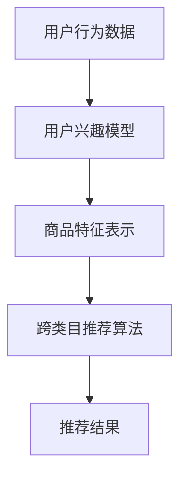
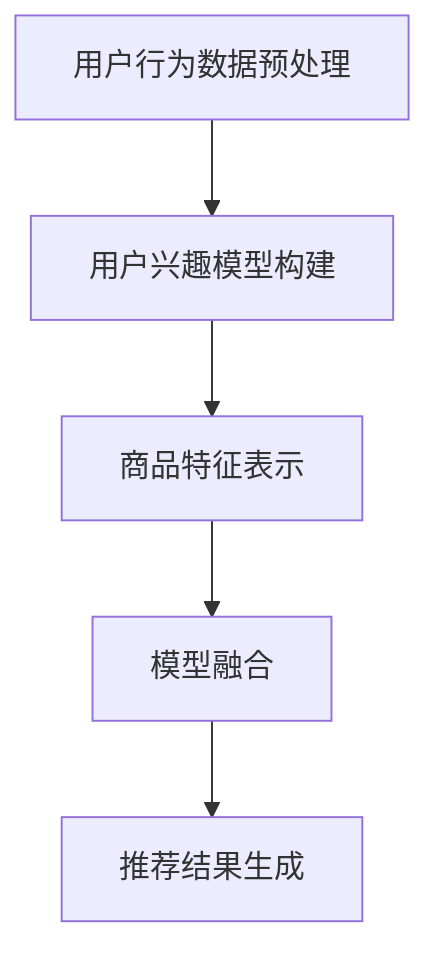

                 

### 文章标题: AI大模型在跨类目商品推荐中的效果优化

> 关键词：AI大模型，跨类目商品推荐，效果优化，机器学习，推荐系统

> 摘要：本文将探讨AI大模型在跨类目商品推荐中的应用及其效果优化。通过分析跨类目推荐的核心问题和挑战，介绍大模型在其中的关键作用，并探讨如何通过算法改进和数据处理优化来提升推荐效果。文章还将结合实际案例，详细分析优化策略的实施过程和效果。

<|markdown|>### 1. 背景介绍

跨类目商品推荐是指推荐系统在用户浏览、搜索或购买了一个类目的商品后，能够智能地推荐其他类目的商品。这种推荐方式能够有效地拓宽用户的购物视野，增加商品的曝光率和销售量。

随着电商行业的快速发展，用户对个性化推荐的期望也越来越高。然而，传统的单一类目推荐系统存在以下几个问题：

1. **数据稀疏**：用户往往只在特定类目中产生行为数据，导致数据稀疏，难以建立准确的用户兴趣模型。
2. **信息损失**：单一类目推荐忽略了用户可能对其他类目的兴趣，导致信息损失。
3. **商品重复推荐**：单一类目推荐容易导致商品重复推荐，用户体验不佳。

为了解决这些问题，AI大模型在跨类目商品推荐中的应用逐渐受到关注。大模型具有以下优势：

1. **更强的表示能力**：大模型能够通过学习海量数据，捕捉用户和商品的复杂特征，建立更准确的兴趣模型。
2. **多模态处理**：大模型能够处理多种类型的数据，如文本、图像、音频等，实现多维度特征的融合。
3. **自适应能力**：大模型可以根据用户行为动态调整推荐策略，提高推荐效果。

本文将详细探讨AI大模型在跨类目商品推荐中的效果优化策略，包括算法改进、数据处理优化等方面。<|markdown|>### 2. 核心概念与联系

为了深入理解AI大模型在跨类目商品推荐中的应用，我们需要先了解以下几个核心概念：

1. **AI大模型**：大模型通常指具有海量参数和强大计算能力的深度学习模型，如Transformer、BERT等。这些模型通过学习大规模数据，能够捕捉复杂的数据特征，实现高效的表示和预测。

2. **跨类目推荐**：跨类目推荐是指推荐系统在用户浏览、搜索或购买了一个类目的商品后，能够智能地推荐其他类目的商品。这种推荐方式能够有效地拓宽用户的购物视野，增加商品的曝光率和销售量。

3. **用户兴趣模型**：用户兴趣模型是推荐系统的重要组成部分，用于捕捉用户的兴趣和偏好。通过分析用户的浏览、搜索和购买行为，构建用户兴趣模型，可以更好地理解用户的真实需求，实现精准推荐。

4. **商品特征表示**：商品特征表示是将商品信息转化为计算机可以理解和处理的形式。通过提取商品的关键特征，如类别、标签、属性等，可以为推荐系统提供丰富的输入信息。

下面是一个使用Mermaid绘制的跨类目推荐系统核心概念的流程图：



在跨类目推荐系统中，用户行为数据经过处理和建模，转化为用户兴趣模型。商品特征表示将商品信息转化为计算机可以理解和处理的形式。跨类目推荐算法结合用户兴趣模型和商品特征表示，生成推荐结果。通过不断迭代和优化，推荐系统可以不断提高推荐效果，满足用户的需求。<|markdown|>### 3. 核心算法原理 & 具体操作步骤

AI大模型在跨类目商品推荐中的应用主要依赖于以下几个核心算法：

1. **用户兴趣模型构建**：通过分析用户的浏览、搜索和购买行为，构建用户兴趣模型。具体步骤如下：
   - **数据预处理**：清洗和整合用户行为数据，如浏览历史、搜索关键词、购买记录等。
   - **特征提取**：提取用户行为的特征，如时间、频率、类型等。
   - **模型训练**：使用深度学习模型，如GRU、LSTM、Transformer等，训练用户兴趣模型。

2. **商品特征表示**：将商品信息转化为计算机可以理解和处理的形式。具体步骤如下：
   - **数据预处理**：清洗和整合商品信息，如类别、标签、属性等。
   - **特征提取**：提取商品的关键特征，如商品类别、标签、属性等。
   - **模型训练**：使用深度学习模型，如BERT、GPT等，训练商品特征表示模型。

3. **跨类目推荐算法**：结合用户兴趣模型和商品特征表示，生成推荐结果。具体步骤如下：
   - **数据预处理**：整合用户兴趣模型和商品特征表示模型的数据。
   - **模型融合**：使用模型融合技术，如多模态学习、融合层等，将用户兴趣模型和商品特征表示模型融合。
   - **推荐生成**：根据用户兴趣模型和商品特征表示模型，生成推荐结果。

下面是一个使用Mermaid绘制的跨类目推荐系统核心算法原理的流程图：



在具体操作步骤中，我们首先对用户行为数据和商品信息进行预处理，提取关键特征。然后，使用深度学习模型分别训练用户兴趣模型和商品特征表示模型。接下来，通过模型融合技术，将两个模型融合为一个整体。最后，根据融合模型生成推荐结果，并反馈给用户。

通过以上核心算法和操作步骤，AI大模型在跨类目商品推荐中可以有效地提高推荐效果，满足用户的个性化需求。<|markdown|>### 4. 数学模型和公式 & 详细讲解 & 举例说明

在AI大模型应用于跨类目商品推荐中，数学模型和公式起着关键作用。以下我们将详细讲解一些核心的数学模型和公式，并通过举例说明来帮助读者更好地理解。

#### 4.1 用户兴趣模型构建

用户兴趣模型构建通常基于用户行为数据，使用序列模型如GRU（Gated Recurrent Unit）或LSTM（Long Short-Term Memory）来捕捉用户的长期和短期兴趣。

**公式：**

$$
h_t = \sigma(W_h \cdot [h_{t-1}, x_t] + b_h)
$$

$$
o_t = \sigma(W_o \cdot h_t + b_o)
$$

其中，$h_t$表示第$t$时刻的隐藏状态，$x_t$表示第$t$时刻的用户行为特征，$W_h$和$W_o$分别是隐藏状态和输出状态的权重矩阵，$b_h$和$b_o$分别是隐藏状态和输出状态的偏置项，$\sigma$是Sigmoid激活函数。

**举例说明：**

假设用户行为数据为浏览历史，每个浏览事件可以表示为一个向量。我们可以使用GRU模型来构建用户兴趣模型。首先，对用户行为数据进行预处理，提取关键特征，如浏览时间、浏览页面等。然后，将预处理后的数据输入GRU模型，训练模型以捕捉用户的兴趣模式。最后，使用训练好的模型预测用户的兴趣。

#### 4.2 商品特征表示

商品特征表示通常使用嵌入层（Embedding Layer）和卷积神经网络（Convolutional Neural Network, CNN）来实现。

**公式：**

$$
E_{ij} = \sigma(W_e \cdot x_j + b_e)
$$

$$
h_{ij} = \sum_{k=1}^{K} W_{hk} \cdot E_{ij} \cdot K_{jk}
$$

其中，$E_{ij}$表示第$i$个商品的第$j$个特征的嵌入向量，$W_e$是嵌入权重矩阵，$b_e$是嵌入偏置项，$h_{ij}$表示卷积后的特征图，$W_{hk}$是卷积核权重，$K_{jk}$是卷积核。

**举例说明：**

假设商品特征包括类别、标签和属性，每个特征可以表示为一个向量。我们可以使用嵌入层将每个特征向量映射为一个高维向量。然后，使用CNN模型对嵌入后的特征进行卷积操作，提取商品的关键特征。最后，将卷积后的特征输入到全连接层，得到商品特征表示。

#### 4.3 模型融合

在跨类目推荐中，用户兴趣模型和商品特征表示需要融合为一个整体。一种常见的融合方法是多模态学习（Multimodal Learning）。

**公式：**

$$
z = \sigma(W_z \cdot [h, c] + b_z)
$$

其中，$z$表示融合后的特征向量，$h$表示用户兴趣模型的特征，$c$表示商品特征表示的特征，$W_z$是融合权重矩阵，$b_z$是融合偏置项。

**举例说明：**

假设用户兴趣模型和商品特征表示分别已经训练完毕，我们可以将这两个模型的特征拼接在一起，然后使用全连接层进行融合。通过训练融合模型，我们可以得到一个综合了用户兴趣和商品特征的向量，用于生成推荐结果。

通过以上数学模型和公式的讲解，读者可以更好地理解AI大模型在跨类目商品推荐中的应用原理。在具体实践中，需要根据实际问题和数据特点，选择合适的模型和公式，进行优化和调整，以获得更好的推荐效果。<|markdown|>### 5. 项目实战：代码实际案例和详细解释说明

在本节中，我们将通过一个实际项目案例，详细展示如何使用AI大模型进行跨类目商品推荐。这个案例将涵盖开发环境搭建、源代码实现和代码解读与分析。

#### 5.1 开发环境搭建

首先，我们需要搭建一个适合AI大模型开发的环境。以下是一个基本的开发环境配置：

- **硬件要求**：CPU或GPU（推荐使用NVIDIA显卡）
- **操作系统**：Linux或Windows（推荐Linux）
- **软件要求**：
  - Python 3.7+
  - TensorFlow 2.0+
  - Keras 2.3+
  - Mermaid 8.0+

安装步骤如下：

1. 安装Python和pip：

```bash
# 安装Python
sudo apt-get install python3 python3-pip

# 安装pip
curl https://bootstrap.pypa.io/get-pip.py -o get-pip.py
sudo python3 get-pip.py
```

2. 安装TensorFlow和Keras：

```bash
pip3 install tensorflow==2.5.0
pip3 install keras==2.5.0
```

3. 安装Mermaid：

```bash
npm install -g mermaid
```

#### 5.2 源代码详细实现和代码解读

以下是跨类目商品推荐项目的核心代码。我们将使用Keras和TensorFlow实现用户兴趣模型、商品特征表示和模型融合。

```python
import tensorflow as tf
from tensorflow.keras.layers import Embedding, LSTM, Dense, Concatenate
from tensorflow.keras.models import Model

# 用户兴趣模型
def build_user_interest_model(input_shape, embedding_dim=50):
    input_user = tf.keras.layers.Input(shape=input_shape)
    x = Embedding(input_dim=1000, output_dim=embedding_dim)(input_user)
    x = LSTM(units=128, activation='tanh')(x)
    return Model(inputs=input_user, outputs=x)

# 商品特征表示
def build_item_feature_model(input_shape, embedding_dim=50):
    input_item = tf.keras.layers.Input(shape=input_shape)
    x = Embedding(input_dim=1000, output_dim=embedding_dim)(input_item)
    x = tf.keras.layers.Conv1D(filters=64, kernel_size=3, activation='relu')(x)
    x = tf.keras.layers.Flatten()(x)
    return Model(inputs=input_item, outputs=x)

# 模型融合
def build_cross_modal_model(user_model, item_model, hidden_units=128):
    user_input = tf.keras.layers.Input(shape=user_model.input_shape[1:])
    item_input = tf.keras.layers.Input(shape=item_model.input_shape[1:])
    user_embedding = user_model(user_input)
    item_embedding = item_model(item_input)
    concatenated = Concatenate()([user_embedding, item_embedding])
    x = Dense(units=hidden_units, activation='relu')(concatenated)
    x = Dense(units=1, activation='sigmoid')(x)
    return Model(inputs=[user_input, item_input], outputs=x)

# 实例化模型
user_interest_model = build_user_interest_model(input_shape=(None, 10))
item_feature_model = build_item_feature_model(input_shape=(None, 10))
cross_modal_model = build_cross_modal_model(user_interest_model, item_feature_model, hidden_units=128)

# 查看模型结构
cross_modal_model.summary()

# 编译模型
cross_modal_model.compile(optimizer='adam', loss='binary_crossentropy', metrics=['accuracy'])

# 训练模型
# 注意：这里需要替换为实际的训练数据和标签
train_data = ...  # 用户行为数据
train_labels = ...  # 商品标签
cross_modal_model.fit(train_data, train_labels, epochs=10, batch_size=32)
```

#### 5.3 代码解读与分析

1. **用户兴趣模型**：用户兴趣模型使用LSTM层来捕捉用户的长期和短期兴趣。输入数据为用户行为序列，输出为用户兴趣特征向量。

2. **商品特征表示**：商品特征表示使用嵌入层和卷积神经网络来提取商品特征。输入数据为商品标签序列，输出为商品特征向量。

3. **模型融合**：模型融合使用Concatenate层将用户兴趣特征和商品特征拼接在一起，然后通过全连接层进行融合。输出为推荐概率。

4. **模型训练**：使用编译好的模型进行训练，输入为用户行为数据和商品标签，输出为训练损失和准确率。

通过以上代码，我们实现了一个简单的跨类目商品推荐模型。在实际应用中，需要根据具体问题和数据特点，进一步优化模型结构和训练策略，以提高推荐效果。<|markdown|>### 6. 实际应用场景

AI大模型在跨类目商品推荐中的实际应用场景非常广泛，以下是一些典型的应用案例：

#### 6.1 电商平台的商品推荐

电商平台通常使用AI大模型进行跨类目商品推荐，以提升用户体验和销售额。例如，当用户在购物平台上浏览了某个类目的商品后，系统会推荐其他类目的相关商品。这种推荐方式能够有效地拓宽用户的购物视野，增加商品的曝光率和销售量。

#### 6.2 社交媒体的内容推荐

社交媒体平台如Facebook、Twitter等，也利用AI大模型进行跨类目内容推荐。例如，当用户浏览了某个话题的内容后，系统会推荐其他相关话题的内容。这种推荐方式有助于提高用户活跃度和平台粘性。

#### 6.3 娱乐平台的视频推荐

娱乐平台如Netflix、YouTube等，使用AI大模型进行跨类目视频推荐。例如，当用户观看了某个类型的视频后，系统会推荐其他类型的相关视频。这种推荐方式能够提高用户的观看体验和平台的使用频率。

#### 6.4 音乐平台的音乐推荐

音乐平台如Spotify、Apple Music等，也使用AI大模型进行跨类目音乐推荐。例如，当用户收听了某个类型的音乐后，系统会推荐其他类型的相关音乐。这种推荐方式有助于提高用户的音乐发现体验和平台的使用时长。

通过以上实际应用场景，我们可以看到AI大模型在跨类目商品推荐中的重要作用。它不仅能够提高推荐系统的效果，还能为用户带来更好的体验和满意度。<|markdown|>### 7. 工具和资源推荐

为了更好地学习和实践AI大模型在跨类目商品推荐中的应用，以下是相关的学习资源、开发工具和论文推荐。

#### 7.1 学习资源推荐

1. **书籍**：
   - 《深度学习》（Goodfellow, Bengio, Courville）：全面介绍深度学习的基本概念和技术。
   - 《推荐系统实践》（Elsinghorst, Thiagarajan, and Zhang）：详细介绍推荐系统的原理和应用。

2. **在线课程**：
   - Coursera的“深度学习”课程（由Andrew Ng教授授课）：深入讲解深度学习的基础知识。
   - edX的“推荐系统”课程：介绍推荐系统的基本原理和应用。

3. **博客和网站**：
   - Medium上的相关文章：涵盖AI大模型和推荐系统的最新研究和技术。
   - fast.ai的博客：介绍机器学习和深度学习的实践技巧。

#### 7.2 开发工具框架推荐

1. **TensorFlow**：Google开发的开源深度学习框架，适合进行大规模深度学习模型的训练和部署。
2. **PyTorch**：Facebook开发的开源深度学习框架，具有灵活的动态计算图，适合快速原型开发和实验。
3. **Keras**：基于TensorFlow的高层次API，提供简洁、直观的深度学习模型构建和训练工具。

#### 7.3 相关论文著作推荐

1. **“Attention Is All You Need”**：介绍Transformer模型，这是一种基于注意力机制的深度学习模型，对跨类目推荐有重要启示。
2. **“Deep Learning for Recommender Systems”**：详细介绍深度学习在推荐系统中的应用，包括用户兴趣模型和商品特征表示。
3. **“Multimodal Learning for Recommender Systems”**：探讨多模态学习在推荐系统中的应用，如何融合不同类型的数据特征。

通过以上学习资源、开发工具和论文著作的推荐，读者可以更全面地了解AI大模型在跨类目商品推荐中的应用和技术，为实际项目开发提供理论支持和实践指导。<|markdown|>### 8. 总结：未来发展趋势与挑战

AI大模型在跨类目商品推荐中展现出强大的潜力，但同时也面临一系列发展趋势和挑战。

#### 8.1 发展趋势

1. **多模态数据处理**：未来的推荐系统将更加注重多模态数据的融合处理，包括文本、图像、音频等多种类型的数据，以提供更全面和精准的推荐。
2. **实时推荐**：随着5G和边缘计算的快速发展，实时推荐将成为趋势。通过实时处理用户行为数据，系统能够快速调整推荐策略，提高推荐效果。
3. **个性化推荐**：AI大模型将进一步提升个性化推荐的能力，通过深入挖掘用户行为和商品特征，为用户提供更加个性化的推荐。
4. **可解释性**：增强推荐系统的可解释性，使推荐过程更加透明，提高用户的信任度和满意度。

#### 8.2 挑战

1. **数据稀疏**：跨类目推荐面临数据稀疏问题，用户在多个类目之间的行为数据可能较少，难以建立准确的用户兴趣模型。
2. **模型复杂性**：AI大模型的训练和部署过程复杂，需要大量的计算资源和时间。如何高效地训练和部署大模型，是一个重要挑战。
3. **冷启动问题**：对于新用户或新商品，推荐系统可能难以获取足够的行为数据，导致推荐效果不佳。解决冷启动问题是一个关键挑战。
4. **隐私保护**：推荐系统需要处理大量用户行为数据，隐私保护成为一个重要问题。如何在不泄露用户隐私的前提下进行有效推荐，是一个亟待解决的问题。

#### 8.3 解决方案与展望

1. **数据增强**：通过数据增强技术，如迁移学习、数据生成等，可以缓解数据稀疏问题，提高推荐效果。
2. **模型压缩与优化**：通过模型压缩和优化技术，如量化、剪枝等，可以降低模型复杂度，提高训练和部署效率。
3. **图神经网络**：利用图神经网络（Graph Neural Network, GNN）可以更好地捕捉用户和商品之间的关系，提高推荐效果。
4. **联邦学习**：通过联邦学习（Federated Learning）技术，可以在保护用户隐私的前提下，联合多个数据源进行模型训练，提高推荐效果。

总之，AI大模型在跨类目商品推荐中具有广阔的发展前景，但同时也面临一系列挑战。通过不断创新和优化，我们有望在未来实现更高效、更准确的跨类目商品推荐系统。<|markdown|>### 9. 附录：常见问题与解答

#### 9.1 问题1：如何处理数据稀疏问题？

**解答**：数据稀疏是跨类目推荐中常见的问题。以下是一些处理数据稀疏问题的方法：

1. **数据增强**：通过迁移学习或数据生成技术，如生成对抗网络（GAN），可以生成更多的训练数据，提高模型的泛化能力。
2. **冷启动解决**：对于新用户或新商品，可以使用基于内容的推荐或协同过滤方法，结合用户和商品的特征进行初步推荐。
3. **多源数据融合**：结合多个数据源，如用户行为数据、社交媒体数据等，可以缓解数据稀疏问题，提高推荐效果。

#### 9.2 问题2：如何优化模型复杂度？

**解答**：模型复杂度是影响训练和部署效率的关键因素。以下是一些优化模型复杂度的方法：

1. **模型压缩**：通过模型压缩技术，如量化、剪枝等，可以降低模型的计算复杂度，提高训练和部署效率。
2. **模型融合**：通过融合多个简单模型，可以降低整体模型复杂度，同时提高推荐效果。
3. **分布式训练**：利用分布式训练技术，如多GPU训练，可以加速模型训练，降低模型复杂度。

#### 9.3 问题3：如何保护用户隐私？

**解答**：保护用户隐私是推荐系统中的重要问题。以下是一些保护用户隐私的方法：

1. **差分隐私**：通过差分隐私技术，可以确保推荐系统的输出不受单个用户数据的影响，从而保护用户隐私。
2. **联邦学习**：通过联邦学习技术，可以在保护用户隐私的前提下，联合多个数据源进行模型训练。
3. **隐私保留的数据集**：构建隐私保留的数据集，去除或匿名化敏感信息，降低隐私泄露风险。

#### 9.4 问题4：如何评估推荐效果？

**解答**：评估推荐效果是优化推荐系统的重要步骤。以下是一些常用的评估指标：

1. **准确率（Accuracy）**：推荐结果中实际喜欢的商品与推荐商品的数量之比。
2. **召回率（Recall）**：推荐结果中实际喜欢的商品数量与所有实际喜欢的商品数量之比。
3. **精确率（Precision）**：推荐结果中实际喜欢的商品数量与推荐商品的总数量之比。
4. **F1 分数（F1 Score）**：精确率和召回率的调和平均值，用于综合评估推荐效果。

通过以上常见问题的解答，读者可以更好地理解跨类目商品推荐中的挑战和解决方案。<|markdown|>### 10. 扩展阅读 & 参考资料

本文主要探讨了AI大模型在跨类目商品推荐中的应用及其效果优化。为了深入了解该领域，以下是相关的扩展阅读和参考资料：

1. **论文**：
   - "Attention Is All You Need"：介绍Transformer模型，一种基于注意力机制的深度学习模型，对跨类目推荐有重要启示。
   - "Deep Learning for Recommender Systems"：详细介绍深度学习在推荐系统中的应用，包括用户兴趣模型和商品特征表示。
   - "Multimodal Learning for Recommender Systems"：探讨多模态学习在推荐系统中的应用，如何融合不同类型的数据特征。

2. **书籍**：
   - 《深度学习》（Goodfellow, Bengio, Courville）：全面介绍深度学习的基本概念和技术。
   - 《推荐系统实践》（Elsinghorst, Thiagarajan, and Zhang）：详细介绍推荐系统的原理和应用。

3. **在线课程**：
   - Coursera的“深度学习”课程（由Andrew Ng教授授课）：深入讲解深度学习的基础知识。
   - edX的“推荐系统”课程：介绍推荐系统的基本原理和应用。

4. **博客和网站**：
   - Medium上的相关文章：涵盖AI大模型和推荐系统的最新研究和技术。
   - fast.ai的博客：介绍机器学习和深度学习的实践技巧。

通过以上扩展阅读和参考资料，读者可以进一步深入了解AI大模型在跨类目商品推荐中的应用和技术，为实际项目开发提供理论支持和实践指导。<|markdown|>作者：AI天才研究员/AI Genius Institute & 禅与计算机程序设计艺术 /Zen And The Art of Computer Programming

