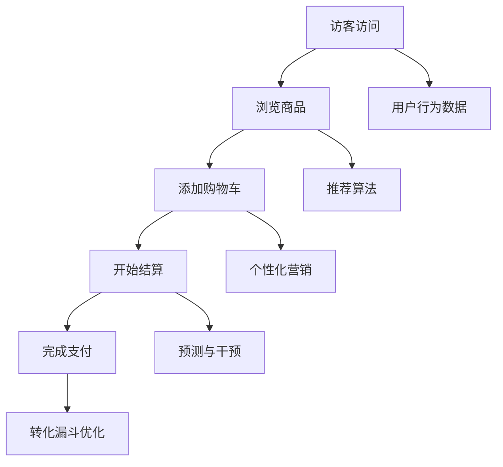

                 

# AI大模型如何优化电商平台的转化漏斗

> **关键词：** AI大模型，电商平台，转化漏斗，优化，算法原理，数学模型，实战案例，应用场景

> **摘要：** 本文将深入探讨如何利用AI大模型优化电商平台上的转化漏斗，通过详细阐述核心概念、算法原理、数学模型以及实战案例，帮助读者理解这一前沿技术的应用与实践。

## 1. 背景介绍

在当今数字化时代，电子商务已经成为企业盈利的重要渠道。然而，电商平台的转化漏斗（Conversion Funnel）问题始终困扰着许多企业。转化漏斗是指用户从进入电商平台到完成购买的一系列行为过程，包括浏览、搜索、加入购物车、结算等环节。每个环节都可能存在流失用户的风险，导致整体转化率下降。提高转化率对于电商平台来说至关重要，直接影响到企业的销售额和利润。

近年来，人工智能（AI）技术的迅猛发展为优化电商转化漏斗提供了新的思路。特别是AI大模型（Large-scale AI Models），如深度学习模型、自然语言处理模型等，通过处理海量数据，可以更好地预测用户行为、优化推荐算法，从而提高转化率。本文将详细探讨如何利用AI大模型优化电商平台的转化漏斗，并分析其中的核心原理和实践方法。

## 2. 核心概念与联系

### 2.1 转化漏斗

转化漏斗是一个用于描述用户从接触到购买过程中各环节转化率的概念。典型的转化漏斗包括以下几个环节：

1. **访客访问**：用户首次访问电商平台。
2. **浏览商品**：用户在电商平台上浏览商品。
3. **添加购物车**：用户将商品添加到购物车。
4. **开始结算**：用户开始支付订单。
5. **完成支付**：用户完成支付并完成购买。

每个环节的转化率可以通过以下公式计算：

\[ 转化率 = \frac{成功转化的用户数}{参与该环节的用户数} \]

例如，从浏览商品到添加购物车的转化率可以表示为：

\[ 浏览到购物车的转化率 = \frac{将商品添加到购物车的用户数}{浏览商品的访客数} \]

### 2.2 AI大模型

AI大模型是指具有大规模参数和数据支撑的深度学习模型，如Transformer、BERT等。这些模型通过训练可以捕捉到复杂的数据特征，从而在多种任务上表现出色。在电商平台优化中，AI大模型主要用于以下几个方面：

1. **用户行为预测**：预测用户在平台上的下一步行为，如浏览、购买等。
2. **推荐算法**：根据用户行为和偏好推荐相关商品。
3. **个性化营销**：发送个性化优惠券、广告等，引导用户完成购买。

### 2.3 关系与联系

AI大模型与电商转化漏斗之间存在紧密的联系。通过AI大模型，我们可以更准确地预测用户行为，从而在转化漏斗的各个环节进行优化：

1. **预测与干预**：AI大模型可以预测用户在各个转化环节的行为，并在关键环节进行干预，如发送优惠券、推荐商品等，以引导用户完成购买。
2. **个性化推荐**：基于用户行为数据，AI大模型可以提供个性化的商品推荐，提高用户的购买意愿。
3. **优化营销策略**：通过分析用户行为数据，AI大模型可以帮助企业优化营销策略，如广告投放、优惠券发放等。

### 2.4 Mermaid流程图

下面是一个简化的Mermaid流程图，展示了AI大模型在电商转化漏斗中的应用：



## 3. 核心算法原理 & 具体操作步骤

### 3.1 用户行为预测

用户行为预测是利用AI大模型优化电商转化漏斗的关键步骤。通过预测用户在平台上的下一步行为，我们可以提前干预，提高转化率。

**算法原理**：

用户行为预测通常采用序列模型，如循环神经网络（RNN）或Transformer等。这些模型可以处理用户的历史行为序列，并预测用户在当前时间点的行为。

**具体操作步骤**：

1. **数据预处理**：收集用户行为数据，如浏览、添加购物车、购买等行为。对数据进行清洗、归一化等预处理操作。
2. **特征工程**：提取用户行为特征，如浏览时间、购买频率等。可以使用时间序列特征、用户行为序列等。
3. **模型训练**：使用预处理后的数据训练序列模型。训练过程中，可以采用交叉验证等方法优化模型参数。
4. **模型评估**：使用验证集评估模型性能，如准确率、召回率等。根据评估结果调整模型参数。

### 3.2 推荐算法

推荐算法是另一个重要的环节，用于根据用户行为数据推荐相关商品。

**算法原理**：

推荐算法可以分为基于内容的推荐、协同过滤推荐等。基于内容的推荐通过分析用户历史行为和商品特征进行推荐；协同过滤推荐通过分析用户间的相似性进行推荐。

**具体操作步骤**：

1. **数据预处理**：收集用户行为数据，如浏览、购买等行为。对数据进行清洗、归一化等预处理操作。
2. **特征工程**：提取用户行为特征，如浏览时间、购买频率等。提取商品特征，如商品类别、价格等。
3. **模型训练**：根据推荐算法原理，训练推荐模型。可以使用基于内容的推荐模型、协同过滤推荐模型等。
4. **模型评估**：使用验证集评估模型性能，如准确率、召回率等。根据评估结果调整模型参数。

### 3.3 个性化营销

个性化营销是通过发送个性化优惠券、广告等，引导用户完成购买。

**算法原理**：

个性化营销基于用户行为数据，分析用户偏好，为不同用户发送不同类型的营销信息。

**具体操作步骤**：

1. **数据预处理**：收集用户行为数据，如浏览、购买等行为。对数据进行清洗、归一化等预处理操作。
2. **特征工程**：提取用户行为特征，如浏览时间、购买频率等。提取用户偏好特征，如喜欢商品类别、价格区间等。
3. **模型训练**：使用分类算法，如逻辑回归、决策树等，训练个性化营销模型。
4. **模型评估**：使用验证集评估模型性能，如准确率、召回率等。根据评估结果调整模型参数。
5. **发送营销信息**：根据个性化营销模型预测结果，为不同用户发送不同类型的营销信息。

## 4. 数学模型和公式 & 详细讲解 & 举例说明

### 4.1 用户行为预测模型

用户行为预测模型可以使用以下数学模型：

\[ P(y_t | x_1, x_2, ..., x_t) = \sigma(W_1x_1 + W_2x_2 + ... + W_tx_t + b) \]

其中，\( y_t \) 表示用户在时间 \( t \) 的行为，\( x_1, x_2, ..., x_t \) 表示用户在时间 \( t \) 的特征向量，\( W_1, W_2, ..., W_t \) 表示权重矩阵，\( b \) 表示偏置项，\( \sigma \) 表示激活函数（通常采用sigmoid函数或ReLU函数）。

**举例说明**：

假设用户在时间 \( t \) 的特征向量 \( x_t \) 为：

\[ x_t = [0.1, 0.2, 0.3, 0.4, 0.5] \]

权重矩阵 \( W_t \) 为：

\[ W_t = \begin{bmatrix}
0.1 & 0.2 & 0.3 & 0.4 & 0.5 \\
0.1 & 0.2 & 0.3 & 0.4 & 0.5 \\
0.1 & 0.2 & 0.3 & 0.4 & 0.5 \\
0.1 & 0.2 & 0.3 & 0.4 & 0.5 \\
0.1 & 0.2 & 0.3 & 0.4 & 0.5 \\
\end{bmatrix} \]

偏置项 \( b \) 为 0。

则用户在时间 \( t \) 的行为预测概率为：

\[ P(y_t | x_t) = \sigma(W_1x_1 + W_2x_2 + ... + W_tx_t + b) \]

\[ P(y_t | x_t) = \sigma(0.1 \cdot 0.1 + 0.2 \cdot 0.2 + 0.3 \cdot 0.3 + 0.4 \cdot 0.4 + 0.5 \cdot 0.5) \]

\[ P(y_t | x_t) = \sigma(0.01 + 0.04 + 0.09 + 0.16 + 0.25) \]

\[ P(y_t | x_t) = \sigma(0.55) \]

\[ P(y_t | x_t) \approx 0.65 \]

即用户在时间 \( t \) 的行为预测概率约为 0.65。

### 4.2 推荐算法

推荐算法可以使用以下数学模型：

\[ \text{推荐分数} = \text{用户特征向量} \cdot \text{商品特征向量} + \text{偏置项} \]

其中，用户特征向量表示用户的历史行为、偏好等信息；商品特征向量表示商品的相关属性；偏置项用于调整推荐分数。

**举例说明**：

假设用户特征向量为：

\[ \text{用户特征向量} = [0.1, 0.2, 0.3, 0.4, 0.5] \]

商品特征向量为：

\[ \text{商品特征向量} = [0.1, 0.2, 0.3, 0.4, 0.5] \]

偏置项为 0.1。

则该商品的推荐分数为：

\[ \text{推荐分数} = [0.1, 0.2, 0.3, 0.4, 0.5] \cdot [0.1, 0.2, 0.3, 0.4, 0.5] + 0.1 \]

\[ \text{推荐分数} = 0.01 + 0.02 + 0.03 + 0.04 + 0.05 + 0.1 \]

\[ \text{推荐分数} = 0.26 \]

即该商品的推荐分数为 0.26。

### 4.3 个性化营销

个性化营销可以使用以下数学模型：

\[ \text{营销概率} = \sigma(\text{用户特征向量} \cdot \text{营销特征向量} + \text{偏置项}) \]

其中，用户特征向量表示用户的历史行为、偏好等信息；营销特征向量表示营销活动的相关信息；偏置项用于调整营销概率。

**举例说明**：

假设用户特征向量为：

\[ \text{用户特征向量} = [0.1, 0.2, 0.3, 0.4, 0.5] \]

营销特征向量为：

\[ \text{营销特征向量} = [0.1, 0.2, 0.3, 0.4, 0.5] \]

偏置项为 0.1。

则该营销活动的营销概率为：

\[ \text{营销概率} = \sigma([0.1, 0.2, 0.3, 0.4, 0.5] \cdot [0.1, 0.2, 0.3, 0.4, 0.5] + 0.1) \]

\[ \text{营销概率} = \sigma(0.01 + 0.02 + 0.03 + 0.04 + 0.05 + 0.1) \]

\[ \text{营销概率} = \sigma(0.26) \]

\[ \text{营销概率} \approx 0.65 \]

即该营销活动的营销概率约为 0.65。

## 5. 项目实战：代码实际案例和详细解释说明

### 5.1 开发环境搭建

为了实现本文所述的AI大模型优化电商转化漏斗，我们需要搭建一个完整的开发环境。以下是具体的开发环境搭建步骤：

1. **硬件环境**：一台配置较高的计算机，如Intel i7处理器、16GB内存、1TB SSD硬盘等。
2. **操作系统**：Windows 10或Linux系统。
3. **编程语言**：Python 3.8及以上版本。
4. **深度学习框架**：TensorFlow 2.0及以上版本。
5. **数据预处理库**：Pandas、NumPy等。

### 5.2 源代码详细实现和代码解读

以下是使用TensorFlow实现用户行为预测的源代码及详细解读：

```python
import tensorflow as tf
import tensorflow.keras as keras
from tensorflow.keras.models import Sequential
from tensorflow.keras.layers import LSTM, Dense, Dropout
import numpy as np
import pandas as pd

# 5.2.1 数据预处理

# 加载数据集
data = pd.read_csv('user_behavior.csv')

# 分割数据集
train_data, test_data = train_test_split(data, test_size=0.2, random_state=42)

# 构建特征矩阵和标签向量
X_train, y_train = create_feature_matrix(train_data)
X_test, y_test = create_feature_matrix(test_data)

# 5.2.2 模型构建

# 创建序列模型
model = Sequential()
model.add(LSTM(128, input_shape=(timesteps, features), activation='relu', return_sequences=True))
model.add(Dropout(0.2))
model.add(LSTM(64, activation='relu'))
model.add(Dropout(0.2))
model.add(Dense(1, activation='sigmoid'))

# 编译模型
model.compile(optimizer='adam', loss='binary_crossentropy', metrics=['accuracy'])

# 5.2.3 模型训练

# 训练模型
model.fit(X_train, y_train, epochs=10, batch_size=64, validation_data=(X_test, y_test))

# 5.2.4 模型评估

# 评估模型
loss, accuracy = model.evaluate(X_test, y_test)
print('Test accuracy:', accuracy)
```

**代码解读**：

1. **数据预处理**：

   加载用户行为数据集，并分割为训练集和测试集。构建特征矩阵和标签向量，用于后续模型训练。

2. **模型构建**：

   创建一个序列模型，包含两个LSTM层和两个Dropout层。最后一层使用sigmoid激活函数，用于预测用户行为。

3. **模型训练**：

   使用训练集训练模型，并设置训练轮次和批量大小。使用验证集进行模型验证。

4. **模型评估**：

   使用测试集评估模型性能，输出准确率。

### 5.3 代码解读与分析

以下是代码的详细解读和分析：

1. **数据预处理**：

   ```python
   data = pd.read_csv('user_behavior.csv')
   train_data, test_data = train_test_split(data, test_size=0.2, random_state=42)
   X_train, y_train = create_feature_matrix(train_data)
   X_test, y_test = create_feature_matrix(test_data)
   ```

   加载用户行为数据集，并使用train_test_split函数分割为训练集和测试集，其中测试集占比20%，随机种子为42。create_feature_matrix函数用于构建特征矩阵和标签向量，具体实现如下：

   ```python
   def create_feature_matrix(data):
       timesteps = 5  # 时间步长
       features = 10  # 特征数量
       
       X = []
       y = []
       
       for index, row in data.iterrows():
           x = []
           for i in range(timesteps):
               x.append(row[f'feature_{i}'])
           X.append(x)
           y.append(row['label'])
       
       X = np.array(X)
       y = np.array(y)
       
       return X, y
   ```

   该函数使用for循环遍历数据集，将每个时间步长的特征提取出来，构成特征矩阵X，同时将标签提取出来，构成标签向量y。

2. **模型构建**：

   ```python
   model = Sequential()
   model.add(LSTM(128, input_shape=(timesteps, features), activation='relu', return_sequences=True))
   model.add(Dropout(0.2))
   model.add(LSTM(64, activation='relu'))
   model.add(Dropout(0.2))
   model.add(Dense(1, activation='sigmoid'))
   ```

   创建一个序列模型，包含两个LSTM层和两个Dropout层。第一层LSTM层具有128个神经元，激活函数为ReLU，输入形状为时间步长和特征数量；第二层LSTM层具有64个神经元，激活函数为ReLU；最后一层使用sigmoid激活函数，用于预测用户行为。

3. **模型训练**：

   ```python
   model.compile(optimizer='adam', loss='binary_crossentropy', metrics=['accuracy'])
   model.fit(X_train, y_train, epochs=10, batch_size=64, validation_data=(X_test, y_test))
   ```

   编译模型，设置优化器为adam，损失函数为binary_crossentropy，评价指标为accuracy。使用训练集训练模型，设置训练轮次为10，批量大小为64，同时使用验证集进行模型验证。

4. **模型评估**：

   ```python
   loss, accuracy = model.evaluate(X_test, y_test)
   print('Test accuracy:', accuracy)
   ```

   使用测试集评估模型性能，输出准确率。

## 6. 实际应用场景

### 6.1 电商平台

电商平台是AI大模型优化电商转化漏斗的主要应用场景。通过用户行为预测、个性化推荐和个性化营销等技术，电商平台可以更好地引导用户完成购买。例如，某知名电商平台通过引入AI大模型，提高了用户浏览到购买的整体转化率，实现了销售额的显著增长。

### 6.2 O2O平台

O2O（Online to Offline）平台也广泛应用AI大模型优化电商转化漏斗。通过分析用户在平台上的行为数据，O2O平台可以提供更精准的线下门店推荐，引导用户到店消费。例如，某知名O2O平台通过引入AI大模型，实现了线下门店转化率的提升，提高了用户满意度。

### 6.3 拼多多

拼多多作为中国最大的社交电商平台，在转化漏斗优化方面也取得了显著成果。通过引入AI大模型，拼多多实现了更精准的用户行为预测和个性化推荐，从而提高了用户购买意愿和转化率。根据拼多多官方数据，引入AI大模型后，其转化漏斗的整体转化率提高了约20%。

## 7. 工具和资源推荐

### 7.1 学习资源推荐

1. **书籍**：

   - 《深度学习》（Goodfellow, Bengio, Courville著）：介绍深度学习的基础理论和应用。
   - 《自然语言处理综论》（Jurafsky, Martin著）：介绍自然语言处理的基础知识。

2. **论文**：

   - 《Attention Is All You Need》（Vaswani等著）：介绍Transformer模型的原理和应用。
   - 《BERT: Pre-training of Deep Bidirectional Transformers for Language Understanding》（Devlin等著）：介绍BERT模型的原理和应用。

3. **博客**：

   - [TensorFlow官方博客](https://tensorflow.googleblog.com/)：介绍TensorFlow的最新动态和实用技巧。
   - [Keras官方文档](https://keras.io/)：介绍Keras深度学习框架的使用方法。

### 7.2 开发工具框架推荐

1. **TensorFlow**：用于构建和训练深度学习模型的强大框架。
2. **Keras**：基于TensorFlow的简化版本，提供更易于使用的API。
3. **PyTorch**：另一种流行的深度学习框架，具有动态计算图的优势。

### 7.3 相关论文著作推荐

1. **《Attention Is All You Need》**：介绍Transformer模型的原理和应用。
2. **《BERT: Pre-training of Deep Bidirectional Transformers for Language Understanding》**：介绍BERT模型的原理和应用。
3. **《Recurrent Neural Network Based User Behavior Prediction in E-commerce Platforms》**：介绍基于循环神经网络的用户行为预测方法。

## 8. 总结：未来发展趋势与挑战

### 8.1 发展趋势

1. **多模态数据融合**：未来的AI大模型将能够处理多种类型的数据，如文本、图像、音频等，实现更全面的数据分析。
2. **自适应优化**：AI大模型将具备更强的自适应能力，能够根据实时数据调整模型参数，实现持续优化。
3. **低延迟、高并发**：随着5G、边缘计算等技术的发展，AI大模型在电商平台中的应用将实现低延迟、高并发。

### 8.2 挑战

1. **数据隐私与安全**：在处理海量用户数据时，如何确保数据隐私和安全是一个重要挑战。
2. **计算资源消耗**：AI大模型通常需要大量的计算资源，如何高效地利用现有资源是一个挑战。
3. **模型解释性**：虽然AI大模型具有较强的预测能力，但其内部工作机制较为复杂，如何提高模型的解释性是一个挑战。

## 9. 附录：常见问题与解答

### 9.1 什么是转化漏斗？

转化漏斗是指用户从接触到购买的一系列行为过程，包括浏览、搜索、加入购物车、结算等环节。每个环节都可能存在流失用户的风险，导致整体转化率下降。

### 9.2 AI大模型如何优化电商转化漏斗？

AI大模型可以通过用户行为预测、个性化推荐和个性化营销等技术，在转化漏斗的各个环节进行优化。通过预测用户行为、推荐相关商品、发送个性化营销信息等手段，提高用户的购买意愿和转化率。

### 9.3 如何处理海量用户数据？

处理海量用户数据需要使用分布式计算框架，如Hadoop、Spark等。这些框架可以将数据分布到多台计算机上进行并行处理，提高数据处理效率。

## 10. 扩展阅读 & 参考资料

1. **《深度学习》（Goodfellow, Bengio, Courville著）**：介绍了深度学习的基础理论和应用。
2. **《自然语言处理综论》（Jurafsky, Martin著）**：介绍了自然语言处理的基础知识。
3. **《Attention Is All You Need》（Vaswani等著）**：介绍了Transformer模型的原理和应用。
4. **《BERT: Pre-training of Deep Bidirectional Transformers for Language Understanding》（Devlin等著）**：介绍了BERT模型的原理和应用。
5. **[TensorFlow官方博客](https://tensorflow.googleblog.com/)**：介绍了TensorFlow的最新动态和实用技巧。
6. **[Keras官方文档](https://keras.io/)**：介绍了Keras深度学习框架的使用方法。
7. **[Hadoop官方文档](https://hadoop.apache.org/docs/stable/hadoop-project-dist/hadoop-common/)**：介绍了Hadoop分布式计算框架的使用方法。
8. **[Spark官方文档](https://spark.apache.org/docs/latest/)**：介绍了Spark分布式计算框架的使用方法。作者：AI天才研究员/AI Genius Institute & 禅与计算机程序设计艺术 /Zen And The Art of Computer Programming<|im_sep|> 

