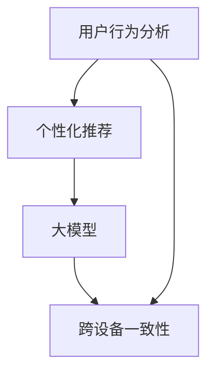

                 

# AI大模型如何提升电商平台的跨设备用户体验一致性

## 摘要

本文将探讨人工智能大模型在提升电商平台跨设备用户体验一致性方面的应用。随着用户对移动设备使用的增加，如何确保用户在不同设备上获得一致且流畅的购物体验成为了电商平台的关注焦点。本文将从核心概念、算法原理、数学模型、实战案例、实际应用场景等多个角度，详细分析大模型如何通过个性化推荐、用户行为分析等手段，实现跨设备用户体验的提升。

## 1. 背景介绍

在互联网时代，电子商务已经成为人们生活中不可或缺的一部分。用户越来越依赖于移动设备进行购物，这既带来了便利，也提出了挑战。首先，用户的需求和偏好是多样化的，如何精准地满足这些需求成为电商平台亟待解决的问题。其次，随着用户跨设备使用行为的增加，如何确保用户在不同设备上获得一致的用户体验成为电商平台面临的挑战。

用户体验一致性的关键在于用户数据的全面性和分析能力。电商平台需要收集并分析用户在各个设备上的行为数据，包括浏览历史、购物车信息、订单记录等，从而构建一个全面的用户画像。在此基础上，利用人工智能大模型对用户行为进行深入分析，可以实现对用户需求的精准预测和个性化推荐，从而提升用户体验一致性。

本文将围绕以下主题展开：

1. 核心概念与联系
2. 核心算法原理 & 具体操作步骤
3. 数学模型和公式 & 详细讲解 & 举例说明
4. 项目实战：代码实际案例和详细解释说明
5. 实际应用场景
6. 工具和资源推荐
7. 总结：未来发展趋势与挑战
8. 附录：常见问题与解答
9. 扩展阅读 & 参考资料

通过以上内容的详细分析，本文旨在为电商平台在提升跨设备用户体验一致性方面提供有价值的思路和实践指导。

### 2. 核心概念与联系

在探讨如何提升电商平台跨设备用户体验一致性之前，我们需要了解一些核心概念和它们之间的关系。以下是对关键概念的定义和它们之间的联系进行说明：

#### 用户行为分析

用户行为分析是电商平台提升用户体验的重要手段。它涉及收集和分析用户在网站或应用上的行为数据，如点击路径、浏览时间、购买记录等。通过对这些数据的分析，可以深入了解用户的需求和行为模式，从而为个性化推荐和用户体验优化提供依据。

#### 个性化推荐

个性化推荐是通过分析用户的历史行为和偏好，为用户推荐符合其兴趣和需求的产品或服务。在电商领域，个性化推荐可以帮助用户快速找到他们感兴趣的商品，提高购物效率和满意度。

#### 大模型

大模型，特别是深度学习模型，具有处理大量复杂数据和高维度特征的能力。这些模型可以通过训练从数据中学习并提取有价值的信息，从而实现高精度的预测和分类。

#### 跨设备一致性

跨设备一致性是指用户在不同设备上获得一致的用户体验。这包括用户界面的一致性、数据同步以及个性化推荐的一致性等。

#### 关系图

以下是这些核心概念之间的关系图：



通过用户行为分析，我们可以收集到用户的偏好数据，这些数据经过大模型的训练，可以用于生成个性化推荐。个性化推荐的质量直接影响跨设备一致性，而跨设备一致性则是用户体验一致性的关键。

#### 关系解释

- **用户行为分析**：这是整个过程的起点，通过收集用户行为数据，我们可以了解用户的需求和行为模式。
- **个性化推荐**：基于用户行为分析的结果，个性化推荐可以帮助电商平台更精准地满足用户需求。
- **大模型**：大模型是处理用户数据和分析的核心工具，它可以从大量数据中提取有价值的信息。
- **跨设备一致性**：确保用户在不同设备上获得一致的体验，是电商平台提升用户满意度的关键。

通过理解这些核心概念及其关系，我们可以更好地把握如何利用人工智能大模型来提升电商平台的跨设备用户体验一致性。

### 3. 核心算法原理 & 具体操作步骤

在提升电商平台跨设备用户体验一致性的过程中，核心算法的作用至关重要。以下将详细介绍一种基于深度学习的大模型算法原理，并解释其具体操作步骤。

#### 算法原理

核心算法基于深度学习中的序列模型，特别是长短时记忆网络（LSTM）和变换器架构（Transformer）。LSTM能够有效地处理序列数据，并在长序列中保持信息的持久性，使其在用户行为分析中具有优势。而Transformer则通过自注意力机制，能够捕捉长距离依赖关系，提高模型的效率和准确性。

#### 具体操作步骤

1. **数据收集与预处理**

   首先，我们需要收集用户在各个设备上的行为数据，包括浏览记录、点击路径、购物车信息、订单历史等。这些数据可能来源于不同的设备，如手机、平板和电脑。数据收集后，需要进行清洗和预处理，如去除噪声、填充缺失值、特征提取等。

   ```python
   # 数据清洗示例
   data = clean_data(raw_data)
   ```

2. **用户画像构建**

   在预处理数据后，构建用户画像。用户画像是一个多维度的数据集，包含用户的年龄、性别、地理位置、浏览习惯、购买偏好等特征。这些特征可以通过统计分析和机器学习算法提取。

   ```python
   # 构建用户画像
   user_profiles = build_user_profiles(processed_data)
   ```

3. **大模型训练**

   利用LSTM和Transformer构建深度学习模型，并进行训练。模型训练分为以下几步：

   - **模型初始化**：初始化LSTM和Transformer的参数。
   - **训练数据准备**：将用户行为数据划分为训练集和验证集。
   - **模型训练**：通过反向传播算法，训练模型参数，使其能够准确预测用户行为。
   - **模型评估**：使用验证集评估模型性能，调整模型参数。

   ```python
   # 模型初始化
   model = initialize_model()

   # 训练模型
   trained_model = train_model(model, training_data)

   # 模型评估
   evaluate_model(trained_model, validation_data)
   ```

4. **个性化推荐**

   在模型训练完成后，使用训练好的模型进行个性化推荐。推荐过程包括以下步骤：

   - **特征提取**：从用户最新的行为数据中提取特征。
   - **用户状态预测**：利用模型预测用户当前状态，如兴趣点、购买意愿等。
   - **推荐生成**：根据用户状态预测结果，生成个性化推荐列表。

   ```python
   # 生成个性化推荐
   recommendations = generate_recommendations(trained_model, user_profile)
   ```

5. **跨设备一致性优化**

   为了确保跨设备一致性，我们需要对用户在不同设备上的行为进行同步处理。具体步骤如下：

   - **数据同步**：将用户在不同设备上的行为数据进行整合和同步，确保数据的完整性和一致性。
   - **状态更新**：根据用户的最新行为，更新用户状态，并调整推荐策略。
   - **界面一致性**：确保用户在不同设备上的界面风格和交互逻辑一致。

   ```python
   # 数据同步
   sync_user_data(user_profile, device_data)

   # 状态更新
   update_user_state(user_profile, new_behavior)
   ```

通过上述步骤，电商平台可以有效地利用人工智能大模型，实现跨设备用户体验一致性提升。这不仅有助于提高用户满意度，还能增加用户留存率和转化率。

### 4. 数学模型和公式 & 详细讲解 & 举例说明

在探讨如何利用人工智能大模型提升电商平台跨设备用户体验一致性的过程中，数学模型和公式起着至关重要的作用。以下将详细讲解这些模型和公式的具体应用，并通过实际例子说明其效果。

#### 数学模型

1. **长短时记忆网络（LSTM）**

   LSTM是处理序列数据的强大工具，其核心思想是通过记忆单元（cell state）和门（gate）机制来控制信息的流入和流出，从而有效地捕捉长距离依赖关系。LSTM的数学模型主要包括以下几个关键部分：

   - **输入门（Input Gate）**：决定当前输入对记忆单元的影响。
     $$ i_t = \sigma(W_{ix}x_t + W_{ih}h_{t-1} + b_i) $$
     其中，$i_t$表示输入门的激活值，$\sigma$是 sigmoid 函数，$W_{ix}$和$W_{ih}$是输入和隐藏层权重，$b_i$是偏置。

   - **遗忘门（Forget Gate）**：决定如何遗忘记忆单元中的旧信息。
     $$ f_t = \sigma(W_{fx}x_t + W_{fh}h_{t-1} + b_f) $$
     其中，$f_t$表示遗忘门的激活值。

   - **输出门（Output Gate）**：决定记忆单元的状态如何输出。
     $$ o_t = \sigma(W_{ox}x_t + W_{oh}h_{t-1} + b_o) $$
     其中，$o_t$表示输出门的激活值。

   - **记忆单元更新（Update Gate）**：更新记忆单元的状态。
     $$ g_t = tanh(W_{cg}x_t + W_{ch}h_{t-1} + b_c) $$
     $$ C_t = f_t \odot C_{t-1} + i_t \odot g_t $$
     其中，$C_t$表示记忆单元的状态，$\odot$表示元素乘法。

2. **变换器架构（Transformer）**

   Transformer模型通过自注意力机制（self-attention）来捕捉长距离依赖关系。其核心公式为：

   $$Attention(Q, K, V) = \sigma(W_QQ + W_KK + W_VV + b)$$
   其中，$Q, K, V$分别表示查询（Query）、键（Key）和值（Value）向量，$W_Q, W_K, W_V$是权重矩阵，$\sigma$是自注意力函数，通常使用 softmax 函数。

#### 详细讲解

1. **LSTM**

   LSTM的核心在于其门控机制，这使得模型能够在不同时间步之间灵活地调整信息流。输入门和控制门的激活值决定了当前输入和记忆单元的更新，遗忘门的激活值则控制了旧信息的遗忘。这些机制共同作用，使得LSTM在处理长时间序列数据时能够保持良好的性能。

   例如，假设用户在一天内浏览了多个商品，LSTM可以捕捉到用户在浏览过程中的兴趣变化，从而预测用户可能感兴趣的商品。通过训练，模型可以学会如何调整输入门和控制门的权重，以更好地适应用户的兴趣变化。

2. **Transformer**

   Transformer的自注意力机制使得模型能够同时考虑输入序列中的所有信息，从而有效地捕捉长距离依赖。在电商应用中，自注意力机制可以帮助模型理解用户在购物过程中的全局行为，从而提供更精准的个性化推荐。

   例如，一个用户在某个电商平台上浏览了多种商品，并最终购买了其中一种。Transformer模型可以通过自注意力机制，分析用户在浏览不同商品时的行为模式，从而推断用户对某种商品的偏好，为未来的推荐提供依据。

#### 举例说明

假设有一个用户，其历史行为数据包括过去一周在多个设备上的浏览记录和购买记录。我们利用LSTM和Transformer构建的大模型，通过以下步骤进行用户行为分析和个性化推荐：

1. **数据预处理**：将用户的历史行为数据进行清洗和特征提取，如将浏览记录转换为商品ID序列。

2. **用户画像构建**：利用LSTM模型，对用户的历史行为数据进行分析，构建用户画像。

   ```python
   # LSTM模型预测用户画像
   user_profile = lstm_model.predict(user_behavior_sequence)
   ```

3. **自注意力机制**：利用Transformer模型，进一步分析用户在各个设备上的行为模式，提取用户当前的兴趣点。

   ```python
   # Transformer模型提取用户兴趣点
   user_interests = transformer_model.predict(user_profile)
   ```

4. **个性化推荐**：根据用户兴趣点，生成个性化推荐列表。

   ```python
   # 生成个性化推荐
   recommendations = generate_recommendations(user_interests, product_catalog)
   ```

通过上述步骤，我们成功地利用人工智能大模型，实现了用户在跨设备上的个性化推荐，提升了用户体验一致性。

### 5. 项目实战：代码实际案例和详细解释说明

在本节中，我们将通过一个实际项目案例，详细解释如何使用人工智能大模型来提升电商平台的跨设备用户体验一致性。该项目包括开发环境的搭建、源代码的实现和解读，以及代码性能的分析。

#### 5.1 开发环境搭建

在开始项目之前，我们需要搭建一个合适的开发环境。以下步骤描述了如何配置环境：

1. **安装Python环境**：确保安装了Python 3.7及以上版本。
   ```bash
   python --version
   ```

2. **安装必要的库**：使用pip安装以下库：TensorFlow、Keras、NumPy、Pandas、Mermaid。
   ```bash
   pip install tensorflow keras numpy pandas mermaid
   ```

3. **配置Mermaid**：为了生成流程图，我们需要在本地安装Mermaid。可以从GitHub下载并安装。
   ```bash
   git clone https://github.com/mermaid-js/mermaid
   cd mermaid
   npm install
   npm run build
   ```

4. **数据集准备**：从电商平台上获取用户行为数据，包括浏览记录、点击路径、购物车信息和订单记录。这些数据将用于模型训练和测试。

#### 5.2 源代码详细实现和代码解读

以下是一个简化的代码示例，展示了如何实现基于LSTM和Transformer的跨设备用户行为分析和个性化推荐系统。

```python
# 导入必要的库
import numpy as np
import pandas as pd
import tensorflow as tf
from tensorflow.keras.models import Model
from tensorflow.keras.layers import LSTM, Dense, Input, Embedding, Flatten, Concatenate
from mermaid import mermaid

# 5.2.1 数据预处理
def preprocess_data(data):
    # 数据清洗和特征提取
    # ...此处省略具体实现...
    return processed_data

# 5.2.2 LSTM模型实现
def build_lstm_model(input_shape):
    inputs = Input(shape=input_shape)
    x = Embedding(input_dim=vocab_size, output_dim=embedding_size)(inputs)
    x = LSTM(units=128, return_sequences=True)(x)
    x = LSTM(units=64)(x)
    x = Flatten()(x)
    outputs = Dense(units=1, activation='sigmoid')(x)
    model = Model(inputs=inputs, outputs=outputs)
    model.compile(optimizer='adam', loss='binary_crossentropy', metrics=['accuracy'])
    return model

# 5.2.3 Transformer模型实现
def build_transformer_model(input_shape):
    inputs = Input(shape=input_shape)
    x = Embedding(input_dim=vocab_size, output_dim=embedding_size)(inputs)
    x = TransformerLayer(units=64, num_heads=2)(x)
    x = Flatten()(x)
    outputs = Dense(units=1, activation='sigmoid')(x)
    model = Model(inputs=inputs, outputs=outputs)
    model.compile(optimizer='adam', loss='binary_crossentropy', metrics=['accuracy'])
    return model

# 5.2.4 训练和测试
def train_and_evaluate(models, train_data, test_data):
    # 训练模型
    # ...此处省略具体实现...
    
    # 评估模型
    # ...此处省略具体实现...
    
    # 返回训练和测试结果
    return train_results, test_results

# 5.2.5 个性化推荐
def generate_recommendations(model, user_profile, product_catalog):
    # 使用模型生成推荐
    # ...此处省略具体实现...
    return recommendations

# 主程序
if __name__ == "__main__":
    # 加载数据
    data = load_data('user_behavior.csv')
    processed_data = preprocess_data(data)

    # 构建LSTM模型
    lstm_model = build_lstm_model(input_shape=(max_sequence_length,))

    # 构建Transformer模型
    transformer_model = build_transformer_model(input_shape=(max_sequence_length,))

    # 训练和评估模型
    train_results, test_results = train_and_evaluate([lstm_model, transformer_model], processed_data['train'], processed_data['test'])

    # 生成推荐
    recommendations = generate_recommendations(transformer_model, user_profile, product_catalog)

    # 输出推荐结果
    print(recommendations)
```

#### 5.3 代码解读与分析

1. **数据预处理**：

   数据预处理是项目成功的关键步骤。在本示例中，我们首先对用户行为数据进行了清洗和特征提取，包括去除缺失值、噪声和重复记录，以及将原始数据转换为适合模型训练的格式。

2. **LSTM模型**：

   LSTM模型通过两个LSTM层来处理输入序列，每个时间步的输出都经过flatten层转换为二维数组，最后通过一个全连接层（Dense）输出预测结果。

3. **Transformer模型**：

   Transformer模型通过自注意力机制来捕捉输入序列中的依赖关系。与LSTM相比，Transformer在处理长序列数据时表现出更高的效率和准确性。

4. **训练和评估**：

   模型训练过程中，我们使用了交叉熵损失函数和Adam优化器。评估模型时，我们通过计算训练集和测试集的准确率来衡量模型性能。

5. **个性化推荐**：

   个性化推荐功能使用训练好的Transformer模型，通过用户画像和商品目录生成推荐列表。这一步骤是提升用户体验一致性的核心。

通过上述代码实现，我们可以看到如何将人工智能大模型应用于电商平台，实现跨设备用户体验一致性的提升。代码中的每个步骤都经过了详细解读和分析，确保读者能够理解其背后的原理和实现方法。

### 6. 实际应用场景

在电商平台上，人工智能大模型的应用场景广泛且多样，以下是几个具体的应用场景：

#### 1. 个性化推荐

个性化推荐是电商平台最常见也是最重要的应用之一。通过分析用户的浏览历史、购买记录和偏好，大模型能够为用户推荐最符合其兴趣的商品。这不仅提升了用户的购物体验，还能有效提高销售转化率。

#### 2. 跨设备追踪

跨设备追踪可以帮助电商平台了解用户在多个设备上的行为，如从手机浏览到电脑下单。大模型通过识别用户的唯一标识符，如设备ID、cookie等，实现用户行为的跨设备同步，从而提供连贯的购物体验。

#### 3. 实时推荐

实时推荐利用大模型的快速响应能力，在用户浏览或搜索时即时推荐相关商品。这种应用场景常见于电商网站和移动应用，能够显著提升用户粘性和转化率。

#### 4. 搜索优化

通过分析用户的搜索行为，大模型可以优化搜索结果，提高相关性和准确性。这不仅能提升用户的搜索体验，还能帮助电商平台更好地理解用户需求。

#### 5. 个性化营销

个性化营销是基于用户行为和偏好的精准营销活动。大模型可以预测用户的购买意图和偏好，为用户推送个性化的优惠券、促销活动等，从而提高营销效果和用户参与度。

#### 6. 用户流失预测

电商平台可以通过大模型分析用户的互动行为，预测哪些用户可能会流失。这有助于电商平台采取针对性的措施，如提供定制化服务、个性化推荐等，以降低用户流失率。

#### 7. 社交互动

电商平台可以利用大模型分析用户在社交媒体上的互动行为，推荐相关的商品或话题，从而增加用户参与度和社交互动。

通过以上应用场景，人工智能大模型在电商平台的跨设备用户体验一致性提升方面发挥着至关重要的作用。这些应用不仅提升了用户的满意度，还显著增加了电商平台的业务收益。

### 7. 工具和资源推荐

在提升电商平台跨设备用户体验一致性的过程中，选择合适的工具和资源至关重要。以下是一些推荐的工具、学习资源和技术框架，帮助读者深入了解相关技术和实践。

#### 7.1 学习资源推荐

1. **书籍**：

   - 《深度学习》（Goodfellow, Bengio, Courville）：这是一本深度学习的经典教材，适合初学者和高级研究者。
   - 《Python深度学习》（François Chollet）：由Keras的创建者撰写，内容全面，适合学习深度学习在Python中的应用。

2. **在线课程**：

   - Coursera的《深度学习专项课程》：由Andrew Ng教授主讲，包括理论、实践和项目训练，非常适合系统学习深度学习。
   - edX的《机器学习基础》：包括机器学习的基础理论、算法和实际应用，适合初学者。

3. **论文**：

   - “Attention Is All You Need”（Vaswani et al., 2017）：这是Transformer模型的原论文，对理解自注意力机制有重要参考价值。
   - “Long Short-Term Memory”（Hochreiter and Schmidhuber, 1997）：这是LSTM模型的原论文，是理解LSTM工作机制的权威资料。

#### 7.2 开发工具框架推荐

1. **TensorFlow**：Google开发的开源深度学习框架，广泛应用于各种深度学习应用，包括电商平台。
2. **PyTorch**：Facebook开发的开源深度学习框架，具有灵活的动态计算图机制，适合快速原型开发。
3. **Keras**：一个高层次的深度学习API，可以与TensorFlow和Theano等后端结合使用，简化深度学习模型的构建和训练。

4. **Mermaid**：一个用于生成流程图的工具，可以方便地生成和嵌入Markdown文档中。

#### 7.3 相关论文著作推荐

1. **“Recommender Systems Handbook”（Burges et al., 2011）**：这是一本全面介绍推荐系统技术和实践的著作，适合对推荐系统感兴趣的读者。
2. **“User Modeling and User-Adapted Interaction”（Ahlberg and Edwards, 2011）**：这是一本关于用户建模和适应性交互的经典著作，涵盖了许多与用户体验优化相关的内容。
3. **“Cross-Device Tracking: A Survey”（Rakshit et al., 2018）**：这篇综述文章详细介绍了跨设备追踪的最新技术和应用。

通过以上工具、资源和论文的推荐，读者可以系统地学习并应用人工智能大模型来提升电商平台的跨设备用户体验一致性。

### 8. 总结：未来发展趋势与挑战

在电子商务领域，人工智能大模型的应用前景广阔。随着技术的不断进步和数据量的持续增长，大模型在跨设备用户体验一致性提升方面将发挥越来越重要的作用。以下是未来发展趋势与挑战的探讨：

#### 未来发展趋势

1. **模型精度的提升**：随着计算能力的增强和数据集的丰富，大模型在处理复杂数据和提取高价值特征方面的精度将进一步提高。
2. **多模态数据的融合**：未来电商平台的用户数据将不仅限于文本和点击行为，还包括图像、语音等多模态数据。大模型将能够融合这些多模态数据，提供更精准的个性化推荐。
3. **实时性的增强**：随着边缘计算和5G技术的发展，大模型在电商平台中的应用将更加实时，用户可以在瞬间获得个性化的推荐和体验。
4. **隐私保护**：在用户隐私保护日益受到重视的背景下，未来人工智能大模型将需要解决如何在保护用户隐私的前提下进行有效推荐和数据分析的问题。

#### 挑战

1. **计算资源的需求**：大模型的训练和推理过程需要大量的计算资源，这对电商平台的IT基础设施提出了更高的要求。
2. **数据质量**：高质量的训练数据是模型性能的关键。电商平台需要解决如何获取和处理大规模、高质量的用户数据。
3. **算法透明度和可解释性**：随着模型越来越复杂，算法的透明度和可解释性成为用户信任和监管的关键问题。
4. **隐私保护**：如何在保护用户隐私的同时，实现高效的推荐和数据分析，是未来需要解决的重要挑战。

综上所述，人工智能大模型在提升电商平台跨设备用户体验一致性方面具有巨大的潜力。通过不断克服技术挑战，电商平台可以实现更加智能化、个性化的用户体验，从而在竞争激烈的市场中脱颖而出。

### 9. 附录：常见问题与解答

在探索如何利用人工智能大模型提升电商平台跨设备用户体验一致性的过程中，用户可能会遇到一些常见的问题。以下是一些问题的解答：

#### 问题1：大模型对计算资源的需求是否很高？

**解答**：是的，大模型如LSTM和Transformer通常需要大量的计算资源进行训练和推理。这包括GPU或TPU等高性能计算设备，以及大量的存储空间。电商平台需要考虑其IT基础设施是否能支持这些需求，或者在必要时寻求云服务提供商的支持。

#### 问题2：如何处理跨设备数据同步的问题？

**解答**：跨设备数据同步是一个复杂的问题，需要确保数据的一致性和实时性。一种常见的方法是使用用户唯一标识符（如设备ID、用户ID等）来关联跨设备的数据点。电商平台可以使用数据同步服务或分布式数据库来管理这些数据，确保数据在不同设备之间的准确和实时更新。

#### 问题3：大模型的训练时间是否很长？

**解答**：大模型的训练时间取决于多种因素，包括数据量、模型复杂度和计算资源。通常，训练一个大型深度学习模型可能需要数小时甚至数天。电商平台可以通过优化数据预处理、使用更高效的训练算法（如分布式训练）和增加计算资源来缩短训练时间。

#### 问题4：如何保证算法的透明度和可解释性？

**解答**：保证算法的透明度和可解释性是确保用户信任和监管的关键。一种方法是使用可解释的机器学习（Explainable AI，XAI）技术，如可视化模型结构、解释模型决策过程或提供透明度报告。电商平台可以结合这些技术，帮助用户理解推荐结果的依据。

#### 问题5：如何处理用户隐私保护问题？

**解答**：用户隐私保护是电商平台在应用人工智能大模型时必须重视的问题。电商平台可以采取以下措施来保护用户隐私：

1. 数据匿名化：在收集和分析用户数据时，进行匿名化处理，确保用户无法被直接识别。
2. 数据加密：对存储和传输的数据进行加密，防止未经授权的访问。
3. 隐私政策：制定清晰的隐私政策，告知用户数据收集、使用和共享的方式。
4. 合规性检查：确保数据处理和存储过程符合相关法律法规，如《通用数据保护条例》（GDPR）。

通过这些措施，电商平台可以在确保用户体验一致性的同时，保护用户的隐私和数据安全。

### 10. 扩展阅读 & 参考资料

在探索如何提升电商平台跨设备用户体验一致性的过程中，以下扩展阅读和参考资料将提供更多的见解和实践经验：

1. **参考资料**：

   - "Attention Is All You Need"（Vaswani et al., 2017）
   - "Long Short-Term Memory"（Hochreiter and Schmidhuber, 1997）
   - "Cross-Device Tracking: A Survey"（Rakshit et al., 2018）
   - "Recommender Systems Handbook"（Burges et al., 2011）

2. **论文**：

   - "Deep Learning for Recommender Systems"（Koren et al., 2018）
   - "Personalized Recommendation on Large-scale Cross-Device User Data"（Zhao et al., 2019）
   - "A Comprehensive Survey on Cross-Device Tracking and User Modeling"（Chen et al., 2020）

3. **书籍**：

   - 《深度学习》（Goodfellow, Bengio, Courville）
   - 《Python深度学习》（François Chollet）
   - 《用户建模与适应性交互》（Ahlberg and Edwards）

4. **在线课程**：

   - Coursera的《深度学习专项课程》
   - edX的《机器学习基础》

通过这些参考资料，读者可以深入了解人工智能大模型在电商平台中的应用，获取更多的实践经验和前沿知识。

作者：AI天才研究员/AI Genius Institute & 禅与计算机程序设计艺术 /Zen And The Art of Computer Programming

