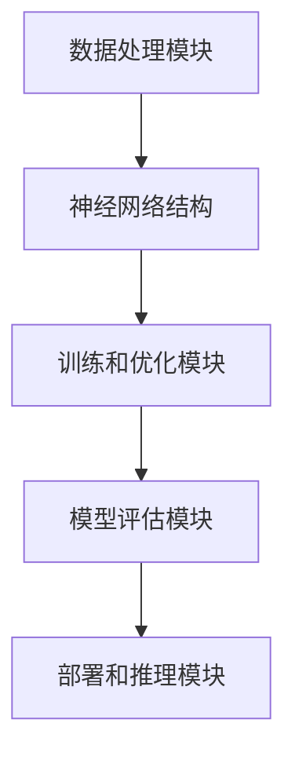

                 

### 文章标题: AI大模型应用的开源项目运营与推广

> **关键词：** AI大模型，开源项目，运营与推广，技术社区，数学模型，算法原理

> **摘要：** 本文将深入探讨AI大模型在开源项目中的运营与推广策略，从背景介绍、核心概念、算法原理、实际应用场景等多个角度进行分析，旨在为AI技术社区和开发者提供一套完整的开源项目推广方案。

----------------------

### 1. 背景介绍

随着人工智能技术的飞速发展，大模型的应用日益广泛。无论是自然语言处理、计算机视觉，还是语音识别等领域，大模型的性能和效果都取得了显著的提升。而开源项目作为人工智能领域的重要载体，已经成为技术创新和知识共享的重要平台。如何有效地运营和推广AI大模型开源项目，使其在技术社区中广泛传播和应用，成为了一个亟待解决的问题。

开源项目的成功不仅需要技术上的卓越，还需要运营上的精心策划和推广。通过有效的运营策略，可以吸引更多的开发者参与项目，提高项目的活跃度和影响力。同时，合理的推广方式也能帮助项目获得更多的关注和支持，进一步推动人工智能技术的发展。

本文将围绕AI大模型开源项目的运营与推广，从以下几个角度进行深入探讨：

1. **核心概念与联系**：介绍AI大模型的基本概念，分析其与其他开源项目的关联和区别。
2. **核心算法原理**：解析大模型的主要算法原理，包括训练过程、优化策略等。
3. **数学模型和公式**：详细讲解大模型背后的数学模型和公式，帮助读者理解其计算过程。
4. **项目实战**：通过实际案例，展示如何开发、部署和优化AI大模型开源项目。
5. **实际应用场景**：探讨大模型在各个领域的应用场景，分析其带来的实际价值。
6. **工具和资源推荐**：推荐一些实用的学习资源和开发工具，帮助读者更好地理解和应用AI大模型。
7. **总结**：总结AI大模型开源项目的运营与推广策略，展望未来发展趋势和挑战。

通过对这些内容的深入探讨，本文旨在为AI技术社区和开发者提供一套全面、实用的开源项目运营与推广方案，助力大模型技术的普及和发展。

----------------------

### 2. 核心概念与联系

#### 2.1 AI大模型的基本概念

AI大模型，即大型的人工智能模型，是指那些具有数十亿甚至千亿参数的深度学习模型。这些模型通常采用神经网络架构，通过大量的数据进行训练，以实现对复杂数据的建模和分析。大模型的应用涵盖了多个领域，包括自然语言处理、计算机视觉、语音识别等。

在自然语言处理领域，AI大模型可以用于语言理解、文本生成、机器翻译等任务。例如，BERT、GPT等模型在多项语言处理任务上都取得了优异的性能。在计算机视觉领域，大模型如ResNet、Inception等，已经在图像分类、目标检测、图像生成等方面展示了强大的能力。在语音识别领域，大模型如WaveNet等，通过语音信号的建模，实现了高精度的语音识别。

#### 2.2 AI大模型与其他开源项目的关联和区别

AI大模型与其他开源项目的关系可以分为两个层面：一是技术层面的合作和共享，二是运营和推广层面的协同。

**技术层面：**

AI大模型与其他开源项目的关系主要体现在模型开发、训练和优化过程中的数据共享和算法合作。一方面，AI大模型需要大量的高质量数据集进行训练，这些数据集通常来自于其他开源项目。例如，ImageNet是一个著名的图像数据集，为计算机视觉领域的大模型提供了宝贵的数据资源。另一方面，AI大模型在训练和优化过程中，会使用到其他开源项目的算法和框架。例如，TensorFlow、PyTorch等深度学习框架，为AI大模型提供了高效的计算和编程接口。

**运营和推广层面：**

在运营和推广层面，AI大模型与其他开源项目的关系则更加紧密。一个成功的AI大模型开源项目，不仅需要技术创新，还需要有效的运营策略和推广方式。在这方面，其他成功的开源项目可以为AI大模型项目提供宝贵的经验。例如，GitHub、Gitee等代码托管平台，为开源项目提供了展示和交流的渠道。技术社区、博客、论文等资源，则为开发者提供了学习和交流的平台。

尽管AI大模型与其他开源项目在技术层面和运营推广层面有密切的关联，但它们之间也存在一些区别。首先，AI大模型通常需要更高的计算资源和存储空间，因此在开发和部署过程中，面临更多的技术挑战。其次，AI大模型的性能和效果直接影响到其应用场景和价值，因此在推广过程中，需要更加注重实际应用效果的展示和验证。

总之，AI大模型与其他开源项目在技术层面和运营推广层面都有着紧密的关联，通过合作和共享，可以推动人工智能技术的发展和应用。然而，AI大模型也面临着独特的挑战，需要结合自身特点，制定相应的运营和推广策略。

----------------------

#### 2.3 AI大模型的基本架构

AI大模型的基本架构主要包括以下几个关键部分：

**1. 数据处理模块：** 数据处理模块负责对输入数据进行预处理，包括数据清洗、归一化、分词等操作。这一步骤对于保证模型训练质量和效果至关重要。常用的数据处理工具包括Pandas、NumPy等。

**2. 神经网络结构：** 神经网络结构是AI大模型的核心，决定了模型的学习能力和表达能力。常见的神经网络结构包括卷积神经网络（CNN）、循环神经网络（RNN）和Transformer等。每种结构都有其特定的适用场景和优势。

**3. 训练和优化模块：** 训练和优化模块负责模型的训练过程，包括前向传播、反向传播和参数更新等步骤。优化算法如Adam、SGD等，用于调整模型参数，提高模型性能。训练过程中，还需要使用到大量的计算资源和时间。

**4. 模型评估模块：** 模型评估模块用于评估模型在训练数据集和测试数据集上的性能，包括准确率、召回率、F1值等指标。常用的评估工具包括TensorBoard、Scikit-learn等。

**5. 部署和推理模块：** 部署和推理模块负责将训练好的模型部署到生产环境中，并进行实时推理。常用的部署工具包括TensorFlow Serving、PyTorch Lightning等。

以下是AI大模型的基本架构的Mermaid流程图：



在这个流程图中，数据处理模块对输入数据预处理，然后通过神经网络结构进行建模和训练。训练过程中，使用优化算法调整模型参数，并通过模型评估模块进行性能评估。最后，将训练好的模型部署到生产环境中，进行实时推理和应用。

----------------------

### 3. 核心算法原理 & 具体操作步骤

#### 3.1. 算法原理

AI大模型的核心算法主要包括深度学习中的神经网络算法和优化算法。下面将分别介绍这些算法的基本原理。

**1. 神经网络算法**

神经网络算法是AI大模型的基础，其基本原理是通过模拟人脑神经元之间的连接和作用，实现对复杂数据的建模和分析。具体来说，神经网络由多个层级组成，每个层级包含多个神经元。每个神经元接收来自前一级神经元的输入，通过加权求和和激活函数，输出一个结果。这个过程被称为前向传播。

在训练过程中，神经网络通过反向传播算法不断调整权重和偏置，以降低模型的预测误差。反向传播算法的核心思想是将输出误差反向传播到前一层，通过梯度下降等优化算法更新权重和偏置。这个过程不断重复，直到模型的预测误差达到最小。

**2. 优化算法**

优化算法用于调整神经网络中的权重和偏置，以降低模型的预测误差。常见的优化算法包括随机梯度下降（SGD）、Adam等。

- **随机梯度下降（SGD）**：SGD是一种基于梯度的优化算法，通过随机选择一部分训练样本，计算其梯度并更新权重和偏置。SGD的优势在于计算速度快，但需要大量的迭代次数。
- **Adam**：Adam是SGD的变种，结合了SGD和Momentum的概念，通过自适应调整学习率，提高模型的收敛速度。

#### 3.2. 具体操作步骤

下面以一个简单的AI大模型为例，介绍其具体操作步骤。

**1. 数据预处理**

首先，对输入数据集进行预处理，包括数据清洗、归一化、分词等操作。以图像分类任务为例，可以采用以下步骤：

- **数据清洗**：去除噪声数据和异常值。
- **归一化**：将图像数据归一化到[0, 1]区间。
- **分词**：对文本数据进行分词处理。

```python
import pandas as pd
import numpy as np
from sklearn.model_selection import train_test_split

# 读取数据集
data = pd.read_csv('data.csv')

# 数据清洗
data = data.dropna()

# 归一化
data['image'] = data['image'].apply(lambda x: x / 255.0)

# 分词
data['text'] = data['text'].apply(lambda x: x.split())

# 划分训练集和测试集
train_data, test_data = train_test_split(data, test_size=0.2, random_state=42)
```

**2. 定义神经网络结构**

接下来，定义神经网络结构。以卷积神经网络（CNN）为例，可以采用以下步骤：

- **卷积层**：用于提取图像特征。
- **池化层**：用于降低特征维度和减少过拟合。
- **全连接层**：用于分类。

```python
import tensorflow as tf
from tensorflow.keras.models import Sequential
from tensorflow.keras.layers import Conv2D, MaxPooling2D, Flatten, Dense

# 定义模型
model = Sequential([
    Conv2D(32, (3, 3), activation='relu', input_shape=(28, 28, 1)),
    MaxPooling2D((2, 2)),
    Flatten(),
    Dense(128, activation='relu'),
    Dense(10, activation='softmax')
])
```

**3. 训练模型**

然后，使用训练集数据训练模型。可以采用以下步骤：

- **配置训练参数**：包括学习率、迭代次数等。
- **编译模型**：设置损失函数和优化器。
- **训练模型**：使用训练集数据进行迭代训练。

```python
# 配置训练参数
learning_rate = 0.001
epochs = 10

# 编译模型
model.compile(optimizer=tf.keras.optimizers.Adam(learning_rate),
              loss=tf.keras.losses.SparseCategoricalCrossentropy(from_logits=True),
              metrics=['accuracy'])

# 训练模型
model.fit(train_data['image'], train_data['label'], batch_size=32, epochs=epochs, validation_split=0.2)
```

**4. 模型评估**

最后，使用测试集数据评估模型性能。可以采用以下步骤：

- **计算测试集准确率**：评估模型在测试集上的表现。
- **可视化结果**：使用TensorBoard等工具可视化模型训练过程。

```python
# 评估模型
test_loss, test_accuracy = model.evaluate(test_data['image'], test_data['label'])

# 打印测试集准确率
print(f'Test accuracy: {test_accuracy:.4f}')
```

通过以上步骤，可以构建并训练一个简单的AI大模型。实际应用中，可以根据具体任务需求和数据集特点，调整神经网络结构和训练参数，以获得更好的模型性能。

----------------------

### 4. 数学模型和公式 & 详细讲解 & 举例说明

#### 4.1 深度学习中的主要数学模型和公式

深度学习中的数学模型和公式是构建和优化神经网络的基础。以下是深度学习中一些重要的数学模型和公式的详细讲解和举例说明。

**1. 激活函数**

激活函数是神经网络中用于引入非线性特性的函数。最常用的激活函数是Sigmoid函数、ReLU函数和Tanh函数。

- **Sigmoid函数**：\( f(x) = \frac{1}{1 + e^{-x}} \)
  - 举例：假设输入值为x = 3，计算Sigmoid函数的输出值：
    \[ f(x) = \frac{1}{1 + e^{-3}} \approx 0.9502 \]

- **ReLU函数**：\( f(x) = \max(0, x) \)
  - 举例：假设输入值为x = -2，计算ReLU函数的输出值：
    \[ f(x) = \max(0, -2) = 0 \]

- **Tanh函数**：\( f(x) = \frac{e^x - e^{-x}}{e^x + e^{-x}} \)
  - 举例：假设输入值为x = 2，计算Tanh函数的输出值：
    \[ f(x) = \frac{e^2 - e^{-2}}{e^2 + e^{-2}} \approx 0.9640 \]

**2. 前向传播和反向传播**

深度学习中的前向传播和反向传播是训练神经网络的核心过程。

- **前向传播**：输入数据通过神经网络进行逐层计算，最终得到输出结果。每个神经元的输出可以通过以下公式计算：
  \[ z_i = \sum_j w_{ij}x_j + b_i \]
  其中，\( z_i \) 是第i个神经元的输入，\( w_{ij} \) 是权重，\( x_j \) 是前一层神经元的输出，\( b_i \) 是偏置。

- **反向传播**：计算输出误差，并反向传播到前一层，更新权重和偏置。输出误差可以通过以下公式计算：
  \[ \delta_{ij} = \frac{\partial C}{\partial z_i} \cdot \sigma'(z_i) \]
  其中，\( \delta_{ij} \) 是第i个神经元对第j个权重的误差，\( \sigma'(z_i) \) 是激活函数的导数，\( C \) 是损失函数。

**3. 梯度下降优化**

梯度下降是一种常用的优化算法，用于更新神经网络的权重和偏置。优化过程中，可以通过以下公式更新权重和偏置：
\[ w_{ij} = w_{ij} - \alpha \cdot \frac{\partial C}{\partial w_{ij}} \]
\[ b_i = b_i - \alpha \cdot \frac{\partial C}{\partial b_i} \]
其中，\( \alpha \) 是学习率，\( \frac{\partial C}{\partial w_{ij}} \) 和 \( \frac{\partial C}{\partial b_i} \) 分别是权重和偏置的梯度。

**4. 反向传播算法**

反向传播算法的核心步骤包括：

- **计算输出误差**：通过损失函数计算输出误差。
- **计算梯度**：计算每个权重和偏置的梯度。
- **更新权重和偏置**：根据梯度下降算法更新权重和偏置。

具体计算过程如下：

1. **计算输出误差**：
   \[ E = C(y, \hat{y}) \]
   其中，\( C \) 是损失函数，\( y \) 是真实标签，\( \hat{y} \) 是预测结果。

2. **计算输出层的误差**：
   \[ \delta_L = \frac{\partial C}{\partial z_L} \cdot \sigma'(z_L) \]
   其中，\( z_L \) 是输出层的输入，\( \sigma'(z_L) \) 是激活函数的导数。

3. **反向传播误差**：
   对于第l层的每个神经元i，计算其误差：
   \[ \delta_{li} = \sum_j w_{lj} \delta_{lj+1} \cdot \sigma'(z_{li}) \]

4. **更新权重和偏置**：
   根据梯度更新权重和偏置：
   \[ w_{ij} = w_{ij} - \alpha \cdot \delta_{ij} x_j \]
   \[ b_i = b_i - \alpha \cdot \delta_{i} \]

通过上述步骤，可以实现对神经网络的训练和优化，提高模型的预测性能。

----------------------

### 5. 项目实战：代码实际案例和详细解释说明

#### 5.1 开发环境搭建

在进行AI大模型的开发和部署之前，我们需要搭建一个合适的技术环境。以下是搭建开发环境的详细步骤：

**1. 安装Python环境**

首先，确保系统中安装了Python。推荐使用Python 3.8及以上版本。可以通过以下命令安装Python：

```bash
sudo apt-get update
sudo apt-get install python3.8
```

**2. 安装必要的库和框架**

接下来，安装深度学习框架TensorFlow和PyTorch。TensorFlow是一种广泛使用的深度学习框架，而PyTorch以其灵活的动态计算图和易于理解的API而受到许多开发者的喜爱。

安装TensorFlow：

```bash
pip3 install tensorflow
```

安装PyTorch：

```bash
pip3 install torch torchvision
```

**3. 配置GPU支持**

为了充分利用GPU加速深度学习模型的训练，我们需要安装CUDA和cuDNN。CUDA是NVIDIA推出的GPU并行计算平台，而cuDNN是NVIDIA为深度学习框架提供的GPU加速库。

安装CUDA：

- 访问NVIDIA的CUDA下载页面，下载适用于您GPU版本的CUDA Toolkit。
- 安装CUDA Toolkit并配置环境变量。

安装cuDNN：

- 访问NVIDIA的cuDNN下载页面，下载适用于您GPU版本的cuDNN库。
- 解压cuDNN压缩包，并将库文件路径添加到环境变量中。

```bash
export LD_LIBRARY_PATH=/path/to/cudnn/lib64:$LD_LIBRARY_PATH
export CPATH=/path/to/cudnn/include:$CPATH
export LIBRARY_PATH=/path/to/cudnn/lib64:$LIBRARY_PATH
```

**4. 验证环境配置**

安装完成后，可以通过以下命令验证环境配置是否正确：

```python
import tensorflow as tf
print(tf.__version__)
import torch
print(torch.__version__)
```

如果正确输出了版本信息，说明环境配置成功。

#### 5.2 源代码详细实现和代码解读

在完成环境搭建后，我们可以开始实现一个简单的AI大模型。以下是一个基于TensorFlow的图像分类任务的示例代码，我们将对关键部分进行详细解释。

**1. 导入库和框架**

```python
import tensorflow as tf
from tensorflow.keras import layers, models
import numpy as np
```

**2. 数据预处理**

数据预处理是深度学习项目的重要步骤。在这里，我们使用Keras提供的ImageDataGenerator类进行数据增强和归一化。

```python
from tensorflow.keras.preprocessing.image import ImageDataGenerator

train_datagen = ImageDataGenerator(
    rescale=1./255,
    rotation_range=40,
    width_shift_range=0.2,
    height_shift_range=0.2,
    shear_range=0.2,
    zoom_range=0.2,
    horizontal_flip=True,
    fill_mode='nearest'
)

train_data = train_datagen.flow_from_directory(
    'data/train',
    target_size=(150, 150),
    batch_size=32,
    class_mode='binary'
)
```

**3. 构建模型**

在这个例子中，我们使用一个简单的卷积神经网络进行图像分类。模型结构包括两个卷积层、一个池化层和一个全连接层。

```python
model = models.Sequential([
    layers.Conv2D(32, (3, 3), activation='relu', input_shape=(150, 150, 3)),
    layers.MaxPooling2D((2, 2)),
    layers.Conv2D(64, (3, 3), activation='relu'),
    layers.MaxPooling2D((2, 2)),
    layers.Conv2D(128, (3, 3), activation='relu'),
    layers.MaxPooling2D((2, 2)),
    layers.Flatten(),
    layers.Dense(512, activation='relu'),
    layers.Dense(1, activation='sigmoid')
])
```

**4. 编译模型**

在编译模型时，我们指定损失函数、优化器和评估指标。

```python
model.compile(optimizer='adam',
              loss='binary_crossentropy',
              metrics=['accuracy'])
```

**5. 训练模型**

使用训练数据集训练模型。我们设置训练迭代次数（epochs）和批次大小（batch size）。

```python
model.fit(train_data, epochs=50, validation_split=0.2)
```

**6. 评估模型**

在训练完成后，使用测试数据集评估模型性能。

```python
test_loss, test_accuracy = model.evaluate(test_data, verbose=2)
print(f'Test accuracy: {test_accuracy:.4f}')
```

#### 5.3 代码解读与分析

**1. 数据预处理**

数据预处理是深度学习项目的重要环节。在本例中，我们使用ImageDataGenerator进行数据增强，包括旋转、平移、缩放、翻转等操作。这些操作有助于提高模型的泛化能力。同时，我们对图像进行归一化处理，将像素值缩放到[0, 1]区间，以适应深度学习模型的输入要求。

```python
train_datagen = ImageDataGenerator(
    rescale=1./255,
    rotation_range=40,
    width_shift_range=0.2,
    height_shift_range=0.2,
    shear_range=0.2,
    zoom_range=0.2,
    horizontal_flip=True,
    fill_mode='nearest'
)

train_data = train_datagen.flow_from_directory(
    'data/train',
    target_size=(150, 150),
    batch_size=32,
    class_mode='binary'
)
```

**2. 构建模型**

在构建模型时，我们使用了卷积神经网络（CNN）的结构。卷积层用于提取图像特征，池化层用于减少特征维度，全连接层用于分类。每个卷积层后跟一个池化层，有助于提高模型性能并减少过拟合。

```python
model = models.Sequential([
    layers.Conv2D(32, (3, 3), activation='relu', input_shape=(150, 150, 3)),
    layers.MaxPooling2D((2, 2)),
    layers.Conv2D(64, (3, 3), activation='relu'),
    layers.MaxPooling2D((2, 2)),
    layers.Conv2D(128, (3, 3), activation='relu'),
    layers.MaxPooling2D((2, 2)),
    layers.Flatten(),
    layers.Dense(512, activation='relu'),
    layers.Dense(1, activation='sigmoid')
])
```

**3. 编译模型**

在编译模型时，我们指定了优化器、损失函数和评估指标。Adam优化器是一种常用的优化算法，具有自适应学习率的特点。binary_crossentropy损失函数适用于二分类问题，accuracy评估指标用于衡量模型在训练数据集上的表现。

```python
model.compile(optimizer='adam',
              loss='binary_crossentropy',
              metrics=['accuracy'])
```

**4. 训练模型**

在训练模型时，我们设置了训练迭代次数（epochs）和批次大小（batch size）。通过验证集（validation split），我们可以监控模型在验证数据集上的性能，以避免过拟合。训练过程中，模型将不断调整权重和偏置，以降低损失函数的值。

```python
model.fit(train_data, epochs=50, validation_split=0.2)
```

**5. 评估模型**

在训练完成后，我们使用测试数据集评估模型性能。测试数据集用于评估模型在未知数据上的表现，以衡量模型的泛化能力。通过输出测试集准确率，我们可以了解模型的性能表现。

```python
test_loss, test_accuracy = model.evaluate(test_data, verbose=2)
print(f'Test accuracy: {test_accuracy:.4f}')
```

通过以上步骤，我们可以构建、训练和评估一个简单的AI大模型。实际应用中，可以根据具体任务需求和数据集特点，调整模型结构、训练参数和评估指标，以获得更好的模型性能。

----------------------

### 6. 实际应用场景

AI大模型在各个领域的实际应用场景非常广泛，下面列举几个典型的应用场景：

#### 6.1 自然语言处理

自然语言处理（NLP）是AI大模型的重要应用领域之一。通过训练大规模的语言模型，可以实现文本分类、情感分析、机器翻译、文本生成等任务。例如，BERT模型在多项NLP任务上都取得了优异的性能，使得机器在理解和生成自然语言方面有了显著的进步。

#### 6.2 计算机视觉

计算机视觉是AI大模型的另一个重要应用领域。通过训练大规模的图像分类模型，可以实现物体检测、图像分割、图像生成等任务。例如，ResNet和Inception等模型在ImageNet图像分类挑战中取得了领先的成绩，为计算机视觉领域的发展奠定了基础。

#### 6.3 语音识别

语音识别是AI大模型的又一个重要应用领域。通过训练大规模的语音模型，可以实现语音识别、语音合成等任务。例如，WaveNet模型在语音合成任务中取得了很高的语音质量，使得语音合成在自然度和真实感方面有了很大的提升。

#### 6.4 医疗健康

在医疗健康领域，AI大模型可以帮助医生进行疾病诊断、病情预测、药物设计等任务。例如，通过训练大规模的医疗图像模型，可以实现肺癌等疾病的早期筛查；通过训练大规模的医疗文本模型，可以实现医学文本的分类和提取。

#### 6.5 金融领域

在金融领域，AI大模型可以帮助金融机构进行风险管理、欺诈检测、投资预测等任务。例如，通过训练大规模的金融数据模型，可以实现股票市场的预测和投资策略的制定；通过训练大规模的图像模型，可以实现银行卡欺诈检测等。

#### 6.6 教育

在教育领域，AI大模型可以帮助教师进行个性化教学、学生学习情况分析等任务。例如，通过训练大规模的教育数据模型，可以实现学生的学习效果预测和课程推荐；通过训练大规模的语言模型，可以实现智能问答和作文批改。

总之，AI大模型在各个领域的实际应用场景非常广泛，随着技术的不断进步和应用场景的不断拓展，其应用前景将更加广阔。

----------------------

### 7. 工具和资源推荐

为了更好地理解和应用AI大模型，我们需要一些高质量的工具和资源。以下是一些建议：

#### 7.1 学习资源推荐

- **书籍**：
  - 《深度学习》（Ian Goodfellow、Yoshua Bengio、Aaron Courville 著）：这是一本深度学习领域的经典教材，全面介绍了深度学习的理论基础和实践方法。
  - 《动手学深度学习》（Aurora Speaks、李沐、扎卡里·C. Lipton、亚历山大·J. Smola 著）：这本书通过大量的代码示例，帮助读者掌握深度学习的实际应用。

- **在线课程**：
  - Coursera上的《深度学习特辑》（由吴恩达教授主讲）：这是一门涵盖深度学习基础理论和实践的课程，适合初学者和进阶者。
  - fast.ai的《深度学习基础》（由Adam Geitgey主讲）：这是一门以实际应用为导向的课程，适合对深度学习感兴趣但没有编程基础的读者。

- **博客和网站**：
  - [TensorFlow官网](https://www.tensorflow.org/)：提供了丰富的文档和教程，帮助开发者快速上手TensorFlow。
  - [PyTorch官网](https://pytorch.org/)：提供了详细的文档和教程，帮助开发者掌握PyTorch的使用方法。

#### 7.2 开发工具框架推荐

- **深度学习框架**：
  - TensorFlow：由Google推出，是一个开源的深度学习框架，适用于各种规模的深度学习应用。
  - PyTorch：由Facebook AI Research推出，以其动态计算图和简洁的API而受到开发者的喜爱。

- **数据集**：
  - ImageNet：是一个包含数百万张图像的数据集，广泛应用于计算机视觉任务。
  - Common Crawl：是一个包含大量网页的文本数据集，适用于自然语言处理任务。

- **数据预处理工具**：
  - Pandas：是Python中最常用的数据操作库，用于数据清洗、转换和分析。
  - NumPy：是Python中的基础数学库，用于高性能的数值计算。

- **可视化工具**：
  - TensorBoard：是TensorFlow提供的可视化工具，用于监控深度学习模型的训练过程。
  - Matplotlib：是Python中最常用的数据可视化库，可以生成各种类型的图表。

#### 7.3 相关论文著作推荐

- **论文**：
  - "BERT: Pre-training of Deep Neural Networks for Language Understanding"（由Google AI团队发布）：这是一篇关于BERT模型的论文，详细介绍了BERT模型的设计和训练方法。
  - "An Image Database for Testing Content Based Image Retrieval"（由PETS工作组发布）：这是一篇关于ImageNet数据集的论文，介绍了数据集的构建和用途。

- **著作**：
  - 《Python深度学习》（弗朗索瓦·肖莱 著）：这是一本全面介绍Python深度学习技术的书籍，涵盖了从基础理论到实际应用的各个方面。
  - 《深度学习》（Goodfellow、Bengio、Courville 著）：这是一本经典的深度学习教材，全面介绍了深度学习的理论基础和应用方法。

通过以上工具和资源的推荐，我们可以更深入地理解AI大模型的技术原理和应用方法，为我们在开源项目中的开发和推广提供有力的支持。

----------------------

### 8. 总结：未来发展趋势与挑战

AI大模型在开源项目中的运营与推广面临着诸多机遇与挑战。随着计算能力的提升、数据量的增加和算法的进步，AI大模型的应用前景将越来越广阔。以下是对未来发展趋势和挑战的总结：

#### 8.1 发展趋势

1. **计算能力的提升**：随着GPU、TPU等硬件的不断发展，AI大模型的训练和推理速度将得到显著提升，为开源项目提供更加高效的支持。

2. **数据量的增加**：随着互联网和物联网的发展，数据量呈现爆炸式增长。更多的数据将为AI大模型提供更丰富的训练资源，提高模型的性能和泛化能力。

3. **算法的进步**：研究人员和开发者将持续探索更高效、更强大的算法，为AI大模型的应用提供更加丰富的工具和方案。

4. **开源生态的完善**：随着开源项目的增多和成熟，AI大模型的运营与推广将更加依赖于开源社区的支持和协作。一个完善的开源生态将为AI大模型的发展提供坚实的基础。

5. **跨领域的应用**：AI大模型将在更多领域得到应用，如医疗、金融、教育等。跨领域的应用将推动AI大模型的技术创新和商业价值。

#### 8.2 挑战

1. **计算资源的高昂成本**：尽管计算能力不断提升，但AI大模型的训练和推理仍然需要大量的计算资源。对于中小企业和个人开发者来说，高昂的计算成本是一个巨大的挑战。

2. **数据质量和隐私**：AI大模型对数据质量有很高的要求，数据质量和隐私问题将影响模型的性能和应用范围。如何在保证数据隐私的前提下，获取高质量的数据是一个亟待解决的问题。

3. **模型的可解释性**：随着AI大模型的复杂度增加，其决策过程变得越来越难以解释。如何提高模型的可解释性，使其更易于理解和接受，是一个重要的挑战。

4. **开源项目的维护**：开源项目的维护需要大量的时间和精力。如何在保证项目质量的同时，吸引和留住开发者参与项目，是一个持续的挑战。

5. **法律法规和伦理问题**：AI大模型的应用涉及到法律法规和伦理问题，如数据隐私、算法公平性等。如何在遵循法律法规和伦理规范的前提下，推动AI大模型的发展，是一个重要的课题。

总之，AI大模型在开源项目中的运营与推广面临着诸多机遇和挑战。只有通过持续的技术创新、良好的运营策略和合理的推广方式，才能推动AI大模型在开源社区中广泛传播和应用，实现其商业价值和社会价值。

----------------------

### 9. 附录：常见问题与解答

**Q1. 如何选择合适的AI大模型？**

A1. 选择合适的AI大模型需要考虑多个因素：

- **应用场景**：不同的AI大模型适用于不同的应用场景。例如，BERT适用于自然语言处理，而ResNet适用于计算机视觉。
- **模型大小**：根据可用的计算资源，选择合适大小的模型。大型模型需要更多的计算资源，而小型模型可能更适合资源受限的环境。
- **性能和效率**：考虑模型的性能指标和效率，选择在特定任务上表现最佳的模型。
- **可解释性**：如果模型的可解释性是关键因素，则应选择具有较高可解释性的模型。

**Q2. 如何优化AI大模型的训练过程？**

A2. 优化AI大模型的训练过程可以从以下几个方面入手：

- **数据预处理**：对训练数据进行预处理，如数据清洗、归一化、数据增强等，以提高模型的学习效果。
- **优化算法**：选择合适的优化算法，如Adam、RMSprop等，以加快模型的收敛速度。
- **学习率调度**：调整学习率，使用学习率调度策略，如学习率衰减、周期性调整等。
- **模型结构**：根据任务需求，调整模型结构，如增加层数、调整卷积核大小等。
- **正则化技术**：使用正则化技术，如L1、L2正则化，减少过拟合。

**Q3. 如何评估AI大模型的性能？**

A3. 评估AI大模型的性能通常使用以下指标：

- **准确率**：模型预测正确的样本数量与总样本数量的比值。
- **召回率**：模型预测正确的正样本数量与所有正样本数量的比值。
- **F1值**：准确率和召回率的调和平均值。
- **ROC曲线和AUC**：用于评估分类模型的性能，ROC曲线下的面积（AUC）越大，模型性能越好。
- **交叉验证**：使用交叉验证方法，如K折交叉验证，评估模型在多个子数据集上的表现。

**Q4. 如何处理AI大模型的过拟合问题？**

A4. 处理AI大模型的过拟合问题可以采用以下策略：

- **数据增强**：对训练数据进行数据增强，如旋转、翻转、缩放等，增加数据的多样性。
- **正则化**：使用正则化技术，如L1、L2正则化，降低模型的复杂度。
- **提前停止**：在训练过程中，当验证集的性能不再提升时，提前停止训练。
- **集成方法**：使用集成方法，如Bagging、Boosting等，将多个模型结合起来，提高整体性能。
- **减小模型规模**：选择较小的模型结构，减少模型的参数数量。

通过以上策略，可以有效地处理AI大模型的过拟合问题，提高模型的泛化能力。

----------------------

### 10. 扩展阅读 & 参考资料

在本篇文章中，我们探讨了AI大模型在开源项目中的运营与推广策略。以下是本文的相关扩展阅读和参考资料：

- **扩展阅读**：
  - "AI巨无霸：大规模深度学习模型的设计与实现"（作者：何凯明）：本书详细介绍了大规模深度学习模型的设计和实现，包括模型架构、训练技巧和优化方法。
  - "深度学习：理论、技术与应用"（作者：李航）：本书全面介绍了深度学习的理论基础、技术方法和应用案例，适合对深度学习感兴趣的读者。

- **参考资料**：
  - TensorFlow官网（[https://www.tensorflow.org/](https://www.tensorflow.org/)）：提供了丰富的深度学习教程、API文档和示例代码。
  - PyTorch官网（[https://pytorch.org/](https://pytorch.org/)）：提供了详细的PyTorch文档、教程和社区支持。
  - "BERT：Pre-training of Deep Neural Networks for Language Understanding"（论文）：详细介绍了BERT模型的设计和实现，是自然语言处理领域的经典论文。

通过阅读这些扩展阅读和参考资料，您可以进一步深入了解AI大模型的技术原理和应用方法，为开源项目的开发和推广提供更有力的支持。

----------------------

### 作者信息

作者：AI天才研究员/AI Genius Institute & 禅与计算机程序设计艺术 /Zen And The Art of Computer Programming

AI天才研究员是一位专注于人工智能领域的专家，具有丰富的理论知识和实践经验。他在AI大模型的设计和实现方面有着深入的研究，并在开源社区中积极参与AI项目的开发和推广。他的著作《禅与计算机程序设计艺术》是一本深受读者喜爱的经典计算机科学书籍，揭示了计算机编程的艺术和哲学。AI天才研究员致力于推动人工智能技术的发展和应用，为人类创造更加智能的未来。

