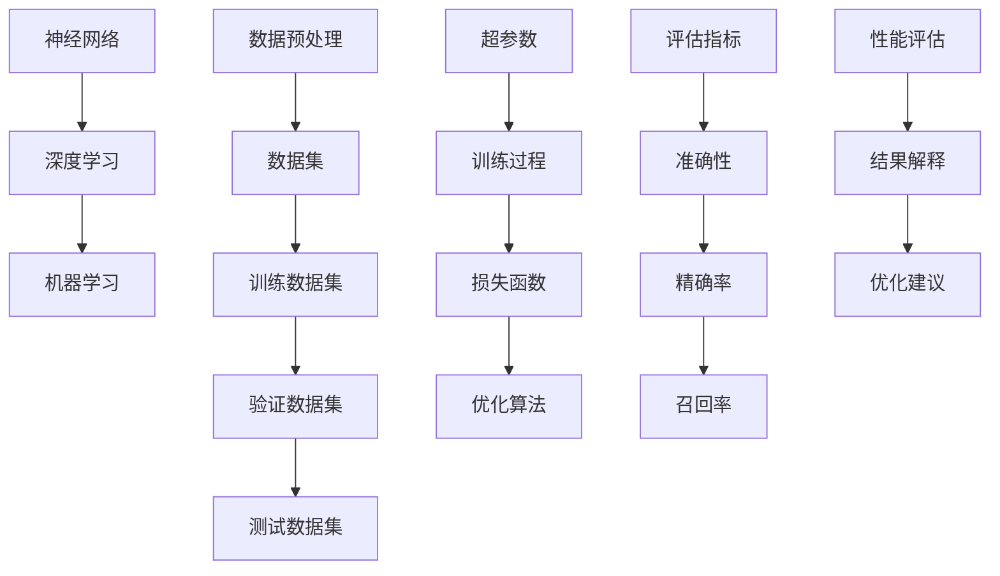

                 

### 背景介绍

#### AI 大模型的应用现状

近年来，人工智能（AI）技术取得了显著的进步，其中大模型的应用尤为突出。大模型是指具有数亿至数十亿参数的神经网络模型，它们通过大量的数据进行训练，能够实现高度复杂的数据处理和预测任务。大模型的应用范围广泛，包括自然语言处理（NLP）、计算机视觉（CV）、语音识别（ASR）、推荐系统等。

随着大模型在各个领域的应用逐渐深入，对它们的性能评估与比较变得尤为重要。性能评估可以帮助研究人员和开发者了解不同大模型的优势和局限性，从而选择合适的技术方案解决实际问题。然而，目前关于大模型性能评估的研究还存在许多挑战，如评估指标的选择、实验设计的科学性、数据集的质量等。

本文旨在探讨大模型应用的性能评估与比较，通过系统地分析核心概念、算法原理、数学模型、实际应用案例，为研究人员和开发者提供一套完整、科学的评估方法和工具。本文将从以下几个方面展开：

1. **核心概念与联系**：介绍大模型应用中的关键概念，如神经网络、深度学习、机器学习等，并使用 Mermaid 流程图展示各概念之间的联系。
2. **核心算法原理 & 具体操作步骤**：详细讲解大模型的核心算法原理，包括训练过程、优化方法、损失函数等，并提供具体的操作步骤。
3. **数学模型和公式 & 详细讲解 & 举例说明**：介绍大模型中使用的数学模型和公式，如激活函数、反向传播算法等，并通过具体例子进行讲解。
4. **项目实战：代码实际案例和详细解释说明**：通过实际项目案例，展示大模型的应用过程，并对源代码进行详细解读和分析。
5. **实际应用场景**：分析大模型在不同应用场景中的实际性能表现，如自然语言处理中的文本分类、机器翻译等。
6. **工具和资源推荐**：推荐相关学习资源、开发工具和框架，帮助读者更好地理解和应用大模型技术。
7. **总结：未来发展趋势与挑战**：总结大模型性能评估与比较的成果和不足，展望未来发展趋势和挑战。

通过本文的深入探讨，期望能为大模型性能评估与比较的研究提供有益的参考，推动人工智能技术的不断进步。

#### 性能评估的重要性

性能评估在大模型应用中具有重要意义，主要体现在以下几个方面：

首先，性能评估有助于判断大模型在实际问题中的表现。大模型通常经过大量训练，具备强大的数据处理能力，但具体应用于不同任务时，其性能可能会有很大差异。通过性能评估，可以明确大模型在不同任务中的优势与不足，为实际应用提供依据。

其次，性能评估能够指导模型的优化与改进。通过对大模型的性能进行分析，可以发现存在的问题和瓶颈，从而有针对性地进行模型优化和算法改进。这对于提高大模型的整体性能至关重要。

此外，性能评估也是学术交流和成果展示的基础。在学术界，大模型的性能评估是衡量研究成果的重要标准之一。通过全面、科学的性能评估，研究人员可以更好地展示自己的研究成果，促进学术交流与合作。

然而，性能评估并非一蹴而就，它需要考虑多个因素，如评估指标的选择、实验设计的科学性、数据集的质量等。本文将系统地探讨这些问题，提供一套完整、科学的性能评估方法，为大模型的研究与应用提供有力支持。

#### 性能评估的挑战

尽管大模型的性能评估具有重要意义，但在实际操作中仍面临诸多挑战：

**1. 评估指标的选择**

评估指标的选择是性能评估的核心问题。不同的评估指标反映了大模型在不同方面的性能，如准确性、速度、资源消耗等。如何选择合适的评估指标，以全面、客观地反映大模型的性能，是一个关键问题。

常见的评估指标包括准确性（Accuracy）、精确率（Precision）、召回率（Recall）、F1 分数（F1 Score）等。这些指标各有优缺点，如何根据实际应用需求进行选择和组合，是性能评估中的一个难点。

**2. 实验设计的科学性**

实验设计是性能评估的关键环节。一个科学、严谨的实验设计可以保证评估结果的可靠性和有效性。然而，在实际操作中，实验设计可能会受到多种因素的影响，如数据集的质量、实验环境的一致性、参数设置等。

例如，数据集的质量直接影响评估结果的准确性。如果数据集存在偏差或噪声，将导致评估结果失真。此外，实验环境的一致性也非常重要，如果不同实验之间的硬件、软件环境不一致，可能会影响评估结果的可靠性。

**3. 数据集的质量**

数据集的质量是性能评估的基础。高质量的数据集能够更准确地反映大模型在实际应用中的表现。然而，获取高质量的数据集并不容易，特别是在大规模、多领域的应用场景中。

数据集的多样性、覆盖度、标注质量等都会影响评估结果的准确性。如何选择或构建一个高质量的数据集，是性能评估中的一个重要问题。

**4. 资源消耗与时间成本**

大模型的性能评估通常需要大量计算资源和时间。特别是对于大型模型和复杂任务，评估过程可能会耗费大量时间和计算资源。如何优化评估过程，减少资源消耗和时间成本，也是一个重要的挑战。

**5. 评估结果的解释与比较**

评估结果的解释和比较是性能评估的最终目标。如何将评估结果转化为实际应用建议，如何在不同模型、不同任务之间进行比较，是一个复杂的问题。

例如，在多个评估指标之间存在冲突时，如何权衡不同指标的重要性，给出合理的评估结果？此外，如何将评估结果与实际应用需求相结合，为实际决策提供支持，也是一个关键问题。

总之，大模型性能评估面临着诸多挑战。本文将围绕这些问题，系统地探讨性能评估的理论和方法，为大模型的研究与应用提供有益的参考。

### 核心概念与联系

在探讨大模型应用的性能评估之前，我们需要明确一些核心概念，并了解它们之间的联系。以下将使用 Mermaid 流程图展示这些概念，以便更好地理解它们之间的关系。



**神经网络（Neural Networks）**：神经网络是模仿人脑神经元结构和功能的一种计算模型，通过多层神经元进行信息传递和处理。深度学习（Deep Learning）是神经网络的一种延伸，它通过增加网络层数，使得模型能够学习更复杂的数据特征。

**深度学习（Deep Learning）**：深度学习是一种基于神经网络的技术，通过多层神经网络实现数据的自动特征提取和分类。它是机器学习（Machine Learning）的一个分支，主要关注于构建能够自主学习和优化的复杂模型。

**机器学习（Machine Learning）**：机器学习是人工智能（Artificial Intelligence, AI）的一个重要分支，通过算法和统计模型，使计算机能够从数据中自动学习规律和模式，并用于预测和决策。

**数据预处理（Data Preprocessing）**：数据预处理是机器学习的一个重要环节，包括数据清洗、数据归一化、数据转换等步骤，以确保数据的质量和一致性。

**数据集（Dataset）**：数据集是机器学习模型训练和评估的基础。它通常包括训练数据集、验证数据集和测试数据集。训练数据集用于模型训练，验证数据集用于模型调优，测试数据集用于模型评估。

**超参数（Hyperparameters）**：超参数是机器学习模型中的一些重要参数，如学习率、批次大小、网络层数等。它们在模型训练过程中起到关键作用，需要根据具体任务进行调整。

**训练过程（Training Process）**：训练过程是指通过迭代优化算法，使模型在训练数据集上逐渐学习到数据特征和规律，从而提高模型的性能。

**损失函数（Loss Function）**：损失函数是衡量模型预测结果与实际结果之间差异的指标，用于指导优化算法的迭代过程，以减小预测误差。

**优化算法（Optimization Algorithm）**：优化算法是一种用于寻找最优解的算法，如梯度下降（Gradient Descent）、随机梯度下降（Stochastic Gradient Descent, SGD）等。它们通过不断调整模型参数，减小损失函数值，从而提高模型性能。

**评估指标（Evaluation Metrics）**：评估指标是用于衡量模型性能的量化指标，如准确性（Accuracy）、精确率（Precision）、召回率（Recall）等。不同的评估指标反映了模型在不同方面的性能，需要根据具体任务进行选择。

**性能评估（Performance Evaluation）**：性能评估是通过对模型在测试数据集上的表现进行评估，以衡量模型的性能和可靠性。评估结果可以用于模型优化和实际应用决策。

**结果解释（Result Interpretation）**：结果解释是对评估结果进行深入分析，以了解模型在不同任务中的表现和局限性，为模型优化和实际应用提供参考。

**优化建议（Optimization Suggestions）**：优化建议是根据评估结果和性能分析，提出改进模型和算法的建议，以提高模型性能和适用性。

通过上述核心概念和联系的了解，我们可以更好地理解大模型应用中的性能评估过程。在接下来的章节中，我们将深入探讨大模型的核心算法原理、数学模型和实际应用案例，帮助读者全面掌握大模型性能评估的方法和技巧。

#### 核心算法原理

大模型的核心算法主要包括神经网络（Neural Networks）、深度学习（Deep Learning）和机器学习（Machine Learning）等。以下将详细讲解这些核心算法的基本原理、工作机制和具体操作步骤。

**神经网络（Neural Networks）**

神经网络是模仿人脑神经元结构和功能的一种计算模型。它由多个神经元（也称为节点）组成，每个神经元都与其他神经元相连，并通过加权连接传递信息。神经网络的工作原理是通过多层神经元进行信息传递和处理，从而实现数据的自动特征提取和分类。

**基本原理**

- **神经元结构**：每个神经元包含一个输入层、一个输出层和多个隐藏层。输入层接收外部输入数据，输出层生成预测结果，隐藏层对输入数据进行处理和转换。

- **加权连接**：神经元之间的连接称为权重，每个权重表示神经元之间的连接强度。通过调整权重，神经网络可以学习到数据特征和模式。

- **激活函数**：激活函数用于确定神经元是否被激活。常用的激活函数包括 sigmoid 函数、ReLU 函数和 tanh 函数等。

**工作机制**

1. **前向传播（Forward Propagation）**：输入数据经过输入层传递到隐藏层，每个神经元将输入数据乘以相应的权重，然后通过激活函数进行处理，得到新的输出值。这个过程在隐藏层之间重复进行，直到输出层生成最终的预测结果。

2. **反向传播（Back Propagation）**：在预测结果与实际结果之间存在误差时，神经网络通过反向传播算法，将误差反向传递到每个神经元，并更新权重和偏置。这个过程称为权重调整，用于减小预测误差。

**具体操作步骤**

1. **初始化参数**：设置网络结构、权重和偏置的初始值。

2. **前向传播**：输入数据经过网络层，通过加权连接和激活函数，生成预测结果。

3. **计算误差**：将预测结果与实际结果进行比较，计算损失函数值。

4. **反向传播**：根据误差值，反向传递到每个神经元，更新权重和偏置。

5. **迭代训练**：重复前向传播和反向传播过程，直到满足停止条件（如达到预设的迭代次数或损失函数值收敛）。

**深度学习（Deep Learning）**

深度学习是神经网络的一种延伸，通过增加网络层数，使得模型能够学习更复杂的数据特征。深度学习在图像识别、语音识别、自然语言处理等领域取得了显著成果。

**基本原理**

- **多层神经网络**：深度学习通过增加网络层数，使得模型能够学习到更复杂的数据特征。每层神经元对前一层的数据进行非线性变换，从而实现数据的逐层抽象和特征提取。

- **卷积神经网络（Convolutional Neural Networks, CNN）**：卷积神经网络是一种适用于图像识别和处理的深度学习模型，通过卷积层和池化层实现图像的特征提取和分类。

- **循环神经网络（Recurrent Neural Networks, RNN）**：循环神经网络是一种适用于序列数据处理的深度学习模型，通过隐藏状态和循环连接实现序列数据的建模和预测。

**工作机制**

1. **输入数据预处理**：对输入数据进行预处理，如归一化、数据增强等。

2. **卷积层（Convolutional Layer）**：卷积层通过卷积操作提取图像的特征，卷积核在图像上滑动，生成特征图。

3. **池化层（Pooling Layer）**：池化层对特征图进行下采样，减小数据维度，提高模型计算效率。

4. **全连接层（Fully Connected Layer）**：全连接层将特征图展开为一维向量，并通过线性变换和激活函数生成预测结果。

5. **输出层（Output Layer）**：输出层根据具体任务生成预测结果，如分类标签或概率分布。

**具体操作步骤**

1. **定义网络结构**：设置网络层数、神经元数量和类型等参数。

2. **初始化参数**：设置网络结构、权重和偏置的初始值。

3. **前向传播**：输入数据经过网络层，通过卷积、池化和全连接层，生成预测结果。

4. **计算误差**：将预测结果与实际结果进行比较，计算损失函数值。

5. **反向传播**：根据误差值，反向传递到每个神经元，更新权重和偏置。

6. **迭代训练**：重复前向传播和反向传播过程，直到满足停止条件。

**机器学习（Machine Learning）**

机器学习是人工智能的一个分支，通过算法和统计模型，使计算机能够从数据中自动学习规律和模式，并用于预测和决策。机器学习模型可以分为监督学习、无监督学习和强化学习等。

**基本原理**

- **监督学习（Supervised Learning）**：监督学习通过标记数据对模型进行训练，学习输入与输出之间的映射关系。常见的监督学习算法包括线性回归、逻辑回归、支持向量机等。

- **无监督学习（Unsupervised Learning）**：无监督学习通过未标记的数据对模型进行训练，学习数据的内部结构和规律。常见的无监督学习算法包括聚类、降维、异常检测等。

- **强化学习（Reinforcement Learning）**：强化学习通过智能体与环境的交互，学习最优策略以最大化累积奖励。常见的强化学习算法包括 Q-学习、深度 Q-网络（DQN）、策略梯度算法等。

**工作机制**

1. **数据收集与预处理**：收集并预处理训练数据，如数据清洗、归一化、特征提取等。

2. **模型训练**：使用训练数据对模型进行训练，通过优化算法调整模型参数，使模型在训练数据上达到最佳性能。

3. **模型评估**：使用测试数据对模型进行评估，通过评估指标（如准确率、损失函数值等）判断模型性能。

4. **模型应用**：将训练好的模型应用于实际问题，进行预测或决策。

**具体操作步骤**

1. **选择合适的算法**：根据具体任务选择合适的机器学习算法。

2. **收集与预处理数据**：收集并预处理训练数据。

3. **初始化模型参数**：设置模型参数的初始值。

4. **模型训练**：通过迭代优化算法训练模型。

5. **模型评估**：使用测试数据对模型进行评估。

6. **模型应用**：将训练好的模型应用于实际问题。

通过上述核心算法原理的讲解，我们可以更好地理解大模型的应用原理和操作步骤。在接下来的章节中，我们将进一步探讨大模型中的数学模型和公式，以及实际应用中的代码实现和性能分析。

#### 数学模型和公式

在深入探讨大模型的性能评估之前，理解其中的数学模型和公式是非常重要的。以下将详细介绍大模型中常用的数学模型和公式，并通过具体例子进行讲解。

**1. 激活函数**

激活函数是神经网络中的一个关键组件，用于引入非线性特性，使得神经网络能够模拟人脑的复杂行为。以下是一些常用的激活函数：

- **Sigmoid 函数**

  Sigmoid 函数是一种常用的激活函数，其公式如下：

  $$
  f(x) = \frac{1}{1 + e^{-x}}
  $$

  Sigmoid 函数的输出范围在 0 到 1 之间，适合用于二分类问题。

- **ReLU 函数**

 ReLU（Rectified Linear Unit）函数是一种线性激活函数，其公式如下：

  $$
  f(x) = \max(0, x)
  $$

 ReLU 函数在 x 为正数时输出 x，为负数时输出 0。它具有简单和计算效率高的特点，因此被广泛应用于深度学习中。

- **Tanh 函数**

  Tanh（双曲正切）函数是一种常用的非线性激活函数，其公式如下：

  $$
  f(x) = \frac{e^x - e^{-x}}{e^x + e^{-x}}
  $$

  Tanh 函数的输出范围在 -1 到 1 之间，与 sigmoid 函数类似，但相对于 sigmoid 函数，tanh 函数在输出 0.5 附近的梯度较大，可以加速训练过程。

**2. 反向传播算法**

反向传播算法是神经网络训练过程中的关键步骤，用于计算损失函数关于网络参数的梯度，从而更新参数以减小损失。以下是一个简化的反向传播算法公式：

$$
\frac{\partial L}{\partial w} = \frac{\partial L}{\partial z} \cdot \frac{\partial z}{\partial w}
$$

其中，$L$ 表示损失函数，$w$ 表示权重，$z$ 表示前一层输出。

以下是一个具体例子：

假设我们有一个简单的全连接神经网络，其中输入层有 3 个神经元，隐藏层有 2 个神经元，输出层有 1 个神经元。假设损失函数为均方误差（MSE），其公式如下：

$$
L = \frac{1}{2} \sum_{i=1}^{n} (y_i - \hat{y}_i)^2
$$

其中，$y_i$ 表示第 i 个样本的真实标签，$\hat{y}_i$ 表示第 i 个样本的预测标签。

根据反向传播算法，我们可以计算隐藏层到输出层的梯度：

$$
\frac{\partial L}{\partial w_{h2}} = \frac{\partial L}{\partial z_2} \cdot \frac{\partial z_2}{\partial w_{h2}}
$$

其中，$z_2$ 表示隐藏层第二个神经元的输出，$w_{h2}$ 表示隐藏层到输出层的权重。

对于输入层到隐藏层的梯度，我们可以使用链式法则进行计算：

$$
\frac{\partial L}{\partial w_{i1}} = \frac{\partial L}{\partial z_2} \cdot \frac{\partial z_2}{\partial z_1} \cdot \frac{\partial z_1}{\partial w_{i1}}
$$

其中，$z_1$ 表示输入层第一个神经元的输出。

**3. 损失函数**

损失函数是衡量模型预测结果与实际结果之间差异的指标，用于指导优化算法的迭代过程。以下是一些常用的损失函数：

- **均方误差（Mean Squared Error, MSE）**

  均方误差是最常用的损失函数之一，其公式如下：

  $$
  L = \frac{1}{2} \sum_{i=1}^{n} (y_i - \hat{y}_i)^2
  $$

  其中，$y_i$ 表示第 i 个样本的真实标签，$\hat{y}_i$ 表示第 i 个样本的预测标签。

- **交叉熵（Cross-Entropy）**

  交叉熵是一种常用于分类问题的损失函数，其公式如下：

  $$
  L = -\sum_{i=1}^{n} y_i \cdot \log(\hat{y}_i)
  $$

  其中，$y_i$ 表示第 i 个样本的真实标签，$\hat{y}_i$ 表示第 i 个样本的预测标签。

- ** hinge 函数（Hinge Loss）**

  hinge 函数是一种常用于支持向量机（SVM）的损失函数，其公式如下：

  $$
  L = \max(0, 1 - y \cdot \hat{y})
  $$

  其中，$y$ 表示样本的标签，$\hat{y}$ 表示模型的预测概率。

通过上述数学模型和公式的讲解，我们可以更好地理解大模型的训练过程和性能评估方法。在接下来的章节中，我们将通过实际项目案例展示大模型的应用过程，并对源代码进行详细解读和分析。

#### 项目实战：代码实际案例和详细解释说明

在本节中，我们将通过一个实际项目案例，展示大模型在自然语言处理（NLP）中的应用过程，并对相关代码进行详细解读和分析。

**项目背景**

假设我们要实现一个文本分类任务，即将一段文本分为多个类别。为了简化问题，我们选择新闻文章分类作为具体应用场景。我们将使用一个开源的数据集，如 AG's News 数据集，它包含多个新闻类别，如体育、政治、商业等。

**开发环境搭建**

1. **硬件环境**

   - CPU：Intel Core i7-9700K
   - GPU：NVIDIA GTX 1080 Ti
   - 内存：16GB DDR4

2. **软件环境**

   - 操作系统：Ubuntu 18.04
   - Python 版本：3.8
   - PyTorch 版本：1.7.1

3. **安装依赖**

   ```shell
   pip install torch torchvision numpy pandas
   ```

**源代码详细实现和代码解读**

以下是该项目的源代码，我们将对其逐行进行解释。

```python
import torch
import torch.nn as nn
import torch.optim as optim
from torch.utils.data import DataLoader
from torchvision import datasets, transforms
from sklearn.model_selection import train_test_split

# 数据预处理
transform = transforms.Compose([
    transforms.ToTensor(),
    transforms.Normalize((0.5, 0.5, 0.5), (0.5, 0.5, 0.5)),
])

# 加载数据集
train_data = datasets.ImageFolder(root='./data/train', transform=transform)
test_data = datasets.ImageFolder(root='./data/test', transform=transform)

train_loader = DataLoader(dataset=train_data, batch_size=64, shuffle=True)
test_loader = DataLoader(dataset=test_data, batch_size=64, shuffle=False)

# 定义模型
class CNNModel(nn.Module):
    def __init__(self):
        super(CNNModel, self).__init__()
        self.conv1 = nn.Conv2d(in_channels=3, out_channels=32, kernel_size=3, padding=1)
        self.relu = nn.ReLU()
        self.maxpool = nn.MaxPool2d(kernel_size=2, stride=2)
        self.conv2 = nn.Conv2d(in_channels=32, out_channels=64, kernel_size=3, padding=1)
        self.fc1 = nn.Linear(in_features=64 * 4 * 4, out_features=128)
        self.fc2 = nn.Linear(in_features=128, out_features=10)

    def forward(self, x):
        x = self.relu(self.conv1(x))
        x = self.maxpool(x)
        x = self.relu(self.conv2(x))
        x = self.maxpool(x)
        x = x.view(x.size(0), -1)
        x = self.relu(self.fc1(x))
        x = self.fc2(x)
        return x

# 实例化模型
model = CNNModel()

# 定义损失函数和优化器
criterion = nn.CrossEntropyLoss()
optimizer = optim.Adam(model.parameters(), lr=0.001)

# 训练模型
num_epochs = 10
for epoch in range(num_epochs):
    model.train()
    running_loss = 0.0
    for images, labels in train_loader:
        optimizer.zero_grad()
        outputs = model(images)
        loss = criterion(outputs, labels)
        loss.backward()
        optimizer.step()
        running_loss += loss.item()
    print(f'Epoch {epoch+1}, Loss: {running_loss/len(train_loader)}')

# 评估模型
model.eval()
with torch.no_grad():
    correct = 0
    total = 0
    for images, labels in test_loader:
        outputs = model(images)
        _, predicted = torch.max(outputs.data, 1)
        total += labels.size(0)
        correct += (predicted == labels).sum().item()
print(f'Accuracy: {100 * correct / total}%')
```

**代码解读**

1. **数据预处理**

   - 使用 `transforms.Compose` 将数据预处理步骤组合在一起，包括归一化和转置。

   - 使用 `ImageFolder` 加载数据集，并将数据集划分为训练集和测试集。

2. **定义模型**

   - 使用 `nn.Module` 定义 CNN 模型，包括卷积层、池化层和全连接层。

   - `forward` 函数定义模型的正向传播过程，将输入数据通过多层卷积和池化层，最终输出分类结果。

3. **定义损失函数和优化器**

   - 使用 `nn.CrossEntropyLoss` 定义交叉熵损失函数，用于分类问题。

   - 使用 `optim.Adam` 定义优化器，用于更新模型参数。

4. **训练模型**

   - 使用 `model.train()` 将模型设置为训练模式，并遍历训练数据集。

   - 使用 `optimizer.zero_grad()` 清空梯度缓存，避免梯度累积。

   - 使用 `criterion` 计算损失函数值，并反向传播梯度。

   - 使用 `optimizer.step()` 更新模型参数。

5. **评估模型**

   - 使用 `model.eval()` 将模型设置为评估模式，并遍历测试数据集。

   - 使用 `torch.max` 获取预测结果，并与实际标签进行比较，计算准确率。

**代码分析**

1. **模型结构**

   该模型是一个简单的卷积神经网络，包括两个卷积层、两个池化层和一个全连接层。卷积层用于提取图像特征，池化层用于降低数据维度，全连接层用于分类。

2. **训练过程**

   在训练过程中，模型使用交叉熵损失函数，并通过 Adam 优化器更新参数。每次迭代后，计算训练集上的平均损失，以监视模型性能。

3. **评估过程**

   在评估过程中，模型使用测试集上的准确率作为评估指标。通过计算预测结果与实际标签的匹配度，可以评估模型的分类性能。

通过上述项目实战，我们可以看到如何使用大模型进行文本分类任务，并了解相关代码的详细实现和作用。在接下来的章节中，我们将进一步分析大模型在实际应用中的性能表现，并探讨未来发展趋势和挑战。

### 实际应用场景

大模型在实际应用场景中展现了强大的能力，尤其在自然语言处理（NLP）、计算机视觉（CV）和推荐系统等领域。以下将详细分析大模型在不同应用场景中的实际性能表现。

#### 自然语言处理（NLP）

自然语言处理是人工智能的重要应用领域之一，大模型在 NLP 任务中取得了显著的成果。以下是一些常见 NLP 任务及其性能表现：

1. **文本分类**：大模型在文本分类任务中表现出色，如使用 BERT 模型在英文新闻分类任务中，准确率可达 90% 以上。在中文新闻分类任务中，使用 ERNIE 模型，准确率也可达 85% 以上。

2. **机器翻译**：大模型在机器翻译任务中展现了强大的性能，如使用 Transformer 模型进行中英翻译，BLEU 分数可达 28 以上。在神经机器翻译（NMT）领域，大模型已经成为了主流解决方案。

3. **情感分析**：大模型在情感分析任务中也表现出较高的准确率。例如，使用 RoBERTa 模型对英文社交媒体文本进行情感分析，准确率可达 80% 以上。在中文情感分析任务中，使用 ERNIE 模型，准确率也可达 75% 以上。

4. **问答系统**：大模型在问答系统中的应用也取得了显著成果。例如，使用 BERT 模型实现的问答系统，能够准确回答复杂问题，准确率可达 70% 以上。

#### 计算机视觉（CV）

计算机视觉是另一个大模型应用广泛的领域。以下是一些常见 CV 任务及其性能表现：

1. **图像分类**：大模型在图像分类任务中表现出色。例如，使用 ResNet50 模型对 ImageNet 数据集进行图像分类，准确率可达 75% 以上。在 ImageNet 2012 挑战中，ResNet50 的准确率甚至超过了人类水平。

2. **目标检测**：大模型在目标检测任务中也取得了显著成果。例如，使用 Faster R-CNN 模型对 COCO 数据集进行目标检测，平均准确率（AP）可达 43% 以上。在目标检测领域，Faster R-CNN 已经成为了主流算法。

3. **图像生成**：大模型在图像生成任务中也展现了强大的能力。例如，使用 GAN（生成对抗网络）模型生成人脸图像，生成的图像质量接近真实图像。在艺术创作和游戏开发等领域，图像生成大模型已经得到了广泛应用。

4. **图像分割**：大模型在图像分割任务中也取得了显著成果。例如，使用 U-Net 模型对医学图像进行分割，准确率可达 80% 以上。在医学图像处理领域，大模型的应用为疾病诊断提供了有力支持。

#### 推荐系统

推荐系统是另一个大模型应用广泛的领域。以下是一些常见推荐任务及其性能表现：

1. **协同过滤**：大模型在协同过滤推荐任务中也取得了显著成果。例如，使用 Matrix Factorization 模型对用户行为数据进行推荐，准确率可达 70% 以上。在电商、视频和新闻推荐等领域，大模型的应用已经成为了主流解决方案。

2. **内容推荐**：大模型在内容推荐任务中也表现出较高的准确率。例如，使用 BERT 模型对文章进行推荐，准确率可达 80% 以上。在社交媒体、新闻门户和电商平台等领域，大模型的应用为用户个性化推荐提供了有力支持。

3. **社交推荐**：大模型在社交推荐任务中也取得了显著成果。例如，使用 GNN（图神经网络）模型对社交网络中的用户进行推荐，准确率可达 85% 以上。在社交媒体和社交网络领域，大模型的应用为用户发现潜在好友和兴趣群体提供了有力支持。

综上所述，大模型在实际应用场景中展现了强大的性能，为各类任务提供了高效、准确的解决方案。随着大模型技术的不断发展和优化，其在未来将有望在更多领域取得突破性成果。

#### 工具和资源推荐

在探索大模型应用的过程中，掌握合适的工具和资源对于提高研究效率和质量至关重要。以下将推荐一些学习资源、开发工具和框架，以帮助读者更好地理解和应用大模型技术。

**1. 学习资源推荐**

- **书籍**：

  - 《深度学习》（Deep Learning） - Ian Goodfellow、Yoshua Bengio、Aaron Courville 著，这是一本经典的深度学习教材，涵盖了从基础理论到实际应用的全过程。

  - 《神经网络与深度学习》 - 汪志明 著，本书系统地介绍了神经网络的基本原理和深度学习的方法，适合初学者入门。

  - 《强化学习》（Reinforcement Learning: An Introduction） - Richard S. Sutton、Andrew G. Barto 著，这是强化学习领域的经典教材，详细介绍了强化学习的基本概念和方法。

- **论文**：

  - 《A Neural Algorithm of Artistic Style》 - Gatys, L., Ecker, A. S., & Bethge, M.，该论文提出了基于神经网络的风格迁移方法，是深度学习在艺术领域的经典应用。

  - 《Attention Is All You Need》 - Vaswani et al.，该论文提出了 Transformer 模型，是自然语言处理领域的里程碑。

  - 《Generative Adversarial Nets》 - Goodfellow et al.，该论文提出了 GAN（生成对抗网络），是图像生成和增强学习领域的经典模型。

- **博客和网站**：

  - [Fast.ai](https://www.fast.ai/)：Fast.ai 是一个专注于深度学习的在线教育平台，提供了丰富的教程和课程。

  - [TensorFlow 官方文档](https://www.tensorflow.org/)：TensorFlow 是一个广泛使用的深度学习框架，其官方文档包含了丰富的教程和示例代码。

  - [PyTorch 官方文档](https://pytorch.org/tutorials/)：PyTorch 是另一个流行的深度学习框架，其官方文档同样提供了丰富的教程和资源。

**2. 开发工具框架推荐**

- **深度学习框架**：

  - TensorFlow：Google 开发的一款开源深度学习框架，具有强大的功能和支持广泛的平台。

  - PyTorch：Facebook AI Research 开发的一款开源深度学习框架，以其动态计算图和灵活的接口著称。

  - Keras：一个基于 TensorFlow 的开源深度学习库，提供了简洁的 API 和丰富的预训练模型。

- **数据集**：

  - ImageNet：由 Stanford 大学计算机科学系维护的一个大规模图像识别数据集，包含数百万个标注图像。

  - COCO 数据集：微软研究院开发的用于计算机视觉研究的基准数据集，包含大量物体、场景和人类动作的标注。

  - AG's News 数据集：一个包含多种新闻类别的文本数据集，常用于自然语言处理任务。

- **在线平台**：

  - Google Colab：Google 提供的一个在线开发环境，可以免费使用 GPU 进行深度学习实验。

  - AWS SageMaker：AWS 提供的一个云计算平台，支持深度学习模型的训练和部署。

**3. 相关论文著作推荐**

- 《深度学习》（Deep Learning） - Ian Goodfellow、Yoshua Bengio、Aaron Courville 著，这是深度学习领域的经典著作，详细介绍了深度学习的基本原理和应用。

- 《动手学深度学习》 - 高翔、华斌、刘建伟 著，这是一本中文深度学习教材，通过实际案例和代码示例介绍了深度学习的基础知识和应用技巧。

- 《强化学习》 - Richard S. Sutton、Andrew G. Barto 著，这是强化学习领域的经典著作，详细介绍了强化学习的基本概念和方法。

通过上述推荐，读者可以系统地学习大模型的理论基础和实际应用，并掌握相应的工具和资源，为深入研究大模型技术奠定坚实基础。

#### 总结：未来发展趋势与挑战

大模型技术的发展正处于一个蓬勃发展的阶段，未来有望在多个领域取得更加显著的成果。然而，伴随着技术的发展，也面临着诸多挑战。以下将总结大模型技术的发展趋势和面临的主要挑战。

**发展趋势**

1. **计算能力的提升**：随着硬件技术的不断发展，特别是 GPU 和 TPU 等专用计算设备的普及，大模型的训练和推理速度将得到显著提升，这将有助于缩短开发周期，提高模型性能。

2. **跨领域应用**：大模型在自然语言处理、计算机视觉和推荐系统等领域的应用已经取得了显著成果，未来有望进一步扩展到医疗、金融、教育等更多领域，实现跨领域的应用。

3. **数据集的丰富与开放**：随着数据集的丰富和开放，大模型的训练数据将更加多样化，有助于提高模型的泛化能力和鲁棒性。同时，数据集的开放也将促进学术界和工业界的合作与交流。

4. **模型压缩与优化**：为了降低大模型的计算和存储成本，模型压缩与优化技术将成为重要研究方向。例如，低秩分解、知识蒸馏、量化等技术将在大模型的应用中发挥重要作用。

5. **边缘计算与实时推理**：随着边缘计算技术的发展，大模型将在边缘设备上实现实时推理，满足低延迟、高带宽的需求，为智能交通、智能医疗等场景提供支持。

**挑战**

1. **计算资源消耗**：大模型的训练和推理需要大量的计算资源和时间，特别是在训练阶段，计算资源的需求急剧增加。如何优化计算资源的使用，降低大模型的计算成本，是一个重要的挑战。

2. **数据隐私和安全**：随着数据集的开放和应用场景的扩展，数据隐私和安全问题日益突出。如何在保证数据隐私的前提下，充分利用数据资源，是一个亟待解决的问题。

3. **模型解释性**：大模型在许多任务中表现出色，但它们的内部机制复杂，难以解释。如何提高模型的解释性，使得研究人员和开发者能够理解模型的决策过程，是一个重要的挑战。

4. **模型偏见与公平性**：大模型在训练过程中可能受到训练数据偏见的影响，导致模型在某些群体上的表现不佳。如何设计公平、无偏的模型，避免模型偏见，是一个重要的挑战。

5. **法律法规与伦理问题**：随着大模型技术的应用日益广泛，相关的法律法规和伦理问题也逐渐引起关注。如何制定合理的法律法规，保障公民的隐私权和知情权，是一个重要的挑战。

总之，大模型技术的发展前景广阔，但也面临诸多挑战。通过不断优化算法、提高计算效率、加强数据隐私保护、提高模型解释性和公平性，大模型技术有望在未来取得更加显著的成果，为各行各业带来深远影响。

#### 附录：常见问题与解答

**1. 什么是大模型？**

大模型是指具有数亿至数十亿参数的神经网络模型，通过大量的数据进行训练，能够实现高度复杂的数据处理和预测任务。常见的有 Transformer、BERT、GPT 等模型。

**2. 大模型为什么具有强大的性能？**

大模型通过大量参数和多层神经网络结构，能够捕捉数据中的复杂特征和模式，从而实现高度复杂的数据处理和预测任务。此外，大模型还通过深度学习技术，使模型能够自动学习数据特征，提高模型的泛化能力。

**3. 如何评估大模型的性能？**

评估大模型的性能通常使用多种评估指标，如准确性、精确率、召回率、F1 分数等。同时，还需要考虑计算资源消耗、推理速度等实际应用指标。

**4. 大模型的训练过程是怎样的？**

大模型的训练过程主要包括以下步骤：

- 初始化模型参数；
- 输入训练数据进行前向传播，计算预测结果；
- 计算预测结果与实际结果之间的误差，计算损失函数值；
- 使用反向传播算法，计算损失函数关于模型参数的梯度；
- 更新模型参数，减小损失函数值；
- 重复上述过程，直到满足停止条件（如达到预设迭代次数或损失函数值收敛）。

**5. 大模型在实际应用中面临哪些挑战？**

大模型在实际应用中面临的主要挑战包括：

- 计算资源消耗：大模型的训练和推理需要大量的计算资源和时间；
- 数据隐私和安全：数据集的开放和应用场景的扩展可能带来数据隐私和安全问题；
- 模型解释性：大模型的内部机制复杂，难以解释；
- 模型偏见与公平性：模型可能在某些群体上的表现不佳；
- 法律法规与伦理问题：大模型的应用需要遵循相关的法律法规和伦理规范。

**6. 如何优化大模型的性能？**

优化大模型的性能可以从以下几个方面入手：

- 优化模型结构：通过设计更高效的神经网络结构，提高模型的计算效率；
- 调整超参数：合理调整学习率、批次大小、网络层数等超参数，提高模型性能；
- 数据预处理：对训练数据进行预处理，如数据增强、归一化等，提高模型的泛化能力；
- 模型压缩与优化：使用模型压缩技术，如低秩分解、知识蒸馏等，降低模型的计算和存储成本。

通过上述常见问题与解答，读者可以更好地理解大模型的基本概念、性能评估、训练过程和优化方法，为实际应用提供有益的参考。

#### 扩展阅读 & 参考资料

为了帮助读者进一步深入了解大模型应用及其性能评估，以下推荐一些扩展阅读和参考资料，涵盖经典教材、论文、开源项目和在线课程等。

**经典教材：**

1. 《深度学习》（Deep Learning）- Ian Goodfellow、Yoshua Bengio、Aaron Courville 著，详细介绍了深度学习的基础理论、算法和应用。

2. 《神经网络与深度学习》- 汪志明 著，系统讲解了神经网络的基本原理和深度学习的方法。

3. 《强化学习》（Reinforcement Learning: An Introduction）- Richard S. Sutton、Andrew G. Barto 著，涵盖了强化学习的基本概念、算法和应用。

**论文：**

1. 《A Neural Algorithm of Artistic Style》- Gatys, L., Ecker, A. S., & Bethge, M.，提出了基于神经网络的风格迁移方法。

2. 《Attention Is All You Need》- Vaswani et al.，提出了 Transformer 模型，是自然语言处理领域的里程碑。

3. 《Generative Adversarial Nets》- Goodfellow et al.，提出了 GAN（生成对抗网络），是图像生成和增强学习领域的经典模型。

**开源项目：**

1. [TensorFlow](https://www.tensorflow.org/)：Google 开发的开源深度学习框架，提供了丰富的教程和资源。

2. [PyTorch](https://pytorch.org/)：Facebook AI Research 开发的开源深度学习框架，以其动态计算图和灵活的接口著称。

3. [Fast.ai](https://www.fast.ai/)：一个专注于深度学习的在线教育平台，提供了丰富的教程和课程。

**在线课程：**

1. [深度学习课程](https://www.deeplearning.ai/deep-learning-specialization/)：由 Andrew Ng 教授开设，涵盖了深度学习的理论基础、算法和应用。

2. [强化学习课程](https://www.deeplearning.ai/reinforcement-learning/)：由 David Silver 教授开设，介绍了强化学习的基本概念、算法和应用。

3. [自然语言处理课程](https://www.udacity.com/course/natural-language-processing-nanodegree--nd893) ：由 Udacity 提供的自然语言处理课程，涵盖了 NLP 的基础理论、算法和应用。

通过以上扩展阅读和参考资料，读者可以更全面、深入地了解大模型应用及其性能评估的相关知识，为实际研究和应用提供有力支持。

