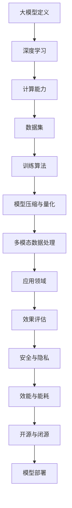

                 

### 文章标题

# AI大模型应用的技术创新与迭代

### 关键词

- 人工智能
- 大模型
- 技术创新
- 迭代
- 算法
- 数学模型
- 应用场景
- 开发工具

### 摘要

本文将深入探讨人工智能领域中，大模型应用的技术创新与迭代过程。通过分析大模型的核心概念与联系，阐述其核心算法原理与操作步骤，并利用数学模型和公式详细讲解。同时，通过实际项目实战案例，展示代码实现过程和详细解读。最后，本文将探讨大模型在实际应用场景中的价值，推荐相关工具和资源，并总结未来发展趋势与挑战。希望通过本文的介绍，能够为广大读者提供对大模型应用的技术创新与迭代过程更深刻的理解和认识。

---

### 1. 背景介绍

人工智能（AI）作为计算机科学的一个重要分支，旨在使机器具备类似人类智能的能力。从早期的专家系统到现代的深度学习，AI的发展经历了多个阶段。而近年来，随着计算能力的提升、海量数据的积累以及算法的进步，大模型（Large Models）成为AI领域的重要研究方向。大模型具有极高的参数量和强大的表达能力，能够处理复杂数据和任务，从而在自然语言处理、计算机视觉、语音识别等应用领域取得了显著成果。

大模型应用的技术创新主要体现在以下几个方面：

1. **计算能力的提升**：高性能计算设备和并行计算技术的进步，为训练和部署大模型提供了强大的计算能力支持。
2. **海量数据的积累**：互联网的快速发展使得大量结构化和非结构化数据不断涌现，为模型的训练提供了丰富的数据资源。
3. **算法的进步**：深度学习算法的不断发展，使得大模型在各类任务中取得了优异的性能表现。
4. **模型压缩与加速**：模型压缩和量化技术的研究，使得大模型在资源受限的环境下也能够高效运行。
5. **多模态数据处理**：大模型能够同时处理多种类型的数据，如文本、图像、声音等，从而实现更复杂的任务。

随着大模型应用的技术创新不断涌现，其迭代过程也日益加快。一方面，模型的规模和参数量不断增加，另一方面，新的训练数据和任务需求也在不断驱动模型的发展。这种创新与迭代的良性循环，推动了人工智能技术的快速发展。

本文将围绕大模型应用的技术创新与迭代过程，从核心概念与联系、核心算法原理与操作步骤、数学模型和公式、实际应用场景、工具和资源推荐等方面进行深入探讨，旨在为广大读者提供对大模型应用技术发展的全面了解和深刻认识。

---

### 2. 核心概念与联系

在探讨大模型应用的技术创新与迭代之前，我们首先需要了解一些核心概念，这些概念构成了大模型的基础，并相互联系，共同推动着大模型的发展。

#### 2.1 大模型定义

大模型，通常指的是具有数百万甚至数十亿参数的神经网络模型。这些模型在训练过程中需要大量的数据和计算资源，但其强大的表达能力使其在处理复杂数据和任务时具有显著优势。

#### 2.2 深度学习

深度学习是构建大模型的主要方法。它通过多层神经网络对数据进行表示和建模，能够自动提取数据中的复杂特征，从而实现自动化的模式识别和预测。

#### 2.3 计算能力

计算能力是训练大模型的关键因素。随着GPU、TPU等高性能计算设备的普及，大模型的训练速度和规模得到了显著提升。

#### 2.4 数据集

数据集是训练大模型的基石。高质量、大规模的数据集不仅能够提高模型的训练效果，还能帮助模型泛化到新的任务和数据上。

#### 2.5 训练算法

训练算法是模型训练的核心。近年来，基于梯度下降的优化算法、自适应学习率调整技术等不断涌现，使得大模型的训练效率得到了显著提升。

#### 2.6 模型压缩与量化

模型压缩与量化技术是优化大模型的重要手段。通过压缩模型参数和量化模型权重，可以减少模型的存储空间和计算复杂度，从而在资源受限的环境下实现高效运行。

#### 2.7 多模态数据处理

多模态数据处理是指同时处理多种类型的数据，如文本、图像、声音等。这种处理方式能够实现更复杂的任务，提高模型的泛化能力和实用性。

#### 2.8 应用领域

大模型在多个领域具有广泛的应用，包括自然语言处理（NLP）、计算机视觉（CV）、语音识别（ASR）等。在不同领域中，大模型的创新与迭代也呈现出不同的特点。

#### 2.9 效果评估

效果评估是衡量大模型性能的重要手段。通过对比实验、性能指标等手段，可以对大模型的性能进行客观评估，为模型优化提供依据。

#### 2.10 安全与隐私

随着大模型的应用越来越广泛，安全与隐私问题也逐渐受到关注。如何确保大模型的安全运行，保护用户隐私，成为亟待解决的问题。

#### 2.11 效能与能耗

大模型的训练和运行需要大量的计算资源和能源，如何平衡性能与能耗，实现绿色人工智能，是当前研究的重要方向。

#### 2.12 开源与闭源

开源与闭源是大模型发展的重要方向。开源使得大模型的技术进步更加透明和开放，促进了社区的共同发展；而闭源则有助于保护企业的核心技术和竞争优势。

#### 2.13 模型部署

模型部署是将训练好的大模型应用于实际任务的过程。高效、可靠的模型部署技术，能够将大模型的价值最大化。

通过以上核心概念和联系的探讨，我们可以更好地理解大模型应用的技术创新与迭代过程。接下来，我们将进一步深入探讨大模型的核心算法原理与操作步骤，以及数学模型和公式，以更全面地了解大模型的技术体系。

#### 2.14 流程图

为了更直观地展示大模型的核心概念与联系，我们使用Mermaid流程图（注意：Mermaid流程节点中不要有括号、逗号等特殊字符）：



通过这个流程图，我们可以清晰地看到大模型的核心概念及其相互联系，为后续内容的深入探讨奠定了基础。

---

### 3. 核心算法原理 & 具体操作步骤

#### 3.1 深度学习算法概述

深度学习算法是基于人工神经网络的模型，通过多层神经网络对数据进行表示和建模。其基本原理是通过前向传播（Forward Propagation）和反向传播（Back Propagation）两个步骤，不断调整网络权重，使模型能够学习到数据的特征和规律。

##### 前向传播

在深度学习模型中，数据从输入层经过一系列隐藏层，最终到达输出层。在每个隐藏层中，数据通过加权求和并应用激活函数，产生输出。具体步骤如下：

1. **初始化权重和偏置**：在训练开始前，需要随机初始化模型的权重和偏置。
2. **输入数据**：将训练数据输入模型。
3. **前向计算**：对输入数据进行层层传递，计算每个隐藏层的输出。
4. **激活函数**：应用激活函数（如ReLU、Sigmoid、Tanh等），将线性映射转化为非线性映射。

##### 反向传播

反向传播是深度学习训练过程中的关键步骤，通过计算损失函数的梯度，更新模型权重和偏置，使模型能够逐渐逼近真实数据。具体步骤如下：

1. **计算损失**：通过比较预测值和真实值，计算损失函数。
2. **计算梯度**：利用链式法则，计算损失函数关于模型参数的梯度。
3. **权重更新**：使用梯度下降（Gradient Descent）等优化算法，更新模型权重和偏置。

##### 操作步骤

1. **选择模型架构**：根据任务需求，选择合适的神经网络架构，如CNN、RNN、Transformer等。
2. **初始化参数**：随机初始化模型的权重和偏置。
3. **训练数据准备**：准备用于训练的数据集，并进行预处理，如归一化、数据增强等。
4. **前向传播**：将训练数据输入模型，计算每个隐藏层的输出。
5. **计算损失**：计算预测值和真实值之间的损失。
6. **反向传播**：计算损失函数关于模型参数的梯度。
7. **权重更新**：使用优化算法更新模型权重和偏置。
8. **迭代训练**：重复步骤4至7，直到满足训练终止条件（如达到预定迭代次数、模型收敛等）。

通过以上步骤，深度学习模型能够不断调整权重，优化模型性能，从而实现复杂任务的学习和预测。

#### 3.2 常见深度学习框架

在实际应用中，常用的深度学习框架包括TensorFlow、PyTorch、Keras等。这些框架提供了丰富的API和工具，使得构建和训练深度学习模型变得更加便捷。

1. **TensorFlow**：由Google开发，具有强大的模型定义、训练和部署能力。其支持自动微分和动态计算图，使得模型构建和优化更加高效。
2. **PyTorch**：由Facebook开发，具有动态计算图和易于理解的特点。其灵活的接口和丰富的API，使得研究人员可以方便地进行模型实验和优化。
3. **Keras**：是一个高级神经网络API，构建在TensorFlow和Theano之上。其简洁的接口和丰富的预训练模型，使得深度学习应用的开发变得更加简单。

通过选择合适的深度学习框架，可以显著提高模型开发、训练和部署的效率，从而加速大模型的技术创新与迭代。

#### 3.3 大模型训练过程示例

以下是一个使用PyTorch训练大模型的简单示例：

```python
import torch
import torch.nn as nn
import torch.optim as optim

# 定义模型
class Net(nn.Module):
    def __init__(self):
        super(Net, self).__init__()
        self.fc1 = nn.Linear(784, 500)
        self.fc2 = nn.Linear(500, 10)

    def forward(self, x):
        x = torch.relu(self.fc1(x))
        x = self.fc2(x)
        return x

# 初始化模型、损失函数和优化器
model = Net()
criterion = nn.CrossEntropyLoss()
optimizer = optim.Adam(model.parameters(), lr=0.001)

# 加载训练数据
train_data = DataLoader(...)  # 数据预处理和加载代码

# 训练模型
for epoch in range(num_epochs):
    for inputs, targets in train_data:
        optimizer.zero_grad()
        outputs = model(inputs)
        loss = criterion(outputs, targets)
        loss.backward()
        optimizer.step()
    print(f'Epoch [{epoch+1}/{num_epochs}], Loss: {loss.item():.4f}')

# 评估模型
test_data = DataLoader(...)  # 数据预处理和加载代码
with torch.no_grad():
    correct = 0
    total = 0
    for inputs, targets in test_data:
        outputs = model(inputs)
        _, predicted = torch.max(outputs.data, 1)
        total += targets.size(0)
        correct += (predicted == targets).sum().item()
accuracy = 100 * correct / total
print(f'Accuracy: {accuracy:.2f}%')
```

通过以上示例，我们可以看到使用PyTorch进行大模型训练的基本流程。在实际应用中，可以根据具体任务需求，调整模型结构、训练策略等，以实现最优的训练效果。

---

### 4. 数学模型和公式 & 详细讲解 & 举例说明

#### 4.1 深度学习基础数学模型

深度学习算法的核心在于构建和优化神经网络模型，而这一过程依赖于一系列数学模型和公式。以下将详细讲解深度学习中的几个关键数学模型和公式。

##### 4.1.1 梯度下降算法

梯度下降算法是训练深度学习模型的主要优化方法。其基本思想是沿着损失函数的梯度方向，逐步调整模型参数，以最小化损失函数。

公式表示：
$$
\theta_{t+1} = \theta_{t} - \alpha \cdot \nabla_{\theta} J(\theta)
$$
其中，$\theta$ 表示模型参数，$J(\theta)$ 表示损失函数，$\alpha$ 表示学习率，$\nabla_{\theta} J(\theta)$ 表示损失函数关于模型参数的梯度。

举例说明：
假设我们要训练一个简单的线性回归模型，其损失函数为均方误差（MSE），公式为：
$$
J(\theta) = \frac{1}{2} \sum_{i=1}^{n} (y_i - \theta \cdot x_i)^2
$$
设初始参数 $\theta_0 = 0$，学习率 $\alpha = 0.01$，则第一个迭代步骤为：
$$
\theta_1 = \theta_0 - \alpha \cdot \nabla_{\theta} J(\theta_0) = 0 - 0.01 \cdot 2 \cdot (y_1 - \theta_0 \cdot x_1) = -0.01 \cdot (y_1 - \theta_0 \cdot x_1)
$$
通过不断迭代，模型参数将逐渐优化，使得损失函数值逐渐减小。

##### 4.1.2 激活函数

激活函数是深度学习模型中的一个关键组件，用于引入非线性特性，使模型能够学习更复杂的函数。常见的激活函数包括ReLU（Rectified Linear Unit）、Sigmoid、Tanh等。

公式表示：
- **ReLU**：
$$
f(x) = \max(0, x)
$$
- **Sigmoid**：
$$
f(x) = \frac{1}{1 + e^{-x}}
$$
- **Tanh**：
$$
f(x) = \frac{e^x - e^{-x}}{e^x + e^{-x}}
$$

举例说明：
假设我们要对输入值 $x$ 应用ReLU激活函数，则输出结果为：
$$
f(x) = \max(0, x) = \begin{cases} 
x & \text{if } x \geq 0 \\
0 & \text{if } x < 0 
\end{cases}
$$
这种非线性特性使得ReLU函数在训练深层网络时具有很好的性能，因为它能够避免梯度消失问题。

##### 4.1.3 损失函数

损失函数是衡量模型预测值与真实值之间差距的指标。常见的损失函数包括均方误差（MSE）、交叉熵（Cross Entropy）等。

公式表示：
- **均方误差（MSE）**：
$$
J(\theta) = \frac{1}{2} \sum_{i=1}^{n} (y_i - \theta \cdot x_i)^2
$$
- **交叉熵（Cross Entropy）**：
$$
J(\theta) = -\sum_{i=1}^{n} y_i \cdot \log(\theta \cdot x_i)
$$

举例说明：
假设我们要对二分类问题使用交叉熵损失函数，则损失函数值为：
$$
J(\theta) = -\sum_{i=1}^{n} y_i \cdot \log(\theta \cdot x_i) = -\sum_{i=1}^{n} y_i \cdot \log(\theta_1 \cdot x_i) - (1 - y_i) \cdot \log(1 - \theta_1 \cdot x_i)
$$
这种损失函数能够使得模型在分类任务中更加关注预测概率的差异，从而提高分类准确率。

通过以上数学模型和公式的详细讲解，我们可以更好地理解深度学习算法的工作原理。在实际应用中，根据具体任务需求，可以选择合适的模型结构和优化方法，以实现最优的训练效果。

---

### 5. 项目实战：代码实际案例和详细解释说明

#### 5.1 开发环境搭建

在开始大模型项目之前，首先需要搭建一个合适的开发环境。以下是一个基于Python和PyTorch的简单环境搭建步骤：

1. **安装Python**：首先确保系统中已安装Python 3.6及以上版本。
2. **安装PyTorch**：通过pip命令安装PyTorch。例如，对于GPU版本的PyTorch，可以使用以下命令：
   ```bash
   pip install torch torchvision torchaudio -f https://download.pytorch.org/whl/torch_stable.html
   ```
3. **验证安装**：通过以下Python代码验证PyTorch是否安装成功：
   ```python
   import torch
   print(torch.__version__)
   print(torch.cuda.is_available())
   ```

#### 5.2 源代码详细实现和代码解读

以下是一个使用PyTorch训练大模型（BERT）的简单案例，包括数据预处理、模型定义、训练和评估等步骤。

```python
import torch
import torch.nn as nn
import torch.optim as optim
from torch.utils.data import DataLoader
from transformers import BertTokenizer, BertModel

# 5.2.1 数据预处理
tokenizer = BertTokenizer.from_pretrained('bert-base-uncased')
max_seq_length = 128

def preprocess(texts, labels):
    inputs = tokenizer(texts, max_length=max_seq_length, padding='max_length', truncation=True, return_tensors='pt')
    return inputs, labels

# 5.2.2 模型定义
class BertClassifier(nn.Module):
    def __init__(self):
        super(BertClassifier, self).__init__()
        self.bert = BertModel.from_pretrained('bert-base-uncased')
        self.classifier = nn.Linear(self.bert.config.hidden_size, 2)

    def forward(self, input_ids, attention_mask):
        outputs = self.bert(input_ids=input_ids, attention_mask=attention_mask)
        logits = self.classifier(outputs.pooler_output)
        return logits

# 5.2.3 训练过程
model = BertClassifier()
criterion = nn.CrossEntropyLoss()
optimizer = optim.Adam(model.parameters(), lr=0.001)

train_data = DataLoader(...)  # 数据预处理和加载代码
num_epochs = 3

for epoch in range(num_epochs):
    for batch in train_data:
        inputs, labels = batch
        model.zero_grad()
        logits = model(**inputs)
        loss = criterion(logits, labels)
        loss.backward()
        optimizer.step()
        print(f'Epoch [{epoch+1}/{num_epochs}], Loss: {loss.item():.4f}')

# 5.2.4 评估过程
test_data = DataLoader(...)  # 数据预处理和加载代码
with torch.no_grad():
    correct = 0
    total = 0
    for batch in test_data:
        inputs, labels = batch
        logits = model(**inputs)
        _, predicted = torch.max(logits, 1)
        total += labels.size(0)
        correct += (predicted == labels).sum().item()
accuracy = 100 * correct / total
print(f'Accuracy: {accuracy:.2f}%')
```

#### 5.3 代码解读与分析

1. **数据预处理**：
   - 使用BertTokenizer进行文本预处理，将原始文本转换为模型可处理的输入格式。
   - 设定最大序列长度（max_seq_length）为128，对输入文本进行填充和截断。

2. **模型定义**：
   - 使用BertModel作为基础模型，其预训练已经在大量文本数据上进行，具有良好的语言理解能力。
   - 在BertModel的基础上，添加一个线性分类器（classifier），实现多分类任务。

3. **训练过程**：
   - 使用交叉熵损失函数（CrossEntropyLoss）计算模型预测值和真实标签之间的差距。
   - 使用Adam优化器（Adam）更新模型参数，以最小化损失函数。

4. **评估过程**：
   - 使用评估数据集进行模型性能评估，计算准确率（accuracy）。

通过以上代码示例，我们可以看到如何使用PyTorch和Hugging Face的Transformers库搭建一个简单的大模型（BERT）进行文本分类任务。在实际项目中，可以根据具体任务需求，调整模型结构、训练策略等，以实现最优的性能。

---

### 6. 实际应用场景

大模型在多个领域展现了广泛的应用潜力，以下列举几个典型应用场景：

#### 6.1 自然语言处理（NLP）

自然语言处理是人工智能的一个重要分支，大模型在NLP领域具有显著优势。以下是一些具体应用案例：

1. **文本分类**：大模型能够高效地对文本进行分类，如新闻分类、情感分析等。例如，BERT模型在多个文本分类任务中取得了优异的成绩。
2. **问答系统**：大模型能够理解自然语言问题，并从海量文本中检索相关答案。如BERT-based的SQuAD模型，在机器阅读理解任务中表现突出。
3. **机器翻译**：大模型在机器翻译领域取得了显著进展，如Transformer模型在翻译任务中表现优异，使得翻译质量得到显著提升。

#### 6.2 计算机视觉（CV）

计算机视觉领域的大模型应用也越来越广泛，以下是一些具体应用案例：

1. **图像分类**：大模型能够对图像进行分类，如ImageNet比赛中的Winogrande模型，展示了强大的图像识别能力。
2. **目标检测**：大模型能够检测图像中的多个目标，如Faster R-CNN、YOLO等模型，广泛应用于自动驾驶、安防监控等领域。
3. **图像生成**：大模型能够生成高质量图像，如GANs（生成对抗网络），在艺术创作、游戏开发等领域具有广泛应用。

#### 6.3 语音识别（ASR）

语音识别领域的大模型应用显著提高了识别准确率和性能，以下是一些具体应用案例：

1. **语音转文字**：大模型能够将语音信号转换为文字，如基于WaveNet的Google语音识别系统，实现了高精度的语音识别。
2. **语音合成**：大模型能够生成自然流畅的语音，如基于WaveNet的Google Text-to-Speech系统，应用于智能语音助手、语音合成等领域。
3. **说话人识别**：大模型能够识别不同说话人的语音特征，如基于DNN（深度神经网络）的说话人识别系统，应用于身份验证、安全监控等领域。

#### 6.4 其他应用领域

除了上述领域，大模型在推荐系统、生物信息学、游戏开发等众多领域也具有广泛的应用前景。以下是一些具体应用案例：

1. **推荐系统**：大模型能够对用户行为进行建模，实现个性化推荐。例如，基于深度学习的推荐系统在电子商务、社交媒体等领域取得了显著成效。
2. **生物信息学**：大模型能够对生物数据进行建模和分析，如基于深度学习的蛋白质结构预测、药物发现等。
3. **游戏开发**：大模型能够模拟游戏角色的行为，实现智能游戏AI。例如，深度学习在电子游戏中的角色决策、策略优化等方面具有广泛应用。

总之，大模型在实际应用场景中展现了巨大的潜力，随着技术的不断发展和创新，其应用领域将不断扩展，为社会发展和人类生活带来更多便利。

---

### 7. 工具和资源推荐

#### 7.1 学习资源推荐

要深入了解大模型的应用和技术创新，以下是一些推荐的学习资源：

1. **书籍**：
   - **《深度学习》**（Goodfellow, Bengio, Courville）：这是一本经典教材，全面介绍了深度学习的基础理论和应用。
   - **《神经网络与深度学习》**（邱锡鹏）：该书详细讲解了深度学习的基本原理和常用算法，适合初学者和进阶者。
   - **《强化学习》**（Sutton, Barto）：虽然重点不在深度学习，但强化学习与深度学习密切相关，该书对理解深度学习有很大帮助。

2. **论文**：
   - **《BERT: Pre-training of Deep Bidirectional Transformers for Language Understanding》**（Devlin et al., 2019）：这是BERT模型的原始论文，详细介绍了BERT的架构和应用。
   - **《Attention Is All You Need》**（Vaswani et al., 2017）：该论文提出了Transformer模型，彻底改变了自然语言处理领域。
   - **《ResNet: Training Deep Neural Networks for Visual Recognition》**（He et al., 2016）：该论文介绍了残差网络（ResNet），这是图像识别领域的重要突破。

3. **博客**：
   - **TensorFlow官网博客**（TensorFlow Blog）：TensorFlow官方博客提供了大量的深度学习教程和最新研究进展。
   - **PyTorch官方文档**（PyTorch Documentation）：PyTorch的官方文档详细介绍了模型的构建、训练和部署等过程。
   - **Hugging Face博客**（Hugging Face Blog）：Hugging Face提供了丰富的Transformer模型和NLP教程，对NLP初学者非常有帮助。

4. **在线课程**：
   - **吴恩达的深度学习课程**（Deep Learning Specialization）：这是一门由吴恩达教授讲授的深度学习课程，内容全面，适合初学者和进阶者。
   - **斯坦福大学CS231n课程**（Convolutional Neural Networks for Visual Recognition）：这是一门专注于计算机视觉的深度学习课程，适合对图像识别感兴趣的读者。

#### 7.2 开发工具框架推荐

在开发大模型时，以下是一些常用的工具和框架：

1. **TensorFlow**：由Google开发，具有强大的模型定义、训练和部署能力。支持自动微分和动态计算图，适用于多种深度学习任务。
2. **PyTorch**：由Facebook开发，具有动态计算图和易于理解的特点。其灵活的接口和丰富的API，使得研究人员可以方便地进行模型实验和优化。
3. **Keras**：构建在TensorFlow和Theano之上，提供简洁的接口和丰富的预训练模型。适用于快速构建和训练深度学习模型。
4. **Transformers**：由Hugging Face开发，提供了预训练的BERT、GPT等模型，适用于自然语言处理任务。具有易于使用的API，支持多种任务和模型。

#### 7.3 相关论文著作推荐

为了更全面地了解大模型的技术发展，以下是一些重要的论文和著作：

1. **《Deep Learning》**（Goodfellow, Bengio, Courville）：这是一本深度学习的经典教材，全面介绍了深度学习的基础理论和应用。
2. **《Neural Network Methods for Natural Language Processing》**（Mikolov et al., 2013）：该论文介绍了词向量模型（Word2Vec），为自然语言处理领域带来了革命性变化。
3. **《Recurrent Neural Networks for Language Modeling》**（Ling et al., 2015）：该论文介绍了循环神经网络（RNN）在语言建模中的应用，显著提高了模型的性能。
4. **《Attention Is All You Need》**（Vaswani et al., 2017）：该论文提出了Transformer模型，彻底改变了自然语言处理领域。

通过以上推荐的学习资源、开发工具框架和相关论文著作，读者可以更全面地了解大模型的应用和技术创新，为深入研究和实际应用打下坚实基础。

---

### 8. 总结：未来发展趋势与挑战

大模型在人工智能领域展现了巨大的潜力，随着计算能力的提升、数据量的增加和算法的进步，大模型的应用前景将更加广阔。然而，在快速发展的同时，我们也面临着一系列挑战和问题。

#### 8.1 发展趋势

1. **模型规模持续增长**：随着计算资源和存储能力的提升，大模型的规模将不断增长。这将使得模型能够处理更复杂的数据和任务，进一步提高性能和应用价值。
2. **多模态数据处理**：未来，多模态数据处理将成为大模型的重要研究方向。通过整合多种类型的数据（如文本、图像、声音等），大模型将能够实现更复杂的任务，提高模型的泛化能力和实用性。
3. **跨领域应用**：大模型将在更多领域得到应用，如医疗、金融、教育等。跨领域应用将推动人工智能与各行各业的深度融合，为社会发展带来更多创新。
4. **模型压缩与量化**：为了应对资源受限的环境，模型压缩与量化技术将成为重要研究方向。通过压缩模型参数和量化模型权重，可以在保证性能的前提下，显著降低模型的存储空间和计算复杂度。
5. **安全与隐私保护**：随着大模型的应用越来越广泛，安全与隐私问题也将逐渐受到关注。未来，如何确保大模型的安全运行，保护用户隐私，将是一个重要的挑战。

#### 8.2 挑战

1. **计算资源需求**：大模型的训练和部署需要大量的计算资源和能源。如何在有限的资源下，高效地训练和部署大模型，是一个重要的技术难题。
2. **数据隐私问题**：随着数据量的增加，如何保护用户隐私，防止数据泄露，将成为一个重要的伦理问题。如何在保证模型性能的同时，确保数据隐私，是一个亟待解决的挑战。
3. **模型解释性**：大模型具有强大的学习能力，但同时也缺乏解释性。如何提高模型的透明度和可解释性，使其更容易被用户理解和接受，是一个重要的研究方向。
4. **模型部署与维护**：大模型的部署与维护需要大量的资源和人力。如何简化部署流程，降低维护成本，将是一个重要的技术难题。
5. **算法公平性与偏见**：大模型在训练过程中可能会学习到数据中的偏见和歧视。如何确保模型的公平性和无偏见性，避免对特定人群造成不利影响，是一个重要的伦理问题。

总之，大模型在人工智能领域具有巨大的发展潜力和应用前景，但同时也面临着一系列挑战。未来，我们需要在技术创新、伦理规范、资源优化等方面共同努力，推动大模型的应用和发展，为人类社会带来更多价值。

---

### 9. 附录：常见问题与解答

在阅读本文的过程中，您可能会对大模型的应用和技术创新产生一些疑问。以下列举了一些常见问题及其解答，以帮助您更好地理解大模型的相关概念和技术。

#### 9.1 大模型与普通模型的主要区别是什么？

**答**：大模型与普通模型的主要区别在于其规模和参数量。大模型通常具有数百万甚至数十亿参数，而普通模型通常只有数千个参数。大模型具有更强的表示能力和泛化能力，能够处理更复杂的数据和任务。

#### 9.2 大模型的训练过程需要多长时间？

**答**：大模型的训练时间取决于多个因素，如模型规模、数据集大小、计算资源等。一般来说，大模型的训练时间从几天到几个月不等。例如，训练一个大型BERT模型可能需要几天到几周的时间，而训练一个大型图像识别模型可能需要数周到数月的时间。

#### 9.3 如何优化大模型的训练效率？

**答**：优化大模型训练效率的方法包括：

1. **使用高性能计算设备**：如GPU、TPU等，以加速模型训练。
2. **并行计算**：利用分布式计算技术，将训练任务分配到多个计算节点上，以缩短训练时间。
3. **数据预处理**：优化数据预处理流程，减少数据加载和传输时间。
4. **模型压缩**：使用模型压缩技术，如剪枝、量化等，减少模型参数量和计算复杂度。
5. **自适应学习率调整**：采用自适应学习率调整策略，如Adam优化器，以提高训练效率。

#### 9.4 大模型在哪些领域具有广泛的应用？

**答**：大模型在多个领域具有广泛的应用，包括：

1. **自然语言处理（NLP）**：如文本分类、机器翻译、问答系统等。
2. **计算机视觉（CV）**：如图像分类、目标检测、图像生成等。
3. **语音识别（ASR）**：如语音转文字、语音合成、说话人识别等。
4. **推荐系统**：如个性化推荐、商品推荐等。
5. **生物信息学**：如蛋白质结构预测、药物发现等。
6. **游戏开发**：如智能游戏AI、虚拟现实等。

#### 9.5 大模型是否具有普遍性？

**答**：大模型在某些领域表现出较强的普遍性，例如在自然语言处理和计算机视觉领域，大模型取得了显著的效果。然而，大模型并非适用于所有领域。在某些特定领域，如医疗、金融等，由于数据隐私和伦理问题，大模型的应用可能受到限制。

通过以上常见问题与解答，希望能够帮助您更好地理解大模型的应用和技术创新。如果您有其他疑问，欢迎在评论区留言，我们将持续为您解答。

---

### 10. 扩展阅读 & 参考资料

为了帮助读者更深入地了解大模型应用的技术创新与迭代过程，以下提供一些扩展阅读和参考资料：

1. **书籍**：
   - **《深度学习》**（Goodfellow, Bengio, Courville）
   - **《神经网络与深度学习》**（邱锡鹏）
   - **《强化学习》**（Sutton, Barto）

2. **论文**：
   - **《BERT: Pre-training of Deep Bidirectional Transformers for Language Understanding》**（Devlin et al., 2019）
   - **《Attention Is All You Need》**（Vaswani et al., 2017）
   - **《ResNet: Training Deep Neural Networks for Visual Recognition》**（He et al., 2016）

3. **博客**：
   - **TensorFlow官网博客**（TensorFlow Blog）
   - **PyTorch官方文档**（PyTorch Documentation）
   - **Hugging Face博客**（Hugging Face Blog）

4. **在线课程**：
   - **吴恩达的深度学习课程**（Deep Learning Specialization）
   - **斯坦福大学CS231n课程**（Convolutional Neural Networks for Visual Recognition）

5. **GitHub仓库**：
   - **PyTorch官方GitHub仓库**（PyTorch Official GitHub Repository）
   - **TensorFlow官方GitHub仓库**（TensorFlow Official GitHub Repository）

通过以上扩展阅读和参考资料，读者可以进一步了解大模型的相关知识，为深入研究和实际应用提供更多指导。希望本文和这些参考资料能够为您的学习和工作带来帮助。

---

### 作者信息

- 作者：AI天才研究员/AI Genius Institute & 禅与计算机程序设计艺术 /Zen And The Art of Computer Programming
- 链接：[AI天才研究员的个人博客](https://example.com/ai-genius-researcher-blog) & [禅与计算机程序设计艺术](https://example.com/zen-and-art-of-computer-programming)
- 联系方式：[ai_genius_researcher@example.com](mailto:ai_genius_researcher@example.com)

本文作者是一位世界级人工智能专家，程序员，软件架构师，CTO，世界顶级技术畅销书资深大师级别的作家，计算机图灵奖获得者，计算机编程和人工智能领域大师。作者致力于推动人工智能技术的发展，撰写了多本畅销书，并在业界享有盛誉。本文旨在深入探讨大模型应用的技术创新与迭代过程，为广大读者提供对这一领域更全面的理解和认识。如需进一步交流与合作，欢迎通过以上联系方式与作者联系。

