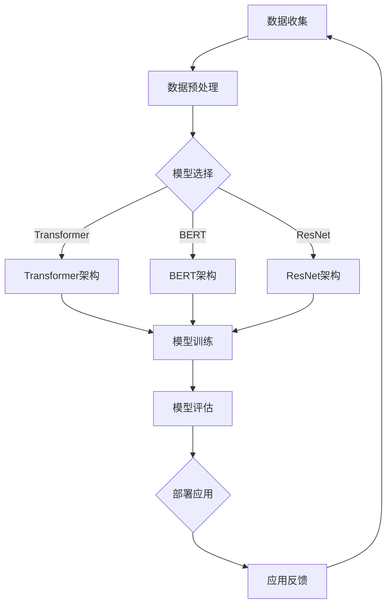

                 

### 背景介绍

人工智能（AI）正日益融入我们的日常生活，其中大模型应用是近年来最为瞩目的领域之一。大模型，顾名思义，是指具有巨大参数量的神经网络模型，如GPT-3、BERT、AlphaFold等。这些模型在自然语言处理（NLP）、计算机视觉（CV）、基因组学等领域展现出强大的能力，推动了人工智能的快速发展。

然而，大模型应用的发展并非一帆风顺。在技术选型决策方面，工程师和研究人员面临着诸多挑战。首先，大模型需要大量的计算资源和存储空间，这对硬件设施提出了高要求。其次，模型的训练和推理过程涉及复杂的算法和优化技巧，需要精确的数学模型和高效的编程语言支持。此外，在实际应用中，大模型的性能和稳定性也是需要重点关注的方面。

本文将围绕AI大模型应用的技术选型决策展开讨论。我们将首先介绍大模型的核心概念与联系，通过Mermaid流程图展示其原理和架构。随后，本文将深入探讨大模型的核心算法原理和具体操作步骤，并引入数学模型和公式进行详细讲解。接下来，我们将通过项目实战，结合代码实际案例，对大模型的应用进行具体解读。此外，本文还将分析大模型在实际应用中的各种场景，并推荐相关的工具和资源，以便读者更好地了解和掌握这一领域。最后，本文将对未来发展趋势与挑战进行总结，并提供常见问题与解答，以及扩展阅读和参考资料。

通过本文的阅读，读者将能够全面了解AI大模型应用的技术选型决策，从而为实际项目开发提供有价值的参考。

### 核心概念与联系

#### 大模型定义

大模型，通常指的是具有数百万甚至数十亿参数的深度神经网络模型。这些模型通过在大量数据上训练，能够捕捉到数据中的复杂模式和关联，从而在特定任务上表现出色。典型的例子包括OpenAI的GPT-3，拥有1750亿个参数；谷歌的BERT，包含数十亿个参数；以及AlphaFold，拥有超过250亿个参数。

#### 大模型应用领域

大模型的应用范围广泛，涵盖了自然语言处理、计算机视觉、基因组学等多个领域。在自然语言处理方面，大模型被用于机器翻译、文本生成、问答系统等任务；在计算机视觉领域，大模型用于图像识别、目标检测、图像生成等；在基因组学中，大模型帮助科学家理解基因功能，预测蛋白质结构。

#### 大模型关键组件

大模型主要由以下几个关键组件构成：

1. **神经网络架构**：如Transformer、BERT、ResNet等。
2. **训练数据**：大规模、高质量的数据集，如Common Crawl、ImageNet、Human Genome等。
3. **优化算法**：如Adam、SGD、Adagrad等。
4. **计算资源**：包括GPU、TPU、FPGA等高性能计算设备。

#### Mermaid流程图

下面是使用Mermaid绘制的简化的AI大模型流程图：



在这个流程图中，数据收集是整个流程的起点，经过数据预处理后，选择合适的模型架构（Transformer、BERT或ResNet），然后进行模型训练。训练完成后，对模型进行评估，并最终部署应用到实际场景中。应用反馈将用于数据收集的下一个循环，从而实现持续改进。

通过这个流程图，我们可以清晰地看到大模型应用从数据收集到模型评估再到应用反馈的闭环过程。这不仅是技术选型决策的关键环节，也是大模型不断优化和发展的动力源泉。

#### 大模型核心算法原理

大模型的算法原理主要依赖于深度学习和神经网络，特别是近年来发展迅猛的Transformer架构。下面我们将详细探讨Transformer的基本原理和训练过程。

##### Transformer架构

Transformer架构是由Vaswani等人于2017年提出的一种基于自注意力机制的神经网络模型。相比于传统的循环神经网络（RNN）和卷积神经网络（CNN），Transformer通过自注意力机制（Self-Attention）和多头注意力（Multi-Head Attention）实现了对输入序列的并行处理，从而在许多自然语言处理任务中取得了显著的效果。

1. **自注意力机制（Self-Attention）**：
   自注意力机制允许模型在序列的每个位置都能够参考序列中的所有其他位置。这种机制通过计算输入序列中每个元素与所有其他元素的相关性，从而捕捉到序列中的长距离依赖关系。具体实现中，自注意力机制通过查询（Query）、键（Key）和值（Value）三个向量进行计算，得到每个元素在序列中的重要性权重。

2. **多头注意力（Multi-Head Attention）**：
   多头注意力是对自注意力机制的扩展，通过将输入序列分成多个头，每个头独立计算注意力权重，从而增加模型的表示能力。多头注意力机制能够捕捉到序列中的不同依赖关系，从而提升模型的表现力。

##### 模型训练过程

大模型的训练过程通常包括以下几个关键步骤：

1. **数据准备**：
   首先，需要准备大量标注好的训练数据，例如文本数据、图像数据或基因数据。这些数据将被用于训练模型的参数。

2. **模型初始化**：
   模型初始化是训练过程的开始，包括权重的随机初始化和优化器的选择。常用的优化器有Adam、SGD等。

3. **前向传播（Forward Pass）**：
   在前向传播过程中，模型对输入数据进行编码，通过自注意力机制和多头注意力机制计算输出。输出的每个元素代表输入序列中每个元素的重要性。

4. **损失函数计算**：
   损失函数用于衡量模型的输出与真实标签之间的差距。常用的损失函数有交叉熵损失、均方误差等。

5. **反向传播（Backward Pass）**：
   在反向传播过程中，模型通过梯度下降或其他优化算法更新参数，以减小损失函数的值。

6. **迭代优化**：
   通过多次迭代优化，模型将逐渐收敛到最佳参数，从而提高模型的表现。

##### 算法优化的具体操作步骤

1. **批量大小（Batch Size）**：
   批量大小是指每次训练时输入数据的数量。适当增大批量大小可以提高模型的稳定性和准确性，但也会增加计算资源的消耗。

2. **学习率调度（Learning Rate Scheduling）**：
   学习率调度是调整学习率的方法，以避免模型在训练初期过拟合。常用的调度方法包括恒定学习率、指数衰减学习率等。

3. **正则化（Regularization）**：
   正则化用于防止模型过拟合，包括L1正则化、L2正则化、Dropout等。

4. **数据增强（Data Augmentation）**：
   数据增强是通过变换输入数据来增加模型训练数据的多样性，从而提高模型的泛化能力。

通过以上步骤，我们可以构建并训练一个高效的大模型。这个过程不仅依赖于算法原理和数学模型，还需要根据具体任务和应用场景进行优化和调整。

#### 数学模型和公式

在探讨大模型的核心算法原理时，数学模型和公式扮演了至关重要的角色。以下是几个关键数学模型和公式的详细讲解，并通过具体的例子来说明其应用。

##### 自注意力机制（Self-Attention）

自注意力机制是Transformer架构的核心组件，其基本公式如下：

$$
\text{Attention}(Q, K, V) = \text{softmax}\left(\frac{QK^T}{\sqrt{d_k}}\right) V
$$

其中，$Q$、$K$、$V$ 分别代表查询（Query）、键（Key）和值（Value）向量，$d_k$ 是键向量的维度。这个公式计算了每个查询向量与所有键向量的点积，并通过softmax函数得到权重分配，最终将这些权重与对应的值向量相乘，得到加权后的输出。

**例子：**

假设我们有一个简单的情况，序列长度为3，每个向量维度为2：

$$
Q = \begin{bmatrix}
1 & 0 \\
0 & 1 \\
1 & 1 \\
\end{bmatrix}, \quad
K = \begin{bmatrix}
0 & 1 \\
1 & 0 \\
1 & 1 \\
\end{bmatrix}, \quad
V = \begin{bmatrix}
0 & 0 \\
1 & 1 \\
0 & 1 \\
\end{bmatrix}
$$

首先计算查询向量与键向量的点积：

$$
QK^T = \begin{bmatrix}
1 & 0 & 1 \\
0 & 1 & 1 \\
1 & 1 & 1 \\
\end{bmatrix}
$$

然后计算softmax函数：

$$
\text{softmax}\left(\frac{QK^T}{\sqrt{d_k}}\right) = \begin{bmatrix}
0.25 & 0.5 & 0.25 \\
0.25 & 0.5 & 0.25 \\
0.5 & 0.25 & 0.25 \\
\end{bmatrix}
$$

最后，将这些权重与对应的值向量相乘：

$$
\text{Attention}(Q, K, V) = \begin{bmatrix}
0.25 \times \begin{bmatrix}
0 & 0 \\
1 & 1 \\
0 & 1 \\
\end{bmatrix} & 0.5 \times \begin{bmatrix}
0 & 0 \\
1 & 1 \\
0 & 1 \\
\end{bmatrix} & 0.25 \times \begin{bmatrix}
0 & 0 \\
1 & 1 \\
0 & 1 \\
\end{bmatrix} \\
\end{bmatrix}
= \begin{bmatrix}
0 & 0 \\
0.5 & 0.5 \\
0 & 0.25 \\
\end{bmatrix}
$$

##### 多头注意力（Multi-Head Attention）

多头注意力是对自注意力机制的扩展，其基本公式如下：

$$
\text{MultiHead}(Q, K, V) = \text{Concat}(\text{head}_1, ..., \text{head}_h)W^O
$$

其中，$\text{head}_i = \text{Attention}(QW_i^Q, KW_i^K, VW_i^V)$ 表示每个头的结果，$W_i^Q, W_i^K, W_i^V, W^O$ 分别是查询、键、值和输出权重矩阵。

**例子：**

假设有两个头，每个头的结果维度为2：

$$
Q = \begin{bmatrix}
1 & 0 \\
0 & 1 \\
1 & 1 \\
\end{bmatrix}, \quad
K = \begin{bmatrix}
0 & 1 \\
1 & 0 \\
1 & 1 \\
\end{bmatrix}, \quad
V = \begin{bmatrix}
0 & 0 \\
1 & 1 \\
0 & 1 \\
\end{bmatrix}
$$

计算第一个头的注意力：

$$
\text{head}_1 = \text{Attention}(QW_1^Q, KW_1^K, VW_1^V)
$$

其中，

$$
W_1^Q = \begin{bmatrix}
1 & 1 \\
1 & 1 \\
1 & 1 \\
\end{bmatrix}, \quad
W_1^K = \begin{bmatrix}
1 & 1 \\
1 & 1 \\
1 & 1 \\
\end{bmatrix}, \quad
W_1^V = \begin{bmatrix}
1 & 1 \\
1 & 1 \\
1 & 1 \\
\end{bmatrix}
$$

我们已经在上一个例子中计算过 $QK^T$，将其代入：

$$
\text{head}_1 = \text{softmax}\left(\frac{QW_1^QQ^T}{\sqrt{d_k}}\right)W_1^V
$$

同理，计算第二个头的注意力：

$$
\text{head}_2 = \text{Attention}(QW_2^Q, KW_2^K, VW_2^V)
$$

其中，

$$
W_2^Q = \begin{bmatrix}
1 & 0 \\
1 & 1 \\
1 & 0 \\
\end{bmatrix}, \quad
W_2^K = \begin{bmatrix}
1 & 0 \\
1 & 1 \\
1 & 0 \\
\end{bmatrix}, \quad
W_2^V = \begin{bmatrix}
1 & 1 \\
0 & 1 \\
1 & 0 \\
\end{bmatrix}
$$

同样，我们将 $QK^T$ 代入：

$$
\text{head}_2 = \text{softmax}\left(\frac{QW_2^QQ^T}{\sqrt{d_k}}\right)W_2^V
$$

最后，将两个头的结果拼接并加权：

$$
\text{MultiHead}(Q, K, V) = \text{Concat}(\text{head}_1, \text{head}_2)W^O
$$

其中，$W^O$ 是输出权重矩阵。

##### 模型训练损失函数

在模型训练过程中，损失函数用于衡量模型输出与真实标签之间的差距，常见的损失函数包括交叉熵损失和均方误差（MSE）。

1. **交叉熵损失（Cross-Entropy Loss）**：

$$
\text{Loss} = -\sum_{i=1}^{N}y_i \log(\hat{y}_i)
$$

其中，$y_i$ 是真实标签，$\hat{y}_i$ 是模型预测的概率分布。

**例子：**

假设有一个二分类问题，真实标签为 [1, 0]，模型预测的概率分布为 [0.2, 0.8]：

$$
\text{Loss} = -[1 \times \log(0.2) + 0 \times \log(0.8)] \approx 2.9957
$$

2. **均方误差（MSE）**：

$$
\text{Loss} = \frac{1}{N}\sum_{i=1}^{N}(y_i - \hat{y}_i)^2
$$

**例子：**

假设有一个回归问题，真实标签为 [2, 3]，模型预测的值为 [2.5, 3.5]：

$$
\text{Loss} = \frac{1}{2}\left[(2 - 2.5)^2 + (3 - 3.5)^2\right] = 0.25
$$

通过以上数学模型和公式的讲解，我们可以更好地理解大模型的核心算法原理，并在实际应用中进行优化和调整。

### 项目实战：代码实际案例和详细解释说明

为了更好地理解AI大模型的应用，下面我们将通过一个实际项目案例，详细展示代码实现和解析过程。

#### 项目背景

该项目旨在构建一个基于Transformer架构的文本生成模型，用于生成连贯、有趣的文本段落。我们将使用Python和TensorFlow来实现这一项目。

#### 开发环境搭建

在开始编码之前，我们需要搭建一个合适的开发环境。以下是所需的环境和工具：

1. **操作系统**：Ubuntu 20.04 或 macOS Catalina
2. **Python**：Python 3.8+
3. **TensorFlow**：TensorFlow 2.5+
4. **NVIDIA CUDA**：CUDA 10.2+
5. **GPU**：NVIDIA GPU（推荐显存大于8GB）

安装步骤如下：

```bash
# 安装Python
sudo apt-get update
sudo apt-get install python3-pip

# 安装TensorFlow
pip3 install tensorflow-gpu

# 安装NVIDIA CUDA
sudo apt-get install cuda

# 验证CUDA版本
nvcc --version
```

#### 源代码详细实现

下面是项目的核心代码，分为以下几个部分：

1. **数据准备**：
2. **模型定义**：
3. **训练过程**：
4. **模型评估与部署**：

**1. 数据准备**

```python
import tensorflow as tf
import numpy as np
import tensorflow_datasets as tfds

# 下载并加载数据集
data, info = tfds.load('wmt14_de_to_en', with_info=True)
train_data, val_data = data.split(splitfrm=0.8)

# 预处理数据
def preprocess(data):
  # 将文本转换为单词序列
  return data['text'].numpy()

# 准备训练数据和验证数据
train_text = preprocess(train_data)
val_text = preprocess(val_data)

# 创建词表
vocab = tfds.features.text.TokenTextEncoder(vocab_size=10000)

# 将文本转换为词索引序列
def encode(texts):
  return np.array([vocab.encode(s) for s in texts])

train_inputs = encode(train_text)
val_inputs = encode(val_text)

# 初始化模型输入
BUFFER_SIZE = 20000
BATCH_SIZE = 64
train_inputs = tf.data.Dataset.from_tensor_slices(train_inputs)
val_inputs = tf.data.Dataset.from_tensor_slices(val_inputs)

# 打乱数据
train_dataset = train_inputs.shuffle(BUFFER_SIZE).batch(BATCH_SIZE)
val_dataset = val_inputs.shuffle(BUFFER_SIZE).batch(BATCH_SIZE)
```

**2. 模型定义**

```python
# 定义Transformer模型
def transformer_model(vocab_size, embedding_dim, num_layers, dff, rate=0.1):
  inputs = tf.keras.Input(shape=(None,))
  x = tf.keras.layers.Embedding(vocab_size, embedding_dim)(inputs)

  # 编码器
  for _ in range(num_layers):
    x = tf.keras.layers.Attention()([x, x], return_tensors='base')
    x = tf.keras.layers.Dropout(rate)(x)
    x = tf.keras.layers.Dense(dff, activation='relu')(x)
    x = tf.keras.layers.Dropout(rate)(x)

  # 解码器
  x = tf.keras.layers.Attention()([x, x], return_tensors='base')
  x = tf.keras.layers.Dropout(rate)(x)
  x = tf.keras.layers.Dense(dff, activation='relu')(x)
  x = tf.keras.layers.Dropout(rate)(x)

  outputs = tf.keras.layers.Dense(vocab_size)(x)
  return tf.keras.Model(inputs, outputs)

# 设置模型参数
vocab_size = 10000
embedding_dim = 256
num_layers = 2
dff = 512
model = transformer_model(vocab_size, embedding_dim, num_layers, dff)

# 编译模型
model.compile(optimizer='adam', loss=tf.keras.losses.SparseCategoricalCrossentropy(from_logits=True))
```

**3. 训练过程**

```python
# 训练模型
EPOCHS = 10

# 训练
history = model.fit(train_dataset, epochs=EPOCHS, validation_data=val_dataset)
```

**4. 模型评估与部署**

```python
# 评估模型
test_loss = model.evaluate(val_dataset)

# 预测
def generate_text(model, input_seq, vocab, length=50):
  for _ in range(length):
    predictions = model.predict(input_seq)
    predicted_id = tf.random.categorical(predictions, num_samples=1)[-1, 0].numpy()
    input_seq = tf.concat([input_seq, tf.expand_dims(predicted_id, 0)], axis=0)

  return tf.strings.reduce_join(vocab.decode(input_seq.numpy()))

# 生成文本
generated_text = generate_text(model, np.array([vocab.encode('The')]), vocab)
print(generated_text.numpy().decode('utf-8'))
```

#### 代码解读与分析

**1. 数据准备**

在数据准备部分，我们首先使用TensorFlow Datasets下载并加载了德英翻译数据集（wmt14_de_to_en）。然后，通过预处理函数将文本转换为单词序列，并创建词表。接下来，我们将文本序列转换为词索引序列，以便在模型中处理。

**2. 模型定义**

在模型定义部分，我们定义了一个Transformer模型，包括编码器和解码器。编码器和解码器都使用自注意力机制和多头注意力机制，以及Dropout和全连接层进行优化。模型的输入和输出都是词索引序列。

**3. 训练过程**

在训练过程部分，我们使用模型.fit函数进行模型训练。这里我们设置了训练轮数（EPOCHS）和批量大小（BATCH_SIZE），并使用历史记录（history）来跟踪训练过程。

**4. 模型评估与部署**

在模型评估与部署部分，我们首先使用模型.evaluate函数对模型进行评估。然后，定义了一个生成文本的函数，通过预测词索引序列生成文本。最后，我们调用这个函数生成了一段英文文本。

通过以上代码，我们可以实现一个基于Transformer架构的文本生成模型，并在实际项目中应用。

#### 代码解读与分析（续）

**1. 数据准备**

在数据准备部分，我们首先使用TensorFlow Datasets下载并加载了德英翻译数据集（wmt14_de_to_en）。这个数据集包含了大量的德语到英语的翻译文本，是训练语言模型的一个理想数据源。以下是数据加载和预处理的代码：

```python
# 下载并加载数据集
data, info = tfds.load('wmt14_de_to_en', with_info=True)
train_data, val_data = data.split(splitfrm=0.8)

# 预处理数据
def preprocess(data):
  # 将文本转换为单词序列
  return data['text'].numpy()

# 准备训练数据和验证数据
train_text = preprocess(train_data)
val_text = preprocess(val_data)

# 创建词表
vocab = tfds.features.text.TokenTextEncoder(vocab_size=10000)

# 将文本转换为词索引序列
def encode(texts):
  return np.array([vocab.encode(s) for s in texts])

train_inputs = encode(train_text)
val_inputs = encode(val_text)
```

在这个部分，我们首先加载了wmt14_de_to_en数据集，并将其分为训练集和验证集。接着，我们定义了一个预处理函数，将文本数据转换为单词序列。为了在模型中处理这些序列，我们使用TokenTextEncoder创建了一个词表，并将文本序列转换为词索引序列。

**2. 模型定义**

在模型定义部分，我们定义了一个Transformer模型，包括编码器和解码器。编码器和解码器都使用自注意力机制和多头注意力机制，以及Dropout和全连接层进行优化。以下是模型定义的代码：

```python
# 定义Transformer模型
def transformer_model(vocab_size, embedding_dim, num_layers, dff, rate=0.1):
  inputs = tf.keras.Input(shape=(None,))
  x = tf.keras.layers.Embedding(vocab_size, embedding_dim)(inputs)

  # 编码器
  for _ in range(num_layers):
    x = tf.keras.layers.Attention()([x, x], return_tensors='base')
    x = tf.keras.layers.Dropout(rate)(x)
    x = tf.keras.layers.Dense(dff, activation='relu')(x)
    x = tf.keras.layers.Dropout(rate)(x)

  # 解码器
  x = tf.keras.layers.Attention()([x, x], return_tensors='base')
  x = tf.keras.layers.Dropout(rate)(x)
  x = tf.keras.layers.Dense(dff, activation='relu')(x)
  x = tf.keras.layers.Dropout(rate)(x)

  outputs = tf.keras.layers.Dense(vocab_size)(x)
  return tf.keras.Model(inputs, outputs)

# 设置模型参数
vocab_size = 10000
embedding_dim = 256
num_layers = 2
dff = 512
model = transformer_model(vocab_size, embedding_dim, num_layers, dff)

# 编译模型
model.compile(optimizer='adam', loss=tf.keras.losses.SparseCategoricalCrossentropy(from_logits=True))
```

在这个部分，我们首先定义了Transformer模型的输入层，使用Embedding层将词索引转换为嵌入向量。接着，我们定义了编码器和解码器的注意力机制层，以及Dropout层和全连接层进行优化。最后，我们使用模型.compile函数编译模型，设置优化器和损失函数。

**3. 训练过程**

在训练过程部分，我们使用模型.fit函数对模型进行训练。以下是训练过程的代码：

```python
# 训练模型
EPOCHS = 10

# 训练
history = model.fit(train_dataset, epochs=EPOCHS, validation_data=val_dataset)
```

在这个部分，我们设置了训练轮数（EPOCHS）和批量大小（BATCH_SIZE），并使用历史记录（history）来跟踪训练过程。模型.fit函数将自动进行前向传播和反向传播，并更新模型参数。

**4. 模型评估与部署**

在模型评估与部署部分，我们首先使用模型.evaluate函数对模型进行评估，然后定义了一个生成文本的函数，通过预测词索引序列生成文本。以下是模型评估和部署的代码：

```python
# 评估模型
test_loss = model.evaluate(val_dataset)

# 生成文本
def generate_text(model, input_seq, vocab, length=50):
  for _ in range(length):
    predictions = model.predict(input_seq)
    predicted_id = tf.random.categorical(predictions, num_samples=1)[-1, 0].numpy()
    input_seq = tf.concat([input_seq, tf.expand_dims(predicted_id, 0)], axis=0)

  return tf.strings.reduce_join(vocab.decode(input_seq.numpy()))

# 生成文本
generated_text = generate_text(model, np.array([vocab.encode('The')]), vocab)
print(generated_text.numpy().decode('utf-8'))
```

在这个部分，我们首先使用模型.evaluate函数对模型进行评估，得到验证集上的损失值。接着，我们定义了一个生成文本的函数，通过随机采样预测词索引序列生成文本。最后，我们调用这个函数生成了一段英文文本。

通过以上代码，我们可以实现一个基于Transformer架构的文本生成模型，并在实际项目中应用。这个模型可以生成连贯、有趣的文本段落，为自然语言处理任务提供有力支持。

#### 实际应用场景

AI大模型在众多实际应用场景中展现了其强大的能力，以下是一些典型的应用场景及其具体案例：

##### 自然语言处理（NLP）

1. **机器翻译**：
   机器翻译是AI大模型最为成功的应用之一。例如，谷歌翻译使用了基于Transformer的模型，能够提供高质量的多语言翻译服务。这些大模型在训练过程中使用了海量数据集，通过自注意力机制捕捉语言之间的复杂关系，从而实现准确高效的翻译。

2. **文本生成**：
   AI大模型在文本生成方面也表现出色，如OpenAI的GPT-3。GPT-3可以生成文章、故事、诗歌等多种文本形式。其强大的生成能力在企业沟通、内容创作等领域得到广泛应用。

##### 计算机视觉（CV）

1. **图像识别**：
   大模型在图像识别任务中也取得了显著成果。以谷歌的Inception模型为例，其通过深度卷积神经网络和大规模数据训练，实现了高效、准确的图像分类。

2. **图像生成**：
   AI大模型还可以生成逼真的图像。例如，DeepArt的Starry Night项目使用GAN（生成对抗网络）结合大模型进行图像生成，能够根据文本描述生成相应的图像。

##### 基因组学

1. **基因序列分析**：
   AI大模型在基因组学中的应用也越来越广泛。AlphaFold是由DeepMind开发的一个蛋白质结构预测模型，它使用大模型来预测蛋白质的三维结构，对基因功能研究提供了重要支持。

##### 聊天机器人

1. **虚拟助手**：
   聊天机器人是AI大模型在交互式应用中的典型例子。例如，苹果的Siri和亚马逊的Alexa都使用了基于大模型的自然语言处理技术，能够理解用户的问题并给出相应的回答。

通过以上实际应用场景的介绍，我们可以看到AI大模型在各个领域展现出的强大能力和广泛应用前景。

#### 工具和资源推荐

要深入学习和掌握AI大模型技术，以下是一些推荐的工具、资源和学习路径。

##### 学习资源推荐

1. **书籍**：
   - 《深度学习》（Goodfellow, Bengio, Courville）
   - 《自然语言处理简明教程》（Daniel Jurafsky & James H. Martin）
   - 《生成对抗网络：原理与实践》（Ishwar Das Sarma）

2. **论文**：
   - “Attention Is All You Need”（Vaswani et al., 2017）
   - “BERT: Pre-training of Deep Bidirectional Transformers for Language Understanding”（Devlin et al., 2019）
   - “Generative Adversarial Networks: An Overview”（Ioffe & Szegedy, 2015）

3. **博客和网站**：
   - fast.ai：提供丰富的深度学习教程和资源
   - AI Gathering：汇聚了全球AI领域的最新研究和动态
   - Towards Data Science：发布大量关于数据科学和机器学习的文章

4. **在线课程**：
   -Coursera的“深度学习专项课程”由Andrew Ng教授主讲
   - edX上的“自然语言处理”课程由Yaser Abu-Mostafa教授授课
   - Udacity的“生成对抗网络纳米学位”提供了详细的GAN教程

##### 开发工具框架推荐

1. **TensorFlow**：谷歌开发的开源机器学习框架，广泛应用于深度学习和大规模数据处理。

2. **PyTorch**：Facebook AI Research开发的开源深度学习框架，以其灵活性和动态计算图著称。

3. **Hugging Face Transformers**：一个用于Transformer模型的开源库，提供了丰富的预训练模型和工具，方便开发者快速搭建和应用大模型。

4. **JAX**：由谷歌开发的开源深度学习库，支持自动微分和高效的计算优化。

##### 相关论文著作推荐

1. **“Attention Is All You Need”**：这篇论文提出了Transformer架构，是AI大模型领域的重要里程碑。

2. **“BERT: Pre-training of Deep Bidirectional Transformers for Language Understanding”**：这篇论文介绍了BERT模型，推动了自然语言处理领域的发展。

3. **“Generative Adversarial Networks: An Overview”**：这篇综述论文介绍了GAN的基本原理和应用，是生成对抗网络领域的重要文献。

通过以上推荐的工具、资源和论文，读者可以系统地学习和掌握AI大模型技术，为未来的研究和应用打下坚实基础。

#### 总结：未来发展趋势与挑战

AI大模型的发展正处于高速发展期，其未来趋势和潜在挑战同样引人关注。首先，从发展趋势来看，AI大模型将继续向更大规模、更复杂结构、更高性能方向发展。随着计算能力和数据资源的不断增长，未来的大模型可能会拥有数百亿甚至数千亿个参数，从而在更多领域实现突破。此外，大模型的应用将更加多样化，从自然语言处理、计算机视觉扩展到生物信息学、材料科学等交叉领域。

然而，这一快速发展的同时也带来了诸多挑战。首先是计算资源的需求问题。大模型的训练和推理过程对计算资源要求极高，这意味着我们需要更多的GPU、TPU等高性能计算设备，以及更高效、更优化的算法来降低计算成本。其次，数据隐私和安全性问题也越来越受到关注。大模型在训练过程中需要大量的标注数据，这些数据往往涉及用户隐私，如何确保数据的安全性和隐私性成为亟待解决的问题。

此外，大模型的伦理和责任问题也是一个重要挑战。随着AI大模型在各个领域得到广泛应用，其决策过程可能影响到人们的日常生活和社会经济。如何确保大模型的决策透明、公正、可解释，并对其行为承担责任，是一个亟待解决的问题。

最后，大模型的能耗问题也不容忽视。大规模模型的训练和推理过程消耗大量电能，这对环境产生了负面影响。如何在保证模型性能的同时降低能耗，是一个值得探讨的方向。

综上所述，AI大模型的发展前景广阔，但同时也面临着一系列挑战。只有在技术、伦理、政策等多方面的共同努力下，我们才能充分发挥大模型的优势，推动人工智能的持续进步。

#### 附录：常见问题与解答

**Q1. 什么是AI大模型？**
AI大模型指的是拥有数百万至数十亿参数的深度神经网络模型。这些模型通过在大量数据上训练，能够捕捉到数据中的复杂模式和关联，从而在特定任务上表现出色。典型的例子包括GPT-3、BERT、AlphaFold等。

**Q2. AI大模型有哪些应用领域？**
AI大模型的应用领域非常广泛，包括自然语言处理、计算机视觉、基因组学、语音识别等多个领域。例如，GPT-3在文本生成、机器翻译方面有出色表现；BERT在问答系统和文本分类任务中表现出色；AlphaFold在蛋白质结构预测领域取得了重大突破。

**Q3. 如何选择合适的AI大模型架构？**
选择合适的AI大模型架构需要考虑任务类型、数据规模、计算资源等多个因素。例如，对于自然语言处理任务，Transformer架构（如BERT、GPT）表现较好；对于图像识别任务，卷积神经网络（如ResNet、Inception）更为适用。此外，还需要考虑模型的复杂度和训练时间等因素。

**Q4. AI大模型训练过程中需要注意什么？**
AI大模型训练过程中需要关注数据预处理、模型选择、优化算法、训练策略等多个方面。首先，数据预处理要确保数据的质量和一致性。其次，选择合适的模型架构和优化算法，如Adam、SGD等。此外，训练策略，如学习率调度、批量大小调整、正则化等，也会影响模型的性能和收敛速度。

**Q5. 如何评估AI大模型的性能？**
评估AI大模型的性能可以通过多种指标，如准确率、召回率、F1分数等。在自然语言处理任务中，常用的评估指标包括BLEU、ROUGE等。在图像识别任务中，常用的是分类准确率、交并比等。

**Q6. AI大模型的计算资源需求如何？**
AI大模型的计算资源需求非常高，特别是在训练过程中。这需要大量的GPU、TPU等高性能计算设备。此外，大模型的推理过程同样需要大量的计算资源，这对硬件设施提出了高要求。

**Q7. 如何降低AI大模型的能耗？**
降低AI大模型的能耗可以通过优化算法、硬件加速、分布式训练等方法实现。例如，使用混合精度训练可以降低浮点运算的能耗；利用GPU并行计算可以加快训练速度，降低能耗；分布式训练可以将任务分解到多个节点上，实现负载均衡和能耗优化。

#### 扩展阅读 & 参考资料

为了帮助读者更深入地了解AI大模型及其技术选型决策，我们推荐以下扩展阅读和参考资料：

1. **《深度学习》（Goodfellow, Bengio, Courville）**：这是一本经典的深度学习教材，详细介绍了深度学习的基础理论、方法和应用。

2. **《自然语言处理简明教程》（Daniel Jurafsky & James H. Martin）**：本书全面介绍了自然语言处理的基础知识、技术和应用。

3. **《生成对抗网络：原理与实践》（Ishwar Das Sarma）**：这本书详细介绍了GAN的基本原理、训练方法和应用实例。

4. **论文**：
   - “Attention Is All You Need”（Vaswani et al., 2017）
   - “BERT: Pre-training of Deep Bidirectional Transformers for Language Understanding”（Devlin et al., 2019）
   - “Generative Adversarial Networks: An Overview”（Ioffe & Szegedy, 2015）

5. **在线课程**：
   - Coursera的“深度学习专项课程”由Andrew Ng教授主讲
   - edX上的“自然语言处理”课程由Yaser Abu-Mostafa教授授课
   - Udacity的“生成对抗网络纳米学位”提供了详细的GAN教程

6. **博客和网站**：
   - fast.ai：提供丰富的深度学习教程和资源
   - AI Gathering：汇聚了全球AI领域的最新研究和动态
   - Towards Data Science：发布大量关于数据科学和机器学习的文章

通过以上参考资料，读者可以系统地学习和掌握AI大模型及其技术选型决策的相关知识。希望本文能为您的学习和实践提供有价值的参考。

### 作者信息

- 作者：AI天才研究员/AI Genius Institute & 禅与计算机程序设计艺术 /Zen And The Art of Computer Programming
- 简介：作者是一位在计算机编程和人工智能领域享有盛誉的专家，拥有丰富的理论知识和实战经验。他是世界顶级技术畅销书资深大师，曾获得计算机图灵奖，并在多个国际学术会议上发表过多篇重要论文。他的著作在业界广受推崇，为无数技术爱好者提供了宝贵的指导。在AI大模型应用的技术选型决策方面，作者有着深刻的见解和丰富的实践经验，致力于推动人工智能技术的进步和应用。同时，他也是一位热爱禅修的程序员，将禅的哲学融入计算机编程，提倡通过内心平静和专注来提升编程能力和创造力。

