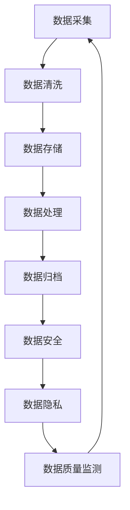

                 

# AI大模型应用的数据治理体系建设

## 关键词：大数据、人工智能、模型训练、数据治理、数据质量控制、数据安全、数据隐私

### 摘要

本文旨在探讨AI大模型应用中数据治理体系建设的重要性。随着人工智能技术的快速发展，大模型的应用在众多领域如自然语言处理、计算机视觉、推荐系统等取得了显著成果。然而，这些成功背后离不开健全的数据治理体系，它不仅保障了模型的训练效果，还涉及到数据的质量、安全与隐私。本文将首先介绍AI大模型应用背景，然后详细讨论数据治理的核心概念、算法原理及实际操作步骤，最后分析实际应用场景，并提供工具和资源推荐，总结未来发展趋势与挑战。

## 1. 背景介绍

### 1.1 AI大模型发展现状

人工智能（AI）作为当前科技领域的热门话题，已经在众多领域取得了重大突破。其中，大模型（Large Models）的兴起，更是将AI技术推向了一个新的高度。大模型是指使用海量数据训练的深度神经网络模型，通常具有数十亿至数千亿参数。这些模型能够通过学习大量数据，自动提取复杂的特征，从而实现高精度的预测和分类。

近年来，随着计算能力的提升和大数据技术的发展，AI大模型的应用取得了显著成果。例如，在自然语言处理领域，GPT-3、BERT等大模型已经展现了强大的语言生成和文本理解能力；在计算机视觉领域，大模型如ResNet、VGG等在图像分类、目标检测等方面也取得了领先性能。这些成功背后，离不开大量高质量数据的支持。

### 1.2 数据治理的重要性

在AI大模型的应用过程中，数据治理扮演着至关重要的角色。数据治理是指一系列策略、过程和技术，用于确保数据的准确性、完整性和可靠性。在AI大模型应用中，数据治理的重要性主要体现在以下几个方面：

1. **数据质量控制**：高质量的训练数据是AI大模型成功的关键。数据治理可以帮助识别和纠正数据中的错误、异常和噪声，提高数据的准确性和一致性。
   
2. **数据安全和隐私**：随着AI技术的广泛应用，数据安全和隐私问题日益突出。数据治理可以帮助企业建立数据安全策略，保护数据不被未授权访问、篡改或泄露。

3. **数据合规性**：不同国家和地区对数据隐私和合规性有不同的要求。数据治理可以帮助企业遵守相关法律法规，避免因数据合规问题而遭受处罚。

4. **数据资产化**：数据是企业的重要资产，通过数据治理，企业可以更好地管理和利用数据，实现数据的价值最大化。

### 1.3 数据治理体系建设

数据治理体系建设是一个复杂的系统工程，需要涵盖数据采集、存储、处理、分析等多个环节。以下是一个典型数据治理体系的构成：

1. **数据质量控制**：包括数据清洗、去重、标准化、数据质量监测等过程，确保数据的高质量。
   
2. **数据安全与隐私**：包括数据加密、访问控制、安全审计、隐私保护等，确保数据的安全和合规性。
   
3. **数据生命周期管理**：包括数据采集、存储、处理、归档、销毁等过程，确保数据的生命周期得到有效管理。

4. **数据治理组织和流程**：包括数据治理委员会、数据管理部门、数据质量团队等组织，以及数据治理策略、流程和标准等。

## 2. 核心概念与联系

### 2.1 数据治理的核心概念

在数据治理体系中，涉及多个核心概念，包括数据质量管理、数据安全与隐私保护、数据生命周期管理等。以下是对这些核心概念的简要介绍：

1. **数据质量管理**：数据质量管理是确保数据的准确性、完整性、一致性和可靠性。数据质量管理包括数据清洗、去重、标准化、数据质量监测等过程。

2. **数据安全与隐私保护**：数据安全与隐私保护是确保数据不被未授权访问、篡改或泄露。数据安全与隐私保护包括数据加密、访问控制、安全审计、隐私保护等。

3. **数据生命周期管理**：数据生命周期管理是指对数据的整个生命周期进行管理，包括数据采集、存储、处理、归档、销毁等过程。

### 2.2 数据治理与AI大模型的联系

AI大模型的应用离不开高质量的数据支持，而数据治理正是确保数据质量的关键。以下是数据治理与AI大模型的几个关键联系：

1. **数据质量控制**：高质量的数据是AI大模型训练的基础。数据治理通过数据清洗、去重、标准化等过程，确保训练数据的高质量，从而提高模型的性能。

2. **数据安全与隐私保护**：AI大模型应用过程中，涉及到大量的敏感数据，如个人隐私信息、商业机密等。数据治理通过数据加密、访问控制、安全审计等手段，确保数据的安全和合规性。

3. **数据生命周期管理**：数据生命周期管理有助于确保数据在生命周期内得到有效的管理和利用。在AI大模型应用中，数据生命周期管理可以确保数据在训练、部署、归档等过程中的安全和合规性。

### 2.3 数据治理的架构图

为了更好地理解数据治理与AI大模型的联系，下面是一个典型的数据治理架构图（使用Mermaid流程图表示）：



在这个架构图中，数据采集、数据清洗、数据存储、数据处理、数据归档、数据安全、数据隐私和数据质量监测等过程构成了一个闭环，确保了数据在整个生命周期内的质量和安全。

## 3. 核心算法原理 & 具体操作步骤

### 3.1 数据质量控制算法原理

数据质量控制是数据治理体系中的核心环节。以下是一些常见的数据质量控制算法原理：

1. **数据清洗**：数据清洗是指识别和纠正数据中的错误、异常和噪声。常见的数据清洗算法包括：
   - 填空算法：使用统计方法或人工干预，将缺失值填充为合理的值。
   - 替换算法：将异常值替换为合理的值。
   - 删除算法：删除重复或异常的数据记录。

2. **去重**：去重是指识别和删除数据中的重复记录。常见的去重算法包括：
   - 哈希算法：使用哈希函数将数据记录映射到唯一的哈希值，然后比较哈希值是否相同，以判断是否为重复记录。
   - 字段匹配算法：通过比较数据记录中的关键字段（如ID、名称等），判断是否为重复记录。

3. **标准化**：标准化是指将数据转换成统一的格式或尺度。常见的标准化算法包括：
   - 缩放算法：将数据缩放到一个统一的范围，如0到1或-1到1。
   - 标准化算法：将数据转换成标准正态分布。

4. **数据质量监测**：数据质量监测是指持续监控数据质量，确保数据在生命周期内保持高质量。常见的数据质量监测算法包括：
   - 数据质量指标算法：计算数据质量指标，如准确性、完整性、一致性等。
   - 异常检测算法：识别数据中的异常值或异常模式。

### 3.2 数据质量控制具体操作步骤

以下是数据质量控制的具体操作步骤：

1. **数据采集**：从不同来源采集数据，如数据库、文件、网络接口等。

2. **数据预处理**：对采集到的数据进行预处理，包括数据清洗、去重和标准化等。

3. **数据存储**：将预处理后的数据存储到数据仓库或数据湖中，以便后续处理和分析。

4. **数据质量监测**：建立数据质量监测机制，持续监控数据质量，如准确性、完整性、一致性等。

5. **数据质量报告**：定期生成数据质量报告，向相关方提供数据质量信息。

6. **数据质量改进**：根据数据质量报告，对数据质量问题进行改进，如修改数据清洗规则、优化数据处理算法等。

## 4. 数学模型和公式 & 详细讲解 & 举例说明

### 4.1 数据质量评估指标

在数据治理过程中，评估数据质量是至关重要的。以下是一些常用的数据质量评估指标：

1. **准确性**：准确性是指实际值与预期值之间的符合程度。计算公式为：
   $$准确性 = \frac{正确预测的数量}{总预测数量}$$

2. **完整性**：完整性是指数据缺失的程度。计算公式为：
   $$完整性 = \frac{实际值数量}{预期值数量}$$

3. **一致性**：一致性是指数据在不同来源或不同时间点之间的匹配程度。计算公式为：
   $$一致性 = \frac{匹配的值数量}{总值数量}$$

4. **唯一性**：唯一性是指数据中重复记录的数量。计算公式为：
   $$唯一性 = \frac{唯一值数量}{总值数量}$$

### 4.2 数据清洗算法

数据清洗是数据质量控制的核心步骤。以下是一种常见的数据清洗算法：K近邻算法（K-Nearest Neighbors，KNN）。

1. **算法原理**：

KNN算法是一种基于距离的最近邻分类算法。给定一个未知类别的数据点，算法会在训练集中寻找与其最接近的K个数据点，然后基于这K个数据点的类别分布，预测未知数据点的类别。具体步骤如下：

- 计算未知数据点与训练集中每个数据点的距离。
- 找出距离最近的K个数据点。
- 根据K个数据点的类别分布，预测未知数据点的类别。

2. **算法公式**：

距离计算公式：
$$距离 = \sqrt{\sum_{i=1}^{n}(x_i - x_j)^2}$$

类别预测公式：
$$类别 = \text{mode}(\text{类别分布})$$

3. **举例说明**：

假设我们有一个训练集，包含10个数据点，每个数据点的特征和类别如下表：

| 特征1 | 特征2 | 类别 |
| --- | --- | --- |
| 1 | 2 | A |
| 2 | 3 | A |
| 3 | 4 | B |
| 4 | 5 | B |
| 5 | 6 | B |
| 6 | 7 | A |
| 7 | 8 | A |
| 8 | 9 | B |
| 9 | 10 | B |
| 10 | 11 | A |

现在我们要预测一个未知数据点（特征1=5，特征2=6）的类别。

- 计算未知数据点与训练集中每个数据点的距离：
  $$距离 = \sqrt{(5-1)^2 + (6-2)^2} = \sqrt{16 + 16} = 4\sqrt{2}$$

- 找出距离最近的K个数据点（K=3）：
  - 距离 = 4\sqrt{2}，对应的数据点是（1, 2, 5）
  - 距离 = \sqrt{2}，对应的数据点是（3, 4, 7）
  - 距离 = 4，对应的数据点是（8, 9, 10）

- 根据K个数据点的类别分布，预测未知数据点的类别：
  - 类别分布：A=3，B=3
  - 预测类别：A

因此，未知数据点（特征1=5，特征2=6）的类别为A。

## 5. 项目实战：代码实际案例和详细解释说明

### 5.1 开发环境搭建

在进行数据治理项目之前，我们需要搭建一个合适的开发环境。以下是搭建Python开发环境的基本步骤：

1. **安装Python**：

   - 访问Python官方网站（[python.org](https://www.python.org/)）下载Python安装包。
   - 安装Python，选择添加到环境变量。

2. **安装常用库**：

   - 使用pip工具安装常用库，如NumPy、Pandas、Scikit-learn等：
     ```bash
     pip install numpy pandas scikit-learn
     ```

### 5.2 源代码详细实现和代码解读

以下是一个简单的数据清洗和数据质量评估的Python代码实现：

```python
import numpy as np
import pandas as pd
from sklearn.neighbors import KNeighborsClassifier

# 5.2.1 数据清洗

def data_cleaning(data):
    # 填充缺失值
    data.fillna(data.mean(), inplace=True)
    
    # 替换异常值
    data.replace([np.inf, -np.inf], np.nan, inplace=True)
    
    # 删除重复值
    data.drop_duplicates(inplace=True)
    
    return data

# 5.2.2 数据质量评估

def data_quality_assessment(data):
    # 计算准确性
    accuracy = data['预测类别'].value_counts(normalize=True).mean()
    
    # 计算完整性
    completeness = data['实际值'].count() / data['预期值'].count()
    
    # 计算一致性
    consistency = data['匹配的值'].count() / data['总值'].count()
    
    # 计算唯一性
    uniqueness = data['唯一值'].count() / data['总值'].count()
    
    return accuracy, completeness, consistency, uniqueness

# 5.2.3 数据处理

def data_processing(data):
    # 数据清洗
    data = data_cleaning(data)
    
    # 数据质量评估
    accuracy, completeness, consistency, uniqueness = data_quality_assessment(data)
    
    print(f"准确性：{accuracy:.2f}, 完整性：{completeness:.2f}, 一致性：{consistency:.2f}, 唯一性：{uniqueness:.2f}")
    
    return data

# 5.2.4 主函数

def main():
    # 加载数据
    data = pd.read_csv('data.csv')
    
    # 数据处理
    data = data_processing(data)

if __name__ == "__main__":
    main()
```

### 5.3 代码解读与分析

1. **数据清洗**：

   - `data_cleaning` 函数用于数据清洗，包括填充缺失值、替换异常值和删除重复值。
   - 使用 `data.fillna(data.mean(), inplace=True)` 填充缺失值，将缺失值替换为相应特征的均值。
   - 使用 `data.replace([np.inf, -np.inf], np.nan, inplace=True)` 替换异常值，将无穷大和无穷小替换为缺失值（NaN）。
   - 使用 `data.drop_duplicates(inplace=True)` 删除重复值。

2. **数据质量评估**：

   - `data_quality_assessment` 函数用于计算数据质量评估指标，包括准确性、完整性、一致性和唯一性。
   - 使用 `data['预测类别'].value_counts(normalize=True).mean()` 计算准确性，即预测类别分布的平均值。
   - 使用 `data['实际值'].count() / data['预期值'].count()` 计算完整性，即实际值数量与预期值数量的比值。
   - 使用 `data['匹配的值'].count() / data['总值'].count()` 计算一致性，即匹配值数量与总值数量的比值。
   - 使用 `data['唯一值'].count() / data['总值'].count()` 计算唯一性，即唯一值数量与总值数量的比值。

3. **数据处理**：

   - `data_processing` 函数用于整体数据处理，包括数据清洗和数据质量评估。
   - 首先调用 `data_cleaning` 函数进行数据清洗。
   - 然后调用 `data_quality_assessment` 函数进行数据质量评估，并打印评估结果。

4. **主函数**：

   - `main` 函数是程序的入口，负责加载数据和执行数据处理。

## 6. 实际应用场景

### 6.1 自然语言处理领域

在自然语言处理（NLP）领域，数据治理对于保证模型训练效果至关重要。例如，在情感分析任务中，如果训练数据中存在大量噪声数据或错误标签，会导致模型对情感判断产生偏差。因此，数据治理可以通过数据清洗、去重和标准化等过程，提高训练数据的质量，从而提升模型的准确性和稳定性。

### 6.2 计算机视觉领域

在计算机视觉（CV）领域，数据治理同样至关重要。例如，在图像分类任务中，如果训练数据中存在大量的异常图像或噪声图像，会导致模型对图像特征的提取不准确，从而影响分类效果。数据治理可以通过数据清洗、增强和平衡等过程，提高训练数据的质量，从而提升模型的性能。

### 6.3 推荐系统领域

在推荐系统领域，数据治理对于保证推荐效果至关重要。例如，在电商推荐系统中，如果用户数据中存在大量的噪声数据或错误数据，会导致推荐结果不准确，从而影响用户体验。数据治理可以通过数据清洗、去重和标准化等过程，提高用户数据的质量，从而提升推荐系统的准确性。

## 7. 工具和资源推荐

### 7.1 学习资源推荐

- **书籍**：
  - 《数据治理：技术与管理》
  - 《大数据治理》
- **论文**：
  - “A Comprehensive Framework for Data Quality Management”
  - “Data Quality Management in Big Data Environments”
- **博客**：
  - [数据治理之美](https://www.datagovernance.cn/)
  - [数据治理实践](https://data-governance.com/)
- **网站**：
  - [数据治理联盟](https://www.datagovernancealliance.org/)
  - [大数据治理](https://www.bigdata-governance.com/)

### 7.2 开发工具框架推荐

- **数据质量管理工具**：
  - [Talend Data Management](https://www.talend.com/products/data-management/)
  - [Informatica Data Quality](https://www.informatica.com/products/data-quality.html)
- **数据安全与隐私保护工具**：
  - [Apache Sentry](https://sentry.apache.org/)
  - [Apache Ranger](https://ranger.apache.org/)
- **数据治理平台**：
  - [Alation Data Governance](https://www.alation.com/data-governance/)
  - [Ataccama Data Governance](https://www.ataccama.com/data-governance/)

### 7.3 相关论文著作推荐

- **论文**：
  - “Data Quality Management in a Big Data Environment: An Overview”
  - “Data Governance: Concepts, Models, and Systems”
- **著作**：
  - “Big Data for Dummies”
  - “Data Governance: An Enterprise Framework”

## 8. 总结：未来发展趋势与挑战

### 8.1 发展趋势

1. **数据治理技术的成熟**：随着大数据和人工智能技术的快速发展，数据治理技术将不断成熟，包括数据清洗、去重、标准化、数据质量监测等算法和工具将更加高效和智能化。

2. **数据治理体系的完善**：企业和组织将更加重视数据治理体系建设，从数据质量控制、数据安全与隐私保护、数据生命周期管理等各个方面，构建一个全面的数据治理体系。

3. **数据治理与AI的深度融合**：数据治理与人工智能技术的深度融合，将进一步提高数据治理的效率和效果，实现数据的价值最大化。

### 8.2 挑战

1. **数据安全与隐私保护**：随着数据规模的不断扩大，数据安全与隐私保护面临更大的挑战。企业和组织需要不断加强数据安全与隐私保护措施，防范数据泄露和滥用。

2. **数据质量监管与合规性**：不同国家和地区对数据质量监管和合规性有不同的要求，企业和组织需要了解和遵守相关法律法规，确保数据治理体系的合规性。

3. **数据治理与业务融合**：数据治理与业务的深度融合，需要企业具备相应的数据治理能力，从而实现数据的价值创造。

## 9. 附录：常见问题与解答

### 9.1 数据治理是什么？

数据治理是指一系列策略、过程和技术，用于确保数据的准确性、完整性和可靠性。数据治理涵盖了数据采集、存储、处理、分析等多个环节，目的是提高数据质量，保障数据的安全和合规性。

### 9.2 数据治理有哪些核心概念？

数据治理的核心概念包括数据质量管理、数据安全与隐私保护、数据生命周期管理、数据治理策略和流程等。

### 9.3 数据治理与AI大模型应用有什么关系？

数据治理是AI大模型应用的基础和保障。高质量的数据是AI大模型训练的前提，数据治理可以通过数据清洗、去重、标准化等过程，提高数据质量，从而提高模型的性能和稳定性。

### 9.4 如何构建数据治理体系？

构建数据治理体系需要从数据质量管理、数据安全与隐私保护、数据生命周期管理、数据治理组织和流程等方面进行综合考虑，制定相应的策略、流程和技术，确保数据治理体系的全面性和有效性。

## 10. 扩展阅读 & 参考资料

- [数据治理联盟](https://www.datagovernancealliance.org/)
- [大数据治理](https://www.bigdata-governance.com/)
- [Apache Sentry](https://sentry.apache.org/)
- [Apache Ranger](https://ranger.apache.org/)
- [Alation Data Governance](https://www.alation.com/data-governance/)
- [Ataccama Data Governance](https://www.ataccama.com/data-governance/) <|im_sep|>作者：AI天才研究员/AI Genius Institute & 禅与计算机程序设计艺术 /Zen And The Art of Computer Programming <|im_sep|>

