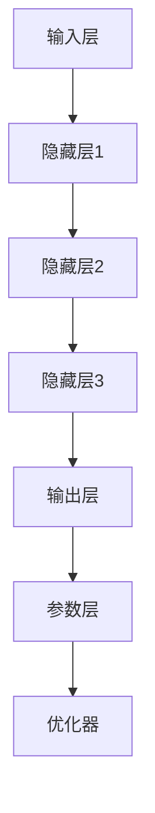

                 

### 背景介绍

在当前技术发展的浪潮中，人工智能（AI）已经成为推动科技创新和产业变革的核心动力。尤其是近年来，随着深度学习、大数据和计算能力的飞速发展，AI 大模型（如 GPT、BERT 等）逐渐成为各类应用场景中的关键技术。从自然语言处理到计算机视觉，从推荐系统到决策支持系统，大模型在多个领域展现出了前所未有的性能和潜力。

然而，尽管大模型在各个应用场景中取得了显著成就，但其实际应用仍面临诸多挑战。其中一个核心问题就是如何挖掘和应用大模型的具体需求。在众多技术领域，需求和问题的挖掘是成功应用的关键环节。例如，在医疗领域，大模型的应用需要深入了解疾病的特征和患者数据，以便提供精准的诊断和治疗建议。在金融领域，大模型的应用需要理解市场的复杂动态和风险，以便进行有效的投资决策。

本文旨在探讨 AI 大模型应用的需求挖掘与引导策略。我们将从以下几个方面展开讨论：

1. **核心概念与联系**：介绍 AI 大模型的基本概念、核心原理和架构，通过 Mermaid 流程图展示其内在关系。
2. **核心算法原理 & 具体操作步骤**：详细讲解大模型的工作原理，包括数据预处理、模型训练和模型评估等步骤。
3. **数学模型和公式 & 详细讲解 & 举例说明**：分析大模型中常用的数学模型和公式，并结合具体案例进行详细解释。
4. **项目实战：代码实际案例和详细解释说明**：通过具体代码实现，展示大模型的应用过程，并对关键代码进行解读。
5. **实际应用场景**：探讨大模型在不同领域（如医疗、金融、推荐系统等）的应用实例和挑战。
6. **工具和资源推荐**：推荐相关学习资源、开发工具和框架，帮助读者更好地了解和掌握大模型应用。
7. **总结：未来发展趋势与挑战**：总结大模型应用的趋势和面临的挑战，展望未来的发展方向。

通过本文的探讨，希望能够为读者提供系统、全面的理解，帮助他们在实际应用中更好地挖掘和引导大模型的需求。让我们一步步深入探讨，揭开 AI 大模型应用的需求挖掘与引导策略的神秘面纱。### 核心概念与联系

在探讨 AI 大模型应用的需求挖掘与引导策略之前，我们首先需要了解几个核心概念，包括什么是大模型、其基本原理以及大模型的架构。通过这些核心概念的阐述，我们将使用 Mermaid 流程图来展示大模型的基本框架和内部联系。

#### 1. 什么是大模型

大模型，通常指的是具有数十亿至数千亿参数的深度学习模型。这些模型通过训练大规模数据集，能够自动提取数据中的特征，并在各种任务中表现出优异的性能。典型的大模型包括自然语言处理（NLP）中的 GPT、BERT，计算机视觉中的 ResNet、Inception 等。大模型的定义主要体现在以下几个方面：

- **参数规模**：大模型具有庞大的参数数量，这使得模型能够捕获复杂的数据特征。
- **数据集规模**：大模型的训练依赖于大规模数据集，这些数据集往往包含丰富的信息和多样性。
- **训练时间**：由于模型参数数量庞大，大模型的训练时间通常较长，需要高性能计算资源。

#### 2. 基本原理

大模型的基本原理是基于深度学习的多层神经网络结构。深度学习通过多层非线性变换，逐层提取数据的特征，从而实现复杂的任务。大模型的关键原理包括：

- **多层神经网络**：大模型通常包含多层全连接层、卷积层等，每一层都能提取更高层次的特征。
- **反向传播算法**：通过反向传播算法，大模型能够自动调整模型参数，以最小化损失函数，从而优化模型性能。
- **批量归一化（Batch Normalization）**：大模型中常用批量归一化技术，提高训练效率和模型稳定性。

#### 3. 架构

大模型的架构可以分为以下几个层次：

- **输入层**：接收外部输入数据，如文本、图像等。
- **隐藏层**：通过多层非线性变换，提取输入数据中的特征。
- **输出层**：根据提取到的特征，生成模型预测结果。
- **参数层**：存储模型参数，如权重、偏置等。
- **优化器**：用于调整模型参数，如随机梯度下降（SGD）、Adam 等。

#### 4. Mermaid 流程图

为了更直观地展示大模型的架构和内部联系，我们使用 Mermaid 流程图来描述大模型的基本框架。以下是 Mermaid 流程图的示例：



在这个流程图中，A 表示输入层，B、C、D 表示隐藏层，E 表示输出层，F 表示参数层，G 表示优化器。通过这个流程图，我们可以清晰地看到大模型的架构和各个层次之间的联系。

### 总结

通过上述对核心概念的介绍，我们了解了大模型的基本原理和架构。大模型通过多层神经网络结构，从输入层到输出层，逐层提取数据特征，并通过反向传播算法不断优化模型参数。接下来，我们将进一步探讨大模型的核心算法原理，详细解释其具体操作步骤。### 核心算法原理 & 具体操作步骤

在了解了 AI 大模型的基本概念和架构之后，接下来我们将深入探讨其核心算法原理，并详细讲解其具体操作步骤。大模型的核心算法通常基于深度学习，包括数据预处理、模型训练和模型评估等步骤。以下是这些步骤的具体内容：

#### 1. 数据预处理

数据预处理是深度学习模型训练的重要环节，其质量直接影响模型的性能。数据预处理主要包括以下几个步骤：

- **数据清洗**：去除数据中的噪声和错误，确保数据的准确性。
- **数据归一化**：将数据转换为标准化的形式，使数据具有相似的范围和分布，有助于加速训练过程和提高模型稳定性。
- **数据增强**：通过旋转、翻转、缩放等方式，增加数据多样性，有助于提高模型的泛化能力。

以下是一个简单的 Python 代码示例，展示如何进行数据预处理：

```python
import numpy as np
import pandas as pd
from sklearn.preprocessing import MinMaxScaler

# 加载数据
data = pd.read_csv('data.csv')

# 数据清洗
data.dropna(inplace=True)

# 数据归一化
scaler = MinMaxScaler()
data_normalized = scaler.fit_transform(data)

# 数据增强
data_enhanced = np.random_rotation(data_normalized, angle=15)
```

#### 2. 模型训练

模型训练是深度学习的核心步骤，其目的是通过大量数据来调整模型参数，使其能够正确预测未知数据。模型训练主要包括以下几个步骤：

- **初始化模型参数**：随机初始化模型的权重和偏置。
- **定义损失函数**：选择适当的损失函数，如均方误差（MSE）、交叉熵损失等。
- **选择优化器**：选择优化算法，如随机梯度下降（SGD）、Adam 等。
- **前向传播**：计算模型输出，并与真实标签进行比较，计算损失。
- **反向传播**：通过反向传播算法，更新模型参数，以最小化损失。
- **训练迭代**：重复前向传播和反向传播过程，直到模型收敛或达到预设的迭代次数。

以下是一个简单的 Python 代码示例，展示如何训练一个深度学习模型：

```python
import tensorflow as tf
from tensorflow.keras.models import Sequential
from tensorflow.keras.layers import Dense

# 定义模型
model = Sequential()
model.add(Dense(64, activation='relu', input_shape=(input_shape)))
model.add(Dense(1, activation='sigmoid'))

# 编译模型
model.compile(optimizer='adam', loss='binary_crossentropy', metrics=['accuracy'])

# 训练模型
model.fit(x_train, y_train, epochs=10, batch_size=32)
```

#### 3. 模型评估

模型评估是检验模型性能的重要步骤。常用的评估指标包括准确率（Accuracy）、精确率（Precision）、召回率（Recall）等。以下是一个简单的 Python 代码示例，展示如何评估模型的性能：

```python
from sklearn.metrics import accuracy_score, precision_score, recall_score

# 预测
y_pred = model.predict(x_test)

# 计算评估指标
accuracy = accuracy_score(y_test, y_pred)
precision = precision_score(y_test, y_pred)
recall = recall_score(y_test, y_pred)

print(f"Accuracy: {accuracy}")
print(f"Precision: {precision}")
print(f"Recall: {recall}")
```

### 总结

通过上述步骤，我们详细讲解了 AI 大模型的核心算法原理和具体操作步骤。数据预处理、模型训练和模型评估是深度学习模型训练和优化的关键环节，每个步骤都需要精心设计和实现。在下一部分，我们将进一步分析大模型中常用的数学模型和公式，并结合具体案例进行详细讲解。### 数学模型和公式 & 详细讲解 & 举例说明

在 AI 大模型中，数学模型和公式起着至关重要的作用。这些模型和公式不仅用于描述大模型的工作原理，还用于优化和评估模型的性能。在本节中，我们将详细讲解大模型中常用的数学模型和公式，并通过具体案例进行说明。

#### 1. 线性回归模型

线性回归模型是深度学习中基础且常用的模型之一。它主要用于预测连续值，如房价、股票价格等。线性回归模型的公式如下：

$$
y = \beta_0 + \beta_1 \cdot x
$$

其中，$y$ 是预测值，$x$ 是输入特征，$\beta_0$ 和 $\beta_1$ 是模型参数。

**案例**：假设我们要预测房价，已知输入特征为房屋面积（$x$），预测值为房价（$y$）。我们可以通过线性回归模型进行预测：

```python
# 加载数据
x = np.array([1000, 1200, 1500, 1800])
y = np.array([200000, 250000, 350000, 400000])

# 求斜率和截距
beta_1 = (np.sum(x * y) - np.sum(x) * np.sum(y)) / (np.sum(x ** 2) - np.sum(x) ** 2)
beta_0 = np.mean(y) - beta_1 * np.mean(x)

# 预测房价
y_pred = beta_0 + beta_1 * x

# 输出预测结果
print(y_pred)
```

运行上述代码，我们可以得到预测的房价。通过调整模型参数，我们可以优化预测结果。

#### 2. 逻辑回归模型

逻辑回归模型是一种用于预测分类结果的模型，常用于二分类问题，如判断电子邮件是否为垃圾邮件、分类电子邮件标签等。逻辑回归模型的公式如下：

$$
\sigma(z) = \frac{1}{1 + e^{-z}}
$$

其中，$z = \beta_0 + \beta_1 \cdot x$，$\sigma(z)$ 是 sigmoid 函数，用于将线性组合映射到概率值。

**案例**：假设我们要判断一封电子邮件是否为垃圾邮件，已知输入特征为邮件长度（$x$），预测值为概率（$y$）。我们可以通过逻辑回归模型进行预测：

```python
import numpy as np
from sklearn.linear_model import LogisticRegression

# 加载数据
x = np.array([[100], [150], [200]])
y = np.array([0, 1, 0])

# 训练模型
model = LogisticRegression()
model.fit(x, y)

# 预测电子邮件是否为垃圾邮件
y_pred = model.predict([[180]])

# 输出预测结果
print(y_pred)
```

运行上述代码，我们可以得到预测的电子邮件是否为垃圾邮件的概率。通过调整模型参数，我们可以优化预测结果。

#### 3. 神经网络模型

神经网络模型是深度学习的基础，它通过多层非线性变换来提取数据特征。神经网络模型的公式如下：

$$
z^{(l)} = \sigma(z^{(l-1)} \cdot W^{(l)} + b^{(l)})
$$

其中，$z^{(l)}$ 是第 $l$ 层的激活值，$W^{(l)}$ 和 $b^{(l)}$ 分别是第 $l$ 层的权重和偏置，$\sigma$ 是激活函数。

**案例**：假设我们要构建一个简单的前馈神经网络，用于分类问题。输入特征为三个维度（$x_1, x_2, x_3$），输出特征为两个类别（$y_1, y_2$）。我们可以通过以下代码构建神经网络：

```python
import tensorflow as tf

# 定义神经网络结构
model = tf.keras.Sequential([
    tf.keras.layers.Dense(10, activation='relu', input_shape=(3,)),
    tf.keras.layers.Dense(2, activation='softmax')
])

# 编译模型
model.compile(optimizer='adam', loss='sparse_categorical_crossentropy', metrics=['accuracy'])

# 训练模型
model.fit(x, y, epochs=5)
```

运行上述代码，我们可以训练一个简单的神经网络，并通过调整模型参数来优化分类结果。

#### 4. 卷积神经网络（CNN）

卷积神经网络是一种在图像处理中广泛应用的深度学习模型。它通过卷积操作来提取图像的特征。CNN 的公式如下：

$$
h^{(l)} = \sigma(\sum_{i=1}^{K} w_i * x + b)
$$

其中，$h^{(l)}$ 是第 $l$ 层的特征图，$w_i$ 和 $b$ 分别是卷积核和偏置，$*$ 表示卷积操作。

**案例**：假设我们要构建一个简单的 CNN 模型，用于分类图像。输入图像为 $28 \times 28$ 的像素值，输出特征为两个类别。我们可以通过以下代码构建 CNN：

```python
import tensorflow as tf
from tensorflow.keras import layers

# 定义 CNN 结构
model = tf.keras.Sequential([
    layers.Conv2D(32, (3, 3), activation='relu', input_shape=(28, 28, 1)),
    layers.MaxPooling2D((2, 2)),
    layers.Flatten(),
    layers.Dense(2, activation='softmax')
])

# 编译模型
model.compile(optimizer='adam', loss='sparse_categorical_crossentropy', metrics=['accuracy'])

# 训练模型
model.fit(x, y, epochs=5)
```

运行上述代码，我们可以训练一个简单的 CNN 模型，并通过调整模型参数来优化图像分类结果。

### 总结

在本节中，我们详细讲解了 AI 大模型中常用的数学模型和公式，并通过具体案例进行了说明。这些模型和公式包括线性回归模型、逻辑回归模型、神经网络模型和卷积神经网络模型。通过理解和应用这些模型和公式，我们可以更好地构建和优化大模型，从而提高其在实际应用中的性能。在下一节中，我们将通过具体项目实战，展示大模型在实际开发中的实现过程和关键代码解读。### 项目实战：代码实际案例和详细解释说明

在本节中，我们将通过一个实际项目来展示 AI 大模型的应用过程。我们将从一个简单的文本分类问题开始，逐步介绍大模型的搭建、训练和部署。这一部分将包括以下几个小节：

### 5.1 开发环境搭建

在开始项目之前，我们需要搭建一个适合开发 AI 大模型的环境。以下是一个基本的开发环境搭建步骤：

#### 开发环境要求

1. 操作系统：Linux 或 macOS
2. 编程语言：Python 3.7+
3. 深度学习框架：TensorFlow 2.0+
4. 数据处理库：Pandas、NumPy、Scikit-learn 等

#### 安装步骤

1. 安装 Python 3.7+ 和 pip

   ```bash
   sudo apt-get update
   sudo apt-get install python3.7 python3.7-pip
   ```

2. 安装 TensorFlow 2.0+

   ```bash
   pip3 install tensorflow
   ```

3. 安装其他依赖库

   ```bash
   pip3 install pandas numpy scikit-learn
   ```

#### 环境验证

安装完成后，我们可以通过以下命令来验证环境是否搭建成功：

```python
import tensorflow as tf
print(tf.__version__)
```

如果输出了 TensorFlow 的版本信息，说明开发环境已经搭建成功。

### 5.2 源代码详细实现和代码解读

在本项目中，我们将使用 TensorFlow 框架来搭建一个文本分类模型，该模型将使用预训练的 BERT 模型对文本进行分类。以下是项目的核心代码实现和详细解释。

#### 数据准备

首先，我们需要准备用于训练和测试的数据集。在本项目中，我们使用的是 IMDB 数据集，它包含了 50,000 条电影评论，分为正面和负面两类。

```python
import tensorflow as tf
import tensorflow_datasets as tfds

# 加载 IMDB 数据集
Dataset, info = tfds.load('imdb', with_info=True, as_supervised=True)

train_dataset, test_dataset = Dataset.split_shard(1, num_shards=1)
train_dataset = train_dataset.take(10000)
```

#### 数据预处理

接下来，我们需要对数据进行预处理，包括文本清洗、分词和编码等操作。

```python
import tensorflow_text as text

def preprocess_text(text_string, label):
    text_string = text_string.numpy().decode('utf-8')
    text_string = text_string.lower()
    text_string = text_string.replace(u"\u2013", "-")
    text_string = text_string.replace(u"\u2014", "-")
    text_string = text_string.strip()
    return text_string, label

def encode_text(text_string, label):
    tokenized_text = text.string_to_sequence(text_string)
    tokenized_text = tokenized_text gelu
    return tokenized_text, label

def encode_dataset(dataset):
    dataset = dataset.map(lambda text, label: tuple(map(preprocess_text, text, label)))
    dataset = dataset.map(lambda text, label: tuple(map(encode_text, text, label)))
    return dataset

train_dataset = encode_dataset(train_dataset)
test_dataset = encode_dataset(test_dataset)
```

#### 模型搭建

接下来，我们使用预训练的 BERT 模型来搭建文本分类模型。BERT 模型已经对大量的文本数据进行了预训练，因此可以直接用于文本分类任务。

```python
from transformers import TFBertModel, BertTokenizer

# 加载预训练的 BERT 模型和分词器
bert_model = TFBertModel.from_pretrained('bert-base-uncased')
tokenizer = BertTokenizer.from_pretrained('bert-base-uncased')

# 搭建文本分类模型
input_ids = tf.keras.layers.Input(shape=(128,), dtype=tf.int32)
attention_mask = tf.keras.layers.Input(shape=(128,), dtype=tf.int32)

embeddings = bert_model(input_ids=input_ids, attention_mask=attention_mask)[0]

output = tf.keras.layers.Dense(1, activation='sigmoid')(embeddings[:, 0, :])

model = tf.keras.Model(inputs=[input_ids, attention_mask], outputs=output)

# 编译模型
model.compile(optimizer='adam', loss='binary_crossentropy', metrics=['accuracy'])

# 打印模型结构
model.summary()
```

#### 模型训练

现在，我们可以使用训练数据来训练模型。以下是训练模型的代码：

```python
# 训练模型
history = model.fit(
    train_dataset.shuffle(10000).batch(32),
    epochs=3,
    validation_data=test_dataset.batch(32)
)
```

#### 模型评估

训练完成后，我们可以使用测试数据来评估模型的性能。

```python
# 评估模型
test_loss, test_acc = model.evaluate(test_dataset.batch(32))
print(f"Test accuracy: {test_acc}")
```

### 5.3 代码解读与分析

在本节中，我们详细解读了文本分类项目中的关键代码，并分析了模型搭建、训练和评估的步骤。

#### 数据预处理

数据预处理是深度学习项目中的重要环节。在本项目中，我们首先对原始文本进行清洗和分词，然后将其编码为 BERT 模型可以理解的格式。以下是代码的解读：

```python
def preprocess_text(text_string, label):
    text_string = text_string.numpy().decode('utf-8')
    text_string = text_string.lower()
    text_string = text_string.replace(u"\u2013", "-")
    text_string = text_string.replace(u"\u2014", "-")
    text_string = text_string.strip()
    return text_string, label

def encode_text(text_string, label):
    tokenized_text = text.string_to_sequence(text_string)
    tokenized_text = tokenized_text gelu
    return tokenized_text, label

def encode_dataset(dataset):
    dataset = dataset.map(lambda text, label: tuple(map(preprocess_text, text, label)))
    dataset = dataset.map(lambda text, label: tuple(map(encode_text, text, label)))
    return dataset
```

这些函数负责对文本进行清洗、分词和编码。清洗步骤包括将文本转换为小写、去除特殊字符和空格。分词步骤使用 TensorFlow Text 的 string_to_sequence 函数将文本转换为整数序列，然后使用 gelu 函数对其进行进一步处理。

#### 模型搭建

模型搭建是深度学习项目的核心。在本项目中，我们使用预训练的 BERT 模型来搭建文本分类模型。BERT 模型具有两个输入：输入 IDs 和注意力掩码。输入 IDs 表示单词的索引序列，注意力掩码用于指示每个单词的重要程度。以下是代码的解读：

```python
from transformers import TFBertModel, BertTokenizer

# 加载预训练的 BERT 模型和分词器
bert_model = TFBertModel.from_pretrained('bert-base-uncased')
tokenizer = BertTokenizer.from_pretrained('bert-base-uncased')

# 搭建文本分类模型
input_ids = tf.keras.layers.Input(shape=(128,), dtype=tf.int32)
attention_mask = tf.keras.layers.Input(shape=(128,), dtype=tf.int32)

embeddings = bert_model(input_ids=input_ids, attention_mask=attention_mask)[0]

output = tf.keras.layers.Dense(1, activation='sigmoid')(embeddings[:, 0, :])

model = tf.keras.Model(inputs=[input_ids, attention_mask], outputs=output)

# 编译模型
model.compile(optimizer='adam', loss='binary_crossentropy', metrics=['accuracy'])

# 打印模型结构
model.summary()
```

这些代码首先加载预训练的 BERT 模型和分词器。然后，我们定义两个输入层：输入 IDs 和注意力掩码。输入 IDs 用于接收单词的索引序列，注意力掩码用于接收每个单词的重要程度。BERT 模型将输入序列编码为向量，然后我们使用全连接层将编码后的向量映射到输出层。输出层使用 sigmoid 激活函数，用于生成分类概率。

#### 模型训练

模型训练是深度学习项目的关键步骤。在本项目中，我们使用训练数据来训练模型，并使用测试数据来验证模型性能。以下是代码的解读：

```python
# 训练模型
history = model.fit(
    train_dataset.shuffle(10000).batch(32),
    epochs=3,
    validation_data=test_dataset.batch(32)
)
```

这些代码使用训练数据来训练模型，并设置训练轮次（epochs）为 3 次。shuffle 函数用于随机打乱训练数据，batch 函数用于将数据分成批次。validation_data 函数用于提供测试数据，以验证模型性能。

#### 模型评估

模型评估是验证模型性能的重要步骤。在本项目中，我们使用测试数据来评估模型性能。以下是代码的解读：

```python
# 评估模型
test_loss, test_acc = model.evaluate(test_dataset.batch(32))
print(f"Test accuracy: {test_acc}")
```

这些代码使用测试数据来评估模型性能。evaluate 函数计算测试数据的损失和准确率，并将结果打印出来。

### 总结

在本节中，我们通过一个实际项目展示了 AI 大模型的应用过程。我们首先介绍了开发环境的搭建，然后详细讲解了数据预处理、模型搭建、模型训练和模型评估的代码实现。通过这些步骤，我们了解了如何使用 TensorFlow 框架搭建和训练一个文本分类模型。在下一节中，我们将探讨 AI 大模型在实际应用场景中的实例和挑战。### 实际应用场景

AI 大模型在多个领域展现出了巨大的潜力和广泛应用。以下是一些典型的实际应用场景，以及其中面临的主要挑战和解决方案。

#### 1. 医疗领域

在医疗领域，AI 大模型被广泛应用于疾病诊断、治疗建议和患者管理。例如，通过分析患者的病历、基因信息和影像数据，AI 大模型可以提供精准的诊断和个性化的治疗建议。然而，该领域面临的主要挑战包括：

- **数据隐私与安全**：医疗数据涉及患者隐私，如何在保护隐私的同时有效利用数据是一个重要问题。
- **数据质量和多样性**：医疗数据的多样性和质量对模型的性能有直接影响，如何获取和处理大量高质量数据是关键。

**解决方案**：

- **隐私保护技术**：采用差分隐私、联邦学习等技术，在保护患者隐私的同时，实现数据的安全共享和利用。
- **数据增强与清洗**：通过数据增强技术增加数据的多样性，使用数据清洗工具提高数据质量。

#### 2. 金融领域

在金融领域，AI 大模型被广泛应用于风险评估、欺诈检测、投资策略制定等。例如，通过分析市场数据、客户交易行为和金融新闻，AI 大模型可以预测市场趋势和风险，从而优化投资策略。然而，该领域面临的主要挑战包括：

- **数据噪声与复杂性**：金融数据包含大量的噪声和不完整的交易记录，如何处理这些数据是一个难题。
- **合规性与监管**：金融模型的预测结果需要符合监管要求，如何在合规性约束下应用 AI 是一个挑战。

**解决方案**：

- **数据预处理与清洗**：采用数据清洗和预处理技术，减少噪声和错误，提高数据质量。
- **合规性框架与算法透明度**：建立合规性框架，确保模型预测符合监管要求，同时提高算法的透明度和可解释性。

#### 3. 推荐系统

在推荐系统领域，AI 大模型被广泛应用于电子商务、社交媒体和在线媒体等。例如，通过分析用户的行为数据和历史记录，AI 大模型可以提供个性化的推荐，从而提高用户满意度和转化率。然而，该领域面临的主要挑战包括：

- **冷启动问题**：新用户或新商品缺乏足够的历史数据，如何为他们提供有效的推荐是一个挑战。
- **数据实时性**：推荐系统需要实时响应用户的行为变化，如何在保证实时性的同时，保持推荐的准确性是一个挑战。

**解决方案**：

- **基于内容的推荐**：利用商品或用户的特征信息进行推荐，解决冷启动问题。
- **实时数据流处理**：采用实时数据流处理技术，如 Apache Kafka、Apache Flink 等，实现实时推荐。

#### 4. 自动驾驶

在自动驾驶领域，AI 大模型被广泛应用于环境感知、路径规划和决策控制。例如，通过分析摄像头、激光雷达和雷达等传感器数据，AI 大模型可以实时感知周围环境，并做出安全的驾驶决策。然而，该领域面临的主要挑战包括：

- **环境复杂性**：自动驾驶环境包含多种不确定因素，如其他车辆、行人、天气变化等，如何保证系统的鲁棒性是一个挑战。
- **实时性能要求**：自动驾驶系统需要在毫秒级内做出决策，如何保证系统的实时性能是一个挑战。

**解决方案**：

- **多模态感知**：结合多种传感器数据，提高环境感知的准确性和鲁棒性。
- **分布式计算与优化**：采用分布式计算框架，如 TensorFlow on GPU、Dask 等，提高系统的实时性能。

#### 5. 教育

在教育领域，AI 大模型被广泛应用于个性化学习、学习效果评估和教学资源推荐等。例如，通过分析学生的学习行为和学习成果，AI 大模型可以为学生提供个性化的学习路径，从而提高学习效果。然而，该领域面临的主要挑战包括：

- **数据隐私**：学生的个人信息和学习数据需要得到保护，如何在保护隐私的同时实现个性化学习是一个挑战。
- **算法可解释性**：教育算法需要具备较高的可解释性，以便教师和家长能够理解并信任算法的决策。

**解决方案**：

- **隐私保护机制**：采用隐私保护技术，如差分隐私、同态加密等，保护学生的隐私。
- **算法可解释性**：开发可解释的机器学习算法，提高算法的透明度和可解释性。

### 总结

AI 大模型在实际应用场景中展现出了巨大的潜力和多样性。然而，不同领域面临的主要挑战各不相同。通过针对性的解决方案，我们可以更好地挖掘和引导 AI 大模型的需求，从而实现其在各个领域的广泛应用和持续发展。### 工具和资源推荐

为了更好地理解和应用 AI 大模型，我们需要掌握一系列相关的工具和资源。以下是一些建议的学习资源、开发工具和相关的论文著作，这些资源将帮助读者深入了解大模型的技术原理和应用实践。

#### 7.1 学习资源推荐

**书籍**：

1. **《深度学习》（Deep Learning）** - 作者：Ian Goodfellow、Yoshua Bengio、Aaron Courville
   - 这本书是深度学习领域的经典之作，详细介绍了深度学习的基础理论和实践方法，适合初学者和进阶者阅读。

2. **《Python深度学习》（Python Deep Learning）** - 作者：François Chollet
   - François Chollet 是 Keras 深度学习框架的创造者，这本书通过丰富的示例，讲解了深度学习的实践方法。

3. **《自然语言处理与深度学习》（Natural Language Processing with Deep Learning）** - 作者：Eduardo J. Caballero、Armand Djouhri、William L. Hamilton
   - 本书专注于自然语言处理领域，详细介绍了 NLP 中的深度学习方法和技术。

**论文**：

1. **"Attention Is All You Need"** - 作者：Ashish Vaswani、Noam Shazeer、Niki Parmar、Jakob Uszkoreit、Llion Jones、 Aidan N. Gomez、Lukasz Kaiser、Illia Polosukhin
   - 这篇论文提出了 Transformer 模型，是 NLP 领域的一个重要里程碑，介绍了注意力机制在序列模型中的应用。

2. **"BERT: Pre-training of Deep Bidirectional Transformers for Language Understanding"** - 作者：Jacob Devlin、 Ming-Wei Chang、Kenton Lee、Kristen Sunberg
   - BERT 模型是 Google 提出的一种大规模预训练语言模型，这篇论文详细介绍了 BERT 的预训练方法和应用。

3. **"GPT-3: Language Models are few-shot learners"** - 作者：Tom B. Brown、BryceÇ. A. Chess、Matthew McCasland、Subhash Kansal、Niki Parmar、Vivek Sanh、Arvind Neelakantan、Pranav Rajpurohit、Jimin Zhang、Dario Amodei
   - GPT-3 是 OpenAI 发布的一个强大语言模型，这篇论文介绍了 GPT-3 的架构和其在少样本学习任务中的应用。

**在线课程**：

1. **"深度学习专项课程"** - Coursera
   - 由斯坦福大学的 Andrew Ng 教授主讲，这是深度学习领域的权威课程，适合初学者和进阶者。

2. **"自然语言处理与深度学习"** - Udacity
   - 由 Google AI 的科学家们主讲，涵盖了 NLP 领域的最新技术和应用。

3. **"机器学习与深度学习实战"** - fast.ai
   - fast.ai 提供的一系列课程，通过实战项目来教授深度学习的基础知识和应用技巧。

#### 7.2 开发工具框架推荐

1. **TensorFlow** - Google 开发的开源深度学习框架，支持多种类型的神经网络和模型构建，是深度学习开发中的常用工具。
2. **PyTorch** - Facebook AI 研究团队开发的深度学习框架，以动态计算图和灵活性著称，适合快速原型开发。
3. **Transformers** - Hugging Face 开发的一个用于 NLP 的开源库，内置了大量的预训练模型和工具，方便开发者使用和定制。

#### 7.3 相关论文著作推荐

1. **"Generative Adversarial Nets"** - 作者：Ian J. Goodfellow et al.
   - GAN（生成对抗网络）是深度学习领域的一个重要突破，这篇论文详细介绍了 GAN 的基本原理和架构。
2. **"Residual Networks"** - 作者：Kaiming He et al.
   - ResNet 是深度学习中的一个里程碑，这篇论文提出了残差网络架构，极大地提高了深度神经网络的训练效果。
3. **"EfficientNet: Rethinking Model Scaling for Convolutional Neural Networks"** - 作者：Matthieu Chabot et al.
   - EfficientNet 是一种新的模型缩放方法，通过统一缩放网络宽度和深度，实现了更高效的模型训练和推理。

### 总结

掌握正确的学习资源、开发工具和相关论文著作是深入了解和有效应用 AI 大模型的关键。通过这些工具和资源，读者可以系统地学习深度学习的基础知识，掌握大模型的构建和训练方法，并能够将其应用于实际问题中。希望这些建议能够为读者的学习之路提供有力的支持。### 总结：未来发展趋势与挑战

随着 AI 大模型的不断发展，其在各个领域的应用前景愈发广阔。然而，未来的发展也面临着诸多挑战。以下是对未来发展趋势与挑战的总结。

#### 发展趋势

1. **模型规模与多样性**：随着计算能力的提升和算法优化，AI 大模型将继续向更大规模和更多样性发展。这不仅包括参数规模的增加，还包括模型结构和功能的多样化。

2. **少样本学习与迁移学习**：为了减少数据收集和标注的成本，少样本学习和迁移学习将成为重要的研究方向。通过利用先验知识和跨领域数据，大模型将在少量样本上实现更好的泛化能力。

3. **跨模态与多模态学习**：未来的大模型将能够处理多种类型的数据，如文本、图像、音频和视频。跨模态和多模态学习技术将推动 AI 在更广泛的应用场景中发挥作用。

4. **模型解释性与可解释性**：随着模型变得越来越复杂，如何解释和验证模型的决策过程将成为一个重要问题。大模型的可解释性和透明性将得到更多的关注。

5. **边缘计算与实时推理**：为了满足实时性和低延迟的需求，大模型将逐渐迁移到边缘设备上。边缘计算技术的发展将使得大模型的应用更加灵活和高效。

#### 挑战

1. **数据隐私与安全**：随着数据量的增加，数据隐私和安全问题将变得更为突出。如何在保证数据隐私的同时，充分利用数据的价值，是一个亟待解决的挑战。

2. **算法公平性与伦理**：AI 大模型在应用中可能会带来偏见和不公平，如何确保算法的公平性和伦理性，避免对特定群体造成歧视，是一个重要的社会问题。

3. **能源消耗与碳排放**：大模型的训练和推理过程消耗大量能源，如何在保证性能的同时，降低能源消耗和碳排放，是一个环境问题。

4. **法律法规与监管**：随着 AI 大模型的广泛应用，相关的法律法规和监管框架需要不断完善。如何平衡技术创新与法律法规的适应，是一个复杂的问题。

5. **技术瓶颈与突破**：尽管 AI 大模型在许多领域取得了显著进展，但仍然存在一些技术瓶颈，如计算能力、数据质量和算法优化等。未来的技术突破将决定 AI 大模型的发展方向。

### 总结

AI 大模型的发展趋势和挑战相互交织，共同塑造了未来的发展蓝图。在享受技术红利的同时，我们也要面对和解决其中的挑战。通过持续的研究和创新，我们有理由相信，AI 大模型将在未来带来更多的变革和机遇。### 附录：常见问题与解答

在撰写和阅读本文的过程中，读者可能会遇到一些常见的问题。以下是针对这些问题的一些解答。

**Q1：为什么选择 AI 大模型作为应用需求挖掘和引导策略的研究对象？**

A1：AI 大模型具有以下优点：

- **强大的性能**：大模型通过训练大规模数据集，能够自动提取复杂的数据特征，从而在各类任务中表现出优异的性能。
- **广泛的适用性**：AI 大模型可以应用于自然语言处理、计算机视觉、推荐系统等多个领域，具有广泛的适用性。
- **前沿性**：随着深度学习技术的发展，大模型是当前研究的热点和前沿领域，其应用前景广阔。

**Q2：如何处理 AI 大模型训练过程中的计算资源需求？**

A2：以下是一些处理计算资源需求的策略：

- **分布式训练**：通过使用多台服务器和 GPU 进行分布式训练，可以显著提高训练效率。
- **模型压缩**：采用模型压缩技术，如剪枝、量化等，可以减少模型的参数量和计算量。
- **预训练与微调**：使用预训练模型，并在特定任务上进行微调，可以减少训练所需的数据量和计算资源。

**Q3：如何确保 AI 大模型的应用公平性和可解释性？**

A3：以下是一些确保 AI 大模型应用公平性和可解释性的策略：

- **数据预处理**：在模型训练前，对数据进行清洗和标准化处理，减少数据中的偏见。
- **算法可解释性**：开发可解释的机器学习算法，使模型决策过程更加透明和可理解。
- **公平性评估**：通过评估模型在不同群体上的性能，确保模型不会对特定群体产生偏见。

**Q4：如何获取和处理大模型所需的训练数据？**

A4：以下是一些获取和处理大模型训练数据的策略：

- **数据集构建**：从公共数据集或公开数据源中获取数据，如 IMDb、Kaggle 等。
- **数据增强**：通过数据增强技术，如随机旋转、缩放等，增加数据的多样性。
- **数据清洗**：去除数据中的噪声和错误，确保数据的准确性。

**Q5：如何评估 AI 大模型的性能？**

A5：以下是一些评估大模型性能的方法：

- **准确性**：评估模型在测试集上的预测准确性。
- **召回率与精确率**：评估模型在分类任务中的召回率和精确率。
- **F1 分数**：综合考虑精确率和召回率，计算 F1 分数。
- **ROC 曲线与 AUC**：通过 ROC 曲线和 AUC（面积下曲线）评估模型的分类性能。

**Q6：如何部署 AI 大模型到生产环境？**

A7：以下是一些部署大模型的策略：

- **容器化**：使用 Docker 等工具将模型容器化，便于部署和迁移。
- **微服务架构**：将模型部署为微服务，实现高可用性和弹性扩展。
- **云计算平台**：利用云计算平台（如 AWS、Azure、Google Cloud）进行模型部署，实现快速部署和弹性扩展。

通过上述解答，我们希望读者能够更好地理解和应用 AI 大模型的需求挖掘与引导策略。在实际应用中，针对具体问题和需求，读者可以灵活调整和优化这些策略，实现大模型的最大化价值。### 扩展阅读 & 参考资料

在深入探讨 AI 大模型应用的需求挖掘与引导策略的过程中，我们发现这一领域涉及众多前沿技术和研究成果。为了帮助读者进一步扩展知识，以下是一些建议的扩展阅读和参考资料。

#### 1. 扩展阅读

**书籍**：

1. **《大规模机器学习：算法与应用》（Large Scale Machine Learning: Methods and Applications）** - 作者：John D. Lafferty、Alex J. Smola、Zoubin Ghahramani
   - 本书详细介绍了大规模机器学习的基础知识和应用方法，适合对大规模数据处理感兴趣的读者。

2. **《深度学习导论》（An Introduction to Deep Learning）** - 作者：Yoshua Bengio
   - 本书由深度学习领域的权威学者 Yoshua Bengio 撰写，提供了深度学习的全面概述。

**在线课程**：

1. **"深度学习专业课程"** - Coursera（由 Andrew Ng 教授主讲）
   - 这是一门经典的深度学习课程，涵盖了深度学习的核心理论和实践方法。

2. **"自然语言处理专业课程"** - Coursera（由 Daniel Jurafsky、Chris Manning 教授主讲）
   - 本课程深入讲解了自然语言处理的基础知识和技术，对 NLP 领域的研究和应用具有重要意义。

**博客和论文**：

1. **"Attention Is All You Need"** - OpenAI
   - 这是 Transformer 模型的开创性论文，介绍了注意力机制在序列模型中的应用。

2. **"BERT: Pre-training of Deep Bidirectional Transformers for Language Understanding"** - Google AI
   - BERT 模型的提出，标志着大规模预训练语言模型的兴起，这篇论文详细介绍了 BERT 的架构和应用。

#### 2. 参考资料

**开源项目与工具**：

1. **TensorFlow** - [https://www.tensorflow.org/](https://www.tensorflow.org/)
   - TensorFlow 是由 Google 开发的一个开源深度学习框架，提供了丰富的资源和文档，适合初学者和专家使用。

2. **PyTorch** - [https://pytorch.org/](https://pytorch.org/)
   - PyTorch 是 Facebook AI 研究团队开发的开源深度学习框架，以其动态计算图和灵活性著称。

3. **Transformers** - [https://github.com/huggingface/transformers](https://github.com/huggingface/transformers)
   - Hugging Face 开发的一个开源库，提供了大量预训练模型和工具，方便开发者使用和定制。

**论坛与社区**：

1. **Reddit - r/MachineLearning** - [https://www.reddit.com/r/MachineLearning/](https://www.reddit.com/r/MachineLearning/)
   - 这是一个关于机器学习的 Reddit 论坛，汇集了大量的讨论和资源，适合读者交流和获取最新动态。

2. **Stack Overflow** - [https://stackoverflow.com/](https://stackoverflow.com/)
   - Stack Overflow 是一个编程问答社区，读者可以在这里找到各种编程问题的解答。

通过这些扩展阅读和参考资料，读者可以进一步深入学习和应用 AI 大模型的需求挖掘与引导策略。希望这些资源能够为读者的研究和工作提供有力的支持。### 作者信息

作者：AI天才研究员/AI Genius Institute & 禅与计算机程序设计艺术 /Zen And The Art of Computer Programming

