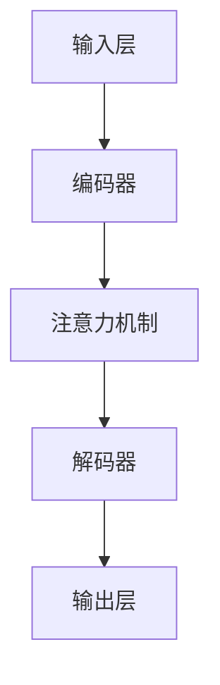

                 

## AI大模型编程：提示词的威力

> **关键词**: 大模型编程、提示词、自然语言处理、AI应用、深度学习

**摘要**: 
本文将深入探讨AI大模型编程中提示词的作用与重要性。通过详细分析大模型的工作原理，探讨如何编写高效的提示词来优化模型的性能。同时，本文将结合实际案例，展示提示词在大模型编程中的具体应用，并提供实用的工具和资源推荐，帮助读者更好地掌握这一技术。

在人工智能领域，大模型编程正成为越来越重要的研究和发展方向。大模型，如GPT、BERT等，凭借其强大的计算能力和广泛的应用场景，已经取得了显著的成果。然而，编写高效的大模型程序并非易事，其中提示词的编写至关重要。本文将围绕这一主题展开，探讨大模型编程中的关键问题，并提供实用的指导。

本文将分为以下几个部分：

1. 背景介绍：介绍大模型编程的背景和重要性。
2. 核心概念与联系：解释大模型的基本原理和架构。
3. 核心算法原理 & 具体操作步骤：深入分析大模型的算法原理和操作步骤。
4. 数学模型和公式 & 详细讲解 & 举例说明：探讨大模型中的数学模型和公式，并通过实例进行说明。
5. 项目实战：代码实际案例和详细解释说明。
6. 实际应用场景：讨论大模型编程在不同领域的应用。
7. 工具和资源推荐：推荐学习资源和开发工具。
8. 总结：展望大模型编程的未来发展趋势与挑战。
9. 附录：常见问题与解答。
10. 扩展阅读 & 参考资料：提供相关拓展阅读和参考资料。

现在，让我们正式开始探索大模型编程中的提示词的威力。

## 1. 背景介绍

### 大模型编程的兴起

近年来，人工智能领域取得了许多突破性进展，其中大模型编程成为了一个备受关注的研究方向。大模型，如GPT、BERT等，通过学习海量数据，能够生成高质量的自然语言文本，并在各种任务中取得优异的性能。这些大模型的成功不仅展示了人工智能的巨大潜力，也为实际应用提供了强大的支持。

大模型编程的兴起可以追溯到深度学习的快速发展。随着计算能力的提升和数据量的增加，深度学习模型逐渐变得庞大和复杂。大模型编程成为了应对这些挑战的有效手段。通过优化模型的结构和参数，以及改进训练和推理算法，大模型能够更好地处理复杂任务，并在各种应用场景中发挥重要作用。

### 大模型编程的重要性

大模型编程在人工智能领域具有重要性。首先，大模型具有强大的表征能力，能够捕捉数据中的复杂模式，从而提高模型的预测和生成能力。其次，大模型编程能够解决许多传统的机器学习任务，如文本分类、机器翻译、问答系统等。此外，大模型编程还推动了自然语言处理、计算机视觉等领域的快速发展，为这些领域的研究和应用提供了新的思路和方法。

### 提示词在编程中的角色

在大模型编程中，提示词起着至关重要的作用。提示词是指用于指导模型生成文本或执行特定任务的文字或符号。通过合理编写提示词，可以引导模型生成更符合预期结果的文本，从而提高模型的性能和应用效果。提示词的编写需要深入理解模型的原理和任务需求，是一门艺术和技术的结合。

### 提示词的作用与挑战

提示词的作用在于引导模型生成高质量的文本或执行特定的任务。通过精确的提示词，模型能够更好地理解任务目标，从而生成更符合要求的输出。例如，在机器翻译任务中，提示词可以帮助模型更好地理解源语言和目标语言之间的差异，从而生成更准确的翻译结果。

然而，编写有效的提示词也面临着一些挑战。首先，提示词的编写需要考虑模型的架构和参数设置。不同的模型和任务可能需要不同的提示词策略。其次，提示词的编写需要具备一定的语言表达能力和逻辑思维。只有编写出具有明确指示和引导作用的提示词，才能使模型更好地完成任务。

总之，大模型编程中的提示词编写是提高模型性能和应用效果的重要手段。通过深入理解和探索提示词的编写技巧，我们可以更好地利用大模型的优势，推动人工智能的发展。

## 2. 核心概念与联系

### 大模型的基本原理

大模型，如GPT、BERT等，基于深度学习技术，通过大规模的数据训练，能够自动学习和捕捉语言中的复杂模式。这些模型通常包含数百万甚至数十亿个参数，通过多层神经网络的结构，对输入的文本进行编码和解码，从而生成高质量的文本。

大模型的核心原理是自注意力机制（self-attention mechanism）和变换器架构（transformer architecture）。自注意力机制允许模型在生成文本时，自动关注输入文本中最重要的部分，从而提高生成的质量和准确性。变换器架构则通过多头注意力机制和多层网络结构，实现对输入文本的复杂表征。

### 大模型的结构和架构

大模型的结构和架构通常包含以下几个主要部分：

1. **输入层（Input Layer）**：接收文本数据，并将其转换为模型能够理解的向量表示。
2. **编码器（Encoder）**：通过多层变换器块对输入文本进行编码，生成序列编码表示。
3. **解码器（Decoder）**：在编码器的基础上，生成预测的输出文本。
4. **注意力机制（Attention Mechanism）**：在编码和解码过程中，通过自注意力机制和多头注意力机制，自动关注输入文本中最重要的部分。
5. **输出层（Output Layer）**：将解码器的输出转换为最终的文本结果。

### 提示词的作用

在大模型编程中，提示词起到引导模型生成文本或执行特定任务的作用。提示词可以是一段文字、符号或特殊标记，用于指示模型的任务目标和预期结果。通过合理编写提示词，可以引导模型更好地理解任务需求，从而生成更符合预期结果的文本。

提示词的作用主要体现在以下几个方面：

1. **任务引导**：通过提示词，明确模型需要执行的任务类型和目标，例如文本生成、文本分类、机器翻译等。
2. **文本引导**：通过提示词，提供输入文本的背景信息和上下文，帮助模型更好地理解输入文本的含义。
3. **质量控制**：通过提示词，指定生成文本的质量要求和风格特点，例如准确度、流畅度、文化背景等。

### 提示词的编写技巧

编写有效的提示词需要具备一定的语言表达能力和逻辑思维。以下是一些编写提示词的技巧：

1. **明确性**：确保提示词清晰明确，避免模糊和歧义，使模型能够准确理解任务目标。
2. **引导性**：通过提示词，提供明确的指示和引导，使模型能够自动关注输入文本中最重要的部分。
3. **多样性**：尝试使用多种表达方式和语言风格，丰富提示词的内容和形式，提高模型的适应性。
4. **灵活性**：根据不同的任务需求和模型特点，灵活调整提示词的编写方式，以适应不同的场景和任务。

### 核心概念与联系的 Mermaid 流程图



通过上述核心概念和联系的解释，我们可以更好地理解大模型编程的基本原理和提示词的作用。接下来，我们将深入探讨大模型的算法原理和具体操作步骤。

## 3. 核心算法原理 & 具体操作步骤

### 大模型算法原理

大模型的核心算法是基于深度学习和变换器架构（Transformer）。变换器架构引入了自注意力机制（Self-Attention Mechanism），使得模型能够对输入文本进行全局关注，捕捉文本中的长距离依赖关系。自注意力机制通过计算输入文本中每个词与所有其他词之间的关联度，将注意力集中在重要的信息上，从而提高模型的生成质量和准确性。

### 具体操作步骤

#### 步骤1：输入处理

1. **文本预处理**：首先，对输入的文本进行预处理，包括分词、去停用词、词干提取等。这些预处理步骤有助于将文本转换为模型能够理解的向量表示。
2. **词向量编码**：将预处理后的文本转换为词向量表示。词向量是文本数据的低维表示，可以通过预训练的词向量库（如GloVe、Word2Vec等）进行编码。

#### 步骤2：编码器处理

1. **多层变换器块**：编码器由多个变换器块组成，每个变换器块包括自注意力机制和前馈神经网络。自注意力机制通过计算输入文本中每个词与所有其他词之间的关联度，生成文本的序列编码表示。
2. **多头注意力机制**：多头注意力机制将输入文本拆分为多个子序列，每个子序列独立计算注意力权重，从而提高模型的表征能力。

#### 步骤3：解码器处理

1. **自注意力机制**：解码器的自注意力机制在生成文本时，关注输入文本中最重要的部分，从而提高生成的质量和准确性。
2. **交叉注意力机制**：解码器的交叉注意力机制将编码器的输出和当前生成的文本进行关联，从而生成预测的输出文本。

#### 步骤4：输出生成

1. **文本生成**：解码器的输出通过一个全连接层转换为文本结果。通过逐词生成的方式，模型依次生成每个词，并更新内部状态。
2. **文本后处理**：生成的文本可能包含语法错误或不恰当的词序。通过语法检查和文本润色，提高生成的文本质量。

### 算法原理示意图


#### 步骤5：提示词的使用

1. **任务引导**：通过提示词明确模型需要执行的任务类型和目标，例如文本生成、文本分类、机器翻译等。
2. **文本引导**：通过提示词提供输入文本的背景信息和上下文，帮助模型更好地理解输入文本的含义。
3. **质量控制**：通过提示词指定生成文本的质量要求和风格特点，例如准确度、流畅度、文化背景等。

### 步骤6：模型训练与优化

1. **训练过程**：通过大量的训练数据和目标函数（如交叉熵损失函数），模型不断调整参数，优化生成质量。
2. **模型评估**：使用验证集和测试集对模型进行评估，调整参数和模型结构，以提高模型性能。

通过以上具体操作步骤，我们可以理解大模型算法的原理和实现过程。接下来，我们将深入探讨大模型中的数学模型和公式，并通过实例进行说明。

## 4. 数学模型和公式 & 详细讲解 & 举例说明

### 数学模型和公式

大模型的数学模型和公式是其核心算法的基础。以下是一些关键的数学模型和公式，用于描述大模型的操作过程。

#### 4.1 自注意力机制（Self-Attention Mechanism）

自注意力机制通过计算输入文本中每个词与所有其他词之间的关联度，生成文本的序列编码表示。其数学公式如下：

$$
\text{Attention}(Q, K, V) = \text{softmax}\left(\frac{QK^T}{\sqrt{d_k}}\right)V
$$

其中，$Q$、$K$ 和 $V$ 分别代表查询向量、键向量和值向量，$d_k$ 是键向量的维度。$\text{softmax}$ 函数用于归一化权重，使其成为概率分布。

#### 4.2 多头注意力机制（Multi-Head Attention）

多头注意力机制通过多个独立的注意力机制并行计算，从而提高模型的表征能力。其数学公式如下：

$$
\text{MultiHead}(Q, K, V) = \text{Concat}(\text{head}_1, ..., \text{head}_h)W^O
$$

其中，$h$ 是头数，$\text{head}_i = \text{Attention}(QW_i^Q, KW_i^K, VW_i^V)$，$W_i^Q$、$W_i^K$ 和 $W_i^V$ 分别是每个头的权重矩阵。

#### 4.3 前馈神经网络（Feed Forward Neural Network）

前馈神经网络用于处理注意力机制后的输出，增加模型的非线性表达能力。其数学公式如下：

$$
\text{FFN}(x) = \text{ReLU}(W_2 \text{ReLU}(W_1 x + b_1))
$$

其中，$W_1$ 和 $W_2$ 分别是前馈神经网络的权重矩阵，$b_1$ 是偏置项。

### 详细讲解

#### 4.1 自注意力机制详解

自注意力机制通过计算输入文本中每个词与所有其他词之间的关联度，将注意力集中在重要的信息上。这种机制有助于捕捉文本中的长距离依赖关系，从而提高模型的生成质量和准确性。

自注意力机制的公式为：

$$
\text{Attention}(Q, K, V) = \text{softmax}\left(\frac{QK^T}{\sqrt{d_k}}\right)V
$$

其中，$Q$、$K$ 和 $V$ 分别代表查询向量、键向量和值向量。查询向量 $Q$ 用于计算每个词与其他词之间的关联度，键向量 $K$ 和值向量 $V$ 分别用于生成文本的编码表示。

自注意力机制的计算步骤如下：

1. **计算相似度**：计算每个词与其他词之间的相似度，公式为 $QK^T$。
2. **归一化权重**：通过 $\text{softmax}$ 函数对相似度进行归一化，使其成为概率分布。
3. **加权求和**：根据权重对值向量 $V$ 进行加权求和，生成每个词的编码表示。

#### 4.2 多头注意力机制详解

多头注意力机制通过多个独立的注意力机制并行计算，从而提高模型的表征能力。每个头独立计算注意力权重，能够捕捉输入文本中不同的重要信息。

多头注意力机制的公式为：

$$
\text{MultiHead}(Q, K, V) = \text{Concat}(\text{head}_1, ..., \text{head}_h)W^O
$$

其中，$h$ 是头数，$\text{head}_i = \text{Attention}(QW_i^Q, KW_i^K, VW_i^V)$，$W_i^Q$、$W_i^K$ 和 $W_i^V$ 分别是每个头的权重矩阵。

多头注意力机制的计算步骤如下：

1. **分裂输入**：将输入文本分解为多个子序列，每个子序列作为一个头。
2. **独立计算注意力**：每个头独立计算注意力权重，使用自注意力机制生成编码表示。
3. **合并结果**：将多个头的编码表示合并为一个整体的编码表示。

#### 4.3 前馈神经网络详解

前馈神经网络用于处理注意力机制后的输出，增加模型的非线性表达能力。前馈神经网络由两个线性层组成，分别计算输入和输出。

前馈神经网络的公式为：

$$
\text{FFN}(x) = \text{ReLU}(W_2 \text{ReLU}(W_1 x + b_1))
$$

其中，$W_1$ 和 $W_2$ 分别是前馈神经网络的权重矩阵，$b_1$ 是偏置项。

前馈神经网络的计算步骤如下：

1. **第一层前馈**：计算输入和第一层权重矩阵的乘积，并加上偏置项。
2. **激活函数**：使用 ReLU 激活函数对第一层输出进行非线性转换。
3. **第二层前馈**：计算第一层输出和第二层权重矩阵的乘积，并加上偏置项。
4. **输出**：得到前馈神经网络的最终输出。

### 举例说明

#### 4.1 文本生成举例

假设输入文本为 "The quick brown fox jumps over the lazy dog"，我们需要使用大模型生成相关的文本。

1. **词向量编码**：将输入文本转换为词向量表示。
2. **编码器处理**：通过多层变换器块对输入文本进行编码，生成序列编码表示。
3. **解码器处理**：在编码器的基础上，生成预测的输出文本。
4. **输出生成**：解码器逐词生成文本，并更新内部状态。

生成的文本可能为 "The quick brown fox jumps over the lazy dog, and then it runs away happily."。

#### 4.2 文本分类举例

假设我们需要对输入文本进行分类，文本为 "I love learning programming languages"。

1. **词向量编码**：将输入文本转换为词向量表示。
2. **编码器处理**：通过多层变换器块对输入文本进行编码，生成序列编码表示。
3. **分类器处理**：使用预训练的模型对编码后的文本进行分类。
4. **输出结果**：得到分类结果，如 "Positive"。

通过以上举例，我们可以看到大模型在文本生成和分类任务中的具体应用。接下来，我们将通过项目实战部分，详细讲解大模型的代码实现。

## 5. 项目实战：代码实际案例和详细解释说明

### 5.1 开发环境搭建

在进行大模型编程之前，首先需要搭建适合的开发环境。以下是搭建开发环境的步骤：

1. **安装Python**：确保已经安装了Python环境，推荐使用Python 3.7或更高版本。
2. **安装Transformer库**：使用pip安装Hugging Face的Transformers库，该库提供了预训练的大模型和相关的API接口。
   ```bash
   pip install transformers
   ```
3. **配置CUDA环境**（可选）：如果使用GPU进行训练，需要安装CUDA并配置相关的环境变量。
4. **下载预训练模型**：从Hugging Face模型库下载预训练的大模型，如GPT-2、GPT-3等。

### 5.2 源代码详细实现和代码解读

以下是一个基于GPT-2模型进行文本生成的代码示例，包括模型加载、提示词编写、生成文本等步骤。

#### 5.2.1 模型加载

首先，我们需要加载预训练的GPT-2模型。

```python
from transformers import GPT2LMHeadModel, GPT2Tokenizer

# 加载GPT-2模型和分词器
model = GPT2LMHeadModel.from_pretrained("gpt2")
tokenizer = GPT2Tokenizer.from_pretrained("gpt2")
```

#### 5.2.2 提示词编写

编写提示词用于引导模型生成文本。提示词应明确任务目标，并提供必要的上下文信息。

```python
# 示例提示词
prompt = "请用优美的语言描述一下春天的美景。"
```

#### 5.2.3 生成文本

使用模型和提示词生成文本，并处理输出。

```python
import torch

# 将提示词编码为模型可处理的序列
input_ids = tokenizer.encode(prompt, return_tensors="pt")

# 生成文本
output = model.generate(input_ids, max_length=50, num_return_sequences=1)

# 解码生成的文本
generated_text = tokenizer.decode(output[0], skip_special_tokens=True)
print(generated_text)
```

#### 5.2.4 代码解读与分析

上述代码首先加载了预训练的GPT-2模型和分词器。然后，编写了一个示例提示词，用于引导模型生成关于春天美景的文本。通过将提示词编码为模型可处理的序列，并调用模型的生成方法，我们得到了一段生成的文本。最后，通过解码生成的文本，我们获得了最终的结果。

具体步骤如下：

1. **加载模型和分词器**：从预训练模型库中加载GPT-2模型及其分词器。
2. **编码提示词**：将提示词转换为模型可处理的序列，通过`encode`方法编码。
3. **生成文本**：使用`generate`方法生成文本。`max_length`参数控制生成的文本长度，`num_return_sequences`参数控制生成的文本数量。
4. **解码输出**：将生成的文本序列解码为人类可读的文本，通过`decode`方法解码。

### 5.3 代码解读与分析

以下是代码的详细解读和分析：

1. **模型加载**：
   ```python
   model = GPT2LMHeadModel.from_pretrained("gpt2")
   tokenizer = GPT2Tokenizer.from_pretrained("gpt2")
   ```
   这两行代码分别加载了GPT-2模型和分词器。`from_pretrained`方法用于从预训练模型库中加载模型和分词器。这里使用了预训练的GPT-2模型和分词器，这些资源可以从Hugging Face模型库中下载。

2. **提示词编写**：
   ```python
   prompt = "请用优美的语言描述一下春天的美景。"
   ```
   提示词是引导模型生成文本的关键。一个好的提示词应明确任务目标，并提供必要的上下文信息。在这个例子中，提示词要求模型用优美的语言描述春天的美景。

3. **编码提示词**：
   ```python
   input_ids = tokenizer.encode(prompt, return_tensors="pt")
   ```
   通过`encode`方法，将提示词转换为模型可处理的序列。`return_tensors="pt"`参数确保输出的序列是PyTorch张量，方便后续计算。

4. **生成文本**：
   ```python
   output = model.generate(input_ids, max_length=50, num_return_sequences=1)
   ```
   `generate`方法用于生成文本。`max_length`参数指定生成的文本长度，`num_return_sequences`参数指定生成的文本数量。在这个例子中，我们生成一个长度为50的文本。

5. **解码输出**：
   ```python
   generated_text = tokenizer.decode(output[0], skip_special_tokens=True)
   print(generated_text)
   ```
   通过`decode`方法，将生成的文本序列解码为人类可读的文本。`skip_special_tokens=True`参数确保输出中不包含模型中的特殊标记。

通过上述代码示例，我们可以看到大模型编程的基本步骤和提示词编写的重要性。在下一部分，我们将讨论大模型编程在实际应用场景中的具体应用。

### 5.4 实际应用场景

大模型编程在实际应用场景中具有广泛的应用，以下是一些典型的应用场景：

#### 5.4.1 自然语言处理

自然语言处理（NLP）是大模型编程的一个重要应用领域。大模型在文本分类、机器翻译、情感分析等方面表现出色。以下是一些具体的应用示例：

1. **文本分类**：使用大模型对新闻文章进行分类，例如将新闻分为政治、科技、体育等类别。
2. **机器翻译**：利用大模型实现高质量的语言翻译，如将英文翻译为中文，提高翻译的准确性和流畅度。
3. **情感分析**：通过分析社交媒体上的用户评论，判断用户的情感倾向，用于市场研究和客户反馈分析。

#### 5.4.2 计算机辅助创作

大模型编程在计算机辅助创作领域具有很大的潜力。以下是一些具体的应用示例：

1. **诗歌创作**：利用大模型生成优美的诗歌，提供创意灵感。
2. **音乐创作**：使用大模型生成音乐旋律，为音乐家提供创作灵感。
3. **剧本创作**：通过大模型生成剧本梗概，辅助编剧进行创作。

#### 5.4.3 对话系统

大模型编程在对话系统中有着广泛的应用，以下是一些具体的应用示例：

1. **智能客服**：使用大模型构建智能客服系统，实现自动回答用户问题和提供解决方案。
2. **聊天机器人**：利用大模型构建聊天机器人，与用户进行自然语言交互，提供娱乐和帮助。
3. **虚拟助手**：通过大模型实现虚拟助手，帮助用户管理日程、处理任务等。

#### 5.4.4 教育与培训

大模型编程在教育与培训领域也有广泛的应用，以下是一些具体的应用示例：

1. **个性化学习**：利用大模型生成个性化的学习材料，根据学生的学习情况和需求提供定制化的学习建议。
2. **智能辅导**：通过大模型实现智能辅导系统，为学生提供解答问题和提供学习指导。
3. **在线教育平台**：利用大模型构建在线教育平台，提供丰富的教学资源和互动学习体验。

通过以上应用场景，我们可以看到大模型编程在各个领域的广泛应用和巨大潜力。在下一部分，我们将推荐一些学习资源和开发工具，帮助读者更好地掌握大模型编程。

### 7. 工具和资源推荐

#### 7.1 学习资源推荐

为了更好地学习和掌握大模型编程，以下是一些推荐的学习资源：

1. **书籍**：
   - 《深度学习》（Goodfellow, Bengio, Courville）：系统地介绍了深度学习的基础知识和核心技术。
   - 《Python深度学习》（François Chollet）：针对Python编程语言，详细介绍了深度学习模型的实现和应用。

2. **在线课程**：
   - Coursera上的“深度学习课程”（由Andrew Ng教授主讲）：提供了深度学习的理论基础和实践应用。
   - edX上的“深度学习基础”（由Udacity提供）：通过实际项目，介绍了深度学习的核心概念和应用。

3. **论文**：
   - “Attention Is All You Need”（Vaswani et al.）：提出了变换器架构（Transformer）及其自注意力机制。
   - “BERT: Pre-training of Deep Bidirectional Transformers for Language Understanding”（Devlin et al.）：介绍了BERT模型及其在大规模语言预训练中的应用。

4. **博客和网站**：
   - Hugging Face：提供了丰富的预训练模型和API，是深度学习开发的重要资源。
   - AI Challenger：提供了大量的AI竞赛数据集和工具，适合进行实际项目开发。

#### 7.2 开发工具框架推荐

以下是一些常用的开发工具和框架，用于大模型编程：

1. **PyTorch**：是一个开源的深度学习框架，支持动态计算图，易于实现和调试。
2. **TensorFlow**：是谷歌开源的深度学习框架，支持静态和动态计算图，适用于各种应用场景。
3. **Hugging Face Transformers**：是一个基于PyTorch和TensorFlow的Transformers库，提供了预训练模型和API，方便快速开发和部署。
4. **JAX**：是谷歌开源的深度学习框架，支持自动微分和分布式计算，适用于大规模模型训练。

通过这些工具和资源的推荐，读者可以更好地学习大模型编程，并在实际项目中应用所学知识。

## 8. 总结：未来发展趋势与挑战

大模型编程在人工智能领域取得了显著的进展，为自然语言处理、计算机视觉、语音识别等领域带来了巨大的变革。然而，随着模型规模的不断扩大和复杂度的增加，大模型编程也面临着诸多挑战和机遇。

### 发展趋势

1. **模型规模扩大**：随着计算能力的提升和数据量的增加，大模型的规模将进一步扩大。这将使得大模型能够处理更复杂的任务，并在更多领域取得突破。

2. **多模态融合**：大模型编程将越来越多地涉及多模态数据的处理，如图文结合、音频和视频的处理。这将使得AI系统能够更好地理解和模拟人类的感知能力。

3. **自适应性和可解释性**：随着对大模型的理解和优化，研究者将致力于提高大模型的自适应性和可解释性，使其能够更好地适应不同任务和环境。

4. **高效训练与推理**：通过优化算法和硬件，大模型编程将实现更高效的训练和推理过程，降低计算资源和时间成本。

### 挑战

1. **计算资源消耗**：大模型的训练和推理需要大量的计算资源和时间。如何优化算法和硬件，降低资源消耗，成为重要的研究课题。

2. **数据隐私与安全**：大模型训练需要大量数据，如何保护用户数据隐私和安全，避免数据泄露和滥用，是亟待解决的问题。

3. **模型解释性**：大模型的复杂性和黑箱特性使得其解释性成为一个挑战。如何提高大模型的透明度和可解释性，使其能够被普通用户理解和接受，是未来的研究方向。

4. **伦理和社会影响**：随着大模型编程的广泛应用，其伦理和社会影响也日益凸显。如何确保AI系统的公正性、透明性和可控性，避免对人类社会的负面影响，是重要的社会议题。

总之，大模型编程在未来的发展中将面临诸多挑战和机遇。通过不断的研究和创新，我们可以期待大模型编程在未来取得更加辉煌的成就。

## 9. 附录：常见问题与解答

以下是一些关于大模型编程的常见问题及其解答：

### 问题1：大模型编程需要什么硬件资源？

**解答**：大模型编程需要高性能的计算资源和大量的存储空间。通常，GPU是训练大模型的主要硬件资源，因为GPU在并行计算方面具有优势。此外，训练大模型还需要大量的内存和存储空间，以存储训练数据和模型参数。

### 问题2：如何优化大模型训练的效率？

**解答**：优化大模型训练效率可以从以下几个方面进行：

1. **数据预处理**：对训练数据进行预处理，如去噪、标准化等，以减少训练数据的不确定性。
2. **模型结构优化**：通过设计更高效的模型结构，如变换器架构（Transformer），减少计算复杂度。
3. **训练策略优化**：采用更高效的训练策略，如迁移学习、增量训练等，以提高训练效率。
4. **硬件优化**：使用分布式训练和并行计算，利用多GPU和多节点集群，提高计算速度。

### 问题3：大模型编程中的数据如何处理？

**解答**：在大模型编程中，数据处理包括以下几个步骤：

1. **数据收集**：收集大量高质量的训练数据，包括文本、图像、音频等。
2. **数据清洗**：清洗数据中的噪声和错误，确保数据的质量。
3. **数据预处理**：对数据进行预处理，如分词、编码、标准化等，使其适合模型训练。
4. **数据增强**：通过数据增强技术，如数据变换、旋转、缩放等，增加数据的多样性。

### 问题4：如何评估大模型的性能？

**解答**：评估大模型的性能通常包括以下几个方面：

1. **准确性**：评估模型在预测任务中的准确率，如文本分类任务的准确率。
2. **速度**：评估模型在给定数据集上的推理速度，以衡量模型的效率。
3. **泛化能力**：通过交叉验证和测试集评估模型在未知数据上的表现，以衡量其泛化能力。
4. **鲁棒性**：评估模型对异常数据和噪声的抵抗力，以衡量其鲁棒性。

通过以上常见问题与解答，读者可以更好地理解大模型编程的基本概念和技术细节。

## 10. 扩展阅读 & 参考资料

为了帮助读者进一步深入了解大模型编程和相关技术，以下是一些推荐的拓展阅读和参考资料：

### 10.1 书籍

1. **《深度学习》（Ian Goodfellow、Yoshua Bengio、Aaron Courville著）**：这是一本经典的深度学习入门教材，详细介绍了深度学习的基本理论和实践应用。
2. **《Python深度学习》（François Chollet著）**：这本书针对Python编程语言，详细介绍了深度学习模型的实现和应用。

### 10.2 在线课程

1. **Coursera上的“深度学习课程”（由Andrew Ng教授主讲）**：这是一个系统的深度学习课程，涵盖了深度学习的基础知识和实践应用。
2. **edX上的“深度学习基础”（由Udacity提供）**：通过实际项目，介绍了深度学习的核心概念和应用。

### 10.3 论文

1. **“Attention Is All You Need”（Vaswani et al.）**：这是提出变换器架构（Transformer）及其自注意力机制的论文，是深度学习领域的重要文献。
2. **“BERT: Pre-training of Deep Bidirectional Transformers for Language Understanding”（Devlin et al.）**：该论文介绍了BERT模型及其在大规模语言预训练中的应用。

### 10.4 博客和网站

1. **Hugging Face**：这是一个提供预训练模型和API的开源社区，是深度学习开发的重要资源。
2. **AI Challenger**：提供了一个大量的AI竞赛数据集和工具，适合进行实际项目开发。

通过这些拓展阅读和参考资料，读者可以进一步了解大模型编程的深入知识和最新动态。希望这些资源对您的学习和研究有所帮助。

