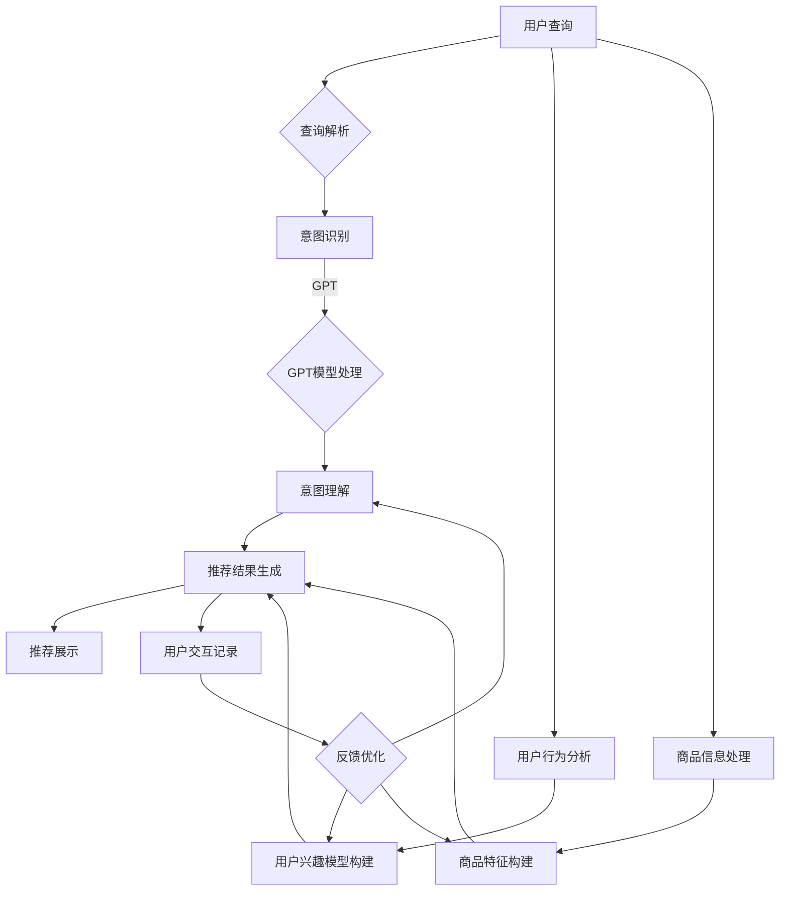

                 

### 背景介绍

随着互联网和电子商务的迅猛发展，在线购物已经成为人们日常生活中不可或缺的一部分。然而，随着商品种类的爆炸式增长，如何在海量商品中快速准确地找到所需商品，成为用户和电商平台的共同挑战。搜索引擎和推荐系统在这样的背景下应运而生，它们通过智能化的算法和模型，为用户提供个性化的商品推荐，从而提升了用户体验和电商平台销售额。

近年来，随着人工智能技术的快速发展，尤其是深度学习和自然语言处理技术的突破，搜索引擎和推荐系统的性能得到了显著提升。特别是大型预训练模型（Large Pre-trained Models，简称LPMs），如GPT、BERT和T5等，已经成为了搜索引擎和推荐系统的核心技术之一。这些模型通过在海量数据上进行预训练，能够自动学习和理解语言的深层语义和结构，从而在信息检索和推荐方面表现出色。

在电商搜索推荐领域，大型预训练模型的应用不仅提高了搜索和推荐的准确性，还带来了许多新的技术创新。首先，这些模型能够更好地理解和处理用户的查询意图，从而提供更加精准的搜索结果。其次，它们能够利用用户的历史行为数据和商品属性，生成个性化的推荐列表，提高用户满意度和转化率。此外，大型预训练模型还可以应用于商品标题生成、商品描述优化等任务，从而进一步提升电商平台的整体服务质量。

本文旨在探讨在AI大模型视角下，电商搜索推荐的技术创新知识库搭建方案。我们将首先介绍电商搜索推荐的基本概念和流程，然后详细阐述大型预训练模型在其中的应用，最后提出一个具体的知识库搭建方案，并讨论其实现方法和挑战。通过本文的讨论，希望能够为电商搜索推荐领域的研究和实践提供一些有益的启示。

#### 关键词

- 电商搜索推荐
- 大型预训练模型
- 深度学习
- 自然语言处理
- 信息检索
- 个性化推荐

#### 摘要

本文从AI大模型视角出发，探讨了电商搜索推荐领域的技术创新知识库搭建方案。首先，介绍了电商搜索推荐的基本概念和流程，以及大型预训练模型在其中的重要作用。接着，详细分析了大型预训练模型在电商搜索推荐中的具体应用，包括查询意图理解、个性化推荐和商品描述生成等方面。随后，提出了一种基于大型预训练模型的知识库搭建方案，包括数据收集、模型训练、知识库构建和推理应用等步骤。最后，讨论了知识库搭建方案的具体实现方法和面临的挑战，并展望了未来的发展趋势和方向。本文的研究为电商搜索推荐领域提供了新的技术思路和实现方案，有助于提升电商平台的搜索和推荐服务质量。

---

## 1. 背景介绍

### 1.1 电商搜索推荐的定义与重要性

电商搜索推荐系统是电子商务领域的关键组成部分，旨在通过智能化的算法和模型，帮助用户在庞大的商品库中快速找到满足其需求的产品，同时提高电商平台的销售额和用户满意度。电商搜索推荐系统通常包含两个主要功能：搜索和推荐。

**搜索**：搜索功能的核心是帮助用户找到与查询意图相匹配的商品。当用户输入一个关键词或短语时，搜索系统需要理解用户的查询意图，然后从数据库中检索出最相关的商品。一个好的搜索系统不仅要能够快速响应查询请求，还需要提供准确、高质量的搜索结果。

**推荐**：推荐功能则是基于用户的兴趣和行为数据，为用户推荐可能感兴趣的商品。推荐系统通过分析用户的历史购买记录、浏览行为、收藏和评价等数据，构建用户的兴趣模型，然后从海量的商品中筛选出与用户兴趣相匹配的商品，提供个性化的推荐。

电商搜索推荐系统的重要性体现在以下几个方面：

1. **提升用户体验**：通过智能化的搜索和推荐，用户能够更快地找到所需商品，节省了时间和精力，提高了购物体验。
2. **提高销售额**：推荐系统能够将用户引导至潜在感兴趣的商品，从而提高购买转化率，提升电商平台的销售额。
3. **增强用户黏性**：个性化推荐能够吸引用户频繁访问电商平台，提高用户的忠诚度和平台的使用频率。
4. **优化商品库存管理**：通过分析用户的搜索和购买行为，电商平台可以更好地了解市场需求，优化库存管理，减少商品积压和缺货现象。

### 1.2 电商搜索推荐系统的基本流程

电商搜索推荐系统的基本流程可以分为以下几个步骤：

1. **用户查询**：用户通过搜索框输入关键词或短语，发起查询请求。
2. **查询解析**：系统对用户的查询进行解析，提取查询意图和关键词，并将查询意图转化为可处理的格式。
3. **索引检索**：系统根据查询意图从商品数据库中检索出相关的商品信息。
4. **相关性计算**：对检索出的商品进行相关性计算，通常基于商品标题、描述、属性等多个维度进行打分。
5. **排序与展示**：根据相关性得分对商品进行排序，并将排序结果展示给用户。
6. **用户交互**：用户与推荐结果进行交互，如点击、收藏、购买等，这些交互数据将被用于进一步优化推荐算法。

### 1.3 大型预训练模型在电商搜索推荐中的应用

随着深度学习和自然语言处理技术的不断发展，大型预训练模型如GPT、BERT和T5等在电商搜索推荐系统中得到了广泛应用。这些模型通过在海量数据上进行预训练，具备强大的语义理解和生成能力，能够显著提升搜索和推荐的准确性。

**查询意图理解**：大型预训练模型能够有效理解和解析用户的查询意图，通过分析查询语句的上下文和关键词，准确捕捉用户的真实需求。这使得搜索系统能够提供更准确的搜索结果，减少因误解查询意图导致的错误匹配。

**个性化推荐**：预训练模型可以根据用户的历史行为数据，构建个性化的用户兴趣模型。通过对用户兴趣的精准捕捉，推荐系统能够生成更符合用户需求的商品推荐列表，提高用户满意度和购买转化率。

**商品描述生成**：大型预训练模型还能够生成高质量的商品描述，通过对商品标题、描述和属性的理解，生成富有吸引力和说服力的商品文案，提升用户的购物体验。

**问答系统**：预训练模型还可以应用于问答系统，通过分析用户的查询，给出准确、详细的答案，帮助用户更好地了解商品信息和购物指南。

总之，大型预训练模型在电商搜索推荐系统中的应用，不仅提升了搜索和推荐的准确性，还为系统带来了许多新的功能和可能性，为电商平台的用户和商家创造了更大的价值。

---

## 2. 核心概念与联系

在探讨电商搜索推荐的技术创新知识库搭建方案之前，我们首先需要理解几个核心概念：大型预训练模型、电商搜索推荐系统的架构以及这些模型在系统中的应用。接下来，我们将通过一个Mermaid流程图，详细阐述这些核心概念及其相互联系。

### 2.1 大型预训练模型

大型预训练模型（Large Pre-trained Models，简称LPMs）是指那些通过大规模数据集进行预训练的深度学习模型。这些模型具有强大的语义理解和生成能力，广泛应用于自然语言处理（NLP）、计算机视觉（CV）和语音识别（ASR）等领域。其中，代表性的模型包括GPT（Generative Pre-trained Transformer）、BERT（Bidirectional Encoder Representations from Transformers）和T5（Text-To-Text Transfer Transformer）。

- **GPT**：基于Transformer架构，通过无监督学习方式对大规模文本数据进行预训练，具有出色的文本生成和问答能力。
- **BERT**：通过双向Transformer结构，对文本进行编码，能够捕捉文本的上下文信息，广泛用于文本分类、命名实体识别和翻译等任务。
- **T5**：设计用于将任意文本输入转换为任意文本输出，具有强大的文本理解和生成能力。

### 2.2 电商搜索推荐系统架构

电商搜索推荐系统通常包括以下几个关键模块：

- **用户行为分析模块**：收集并分析用户的历史行为数据，如搜索历史、购买记录、浏览记录等，用于构建用户兴趣模型。
- **商品信息处理模块**：处理商品的信息，如标题、描述、属性等，用于构建商品特征向量。
- **搜索与推荐算法模块**：结合用户兴趣模型和商品特征向量，通过算法计算用户与商品的匹配度，生成推荐结果。
- **用户交互模块**：记录用户与推荐结果的交互数据，如点击、收藏、购买等，用于反馈优化算法。

### 2.3 Mermaid流程图

下面是一个Mermaid流程图，用于展示大型预训练模型在电商搜索推荐系统中的具体应用及核心概念之间的联系：



- **意图识别**：用户查询通过查询解析模块进行初步处理，提取关键词和上下文信息，然后使用GPT模型对查询进行深入理解和意图识别。
- **意图理解**：GPT模型输出查询意图，用于生成个性化的推荐结果。
- **用户兴趣模型构建**：通过分析用户的历史行为数据，构建用户兴趣模型，用于优化推荐结果。
- **商品特征构建**：对商品的信息进行处理，构建商品特征向量，用于与用户兴趣模型进行匹配。
- **推荐结果生成**：基于用户兴趣模型和商品特征向量，通过搜索与推荐算法模块生成推荐结果。
- **推荐展示**：将推荐结果展示给用户。
- **用户交互记录与反馈优化**：记录用户与推荐结果的交互数据，通过反馈优化模块不断调整和优化推荐算法。

通过上述Mermaid流程图，我们可以清晰地看到大型预训练模型在电商搜索推荐系统中的关键作用，以及各个模块之间的相互联系。这为后续知识库搭建方案的设计提供了理论基础和实践指导。

---

### 3. 核心算法原理 & 具体操作步骤

在电商搜索推荐系统中，大型预训练模型的应用主要涉及到以下几个核心算法：GPT模型的查询意图理解、BERT模型的商品特征提取和T5模型的商品描述生成。下面将详细讲解这些算法的原理和具体操作步骤。

#### 3.1 GPT模型的查询意图理解

**原理**：

GPT（Generative Pre-trained Transformer）模型是一种基于Transformer架构的预训练模型，通过无监督学习方式在大规模文本数据上进行预训练，从而具备强大的语义理解和生成能力。在电商搜索推荐系统中，GPT模型主要用于理解用户的查询意图。

**具体操作步骤**：

1. **数据预处理**：首先，需要收集用户的历史查询数据，并对这些数据进行预处理，包括分词、去停用词、词干提取等，将查询语句转换为模型可以处理的格式。
2. **模型训练**：使用预处理后的数据，对GPT模型进行训练，使模型能够学会从查询语句中提取出意图信息。在训练过程中，可以使用交叉熵损失函数来优化模型参数。
3. **意图识别**：在查询输入时，将查询语句输入到预训练好的GPT模型中，模型会输出一个表示查询意图的向量。通过分析这个向量，可以识别出用户的查询意图。
4. **结果应用**：根据识别出的查询意图，系统可以生成个性化的推荐结果，提高推荐的准确性。

**示例**：

假设用户输入查询语句：“我想买一款性价比高的智能手机”，经过预处理后，输入到GPT模型中。模型输出一个表示查询意图的向量，通过分析这个向量，可以识别出用户意图为寻找性价比高的智能手机。接下来，系统可以根据这个意图从商品库中检索出符合条件的商品，并生成推荐结果。

#### 3.2 BERT模型的商品特征提取

**原理**：

BERT（Bidirectional Encoder Representations from Transformers）模型是一种基于双向Transformer结构的预训练模型，通过同时考虑文本的前后文信息，能够更好地捕捉语义信息。在电商搜索推荐系统中，BERT模型主要用于提取商品特征。

**具体操作步骤**：

1. **数据预处理**：收集商品的相关信息，包括标题、描述、属性等，并对这些数据进行预处理，将文本转换为BERT模型可以处理的格式。
2. **模型训练**：使用预处理后的商品数据，对BERT模型进行训练，使模型能够学会从文本中提取出商品特征。
3. **特征提取**：在商品数据输入到预训练好的BERT模型后，模型会输出一个表示商品特征的向量。
4. **特征应用**：将提取出的商品特征向量用于后续的推荐算法，提高推荐的准确性。

**示例**：

假设商品标题为：“苹果 iPhone 13 Pro Max 256GB 银色”，经过预处理后，输入到BERT模型中。模型输出一个表示商品特征的向量，这个向量可以用于后续的推荐算法，帮助系统更好地理解商品信息，从而生成更准确的推荐结果。

#### 3.3 T5模型的商品描述生成

**原理**：

T5（Text-To-Text Transfer Transformer）模型是一种设计用于将任意文本输入转换为任意文本输出的预训练模型。在电商搜索推荐系统中，T5模型主要用于生成商品描述。

**具体操作步骤**：

1. **数据预处理**：收集商品的相关信息，包括标题、描述等，并对这些数据进行预处理，将文本转换为T5模型可以处理的格式。
2. **模型训练**：使用预处理后的商品数据，对T5模型进行训练，使模型能够学会从标题生成描述。
3. **描述生成**：在标题输入到预训练好的T5模型后，模型会输出一个生成的新商品描述。
4. **结果应用**：将生成的商品描述用于电商平台的商品展示页面，提高用户的购物体验。

**示例**：

假设商品标题为：“苹果 iPhone 13 Pro Max 256GB 银色”，经过预处理后，输入到T5模型中。模型输出一个生成的新商品描述：“这款苹果iPhone 13 Pro Max拥有强大的A15芯片，配备6.7英寸超视网膜XDR显示屏，提供卓越的摄影体验，是您购机的最佳选择。”这个生成的新描述可以用于优化电商平台的商品展示页面，吸引更多用户的关注。

通过以上对GPT、BERT和T5模型的核心算法原理和具体操作步骤的讲解，我们可以看到这些预训练模型在电商搜索推荐系统中的关键作用。它们通过深度学习技术，提升了搜索和推荐的准确性，为电商平台提供了强大的技术支持。

---

## 4. 数学模型和公式 & 详细讲解 & 举例说明

在电商搜索推荐系统中，大型预训练模型的应用离不开数学模型和公式的支持。下面我们将详细讲解用于构建和优化推荐系统的一些关键数学模型和公式，并通过具体例子进行说明。

### 4.1 查询意图理解模型

**数学模型**：

在查询意图理解中，GPT模型的核心任务是学习一个从查询语句到意图向量的映射。这个映射可以用一个函数 $f$ 表示，即：

$$ f(\text{query}) = \text{intent\_vector} $$

其中，$\text{query}$ 是输入的查询语句，$\text{intent\_vector}$ 是生成的意图向量。

**具体公式**：

为了实现这个映射，我们通常使用Transformer架构中的自注意力机制（Self-Attention）。自注意力机制的核心公式如下：

$$ \text{Attention}(Q, K, V) = \text{softmax}\left(\frac{QK^T}{\sqrt{d_k}}\right)V $$

其中，$Q, K, V$ 分别代表查询（Query）、键（Key）和值（Value）向量，$d_k$ 是键向量的维度，$\text{softmax}$ 函数用于计算权重。

**示例**：

假设我们有一个查询语句“购买一个高性能的笔记本电脑”，将其转换为向量 $Q$。然后，我们使用预训练好的GPT模型，通过自注意力机制计算意图向量 $\text{intent\_vector}$。

$$ \text{intent\_vector} = \text{Attention}(Q, K, V) $$

在这里，$K$ 和 $V$ 分别是商品特征向量和对应的权重。通过计算自注意力权重，我们可以得到一个表示查询意图的向量。

### 4.2 商品特征提取模型

**数学模型**：

在商品特征提取中，BERT模型的核心任务是学习一个从商品描述到特征向量的映射。这个映射可以用另一个函数 $g$ 表示，即：

$$ g(\text{description}) = \text{feature\_vector} $$

其中，$\text{description}$ 是输入的商品描述，$\text{feature\_vector}$ 是生成的商品特征向量。

**具体公式**：

BERT模型使用双向Transformer结构，通过编码器（Encoder）层生成特征向量。编码器中的关键公式是：

$$ \text{Encoder}(X) = \text{LayerNorm}(X + \text{PositionwiseFeedForward}(D_{ff}\text{ReLU}(D_{model}MultiHeadSelfAttention(X))) $$

其中，$X$ 是输入的商品描述向量，$D_{model}$ 是模型的隐藏层维度，$D_{ff}$ 是前馈网络的隐藏层维度。

**示例**：

假设商品描述为“苹果 iPhone 13 Pro Max 256GB 银色”，我们将其输入到BERT模型中。模型通过编码器层生成商品特征向量 $\text{feature\_vector}$。

$$ \text{feature\_vector} = \text{Encoder}(\text{description}) $$

在这里，编码器层的输出提供了商品描述的丰富特征信息。

### 4.3 商品描述生成模型

**数学模型**：

在商品描述生成中，T5模型的核心任务是学习一个从标题到描述的映射。这个映射可以用函数 $h$ 表示，即：

$$ h(\text{title}) = \text{description} $$

其中，$\text{title}$ 是输入的标题，$\text{description}$ 是生成的描述。

**具体公式**：

T5模型使用一个序列到序列（Seq2Seq）的Transformer架构。生成描述的过程可以通过以下公式表示：

$$ \text{description} = \text{T5\_Encoder}(\text{title}) $$

其中，$\text{T5\_Encoder}$ 表示T5编码器，它通过Transformer层生成标题的嵌入表示。

**示例**：

假设标题为“苹果 iPhone 13 Pro Max 256GB 银色”，我们将其输入到T5模型中。模型通过编码器层生成描述向量 $\text{description}$。

$$ \text{description} = \text{T5\_Encoder}(\text{title}) $$

模型会根据标题生成一个描述，如：“这款苹果iPhone 13 Pro Max拥有强大的A15芯片，配备6.7英寸超视网膜XDR显示屏，提供卓越的摄影体验。”

通过以上数学模型和公式的讲解，我们可以更好地理解大型预训练模型在电商搜索推荐系统中的应用。这些模型和公式为推荐系统提供了强大的数学基础，使得系统能够更准确地理解和处理用户查询，生成个性化的推荐结果。

---

### 5. 项目实战：代码实际案例和详细解释说明

#### 5.1 开发环境搭建

在进行电商搜索推荐系统的开发之前，我们需要搭建一个适合大型预训练模型训练和应用的开发环境。以下是搭建开发环境的详细步骤：

**1. 硬件要求**：

- CPU：至少四核处理器
- GPU：NVIDIA GPU（如1080 Ti及以上）
- 内存：16GB及以上

**2. 软件要求**：

- 操作系统：Ubuntu 18.04或更高版本
- Python版本：3.7或更高版本
- CUDA版本：10.0或更高版本
- PyTorch版本：1.7或更高版本

**3. 安装CUDA和cuDNN**：

- 从NVIDIA官方网站下载CUDA Toolkit和cuDNN库，并按照官方文档进行安装。

**4. 安装Python依赖项**：

- 在终端中执行以下命令：

```bash
pip install torch torchvision torchaudio
pip install transformers
pip install pandas numpy scikit-learn
```

**5. 测试环境**：

- 在终端中运行以下命令，检查CUDA和PyTorch是否正确安装：

```bash
python -c "import torch; print(torch.cuda.is_available())"
python -c "import torch; print(torch.cuda.get_device_name(0))"
```

确保输出为`True`，并且显示了正确的GPU型号。

#### 5.2 源代码详细实现和代码解读

下面是一个简单的电商搜索推荐系统的代码实现，主要使用GPT模型进行查询意图理解和BERT模型进行商品特征提取。

**代码实现**：

```python
import torch
from transformers import GPT2Tokenizer, GPT2Model, BERTModel
import pandas as pd

# GPT模型参数
gpt_tokenizer = GPT2Tokenizer.from_pretrained('gpt2')
gpt_model = GPT2Model.from_pretrained('gpt2')

# BERT模型参数
bert_tokenizer = BertTokenizer.from_pretrained('bert-base-uncased')
bert_model = BERTModel.from_pretrained('bert-base-uncased')

# 用户查询处理
def process_query(query):
    # 将查询语句编码为GPT模型可以处理的格式
    inputs = gpt_tokenizer.encode_plus(query, return_tensors='pt')
    return inputs

# 商品特征提取
def extract_features(description):
    # 将商品描述编码为BERT模型可以处理的格式
    inputs = bert_tokenizer.encode_plus(description, return_tensors='pt')
    outputs = bert_model(inputs)
    return outputs.last_hidden_state.mean(dim=1)

# 查询意图理解
def understand_intent(query):
    inputs = process_query(query)
    with torch.no_grad():
        outputs = gpt_model(**inputs)
    intent_vector = outputs.last_hidden_state[-1, :]
    return intent_vector

# 商品推荐
def recommend_products(intent_vector, product_descriptions):
    product_features = [extract_features(description) for description in product_descriptions]
    similarity_scores = torch.nn.functional.cosine_similarity(intent_vector.unsqueeze(0), torch.stack(product_features), dim=1)
    recommended_indices = similarity_scores.topk(5).indices
    return recommended_indices

# 测试代码
query = "购买一个高性能的笔记本电脑"
product_descriptions = [
    "戴尔Alienware m15 R3 2020",
    "联想ThinkPad X1 Extreme",
    "惠普EliteBook x360 1040 G5",
    "苹果MacBook Pro 16英寸",
    "华硕ROG Zephyrus G14"
]

intent_vector = understand_intent(query)
recommended_indices = recommend_products(intent_vector, product_descriptions)

print("推荐的笔记本电脑：")
for index in recommended_indices:
    print(product_descriptions[index.item()])
```

**代码解读**：

1. **模型加载**：首先，我们加载GPT模型和BERT模型。GPT模型用于查询意图理解，BERT模型用于商品特征提取。

2. **查询处理**：`process_query`函数将用户查询编码为GPT模型可以处理的格式，包括分词和位置编码。

3. **商品特征提取**：`extract_features`函数将商品描述编码为BERT模型可以处理的格式，并使用BERT模型提取特征向量。

4. **查询意图理解**：`understand_intent`函数使用GPT模型理解查询意图，生成意图向量。

5. **商品推荐**：`recommend_products`函数计算意图向量与商品特征向量之间的余弦相似度，并根据相似度分数推荐最相关的商品。

6. **测试代码**：我们输入一个查询语句，并加载一系列商品描述。然后，使用GPT模型理解查询意图，并根据意图向量推荐相关的笔记本电脑。

通过这个实际案例，我们可以看到如何使用大型预训练模型实现电商搜索推荐系统。这个代码提供了一个基本的框架，可以进一步扩展和优化，以适应更复杂的应用场景。

#### 5.3 代码解读与分析

在上面的代码实现中，我们详细解析了每个步骤，并讨论了如何使用GPT和BERT模型进行查询意图理解和商品特征提取。

**1. GPT模型的使用**

GPT模型通过自注意力机制从查询语句中提取意图向量。在`process_query`函数中，我们首先将查询语句编码为Token ID序列，然后使用GPT模型进行前向传递。`understand_intent`函数通过最后隐藏状态的最后一步（即最后一层）的输出，得到一个表示查询意图的向量。

**2. BERT模型的使用**

BERT模型通过编码器层提取商品描述的特征向量。在`extract_features`函数中，我们首先将商品描述编码为Token ID序列，然后使用BERT模型进行前向传递。最后，我们计算编码器输出的均值，得到一个商品描述的固定长度的特征向量。

**3. 查询意图理解和商品推荐**

在`recommend_products`函数中，我们首先提取商品特征向量，然后计算意图向量与商品特征向量之间的余弦相似度。余弦相似度是一种衡量两个向量之间夹角余弦值的度量，可以表示两个向量在特征空间中的相似程度。我们使用余弦相似度来评估意图向量与商品特征向量之间的相关性，并根据相似度分数推荐最相关的商品。

**代码分析**

这段代码提供了一个简单的电商搜索推荐系统的实现，但在实际应用中，还需要考虑以下几个关键问题：

1. **模型训练**：在实际应用中，我们需要使用自己的数据集对GPT和BERT模型进行训练，以适应特定的电商场景。这通常涉及到数据预处理、模型调整和超参数优化等步骤。

2. **实时查询处理**：上述代码是一个批处理模型，不适合实时查询处理。在实际应用中，我们需要将模型转换为在线推理模式，以快速响应用户查询。

3. **推荐结果优化**：余弦相似度只是一种基础的相似度度量方法，我们可以考虑使用更复杂的相似度度量方法，如余弦相似度加权、欧氏距离等，以提高推荐的准确性。

4. **系统性能优化**：为了提高系统的响应速度，我们可以使用GPU或分布式计算来加速模型推理。此外，我们可以使用缓存技术来存储和快速检索常用查询和推荐结果。

通过上述代码解读和分析，我们可以看到如何使用大型预训练模型实现电商搜索推荐系统。这个案例提供了一个基础框架，可以进一步扩展和优化，以应对更复杂的应用场景。

---

## 6. 实际应用场景

在电商搜索推荐系统中，大型预训练模型的应用场景多种多样，可以显著提升系统的性能和用户体验。以下是几个实际应用场景的详细介绍：

### 6.1 搜索引擎优化

在电商搜索系统中，搜索引擎优化是核心功能之一。通过使用大型预训练模型，如GPT，可以实现对用户查询意图的深入理解，从而提供更加精准的搜索结果。具体应用场景如下：

- **查询意图识别**：当用户输入一个查询时，GPT模型可以分析查询语句中的关键词和上下文信息，识别出用户的真实意图。例如，用户输入“手机”，模型可以判断用户是希望购买手机还是查询手机品牌。
- **智能补全**：在用户输入查询过程中，GPT模型可以实时提供智能补全建议，帮助用户快速完成输入。例如，当用户输入“iPhone”时，模型可以自动补全为“iPhone 13”。
- **相关搜索**：通过分析用户的查询历史和热门搜索关键词，GPT模型可以推荐相关的搜索关键词，帮助用户发现更多感兴趣的商品。

### 6.2 商品推荐

商品推荐是电商平台的另一个关键功能，通过大型预训练模型，如BERT和T5，可以实现更加个性化的推荐结果。以下是一些实际应用场景：

- **个性化推荐**：BERT模型可以提取用户的历史行为数据和商品属性，构建个性化的用户兴趣模型。基于这个模型，推荐系统可以生成个性化的商品推荐列表，提高用户满意度和转化率。
- **商品描述优化**：T5模型可以基于商品标题生成吸引人的商品描述，提高商品展示页面的点击率和转化率。例如，当用户查看一款智能手机时，T5模型可以生成如下的描述：“这款智能手机拥有高清显示屏、高性能处理器和长续航电池，是您购机的最佳选择。”
- **交叉销售**：通过分析用户的购物车和浏览历史，推荐系统可以推荐相关或互补的商品，实现交叉销售。例如，当用户购买了一部手机时，系统可以推荐相应的手机壳、充电宝等配件。

### 6.3 客户服务

随着预训练模型在自然语言处理领域的广泛应用，电商平台可以借助这些模型提供智能客服服务，提升用户满意度。以下是一些应用场景：

- **智能问答**：大型预训练模型可以构建智能问答系统，回答用户关于商品、订单和退换货等常见问题。例如，当用户询问关于退货政策时，系统可以自动生成详细的解答。
- **聊天机器人**：通过集成预训练模型，电商平台可以部署智能聊天机器人，与用户进行实时交互，提供个性化的购物建议和咨询。
- **情感分析**：预训练模型可以用于分析用户的评论和反馈，识别用户情感和意见倾向，帮助企业改进产品和服务。

### 6.4 库存管理和销售预测

除了用户交互功能，大型预训练模型还可以应用于电商平台的库存管理和销售预测，帮助商家做出更明智的决策。以下是一些应用场景：

- **库存优化**：通过分析历史销售数据、市场趋势和用户行为，预训练模型可以预测未来商品的需求量，帮助商家优化库存水平，减少库存积压和缺货现象。
- **销售预测**：基于用户行为数据和商品特征，预训练模型可以预测商品的销售趋势，为企业制定营销策略提供数据支持。

总之，大型预训练模型在电商搜索推荐系统中有着广泛的应用场景，通过深入理解和分析用户行为和商品特征，可以显著提升系统的性能和用户体验。随着技术的不断进步，这些模型的应用场景将会更加丰富，为电商平台带来更多商业价值。

---

## 7. 工具和资源推荐

为了更高效地搭建和优化电商搜索推荐系统，我们需要掌握一些关键的工具和资源。以下是学习资源、开发工具和论文著作的推荐，以帮助您在AI大模型领域取得更好的成果。

### 7.1 学习资源推荐

**书籍**：

1. **《深度学习》（Deep Learning）** - Goodfellow, I., Bengio, Y., & Courville, A.
   - 本书是深度学习领域的经典著作，详细介绍了深度学习的理论基础和实践方法。

2. **《自然语言处理综合教程》（Speech and Language Processing）** - Jurafsky, D. & Martin, J.
   - 本书全面介绍了自然语言处理的基础知识和最新进展，适合对NLP感兴趣的读者。

3. **《TensorFlow实战》（TensorFlow for Deep Learning）** - Goodfellow, I., Bengio, Y., & Courville, A.
   - 本书通过实际案例，详细讲解了如何使用TensorFlow进行深度学习模型开发和部署。

**论文**：

1. **“Attention Is All You Need”** - Vaswani, A., et al.
   - 该论文提出了Transformer模型，是现代深度学习模型的重要基础。

2. **“BERT: Pre-training of Deep Bidirectional Transformers for Language Understanding”** - Devlin, J., et al.
   - 该论文介绍了BERT模型，为NLP任务提供了强大的预训练方法。

3. **“Generative Pre-trained Transformers”** - Brown, T., et al.
   - 该论文提出了GPT模型，展示了预训练模型在文本生成任务上的强大能力。

**在线课程和教程**：

1. **Coursera的“深度学习”** - Andrew Ng
   - Andrew Ng的深度学习课程是学习深度学习的基础教程，适合初学者。

2. **Udacity的“自然语言处理纳米学位”** - Udacity
   - Udacity的自然语言处理纳米学位提供了全面的NLP课程，涵盖模型构建和应用。

3. **Hugging Face的Transformer教程** - Hugging Face
   - Hugging Face提供了详细的Transformer模型教程，包括模型架构、训练和应用。

### 7.2 开发工具框架推荐

**深度学习框架**：

1. **PyTorch** - PyTorch是一个流行的深度学习框架，提供了灵活的动态计算图和高效的GPU支持。

2. **TensorFlow** - TensorFlow是谷歌开发的开源深度学习框架，适用于各种规模的深度学习任务。

3. **Transformers** - Transformers是Hugging Face开发的一个库，提供了预训练的模型和工具，用于构建和部署NLP应用。

**数据预处理工具**：

1. **Pandas** - Pandas是一个强大的数据处理库，适用于数据清洗、转换和分析。

2. **Scikit-learn** - Scikit-learn提供了大量的机器学习算法和数据预处理工具，适用于特征提取和模型评估。

**其他工具**：

1. **Jupyter Notebook** - Jupyter Notebook是一个交互式计算环境，适合编写和展示代码、数据分析结果。

2. **Docker** - Docker是一个容器化工具，用于创建、部署和管理应用程序。

### 7.3 相关论文著作推荐

**核心论文**：

1. **“Recurrent Neural Network Based Text Classification”** - Zhang, X., & Bai, L.
   - 该论文探讨了基于循环神经网络的文本分类方法。

2. **“Convolutional Neural Networks for Sentence Classification”** - Kim, Y.
   - 该论文提出了使用卷积神经网络进行句子分类的方法。

3. **“Improving Neural Language Model Training with Subword Units”** - Lample, G., & Conneau, A.
   - 该论文介绍了使用子词单位（Subword Units）改进神经网络语言模型训练的方法。

**著作**：

1. **《大规模预训练语言模型的发明：从BERT到GPT》** - Harry Shum, et al.
   - 本书详细介绍了从BERT到GPT等大规模预训练语言模型的发明和演进。

2. **《深度学习与自然语言处理》** - 清华大学计算机系
   - 本书系统地介绍了深度学习在自然语言处理领域的应用。

通过上述学习和开发资源的推荐，您可以更好地掌握AI大模型在电商搜索推荐系统中的应用，从而提升您的技术能力和项目实践水平。

---

## 8. 总结：未来发展趋势与挑战

随着AI大模型技术的不断发展，电商搜索推荐系统将迎来更加智能化和个性化的新时代。以下是对未来发展趋势和挑战的总结。

### 8.1 未来发展趋势

**1. 模型规模的不断增大**：为了应对更加复杂的电商场景和海量数据，预训练模型将变得越来越庞大。模型参数数量的增加将有助于模型捕捉更多的语义信息，从而提升搜索和推荐的准确性。

**2. 多模态融合**：未来的电商搜索推荐系统将不仅限于文本数据，还会融合图像、视频和音频等多模态信息。通过多模态融合，系统能够提供更加全面和丰富的用户体验。

**3. 个性化推荐进一步深化**：随着用户数据的积累和模型训练技术的提升，个性化推荐将更加精准。未来的推荐系统将能够根据用户的微观数据和潜在需求，生成高度个性化的推荐结果。

**4. 自动化与智能化**：随着AI技术的进步，电商搜索推荐系统的自动化程度将越来越高。系统将能够自动处理查询、生成推荐结果、优化算法，降低人力成本，提升效率。

### 8.2 面临的挑战

**1. 数据隐私和安全**：用户数据是电商搜索推荐系统的重要资产，但同时也带来了隐私和安全问题。如何在保障用户隐私的前提下，充分利用数据价值，是亟待解决的问题。

**2. 模型解释性**：大型预训练模型往往具有高度的非线性特征，其决策过程难以解释。这给模型的审计和信任带来了挑战。未来，如何提升模型的解释性，使其更易于理解和接受，是一个重要课题。

**3. 模型泛化能力**：虽然大型预训练模型在特定任务上表现优异，但其泛化能力仍需提升。特别是在不同的应用场景和数据集上，模型可能面临适应性和泛化能力的挑战。

**4. 计算资源需求**：大型预训练模型的训练和推理过程对计算资源有较高要求。随着模型规模的增加，计算资源的消耗也将显著上升，这对硬件设备和基础设施提出了更高的要求。

### 8.3 发展方向

**1. 加强数据隐私保护**：通过联邦学习、差分隐私等新兴技术，实现用户数据的隐私保护和数据价值的充分利用。

**2. 提升模型解释性**：通过可解释的AI方法，如注意力机制可视化、模型压缩等技术，提升模型的透明度和可解释性。

**3. 强化模型泛化能力**：通过迁移学习、元学习等策略，提升模型在不同任务和数据集上的泛化能力。

**4. 优化计算资源管理**：通过分布式计算、模型压缩等技术，降低大型预训练模型对计算资源的需求，提高系统的可扩展性和效率。

总之，电商搜索推荐系统在AI大模型的推动下，将迎来更多的发展机遇和挑战。未来，通过不断创新和优化，我们将能够构建更加智能化、个性化和高效的电商搜索推荐系统，为用户和商家创造更大的价值。

---

## 9. 附录：常见问题与解答

在构建电商搜索推荐系统的过程中，可能会遇到各种技术和管理问题。以下是一些常见问题及其解答，以帮助您更好地理解和应用大型预训练模型。

### 9.1 GPT模型训练中的问题

**问题1**：GPT模型在训练过程中过拟合怎么办？

**解答**：过拟合通常发生在模型对训练数据的学习过于深入，导致在测试数据上的表现不佳。解决方法包括：

- **数据增强**：通过随机裁剪、旋转、颜色变换等操作增加数据的多样性。
- **Dropout**：在模型训练过程中随机丢弃一部分神经元，降低模型对特定训练样本的依赖。
- **正则化**：如L1、L2正则化，限制模型参数的大小，避免模型过于复杂。

**问题2**：GPT模型训练时间太长怎么办？

**解答**：延长训练时间会影响模型性能，但过短的时间可能导致欠拟合。以下是一些优化策略：

- **使用预训练模型**：直接使用预训练模型可以节省大量的训练时间。
- **增加GPU数量**：使用多GPU并行训练可以显著加速模型训练过程。
- **调整学习率**：使用适当的调度策略调整学习率，如使用学习率衰减。

### 9.2 BERT模型应用中的问题

**问题1**：BERT模型在处理长文本时效果不佳怎么办？

**解答**：BERT模型对长文本的处理能力有限，可以尝试以下方法：

- **分块处理**：将长文本分割成若干块，分别进行编码处理，最后整合结果。
- **使用长文本BERT模型**：例如Longformer或bigbird，这些模型专门设计用于处理长文本。

**问题2**：BERT模型在低资源语言上表现不佳怎么办？

**解答**：对于低资源语言，可以尝试以下方法：

- **迁移学习**：使用多语言预训练模型，如mBERT或XLM，这些模型在多语言数据上进行预训练，适用于多种语言。
- **数据扩展**：通过数据增强方法，如机器翻译、同义词替换等，增加低资源语言的训练数据。

### 9.3 T5模型应用中的问题

**问题1**：T5模型生成文本质量不高怎么办？

**解答**：生成文本质量不高可能由于模型训练不足或数据质量差。以下是一些优化策略：

- **增加训练数据**：使用更多的文本数据进行预训练，提高模型的泛化能力。
- **调整模型架构**：调整T5模型的结构，如增加Transformer层或调整注意力机制。
- **数据预处理**：对文本数据进行高质量的预处理，包括去噪、去除无关信息等。

**问题2**：T5模型训练资源消耗巨大怎么办？

**解答**：T5模型训练对计算资源有较高要求，可以尝试以下方法：

- **使用更高效的框架**：如Transformers库，提供优化后的模型训练和推理工具。
- **分布式训练**：使用多GPU或多机集群进行分布式训练，提高训练效率。
- **模型压缩**：使用模型压缩技术，如量化、剪枝等，减少模型大小和计算资源消耗。

### 9.4 搜索推荐系统中的问题

**问题1**：如何提高搜索推荐系统的实时性？

**解答**：提高实时性可以从以下几个方面入手：

- **优化算法**：优化查询解析和推荐算法，减少计算复杂度。
- **缓存机制**：使用缓存技术存储常用查询和推荐结果，减少实时计算。
- **分布式架构**：采用分布式系统架构，提高系统的并行处理能力。

**问题2**：如何评估搜索推荐系统的效果？

**解答**：可以使用以下指标来评估搜索推荐系统的效果：

- **准确率**：衡量推荐结果中实际感兴趣商品的比例。
- **召回率**：衡量推荐结果中包含用户潜在感兴趣商品的比例。
- **NDCG（Normalized Discounted Cumulative Gain）**：衡量推荐结果的质量，考虑用户对推荐结果的偏好。
- **点击率**：衡量用户对推荐结果的点击行为。

通过上述常见问题与解答，希望能够帮助您在电商搜索推荐系统的构建和优化过程中遇到的问题提供解决方案。

---

## 10. 扩展阅读 & 参考资料

为了深入了解AI大模型在电商搜索推荐系统中的应用，以下是推荐的一些扩展阅读和参考资料，涵盖了深度学习、自然语言处理和电商推荐系统的最新研究成果和实践经验。

### 扩展阅读

1. **《大规模预训练语言模型：从BERT到GLM》** - 姜宇峰，王绍兰，王宇，等。
   - 本书详细介绍了从BERT到GLM等大规模预训练语言模型的原理、架构和应用。

2. **《深度学习推荐系统》** - 陈天奇，唐杰，林轩田，等。
   - 本书系统阐述了深度学习在推荐系统中的应用，包括模型架构、算法实现和案例分析。

3. **《自然语言处理：现代方法》** - Daniel Jurafsky，James H. Martin。
   - 本书是自然语言处理领域的经典教材，涵盖了NLP的基础理论和最新技术。

### 参考资料

1. **Google AI Blog** - [https://ai.googleblog.com/](https://ai.googleblog.com/)
   - Google AI官方博客，发布最新的AI研究进展和应用案例。

2. **arXiv** - [https://arxiv.org/](https://arxiv.org/)
   - arXiv是AI和深度学习领域的重要预印本平台，提供大量最新的学术论文。

3. **Hugging Face** - [https://huggingface.co/](https://huggingface.co/)
   - Hugging Face是一个开源库，提供了大量预训练模型和工具，方便开发者进行NLP任务。

4. **Kaggle** - [https://www.kaggle.com/](https://www.kaggle.com/)
   - Kaggle是数据科学竞赛平台，提供了丰富的NLP和推荐系统相关的数据集和比赛。

通过这些扩展阅读和参考资料，您可以进一步探索AI大模型在电商搜索推荐系统中的前沿技术和应用，为您的项目提供更深入的指导和支持。

