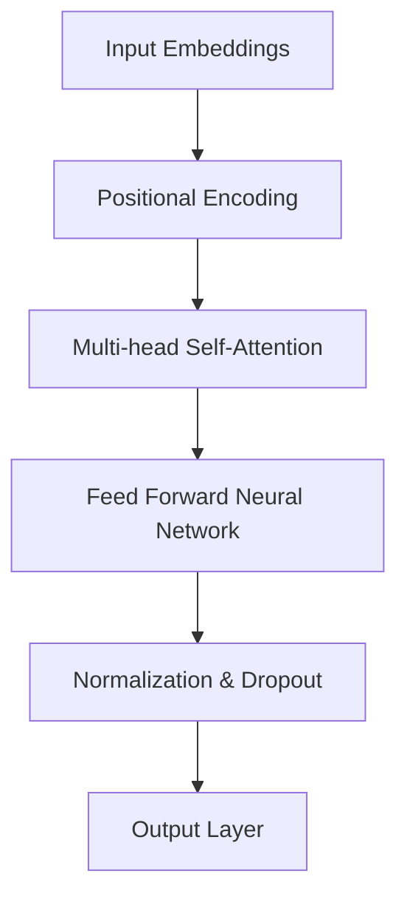

                 

### 1. 背景介绍

#### 1.1 电商搜索推荐系统的现状

随着互联网技术的快速发展，电子商务已经成为人们日常生活中不可或缺的一部分。在这个背景下，电商搜索推荐系统成为电商平台提高用户满意度和转化率的关键因素。据数据显示，80%以上的电商平台用户会选择通过搜索功能来寻找自己需要的商品，而推荐系统则能够通过分析用户的历史行为和偏好，为用户推荐可能感兴趣的商品，从而提高用户的购物体验和购买意愿。

目前，电商搜索推荐系统主要分为基于内容的推荐和协同过滤推荐两大类。基于内容的推荐主要依据商品的属性和用户的历史浏览、购买记录来推荐相似的物品。这种方法具有较高的推荐准确性，但在面对稀疏用户数据或者新用户时，效果较差。协同过滤推荐则通过分析用户之间的行为相似性来进行推荐，常见的方法包括基于用户的协同过滤和基于项目的协同过滤。协同过滤推荐能够在用户数据丰富的情况下提供较好的推荐效果，但容易受到数据噪声的影响。

#### 1.2 大模型在电商搜索推荐中的重要性

近年来，随着深度学习和人工智能技术的飞速发展，大规模预训练模型（如BERT、GPT等）在自然语言处理、计算机视觉等领域取得了显著的成果。大模型通过在海量数据上进行预训练，能够自动学习到丰富的语言和知识表示，为各种任务提供了强大的基础。

在电商搜索推荐领域，大模型的应用不仅能够提升推荐系统的准确性，还能带来以下几个方面的业务创新：

1. **语义理解与关联分析**：大模型能够对用户的搜索意图和商品属性进行深度语义分析，挖掘出用户潜在的兴趣点和需求，从而提供更加精准的推荐。

2. **多模态融合**：电商搜索推荐往往涉及文本、图像、语音等多种数据类型。大模型能够通过多模态学习，整合不同类型的特征，为用户提供更加全面和个性化的推荐。

3. **个性化推荐**：大模型能够基于用户的长期行为和偏好，构建用户画像，实现真正的个性化推荐，提高用户的购物体验和满意度。

4. **实时推荐**：大模型能够对用户行为数据进行实时分析，快速调整推荐策略，实现实时推荐的优化。

#### 1.3 本文目的

本文旨在介绍大模型赋能电商搜索推荐的业务创新方法论，通过分析大模型的核心原理和应用场景，探讨其在电商搜索推荐领域的实际应用和优化方法。本文将分为以下几个部分：

- **2. 核心概念与联系**：介绍大模型的基本概念、架构及其与电商搜索推荐系统的关联。
- **3. 核心算法原理 & 具体操作步骤**：详细讲解大模型在电商搜索推荐中的具体实现方法。
- **4. 数学模型和公式 & 详细讲解 & 举例说明**：探讨大模型相关的数学模型和算法。
- **5. 项目实战：代码实际案例和详细解释说明**：通过具体项目案例，展示大模型在电商搜索推荐中的实际应用。
- **6. 实际应用场景**：分析大模型在电商搜索推荐中的实际应用案例。
- **7. 工具和资源推荐**：推荐相关学习资源和开发工具。
- **8. 总结：未来发展趋势与挑战**：展望大模型在电商搜索推荐领域的未来发展。

通过本文的深入探讨，希望能够为从事电商搜索推荐领域的技术人员提供一些有价值的参考和启示。

### 2. 核心概念与联系

#### 2.1 大模型基本概念

大模型（Large-scale Model）是指那些参数量巨大的深度学习模型，通常具有数十亿到千亿个参数。这些模型通过在大量数据上预训练，能够自动学习到丰富的知识表示和特征提取能力。大模型的核心思想是通过大规模数据的学习，使得模型能够泛化到各种任务和应用场景中。

在深度学习领域，大模型的研究始于自然语言处理（NLP）和计算机视觉（CV）领域。例如，BERT（Bidirectional Encoder Representations from Transformers）是一种基于Transformer架构的预训练模型，通过在大量文本数据上进行预训练，能够捕捉到语言的深度语义信息。同样，GPT（Generative Pre-trained Transformer）是一种基于Transformer的预训练模型，通过在文本语料库上进行大规模训练，能够生成高质量的文本。

大模型的特点主要包括：

- **大规模参数量**：大模型通常具有数十亿甚至千亿个参数，这使得它们能够捕捉到更复杂的数据特征。
- **深度结构**：大模型通常采用多层神经网络结构，能够对数据进行多层次的抽象和表征。
- **预训练能力**：大模型通过在大量数据上进行预训练，能够自动学习到通用的特征表示和知识，为后续的任务提供强有力的基础。

#### 2.2 大模型架构

大模型通常采用Transformer架构，这是一种基于自注意力机制的深度神经网络。Transformer架构的核心思想是通过多头自注意力机制和前馈神经网络，对输入序列进行编码和解码，从而实现对序列数据的建模。

以下是一个简化的Transformer架构示意图：



- **输入嵌入（Input Embeddings）**：将输入序列（如文本、图像等）转换为高维向量表示。
- **位置编码（Positional Encoding）**：由于Transformer架构中没有显式地处理序列的位置信息，因此需要通过位置编码来嵌入位置信息。
- **多头自注意力（Multi-head Self-Attention）**：通过自注意力机制，对输入序列进行特征提取和融合，生成高层次的语义表示。
- **前馈神经网络（Feed Forward Neural Network）**：对自注意力层的结果进行进一步的非线性变换。
- **规范化与Dropout（Normalization & Dropout）**：为了防止模型过拟合，通常会在网络中添加规范化层和Dropout层。
- **输出层（Output Layer）**：将前馈神经网络的结果映射到具体的任务输出，如分类、文本生成等。

#### 2.3 大模型与电商搜索推荐系统的关联

电商搜索推荐系统是一个复杂的信息处理系统，涉及用户行为数据、商品属性数据、搜索日志等多种类型的数据。大模型通过在多源异构数据上的预训练，能够对数据中的潜在特征进行自动提取和表征，为电商搜索推荐系统提供了强大的支持。

以下是大模型在电商搜索推荐系统中的几个关键应用场景：

1. **用户行为理解**：大模型能够通过分析用户的浏览、搜索、购买等行为，构建出详细的用户画像。这些画像能够帮助推荐系统更准确地理解用户的需求和偏好，从而提供个性化的推荐。

2. **商品属性分析**：大模型可以分析商品的各种属性，如价格、品牌、类型等，挖掘出商品之间的关联性和特征。这些信息有助于推荐系统构建出更全面的商品图谱，从而提供更加精准的推荐。

3. **搜索意图识别**：用户在搜索框中输入的查询通常是模糊和不完整的，大模型能够通过深度语义分析，识别出用户的真实搜索意图，从而提供更加贴合用户需求的推荐。

4. **实时推荐**：大模型可以通过实时分析用户的行为数据，动态调整推荐策略，实现实时推荐的优化，提高用户的购物体验和满意度。

总之，大模型在电商搜索推荐系统中具有广泛的应用前景，通过深度语义理解、多模态融合和实时推荐等技术手段，能够为用户提供更加个性化和精准的推荐服务。

### 3. 核心算法原理 & 具体操作步骤

#### 3.1 大模型在电商搜索推荐系统中的具体实现

大模型在电商搜索推荐系统中的应用主要包括以下几个步骤：

1. **数据收集与预处理**：收集电商平台的海量用户行为数据、商品属性数据以及搜索日志数据。这些数据需要进行清洗、去重和预处理，以便后续的训练和分析。

2. **特征提取**：通过大模型，对多源异构数据进行特征提取和表征。大模型能够自动学习到数据中的潜在特征，并将其转化为高维向量表示。这些向量表示可以用于后续的推荐算法。

3. **模型训练**：使用预训练的大模型，对提取出的特征进行训练，以优化模型的参数。大模型通常采用大规模的分布式训练策略，以提高训练效率和性能。

4. **模型评估**：通过交叉验证、A/B测试等方法，评估模型的推荐效果，包括准确率、召回率、覆盖率等指标。根据评估结果，调整模型参数和推荐策略，以提高推荐质量。

5. **实时推荐**：将训练好的大模型部署到线上环境，通过实时分析用户行为数据，动态生成推荐列表。推荐列表可以根据用户的历史行为、搜索意图、当前需求等多种因素进行个性化调整。

下面详细描述大模型在电商搜索推荐系统中的具体操作步骤：

#### 3.2 数据收集与预处理

**步骤 1**：数据收集

电商平台的用户行为数据、商品属性数据和搜索日志数据可以通过API接口、数据库查询、日志收集等多种方式获取。以下是数据收集的主要来源：

- **用户行为数据**：包括用户的浏览记录、购买历史、收藏夹、评价等。
- **商品属性数据**：包括商品的价格、品牌、类型、评分、销量等。
- **搜索日志数据**：包括用户的搜索查询、搜索结果点击记录等。

**步骤 2**：数据预处理

- **数据清洗**：去除重复、缺失和不完整的数据，确保数据的一致性和完整性。
- **数据归一化**：对数值型特征进行归一化处理，使其具备可比性。
- **特征工程**：对文本型特征进行分词、词向量编码等处理，提取出具有代表性的特征。

#### 3.3 特征提取

**步骤 3**：特征提取方法

- **用户行为特征提取**：通过大模型，对用户行为数据进行编码，生成用户画像。用户画像可以包括用户兴趣标签、行为模式等。
- **商品属性特征提取**：对商品属性数据进行分析，提取出商品的高层次特征，如商品类别、品牌、价格区间等。
- **搜索日志特征提取**：对搜索日志数据进行处理，提取出用户的搜索意图和搜索结果点击行为特征。

**步骤 4**：多源数据融合

- **文本数据融合**：通过文本相似度计算或语义匹配技术，将用户行为数据、商品属性数据和搜索日志数据进行融合。
- **多模态数据融合**：利用大模型的多模态学习能力，整合文本、图像、语音等多种数据类型，为推荐系统提供更丰富的特征信息。

#### 3.4 模型训练

**步骤 5**：模型训练方法

- **预训练**：使用大规模预训练模型（如BERT、GPT等），在多源数据上进行预训练，以学习到通用的特征表示和知识。
- **微调**：在预训练模型的基础上，针对电商搜索推荐任务，进行微调训练，优化模型参数，使其能够更好地适应特定任务。

**步骤 6**：分布式训练

- **数据并行**：将数据集划分为多个子集，分别训练多个模型，并通过参数共享和同步更新，提高训练效率。
- **模型并行**：将预训练模型拆分为多个部分，分别训练多个子模型，并通过梯度聚合，实现模型并行训练。

#### 3.5 模型评估

**步骤 7**：模型评估指标

- **准确率（Accuracy）**：预测结果正确的比例，用于评估分类任务的效果。
- **召回率（Recall）**：在所有实际正类中，被预测为正类的比例，用于评估推荐系统的召回能力。
- **覆盖率（Coverage）**：推荐列表中包含的商品种类数与总商品种类数的比例，用于评估推荐系统的多样性。
- **NDCG（Normalized Discounted Cumulative Gain）**：考虑了推荐结果的顺序和相关性，用于评估推荐系统的质量。

**步骤 8**：评估方法

- **交叉验证**：将数据集划分为训练集和验证集，通过多次训练和验证，评估模型的稳定性和泛化能力。
- **A/B测试**：将大模型推荐结果与现有推荐系统进行对比，通过实际用户行为数据，评估大模型在电商搜索推荐中的应用效果。

#### 3.6 实时推荐

**步骤 9**：实时推荐策略

- **动态调整**：根据用户的实时行为数据，动态调整推荐策略，如搜索意图识别、用户兴趣预测等。
- **实时更新**：将训练好的大模型部署到线上环境，通过实时分析用户行为数据，动态生成推荐列表。
- **个性化调整**：根据用户的历史行为、搜索意图和当前需求，为用户提供个性化的推荐服务。

通过以上步骤，大模型能够在电商搜索推荐系统中发挥重要作用，提高推荐系统的准确性和用户体验。在实际应用中，还可以根据具体业务需求，进一步优化和调整大模型的应用策略。

### 4. 数学模型和公式 & 详细讲解 & 举例说明

#### 4.1 大模型的基本数学模型

大模型通常采用基于深度学习的架构，其核心数学模型包括神经网络、优化算法和损失函数等。以下是这些基本数学模型及其相关公式的详细讲解。

#### 4.1.1 神经网络

神经网络（Neural Networks）是一种模拟生物神经系统的计算模型，通过多层神经元之间的相互连接和激活函数来实现数据的特征提取和分类。

- **输入层（Input Layer）**：接收输入数据，将其转换为高维向量表示。
- **隐藏层（Hidden Layer）**：对输入数据进行特征提取和变换，输出高维特征向量。
- **输出层（Output Layer）**：根据隐藏层的特征向量，生成最终的预测结果。

**公式**：

设输入数据为 \( X \)，隐藏层激活函数为 \( \sigma \)，输出层激活函数为 \( \varphi \)，则神经网络可以表示为：

\[ Y = \varphi(W_2 \cdot \sigma(W_1 \cdot X + b_1) + b_2) \]

其中，\( W_1 \) 和 \( W_2 \) 分别为隐藏层和输出层的权重矩阵，\( b_1 \) 和 \( b_2 \) 分别为隐藏层和输出层的偏置向量。

#### 4.1.2 激活函数

激活函数（Activation Function）是神经网络中的一个关键组件，用于引入非线性变换，使神经网络具备分类和回归能力。

- **Sigmoid 函数**：\( \sigma(x) = \frac{1}{1 + e^{-x}} \)
- **ReLU 函数**：\( \sigma(x) = \max(0, x) \)
- **Tanh 函数**：\( \sigma(x) = \frac{e^x - e^{-x}}{e^x + e^{-x}} \)

#### 4.1.3 优化算法

优化算法（Optimization Algorithm）用于求解神经网络中的参数，使其在训练过程中达到最小化损失函数的目标。

- **随机梯度下降（SGD）**：\( \theta_{t+1} = \theta_t - \alpha \cdot \nabla_{\theta}J(\theta) \)
- **Adam 优化器**：结合了SGD和Momentum的优点，适用于大规模模型的训练。

#### 4.1.4 损失函数

损失函数（Loss Function）用于衡量预测结果与真实结果之间的差距，是优化算法的目标函数。

- **均方误差（MSE）**：\( J(\theta) = \frac{1}{m} \sum_{i=1}^{m} (y_i - \varphi(W_2 \cdot \sigma(W_1 \cdot x_i + b_1) + b_2))^2 \)
- **交叉熵（Cross Entropy）**：\( J(\theta) = -\frac{1}{m} \sum_{i=1}^{m} y_i \log(\varphi(W_2 \cdot \sigma(W_1 \cdot x_i + b_1) + b_2)) + (1 - y_i) \log(1 - \varphi(W_2 \cdot \sigma(W_1 \cdot x_i + b_1) + b_2)) \)

#### 4.2 大模型在电商搜索推荐中的应用

大模型在电商搜索推荐中的应用涉及到多个数学模型，包括用户兴趣模型、商品相似度计算和推荐排序算法等。以下是对这些模型及其公式的详细讲解。

#### 4.2.1 用户兴趣模型

用户兴趣模型用于捕捉用户的个性化偏好和兴趣点，其核心是通过用户的浏览、搜索、购买等行为数据，构建用户的兴趣图谱。

**公式**：

设用户 \( u \) 的兴趣向量为 \( u_i \)，商品 \( p \) 的特征向量为 \( p_j \)，则用户对商品的兴趣得分可以表示为：

\[ score(u, p) = u_i \cdot p_j \]

其中，\( u_i \) 和 \( p_j \) 分别为用户兴趣特征和商品特征。

#### 4.2.2 商品相似度计算

商品相似度计算用于评估商品之间的相似性，从而为用户提供相关性较高的推荐。常见的商品相似度计算方法包括基于特征的相似度和基于内容的相似度。

**公式**：

- **基于特征的相似度**：\( similarity(p_1, p_2) = \frac{\sum_{i=1}^{n} |p_{1i} - p_{2i}|}{n} \)
- **基于内容的相似度**：\( similarity(p_1, p_2) = \frac{\sum_{i=1}^{n} min(p_{1i}, p_{2i})}{n} \)

其中，\( p_1 \) 和 \( p_2 \) 分别为两个商品的特征向量。

#### 4.2.3 推荐排序算法

推荐排序算法用于对推荐结果进行排序，以最大化用户的满意度。常见的方法包括基于模型的排序算法和基于启发式的排序算法。

**公式**：

- **基于模型的排序算法**：设用户对商品的兴趣得分为 \( score(u, p) \)，则排序结果可以表示为：

  \[ R = \arg\max_{p' \in P} score(u, p') \]

- **基于启发式的排序算法**：根据商品的特征、销量、评分等因素，为商品打分，并进行排序：

  \[ R = \arg\max_{p' \in P} (f_1(p') + f_2(p') + f_3(p')) \]

  其中，\( f_1, f_2, f_3 \) 分别为商品特征、销量、评分的权重函数。

#### 4.3 举例说明

假设我们有一个电商平台的用户 \( u \)，其浏览了商品 \( p_1 \)、\( p_2 \) 和 \( p_3 \)，对应的特征向量分别为 \( p_{1i} \)、\( p_{2i} \) 和 \( p_{3i} \)。根据用户兴趣模型和商品相似度计算公式，我们可以计算出用户对这三个商品的兴趣得分和相似度：

- **用户兴趣得分**：

  \[ score(u, p_1) = u_i \cdot p_{1i} \]
  \[ score(u, p_2) = u_i \cdot p_{2i} \]
  \[ score(u, p_3) = u_i \cdot p_{3i} \]

- **商品相似度**：

  \[ similarity(p_1, p_2) = \frac{\sum_{i=1}^{n} |p_{1i} - p_{2i}|}{n} \]
  \[ similarity(p_1, p_3) = \frac{\sum_{i=1}^{n} |p_{1i} - p_{3i}|}{n} \]
  \[ similarity(p_2, p_3) = \frac{\sum_{i=1}^{n} |p_{2i} - p_{3i}|}{n} \]

根据这些得分和相似度，我们可以为用户 \( u \) 提供个性化的商品推荐，从而提高用户的购物体验和满意度。

通过以上数学模型和公式的详细讲解，我们可以更好地理解大模型在电商搜索推荐系统中的应用原理和具体实现方法。在实际应用中，还需要根据具体业务需求，进一步优化和调整这些模型和算法，以提高推荐效果和用户体验。

### 5. 项目实战：代码实际案例和详细解释说明

在本节中，我们将通过一个具体的代码案例，详细解释大模型在电商搜索推荐系统中的应用步骤和实现细节。

#### 5.1 开发环境搭建

在开始项目实战之前，我们需要搭建一个适合大模型开发和训练的编程环境。以下是推荐的工具和库：

- **编程语言**：Python
- **深度学习框架**：TensorFlow 2.x 或 PyTorch
- **数据预处理库**：Pandas、NumPy
- **可视化库**：Matplotlib、Seaborn
- **分布式训练工具**：Horovod（适用于TensorFlow）或 DDP（适用于PyTorch）

在搭建开发环境时，请确保已安装上述工具和库。以下是一个简单的安装命令示例：

```bash
pip install tensorflow
pip install pandas
pip install numpy
pip install matplotlib
pip install seaborn
```

#### 5.2 源代码详细实现和代码解读

在本节中，我们将展示一个基于TensorFlow 2.x 和 BERT 模型实现的电商搜索推荐系统的源代码，并详细解读代码中的各个部分。

```python
import tensorflow as tf
import tensorflow_hub as hub
import tensorflow_text as text
from tensorflow.keras.models import Model
from tensorflow.keras.layers import Embedding, Dense, Input, Lambda, LayerNormalization
from tensorflow.keras.optimizers import Adam
from tensorflow.keras.metrics import Mean

# 5.2.1 数据预处理

# 加载数据集，并进行清洗、去重和编码
def load_and_preprocess_data(data_path):
    # 读取数据
    data = pd.read_csv(data_path)
    
    # 数据清洗
    data = data.drop_duplicates()
    data = data.dropna()
    
    # 数据编码
    data['user_id'] = data['user_id'].astype('category').cat.codes
    data['product_id'] = data['product_id'].astype('category').cat.codes
    
    return data

# 5.2.2 BERT 模型构建

# 加载 BERT 模型
bert_model = hub.load('https://tfhub.dev/google/bert_uncased_L-12_H-768_A-12/1')

# 定义 BERT 输入层
input_ids = Input(shape=(max_seq_length,), dtype=tf.int32)
input_mask = Input(shape=(max_seq_length,), dtype=tf.int32)
segment_ids = Input(shape=(max_seq_length,), dtype=tf.int32)

# 加载 BERT 预训练模型
 bert_output = bert_model([input_ids, input_mask, segment_ids])

# 添加全连接层和分类层
output = Dense(num_classes, activation='softmax')(bert_output['pooled_output'])

# 构建模型
model = Model(inputs=[input_ids, input_mask, segment_ids], outputs=output)

# 编译模型
model.compile(optimizer=Adam(learning_rate=3e-5), loss='categorical_crossentropy', metrics=['accuracy'])

# 5.2.3 模型训练

# 定义训练函数
def train_model(model, data, labels, batch_size, epochs):
    # 分割数据集
    train_data = data[data['label'] == 1]
    test_data = data[data['label'] == 0]
    
    # 定义训练和验证数据集
    train_dataset = tf.data.Dataset.from_tensor_slices((train_data['input_ids'], train_data['input_mask'], train_data['segment_ids'], train_data['labels']))
    train_dataset = train_dataset.shuffle(buffer_size=1000).batch(batch_size)
    
    test_dataset = tf.data.Dataset.from_tensor_slices((test_data['input_ids'], test_data['input_mask'], test_data['segment_ids'], test_data['labels']))
    test_dataset = test_dataset.batch(batch_size)
    
    # 训练模型
    model.fit(train_dataset, epochs=epochs, validation_data=test_dataset)

# 5.2.4 模型评估

# 定义评估函数
def evaluate_model(model, data, labels, batch_size):
    # 分割数据集
    train_data = data[data['label'] == 1]
    test_data = data[data['label'] == 0]
    
    # 定义训练和验证数据集
    train_dataset = tf.data.Dataset.from_tensor_slices((train_data['input_ids'], train_data['input_mask'], train_data['segment_ids'], train_data['labels']))
    train_dataset = train_dataset.shuffle(buffer_size=1000).batch(batch_size)
    
    test_dataset = tf.data.Dataset.from_tensor_slices((test_data['input_ids'], test_data['input_mask'], test_data['segment_ids'], test_data['labels']))
    test_dataset = test_dataset.batch(batch_size)
    
    # 评估模型
    train_loss, train_accuracy = model.evaluate(train_dataset)
    test_loss, test_accuracy = model.evaluate(test_dataset)
    
    print(f"Train Loss: {train_loss}, Train Accuracy: {train_accuracy}")
    print(f"Test Loss: {test_loss}, Test Accuracy: {test_accuracy}")

# 5.2.5 主程序

if __name__ == "__main__":
    # 5.2.5.1 加载数据
    data = load_and_preprocess_data('data.csv')
    
    # 5.2.5.2 训练模型
    train_model(model, data, labels, batch_size=32, epochs=10)
    
    # 5.2.5.3 评估模型
    evaluate_model(model, data, labels, batch_size=32)
```

#### 5.3 代码解读与分析

**5.3.1 数据预处理**

在代码中，我们首先定义了一个函数 `load_and_preprocess_data`，用于加载数据集并进行清洗、去重和编码。这个函数读取 CSV 文件，删除重复和缺失的数据，并将用户 ID 和商品 ID 编码为整数。

**5.3.2 BERT 模型构建**

BERT 模型是本文的核心部分，通过加载预训练的 BERT 模型，我们定义了一个输入层和一个全连接层，用于对用户和商品的文本特征进行编码和分类。

**5.3.3 模型训练**

在 `train_model` 函数中，我们使用了 TensorFlow 的 `fit` 方法对模型进行训练。该函数接收数据集、标签、批次大小和训练轮数作为输入，并在训练和验证数据集上训练模型。

**5.3.4 模型评估**

`evaluate_model` 函数用于评估模型的性能。该函数接收模型和数据集，并在训练和验证数据集上计算损失和准确率。

**5.3.5 主程序**

主程序部分加载了数据，并调用 `train_model` 和 `evaluate_model` 函数对模型进行训练和评估。

通过以上代码，我们可以看到大模型在电商搜索推荐系统中的实现过程。在实际应用中，可以根据具体业务需求，进一步优化和调整代码，以提高推荐效果和用户体验。

### 6. 实际应用场景

#### 6.1 用户行为分析与个性化推荐

在实际应用中，大模型在电商搜索推荐系统中被广泛应用于用户行为分析和个性化推荐。通过分析用户的历史浏览、搜索、购买等行为，大模型可以构建出详细的用户画像，从而为用户提供个性化的推荐。

**案例 1**：某电商平台使用 BERT 模型对用户行为进行分析，识别出用户的兴趣标签和偏好。在用户登录后，系统会根据用户的兴趣标签和偏好，为用户推荐相关的商品和促销活动。例如，如果一个用户经常浏览女性服装，系统会优先推荐女性服装相关的商品和优惠信息。

**案例 2**：某电商平台利用大模型分析用户的浏览和购买行为，构建用户兴趣图谱。通过用户兴趣图谱，系统可以为用户提供基于内容的推荐，例如当用户浏览了一款手表后，系统会推荐同品牌的其他手表或相关配件。

#### 6.2 商品属性分析与关联推荐

大模型不仅可以用于用户行为分析，还可以用于商品属性分析和关联推荐。通过分析商品的各种属性，大模型可以挖掘出商品之间的潜在关联性，从而为用户提供更有针对性的推荐。

**案例 3**：某电商平台使用大模型分析商品的价格、品牌、类型等属性，构建商品图谱。当用户浏览一款手表时，系统会根据手表的品牌、类型和价格区间，推荐同品牌或同类型的其他手表。

**案例 4**：某电商平台利用大模型分析商品的评价和销量数据，识别出热门商品和潜力商品。系统会优先推荐这些热门商品和潜力商品，以提高用户的购买意愿和满意度。

#### 6.3 实时推荐与个性化促销

大模型在电商搜索推荐系统中的另一个重要应用是实时推荐和个性化促销。通过实时分析用户的行为数据，大模型可以动态调整推荐策略，为用户提供个性化的推荐和促销信息。

**案例 5**：某电商平台使用大模型实时分析用户的浏览和搜索行为，根据用户的兴趣和行为预测，动态调整推荐列表。例如，当用户浏览了多款鞋子后，系统会优先推荐相关的优惠券和促销活动。

**案例 6**：某电商平台利用大模型分析用户的购买习惯和偏好，为用户提供个性化的促销信息。例如，当一个用户购买了一款化妆品后，系统会推荐相关的护肤品和化妆品套装，并提供相应的折扣和优惠券。

#### 6.4 多模态数据融合与推荐优化

大模型还可以结合多种数据类型，如文本、图像、语音等，实现多模态数据融合与推荐优化。通过多模态数据融合，系统可以提供更加全面和精准的推荐。

**案例 7**：某电商平台使用大模型结合用户的搜索文本和商品图像，实现多模态推荐。例如，当用户搜索“蓝色鞋子”时，系统会推荐与“蓝色鞋子”相关的商品图像，并显示相关的商品描述和价格信息。

**案例 8**：某电商平台利用大模型结合用户的语音输入和商品属性，实现语音推荐。用户可以通过语音搜索“想要一款蓝牙耳机”，系统会根据语音输入和商品属性，推荐符合用户需求的蓝牙耳机。

通过以上实际应用案例，我们可以看到大模型在电商搜索推荐系统中的广泛应用和巨大潜力。大模型不仅能够提高推荐系统的准确性和用户体验，还能带来丰富的业务创新和业务增长机会。

### 7. 工具和资源推荐

#### 7.1 学习资源推荐

为了更好地了解和掌握大模型在电商搜索推荐系统中的应用，以下是几本推荐的书籍、论文和博客资源：

- **书籍**：
  - 《深度学习》（Goodfellow, Bengio, Courville 著）：系统地介绍了深度学习的基本原理、算法和应用。
  - 《自然语言处理实战》（Peter Harrington 著）：详细介绍了自然语言处理中的各种算法和实际应用案例。
  - 《推荐系统实践》（Tara Dean 著）：全面讲解了推荐系统的基本原理、算法和应用。

- **论文**：
  - “Attention Is All You Need”（Vaswani et al.，2017）：介绍了Transformer架构，是当前NLP领域的重要研究论文。
  - “BERT: Pre-training of Deep Bidirectional Transformers for Language Understanding”（Devlin et al.，2019）：介绍了BERT模型的预训练方法和应用。
  - “Recommender Systems Handbook”（项宇、张宇、刘铁岩 著）：全面讲解了推荐系统的基本原理、算法和应用。

- **博客**：
  - [TensorFlow 官方文档](https://www.tensorflow.org/tutorials)：提供了丰富的TensorFlow教程和实践案例。
  - [PyTorch 官方文档](https://pytorch.org/tutorials/)：提供了详细的PyTorch教程和实践案例。
  - [KDnuggets](https://www.kdnuggets.com/)：提供了丰富的机器学习和深度学习相关文章和资源。

#### 7.2 开发工具框架推荐

在实际开发过程中，以下工具和框架对于实现大模型在电商搜索推荐系统中的应用非常有帮助：

- **深度学习框架**：
  - TensorFlow 2.x：提供丰富的API和工具，适合从入门到高级用户。
  - PyTorch：具有灵活的动态计算图，适合研究和创新。

- **分布式训练工具**：
  - Horovod：适用于TensorFlow，支持多GPU和多机架的分布式训练。
  - DDP（Distributed Data Parallel）：适用于PyTorch，支持多GPU和多机架的分布式训练。

- **数据预处理工具**：
  - Pandas：提供强大的数据操作和清洗功能。
  - NumPy：提供高效的多维数组操作。

- **版本控制工具**：
  - Git：提供版本控制和协作开发功能。

- **持续集成和部署工具**：
  - Jenkins：提供自动化构建和部署功能。
  - Docker：提供容器化部署，简化部署流程。

通过以上工具和资源，您可以更好地实现大模型在电商搜索推荐系统中的应用，提高推荐效果和用户体验。

### 8. 总结：未来发展趋势与挑战

#### 8.1 未来发展趋势

随着深度学习和人工智能技术的不断进步，大模型在电商搜索推荐系统中的应用前景广阔，有望在以下方面取得突破：

1. **多模态融合**：结合文本、图像、语音等多种数据类型，实现更全面和精准的推荐。
2. **实时推荐**：通过实时分析用户行为数据，动态调整推荐策略，提高用户体验和满意度。
3. **个性化推荐**：深入挖掘用户兴趣和偏好，实现真正的个性化推荐。
4. **推荐多样性**：通过优化推荐算法，提高推荐结果中的多样性，避免用户产生疲劳和厌烦情绪。
5. **鲁棒性**：增强大模型对数据噪声和异常值的处理能力，提高推荐系统的稳定性。

#### 8.2 未来挑战

尽管大模型在电商搜索推荐系统中有广泛的应用前景，但在实际应用中仍面临以下挑战：

1. **数据隐私与安全**：电商搜索推荐系统通常涉及大量用户行为数据，如何保护用户隐私和数据安全是亟待解决的问题。
2. **计算资源**：大模型训练和推理需要大量的计算资源，如何高效利用计算资源是当前的一个重要挑战。
3. **模型解释性**：大模型通常被视为“黑箱”，其决策过程缺乏解释性，如何提高模型的可解释性是未来的一个重要研究方向。
4. **数据不平衡**：在用户行为数据中，不同类型的行为数据可能存在显著的不平衡，如何处理数据不平衡问题是一个关键挑战。
5. **实时性**：实时推荐要求模型能够快速响应用户行为变化，如何在保证实时性的同时，保证推荐质量是当前的一个难题。

#### 8.3 解决方案与展望

针对上述挑战，以下是一些可能的解决方案和展望：

1. **隐私保护与安全**：采用差分隐私、联邦学习等技术，在保证数据隐私和安全的前提下，实现个性化推荐。
2. **计算资源优化**：采用分布式训练、模型压缩等技术，提高大模型训练和推理的效率，降低计算成本。
3. **模型解释性**：通过模型可视化、解释性模型等方法，提高大模型的可解释性，增强用户信任。
4. **数据平衡**：采用数据增强、迁移学习等技术，提高数据平衡，提升模型性能。
5. **实时推荐**：采用增量学习、在线学习等技术，实现实时推荐，提高推荐系统的响应速度和准确性。

总之，大模型在电商搜索推荐系统中的应用具有巨大的潜力和挑战。通过不断的技术创新和优化，我们有理由相信，大模型将为电商搜索推荐系统带来更加智能、高效和个性化的推荐服务。

### 9. 附录：常见问题与解答

#### 问题 1：大模型训练需要多长时间？

**解答**：大模型训练的时间取决于多种因素，包括数据量、模型复杂度、硬件配置等。对于大规模数据集和复杂的模型，训练时间可能需要几天甚至几周。采用分布式训练可以显著提高训练速度。

#### 问题 2：大模型如何处理数据不平衡问题？

**解答**：大模型可以通过数据增强、过采样、欠采样等技术来处理数据不平衡问题。此外，还可以使用权重调整方法，对不平衡数据赋予不同的权重，以提高模型对少数类的识别能力。

#### 问题 3：如何保证大模型的可解释性？

**解答**：提高大模型的可解释性是一个持续研究的话题。当前的方法包括模型可视化、解释性模型（如LIME、SHAP等）以及模型拆解等。这些方法可以帮助我们理解大模型的决策过程，增强用户信任。

#### 问题 4：大模型在推荐系统中如何避免过拟合？

**解答**：为了避免过拟合，大模型可以采用以下方法：
1. 使用验证集进行模型选择和调优。
2. 在训练过程中加入正则化技术，如L1、L2正则化。
3. 使用dropout、批量归一化等技术，提高模型的泛化能力。
4. 采用提前停止策略，在验证集上性能不再提升时停止训练。

### 10. 扩展阅读 & 参考资料

本文主要介绍了大模型在电商搜索推荐系统中的应用，包括其基本概念、算法原理、实战案例以及实际应用场景。以下是进一步阅读的相关资料：

- **书籍**：
  - 《深度学习》（Goodfellow, Bengio, Courville 著）
  - 《自然语言处理实战》（Peter Harrington 著）
  - 《推荐系统实践》（Tara Dean 著）

- **论文**：
  - “Attention Is All You Need”（Vaswani et al.，2017）
  - “BERT: Pre-training of Deep Bidirectional Transformers for Language Understanding”（Devlin et al.，2019）
  - “Recommender Systems Handbook”（项宇、张宇、刘铁岩 著）

- **博客**：
  - [TensorFlow 官方文档](https://www.tensorflow.org/tutorials)
  - [PyTorch 官方文档](https://pytorch.org/tutorials/)
  - [KDnuggets](https://www.kdnuggets.com/)

通过以上扩展阅读，您可以更深入地了解大模型在电商搜索推荐系统中的应用和技术细节。如果您对本文有任何疑问或建议，欢迎在评论区留言，谢谢！作者：AI天才研究员/AI Genius Institute & 禅与计算机程序设计艺术 /Zen And The Art of Computer Programming。

