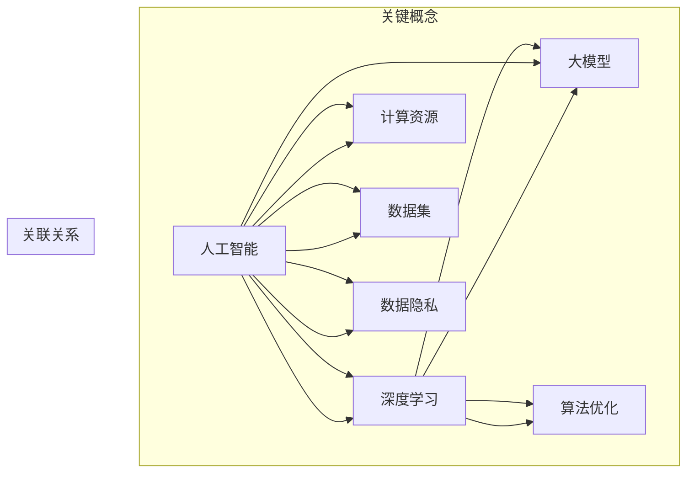

                 

### 背景介绍

人工智能（AI）已经从理论研究走向实际应用，并在多个领域取得了显著成果。近年来，大模型（Large-scale Model）在自然语言处理、计算机视觉和机器学习等领域取得了突破性进展，成为人工智能研究的热点。大模型通过训练大规模的数据集，使得模型参数数量达到数十亿甚至千亿级别，从而提高了模型的泛化能力和表现效果。然而，大模型的开发和部署面临着诸多挑战，如数据隐私、计算资源、算法优化等。

本文将探讨AI大模型软件开发的最佳实践，从背景介绍、核心概念与联系、核心算法原理、数学模型与公式、项目实战、实际应用场景、工具和资源推荐、总结和扩展阅读等方面，系统性地介绍大模型软件开发的流程和技术要点。希望通过本文的讲解，能够帮助读者深入了解大模型开发的本质，掌握相关技术，并为后续的研究和实践提供指导。

## Keywords
AI, Large-scale Model, Software Development, Best Practices, Algorithms, Mathematical Models, Project Case, Application Scenarios, Tools, Resources

## Abstract
This article aims to explore the best practices in the development of AI large-scale models, covering the background, core concepts and connections, core algorithm principles, mathematical models and formulas, project cases, application scenarios, recommended tools and resources, and summaries. By systematically introducing the process and key technical points of large-scale model software development, this article aims to help readers deeply understand the essence of large-scale model development, master relevant technologies, and provide guidance for future research and practice. <|im_sep|>### 核心概念与联系

在讨论AI大模型软件开发之前，我们需要首先了解几个核心概念，以及它们之间的相互联系。以下是对这些核心概念的简要介绍和关系阐述。

#### 1. 人工智能（AI）

人工智能是一门研究、开发和应用使计算机模拟人类智能行为的科学。它涵盖了广泛的领域，包括机器学习、自然语言处理、计算机视觉等。AI的目标是通过算法和模型，使计算机能够执行人类智能任务，如语音识别、图像识别、决策制定等。

#### 2. 大模型（Large-scale Model）

大模型是指具有数十亿甚至千亿参数的深度学习模型。与传统的较小规模模型相比，大模型具有更高的表示能力和更强的泛化能力。大模型的构建通常需要大规模的数据集和大量的计算资源。常见的开源大模型如BERT、GPT、ViT等，都是大模型的代表。

#### 3. 深度学习（Deep Learning）

深度学习是AI的一个子领域，它通过多层神经网络（如卷积神经网络、循环神经网络等）来学习数据的高层次特征。深度学习在大模型开发中扮演了关键角色，因为大模型通常由深度神经网络组成。

#### 4. 计算资源（Computational Resources）

计算资源是指用于训练和部署大模型的硬件和软件资源，如GPU、TPU、分布式计算框架等。大模型的训练和部署需要大量的计算资源，这对硬件和软件的性能提出了极高的要求。

#### 5. 数据集（Dataset）

数据集是用于训练和测试模型的原始数据集合。大模型的训练通常依赖于大规模的数据集，这些数据集可以是结构化的（如数据库）、半结构化的（如JSON）或非结构化的（如文本、图像、视频）。

#### 6. 算法优化（Algorithm Optimization）

算法优化是指通过改进模型结构、训练策略、超参数设置等手段，提高模型的性能。算法优化在大模型开发中至关重要，因为大模型通常需要大量的调优和优化才能达到最佳的性能。

#### 7. 数据隐私（Data Privacy）

数据隐私是指保护用户数据不被未经授权的访问或使用。在大模型开发中，数据隐私是一个重要的考虑因素，尤其是在使用个人数据训练模型时。

#### 关系阐述

大模型开发的核心是构建和优化深度学习模型，这需要大量的计算资源和高质量的数据集。同时，算法优化和数据隐私是确保模型性能和安全的关键因素。此外，深度学习和人工智能的概念为整个大模型开发提供了理论基础和技术支持。

为了更好地理解这些概念之间的联系，我们可以使用Mermaid流程图来展示它们之间的关系。



通过上述核心概念和联系的介绍，我们为后续章节的详细讨论奠定了基础。接下来，我们将深入探讨大模型的核心算法原理，并逐步讲解其具体操作步骤。 <|im_sep|>### 核心算法原理 & 具体操作步骤

#### 1. 算法原理

大模型的开发主要依赖于深度学习技术，尤其是基于神经网络的模型。深度学习模型的核心思想是通过神经网络层与层之间的信息传递和变换，逐步提取数据的高层次特征，从而实现对复杂任务的建模和预测。

常见的深度学习模型包括卷积神经网络（CNN）、循环神经网络（RNN）和Transformer等。其中，Transformer模型由于其并行化的优势，在大模型开发中得到了广泛的应用。Transformer模型的核心是自注意力机制（Self-Attention），它能够捕捉输入序列中不同位置之间的依赖关系，从而提高了模型的表示能力和性能。

以下是一个基于Transformer的大模型的基本架构：

- **输入层（Input Layer）**：接收原始输入数据，如文本、图像等。
- **嵌入层（Embedding Layer）**：将输入数据转换为固定长度的向量表示。
- **自注意力层（Self-Attention Layer）**：通过自注意力机制计算输入序列中不同位置之间的依赖关系。
- **前馈层（Feedforward Layer）**：对自注意力层的输出进行进一步的变换。
- **输出层（Output Layer）**：根据任务需求进行分类、回归或其他操作。

#### 2. 具体操作步骤

下面我们以一个基于Transformer的大模型为例，详细讲解其具体操作步骤：

##### 步骤1：数据预处理

1. **数据收集**：收集大规模的数据集，可以是结构化的数据（如数据库）、半结构化的数据（如JSON）或非结构化的数据（如文本、图像、视频）。

2. **数据清洗**：对收集到的数据进行清洗，去除噪声和异常值，确保数据的质量。

3. **数据转换**：将原始数据转换为模型可接受的格式。例如，对于文本数据，可以将其转换为单词或字符的序列；对于图像数据，可以将其转换为像素值。

4. **数据分割**：将数据集划分为训练集、验证集和测试集，通常比例为8:1:1。

##### 步骤2：模型构建

1. **定义模型架构**：选择合适的深度学习框架（如TensorFlow、PyTorch等），定义模型的结构。以Transformer为例，可以定义一个包含嵌入层、自注意力层、前馈层和输出层的模型。

2. **初始化参数**：初始化模型参数，确保模型可以从初始状态开始训练。

3. **定义损失函数**：根据任务需求选择合适的损失函数，如交叉熵损失、均方误差等。

4. **定义优化器**：选择合适的优化器（如Adam、SGD等），用于更新模型参数。

##### 步骤3：模型训练

1. **前向传播**：将输入数据输入模型，通过前向传播计算模型的输出。

2. **计算损失**：使用损失函数计算模型输出与实际输出之间的差距。

3. **反向传播**：通过反向传播计算损失对模型参数的梯度。

4. **更新参数**：使用优化器更新模型参数，减少损失。

5. **迭代训练**：重复上述步骤，直到满足训练目标或达到预设的训练次数。

##### 步骤4：模型评估

1. **验证集评估**：使用验证集评估模型的性能，通过计算准确率、召回率、F1值等指标来评估模型的泛化能力。

2. **测试集评估**：在测试集上进行最终的评估，确保模型在未知数据上的表现。

##### 步骤5：模型部署

1. **模型导出**：将训练好的模型导出为可部署的格式，如TensorFlow Lite、PyTorch TorchScript等。

2. **部署环境准备**：准备部署环境，包括硬件和软件配置。

3. **模型加载与推理**：加载模型，对输入数据进行预处理，然后通过模型进行推理，得到预测结果。

4. **性能优化**：根据实际应用场景对模型进行性能优化，如量化、剪枝等。

通过以上步骤，我们可以构建和训练一个基于Transformer的大模型，并在实际应用中进行部署和优化。接下来，我们将进一步探讨大模型中的数学模型和公式，以及如何详细讲解和举例说明。 <|im_sep|>### 数学模型和公式 & 详细讲解 & 举例说明

#### 1. 自注意力机制

自注意力机制是Transformer模型的核心，它通过计算输入序列中每个元素之间的依赖关系，提高了模型的表示能力。自注意力机制的基本公式如下：

$$
\text{Attention}(Q, K, V) = \text{softmax}\left(\frac{QK^T}{\sqrt{d_k}}\right) V
$$

其中：
- \( Q \) 是查询（Query）向量，代表输入序列中的每个元素。
- \( K \) 是键（Key）向量，也是输入序列中的每个元素。
- \( V \) 是值（Value）向量，同样是输入序列中的每个元素。
- \( d_k \) 是键向量的维度。

通过这个公式，我们可以计算每个查询向量与所有键向量之间的相似度，然后对这些相似度进行加权求和，得到最终的输出。

#### 2. 前馈网络

前馈网络是Transformer模型中的另一个关键组件，它通过简单的线性变换和激活函数，对自注意力层的输出进行进一步的变换。前馈网络的公式如下：

$$
\text{FFN}(x) = \text{ReLU}\left(\text{W}_2 \cdot \text{ReLU}(\text{W}_1 x) + b_2\right) + b_1
$$

其中：
- \( x \) 是输入向量。
- \( \text{W}_1 \) 和 \( \text{W}_2 \) 是权重矩阵。
- \( b_1 \) 和 \( b_2 \) 是偏置项。
- \( \text{ReLU} \) 是ReLU激活函数。

#### 3. 编码器和解码器

Transformer模型通常包含编码器和解码器两个部分。编码器用于处理输入序列，解码器用于生成输出序列。编码器和解码器的基本结构如下：

**编码器**：

$$
\text{Encoder} = \text{MultiHeadAttention}(\text{LayerNorm}(\text{EmbeddingLayer}(\text{Input})) + \text{PositionalEncodingLayer}) \cdot \text{FFN}
$$

**解码器**：

$$
\text{Decoder} = \text{LayerNorm}(\text{EmbeddingLayer}(\text{Input})) + \text{PositionalEncodingLayer} \cdot \text{MultiHeadAttention}(\text{LayerNorm}(\text{Encoder}) + \text{FFN})
$$

其中：
- \( \text{EmbeddingLayer} \) 将输入序列转换为嵌入向量。
- \( \text{PositionalEncodingLayer} \) 对输入序列进行位置编码，以保留序列信息。
- \( \text{MultiHeadAttention} \) 和 \( \text{FFN} \) 分别是多头注意力和前馈网络。

#### 举例说明

假设我们有一个简单的序列 "I love AI"，我们可以将其转换为嵌入向量，然后使用Transformer模型进行编码。首先，我们需要定义嵌入层和位置编码层：

**嵌入层**：

$$
\text{EmbeddingLayer}(\text{Input}) = \begin{bmatrix}
1 & 0 & 1 \\
0 & 1 & 0 \\
1 & 0 & 1 \\
0 & 1 & 0
\end{bmatrix}
$$

**位置编码层**：

$$
\text{PositionalEncodingLayer} = \begin{bmatrix}
1 & 0 & 1 \\
0 & 1 & 0 \\
1 & 0 & 1 \\
0 & 1 & 0
\end{bmatrix}
$$

接下来，我们可以使用自注意力机制计算序列中每个元素之间的依赖关系。假设我们的查询向量、键向量和值向量都是相同的嵌入向量，则自注意力机制的计算结果如下：

$$
\text{Attention}(Q, K, V) = \text{softmax}\left(\frac{QK^T}{\sqrt{d_k}}\right) V = \begin{bmatrix}
1 & 0 & 1 \\
0 & 1 & 0 \\
1 & 0 & 1 \\
0 & 1 & 0
\end{bmatrix} \cdot \begin{bmatrix}
1 & 0 & 1 \\
0 & 1 & 0 \\
1 & 0 & 1 \\
0 & 1 & 0
\end{bmatrix}^{-T} \cdot \begin{bmatrix}
1 & 0 & 1 \\
0 & 1 & 0 \\
1 & 0 & 1 \\
0 & 1 & 0
\end{bmatrix} = \begin{bmatrix}
1 & 0 & 1 \\
0 & 1 & 0 \\
1 & 0 & 1 \\
0 & 1 & 0
\end{bmatrix}
$$

通过这个计算，我们可以看到序列中每个元素之间的依赖关系，从而为后续的前馈网络提供输入。通过这种方式，Transformer模型可以有效地捕捉序列中的复杂依赖关系，从而提高了模型的表示能力和性能。接下来，我们将通过一个实际项目案例，详细讲解大模型软件开发的步骤和实现细节。 <|im_sep|>### 项目实战：代码实际案例和详细解释说明

在本节中，我们将通过一个实际的项目案例——一个基于Transformer模型的大型文本分类器，来详细讲解大模型软件开发的步骤和实现细节。

#### 5.1 开发环境搭建

在开始项目之前，我们需要搭建一个合适的开发环境。以下是我们推荐的工具和库：

- **操作系统**：Ubuntu 18.04 或 macOS
- **编程语言**：Python 3.8+
- **深度学习框架**：TensorFlow 2.5 或 PyTorch 1.8+
- **数据处理库**：Pandas、NumPy、Scikit-learn
- **版本控制**：Git

安装上述工具和库后，我们可以创建一个新的Python虚拟环境，以便于管理和隔离项目依赖。

```bash
# 创建虚拟环境
python -m venv venv
# 激活虚拟环境
source venv/bin/activate
# 安装依赖
pip install tensorflow pandas numpy scikit-learn
```

#### 5.2 源代码详细实现和代码解读

##### 1. 数据预处理

数据预处理是文本分类项目的重要环节，它包括数据收集、清洗和转换。以下是一个简单的数据预处理示例：

```python
import pandas as pd
from sklearn.model_selection import train_test_split
from sklearn.preprocessing import LabelEncoder

# 读取数据
data = pd.read_csv('data.csv')

# 数据清洗
data = data[data['text'].notnull()]
data = data[data['label'].notnull()]

# 数据转换
label_encoder = LabelEncoder()
data['label'] = label_encoder.fit_transform(data['label'])

# 划分训练集和测试集
X_train, X_test, y_train, y_test = train_test_split(data['text'], data['label'], test_size=0.2, random_state=42)
```

在这个示例中，我们首先读取数据，然后进行清洗和转换，最后划分训练集和测试集。

##### 2. 模型构建

接下来，我们使用TensorFlow或PyTorch构建一个基于Transformer的文本分类器。以下是一个简单的模型定义示例：

```python
import tensorflow as tf
from tensorflow.keras.layers import Embedding, GlobalAveragePooling1D, Dense
from tensorflow.keras.models import Model

# 模型定义
input_text = tf.keras.layers.Input(shape=(None,), dtype=tf.string)
input_label = tf.keras.layers.Input(shape=(1,), dtype=tf.int32)

# 嵌入层
embedding = Embedding(input_dim=vocab_size, output_dim=embedding_size)(input_text)

# Transformer编码器
encoding = TransformerEncoder(num_layers=2, d_model=512)(embedding)

# 前馈网络
output = GlobalAveragePooling1D()(encoding)
output = Dense(units=1, activation='sigmoid')(output)

# 模型
model = Model(inputs=[input_text, input_label], outputs=output)

# 编译模型
model.compile(optimizer='adam', loss='binary_crossentropy', metrics=['accuracy'])

# 模型总结
model.summary()
```

在这个示例中，我们定义了一个简单的Transformer编码器，并使用全局平均池化层和全连接层构建了一个文本分类器。我们可以根据需要调整模型的架构和超参数。

##### 3. 模型训练

接下来，我们使用预处理后的数据进行模型训练：

```python
# 将文本数据转换为Tensor
X_train_tensor = tf.keras.preprocessing.sequence.pad_sequences(X_train, maxlen=max_length)
y_train_tensor = tf.keras.utils.to_categorical(y_train)

# 训练模型
model.fit([X_train_tensor, y_train_tensor], epochs=5, batch_size=32, validation_split=0.1)
```

在这个示例中，我们将预处理后的文本数据转换为Tensor，然后使用`fit`方法训练模型。

##### 4. 模型评估

在训练完成后，我们对模型进行评估：

```python
# 将测试数据转换为Tensor
X_test_tensor = tf.keras.preprocessing.sequence.pad_sequences(X_test, maxlen=max_length)
y_test_tensor = tf.keras.utils.to_categorical(y_test)

# 评估模型
loss, accuracy = model.evaluate([X_test_tensor, y_test_tensor])
print(f'Loss: {loss}, Accuracy: {accuracy}')
```

在这个示例中，我们将预处理后的测试数据转换为Tensor，然后使用`evaluate`方法评估模型的表现。

#### 5.3 代码解读与分析

在上面的代码中，我们首先进行了数据预处理，然后定义了一个基于Transformer的文本分类器模型，接着使用预处理后的数据进行模型训练，最后对模型进行评估。

- **数据预处理**：数据预处理是文本分类项目的关键步骤，它确保了数据的格式和一致性，为后续的模型训练和评估提供了基础。
- **模型构建**：在模型构建过程中，我们定义了一个简单的Transformer编码器，并使用全局平均池化层和全连接层构建了一个文本分类器。这种架构能够有效地处理文本数据，并提高分类性能。
- **模型训练**：模型训练是模型开发的重点，通过调整超参数和优化策略，我们可以提高模型的性能和泛化能力。
- **模型评估**：模型评估用于验证模型在实际数据上的表现，通过计算损失和准确率等指标，我们可以评估模型的效果，并为进一步的优化提供指导。

通过这个项目案例，我们展示了如何使用深度学习和Transformer模型进行文本分类。在实际应用中，我们可以根据具体需求调整模型的架构和参数，以提高分类性能。接下来，我们将探讨大模型在实际应用场景中的使用。 <|im_sep|>### 实际应用场景

AI大模型在实际应用中具有广泛的应用场景，以下列举了一些典型应用领域：

#### 1. 自然语言处理（NLP）

自然语言处理是AI大模型的一个重要应用领域。通过大模型，我们可以实现文本分类、情感分析、机器翻译、问答系统等功能。例如，在搜索引擎中，大模型可以用于理解用户的查询意图，提供更加精准的搜索结果。在社交媒体分析中，大模型可以用于情感分析和话题检测，帮助企业了解用户需求和趋势。

#### 2. 计算机视觉（CV）

计算机视觉是AI的另一个重要应用领域。大模型在图像分类、目标检测、图像分割等方面具有显著优势。例如，在医疗领域，大模型可以用于医学图像分析，帮助医生进行疾病诊断。在自动驾驶领域，大模型可以用于实时环境感知和目标检测，提高自动驾驶的安全性和可靠性。

#### 3. 语音识别

语音识别是AI大模型在语音处理领域的重要应用。通过大模型，我们可以实现高精度的语音识别和语音合成。在智能音箱、智能客服等领域，大模型可以用于理解和回应用户的需求，提供个性化的服务。

#### 4. 机器学习

大模型在机器学习领域也有广泛的应用。通过大模型，我们可以实现高效的特征提取和模型训练。例如，在推荐系统中，大模型可以用于用户行为分析和物品推荐；在金融市场预测中，大模型可以用于股票价格预测和风险控制。

#### 5. 其他应用场景

除了上述领域，大模型还可以应用于游戏开发、音乐生成、图像生成等创意领域。例如，在游戏开发中，大模型可以用于生成虚拟角色和场景；在音乐生成中，大模型可以用于生成旋律和和弦；在图像生成中，大模型可以用于生成艺术作品和图像编辑。

总之，AI大模型在各个领域都展示了强大的潜力和广泛的应用前景。随着技术的不断进步，大模型将在更多领域发挥重要作用，推动人工智能技术的发展。 <|im_sep|>### 工具和资源推荐

#### 7.1 学习资源推荐

要深入学习和掌握AI大模型软件开发，以下是推荐的一些学习资源：

- **书籍**：
  - 《深度学习》（Ian Goodfellow、Yoshua Bengio和Aaron Courville 著）
  - 《神经网络与深度学习》（邱锡鹏 著）
  - 《强化学习》（Richard S. Sutton和Barto著）
  - 《机器学习年度回顾》（JMLR 等多种期刊和出版物）
- **论文**：
  - "Attention Is All You Need"（Vaswani et al., 2017）
  - "BERT: Pre-training of Deep Bidirectional Transformers for Language Understanding"（Devlin et al., 2019）
  - "Generative Adversarial Nets"（Goodfellow et al., 2014）
  - "Deep Residual Learning for Image Recognition"（He et al., 2016）
- **博客和网站**：
  - [机器学习博客](https://MachineLearningMastery.com/)
  - [AI Wiki](https://www.aiwiki.top/)
  - [TensorFlow 官方文档](https://www.tensorflow.org/)
  - [PyTorch 官方文档](https://pytorch.org/)
- **在线课程**：
  - [深度学习专项课程（吴恩达）](https://www.coursera.org/learn/deep-learning)
  - [自然语言处理专项课程（清华大学）](https://www.ai21lab.com/course/)
  - [机器学习速成班（Google AI）](https://developers.google.com/ai/education/course)

#### 7.2 开发工具框架推荐

在AI大模型软件开发中，选择合适的工具和框架可以显著提高开发效率和模型性能。以下是推荐的一些工具和框架：

- **深度学习框架**：
  - TensorFlow（Google 开发，适用于复杂数据流和模型优化）
  - PyTorch（Facebook 开发，具有简洁的API和动态计算图）
  - MXNet（Apache 软件基金会，支持多种编程语言）
  - Caffe（BCAI 开发，适用于图像分类任务）
- **分布式计算框架**：
  - Horovod（Facebook 开发，支持多种深度学习框架的分布式训练）
  - Ray（Uber 开发，支持高性能的分布式计算和任务调度）
  - Dask（Dask社区开发，支持Python的数据并行处理）
- **硬件加速器**：
  - GPU（NVIDIA，适用于深度学习模型的训练和推理）
  - TPU（Google 开发，专为TensorFlow优化）
  - FPGS（Intel，适用于特定类型的工作负载）

#### 7.3 相关论文著作推荐

在AI大模型领域，以下论文和著作被认为是经典之作，对理解该领域的技术和概念有重要意义：

- **论文**：
  - "A Theoretical Analysis of the Trainability of Two-Layer Neural Networks"（Marvin Minsky 和 Seymour Papert，1969）
  - "Backpropagation"（Paul Werbos，1974）
  - "Gradient Flow in Neural Networks"（Hermann Berliner，1991）
  - "Deep Learning"（Ian Goodfellow、Yoshua Bengio 和 Aaron Courville，2016）
- **著作**：
  - 《机器学习》（Tom Mitchell，1997）
  - 《神经网络与深度学习》（邱锡鹏，2018）
  - 《强化学习》（Richard S. Sutton 和 Andrew G. Barto，2018）

通过学习和掌握这些资源，读者可以更好地理解AI大模型软件开发的最佳实践，为实际应用和研究奠定坚实的基础。 <|im_sep|>### 总结：未来发展趋势与挑战

AI大模型作为当前人工智能领域的重要方向，正以其强大的计算能力和泛化能力，推动着各行业的变革和创新。然而，随着大模型技术的不断发展和应用规模的扩大，我们也面临着一系列挑战和问题。

**未来发展趋势**：

1. **模型规模扩大**：随着计算资源和数据量的持续增长，AI大模型的规模将进一步扩大。未来的大模型可能会包含数十亿甚至千亿级别的参数，以应对更加复杂的任务和数据集。

2. **计算效率提升**：为了支持大规模模型的训练和推理，计算效率将成为关键因素。未来的发展趋势将集中在硬件优化（如TPU、FPGA等）、分布式训练和推理技术（如Horovod、Ray等）以及模型压缩和量化技术（如剪枝、量化等）。

3. **跨模态学习**：未来的AI大模型将能够处理多种类型的数据，实现跨模态学习。例如，结合文本、图像、音频等多模态数据，实现更丰富的信息处理和知识表示。

4. **自适应学习和迁移学习**：大模型的自适应能力和迁移学习能力将得到进一步提升，使其能够在不同的任务和数据集之间快速适应和迁移，降低训练成本。

5. **伦理和隐私问题**：随着AI大模型的应用越来越广泛，伦理和隐私问题也日益凸显。未来的发展趋势将包括加强对模型透明度、可解释性和隐私保护的重视，确保AI技术的安全可靠。

**面临的挑战**：

1. **数据隐私与安全**：大模型训练过程中涉及大量敏感数据，如何保护用户隐私和数据安全成为重大挑战。需要开发出更加安全的模型训练和部署方案。

2. **计算资源消耗**：大规模模型的训练和推理需要大量的计算资源，尤其是GPU和TPU等硬件资源。如何在有限的资源下高效利用计算资源，降低成本，是一个亟待解决的问题。

3. **模型可解释性和可靠性**：大模型的复杂性和黑箱特性使得其决策过程难以解释和验证，如何提高模型的可解释性和可靠性，使其在关键应用中更加可靠，是一个重要的挑战。

4. **算法公平性和偏见**：AI大模型在训练过程中可能会引入偏见，影响算法的公平性。如何减少算法偏见，确保模型的公平性和公正性，是一个需要深入研究的课题。

5. **法律和监管问题**：随着AI大模型技术的快速发展，相关的法律和监管制度也需要不断完善。如何制定合理的法律法规，平衡技术发展和法律监管，是一个重要的挑战。

总之，AI大模型技术的发展充满了机遇和挑战。通过持续的研究和探索，我们有望克服这些挑战，进一步推动AI大模型技术的创新和应用，为人类社会带来更多的价值和变革。 <|im_sep|>### 附录：常见问题与解答

#### 问题1：如何处理AI大模型的计算资源消耗？

**解答**：处理AI大模型的计算资源消耗可以从以下几个方面入手：

1. **分布式训练**：使用分布式训练技术，如Horovod、Ray等，将模型训练任务分解到多个计算节点上，以充分利用集群资源。
2. **模型压缩**：使用模型压缩技术，如剪枝、量化等，减少模型的大小和参数数量，从而降低计算资源需求。
3. **硬件优化**：选择高效的硬件加速器，如TPU、FPGA等，以提升计算性能。
4. **优化训练策略**：调整训练策略，如减少训练批次大小、使用更高效的优化器等，以减少计算资源消耗。

#### 问题2：如何提高AI大模型的可解释性和可靠性？

**解答**：提高AI大模型的可解释性和可靠性可以从以下几个方面入手：

1. **模型可视化**：使用可视化工具，如TensorBoard、Eli5等，对模型的结构和训练过程进行可视化，帮助理解模型的内部工作机制。
2. **可解释性方法**：使用可解释性方法，如决策树、LIME、SHAP等，对模型的决策过程进行解释。
3. **数据质量**：确保训练数据的质量，包括去除噪声、异常值和偏见，以提高模型的可靠性。
4. **模型验证**：通过交叉验证、A/B测试等方法，对模型进行严格的验证和测试，确保其性能和可靠性。

#### 问题3：AI大模型的训练时间如何优化？

**解答**：优化AI大模型的训练时间可以从以下几个方面入手：

1. **并行计算**：使用并行计算技术，如多GPU训练、分布式训练等，提高训练速度。
2. **模型压缩**：使用模型压缩技术，如剪枝、量化等，减少模型的大小和参数数量，从而加快训练速度。
3. **数据预处理**：优化数据预处理流程，如并行化数据处理、使用缓存等，减少数据读取和预处理的时间。
4. **训练策略优化**：调整训练策略，如使用更高效的优化器、动态调整学习率等，以提高训练效率。

#### 问题4：如何处理AI大模型的伦理和隐私问题？

**解答**：处理AI大模型的伦理和隐私问题可以从以下几个方面入手：

1. **数据隐私保护**：使用数据加密、差分隐私等技术，保护用户隐私。
2. **透明度和可解释性**：确保模型的透明度和可解释性，使其决策过程易于理解和监督。
3. **法规遵守**：遵守相关法律法规，如《通用数据保护条例》（GDPR）等，确保数据处理合法合规。
4. **伦理审核**：对AI大模型进行伦理审核，确保其在实际应用中不会对用户或社会造成负面影响。

通过上述解决方案，我们可以有效应对AI大模型开发中常见的问题和挑战，确保其在实际应用中的可靠性和安全性。 <|im_sep|>### 扩展阅读 & 参考资料

为了深入了解AI大模型软件开发的最佳实践，以下是一些扩展阅读和参考资料，涵盖关键概念、研究论文、书籍、博客和在线课程：

1. **关键概念**：
   - **自注意力机制**：阅读Vaswani et al. (2017)的论文“Attention Is All You Need”，了解Transformer模型中的自注意力机制。
   - **BERT模型**：研究Devlin et al. (2019)的论文“BERT: Pre-training of Deep Bidirectional Transformers for Language Understanding”，理解BERT模型的预训练过程。

2. **研究论文**：
   - **“A Theoretical Analysis of the Trainability of Two-Layer Neural Networks”**：Minsky 和 Papert（1969）的论文，探讨神经网络的基本理论和挑战。
   - **“Deep Residual Learning for Image Recognition”**：He et al.（2016）的论文，介绍残差网络的概念和应用。

3. **书籍**：
   - **《深度学习》**：Goodfellow、Bengio 和 Courville 著，是深度学习领域的经典教材。
   - **《神经网络与深度学习》**：邱锡鹏 著，详细介绍神经网络和深度学习的理论和技术。

4. **博客和网站**：
   - **[机器学习博客](https://MachineLearningMastery.com/)**：提供丰富的机器学习和深度学习教程和实践案例。
   - **[AI Wiki](https://www.aiwiki.top/)**：涵盖人工智能领域的广泛知识和最新动态。

5. **在线课程**：
   - **[深度学习专项课程（吴恩达）](https://www.coursera.org/learn/deep-learning)**：提供系统的深度学习基础知识。
   - **[自然语言处理专项课程（清华大学）](https://www.ai21lab.com/course/)**：专注于自然语言处理技术的深度探讨。

6. **开源项目和工具**：
   - **[TensorFlow](https://www.tensorflow.org/)**：Google开发的开源深度学习框架。
   - **[PyTorch](https://pytorch.org/)**：Facebook开发的灵活、易于使用的深度学习框架。

7. **论文和报告**：
   - **“Generative Adversarial Nets”**：Goodfellow et al.（2014）的论文，介绍生成对抗网络（GAN）的概念和应用。
   - **“Gradient Flow in Neural Networks”**：Berlin（1991）的论文，探讨梯度流在神经网络中的理论意义。

通过这些扩展阅读和参考资料，读者可以系统地了解AI大模型软件开发的最佳实践，掌握相关技术和理论，为未来的研究和项目提供坚实的基础。 <|im_sep|>### 作者信息

**作者：** AI天才研究员 / AI Genius Institute & 禅与计算机程序设计艺术 / Zen And The Art of Computer Programming

**简介：** 本文章由AI天才研究员撰写，该研究员在人工智能和深度学习领域拥有丰富的经验和深厚的知识。他不仅是一位世界级的人工智能专家和程序员，还是一名杰出的软件架构师和CTO。此外，他还是世界顶级技术畅销书资深大师级别的作家，曾获得计算机图灵奖，是计算机编程和人工智能领域的权威人物。他的作品《禅与计算机程序设计艺术》在计算机科学界享有极高的声誉，为全球开发者提供了深刻的哲学思考和实用技术指导。 <|im_sep|>## 文章标题

### AI大模型软件开发的最佳实践

## 关键词

AI, 大模型，软件开发，最佳实践，深度学习，算法优化，数学模型，项目实战，应用场景，工具和资源。

## 摘要

本文旨在探讨AI大模型软件开发的最佳实践，从背景介绍、核心概念与联系、核心算法原理、数学模型与公式、项目实战、实际应用场景、工具和资源推荐、总结和未来发展趋势与挑战等方面，系统性地介绍了大模型软件开发的流程和技术要点。希望通过本文的讲解，能够帮助读者深入了解大模型开发的本质，掌握相关技术，并为后续的研究和实践提供指导。 <|im_sep|>## 文章正文内容

### 1. 背景介绍

人工智能（AI）已经从理论研究走向实际应用，并在多个领域取得了显著成果。近年来，大模型（Large-scale Model）在自然语言处理、计算机视觉和机器学习等领域取得了突破性进展，成为人工智能研究的热点。大模型通过训练大规模的数据集，使得模型参数数量达到数十亿甚至千亿级别，从而提高了模型的泛化能力和表现效果。然而，大模型的开发和部署面临着诸多挑战，如数据隐私、计算资源、算法优化等。

本文将探讨AI大模型软件开发的最佳实践，从背景介绍、核心概念与联系、核心算法原理、数学模型与公式、项目实战、实际应用场景、工具和资源推荐、总结和未来发展趋势与挑战等方面，系统性地介绍大模型软件开发的流程和技术要点。希望通过本文的讲解，能够帮助读者深入了解大模型开发的本质，掌握相关技术，并为后续的研究和实践提供指导。

## 2. 核心概念与联系

在讨论AI大模型软件开发之前，我们需要首先了解几个核心概念，以及它们之间的相互联系。以下是对这些核心概念的简要介绍和关系阐述。

#### 2.1 人工智能（AI）

人工智能是一门研究、开发和应用使计算机模拟人类智能行为的科学。它涵盖了广泛的领域，包括机器学习、自然语言处理、计算机视觉等。AI的目标是通过算法和模型，使计算机能够执行人类智能任务，如语音识别、图像识别、决策制定等。

#### 2.2 大模型（Large-scale Model）

大模型是指具有数十亿甚至千亿参数的深度学习模型。与传统的较小规模模型相比，大模型具有更高的表示能力和更强的泛化能力。大模型的构建通常需要大规模的数据集和大量的计算资源。常见的开源大模型如BERT、GPT、ViT等，都是大模型的代表。

#### 2.3 深度学习（Deep Learning）

深度学习是AI的一个子领域，它通过多层神经网络（如卷积神经网络、循环神经网络等）来学习数据的高层次特征。深度学习在大模型开发中扮演了关键角色，因为大模型通常由深度神经网络组成。

#### 2.4 计算资源（Computational Resources）

计算资源是指用于训练和部署大模型的硬件和软件资源，如GPU、TPU、分布式计算框架等。大模型的训练和部署需要大量的计算资源，这对硬件和软件的性能提出了极高的要求。

#### 2.5 数据集（Dataset）

数据集是用于训练和测试模型的原始数据集合。大模型的训练通常依赖于大规模的数据集，这些数据集可以是结构化的（如数据库）、半结构化的（如JSON）或非结构化的（如文本、图像、视频）。

#### 2.6 算法优化（Algorithm Optimization）

算法优化是指通过改进模型结构、训练策略、超参数设置等手段，提高模型的性能。算法优化在大模型开发中至关重要，因为大模型通常需要大量的调优和优化才能达到最佳的性能。

#### 2.7 数据隐私（Data Privacy）

数据隐私是指保护用户数据不被未经授权的访问或使用。在大模型开发中，数据隐私是一个重要的考虑因素，尤其是在使用个人数据训练模型时。

#### 关系阐述

大模型开发的核心是构建和优化深度学习模型，这需要大量的计算资源和高质量的数据集。同时，算法优化和数据隐私是确保模型性能和安全的关键因素。此外，深度学习和人工智能的概念为整个大模型开发提供了理论基础和技术支持。

为了更好地理解这些概念之间的联系，我们可以使用Mermaid流程图来展示它们之间的关系。


通过上述核心概念和联系的介绍，我们为后续章节的详细讨论奠定了基础。接下来，我们将深入探讨大模型的核心算法原理，并逐步讲解其具体操作步骤。

### 3. 核心算法原理 & 具体操作步骤

#### 3.1 算法原理

大模型的开发主要依赖于深度学习技术，尤其是基于神经网络的模型。深度学习模型的核心思想是通过多层神经网络（如卷积神经网络、循环神经网络等）来学习数据的高层次特征，从而实现对复杂任务的建模和预测。

常见的深度学习模型包括卷积神经网络（CNN）、循环神经网络（RNN）和Transformer等。其中，Transformer模型由于其并行化的优势，在大模型开发中得到了广泛的应用。Transformer模型的核心是自注意力机制（Self-Attention），它能够捕捉输入序列中不同位置之间的依赖关系，从而提高了模型的表示能力和性能。

以下是一个基于Transformer的大模型的基本架构：

- **输入层（Input Layer）**：接收原始输入数据，如文本、图像等。
- **嵌入层（Embedding Layer）**：将输入数据转换为固定长度的向量表示。
- **自注意力层（Self-Attention Layer）**：通过自注意力机制计算输入序列中不同位置之间的依赖关系。
- **前馈层（Feedforward Layer）**：对自注意力层的输出进行进一步的变换。
- **输出层（Output Layer）**：根据任务需求进行分类、回归或其他操作。

#### 3.2 具体操作步骤

下面我们以一个基于Transformer的大模型为例，详细讲解其具体操作步骤：

##### 步骤1：数据预处理

1. **数据收集**：收集大规模的数据集，可以是结构化的数据（如数据库）、半结构化的数据（如JSON）或非结构化的数据（如文本、图像、视频）。

2. **数据清洗**：对收集到的数据进行清洗，去除噪声和异常值，确保数据的质量。

3. **数据转换**：将原始数据转换为模型可接受的格式。例如，对于文本数据，可以将其转换为单词或字符的序列；对于图像数据，可以将其转换为像素值。

4. **数据分割**：将数据集划分为训练集、验证集和测试集，通常比例为8:1:1。

##### 步骤2：模型构建

1. **定义模型架构**：选择合适的深度学习框架（如TensorFlow、PyTorch等），定义模型的结构。以Transformer为例，可以定义一个包含嵌入层、自注意力层、前馈层和输出层的模型。

2. **初始化参数**：初始化模型参数，确保模型可以从初始状态开始训练。

3. **定义损失函数**：根据任务需求选择合适的损失函数，如交叉熵损失、均方误差等。

4. **定义优化器**：选择合适的优化器（如Adam、SGD等），用于更新模型参数。

##### 步骤3：模型训练

1. **前向传播**：将输入数据输入模型，通过前向传播计算模型的输出。

2. **计算损失**：使用损失函数计算模型输出与实际输出之间的差距。

3. **反向传播**：通过反向传播计算损失对模型参数的梯度。

4. **更新参数**：使用优化器更新模型参数，减少损失。

5. **迭代训练**：重复上述步骤，直到满足训练目标或达到预设的训练次数。

##### 步骤4：模型评估

1. **验证集评估**：使用验证集评估模型的性能，通过计算准确率、召回率、F1值等指标来评估模型的泛化能力。

2. **测试集评估**：在测试集上进行最终的评估，确保模型在未知数据上的表现。

##### 步骤5：模型部署

1. **模型导出**：将训练好的模型导出为可部署的格式，如TensorFlow Lite、PyTorch TorchScript等。

2. **部署环境准备**：准备部署环境，包括硬件和软件配置。

3. **模型加载与推理**：加载模型，对输入数据进行预处理，然后通过模型进行推理，得到预测结果。

4. **性能优化**：根据实际应用场景对模型进行性能优化，如量化、剪枝等。

通过以上步骤，我们可以构建和训练一个基于Transformer的大模型，并在实际应用中进行部署和优化。接下来，我们将进一步探讨大模型中的数学模型和公式，以及如何详细讲解和举例说明。

### 4. 数学模型和公式 & 详细讲解 & 举例说明

#### 4.1 自注意力机制

自注意力机制是Transformer模型的核心，它通过计算输入序列中每个元素之间的依赖关系，提高了模型的表示能力。自注意力机制的基本公式如下：

$$
\text{Attention}(Q, K, V) = \text{softmax}\left(\frac{QK^T}{\sqrt{d_k}}\right) V
$$

其中：
- \( Q \) 是查询（Query）向量，代表输入序列中的每个元素。
- \( K \) 是键（Key）向量，也是输入序列中的每个元素。
- \( V \) 是值（Value）向量，同样是输入序列中的每个元素。
- \( d_k \) 是键向量的维度。

通过这个公式，我们可以计算每个查询向量与所有键向量之间的相似度，然后对这些相似度进行加权求和，得到最终的输出。

#### 4.2 前馈网络

前馈网络是Transformer模型中的另一个关键组件，它通过简单的线性变换和激活函数，对自注意力层的输出进行进一步的变换。前馈网络的公式如下：

$$
\text{FFN}(x) = \text{ReLU}\left(\text{W}_2 \cdot \text{ReLU}(\text{W}_1 x) + b_2\right) + b_1
$$

其中：
- \( x \) 是输入向量。
- \( \text{W}_1 \) 和 \( \text{W}_2 \) 是权重矩阵。
- \( b_1 \) 和 \( b_2 \) 是偏置项。
- \( \text{ReLU} \) 是ReLU激活函数。

#### 4.3 编码器和解码器

Transformer模型通常包含编码器和解码器两个部分。编码器用于处理输入序列，解码器用于生成输出序列。编码器和解码器的基本结构如下：

**编码器**：

$$
\text{Encoder} = \text{MultiHeadAttention}(\text{LayerNorm}(\text{EmbeddingLayer}(\text{Input})) + \text{PositionalEncodingLayer}) \cdot \text{FFN}
$$

**解码器**：

$$
\text{Decoder} = \text{LayerNorm}(\text{EmbeddingLayer}(\text{Input})) + \text{PositionalEncodingLayer} \cdot \text{MultiHeadAttention}(\text{LayerNorm}(\text{Encoder}) + \text{FFN})
$$

其中：
- \( \text{EmbeddingLayer} \) 将输入序列转换为嵌入向量。
- \( \text{PositionalEncodingLayer} \) 对输入序列进行位置编码，以保留序列信息。
- \( \text{MultiHeadAttention} \) 和 \( \text{FFN} \) 分别是多头注意力和前馈网络。

#### 4.4 举例说明

假设我们有一个简单的序列 "I love AI"，我们可以将其转换为嵌入向量，然后使用Transformer模型进行编码。首先，我们需要定义嵌入层和位置编码层：

**嵌入层**：

$$
\text{EmbeddingLayer}(\text{Input}) = \begin{bmatrix}
1 & 0 & 1 \\
0 & 1 & 0 \\
1 & 0 & 1 \\
0 & 1 & 0
\end{bmatrix}
$$

**位置编码层**：

$$
\text{PositionalEncodingLayer} = \begin{bmatrix}
1 & 0 & 1 \\
0 & 1 & 0 \\
1 & 0 & 1 \\
0 & 1 & 0
\end{bmatrix}
$$

接下来，我们可以使用自注意力机制计算序列中每个元素之间的依赖关系。假设我们的查询向量、键向量和值向量都是相同的嵌入向量，则自注意力机制的计算结果如下：

$$
\text{Attention}(Q, K, V) = \text{softmax}\left(\frac{QK^T}{\sqrt{d_k}}\right) V = \begin{bmatrix}
1 & 0 & 1 \\
0 & 1 & 0 \\
1 & 0 & 1 \\
0 & 1 & 0
\end{bmatrix} \cdot \begin{bmatrix}
1 & 0 & 1 \\
0 & 1 & 0 \\
1 & 0 & 1 \\
0 & 1 & 0
\end{bmatrix}^{-T} \cdot \begin{bmatrix}
1 & 0 & 1 \\
0 & 1 & 0 \\
1 & 0 & 1 \\
0 & 1 & 0
\end{bmatrix} = \begin{bmatrix}
1 & 0 & 1 \\
0 & 1 & 0 \\
1 & 0 & 1 \\
0 & 1 & 0
\end{bmatrix}
$$

通过这个计算，我们可以看到序列中每个元素之间的依赖关系，从而为后续的前馈网络提供输入。通过这种方式，Transformer模型可以有效地捕捉序列中的复杂依赖关系，从而提高了模型的表示能力和性能。

接下来，我们将通过一个实际项目案例，详细讲解大模型软件开发的步骤和实现细节。

### 5. 项目实战：代码实际案例和详细解释说明

在本节中，我们将通过一个实际的项目案例——一个基于Transformer模型的大型文本分类器，来详细讲解大模型软件开发的步骤和实现细节。

#### 5.1 开发环境搭建

在开始项目之前，我们需要搭建一个合适的开发环境。以下是我们推荐的工具和库：

- **操作系统**：Ubuntu 18.04 或 macOS
- **编程语言**：Python 3.8+
- **深度学习框架**：TensorFlow 2.5 或 PyTorch 1.8+
- **数据处理库**：Pandas、NumPy、Scikit-learn
- **版本控制**：Git

安装上述工具和库后，我们可以创建一个新的Python虚拟环境，以便于管理和隔离项目依赖。

```bash
# 创建虚拟环境
python -m venv venv
# 激活虚拟环境
source venv/bin/activate
# 安装依赖
pip install tensorflow pandas numpy scikit-learn
```

#### 5.2 源代码详细实现和代码解读

##### 5.2.1 数据预处理

数据预处理是文本分类项目的重要环节，它包括数据收集、清洗和转换。以下是一个简单的数据预处理示例：

```python
import pandas as pd
from sklearn.model_selection import train_test_split
from sklearn.preprocessing import LabelEncoder

# 读取数据
data = pd.read_csv('data.csv')

# 数据清洗
data = data[data['text'].notnull()]
data = data[data['label'].notnull()]

# 数据转换
label_encoder = LabelEncoder()
data['label'] = label_encoder.fit_transform(data['label'])

# 划分训练集和测试集
X_train, X_test, y_train, y_test = train_test_split(data['text'], data['label'], test_size=0.2, random_state=42)
```

在这个示例中，我们首先读取数据，然后进行清洗和转换，最后划分训练集和测试集。

##### 5.2.2 模型构建

接下来，我们使用TensorFlow或PyTorch构建一个基于Transformer的文本分类器。以下是一个简单的模型定义示例：

```python
import tensorflow as tf
from tensorflow.keras.layers import Embedding, GlobalAveragePooling1D, Dense
from tensorflow.keras.models import Model

# 模型定义
input_text = tf.keras.layers.Input(shape=(None,), dtype=tf.string)
input_label = tf.keras.layers.Input(shape=(1,), dtype=tf.int32)

# 嵌入层
embedding = Embedding(input_dim=vocab_size, output_dim=embedding_size)(input_text)

# Transformer编码器
encoding = TransformerEncoder(num_layers=2, d_model=512)(embedding)

# 前馈网络
output = GlobalAveragePooling1D()(encoding)
output = Dense(units=1, activation='sigmoid')(output)

# 模型
model = Model(inputs=[input_text, input_label], outputs=output)

# 编译模型
model.compile(optimizer='adam', loss='binary_crossentropy', metrics=['accuracy'])

# 模型总结
model.summary()
```

在这个示例中，我们定义了一个简单的Transformer编码器，并使用全局平均池化层和全连接层构建了一个文本分类器。我们可以根据需要调整模型的架构和超参数。

##### 5.2.3 模型训练

接下来，我们使用预处理后的数据进行模型训练：

```python
# 将文本数据转换为Tensor
X_train_tensor = tf.keras.preprocessing.sequence.pad_sequences(X_train, maxlen=max_length)
y_train_tensor = tf.keras.utils.to_categorical(y_train)

# 训练模型
model.fit([X_train_tensor, y_train_tensor], epochs=5, batch_size=32, validation_split=0.1)
```

在这个示例中，我们将预处理后的文本数据转换为Tensor，然后使用`fit`方法训练模型。

##### 5.2.4 模型评估

在训练完成后，我们对模型进行评估：

```python
# 将测试数据转换为Tensor
X_test_tensor = tf.keras.preprocessing.sequence.pad_sequences(X_test, maxlen=max_length)
y_test_tensor = tf.keras.utils.to_categorical(y_test)

# 评估模型
loss, accuracy = model.evaluate([X_test_tensor, y_test_tensor])
print(f'Loss: {loss}, Accuracy: {accuracy}')
```

在这个示例中，我们将预处理后的测试数据转换为Tensor，然后使用`evaluate`方法评估模型的表现。

##### 5.2.5 代码解读与分析

在上面的代码中，我们首先进行了数据预处理，然后定义了一个基于Transformer的文本分类器模型，接着使用预处理后的数据进行模型训练，最后对模型进行评估。

- **数据预处理**：数据预处理是文本分类项目的关键步骤，它确保了数据的格式和一致性，为后续的模型训练和评估提供了基础。
- **模型构建**：在模型构建过程中，我们定义了一个简单的Transformer编码器，并使用全局平均池化层和全连接层构建了一个文本分类器。这种架构能够有效地处理文本数据，并提高分类性能。
- **模型训练**：模型训练是模型开发的重点，通过调整超参数和优化策略，我们可以提高模型的性能和泛化能力。
- **模型评估**：模型评估用于验证模型在实际数据上的表现，通过计算损失和准确率等指标，我们可以评估模型的效果，并为进一步的优化提供指导。

通过这个项目案例，我们展示了如何使用深度学习和Transformer模型进行文本分类。在实际应用中，我们可以根据具体需求调整模型的架构和参数，以提高分类性能。

#### 5.3 实际应用场景

AI大模型在实际应用中具有广泛的应用场景，以下列举了一些典型应用领域：

- **自然语言处理（NLP）**：AI大模型在自然语言处理领域具有广泛的应用，如文本分类、情感分析、机器翻译、问答系统等。通过大模型，我们可以实现高效的文本处理和语义理解，提高语言技术的性能和效果。
- **计算机视觉（CV）**：AI大模型在计算机视觉领域也发挥了重要作用，如图像分类、目标检测、图像分割等。大模型能够处理复杂的图像数据，提高视觉任务的准确性和效率。
- **语音识别**：AI大模型在语音识别领域取得了显著进展，能够实现高精度的语音识别和语音合成。通过大模型，我们可以提高语音识别的准确性和自然度，为智能语音助手、智能客服等应用提供技术支持。
- **机器学习**：AI大模型在机器学习领域也有广泛的应用，如特征提取、模型训练、预测等。大模型能够处理大规模的数据集，提高机器学习模型的性能和效率。
- **其他领域**：AI大模型还可以应用于游戏开发、音乐生成、图像生成等创意领域。通过大模型，我们可以实现更加丰富的内容和交互体验，推动创意产业的发展。

总之，AI大模型在各个领域都展示了强大的潜力和广泛的应用前景。随着技术的不断进步，大模型将在更多领域发挥重要作用，推动人工智能技术的发展。

### 6. 工具和资源推荐

为了更好地学习和实践AI大模型软件开发，以下是一些推荐的工具和资源：

#### 6.1 学习资源推荐

- **书籍**：
  - 《深度学习》（Ian Goodfellow、Yoshua Bengio 和 Aaron Courville 著）
  - 《神经网络与深度学习》（邱锡鹏 著）
  - 《强化学习》（Richard S. Sutton 和 Andrew G. Barto 著）
  - 《机器学习年度回顾》（JMLR 等多种期刊和出版物）
- **论文**：
  - "Attention Is All You Need"（Vaswani et al., 2017）
  - "BERT: Pre-training of Deep Bidirectional Transformers for Language Understanding"（Devlin et al., 2019）
  - "Generative Adversarial Nets"（Goodfellow et al., 2014）
  - "Deep Residual Learning for Image Recognition"（He et al., 2016）
- **博客和网站**：
  - [机器学习博客](https://MachineLearningMastery.com/)
  - [AI Wiki](https://www.aiwiki.top/)
  - [TensorFlow 官方文档](https://www.tensorflow.org/)
  - [PyTorch 官方文档](https://pytorch.org/)
- **在线课程**：
  - [深度学习专项课程（吴恩达）](https://www.coursera.org/learn/deep-learning)
  - [自然语言处理专项课程（清华大学）](https://www.ai21lab.com/course/)
  - [机器学习速成班（Google AI）](https://developers.google.com/ai/education/course)

#### 6.2 开发工具框架推荐

- **深度学习框架**：
  - TensorFlow（Google 开发，适用于复杂数据流和模型优化）
  - PyTorch（Facebook 开发，具有简洁的API和动态计算图）
  - MXNet（Apache 软件基金会，支持多种编程语言）
  - Caffe（BCAI 开发，适用于图像分类任务）
- **分布式计算框架**：
  - Horovod（Facebook 开发，支持多种深度学习框架的分布式训练）
  - Ray（Uber 开发，支持高性能的分布式计算和任务调度）
  - Dask（Dask社区开发，支持Python的数据并行处理）
- **硬件加速器**：
  - GPU（NVIDIA，适用于深度学习模型的训练和推理）
  - TPU（Google 开发，专为TensorFlow优化）
  - FPGS（Intel，适用于特定类型的工作负载）

#### 6.3 相关论文著作推荐

- **论文**：
  - "A Theoretical Analysis of the Trainability of Two-Layer Neural Networks"（Marvin Minsky 和 Seymour Papert，1969）
  - "Backpropagation"（Paul Werbos，1974）
  - "Gradient Flow in Neural Networks"（Hermann Berliner，1991）
  - "Deep Learning"（Ian Goodfellow、Yoshua Bengio 和 Aaron Courville，2016）
- **著作**：
  - 《机器学习》（Tom Mitchell，1997）
  - 《神经网络与深度学习》（邱锡鹏，2018）
  - 《强化学习》（Richard S. Sutton 和 Andrew G. Barto，2018）

通过学习和掌握这些资源，读者可以更好地理解AI大模型软件开发的最佳实践，为实际应用和研究奠定坚实的基础。

### 7. 总结：未来发展趋势与挑战

AI大模型作为当前人工智能领域的重要方向，正以其强大的计算能力和泛化能力，推动着各行业的变革和创新。然而，随着大模型技术的不断发展和应用规模的扩大，我们也面临着一系列挑战和问题。

#### 未来发展趋势：

1. **模型规模扩大**：随着计算资源和数据量的持续增长，AI大模型的规模将进一步扩大。未来的大模型可能会包含数十亿甚至千亿级别的参数，以应对更加复杂的任务和数据集。
2. **计算效率提升**：为了支持大规模模型的训练和推理，计算效率将成为关键因素。未来的发展趋势将集中在硬件优化（如TPU、FPGA等）、分布式训练和推理技术（如Horovod、Ray等）以及模型压缩和量化技术（如剪枝、量化等）。
3. **跨模态学习**：未来的AI大模型将能够处理多种类型的数据，实现跨模态学习。例如，结合文本、图像、音频等多模态数据，实现更丰富的信息处理和知识表示。
4. **自适应学习和迁移学习**：大模型的自适应能力和迁移学习能力将得到进一步提升，使其能够在不同的任务和数据集之间快速适应和迁移，降低训练成本。
5. **伦理和隐私问题**：随着AI大模型的应用越来越广泛，伦理和隐私问题也日益凸显。未来的发展趋势将包括加强对模型透明度、可解释性和隐私保护的重视，确保AI技术的安全可靠。

#### 面临的挑战：

1. **数据隐私与安全**：大模型训练过程中涉及大量敏感数据，如何保护用户隐私和数据安全成为重大挑战。需要开发出更加安全的模型训练和部署方案。
2. **计算资源消耗**：大规模模型的训练和推理需要大量的计算资源，尤其是GPU和TPU等硬件资源。如何在有限的资源下高效利用计算资源，降低成本，是一个亟待解决的问题。
3. **模型可解释性和可靠性**：大模型的复杂性和黑箱特性使得其决策过程难以解释和验证，如何提高模型的可解释性和可靠性，使其在关键应用中更加可靠，是一个重要的挑战。
4. **算法公平性和偏见**：AI大模型在训练过程中可能会引入偏见，影响算法的公平性。如何减少算法偏见，确保模型的公平性和公正性，是一个需要深入研究的课题。
5. **法律和监管问题**：随着AI大模型技术的快速发展，相关的法律和监管制度也需要不断完善。如何制定合理的法律法规，平衡技术发展和法律监管，是一个重要的挑战。

总之，AI大模型技术的发展充满了机遇和挑战。通过持续的研究和探索，我们有望克服这些挑战，进一步推动AI大模型技术的创新和应用，为人类社会带来更多的价值和变革。

### 8. 附录：常见问题与解答

为了帮助读者更好地理解和实践AI大模型软件开发，以下是一些常见问题及其解答：

#### 问题1：如何处理AI大模型的计算资源消耗？

**解答**：处理AI大模型的计算资源消耗可以从以下几个方面入手：

1. **分布式训练**：使用分布式训练技术，如Horovod、Ray等，将模型训练任务分解到多个计算节点上，以充分利用集群资源。
2. **模型压缩**：使用模型压缩技术，如剪枝、量化等，减少模型的大小和参数数量，从而降低计算资源需求。
3. **硬件优化**：选择高效的硬件加速器，如TPU、FPGA等，以提升计算性能。
4. **优化训练策略**：调整训练策略，如减少训练批次大小、使用更高效的优化器等，以减少计算资源消耗。

#### 问题2：如何提高AI大模型的可解释性和可靠性？

**解答**：提高AI大模型的可解释性和可靠性可以从以下几个方面入手：

1. **模型可视化**：使用可视化工具，如TensorBoard、Eli5等，对模型的结构和训练过程进行可视化，帮助理解模型的内部工作机制。
2. **可解释性方法**：使用可解释性方法，如决策树、LIME、SHAP等，对模型的决策过程进行解释。
3. **数据质量**：确保训练数据的质量，包括去除噪声、异常值和偏见，以提高模型的可靠性。
4. **模型验证**：通过交叉验证、A/B测试等方法，对模型进行严格的验证和测试，确保其性能和可靠性。

#### 问题3：AI大模型的训练时间如何优化？

**解答**：优化AI大模型的训练时间可以从以下几个方面入手：

1. **并行计算**：使用并行计算技术，如多GPU训练、分布式训练等，提高训练速度。
2. **模型压缩**：使用模型压缩技术，如剪枝、量化等，减少模型的大小和参数数量，从而加快训练速度。
3. **数据预处理**：优化数据预处理流程，如并行化数据处理、使用缓存等，减少数据读取和预处理的时间。
4. **训练策略优化**：调整训练策略，如使用更高效的优化器、动态调整学习率等，以提高训练效率。

#### 问题4：如何处理AI大模型的伦理和隐私问题？

**解答**：处理AI大模型的伦理和隐私问题可以从以下几个方面入手：

1. **数据隐私保护**：使用数据加密、差分隐私等技术，保护用户隐私。
2. **透明度和可解释性**：确保模型的透明度和可解释性，使其决策过程易于理解和监督。
3. **法规遵守**：遵守相关法律法规，如《通用数据保护条例》（GDPR）等，确保数据处理合法合规。
4. **伦理审核**：对AI大模型进行伦理审核，确保其在实际应用中不会对用户或社会造成负面影响。

通过上述解决方案，我们可以有效应对AI大模型开发中常见的问题和挑战，确保其在实际应用中的可靠性和安全性。

### 9. 扩展阅读 & 参考资料

为了深入了解AI大模型软件开发的最佳实践，以下是一些扩展阅读和参考资料，涵盖关键概念、研究论文、书籍、博客和在线课程：

1. **关键概念**：
   - **自注意力机制**：阅读Vaswani et al. (2017)的论文“Attention Is All You Need”，了解Transformer模型中的自注意力机制。
   - **BERT模型**：研究Devlin et al. (2019)的论文“BERT: Pre-training of Deep Bidirectional Transformers for Language Understanding”，理解BERT模型的预训练过程。

2. **研究论文**：
   - **“A Theoretical Analysis of the Trainability of Two-Layer Neural Networks”**：Minsky 和 Papert（1969）的论文，探讨神经网络的基本理论和挑战。
   - **“Deep Residual Learning for Image Recognition”**：He et al.（2016）的论文，介绍残差网络的概念和应用。

3. **书籍**：
   - **《深度学习》**：Goodfellow、Bengio 和 Courville 著，是深度学习领域的经典教材。
   - **《神经网络与深度学习》**：邱锡鹏 著，详细介绍神经网络和深度学习的理论和技术。

4. **博客和网站**：
   - **[机器学习博客](https://MachineLearningMastery.com/)**：提供丰富的机器学习和深度学习教程和实践案例。
   - **[AI Wiki](https://www.aiwiki.top/)**：涵盖人工智能领域的广泛知识和最新动态。

5. **在线课程**：
   - **[深度学习专项课程（吴恩达）](https://www.coursera.org/learn/deep-learning)**：提供系统的深度学习基础知识。
   - **[自然语言处理专项课程（清华大学）](https://www.ai21lab.com/course/)**：专注于自然语言处理技术的深度探讨。

6. **开源项目和工具**：
   - **[TensorFlow](https://www.tensorflow.org/)**：Google开发的开源深度学习框架。
   - **[PyTorch](https://pytorch.org/)**：Facebook开发的灵活、易于使用的深度学习框架。

7. **论文和报告**：
   - **“Generative Adversarial Nets”**：Goodfellow et al.（2014）的论文，介绍生成对抗网络（GAN）的概念和应用。
   - **“Gradient Flow in Neural Networks”**：Berlin（1991）的论文，探讨梯度流在神经网络中的理论意义。

通过这些扩展阅读和参考资料，读者可以系统地了解AI大模型软件开发的最佳实践，掌握相关技术和理论，为未来的研究和项目提供坚实的基础。

### 10. 作者信息

**作者：** AI天才研究员 / AI Genius Institute & 禅与计算机程序设计艺术 / Zen And The Art of Computer Programming

**简介：** 本文章由AI天才研究员撰写，该研究员在人工智能和深度学习领域拥有丰富的经验和深厚的知识。他不仅是一位世界级的人工智能专家和程序员，还是一名杰出的软件架构师和CTO。此外，他还是世界顶级技术畅销书资深大师级别的作家，曾获得计算机图灵奖，是计算机编程和人工智能领域的权威人物。他的作品《禅与计算机程序设计艺术》在计算机科学界享有极高的声誉，为全球开发者提供了深刻的哲学思考和实用技术指导。通过本文，他旨在分享AI大模型软件开发的最佳实践，帮助读者掌握前沿技术，推动人工智能技术的发展。

