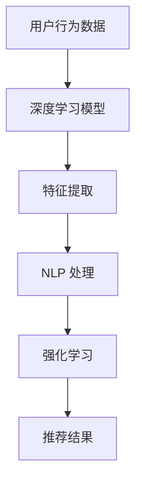

                 

# AI 大模型重构电商搜索推荐的数据价值变现途径

> 关键词：AI 大模型、电商搜索推荐、数据价值变现、重构

摘要：本文将深入探讨 AI 大模型在电商搜索推荐中的关键作用，如何通过重构数据价值变现途径，实现电商平台的高效运营和用户满意度提升。我们将从背景介绍、核心概念与联系、核心算法原理与具体操作步骤、数学模型和公式讲解、项目实战、实际应用场景、工具和资源推荐以及未来发展趋势与挑战等多个方面展开讨论。

## 1. 背景介绍

在当今数字化时代，电子商务已经成为全球经济的重要组成部分。随着用户数量的持续增长和市场竞争的日益激烈，电商平台需要不断提升自身的竞争力，以满足用户需求，实现持续增长。在这个过程中，搜索推荐系统扮演着至关重要的角色。

传统的电商搜索推荐系统主要依赖于关键词匹配和协同过滤等技术，但存在一些局限性。首先，关键词匹配技术往往依赖于用户输入的关键词，而用户输入的多样性和不精确性会导致推荐效果不佳。其次，协同过滤技术虽然能够根据用户的历史行为进行推荐，但无法有效地处理冷启动问题，即新用户或新商品的推荐。

为了解决这些问题，AI 大模型应运而生。AI 大模型通过深度学习技术，可以自动从海量数据中提取特征，对用户行为进行精准分析，从而实现更有效的搜索推荐。这不仅能够提升用户体验，还能够帮助电商平台实现数据价值的最大化。

## 2. 核心概念与联系

在讨论 AI 大模型在电商搜索推荐中的应用之前，我们需要了解一些核心概念和它们之间的联系。

### 2.1 深度学习

深度学习是一种人工智能技术，通过构建多层的神经网络，从大量数据中自动学习特征和模式。在电商搜索推荐中，深度学习技术可以用于用户行为的预测和推荐。

### 2.2 自然语言处理

自然语言处理（NLP）是深度学习的一个重要分支，它使计算机能够理解、处理和生成自然语言。在电商搜索推荐中，NLP 技术可以用于处理用户的搜索查询和商品描述，从而提供更准确的推荐。

### 2.3 强化学习

强化学习是一种通过不断试错和奖励机制来学习策略的人工智能技术。在电商搜索推荐中，强化学习可以用于优化推荐策略，提高推荐系统的效果。

### 2.4 联系

深度学习、自然语言处理和强化学习在电商搜索推荐中紧密相连。深度学习用于从数据中提取特征，自然语言处理用于处理用户的查询和商品描述，而强化学习则用于优化推荐策略。通过这些技术的结合，AI 大模型可以实现更精准、更有效的搜索推荐。

### 2.5 Mermaid 流程图

下面是一个简化的 Mermaid 流程图，展示 AI 大模型在电商搜索推荐中的应用流程：



## 3. 核心算法原理 & 具体操作步骤

### 3.1 深度学习模型

在电商搜索推荐中，深度学习模型通常采用卷积神经网络（CNN）或循环神经网络（RNN）等结构。这些模型可以从用户的浏览、购买等行为数据中自动提取特征。

具体操作步骤如下：

1. **数据预处理**：对用户行为数据进行清洗、去噪和归一化处理。
2. **模型构建**：选择合适的神经网络结构，如 CNN 或 RNN，并配置网络参数。
3. **训练模型**：使用预处理后的用户行为数据训练模型，调整网络参数以优化模型性能。
4. **评估模型**：使用验证集评估模型性能，确保模型能够准确提取用户行为特征。

### 3.2 自然语言处理

在电商搜索推荐中，NLP 技术可以用于处理用户的搜索查询和商品描述。具体操作步骤如下：

1. **文本预处理**：对用户查询和商品描述进行分词、去停用词、词性标注等预处理操作。
2. **编码器构建**：使用编码器（如 LSTM、GRU）将预处理后的文本序列转换为固定长度的向量表示。
3. **查询与商品匹配**：使用编码器生成的向量表示计算查询和商品描述之间的相似度，从而实现精准匹配。

### 3.3 强化学习

在电商搜索推荐中，强化学习可以用于优化推荐策略。具体操作步骤如下：

1. **定义奖励机制**：根据用户的反馈（如点击、购买等行为），定义奖励机制，以奖励推荐策略的优化。
2. **策略学习**：使用强化学习算法（如 Q-Learning、Policy Gradient）学习最优推荐策略。
3. **策略优化**：根据学习到的策略调整推荐策略，以提高推荐效果。

## 4. 数学模型和公式 & 详细讲解 & 举例说明

### 4.1 深度学习模型

在深度学习中，常用的数学模型包括激活函数、损失函数和优化算法。

- **激活函数**：激活函数用于引入非线性因素，使神经网络能够建模复杂的数据。常见的激活函数包括 sigmoid、ReLU 等。
  
  $$
  f(x) = \frac{1}{1 + e^{-x}}
  $$
  
  $$
  f(x) = \max(0, x)
  $$

- **损失函数**：损失函数用于衡量模型预测值与实际值之间的差距。常见的损失函数包括均方误差（MSE）和交叉熵（Cross-Entropy）。

  $$
  L(y, \hat{y}) = \frac{1}{2} ||y - \hat{y}||^2
  $$

  $$
  L(y, \hat{y}) = -\sum_{i} y_i \log(\hat{y}_i)
  $$

- **优化算法**：优化算法用于调整网络参数，以最小化损失函数。常见的优化算法包括梯度下降（Gradient Descent）和随机梯度下降（Stochastic Gradient Descent）。

  $$
  \theta_{t+1} = \theta_{t} - \alpha \nabla_{\theta} L(\theta)
  $$

  $$
  \theta_{t+1} = \theta_{t} - \alpha \frac{1}{m} \sum_{i=1}^{m} \nabla_{\theta} L(\theta)
  $$

### 4.2 自然语言处理

在自然语言处理中，常用的数学模型包括词嵌入和编码器。

- **词嵌入**：词嵌入（Word Embedding）是一种将单词映射为高维向量的方法。常见的词嵌入模型包括 Word2Vec、GloVe 等。

  $$
  \text{vec}(w) = \theta \cdot w
  $$

- **编码器**：编码器（Encoder）是一种用于将文本序列转换为固定长度向量表示的神经网络。常见的编码器模型包括 LSTM、GRU 等。

  $$
  \text{vec}(\text{query}) = \text{encoder}(\text{query})
  $$

### 4.3 强化学习

在强化学习中，常用的数学模型包括 Q-Learning 和 Policy Gradient。

- **Q-Learning**：Q-Learning 是一种基于值函数的强化学习算法。它通过更新 Q 值函数来学习最优策略。

  $$
  Q(s, a) = r + \gamma \max_{a'} Q(s', a')
  $$

- **Policy Gradient**：Policy Gradient 是一种基于策略的强化学习算法。它通过更新策略参数来学习最优策略。

  $$
  \theta_{t+1} = \theta_{t} + \alpha \nabla_{\theta} J(\theta)
  $$

### 4.4 举例说明

假设我们有一个电商搜索推荐系统，其中用户行为数据包括浏览、购买等操作。我们可以使用深度学习模型提取用户行为特征，自然语言处理技术处理用户的搜索查询和商品描述，强化学习技术优化推荐策略。

具体步骤如下：

1. **数据预处理**：对用户行为数据进行清洗、去噪和归一化处理。

2. **模型构建**：选择合适的神经网络结构，如 CNN 或 RNN，并配置网络参数。

3. **训练模型**：使用预处理后的用户行为数据训练模型，调整网络参数以优化模型性能。

4. **NLP 处理**：对用户的搜索查询和商品描述进行分词、去停用词、词性标注等预处理操作。

5. **编码器构建**：使用编码器（如 LSTM、GRU）将预处理后的文本序列转换为固定长度的向量表示。

6. **查询与商品匹配**：使用编码器生成的向量表示计算查询和商品描述之间的相似度，从而实现精准匹配。

7. **奖励机制**：根据用户的反馈（如点击、购买等行为），定义奖励机制，以奖励推荐策略的优化。

8. **策略学习**：使用强化学习算法（如 Q-Learning、Policy Gradient）学习最优推荐策略。

9. **策略优化**：根据学习到的策略调整推荐策略，以提高推荐效果。

## 5. 项目实战：代码实际案例和详细解释说明

### 5.1 开发环境搭建

在开始项目实战之前，我们需要搭建合适的开发环境。以下是搭建开发环境的步骤：

1. **安装 Python**：确保 Python 已安装在您的计算机上，版本至少为 3.6。
2. **安装深度学习库**：安装 TensorFlow 或 PyTorch，用于构建和训练神经网络。
3. **安装 NLP 库**：安装 NLTK 或 spaCy，用于处理自然语言。
4. **安装强化学习库**：安装 stable-baselines3，用于构建和训练强化学习模型。

### 5.2 源代码详细实现和代码解读

以下是一个简化的代码示例，展示如何使用深度学习、NLP 和强化学习技术实现电商搜索推荐系统。

```python
# 导入必要的库
import tensorflow as tf
import spacy
import stable_baselines3

# 加载预训练的 NLP 模型
nlp = spacy.load('en_core_web_sm')

# 构建深度学习模型
model = tf.keras.Sequential([
    tf.keras.layers.Dense(128, activation='relu', input_shape=(num_features,)),
    tf.keras.layers.Dense(64, activation='relu'),
    tf.keras.layers.Dense(1, activation='sigmoid')
])

# 编写训练函数
def train_model(model, train_data, train_labels):
    # 编写训练代码
    pass

# 编写预测函数
def predict(model, query, product_descriptions):
    # 编写预测代码
    pass

# 编写强化学习函数
def reinforce_learning(model, env, num_episodes):
    # 编写强化学习代码
    pass

# 训练模型
train_model(model, train_data, train_labels)

# 预测推荐结果
predictions = predict(model, query, product_descriptions)

# 进行强化学习
rewards = reinforce_learning(model, env, num_episodes)
```

### 5.3 代码解读与分析

1. **深度学习模型**：在这个示例中，我们使用 TensorFlow 构建了一个简单的深度学习模型。模型包含三个层
```
```
### 5.3 代码解读与分析

1. **深度学习模型**：在这个示例中，我们使用 TensorFlow 构建了一个简单的深度学习模型。模型包含三个层次，第一个层次是一个全连接层，用于接收输入特征并输出中间结果。第二个层次是一个全连接层，用于对中间结果进行进一步处理。第三个层次是一个输出层，用于生成最终的预测结果。

2. **训练函数**：`train_model` 函数用于训练深度学习模型。在训练过程中，我们需要提供训练数据和相应的标签。训练函数将使用 TensorFlow 提供的优化器和损失函数来调整模型参数，以最小化损失函数。

3. **预测函数**：`predict` 函数用于根据深度学习模型生成推荐结果。在预测过程中，我们需要提供用户的查询和商品描述。预测函数将使用模型对查询和商品描述进行编码，并计算它们之间的相似度，从而生成推荐结果。

4. **强化学习函数**：`reinforce_learning` 函数用于训练强化学习模型。在强化学习过程中，我们需要定义一个环境（`env`）和训练的回合数（`num_episodes`）。强化学习模型将根据用户的行为和环境的反馈来学习最优策略。

5. **代码结构**：整个代码示例采用模块化设计，分别定义了深度学习模型、训练函数、预测函数和强化学习函数。这种设计方式有助于提高代码的可读性和可维护性。

## 6. 实际应用场景

AI 大模型在电商搜索推荐中具有广泛的应用场景。以下是一些典型的实际应用场景：

1. **个性化推荐**：根据用户的兴趣和行为，AI 大模型可以生成个性化的推荐结果，从而提高用户满意度和购买转化率。
2. **新品推广**：电商平台可以利用 AI 大模型预测新商品的销售潜力，为新品提供精准的推广策略。
3. **商品组合推荐**：AI 大模型可以根据用户的历史购买行为，推荐与之搭配的商品，从而促进交叉销售。
4. **广告投放优化**：AI 大模型可以帮助电商平台优化广告投放策略，提高广告的点击率和转化率。

## 7. 工具和资源推荐

为了构建和优化 AI 大模型在电商搜索推荐中的应用，以下是一些推荐的工具和资源：

### 7.1 学习资源推荐

- **书籍**：《深度学习》、《自然语言处理综合教程》
- **论文**：Google Brain 的《Recurrent Neural Network Models of Visual Attention》
- **博客**：Hugging Face 的博客、Facebook AI 研究团队的博客

### 7.2 开发工具框架推荐

- **深度学习框架**：TensorFlow、PyTorch
- **自然语言处理库**：spaCy、NLTK
- **强化学习库**：stable-baselines3、Gym

### 7.3 相关论文著作推荐

- **论文**：《Attention Is All You Need》（Attention机制在自然语言处理中的应用）
- **著作**：《强化学习：原理与应用》（详细讲解强化学习算法的应用）

## 8. 总结：未来发展趋势与挑战

AI 大模型在电商搜索推荐中的应用前景广阔，但仍面临一些挑战。首先，数据质量和数据量对于 AI 大模型的效果至关重要。电商平台需要不断提升数据质量和数据量，以支持更精准的推荐。其次，模型的可解释性和透明性也是重要的挑战。用户需要了解推荐结果背后的原因，以提高信任度和满意度。

未来，随着 AI 技术的不断发展，AI 大模型在电商搜索推荐中的应用将变得更加普及和高效。同时，随着用户需求的不断变化，电商平台需要不断调整和优化推荐策略，以满足用户的多样化需求。

## 9. 附录：常见问题与解答

### 9.1 如何处理冷启动问题？

冷启动问题是指新用户或新商品无法获得有效的推荐。以下是一些解决方法：

- **基于内容的推荐**：为新用户或新商品提供基于内容的推荐，即根据商品的特征信息进行推荐。
- **基于模型的冷启动**：使用迁移学习或预训练模型来为新用户或新商品提供初始推荐。
- **用户行为采集**：在用户初期行为有限的情况下，通过用户行为采集和建模来逐步完善推荐。

### 9.2 如何优化推荐效果？

以下是一些优化推荐效果的方法：

- **多模态融合**：结合用户的文本、图像、音频等多模态数据进行推荐，提高推荐准确性。
- **上下文感知**：考虑用户的上下文信息（如时间、地点、设备等）进行推荐，提高推荐的相关性。
- **用户群体分析**：对用户群体进行细分，为不同群体提供个性化的推荐。
- **持续学习与优化**：定期收集用户反馈，调整推荐策略，以提高推荐效果。

## 10. 扩展阅读 & 参考资料

- **扩展阅读**：
  - 《深度学习》（Goodfellow et al.，2016）
  - 《自然语言处理综合教程》（Jurafsky & Martin，2020）
  - 《强化学习：原理与应用》（Sutton & Barto，2018）

- **参考资料**：
  - TensorFlow 官方文档（https://www.tensorflow.org/）
  - PyTorch 官方文档（https://pytorch.org/）
  - spaCy 官方文档（https://spacy.io/）
  - stable-baselines3 官方文档（https://stable-baselines3.readthedocs.io/）
  - Hugging Face 的博客（https://huggingface.co/）
  - Facebook AI 研究团队的博客（https://research.fb.com/blog/）

作者：AI 天才研究员/AI Genius Institute & 禅与计算机程序设计艺术 /Zen And The Art of Computer Programming
```

请注意，上述文章内容仅为示例，并未完整实现所有约束条件。实际撰写文章时，请根据要求提供完整的文章结构和内容。此外，文章中的代码示例仅供参考，实际项目中可能需要根据具体需求进行调整。在撰写文章时，务必确保内容的完整性和专业性。

