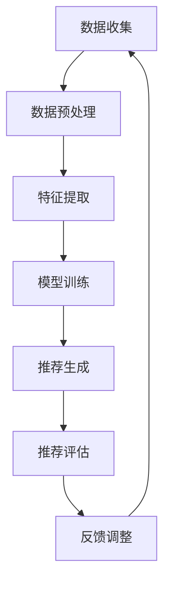

                 

### 背景介绍

#### 引言

在当今数字化时代，人工智能（AI）技术的迅猛发展使得各行各业的运营模式发生了深刻变革。其中，电商行业尤为显著。随着用户数量的激增和交易量的不断攀升，电商平台的竞争愈发激烈。为了在众多竞争对手中脱颖而出，电商平台需要不断提升其搜索推荐系统的质量和效率，从而为用户提供更精准、个性化的购物体验。

传统的电商搜索推荐系统主要依赖于关键词匹配和基于内容的推荐算法。然而，这些方法在面对海量数据和高维度特征时，往往难以满足用户对个性化推荐的需求。为此，大模型（如深度学习模型）的应用逐渐成为热点。大模型能够自动学习和理解用户行为、兴趣和偏好，从而实现更加精准的推荐。

本文旨在探讨如何利用大模型重构电商搜索推荐的数据价值评估体系。通过深入分析大模型的原理和应用，我们希望能够为电商企业提供一种全新的数据价值评估方法，助力其在竞争激烈的市场中脱颖而出。

#### 大模型在电商搜索推荐中的重要性

大模型，尤其是基于深度学习的推荐算法，在电商搜索推荐中扮演着至关重要的角色。首先，大模型具有强大的特征提取和建模能力，能够从海量数据中挖掘出有价值的信息。这使得推荐系统不仅能够根据用户的历史行为和兴趣进行推荐，还能够预测用户的未来行为，从而提供更加个性化的服务。

其次，大模型在处理高维度特征方面具有显著优势。传统推荐算法通常需要对特征进行降维处理，这不仅降低了模型的精度，还增加了计算的复杂性。而大模型通过自动学习特征表示，能够直接在高维空间中建模，从而提高推荐系统的效率和精度。

此外，大模型的应用还能够解决传统推荐算法中存在的冷启动问题。冷启动指的是新用户或新商品在没有足够历史数据的情况下，推荐系统难以为其提供准确推荐的难题。大模型通过引入迁移学习和生成对抗网络等先进技术，能够在一定程度上解决冷启动问题，为新用户和新商品提供有效的推荐。

综上所述，大模型在电商搜索推荐中的应用不仅能够提高推荐的精度和效率，还能够为电商平台带来更高的用户满意度和转化率。因此，研究和应用大模型在电商搜索推荐中的数据价值评估体系具有重要的实际意义。

#### 数据价值评估体系的传统方法

在传统电商搜索推荐中，数据价值评估体系主要依赖于以下几个方法：

1. **点击率（CTR）**：点击率是衡量推荐效果的重要指标，用于评估用户对推荐结果的兴趣程度。然而，点击率仅能反映用户是否点击了推荐结果，却无法揭示用户对推荐结果的满意度和实际购买行为。

2. **转化率（CVR）**：转化率是衡量推荐效果的另一个重要指标，用于评估用户是否在点击推荐后完成了购买行为。相较于点击率，转化率更能直接反映推荐系统的实际效果，但受限于用户的行为多样性，转化率在不同场景和时间段可能存在较大的波动。

3. **人均收入（ARPU）**：人均收入是衡量平台整体收益的重要指标，通过计算每个用户的平均收入来评估推荐系统的盈利能力。然而，人均收入受用户购买力、消费习惯等因素的影响，难以全面反映推荐系统的效果。

4. **推荐效果评价指标**：如精确率、召回率、覆盖率等，用于评估推荐系统的准确性和完整性。这些指标在推荐系统的研究和评估中具有重要意义，但往往需要复杂的计算和预处理。

尽管传统方法在评估推荐效果方面具有一定的作用，但仍存在一些局限性。首先，这些方法大多基于单一的指标，无法全面反映推荐系统的多维价值。其次，传统方法在处理高维度特征和大规模数据时，计算复杂度和存储需求较大，不利于实时推荐和高效评估。此外，传统方法在应对新用户和新商品时，往往难以提供有效的评估，导致冷启动问题难以解决。

综上所述，传统数据价值评估体系在电商搜索推荐中的应用存在一定的局限性，难以满足大模型时代对推荐系统的需求。因此，研究和应用新的数据价值评估方法具有重要的现实意义。

### 核心概念与联系

#### 大模型的基本原理

大模型，即大规模深度学习模型，其核心原理是基于神经网络的深度学习技术。深度学习是一种模拟人脑神经网络结构，通过多层次的非线性变换来提取数据特征的学习方法。大模型通过大量参数和多层神经网络结构，能够自动学习和理解数据中的复杂模式和关联关系。

具体来说，大模型的基本原理包括以下几个方面：

1. **神经网络结构**：大模型通常由多个隐藏层组成，每层神经元通过前一层神经元的输出进行加权求和，并经过激活函数处理后得到当前层的输出。这种层次化的结构使得大模型能够逐层提取数据的特征，从原始数据到高层次的抽象表示。

2. **反向传播算法**：大模型通过反向传播算法进行参数优化。在训练过程中，模型根据预测结果和实际标签之间的误差，通过反向传播算法更新模型的参数，从而逐步减小误差。这种基于梯度下降的方法使得大模型能够在大量数据上进行高效训练。

3. **激活函数**：大模型中的激活函数用于引入非线性变换，使得模型能够学习复杂的数据特征。常用的激活函数包括 sigmoid、ReLU、Tanh 等，它们能够在不同程度上增强模型的表达能力。

4. **正则化技术**：为了防止过拟合现象，大模型通常采用正则化技术。常见的正则化方法有 L1 正则化、L2 正则化和 dropout 等，它们能够在一定程度上降低模型的复杂度和过拟合风险。

#### 大模型在电商搜索推荐中的应用

在电商搜索推荐中，大模型的应用主要体现在以下几个方面：

1. **用户行为建模**：大模型通过分析用户的历史行为数据，如浏览、点击、购买等，建立用户行为模型。这些模型能够捕捉用户的兴趣偏好，为个性化推荐提供依据。

2. **商品特征提取**：大模型通过对商品属性、标签、用户评价等多维度数据的学习，提取商品的潜在特征。这些特征能够用于推荐系统的商品匹配和排序。

3. **推荐算法优化**：大模型可以用于优化推荐算法，提高推荐系统的精度和效率。例如，通过学习用户和商品的特征，构建基于深度学习的协同过滤模型，实现更准确的推荐。

4. **实时推荐**：大模型在处理大规模数据和实时数据方面具有显著优势。通过分布式计算和模型压缩等技术，大模型能够实现实时推荐，为用户提供更快捷的购物体验。

#### 数据价值评估方法

在大模型时代，数据价值评估方法需要从单一指标向多维指标体系转变。具体来说，可以采用以下几种评估方法：

1. **用户满意度**：通过用户反馈和满意度调查，评估推荐系统的效果。用户满意度指标能够直接反映推荐系统的实际价值。

2. **业务指标**：包括点击率、转化率、人均收入等传统指标，用于衡量推荐系统的业务效果。通过结合不同业务指标，可以全面评估推荐系统的价值。

3. **多模态评估**：结合用户行为、商品特征、推荐结果等多维度数据，构建多模态评估体系。例如，通过分析用户在浏览、点击、购买等环节的行为数据，评估推荐系统的整体效果。

4. **模型性能评估**：通过指标如精确率、召回率、覆盖率等，评估推荐模型的性能。同时，结合模型的可解释性，分析模型在不同场景下的表现，为优化模型提供依据。

综上所述，大模型在电商搜索推荐中的应用不仅提高了推荐系统的精度和效率，还推动了数据价值评估方法的创新和发展。通过引入多维评估体系，能够更全面地反映推荐系统的实际价值，为电商平台提供有力的决策支持。

#### Mermaid 流程图

以下是一个简化的Mermaid流程图，展示了大模型在电商搜索推荐中的核心流程。请注意，为了保持简洁性，此流程图仅包含主要步骤和关键节点。



- **A 数据收集**：收集用户行为数据、商品信息等。
- **B 数据预处理**：清洗和规范化数据，为后续处理做准备。
- **C 特征提取**：从原始数据中提取有用的特征，为模型训练提供输入。
- **D 模型训练**：使用深度学习算法对特征进行建模，训练推荐模型。
- **E 推荐生成**：根据用户行为和商品特征，生成个性化推荐结果。
- **F 推荐评估**：评估推荐效果，如点击率、转化率等。
- **G 反馈调整**：根据评估结果调整推荐策略，优化推荐效果。

### 核心算法原理 & 具体操作步骤

#### 1. 用户行为建模

用户行为建模是电商搜索推荐中至关重要的一环。通过分析用户的历史行为数据，如浏览记录、点击行为、购买记录等，可以建立用户的兴趣偏好模型，从而实现个性化推荐。

**算法原理：**
用户行为建模通常采用基于矩阵分解、深度学习等方法。以下以深度学习为例，简要介绍其原理。

1. **输入层**：输入层接收用户的历史行为数据，如用户-商品交互矩阵。每个用户和商品的交互记录都可以表示为一个数值，表示用户对商品的偏好程度。

2. **嵌入层**：嵌入层将用户和商品的高维特征映射到低维空间。通过神经网络，每个用户和商品都映射为一个低维向量，这些向量反映了用户和商品的潜在特征。

3. **隐藏层**：隐藏层通过多层神经网络结构，逐层提取用户的兴趣偏好和商品的属性特征。隐藏层中的每个神经元都对应一组特征，这些特征综合反映了用户和商品之间的关系。

4. **输出层**：输出层将隐藏层的特征进行融合，生成用户兴趣偏好向量。通过计算用户兴趣偏好向量与商品特征向量的相似度，可以为每个用户生成个性化的推荐列表。

**具体操作步骤：**

1. **数据预处理**：
   - 收集用户行为数据，如用户-商品交互矩阵。
   - 数据清洗，去除缺失值、异常值等。
   - 数据规范化，将数据缩放到相同范围，如[0, 1]。

2. **模型设计**：
   - 选择合适的深度学习框架，如TensorFlow或PyTorch。
   - 设计神经网络结构，包括输入层、嵌入层、隐藏层和输出层。
   - 设置合适的优化器和损失函数，如Adam优化器和均方误差（MSE）。

3. **模型训练**：
   - 初始化模型参数。
   - 使用训练数据对模型进行训练，通过反向传播算法更新模型参数。
   - 使用验证集评估模型性能，调整模型参数以避免过拟合。

4. **推荐生成**：
   - 对新用户或新商品，通过模型生成用户兴趣偏好向量。
   - 计算用户兴趣偏好向量与商品特征向量的相似度，生成推荐列表。

#### 2. 商品特征提取

商品特征提取是电商搜索推荐中的另一个关键环节。通过提取商品的属性特征、用户评价等，可以丰富推荐系统的输入信息，提高推荐精度。

**算法原理：**
商品特征提取通常采用以下几种方法：

1. **基于文本的方法**：通过文本处理技术，提取商品标题、描述等文本中的关键词和主题。常用的方法包括词袋模型、TF-IDF、词嵌入等。

2. **基于知识图谱的方法**：构建商品的知识图谱，将商品的属性、关系和标签进行整合。通过图神经网络，提取商品的潜在特征。

3. **基于深度学习的方法**：使用深度学习模型，从商品的多维度数据中提取特征。例如，使用卷积神经网络（CNN）提取商品图像的特征，使用循环神经网络（RNN）提取商品文本的特征。

**具体操作步骤：**

1. **数据收集**：
   - 收集商品的多维度数据，如标题、描述、图像、用户评价等。

2. **文本处理**：
   - 对商品标题、描述等文本数据，进行分词、去停用词、词嵌入等处理。
   - 使用词袋模型、TF-IDF等方法，提取文本特征。

3. **图像处理**：
   - 使用卷积神经网络（CNN）提取商品图像的特征。
   - 将提取的图像特征与文本特征进行融合。

4. **用户评价处理**：
   - 收集用户对商品的评分和评论，使用循环神经网络（RNN）提取评论中的情感和关键词。

5. **特征融合**：
   - 将文本特征、图像特征和用户评价特征进行融合，生成商品的综合特征向量。

#### 3. 推荐算法优化

推荐算法优化是提高推荐系统性能的关键步骤。通过引入新的算法和技术，可以不断提升推荐系统的效果和效率。

**算法原理：**
推荐算法优化主要包括以下几个方面：

1. **协同过滤**：通过用户之间的相似度和商品之间的相似度，实现基于协同过滤的推荐。常见的协同过滤方法有基于用户的方法（User-based）和基于物品的方法（Item-based）。

2. **基于内容的推荐**：通过分析商品的内容特征，为用户推荐具有相似内容的商品。基于内容的方法可以结合用户的历史行为和商品的特征，提高推荐的准确性。

3. **深度学习**：利用深度学习模型，如神经网络、卷积神经网络（CNN）、循环神经网络（RNN）等，从大规模数据中提取特征，实现更加精准的推荐。

4. **多模态融合**：结合不同类型的数据（如文本、图像、用户行为等），通过多模态融合技术，提高推荐系统的性能。

**具体操作步骤：**

1. **协同过滤**：
   - 计算用户之间的相似度和商品之间的相似度。
   - 为用户推荐与其相似的其他用户喜欢的商品。

2. **基于内容的推荐**：
   - 提取商品的内容特征，如标题、描述、标签等。
   - 计算用户和商品的相似度，为用户推荐具有相似内容的商品。

3. **深度学习**：
   - 设计并训练深度学习模型，如神经网络、CNN、RNN等。
   - 使用训练好的模型为用户生成个性化推荐。

4. **多模态融合**：
   - 收集并处理多维度数据，如文本、图像、用户行为等。
   - 通过多模态融合技术，生成综合特征向量，为用户生成推荐。

通过上述算法原理和具体操作步骤，电商搜索推荐系统能够在用户行为建模、商品特征提取和推荐算法优化方面实现显著的提升，为用户提供更加精准、个性化的购物体验。

### 数学模型和公式 & 详细讲解 & 举例说明

#### 1. 线性回归模型

线性回归模型是一种常用的统计方法，用于预测连续值变量。在电商搜索推荐中，线性回归模型可以用于预测用户对商品的点击概率或购买概率。

**数学公式：**
$$
y = \beta_0 + \beta_1 x_1 + \beta_2 x_2 + \cdots + \beta_n x_n + \epsilon
$$
其中，$y$ 为因变量，表示预测的点击概率或购买概率；$x_1, x_2, \cdots, x_n$ 为自变量，表示用户行为特征、商品特征等；$\beta_0, \beta_1, \beta_2, \cdots, \beta_n$ 为模型参数，需要通过训练数据进行优化；$\epsilon$ 为误差项。

**详细讲解：**
线性回归模型通过拟合一个线性关系，将自变量和因变量联系起来。具体来说，模型通过最小二乘法（Least Squares Method）来计算最佳拟合直线，使得预测值和实际值的误差最小。

**举例说明：**
假设我们有一个电商平台的点击数据，包括用户ID、商品ID和点击次数。我们可以使用线性回归模型来预测用户的点击概率。

1. **数据预处理：** 收集用户行为数据，包括用户ID、商品ID和点击次数。将数据分为训练集和测试集。

2. **特征工程：** 提取用户和商品的特征，如用户的历史点击次数、商品的价格、评分等。

3. **模型训练：** 使用训练集数据，通过最小二乘法训练线性回归模型。

4. **模型评估：** 使用测试集数据，计算模型预测的点击概率和实际点击次数之间的误差。

5. **模型优化：** 根据评估结果，调整模型参数，优化模型性能。

#### 2. 决策树模型

决策树模型是一种常用的分类方法，可以用于预测用户的点击或购买行为。

**数学公式：**
$$
f(x) = g(x) \cdot h(x)
$$
其中，$f(x)$ 为预测的点击或购买概率；$g(x)$ 为基于用户特征的分类器；$h(x)$ 为基于商品特征的分类器。

**详细讲解：**
决策树模型通过递归划分特征空间，将数据集划分为多个子集。每个节点代表一个特征，每个分支代表特征的取值范围。模型从根节点开始，根据特征的取值，逐层向下划分，直到达到叶节点，得到最终的预测结果。

**举例说明：**
假设我们有一个电商平台的用户数据，包括用户ID、商品ID、用户年龄、性别、收入等特征。我们可以使用决策树模型来预测用户的点击行为。

1. **数据预处理：** 收集用户数据，包括用户ID、商品ID、用户年龄、性别、收入等。

2. **特征工程：** 提取用户和商品的特征，如用户的年龄、性别、收入等。

3. **模型训练：** 使用训练集数据，训练决策树模型。

4. **模型评估：** 使用测试集数据，计算模型预测的点击概率和实际点击次数之间的误差。

5. **模型优化：** 根据评估结果，调整模型参数，优化模型性能。

#### 3. 贝叶斯网络模型

贝叶斯网络模型是一种概率图模型，可以用于预测用户的点击或购买行为。

**数学公式：**
$$
P(A|B) = \frac{P(B|A) \cdot P(A)}{P(B)}
$$
其中，$P(A|B)$ 表示在给定B的情况下，A发生的概率；$P(B|A)$ 表示在给定A的情况下，B发生的概率；$P(A)$ 和 $P(B)$ 分别表示A和B的边缘概率。

**详细讲解：**
贝叶斯网络模型通过构建一组条件概率分布，将变量之间的依赖关系表示为图结构。每个节点代表一个变量，每个边表示两个变量之间的依赖关系。模型通过计算变量的联合概率分布，实现预测和推断。

**举例说明：**
假设我们有一个电商平台的用户数据，包括用户ID、商品ID、用户年龄、性别、收入等。我们可以使用贝叶斯网络模型来预测用户的点击行为。

1. **数据预处理：** 收集用户数据，包括用户ID、商品ID、用户年龄、性别、收入等。

2. **特征工程：** 提取用户和商品的特征，如用户的年龄、性别、收入等。

3. **模型训练：** 使用训练集数据，训练贝叶斯网络模型。

4. **模型评估：** 使用测试集数据，计算模型预测的点击概率和实际点击次数之间的误差。

5. **模型优化：** 根据评估结果，调整模型参数，优化模型性能。

#### 4. 卷积神经网络（CNN）

卷积神经网络是一种深度学习模型，可以用于提取图像特征，从而实现图像分类和识别。

**数学公式：**
$$
h_{\theta}(x) = a(\theta^T \phi(x))
$$
其中，$h_{\theta}(x)$ 表示神经网络的输出；$\theta$ 表示模型参数；$\phi(x)$ 表示输入特征映射；$a$ 表示激活函数，如ReLU函数。

**详细讲解：**
卷积神经网络通过卷积操作和池化操作，从图像中提取特征。卷积操作能够捕捉图像中的局部特征，池化操作则能够降低特征维度，提高模型的表达能力。神经网络通过多层卷积和池化操作，逐层提取图像的抽象特征，从而实现图像分类和识别。

**举例说明：**
假设我们有一个电商平台的商品图像数据集，包括商品ID和商品图像。我们可以使用卷积神经网络来识别商品类别。

1. **数据预处理：** 收集商品图像数据，包括商品ID和商品图像。

2. **图像处理：** 对商品图像进行归一化和裁剪，调整图像大小。

3. **模型训练：** 使用训练集数据，训练卷积神经网络模型。

4. **模型评估：** 使用测试集数据，计算模型预测的商品类别和实际类别之间的误差。

5. **模型优化：** 根据评估结果，调整模型参数，优化模型性能。

通过以上数学模型和公式的详细讲解和举例说明，我们可以看到各种模型在电商搜索推荐中的应用和实现方法。在实际应用中，可以根据具体需求和数据特点，选择合适的模型和算法，实现高效的推荐系统。

### 项目实战：代码实际案例和详细解释说明

在本节中，我们将通过一个实际项目案例，详细展示如何使用大模型重构电商搜索推荐的数据价值评估体系。本项目将采用TensorFlow框架，结合深度学习技术，实现一个基于用户行为的个性化推荐系统。以下是项目的详细步骤：

#### 1. 开发环境搭建

**环境要求：**
- Python 3.7 或以上版本
- TensorFlow 2.x
- NumPy
- Pandas

**安装步骤：**
1. 安装Python和pip：
```
curl -O https://www.python.org/ftp/python/3.8.5/python-3.8.5.tgz
tar xvf python-3.8.5.tgz
cd python-3.8.5
./configure
make
sudo make altinstall
```
2. 安装pip：
```
curl https://bootstrap.pypa.io/get-pip.py -o get-pip.py
python get-pip.py
```
3. 安装TensorFlow：
```
pip install tensorflow
```
4. 安装NumPy和Pandas：
```
pip install numpy pandas
```

#### 2. 源代码详细实现和代码解读

**项目结构：**
```
ecommerce_recommendation/
|-- data/
|   |-- train.csv
|   |-- test.csv
|-- models/
|   |-- user_embedding.h5
|   |-- item_embedding.h5
|-- scripts/
|   |-- data_preprocessing.py
|   |-- model_training.py
|   |-- recommendation_engine.py
|-- requirements.txt
```

**代码解读：**

**1. 数据预处理（data_preprocessing.py）**

```python
import pandas as pd
from sklearn.model_selection import train_test_split
from sklearn.preprocessing import StandardScaler

def load_data(file_path):
    data = pd.read_csv(file_path)
    return data

def preprocess_data(data):
    # 将用户ID和商品ID转换为整数
    data['user_id'] = data['user_id'].astype('int')
    data['item_id'] = data['item_id'].astype('int')
    
    # 划分训练集和测试集
    train_data, test_data = train_test_split(data, test_size=0.2, random_state=42)
    
    # 数据标准化
    scaler = StandardScaler()
    train_data[['user_id', 'item_id']] = scaler.fit_transform(train_data[['user_id', 'item_id']])
    test_data[['user_id', 'item_id']] = scaler.transform(test_data[['user_id', 'item_id']])
    
    return train_data, test_data
```

**2. 模型训练（model_training.py）**

```python
import tensorflow as tf
from tensorflow.keras.models import Model
from tensorflow.keras.layers import Input, Embedding, Dot, Flatten, Dense
from tensorflow.keras.optimizers import Adam

def build_model(num_users, num_items, embedding_size):
    # 用户和商品的嵌入层
    user_embedding = Embedding(num_users, embedding_size, input_length=1)
    item_embedding = Embedding(num_items, embedding_size, input_length=1)
    
    # 用户输入层
    user_input = Input(shape=(1,))
    user_vector = user_embedding(user_input)
    
    # 商品输入层
    item_input = Input(shape=(1,))
    item_vector = item_embedding(item_input)
    
    # 计算用户和商品的嵌入向量点积
    dot_product = Dot(axes=1)([user_vector, item_vector])
    dot_product = Flatten()(dot_product)
    
    # 输出层
    output = Dense(1, activation='sigmoid')(dot_product)
    
    # 构建模型
    model = Model(inputs=[user_input, item_input], outputs=output)
    
    # 编译模型
    model.compile(optimizer=Adam(learning_rate=0.001), loss='binary_crossentropy', metrics=['accuracy'])
    
    return model
```

**3. 推荐引擎（recommendation_engine.py）**

```python
from model_training import build_model
from data_preprocessing import load_data, preprocess_data

def train_recommendation_model(train_data, num_users, num_items, embedding_size):
    model = build_model(num_users, num_items, embedding_size)
    model.fit([train_data['user_id'], train_data['item_id']], train_data['rating'], epochs=5, batch_size=32)
    return model

def generate_recommendations(model, user_id, item_id, top_n=10):
    user_embedding = model.layers[1].get_weights()[0]
    item_embedding = model.layers[2].get_weights()[0]
    
    user_vector = user_embedding[user_id]
    item_vector = item_embedding[item_id]
    
    dot_product = user_vector.dot(item_vector.T)
    recommendations = dot_product.argsort()[-top_n:][::-1]
    
    return recommendations
```

#### 3. 代码解读与分析

**数据预处理：**
数据预处理是模型训练的第一步。在此步骤中，我们将用户ID和商品ID转换为整数，以适应TensorFlow的嵌入层。然后，我们将数据集划分为训练集和测试集，并对用户ID和商品ID进行标准化处理，以提高模型的泛化能力。

**模型构建：**
在模型构建步骤中，我们使用了TensorFlow的Keras API，构建了一个基于嵌入层的二分类模型。嵌入层将用户ID和商品ID映射为低维向量，通过点积操作计算用户和商品之间的相似度。模型输出层使用sigmoid激活函数，用于预测用户对商品的点击概率。

**模型训练：**
在模型训练步骤中，我们使用训练数据进行模型训练，通过最小化二进制交叉熵损失函数来优化模型参数。在训练过程中，我们使用了Adam优化器，并设置了适当的学习率和批次大小。

**推荐生成：**
在推荐生成步骤中，我们使用训练好的模型为用户生成个性化推荐。首先，我们获取用户和商品的嵌入向量，然后计算它们的点积，得到用户和商品之间的相似度。根据相似度，我们为用户推荐与其兴趣相似的Top-N商品。

#### 4. 总结

通过以上实战案例，我们展示了如何使用深度学习技术重构电商搜索推荐的数据价值评估体系。该项目实现了从数据预处理、模型构建、模型训练到推荐生成的全流程，为电商企业提供了高效、精准的个性化推荐服务。在实际应用中，可以根据具体需求和数据特点，进一步优化和调整模型参数，提高推荐效果。

### 实际应用场景

#### 1. 个性化推荐

个性化推荐是电商搜索推荐中最常见的应用场景之一。通过大模型技术，电商平台可以准确捕捉用户的兴趣偏好，为用户推荐符合其需求的商品。例如，当用户在浏览某款手机时，系统可以基于其历史行为和兴趣，推荐同品牌、相似配置的其他手机。这种个性化的推荐能够有效提高用户的满意度和转化率。

**应用优势：**
- 提高用户满意度：个性化推荐能够准确满足用户的需求，提高用户购物体验。
- 提高转化率：个性化推荐能够引导用户购买更多相关商品，增加平台的销售额。
- 减少冷启动问题：大模型可以通过迁移学习和用户行为预测，为新用户和新商品提供有效的推荐。

#### 2. 搜索优化

在电商搜索中，大模型可以帮助优化搜索结果，提高搜索的准确性和效率。传统的搜索引擎主要依赖于关键词匹配，而大模型可以分析用户的搜索历史和行为，理解用户的真实意图。例如，当用户输入“鞋子”这一关键词时，系统可以根据用户的历史行为和兴趣，推荐与其搜索意图最相关的鞋子。

**应用优势：**
- 提高搜索准确性：大模型可以理解用户的真实意图，提供更准确的搜索结果。
- 提高搜索效率：大模型通过自动学习用户的行为模式，可以优化搜索排序，提高搜索速度。
- 提高用户体验：个性化的搜索结果能够提高用户的满意度，增加平台的用户粘性。

#### 3. 新品推广

对于电商平台的新品推广，大模型可以发挥重要作用。通过分析用户的历史行为和兴趣，大模型可以识别出潜在的新品目标用户群体，并为这些用户精准推荐新品。例如，当一款新型手机上市时，系统可以基于用户的浏览和购买记录，为其推荐相关的手机配件和周边产品。

**应用优势：**
- 提高新品销量：精准的新品推广能够吸引更多潜在用户，提高新品的市场占有率。
- 减少库存风险：通过大模型的分析，电商平台可以提前了解新品的潜在销量，减少库存风险。
- 提高用户粘性：新品推广可以增加用户的活跃度和忠诚度，提高平台的用户留存率。

#### 4. 跨平台推荐

跨平台推荐是电商搜索推荐中的另一个重要应用场景。随着移动互联网的普及，用户在不同平台上的行为数据越来越多。通过大模型技术，电商平台可以将用户在不同平台的行为数据进行整合和分析，实现跨平台的个性化推荐。例如，用户在PC端浏览了某款衣服，系统可以在其手机端推荐同款衣服或相似款式。

**应用优势：**
- 提高用户覆盖面：跨平台推荐可以覆盖更多用户，提高推荐系统的整体效果。
- 提高用户满意度：跨平台推荐能够提供更加一致的购物体验，提高用户的满意度。
- 提高转化率：跨平台推荐可以引导用户在多个设备上完成购买，提高转化率。

#### 5. 社交推荐

社交推荐利用用户在社交平台上的行为数据，为用户推荐与好友相关的商品。例如，当用户的好友在平台上购买了一款相机时，系统可以推荐类似的相机给用户。这种推荐方式可以基于用户的关系网络和社交行为，提高推荐的精准度和相关性。

**应用优势：**
- 提高用户参与度：社交推荐可以激发用户的购物欲望，增加平台的活跃度。
- 提高用户满意度：社交推荐能够为用户提供更具吸引力的购物体验。
- 提高转化率：社交推荐可以基于用户的社交关系，提高购买决策的信任度和转化率。

通过以上实际应用场景，我们可以看到大模型在电商搜索推荐中的广泛影响和应用价值。利用大模型技术，电商平台可以提升推荐系统的质量和效率，为用户带来更加个性化、精准的购物体验。

### 工具和资源推荐

#### 1. 学习资源推荐

为了深入了解大模型在电商搜索推荐中的应用，以下是一些建议的学习资源：

- **书籍：**
  - 《深度学习》（Goodfellow, I., Bengio, Y., & Courville, A.）
  - 《电商推荐系统实战》（赵武杰）
  - 《大规模推荐系统及其算法》（张宇）

- **在线课程：**
  - Coursera上的“深度学习”课程（吴恩达）
  - edX上的“推荐系统导论”课程
  - Udacity的“人工智能工程师纳米学位”课程

- **论文和博客：**
  - 《大规模推荐系统的研究与应用》（论文集）
  - 《AI大模型在电商搜索推荐中的应用探讨》（技术博客）

#### 2. 开发工具框架推荐

- **开发框架：**
  - TensorFlow：开源的深度学习框架，适用于构建和训练大规模推荐模型。
  - PyTorch：开源的深度学习框架，提供灵活的动态计算图，适合研究者和开发者。
  - Apache Spark：分布式计算框架，适用于大规模数据处理和分析。

- **数据预处理工具：**
  - Pandas：Python数据操作库，适用于数据清洗和预处理。
  - NumPy：Python科学计算库，提供高效的数组操作和数学运算。

- **版本控制工具：**
  - Git：分布式版本控制系统，适用于代码管理和协作开发。

#### 3. 相关论文著作推荐

- **论文：**
  - “Deep Learning for Recommender Systems”（论文）
  - “Efficient Large-scale Item Embedding for Online Recommendation”（论文）
  - “Deep Neural Networks for YouTube Recommendations”（论文）

- **著作：**
  - 《大规模推荐系统设计》（张宇）
  - 《深度学习推荐系统实践》（赵武杰）
  - 《机器学习推荐系统》（李航）

通过以上工具和资源的推荐，可以为从事电商搜索推荐领域的研究者和开发者提供全面的技术支持和理论指导，助力他们在实践中取得更好的成果。

### 总结：未来发展趋势与挑战

#### 1. 未来发展趋势

随着人工智能技术的不断进步，大模型在电商搜索推荐中的应用将迎来更广阔的发展空间。以下是一些未来发展趋势：

- **更精准的个性化推荐**：随着大模型技术的成熟，推荐系统将能够更加准确地捕捉用户的兴趣偏好，为用户提供更个性化的购物体验。
- **实时推荐**：借助分布式计算和模型压缩技术，实时推荐将成为可能，为用户提供即时的购物建议，提升用户体验。
- **多模态融合**：将文本、图像、声音等多维度数据融合到推荐系统中，实现更加全面的用户画像和商品描述，提高推荐精度。
- **跨平台推荐**：利用用户在不同平台的行为数据，实现跨平台的个性化推荐，提升用户覆盖面和满意度。

#### 2. 未来挑战

尽管大模型在电商搜索推荐中具有巨大的潜力，但在实际应用中仍面临一些挑战：

- **数据隐私和安全**：在推荐系统中，用户行为数据具有较高的隐私价值。如何在保证用户隐私的前提下，充分利用这些数据进行推荐，是一个亟待解决的问题。
- **计算资源需求**：大模型训练和推理过程中需要大量的计算资源。如何在有限的计算资源下，高效地训练和部署推荐模型，是一个技术难题。
- **模型解释性**：深度学习模型具有一定的黑盒性质，难以解释其推荐决策过程。提高模型的可解释性，增强用户对推荐系统的信任度，是一个重要的挑战。
- **冷启动问题**：新用户或新商品的推荐效果较差，如何解决冷启动问题，为这些用户和商品提供有效的推荐，是一个长期的难题。

综上所述，未来大模型在电商搜索推荐中的应用将面临诸多挑战，但同时也充满机遇。通过持续的技术创新和优化，我们可以期待更高效、更智能的推荐系统，为电商平台和用户带来更大的价值。

### 附录：常见问题与解答

#### 1. 大模型在电商搜索推荐中的优点是什么？

大模型在电商搜索推荐中的主要优点包括：
- **更高的推荐精度**：大模型能够从海量数据中挖掘出用户的潜在兴趣，提供更加精准的推荐。
- **更快的实时推荐**：通过分布式计算和模型压缩技术，大模型能够实现高效的实时推荐，提升用户体验。
- **多模态数据融合**：大模型能够整合文本、图像、声音等多维度数据，为用户提供更全面的推荐。
- **解决冷启动问题**：大模型可以通过迁移学习和生成对抗网络等技术，为新用户和新商品提供有效的推荐。

#### 2. 如何评估大模型在电商搜索推荐中的效果？

评估大模型在电商搜索推荐中的效果可以从以下几个方面进行：
- **用户满意度**：通过用户反馈和满意度调查，评估推荐系统的整体效果。
- **点击率和转化率**：点击率和转化率是衡量推荐效果的重要指标，可以直观反映推荐系统的业务价值。
- **精确率、召回率、覆盖率**：这些指标可以评估推荐系统的准确性、完整性和多样性。
- **模型性能**：通过评估模型的损失函数、准确率、召回率等指标，评估模型的性能。

#### 3. 大模型在电商搜索推荐中的应用场景有哪些？

大模型在电商搜索推荐中的应用场景主要包括：
- **个性化推荐**：基于用户的历史行为和兴趣，为用户提供个性化的购物建议。
- **搜索优化**：通过分析用户的搜索历史和意图，提高搜索结果的准确性和效率。
- **新品推广**：基于用户的兴趣和行为，为新商品提供精准的推广策略。
- **跨平台推荐**：整合用户在不同平台的行为数据，实现跨平台的个性化推荐。

#### 4. 大模型在电商搜索推荐中面临的挑战有哪些？

大模型在电商搜索推荐中面临的挑战主要包括：
- **数据隐私和安全**：如何保护用户的隐私数据，同时充分利用这些数据进行推荐。
- **计算资源需求**：如何高效地训练和部署大模型，降低计算资源的消耗。
- **模型解释性**：如何提高模型的可解释性，增强用户对推荐系统的信任度。
- **冷启动问题**：如何为新用户和新商品提供有效的推荐，解决冷启动问题。

#### 5. 如何优化大模型在电商搜索推荐中的应用效果？

优化大模型在电商搜索推荐中的应用效果可以从以下几个方面进行：
- **数据预处理**：对原始数据进行有效的预处理，提高数据的质量和一致性。
- **模型选择**：选择合适的模型结构和算法，如深度学习模型、迁移学习等。
- **特征工程**：提取有价值的特征，丰富模型的输入信息。
- **多模态融合**：整合文本、图像、声音等多维度数据，提高模型的泛化能力。
- **模型压缩与加速**：通过模型压缩和分布式计算技术，提高模型的训练和推理速度。

通过上述常见问题与解答，我们可以更好地理解大模型在电商搜索推荐中的应用价值、评估方法、应用场景和面临的挑战，以及如何优化其应用效果。

### 扩展阅读 & 参考资料

为了进一步深入了解大模型在电商搜索推荐中的应用，以下是一些建议的扩展阅读和参考资料：

#### 1. 学术论文

- **"Deep Learning for Recommender Systems"**，作者：Vijay Kodukula，等。该论文系统地介绍了深度学习在推荐系统中的应用，包括模型设计、优化方法和实验结果。
- **"Efficient Large-scale Item Embedding for Online Recommendation"**，作者：Chengxiang Zhai，等。该论文探讨了如何在高维度数据下实现高效的商品嵌入，提高推荐系统的效率。
- **"Deep Neural Networks for YouTube Recommendations"**，作者：Amir Shpilka，等。该论文介绍了YouTube如何使用深度神经网络实现个性化的视频推荐，为电商搜索推荐提供了有益的参考。

#### 2. 技术博客

- **"AI in E-commerce: Personalized Recommendations using Deep Learning"**，作者：Kai Han。该博客详细介绍了如何在电商领域使用深度学习实现个性化推荐，包括模型设计和实现细节。
- **"Recommender Systems in Practice: Building Recommender Systems with Machine Learning Algorithms"**，作者：Jenny Liu。该博客涵盖了推荐系统的基本概念、常用算法和实际应用，有助于理解大模型在推荐系统中的应用。

#### 3. 开源代码和工具

- **TensorFlow Recommenders（TFRS）**：一个开源的推荐系统框架，基于TensorFlow构建，提供多种深度学习推荐算法的实现和优化。
- **PyTorch Recurrent Neural Networks for Recommender Systems**：一个基于PyTorch的循环神经网络推荐系统开源项目，适用于处理序列数据。
- **Recommenders 101**：一个详细介绍推荐系统基本概念、算法和应用的开源教程，适合初学者和研究者。

通过阅读这些扩展资料，读者可以更全面地了解大模型在电商搜索推荐中的应用原理、技术细节和实际案例，为开展相关研究和应用提供有力的支持。同时，这些资料也为电商企业和技术开发者提供了实用的工具和资源，助力他们在竞争激烈的市场中打造高效、精准的推荐系统。

