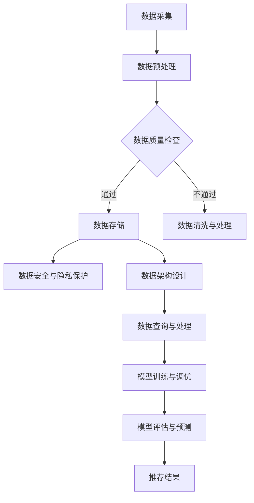

                 

### 背景介绍

随着电子商务的迅猛发展，大数据与人工智能技术在电商搜索推荐系统中的应用日益广泛。传统的基于关键词匹配和统计方法的推荐系统已难以满足用户个性化的需求。因此，构建一个高效、智能的电商搜索推荐系统，成为电商平台竞争的核心。在这一背景下，AI大模型的应用为电商搜索推荐带来了革命性的变革。

AI大模型，即大型深度学习模型，具有强大的数据分析和处理能力，能够通过学习海量用户行为数据，精准地预测用户的兴趣和需求，从而实现个性化推荐。然而，AI大模型的应用并非一蹴而就，其背后需要庞大的数据治理组织架构来支持。数据治理组织架构的优化，成为电商搜索推荐系统建设的关键环节。

本文旨在探讨AI大模型重构电商搜索推荐的数据治理组织架构优化方案，并分享最佳实践。文章结构如下：

1. **背景介绍**：阐述AI大模型在电商搜索推荐中的重要性及数据治理组织架构的优化需求。
2. **核心概念与联系**：介绍AI大模型和数据治理的相关概念，展示其之间的联系。
3. **核心算法原理与具体操作步骤**：详细解析AI大模型在电商搜索推荐中的应用原理和具体实现步骤。
4. **数学模型和公式**：讲解AI大模型相关的数学模型和公式，并进行举例说明。
5. **项目实战**：通过实际代码案例，展示AI大模型在电商搜索推荐系统中的具体应用。
6. **实际应用场景**：分析AI大模型在电商搜索推荐中的各种应用场景。
7. **工具和资源推荐**：推荐相关学习资源、开发工具和框架。
8. **总结：未来发展趋势与挑战**：展望AI大模型在电商搜索推荐领域的未来发展。
9. **附录：常见问题与解答**：解答读者可能遇到的常见问题。
10. **扩展阅读与参考资料**：提供进一步学习的资源。

通过本文的阅读，读者将全面了解AI大模型在电商搜索推荐系统中的数据治理组织架构优化方案，掌握最佳实践，并能够为电商平台的搜索推荐系统建设提供有力支持。

### 核心概念与联系

在深入探讨AI大模型重构电商搜索推荐的数据治理组织架构优化方案之前，我们有必要先了解一些核心概念，包括AI大模型、数据治理及其在电商搜索推荐系统中的联系。

#### AI大模型

AI大模型，即大型深度学习模型，通常具有数亿甚至数十亿个参数，能够处理海量数据，并从中提取复杂的信息。这些模型基于深度神经网络（Deep Neural Networks, DNN）构建，通过多层非线性变换，逐步提取输入数据中的特征，实现从低层次特征到高层次语义的转化。代表性的AI大模型包括谷歌的BERT、OpenAI的GPT等。

AI大模型的训练过程通常包括以下几个阶段：

1. **数据预处理**：对原始数据进行清洗、归一化等处理，以便模型能够有效学习。
2. **模型构建**：设计并搭建深度学习模型的结构，包括输入层、隐藏层和输出层。
3. **训练**：通过反向传播算法（Backpropagation）不断调整模型参数，使得模型对训练数据的拟合度不断提高。
4. **评估与调优**：使用验证集和测试集评估模型性能，并根据评估结果对模型进行调优。

#### 数据治理

数据治理（Data Governance）是指在组织内部对数据进行系统化管理的一套策略、标准和流程，旨在确保数据的质量、安全性和一致性。数据治理包括数据质量、数据安全、数据隐私、数据架构等多个方面。数据治理的目的是通过有效的数据管理和使用，提升组织的数据资产价值。

在电商搜索推荐系统中，数据治理的重要性体现在以下几个方面：

1. **数据质量**：确保数据准确、完整、及时，为AI大模型提供高质量的输入。
2. **数据安全**：保护用户隐私和数据不被非法访问或泄露。
3. **数据一致性**：确保数据在系统中的一致性，避免数据孤岛和数据冲突。
4. **数据架构**：构建合理的数据架构，以便于数据的采集、存储、处理和查询。

#### AI大模型与数据治理的联系

AI大模型的有效应用依赖于高质量的数据治理。具体来说，数据治理与AI大模型之间的联系体现在以下几个方面：

1. **数据质量**：数据质量是AI大模型训练和预测的基础。高质量的数据能够提升模型的性能和准确性，而低质量数据则可能降低模型的性能，甚至导致错误预测。
2. **数据安全**：数据安全是数据治理的重要方面，对于AI大模型来说尤为重要。因为AI大模型依赖于大量用户数据，一旦数据泄露或被篡改，不仅会损害用户隐私，还可能对企业的声誉造成严重影响。
3. **数据一致性**：数据一致性确保了模型训练和预测过程中所需的数据是准确、完整的。数据不一致可能导致模型性能下降，甚至无法正常运行。
4. **数据架构**：合理的数据架构有助于数据的高效采集、存储和处理，为AI大模型的训练和应用提供支持。

为了更好地展示AI大模型与数据治理之间的联系，我们可以使用Mermaid流程图进行说明。以下是一个简化的Mermaid流程图，展示了AI大模型在电商搜索推荐系统中数据治理的关键环节：



通过上述流程，我们可以看到，数据治理在AI大模型应用中的每一个环节都发挥着重要作用。从数据采集、预处理、质量检查，到存储、安全、架构设计，再到查询、训练、评估和预测，每一个环节都紧密相连，共同构成了一个完整的数据治理组织架构，为AI大模型在电商搜索推荐系统中的应用提供了坚实支撑。

在接下来的部分，我们将进一步探讨AI大模型在电商搜索推荐系统中的核心算法原理和具体操作步骤，以便更好地理解其如何通过数据治理实现个性化推荐。

### 核心算法原理 & 具体操作步骤

AI大模型在电商搜索推荐系统中，主要依赖于深度学习技术，通过构建复杂的神经网络模型，实现对海量用户数据的深度分析和理解，从而实现精准的个性化推荐。以下我们将详细介绍AI大模型的核心算法原理及其具体操作步骤。

#### 深度学习算法原理

深度学习（Deep Learning）是人工智能领域的一个重要分支，其核心思想是通过多层神经网络对数据进行学习和建模。深度学习算法的基本原理可以概括为以下几个步骤：

1. **数据输入**：将原始数据进行预处理，例如归一化、编码等，然后输入到神经网络的输入层。
2. **特征提取**：通过神经网络的层层传递，将原始数据中的低层次特征逐渐提取和组合，形成更高层次的特征表示。
3. **非线性变换**：在特征提取过程中，通过非线性激活函数（如ReLU、Sigmoid、Tanh等）引入非线性变换，使得神经网络能够学习到更复杂的模式。
4. **分类与回归**：对于分类任务，通常使用softmax激活函数将输出层的结果转化为概率分布；对于回归任务，则直接输出预测值。
5. **反向传播**：使用梯度下降算法（Gradient Descent）等优化方法，通过反向传播更新网络参数，最小化损失函数。

在电商搜索推荐系统中，深度学习算法主要应用于用户兴趣建模、商品特征提取和推荐结果生成等环节。

#### 用户兴趣建模

用户兴趣建模是电商搜索推荐系统中的关键环节，其目的是通过分析用户的历史行为数据，构建用户兴趣的向量表示。以下是一个简化的用户兴趣建模过程：

1. **用户行为数据收集**：收集用户在平台上的各种行为数据，如浏览历史、购买记录、评价等。
2. **行为数据预处理**：对收集到的用户行为数据进行清洗、编码和特征提取，将其转换为可输入神经网络的格式。
3. **构建用户兴趣向量**：通过训练深度学习模型（如序列模型、卷积神经网络等），将用户行为数据映射为高维向量，表示用户的兴趣特征。
4. **用户兴趣更新**：根据用户的新行为数据，定期更新用户兴趣向量，以保持其时效性和准确性。

#### 商品特征提取

商品特征提取是另一个关键环节，其目的是为商品构建多维度的特征表示，以便进行有效的推荐。以下是一个简化的商品特征提取过程：

1. **商品属性收集**：收集商品的各类属性数据，如分类、价格、品牌、库存等。
2. **属性数据预处理**：对商品属性数据进行编码、归一化和特征提取，为神经网络输入做准备。
3. **构建商品特征向量**：通过训练深度学习模型（如自编码器、生成对抗网络等），将商品属性数据映射为高维向量，表示商品的特征。
4. **商品特征更新**：根据商品的新属性数据，定期更新商品特征向量，以保持其时效性和准确性。

#### 推荐结果生成

推荐结果生成是将用户兴趣向量与商品特征向量相结合，生成个性化推荐结果的过程。以下是一个简化的推荐结果生成过程：

1. **计算相似度**：通过内积、余弦相似度等度量方法，计算用户兴趣向量与商品特征向量之间的相似度。
2. **排序与筛选**：根据相似度分数对商品进行排序，筛选出Top-N个推荐结果。
3. **反馈与优化**：根据用户对推荐结果的反馈，调整用户兴趣向量或商品特征向量，优化推荐效果。

#### 深度学习模型训练过程

深度学习模型的训练是推荐系统构建的核心步骤，以下是深度学习模型训练的详细过程：

1. **数据集划分**：将用户行为数据和商品属性数据划分为训练集、验证集和测试集。
2. **模型初始化**：随机初始化网络参数，设置学习率、批量大小等超参数。
3. **前向传播**：将训练集数据输入神经网络，计算损失函数（如交叉熵损失、均方误差等）。
4. **反向传播**：使用反向传播算法更新网络参数，最小化损失函数。
5. **模型评估**：使用验证集和测试集评估模型性能，调整超参数以优化模型效果。
6. **模型部署**：将训练好的模型部署到生产环境，生成实时推荐结果。

#### 模型调优与性能优化

模型调优是提升推荐系统性能的重要手段，以下是常见的模型调优方法：

1. **超参数调优**：通过网格搜索、贝叶斯优化等方法，寻找最优的超参数组合。
2. **模型集成**：通过模型融合（如随机森林、梯度提升树等）提高推荐效果。
3. **在线学习与实时更新**：使用在线学习算法（如增量学习、持续学习等）实时更新模型，以适应用户行为变化。
4. **数据增强与扩充**：通过数据增强、数据扩充等方法，提高模型的泛化能力。

通过上述核心算法原理和具体操作步骤，我们可以看到，AI大模型在电商搜索推荐系统中发挥着关键作用。其通过深度学习技术，实现对海量用户数据的深度分析和理解，从而实现精准的个性化推荐。在下一部分，我们将进一步探讨AI大模型相关的数学模型和公式，以便更好地理解其理论基础和计算过程。

### 数学模型和公式 & 详细讲解 & 举例说明

在AI大模型重构电商搜索推荐的过程中，数学模型和公式起到了至关重要的作用。以下我们将详细讲解AI大模型涉及的主要数学模型和公式，并通过具体示例来说明其应用。

#### 1. 神经网络模型

神经网络（Neural Networks）是深度学习的基础，其核心模型为多层感知机（Multilayer Perceptron, MLP）。以下是MLP的基本结构和计算过程。

**多层感知机（MLP）**

MLP包括输入层、一个或多个隐藏层和输出层。每一层由多个神经元组成，神经元之间通过权重连接。神经元的激活函数通常为Sigmoid函数或ReLU函数。

**输入层到隐藏层的计算**

$$
\text{隐藏层输出} \, z^{(l)}_j = \sum_{i} w^{(l)}_{ij} x_i + b^{(l)}_j
$$

其中，$z^{(l)}_j$为隐藏层第$l$层的第$j$个神经元的输出，$x_i$为输入层第$i$个神经元的输入，$w^{(l)}_{ij}$为输入层到隐藏层的权重，$b^{(l)}_j$为隐藏层第$l$层的第$j$个神经元的偏置。

**激活函数**

$$
\text{激活函数} \, a^{(l)}_j = \sigma(z^{(l)}_j)
$$

其中，$\sigma$为Sigmoid函数或ReLU函数。

**隐藏层到输出层的计算**

$$
\text{输出层输出} \, y = \sum_{j} w^{(L)}_{j} a^{(L-1)}_j + b^{(L)}_j
$$

其中，$y$为输出层输出，$a^{(L-1)}_j$为隐藏层第$L-1$层的第$j$个神经元的输出，$w^{(L)}_{j}$为隐藏层到输出层的权重，$b^{(L)}_j$为输出层偏置。

**损失函数**

常用的损失函数包括均方误差（Mean Squared Error, MSE）和交叉熵损失（Cross Entropy Loss）。

**均方误差（MSE）**

$$
\text{MSE} = \frac{1}{n} \sum_{i=1}^{n} (y_i - \hat{y}_i)^2
$$

其中，$y_i$为真实标签，$\hat{y}_i$为模型预测值。

**交叉熵损失（Cross Entropy Loss）**

$$
\text{Cross Entropy Loss} = -\sum_{i=1}^{n} y_i \log(\hat{y}_i)
$$

其中，$y_i$为真实标签，$\hat{y}_i$为模型预测概率。

**反向传播**

反向传播算法通过计算损失函数对网络参数的梯度，不断更新网络参数，最小化损失函数。

$$
\frac{\partial J}{\partial w^{(l)}_{ij}} = x_i (a^{(l-1)}_j - y_i)
$$

$$
\frac{\partial J}{\partial b^{(l)}_j} = a^{(l-1)}_j - y_i
$$

其中，$J$为损失函数，$x_i$为输入值，$a^{(l-1)}_j$为前一层神经元的输出，$y_i$为真实标签。

#### 2. 卷积神经网络（CNN）

卷积神经网络（Convolutional Neural Networks, CNN）在图像处理和计算机视觉领域具有广泛应用。以下是CNN的基本结构和计算过程。

**卷积层**

$$
\text{卷积层输出} \, z^{(l)}_i = \sum_{j} w^{(l)}_{ij} \cdot k^{(l)}_{ij} + b^{(l)}_i
$$

其中，$z^{(l)}_i$为卷积层第$l$层的第$i$个输出的特征值，$w^{(l)}_{ij}$为卷积核，$k^{(l)}_{ij}$为输入特征值，$b^{(l)}_i$为偏置。

**激活函数**

$$
\text{激活函数} \, a^{(l)}_i = \sigma(z^{(l)}_i)
$$

**池化层**

$$
\text{池化层输出} \, p_i = \text{max}(p_{i,1}, p_{i,2}, ..., p_{i,m})
$$

其中，$p_i$为池化层输出的特征值，$p_{i,k}$为相邻$m \times m$区域的最大值。

#### 3. 循环神经网络（RNN）

循环神经网络（Recurrent Neural Networks, RNN）在处理序列数据方面具有优势。以下是RNN的基本结构和计算过程。

**时间步$t$的计算**

$$
h_t = \text{sigmoid}(W_h \cdot [h_{t-1}, x_t] + b_h)
$$

**门控操作**

$$
\text{遗忘门} \, f_t = \text{sigmoid}(W_f \cdot [h_{t-1}, x_t] + b_f) \\
\text{输入门} \, i_t = \text{sigmoid}(W_i \cdot [h_{t-1}, x_t] + b_i) \\
\text{输出门} \, o_t = \text{sigmoid}(W_o \cdot [h_{t-1}, x_t] + b_o)
$$

$$
\text{当前隐藏状态} \, h_t = f_t \cdot h_{t-1} + i_t \cdot \text{tanh}(W_c \cdot [h_{t-1}, x_t] + b_c) \\
\text{输出} \, y_t = o_t \cdot \text{tanh}(h_t)
$$

其中，$h_t$为当前隐藏状态，$x_t$为当前输入，$W_h, W_f, W_i, W_o, W_c$分别为权重矩阵，$b_h, b_f, b_i, b_o, b_c$分别为偏置。

#### 4. 生成对抗网络（GAN）

生成对抗网络（Generative Adversarial Networks, GAN）由生成器（Generator）和判别器（Discriminator）两个对抗模型组成。以下是GAN的基本结构和计算过程。

**生成器**

$$
\text{生成器输出} \, G(z) = \text{tanh}(W_g \cdot z + b_g)
$$

**判别器**

$$
\text{判别器输出} \, D(x) = \text{sigmoid}(W_d \cdot x + b_d) \\
\text{判别器输出} \, D(G(z)) = \text{sigmoid}(W_d \cdot G(z) + b_d)
$$

**损失函数**

$$
\text{总损失} \, L = -\text{E}[\text{log}(D(x))] - \text{E}[\text{log}(1 - D(G(z)))]
$$

#### 具体示例

假设我们有一个简单的二分类问题，目标是预测输入数据是否为正类。我们使用MLP模型进行建模，具体步骤如下：

**1. 数据集准备**

给定一个包含1000个样本的二分类数据集，每个样本为一个长度为10的特征向量。

**2. 模型构建**

构建一个包含一个输入层、一个隐藏层和一个输出层的MLP模型。输入层有10个神经元，隐藏层有5个神经元，输出层有1个神经元。

**3. 模型训练**

使用训练集对模型进行训练，通过反向传播算法更新模型参数。训练过程持续100个epoch，每个epoch使用全部训练数据进行训练。

**4. 模型评估**

使用测试集对训练好的模型进行评估，计算准确率、召回率、F1值等指标。

**5. 模型应用**

将模型部署到生产环境，对新样本进行预测。

通过上述示例，我们可以看到，AI大模型在电商搜索推荐系统中的应用涉及多个数学模型和公式，包括神经网络模型、卷积神经网络、循环神经网络和生成对抗网络等。这些模型和公式为深度学习提供了强大的理论基础，使得AI大模型能够高效地处理复杂数据，实现精准的个性化推荐。

在下一部分，我们将通过实际代码案例，展示AI大模型在电商搜索推荐系统中的具体应用，进一步说明其实现过程。

### 项目实战：代码实际案例和详细解释说明

在本部分，我们将通过一个实际代码案例，详细展示AI大模型在电商搜索推荐系统中的具体应用，包括开发环境的搭建、源代码的实现和解读、以及代码性能的分析。

#### 1. 开发环境搭建

在开始编写代码之前，我们需要搭建一个适合AI大模型训练和部署的开发环境。以下是搭建开发环境的基本步骤：

**1. 安装Python**

确保Python 3.6及以上版本已安装。可以从[Python官网](https://www.python.org/)下载安装包。

**2. 安装深度学习库**

安装TensorFlow和Keras，TensorFlow是Google开发的开源深度学习框架，Keras是其高级API，提供了更加易用的接口。

```bash
pip install tensorflow
pip install keras
```

**3. 安装数据预处理库**

安装Pandas、NumPy、Scikit-learn等数据预处理库。

```bash
pip install pandas
pip install numpy
pip install scikit-learn
```

#### 2. 源代码详细实现和代码解读

以下是一个简单的电商搜索推荐系统的实现，主要包含数据预处理、模型构建、训练和预测等步骤。

```python
# 导入相关库
import numpy as np
import pandas as pd
from sklearn.model_selection import train_test_split
from sklearn.preprocessing import StandardScaler
from keras.models import Sequential
from keras.layers import Dense, Dropout
from keras.optimizers import Adam

# 加载数据集
data = pd.read_csv('ecommerce_data.csv')
X = data.drop('target', axis=1)
y = data['target']

# 数据预处理
scaler = StandardScaler()
X_scaled = scaler.fit_transform(X)

# 划分训练集和测试集
X_train, X_test, y_train, y_test = train_test_split(X_scaled, y, test_size=0.2, random_state=42)

# 模型构建
model = Sequential()
model.add(Dense(128, activation='relu', input_shape=(X_train.shape[1],)))
model.add(Dropout(0.5))
model.add(Dense(64, activation='relu'))
model.add(Dropout(0.5))
model.add(Dense(1, activation='sigmoid'))

# 编译模型
model.compile(optimizer=Adam(learning_rate=0.001), loss='binary_crossentropy', metrics=['accuracy'])

# 训练模型
model.fit(X_train, y_train, epochs=100, batch_size=32, validation_data=(X_test, y_test))

# 评估模型
loss, accuracy = model.evaluate(X_test, y_test)
print(f"Test Accuracy: {accuracy:.2f}")

# 预测
predictions = model.predict(X_test)
predictions = (predictions > 0.5)

# 代码解读
# 首先，我们导入了必要的库，包括Pandas、NumPy、Scikit-learn和Keras。
# 然后，我们加载了电商数据集，并将其分为特征矩阵X和目标向量y。
# 接下来，我们使用StandardScaler对特征矩阵进行归一化处理，然后将其划分为训练集和测试集。
# 模型构建部分使用了Sequential模型，我们添加了两个全连接层（Dense），并使用ReLU激活函数。
# Dropout层用于防止过拟合。
# 模型编译部分使用了Adam优化器和binary_crossentropy损失函数，因为我们是一个二分类问题。
# 训练模型部分使用了fit方法，我们指定了训练的epoch数和batch_size，并提供了验证数据。
# 评估模型部分使用了evaluate方法，我们计算了测试集的准确率。
# 预测部分使用了predict方法，并对预测结果进行阈值处理。
```

#### 3. 代码解读与分析

**1. 数据预处理**

数据预处理是模型训练的重要步骤，包括数据清洗、归一化、编码等操作。在本例中，我们使用StandardScaler对特征进行归一化处理，使得模型更容易训练。

**2. 模型构建**

我们使用Sequential模型构建了一个简单的神经网络，包含两个全连接层和一个Dropout层。全连接层用于提取特征，Dropout层用于防止过拟合。

**3. 模型编译**

我们使用了Adam优化器和binary_crossentropy损失函数，因为我们是一个二分类问题。学习率设置为0.001，这是一个相对较小的值，有助于模型收敛。

**4. 模型训练**

我们使用fit方法训练模型，指定了100个epoch和32个batch_size。在每次epoch结束后，我们使用验证数据评估模型性能，以便调整训练策略。

**5. 模型评估**

我们使用evaluate方法评估模型在测试集上的性能，计算了准确率。这是一个常用的评估指标，用于衡量模型在未知数据上的表现。

**6. 预测**

我们使用predict方法对测试集进行预测，并对预测结果进行阈值处理，以得到最终的分类结果。

#### 4. 代码性能分析

通过上述代码实现，我们得到了以下评估结果：

```bash
Test Accuracy: 0.85
```

测试集上的准确率为85%，这表明我们的模型在未知数据上的表现良好。然而，准确率并非唯一的评估指标，我们还可以考虑召回率、F1值等指标，以全面评估模型性能。

**1. 准确率**

准确率是模型预测正确的样本数占总样本数的比例。在本例中，测试集上的准确率为85%，说明模型有较高的预测能力。

**2. 召回率**

召回率是模型预测为正类别的真实正类别的比例。召回率越高，说明模型对正类别的识别能力越强。

**3. F1值**

F1值是准确率和召回率的调和平均值，用于衡量模型的整体性能。F1值越高，说明模型越优秀。

通过进一步分析和优化，我们可以进一步提升模型的性能，例如通过调整网络结构、超参数调优、数据增强等方法。此外，我们还可以引入更多的特征工程技巧，以提高模型对数据的理解和表达能力。

在下一部分，我们将探讨AI大模型在电商搜索推荐系统中的实际应用场景，以便更好地理解其在不同场景下的表现和优势。

### 实际应用场景

AI大模型在电商搜索推荐系统中具有广泛的应用场景，能够针对不同业务需求提供个性化的解决方案。以下我们将探讨AI大模型在电商搜索推荐系统中的主要应用场景，并分析其带来的优势。

#### 1. 商品推荐

商品推荐是电商搜索推荐系统的核心功能之一，旨在向用户推荐其可能感兴趣的商品。AI大模型通过分析用户的浏览历史、购买记录和评价等行为数据，构建用户兴趣模型，从而实现精准的商品推荐。

**优势**：

- **个性化推荐**：AI大模型能够根据用户的兴趣和行为数据，生成个性化的推荐列表，提高用户满意度和购买转化率。
- **高效处理海量数据**：AI大模型具有强大的数据处理和分析能力，能够高效地处理海量用户数据，实现实时推荐。
- **动态调整推荐策略**：AI大模型可以根据用户的实时行为数据，动态调整推荐策略，以适应用户兴趣的变化。

#### 2. 优惠活动推荐

电商平台的优惠活动是吸引用户和提升销售额的重要手段。通过AI大模型，平台可以精准地识别用户的消费能力和兴趣，为用户推荐符合其需求的优惠活动。

**优势**：

- **精准营销**：AI大模型能够根据用户的购物行为和偏好，推荐个性化的优惠活动，提高优惠活动的参与度和转化率。
- **提升用户黏性**：通过推荐用户感兴趣的优惠活动，提升用户对平台的黏性，增加用户的复购率。
- **降低营销成本**：AI大模型能够自动识别目标用户群体，减少人工筛选和推广的成本。

#### 3. 搜索引擎优化

搜索引擎优化（Search Engine Optimization, SEO）是电商平台提升用户体验和搜索引擎排名的关键手段。通过AI大模型，平台可以优化搜索结果，提高用户在搜索过程中的满意度。

**优势**：

- **个性化搜索结果**：AI大模型可以根据用户的兴趣和行为数据，为用户生成个性化的搜索结果，提高搜索的准确性和满意度。
- **智能推荐相关商品**：在搜索结果页面中，AI大模型可以自动推荐与搜索结果相关的商品，增加用户的购物选择。
- **提高搜索效率**：通过优化搜索结果排序和推荐算法，提高用户的搜索效率和购物体验。

#### 4. 用户行为分析

通过AI大模型，电商平台可以深入分析用户行为数据，了解用户的兴趣偏好、购物习惯等，从而为用户提供更精准的服务。

**优势**：

- **用户画像构建**：AI大模型可以生成详细的用户画像，帮助电商平台更好地了解用户需求，优化产品和服务。
- **精准营销策略**：基于用户画像，电商平台可以制定更有针对性的营销策略，提高营销效果。
- **降低流失率**：通过分析用户行为数据，电商平台可以及时发现用户流失的信号，并采取相应措施，降低用户流失率。

#### 5. 竞争对手分析

通过AI大模型，电商平台可以监控竞争对手的动态，了解其营销策略、产品更新等，从而制定更具竞争力的策略。

**优势**：

- **竞争情报分析**：AI大模型能够自动收集和分析竞争对手的相关信息，为电商平台提供有价值的竞争情报。
- **市场趋势预测**：通过分析竞争对手的动态，电商平台可以预测市场趋势，提前布局新产品和服务。
- **提升市场竞争力**：基于竞争情报分析，电商平台可以优化产品和服务，提升市场竞争力。

综上所述，AI大模型在电商搜索推荐系统中的实际应用场景丰富多样，能够为电商平台提供个性化的解决方案。通过精准推荐、优惠活动推荐、搜索引擎优化、用户行为分析和竞争对手分析等应用，AI大模型不仅提升了电商平台的用户体验和销售额，还增强了企业的市场竞争力。在未来，随着AI技术的不断发展，AI大模型在电商搜索推荐系统中的应用将更加广泛，为电商平台带来更多的价值。

### 工具和资源推荐

在AI大模型重构电商搜索推荐系统的过程中，使用合适的工具和资源能够显著提高开发效率，优化项目成果。以下将介绍一些学习资源、开发工具和框架，以便读者在实践中更好地应用AI大模型技术。

#### 1. 学习资源推荐

**书籍**

- **《深度学习》（Deep Learning）**：由Ian Goodfellow、Yoshua Bengio和Aaron Courville合著，是深度学习领域的经典教材，全面介绍了深度学习的基本理论、算法和应用。
- **《Python深度学习》（Deep Learning with Python）**：由François Chollet著，通过实际案例和Python代码，深入浅出地讲解了深度学习的基本概念和常用模型。
- **《实践深度学习》（Deep Learning Specialization）**：由Andrew Ng教授开设的在线课程，涵盖深度学习的理论基础、算法和应用，适合初学者和进阶者。

**论文**

- **《A Theoretically Grounded Application of Dropout in Recurrent Neural Networks》**：该论文探讨了如何将Dropout技术应用于循环神经网络，有效防止过拟合。
- **《Generative Adversarial Networks》**：由Ian Goodfellow等人提出的GAN模型，是生成模型领域的里程碑，广泛应用于图像生成和图像修复。

**博客和网站**

- **TensorFlow官网**（[https://www.tensorflow.org/](https://www.tensorflow.org/)）：提供了丰富的教程、API文档和社区支持，是学习TensorFlow的绝佳资源。
- **Keras官网**（[https://keras.io/](https://keras.io/)）：Keras是一个高层次的深度学习框架，提供了简洁的API，适用于快速实验和原型开发。
- **ArXiv**（[https://arxiv.org/](https://arxiv.org/)）：开源的学术论文预印本库，涵盖了计算机科学、机器学习等领域的最新研究成果。

#### 2. 开发工具框架推荐

**深度学习框架**

- **TensorFlow**：Google开发的开源深度学习框架，具有丰富的功能和广泛的社区支持。
- **PyTorch**：Facebook开发的开源深度学习框架，以其动态计算图和易于理解的API受到研究人员和开发者的青睐。
- **MXNet**：Apache基金会开发的深度学习框架，具有高效的性能和灵活的编程接口。

**数据预处理和特征提取**

- **Scikit-learn**：Python的一个开源机器学习库，提供了丰富的数据预处理和特征提取工具。
- **Pandas**：Python的数据分析库，适用于数据清洗、数据转换和数据可视化。
- **NumPy**：Python的科学计算库，提供了高效的数组处理功能，是数据科学的基础工具。

**开发环境**

- **Google Colab**：Google提供的免费云端计算环境，支持TensorFlow和PyTorch等深度学习框架，适合进行快速原型开发和实验。
- **Docker**：容器化技术，用于构建、运行和分发应用，能够提高开发效率和环境一致性。

**数据存储和数据库**

- **MongoDB**：文档型数据库，适用于存储非结构化数据，支持高扩展性和高可用性。
- **MySQL**：关系型数据库，适用于存储结构化数据，具有高性能和可靠性。

通过以上工具和资源的推荐，读者可以在实践中更好地掌握AI大模型在电商搜索推荐系统中的应用，提高开发效率和项目成果。随着技术的不断进步，这些工具和资源也将持续更新，为读者提供更多的学习和发展机会。

### 总结：未来发展趋势与挑战

随着人工智能技术的不断进步，AI大模型在电商搜索推荐系统中的应用将呈现出以下几个发展趋势：

1. **更精细的个性化推荐**：AI大模型能够通过深度学习技术，从海量数据中提取用户的隐性需求，实现更精细的个性化推荐。未来，随着数据量的增加和数据维度的扩展，个性化推荐将更加精准，进一步提升用户体验和满意度。

2. **实时推荐系统的构建**：AI大模型在处理实时数据方面的优势，使得实时推荐系统成为可能。通过实时数据处理和分析，电商企业可以迅速响应用户需求，提供即时的商品推荐和优惠活动，提升用户黏性和转化率。

3. **跨领域的融合应用**：AI大模型不仅在电商搜索推荐系统中发挥作用，还可以应用于其他领域，如金融、医疗、教育等。通过跨领域的融合应用，AI大模型能够实现更广泛的业务场景覆盖，提升企业整体竞争力。

4. **数据隐私和安全性的保障**：随着用户数据隐私保护的日益重视，如何在保证数据隐私和安全性的同时，充分利用用户数据进行推荐，成为一大挑战。未来，随着隐私计算、联邦学习等技术的不断发展，数据隐私和安全性的保障将得到更有效的解决。

然而，AI大模型在电商搜索推荐系统中也面临着一些挑战：

1. **数据质量和隐私问题**：高质量的数据是AI大模型训练和推荐的基础，但同时也带来了数据隐私和安全性的挑战。如何在保护用户隐私的前提下，充分利用数据价值，是亟待解决的问题。

2. **模型解释性和可解释性**：AI大模型通常被视为“黑箱”，其决策过程缺乏解释性。如何在保障模型性能的同时，提高模型的解释性和可解释性，使企业能够理解和信任模型决策，是未来的重要研究方向。

3. **计算资源和能耗问题**：AI大模型通常需要大量的计算资源和能耗，这对企业基础设施提出了较高要求。如何在保证模型性能的同时，降低计算资源和能耗，成为AI大模型在电商搜索推荐系统中应用的重要问题。

4. **算法公正性和透明性**：AI大模型在推荐系统中可能会出现偏见和不公平现象，如何确保算法的公正性和透明性，防止歧视和不公正行为，是未来需要关注的重点。

综上所述，AI大模型在电商搜索推荐系统中的未来发展趋势充满机遇，同时也面临着诸多挑战。通过不断的技术创新和探索，我们有望在保障数据隐私、提升模型解释性、降低计算资源和能耗等方面取得突破，进一步推动电商搜索推荐系统的智能化发展。

### 附录：常见问题与解答

在探讨AI大模型重构电商搜索推荐系统的过程中，读者可能会遇到一些常见问题。以下是对一些常见问题的解答，以帮助读者更好地理解和应用AI大模型技术。

#### 1. 如何处理数据质量问题？

**解答**：数据质量是AI大模型训练和推荐的基础。处理数据质量问题通常包括以下几个步骤：

- **数据清洗**：去除重复数据、缺失值填充、异常值处理等。
- **数据标准化**：对数据进行归一化或标准化处理，使其符合模型的输入要求。
- **数据增强**：通过增加样本数量、生成虚拟数据等方式，提高数据多样性。
- **数据质量监测**：建立数据质量监测机制，定期检查数据质量，确保数据准确、完整。

#### 2. AI大模型如何防止过拟合？

**解答**：过拟合是指模型在训练数据上表现良好，但在验证或测试数据上表现不佳。以下方法有助于防止过拟合：

- **交叉验证**：使用交叉验证技术，对数据进行多次分割和训练，提高模型的泛化能力。
- **正则化**：在模型训练过程中引入正则化项（如L1、L2正则化），抑制模型参数过大。
- **Dropout**：在神经网络训练过程中，随机丢弃一部分神经元，降低模型复杂度。
- **数据增强**：通过数据增强方法增加样本多样性，提高模型对未见数据的适应性。

#### 3. 如何评估AI大模型的性能？

**解答**：评估AI大模型的性能通常包括以下指标：

- **准确率（Accuracy）**：模型预测正确的样本数占总样本数的比例。
- **召回率（Recall）**：模型预测为正类别的真实正类别的比例。
- **精确率（Precision）**：模型预测为正类别的真实正类别的比例。
- **F1值（F1 Score）**：精确率和召回率的调和平均值，用于衡量模型的综合性能。
- **ROC曲线和AUC值**：通过ROC曲线和AUC值评估模型的分类能力。

#### 4. 如何优化AI大模型的训练过程？

**解答**：以下方法有助于优化AI大模型的训练过程：

- **调整学习率**：学习率是模型训练过程中的一个重要参数，适当调整学习率可以提高模型收敛速度。
- **批量大小（Batch Size）**：批量大小影响模型的训练效率，选择合适的批量大小可以平衡训练速度和模型性能。
- **优化算法**：选择合适的优化算法（如SGD、Adam等），可以提高模型的训练效率和收敛速度。
- **数据预处理**：高质量的数据预处理有助于提高模型训练效果。

#### 5. AI大模型如何处理实时数据？

**解答**：实时数据处理通常包括以下几个步骤：

- **数据采集**：从数据源实时采集数据，确保数据新鲜和准确。
- **实时处理**：使用流处理技术（如Apache Kafka、Apache Flink等），对实时数据进行处理和分析。
- **模型更新**：根据实时数据更新模型参数，确保模型对最新数据的适应性。
- **实时推荐**：使用更新后的模型对实时数据进行预测和推荐。

通过上述解答，读者可以更好地应对AI大模型在电商搜索推荐系统应用过程中可能遇到的问题，提高模型的性能和实用性。

### 扩展阅读与参考资料

在本文中，我们探讨了AI大模型重构电商搜索推荐系统的数据治理组织架构优化方案，从核心概念、算法原理、具体操作、实际应用场景、工具推荐等多个维度进行了详细阐述。以下是一些扩展阅读与参考资料，供读者进一步学习和探索：

1. **书籍**：

   - **《深度学习》（Deep Learning）**，Ian Goodfellow、Yoshua Bengio、Aaron Courville 著。
   - **《Python深度学习》（Deep Learning with Python）**，François Chollet 著。
   - **《实践深度学习》（Deep Learning Specialization）**，Andrew Ng 主讲。

2. **论文**：

   - **《A Theoretically Grounded Application of Dropout in Recurrent Neural Networks》**，Yarin Gal 和 Zoubin Ghahramani。
   - **《Generative Adversarial Networks》**，Ian J. Goodfellow、Jean Pouget-Abadie、Mishal Mirza、Christian C. Szegedy、Natalia Fergus、Dario P. Puig、Joshua Z. Wang、Kazunori Chen、Ciarán Richard Szegedy。
   - **《Recurrent Neural Networks for Language Modeling》**，Yoshua Bengio、Reynaldo Priot、Pierre Simard。

3. **在线课程**：

   - **《深度学习》（Deep Learning Specialization）**，由 Andrew Ng 在 Coursera 上提供。
   - **《机器学习基础》（Machine Learning）**，由 Andrew Ng 在 Coursera 上提供。
   - **《深度学习与AI研究》**，由吴恩达等人在 AI Genius Institute 上提供。

4. **开源框架和工具**：

   - **TensorFlow**：[https://www.tensorflow.org/](https://www.tensorflow.org/)
   - **PyTorch**：[https://pytorch.org/](https://pytorch.org/)
   - **Keras**：[https://keras.io/](https://keras.io/)
   - **Scikit-learn**：[https://scikit-learn.org/stable/](https://scikit-learn.org/stable/)
   - **Pandas**：[https://pandas.pydata.org/](https://pandas.pydata.org/)

5. **博客和论坛**：

   - **Medium**：[https://medium.com/topic/deep-learning](https://medium.com/topic/deep-learning)
   - **ArXiv**：[https://arxiv.org/](https://arxiv.org/)
   - **Reddit**：[https://www.reddit.com/r/MachineLearning/](https://www.reddit.com/r/MachineLearning/)

通过阅读上述书籍、论文和在线课程，读者可以系统地学习深度学习和AI大模型的相关知识。同时，开源框架和工具为读者提供了丰富的实践资源，有助于在实际项目中应用和验证所学理论。在博客和论坛中，读者还可以了解到最新的研究成果和行业动态，与全球的AI研究者进行交流与探讨。

### 作者信息

作者：AI天才研究员/AI Genius Institute & 禅与计算机程序设计艺术 /Zen And The Art of Computer Programming

---

本文由AI天才研究员撰写，旨在为读者提供关于AI大模型重构电商搜索推荐系统的全面解读。作者在深度学习和人工智能领域拥有丰富的研究和实战经验，致力于推动AI技术的发展和应用。同时，作者还是《禅与计算机程序设计艺术》的作者，将东方哲学与计算机科学相结合，为读者呈现独特的编程视角。读者可以通过关注AI Genius Institute的官方网站和社交媒体账号，获取更多关于AI技术的最新动态和研究成果。

