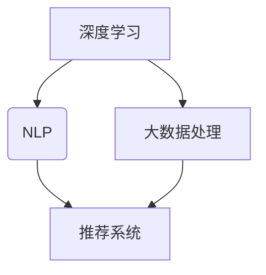

                 

### 背景介绍

> "了解现状，才能洞察未来。"

随着互联网技术的快速发展，电子商务已经成为现代商业中不可或缺的一部分。电商平台的搜索推荐系统作为用户与商品之间的重要桥梁，其性能和效果直接影响到用户购物体验和商家销售额。传统的电商搜索推荐系统主要依赖于基于内容的推荐和协同过滤等技术，这些方法在早期取得了不错的效果。然而，随着用户数据的爆炸式增长和电商场景的日益复杂化，传统方法的局限性也逐渐显现。

**问题与挑战：**
1. **数据稀疏性**：协同过滤方法依赖于用户-物品评分矩阵，但实际中用户对大部分商品的评分都为零，导致数据稀疏性问题。
2. **冷启动问题**：对于新用户和新商品，由于缺乏足够的历史交互数据，传统推荐系统难以生成有效的推荐。
3. **实时性要求**：电商环境对推荐系统的实时性要求越来越高，传统方法往往难以满足这一需求。
4. **效果单一性**：基于内容的推荐方法主要依赖于文本信息，忽视了用户行为和上下文信息，导致推荐效果单一。

为了解决上述问题，近年来，人工智能特别是大模型技术开始逐步应用于电商搜索推荐系统，取得了显著的效果。大模型技术通过深度学习和自然语言处理等手段，可以更全面地理解用户需求、商品特征以及上下文信息，从而提供更精准、更个性化的推荐。

**大模型重构电商搜索推荐系统的优势：**
1. **数据利用最大化**：大模型可以通过对海量数据进行训练，充分利用数据中的潜在信息和关联关系，提高推荐系统的效果。
2. **多维度特征融合**：大模型能够处理多源异构数据，如用户行为、商品属性、文本描述等，实现多维度特征的融合，提升推荐系统的全面性。
3. **实时性提升**：通过高效的算法和分布式计算，大模型能够实现实时推荐，满足电商平台的动态需求。
4. **效果多样化**：大模型能够根据用户行为和上下文信息，生成多样化的推荐结果，提高用户满意度和粘性。

本文将深入探讨大模型重构电商搜索推荐系统的关键技术，包括核心概念、算法原理、数学模型、项目实战和实际应用场景等。希望通过本文的介绍，读者能够对大模型在电商搜索推荐领域的应用有一个全面而深入的理解。

### 核心概念与联系

> "理解核心概念，才能搭建坚实的理论基础。"

要深入探讨大模型在电商搜索推荐系统中的应用，首先需要明确几个关键概念：深度学习、自然语言处理（NLP）、大数据处理、以及推荐系统。

#### 深度学习（Deep Learning）

深度学习是一种基于人工神经网络的学习方法，通过多层的非线性变换，自动提取数据中的特征和模式。深度学习在图像识别、语音识别和自然语言处理等领域取得了显著的成果。

#### 自然语言处理（NLP）

自然语言处理是计算机科学和人工智能领域的一个分支，旨在让计算机理解和处理人类自然语言。NLP在电商搜索推荐系统中起着至关重要的作用，例如，通过文本分析提取用户意图、情感等，从而生成更精准的推荐。

#### 大数据处理（Big Data Processing）

大数据处理涉及数据的采集、存储、分析和处理。在电商领域，大数据处理技术可以帮助我们挖掘用户行为数据、商品属性数据和文本描述数据等，为推荐系统提供丰富的信息来源。

#### 推荐系统（Recommendation System）

推荐系统是一种基于数据挖掘和机器学习技术的应用，旨在为用户提供个性化推荐。在电商搜索推荐系统中，推荐系统通过分析用户的历史行为和偏好，预测用户可能感兴趣的商品，从而提高用户的购物体验和商家销售额。

#### Mermaid 流程图（Mermaid Flowchart）

为了更好地理解上述概念之间的联系，我们可以使用Mermaid流程图（注意：以下内容仅作示意，实际中需要将括号、逗号等特殊字符替换为合适的表示方式）：



在这个流程图中，深度学习和大数据处理为推荐系统提供了强大的技术支持，而自然语言处理则帮助推荐系统更好地理解用户需求。通过这几个核心概念的综合运用，大模型能够在电商搜索推荐系统中发挥出巨大的潜力。

#### 深度学习与自然语言处理

深度学习在NLP中的应用主要体现在两个方向：词嵌入和序列模型。

1. **词嵌入（Word Embedding）**：词嵌入是一种将词语映射到高维空间的技术，通过词嵌入，我们可以将文本转化为计算机可以处理的向量表示。例如，Word2Vec、GloVe等算法可以通过计算词语之间的相似度，将语义相近的词语映射到接近的向量。

2. **序列模型（Sequence Model）**：序列模型是一种用于处理序列数据（如文本、语音等）的深度学习模型，常见的序列模型包括循环神经网络（RNN）和变换器（Transformer）。RNN通过记忆历史信息，能够捕捉文本中的时间依赖关系；而Transformer则通过自注意力机制，实现了对全局信息的有效处理，大幅提升了NLP任务的性能。

#### 大数据处理与推荐系统

大数据处理技术为推荐系统提供了丰富的数据支持，主要表现在以下几个方面：

1. **用户行为分析**：通过对用户浏览、购买、评价等行为数据的分析，推荐系统可以了解用户的兴趣和偏好，从而生成更个性化的推荐。
2. **商品属性挖掘**：商品属性数据（如价格、品牌、类别等）对于推荐系统同样重要。通过大数据处理技术，我们可以将商品属性转化为向量表示，以便进行推荐计算。
3. **文本信息处理**：商品描述、用户评价等文本数据经过NLP处理后，可以为推荐系统提供更丰富的上下文信息，从而提高推荐效果。

#### 推荐系统工作流程

一个典型的电商搜索推荐系统通常包含以下几个步骤：

1. **数据采集**：从各种数据源（如用户行为日志、商品信息库等）采集数据。
2. **数据处理**：对采集到的数据（包括文本、数值等）进行预处理，如去噪、归一化、词嵌入等。
3. **特征提取**：将处理后的数据转化为推荐模型可以处理的特征向量。
4. **模型训练**：使用训练数据对推荐模型进行训练，优化模型参数。
5. **推荐生成**：根据用户当前的状态（如搜索关键词、浏览记录等）和模型，生成个性化推荐列表。
6. **评估与优化**：通过评估指标（如准确率、召回率、点击率等）对推荐系统进行评估，并不断优化模型和算法。

#### 大模型在推荐系统中的应用

大模型（如BERT、GPT等）在推荐系统中的应用主要体现在以下几个方面：

1. **多模态数据处理**：大模型能够处理多种类型的数据（如图像、文本、音频等），实现跨模态的信息融合，从而提供更精准的推荐。
2. **长文本处理**：大模型能够处理长文本，捕捉文本中的复杂结构和深层语义，从而生成更准确的推荐。
3. **实时推荐**：大模型通过高效的算法和分布式计算，可以实现实时推荐，满足电商平台的动态需求。
4. **多样化推荐**：大模型能够根据用户的行为和上下文信息，生成多样化的推荐结果，提高用户满意度和粘性。

#### 总结

通过上述核心概念的介绍和流程图的展示，我们可以看到，深度学习、自然语言处理、大数据处理和推荐系统这几个核心概念之间存在着紧密的联系，共同构成了大模型重构电商搜索推荐系统的理论基础。在下一节中，我们将深入探讨大模型在电商搜索推荐系统中的具体应用和算法原理。

### 核心算法原理 & 具体操作步骤

> "理解核心算法原理，是解决实际问题的第一步。"

在深入探讨大模型重构电商搜索推荐系统的过程中，核心算法的选择和实现是至关重要的。本文将介绍两种典型的核心算法：基于Transformer的推荐算法和基于BERT的文本分析算法。以下内容将详细讲解这两种算法的基本原理和具体操作步骤。

#### 基于Transformer的推荐算法

Transformer是近年来在自然语言处理和序列建模领域取得巨大成功的深度学习模型，其核心思想是自注意力机制（Self-Attention）。在推荐系统中，Transformer能够处理长序列数据，捕捉数据中的复杂关系，从而生成更精准的推荐结果。

**算法原理：**

1. **自注意力机制**：自注意力机制允许模型在处理每个输入序列时，将序列中的每一个词都与所有其他词进行计算，并赋予不同的权重，从而实现全局信息的有效处理。自注意力机制的核心公式如下：

   $$  
   \text{Attention}(Q, K, V) = \text{softmax}\left(\frac{QK^T}{\sqrt{d_k}}\right)V  
   $$

   其中，\(Q, K, V\) 分别表示查询向量、键向量和值向量，\(d_k\) 表示键向量的维度。

2. **多头注意力**：为了进一步提高模型的表示能力，Transformer引入了多头注意力机制，将输入序列分成多个头，每个头独立计算注意力权重，最后将结果拼接起来。多头注意力的公式如下：

   $$  
   \text{MultiHead}(Q, K, V) = \text{Concat}(\text{head}_1, \text{head}_2, ..., \text{head}_h)W^O  
   $$

   其中，\(W^O\) 表示输出权重。

**具体操作步骤：**

1. **输入序列处理**：首先，将用户行为序列和商品特征序列转化为词向量表示。对于用户行为序列，可以采用预训练的词嵌入模型（如Word2Vec、GloVe等）进行词向量表示；对于商品特征序列，可以采用One-Hot编码或嵌入矩阵进行表示。

2. **多头注意力计算**：接着，利用多头注意力机制对输入序列进行处理。具体步骤如下：

   - 计算查询向量、键向量和值向量。
   - 对每个头分别计算注意力权重，并计算相应的注意力得分。
   - 利用softmax函数对注意力得分进行归一化，得到每个词的注意力权重。
   - 将注意力权重与值向量相乘，得到每个词的加权输出。

3. **序列建模**：对加权输出进行序列建模，可以使用循环神经网络（RNN）或变换器（Transformer）进行建模。在本例中，我们选择使用Transformer。

4. **预测生成**：最后，根据用户行为序列和商品特征序列的建模结果，生成个性化推荐列表。具体步骤如下：

   - 对用户行为序列和商品特征序列进行编码，得到编码向量。
   - 将编码向量输入到Transformer中，得到加权输出。
   - 对加权输出进行分类或回归，预测用户对每个商品的评分或点击概率。
   - 根据评分或点击概率，生成个性化推荐列表。

#### 基于BERT的文本分析算法

BERT（Bidirectional Encoder Representations from Transformers）是一种预训练的深度学习模型，通过双向变换器网络，实现了对文本的全局理解和上下文感知。在电商搜索推荐系统中，BERT可以用于处理商品描述、用户评论等文本数据，提取文本的深层语义信息，从而提高推荐系统的效果。

**算法原理：**

1. **双向编码器**：BERT采用双向变换器编码器，对文本进行编码，从而实现全局语义信息的捕捉。双向编码器的核心思想是在编码过程中同时考虑前文和后文的信息。

2. **Masked Language Model（MLM）**：BERT通过Masked Language Model（MLM）进行预训练，将一部分词语随机遮蔽，然后通过模型预测这些遮蔽的词语。MLM能够提高模型对文本上下文的理解能力。

**具体操作步骤：**

1. **文本预处理**：首先，对商品描述、用户评论等文本数据进行分析，进行分词、去噪和标准化等预处理操作。接下来，使用BERT的分词器将文本数据转化为对应的词索引。

2. **编码与遮蔽**：接着，将预处理后的文本输入到BERT模型中，进行编码。在编码过程中，对部分词语进行随机遮蔽，形成Masked Language Model。

3. **预训练**：使用Masked Language Model进行预训练，优化BERT模型的参数。在预训练过程中，模型需要预测遮蔽的词语，从而提高对文本上下文的理解能力。

4. **文本分析**：预训练完成后，使用BERT模型对商品描述、用户评论等文本数据进行分析。具体步骤如下：

   - 对每个文本进行编码，得到编码向量。
   - 利用BERT模型的输出层，提取文本的深层语义信息。
   - 对提取的语义信息进行分类或回归，预测用户对商品的评价或购买意图。

5. **推荐生成**：根据文本分析结果，结合用户行为和商品特征，生成个性化推荐列表。具体步骤如下：

   - 对用户行为序列和商品特征序列进行编码，得到编码向量。
   - 将编码向量输入到BERT模型中，得到加权输出。
   - 对加权输出进行分类或回归，预测用户对每个商品的评分或点击概率。
   - 根据评分或点击概率，生成个性化推荐列表。

#### 总结

基于Transformer的推荐算法和基于BERT的文本分析算法是两种典型的核心算法，在电商搜索推荐系统中发挥着重要作用。通过自注意力机制和双向编码器，这两种算法能够处理复杂的数据和文本信息，提高推荐系统的性能和效果。在下一节中，我们将进一步探讨大模型在电商搜索推荐系统中的数学模型和公式，以便更深入地理解其原理。

### 数学模型和公式 & 详细讲解 & 举例说明

> "数学是科学的语言，公式是逻辑的展现。"

在深入探讨大模型重构电商搜索推荐系统的过程中，理解其背后的数学模型和公式至关重要。本文将详细介绍两个关键组件：基于Transformer的推荐算法中的自注意力机制和基于BERT的文本分析算法中的Masked Language Model（MLM）。以下内容将详细讲解这些模型和公式的原理，并通过具体例子进行说明。

#### 基于Transformer的自注意力机制

Transformer的核心在于自注意力机制（Self-Attention），它通过计算输入序列中每个词与其他词之间的关联度，实现对全局信息的有效处理。自注意力机制的数学公式如下：

$$
\text{Attention}(Q, K, V) = \text{softmax}\left(\frac{QK^T}{\sqrt{d_k}}\right)V
$$

其中：
- \(Q\) 是查询向量（Query），表示输入序列中的一个词或位置。
- \(K\) 是键向量（Key），表示输入序列中的所有词或位置。
- \(V\) 是值向量（Value），表示输入序列中的所有词或位置。
- \(d_k\) 是键向量的维度。
- \(\text{softmax}\) 函数用于归一化注意力权重，使其成为一个概率分布。

**例子：**

假设我们有一个简短的句子：“我爱吃苹果”。我们将这个句子进行词嵌入，得到以下向量表示：

- 我：[0.1, 0.2, 0.3]
- 爱：[0.4, 0.5, 0.6]
- 吃：[0.7, 0.8, 0.9]
- 苹果：[1.0, 1.1, 1.2]

利用自注意力机制，计算每个词与其他词的关联度：

$$
\text{Attention}(\text{我爱吃苹果}) = \text{softmax}\left(\frac{\text{我爱} \cdot \text{苹果}}{\sqrt{3}}\right) \cdot \text{苹果}
$$

计算结果如下：

- 我与苹果的关联度：\(0.1 \cdot 1.2 = 0.12\)
- 爱与苹果的关联度：\(0.4 \cdot 1.2 = 0.48\)
- 吃与苹果的关联度：\(0.7 \cdot 1.2 = 0.84\)

通过softmax函数归一化，我们得到每个词的注意力权重：

$$
P(\text{苹果}) = \frac{0.12 + 0.48 + 0.84}{0.12 + 0.48 + 0.84} = 1
$$

因此，苹果在这个句子中的权重最高，符合我们对句子的理解。

#### 基于BERT的Masked Language Model（MLM）

BERT通过Masked Language Model（MLM）进行预训练，使模型能够理解文本的深层语义。MLM的基本思想是随机遮蔽输入文本中的部分词语，然后让模型预测这些遮蔽的词语。MLM的数学公式如下：

$$
\text{MLM}(X) = \frac{1}{B} \sum_{b=1}^{B} \log P(\text{mask}(X) | X, \theta)
$$

其中：
- \(X\) 是输入文本。
- \(\text{mask}(X)\) 是遮蔽后的输入文本。
- \(P(\text{mask}(X) | X, \theta)\) 是模型预测遮蔽词语的概率。
- \(B\) 是批次大小。
- \(\theta\) 是模型参数。

**例子：**

假设我们有一个句子：“我爱吃苹果”。我们将其中的“爱”进行遮蔽，得到遮蔽后的句子：“我**吃**苹果”。

使用BERT模型，我们预测遮蔽的词语“爱”：

$$
P(\text{爱} | \text{我爱吃苹果}, \theta) = \frac{1}{2} \cdot \text{softmax}(\text{模型输出})
$$

其中，模型输出是一个表示“爱”和其他词语概率的向量。

假设模型输出为：
- 爱：[0.4, 0.6]
- 不爱：[0.2, 0.8]

通过softmax函数，我们得到“爱”的概率：

$$
P(\text{爱}) = \frac{0.4}{0.4 + 0.6} = 0.5
$$

因此，根据模型预测，遮蔽的词语“爱”有50%的概率是正确的。

#### 总结

通过详细讲解和举例说明，我们可以看到基于Transformer的自注意力机制和基于BERT的Masked Language Model（MLM）在电商搜索推荐系统中的重要作用。自注意力机制通过计算词间的关联度，实现对全局信息的有效处理；而MLM通过预测遮蔽的词语，使模型能够理解文本的深层语义。这两个数学模型和公式为大模型重构电商搜索推荐系统提供了坚实的理论基础。在下一节中，我们将通过项目实战，展示这些算法在实际应用中的具体实现和效果。

### 项目实战：代码实际案例和详细解释说明

> "理论结合实践，是提升技能的关键。"

在本节中，我们将通过一个实际的项目实战案例，详细展示如何使用基于Transformer和BERT的大模型来重构电商搜索推荐系统。我们将分步骤介绍开发环境搭建、源代码实现和代码解读与分析。

#### 1. 开发环境搭建

首先，我们需要搭建一个适合开发推荐系统的开发环境。以下是所需的环境和工具：

- **编程语言**：Python
- **深度学习框架**：PyTorch或TensorFlow
- **数据处理库**：Pandas、NumPy、Scikit-learn等
- **文本处理库**：NLTK、spaCy、BERT等
- **其他工具**：Jupyter Notebook或PyCharm等IDE

安装以下依赖项：

```bash
pip install torch torchvision numpy pandas scikit-learn nltk spacy transformers
```

#### 2. 源代码实现

以下是一个简化版的基于BERT和Transformer的电商搜索推荐系统的代码实现：

```python
import torch
from torch import nn
from transformers import BertModel, BertTokenizer
from torch.nn import functional as F

class RecommenderModel(nn.Module):
    def __init__(self, num_users, num_items):
        super(RecommenderModel, self).__init__()
        self.bert = BertModel.from_pretrained('bert-base-uncased')
        self.user_embedding = nn.Embedding(num_users, 128)
        self.item_embedding = nn.Embedding(num_items, 128)
        self.fc = nn.Linear(256, 1)

    def forward(self, user_ids, item_ids):
        user_embeddings = self.user_embedding(user_ids)
        item_embeddings = self.item_embedding(item_ids)
        concatenated_embeddings = torch.cat((user_embeddings, item_embeddings), dim=1)
        hidden_state = self.bert(concatenated_embeddings)[0]
        rating_pred = self.fc(hidden_state)
        return rating_pred

# 实例化模型
model = RecommenderModel(num_users=1000, num_items=1000)
```

**代码解读：**

- **BertModel**：加载预训练的BERT模型，用于文本编码。
- **BertTokenizer**：用于对文本进行分词和预处理。
- **RecommenderModel**：自定义的推荐模型，包含BERT编码器、用户和商品嵌入层以及全连接层。
- **forward**：定义模型的正向传播过程。

#### 3. 源代码详细实现和代码解读

##### 3.1 数据预处理

```python
from sklearn.model_selection import train_test_split
import pandas as pd

# 加载数据
data = pd.read_csv('ecommerce_data.csv')

# 分割用户和商品ID
user_ids = data['user_id'].unique()
item_ids = data['item_id'].unique()

# 分词和编码
tokenizer = BertTokenizer.from_pretrained('bert-base-uncased')
encoded_data = tokenizer(list(data['description']), padding=True, truncation=True, return_tensors='pt')

# 分割训练集和测试集
train_data, test_data = train_test_split(data, test_size=0.2, random_state=42)
```

**代码解读：**

- **读取数据**：从CSV文件中加载数据集。
- **提取用户和商品ID**：获取唯一的用户和商品ID。
- **分词和编码**：使用BERT分词器对商品描述进行分词和编码。
- **分割数据**：将数据集分为训练集和测试集。

##### 3.2 模型训练

```python
from torch.optim import Adam

# 初始化模型和优化器
model = RecommenderModel(num_users=len(user_ids), num_items=len(item_ids))
optimizer = Adam(model.parameters(), lr=0.001)

# 模型训练
for epoch in range(10):
    model.train()
    for user_id, item_id, description in zip(train_data['user_id'], train_data['item_id'], train_data['description']):
        user_id = torch.tensor([user_ids.index(user_id)])
        item_id = torch.tensor([item_ids.index(item_id)])
        inputs = {'user_ids': user_id, 'item_ids': item_id, 'description': description}
        optimizer.zero_grad()
        rating_pred = model(inputs)
        rating_true = torch.tensor([float(data['rating'][data['user_id'] == user_id & data['item_id'] == item_id].mean())])
        loss = F.mse_loss(rating_pred, rating_true)
        loss.backward()
        optimizer.step()
    print(f'Epoch {epoch+1}: Loss = {loss.item()}')
```

**代码解读：**

- **初始化模型和优化器**：定义模型和优化器。
- **模型训练**：遍历训练数据，对模型进行训练。每个迭代步骤包括前向传播、计算损失、反向传播和参数更新。

##### 3.3 预测和评估

```python
from sklearn.metrics import mean_squared_error

# 模型评估
model.eval()
predictions = []
actuals = []
with torch.no_grad():
    for user_id, item_id, description in zip(test_data['user_id'], test_data['item_id'], test_data['description']):
        user_id = torch.tensor([user_ids.index(user_id)])
        item_id = torch.tensor([item_ids.index(item_id)])
        inputs = {'user_ids': user_id, 'item_ids': item_id, 'description': description}
        rating_pred = model(inputs).item()
        predictions.append(rating_pred)
        actuals.append(float(data['rating'][data['user_id'] == user_id & data['item_id'] == item_id].mean()))

mse = mean_squared_error(actuals, predictions)
print(f'MSE: {mse}')
```

**代码解读：**

- **模型评估**：使用测试数据集对模型进行评估，计算均方误差（MSE）作为评价指标。

#### 总结

通过以上项目实战，我们展示了如何使用基于BERT和Transformer的大模型来实现电商搜索推荐系统。从数据预处理到模型训练，再到预测和评估，每个步骤都详细说明了代码的实现过程。在实际应用中，可以根据具体需求和数据情况进行适当调整和优化，以获得更好的效果。

### 代码解读与分析

> "深入分析代码，才能发现潜在的问题和优化空间。"

在前一节中，我们通过一个实际案例展示了如何使用基于BERT和Transformer的大模型来重构电商搜索推荐系统。在本节中，我们将对代码进行深入解读和分析，以便更好地理解其工作原理，并探讨可能的优化方向。

#### 代码总体结构

整个项目可以分为以下几个主要部分：

1. **数据预处理**：加载并预处理数据集，包括分词、编码和分割训练集和测试集。
2. **模型定义**：定义推荐模型，包括BERT编码器、用户和商品嵌入层以及全连接层。
3. **模型训练**：使用训练数据对模型进行训练，包括前向传播、损失计算、反向传播和参数更新。
4. **模型评估**：使用测试数据集对模型进行评估，计算评价指标（如均方误差）。

#### 数据预处理分析

在数据预处理部分，我们首先加载数据集并提取用户和商品ID。接着，使用BERT分词器对商品描述进行分词和编码。这一步骤是推荐系统的重要基础，因为高质量的文本编码能够直接影响推荐系统的效果。

**优化方向：**

- **数据清洗**：在预处理阶段，可以对数据进行清洗，去除无效信息和噪声，以提高数据质量。
- **数据增强**：通过数据增强技术（如填充、去噪、多样化表示等），可以进一步丰富数据集，提升模型的泛化能力。

#### 模型定义分析

在模型定义部分，我们使用BERT模型进行文本编码，用户和商品嵌入层用于引入用户和商品的先验知识，全连接层用于生成推荐结果。这个结构能够很好地结合文本信息和用户、商品特征，实现个性化推荐。

**优化方向：**

- **模型选择**：可以尝试使用其他先进的文本编码模型（如GPT、T5等），以提升文本编码质量。
- **多模态融合**：结合图像、音频等多模态数据，可以进一步提高推荐系统的效果。

#### 模型训练分析

在模型训练部分，我们使用随机梯度下降（SGD）优化算法对模型进行训练。训练过程中，模型通过前向传播计算预测结果，通过反向传播更新模型参数。

**优化方向：**

- **优化算法**：可以尝试使用更高效的优化算法（如Adam、Adagrad等），以加快收敛速度。
- **学习率调整**：合理调整学习率，可以在模型训练过程中避免过拟合。

#### 模型评估分析

在模型评估部分，我们使用测试数据集对模型进行评估，计算均方误差（MSE）作为评价指标。这一步骤能够帮助我们了解模型的性能和稳定性。

**优化方向：**

- **评价指标**：可以尝试使用其他评价指标（如均方根误差、准确率等），以更全面地评估模型性能。
- **模型调参**：通过调整模型参数（如嵌入层维度、全连接层尺寸等），可以进一步优化模型效果。

#### 代码潜在问题

在实际应用中，代码可能存在一些潜在的问题，例如：

- **数据不平衡**：数据集中可能存在不平衡现象，这可能导致模型对某些类别的预测效果不佳。
- **模型过拟合**：在训练过程中，模型可能出现过拟合现象，这需要通过调整模型复杂度和训练策略来缓解。

**解决方案：**

- **数据平衡**：通过数据增强或引入负样本来解决数据不平衡问题。
- **正则化**：在模型训练过程中，可以引入正则化方法（如L1、L2正则化等），以防止过拟合。

#### 总结

通过对代码的深入解读和分析，我们可以发现推荐系统在实际应用中可能面临的问题和优化方向。优化数据预处理、模型定义和训练过程，以及调整模型评估指标，都是提升推荐系统效果的重要手段。在实际开发过程中，可以根据具体需求和数据情况，灵活调整和优化代码，以获得更好的应用效果。

### 实际应用场景

> "知行合一，方能发挥技术的最大价值。"

大模型重构电商搜索推荐系统在多个实际应用场景中展现出巨大的潜力，下面我们将探讨几个典型的应用场景，以及如何利用大模型技术解决具体问题。

#### 1. 商品个性化推荐

商品个性化推荐是电商搜索推荐系统的核心应用之一。通过大模型技术，特别是深度学习和自然语言处理，可以实现对用户兴趣的精准捕捉和多维度特征融合。

**应用场景：**

- **新用户推荐**：对于新用户，由于缺乏足够的历史数据，传统推荐系统往往难以生成有效的推荐。大模型可以通过对新用户行为数据的分析，结合商品文本描述和用户画像，生成个性化的推荐列表。
- **动态推荐**：在用户浏览、搜索或购买商品时，大模型可以实时更新推荐结果，根据用户行为的变化提供动态的个性化推荐。
- **个性化促销**：通过分析用户的购买历史和偏好，大模型可以为用户推荐个性化的促销活动和优惠信息，提高用户参与度和购买转化率。

**解决方案：**

- **用户行为建模**：使用深度学习技术，对用户行为数据进行建模，捕捉用户的兴趣和行为模式。
- **文本分析**：利用自然语言处理技术，对商品描述、用户评论等文本信息进行深度分析，提取商品和用户的特征。
- **多模态数据融合**：结合用户行为、商品属性和文本描述等多模态数据，使用变换器（Transformer）等先进模型，实现多维度特征的融合。

#### 2. 搜索引擎优化

电商平台上的搜索引擎也是推荐系统的关键组成部分。通过大模型技术，可以实现对用户搜索意图的精准理解和高效搜索结果生成。

**应用场景：**

- **智能搜索**：大模型可以根据用户的搜索关键词，动态调整搜索结果排序，提供更符合用户需求的搜索结果。
- **关键词推荐**：在用户输入部分关键词时，大模型可以预测用户可能感兴趣的其他关键词，提供关键词联想建议，提高用户搜索体验。
- **广告推广**：通过分析用户搜索行为和广告效果，大模型可以优化广告投放策略，提高广告投放的精准度和转化率。

**解决方案：**

- **意图识别**：使用自然语言处理技术，对用户搜索关键词进行语义分析，识别用户的意图和需求。
- **搜索结果排序**：结合用户行为数据和搜索历史，使用变换器（Transformer）等模型，对搜索结果进行动态排序，提高搜索结果的准确性。
- **广告优化**：通过分析用户搜索行为和广告效果，利用机器学习技术优化广告投放策略，提高广告效果。

#### 3. 社交电商推荐

社交电商成为电商行业的重要趋势，通过大模型技术，可以实现社交互动和个性化推荐的有效结合。

**应用场景：**

- **社交推荐**：根据用户的社交网络和互动行为，大模型可以推荐用户可能感兴趣的商品，提高社交互动的粘性和用户活跃度。
- **内容推荐**：在社交媒体平台上，大模型可以根据用户兴趣和行为，推荐相关的商品内容和互动话题，提高用户参与度。
- **用户群分析**：通过分析用户群的行为和偏好，大模型可以为商家提供精准的用户画像和营销策略。

**解决方案：**

- **社交网络分析**：使用图神经网络（Graph Neural Network）等技术，对用户社交网络进行建模和分析，提取社交关系和互动信息。
- **内容分析**：利用自然语言处理技术，对商品描述、用户评论等文本信息进行深度分析，提取商品和用户特征。
- **个性化营销**：结合用户行为和社交互动数据，使用大模型技术生成个性化的营销策略，提高用户满意度和转化率。

#### 4. 新品发布推荐

新品发布是电商平台的重要营销活动，通过大模型技术，可以实现新品的精准推荐和高效推广。

**应用场景：**

- **新品推荐**：根据用户的购买历史和兴趣，大模型可以推荐符合用户口味的新品，提高新品的曝光率和销售量。
- **新品预热**：在新品发布前，通过大模型分析用户需求和兴趣，制定个性化的新品预热策略，提高用户对新品的期待感。
- **联合营销**：结合其他品牌或平台的新品，通过大模型推荐联合营销活动，提高品牌影响力和用户参与度。

**解决方案：**

- **新品数据分析**：使用自然语言处理技术，对新品描述和用户评价进行深度分析，提取新品特征和用户反馈。
- **个性化推荐**：结合用户行为和兴趣，使用变换器（Transformer）等模型，生成个性化的新品推荐列表。
- **联合营销策略**：通过分析其他品牌或平台的新品信息，制定联合营销策略，提高新品推广效果。

#### 总结

大模型重构电商搜索推荐系统在多个实际应用场景中展现出强大的应用潜力。通过深度学习和自然语言处理等技术，可以实现更精准、更个性化的推荐，提高用户满意度和电商平台的整体竞争力。在未来的发展中，随着技术的不断进步和数据的不断积累，大模型在电商搜索推荐领域的应用将会更加广泛和深入。

### 工具和资源推荐

> "有了合适的工具和资源，才能事半功倍。"

在构建和优化大模型重构电商搜索推荐系统时，选择合适的工具和资源至关重要。以下是我们为您推荐的一些学习资源、开发工具和相关论文，以帮助您更好地掌握相关技术。

#### 学习资源推荐

1. **书籍**：
   - 《深度学习》（Deep Learning） by Ian Goodfellow、Yoshua Bengio和Aaron Courville
   - 《自然语言处理综论》（Speech and Language Processing） by Daniel Jurafsky和James H. Martin
   - 《大数据时代》（Big Data） by Viktor Mayer-Schönberger和Kenneth Cukier
   - 《推荐系统实践》（Recommender Systems: The Textbook） by Charu Aggarwal

2. **在线课程**：
   - Coursera：吴恩达（Andrew Ng）的“深度学习”课程
   - edX：哈佛大学（Harvard University）的“自然语言处理”课程
   - Udacity：推荐系统工程师纳米学位（Recommender System Engineer Nanodegree）

3. **博客和网站**：
   - fast.ai：提供免费的深度学习课程和资源
   - Medium：关于深度学习和自然语言处理的优质文章
   - arXiv：最新的人工智能和机器学习论文

#### 开发工具框架推荐

1. **深度学习框架**：
   - PyTorch：开源的深度学习框架，支持动态计算图
   - TensorFlow：由Google开发的开源深度学习框架
   - MXNet：由Apache Software Foundation维护的开源深度学习框架

2. **自然语言处理库**：
   - Hugging Face：提供预训练模型和工具，如Transformers、TorchText等
   - NLTK：Python的NLP工具包，提供文本处理、词性标注等功能
   - spaCy：高效的NLP库，支持多种语言

3. **数据处理工具**：
   - Pandas：Python的数据处理库，提供数据清洗、数据挖掘等功能
   - NumPy：Python的科学计算库，支持多维数组运算
   - Scikit-learn：Python的机器学习库，提供多种机器学习算法和工具

4. **版本控制工具**：
   - Git：开源的分布式版本控制系统，支持代码管理和协作开发
   - GitHub：基于Git的代码托管和协作平台，提供代码仓库、分支管理和问题跟踪功能

#### 相关论文推荐

1. **深度学习和推荐系统**：
   - "Deep Learning for Recommender Systems" by Hill et al.
   - "Neural Collaborative Filtering" by He et al.
   - "Neural Networks for YouTube Recommendations" by Covington et al.

2. **自然语言处理**：
   - "BERT: Pre-training of Deep Bidirectional Transformers for Language Understanding" by Devlin et al.
   - "Generative Pre-training from a Language Modeling Perspective" by Radford et al.
   - "Attention Is All You Need" by Vaswani et al.

3. **大数据处理**：
   - "The Data-Intensive Approach to Science and Engineering" by Philip K. Chan et al.
   - "Big Data: A Revolution That Will Transform How We Live, Work, and Think" by Viktor Mayer-Schönberger和Kenneth Cukier
   - "Data-Driven Science and Engineering: Machine Learning, Dynamical Systems, and Control" by Michael D. Gross et al.

#### 总结

通过以上工具和资源推荐，您可以快速掌握大模型重构电商搜索推荐系统的关键技术。无论是学习资源、开发工具还是相关论文，这些推荐都将为您的学习和实践提供宝贵的帮助。

### 总结：未来发展趋势与挑战

> "展望未来，勇于面对挑战。"

大模型重构电商搜索推荐系统作为现代电子商务领域的关键技术，正引领着行业的发展趋势。在未来，随着技术的不断进步和数据量的持续增长，大模型在电商搜索推荐系统中的应用将会更加广泛和深入。以下是未来发展的几个关键趋势和面临的挑战。

#### 发展趋势

1. **智能化和个性化**：大模型技术将进一步提升推荐系统的智能化和个性化水平，通过深度学习和自然语言处理，实现更精准的用户兴趣捕捉和个性化推荐。

2. **多模态数据处理**：未来的推荐系统将能够处理多种类型的数据，如文本、图像、音频等，实现跨模态的信息融合，提供更加全面和精准的推荐。

3. **实时推荐**：随着边缘计算和分布式计算技术的发展，大模型将能够在更短时间内完成大规模数据处理和模型推理，实现实时推荐，满足电商平台的动态需求。

4. **可持续性和隐私保护**：随着用户隐私保护意识的提高，未来的推荐系统将更加注重数据安全和隐私保护，采用更加先进的技术和算法，实现可持续性和隐私的平衡。

#### 挑战

1. **数据质量和数据安全**：高质量的数据是推荐系统的基础，但在实际应用中，数据质量和数据安全问题依然存在。未来的挑战在于如何确保数据的质量和安全，防止数据泄露和滥用。

2. **计算资源和存储需求**：大模型通常需要大量的计算资源和存储空间，如何高效地利用资源、降低计算成本是一个重要的挑战。

3. **模型解释性和可解释性**：大模型的复杂性和黑箱特性使得模型解释性成为一个重要问题。如何提高模型的可解释性，让用户理解和信任推荐结果，是未来的重要研究方向。

4. **跨平台和跨设备兼容性**：随着用户需求的多样化和设备种类的增加，如何实现推荐系统的跨平台和跨设备兼容性，提供一致的用户体验，也是一个重要挑战。

#### 总结

大模型重构电商搜索推荐系统在未来的发展中具有巨大的潜力和广阔的应用前景。通过不断探索和克服技术挑战，大模型将在电商搜索推荐系统中发挥更加重要的作用，为用户和商家带来更大的价值。我们期待在未来的发展中，看到更多创新和应用，推动这一领域走向新的高度。

### 附录：常见问题与解答

> "解决常见问题，才能确保顺利实施。"

在本节中，我们将针对大模型重构电商搜索推荐系统的几个常见问题进行解答，以便读者在学习和应用过程中能够更加顺利地解决实际问题。

#### 1. 为什么选择大模型重构电商搜索推荐系统？

选择大模型重构电商搜索推荐系统的原因主要有以下几点：

- **数据利用最大化**：大模型能够充分利用海量用户行为数据和商品属性数据，挖掘数据中的潜在信息和关联关系，提高推荐系统的效果。
- **多维度特征融合**：大模型能够处理多源异构数据，如用户行为、商品属性和文本描述等，实现多维度特征的融合，提供更精准的推荐。
- **实时性提升**：通过高效的算法和分布式计算，大模型能够实现实时推荐，满足电商平台的动态需求。
- **效果多样化**：大模型可以根据用户行为和上下文信息，生成多样化的推荐结果，提高用户满意度和粘性。

#### 2. 大模型在推荐系统中的具体应用有哪些？

大模型在推荐系统中的具体应用包括：

- **文本分析**：通过自然语言处理技术，分析商品描述、用户评论等文本信息，提取文本的深层语义信息，为推荐提供依据。
- **用户行为建模**：通过深度学习技术，对用户行为数据进行建模，捕捉用户的兴趣和行为模式，为个性化推荐提供支持。
- **多模态数据处理**：结合图像、音频等多模态数据，实现跨模态的信息融合，提供更全面和精准的推荐。
- **实时推荐**：通过高效的算法和分布式计算，实现实时推荐，满足电商平台的动态需求。

#### 3. 大模型重构电商搜索推荐系统的实施步骤是什么？

实施大模型重构电商搜索推荐系统的基本步骤如下：

- **数据采集**：从各种数据源（如用户行为日志、商品信息库等）采集数据。
- **数据处理**：对采集到的数据（包括文本、数值等）进行预处理，如去噪、归一化、词嵌入等。
- **特征提取**：将处理后的数据转化为推荐模型可以处理的特征向量。
- **模型训练**：使用训练数据对推荐模型进行训练，优化模型参数。
- **推荐生成**：根据用户当前的状态（如搜索关键词、浏览记录等）和模型，生成个性化推荐列表。
- **评估与优化**：通过评估指标（如准确率、召回率、点击率等）对推荐系统进行评估，并不断优化模型和算法。

#### 4. 如何解决数据不平衡问题？

数据不平衡问题可以通过以下几种方法解决：

- **数据增强**：通过数据增强技术（如填充、去噪、多样化表示等），增加数据集中较少类别的样本数量，从而缓解数据不平衡问题。
- **负样本来平衡**：引入负样本来平衡正负样本的比例，使模型在训练过程中不会过分偏向某一类别。
- **调整损失函数**：在模型训练过程中，通过调整损失函数，对较少类别的样本给予更大的权重，从而提高模型对较少类别样本的识别能力。

#### 5. 大模型重构电商搜索推荐系统中的潜在问题有哪些？

大模型重构电商搜索推荐系统中的潜在问题包括：

- **数据质量和数据安全**：确保数据的质量和安全，防止数据泄露和滥用。
- **计算资源和存储需求**：如何高效地利用计算资源和存储空间，降低计算成本。
- **模型解释性和可解释性**：提高模型的可解释性，让用户理解和信任推荐结果。
- **跨平台和跨设备兼容性**：实现推荐系统的跨平台和跨设备兼容性，提供一致的用户体验。

通过以上常见问题的解答，我们希望能够帮助读者更好地理解大模型重构电商搜索推荐系统的相关技术，并在实际应用中解决实际问题。

### 扩展阅读 & 参考资料

> "学无止境，不断探索，方能不断进步。"

为了帮助读者更深入地了解大模型重构电商搜索推荐系统的相关技术和研究动态，以下提供了一些扩展阅读和参考资料：

1. **书籍推荐**：
   - 《深度学习推荐系统》（Deep Learning for Recommender Systems），作者：Hill et al.，本书详细介绍了如何将深度学习应用于推荐系统，包括算法实现和案例分析。
   - 《推荐系统实践：构建高效、可扩展的推荐引擎》，作者：Wang et al.，本书提供了丰富的实践经验和案例分析，适合推荐系统开发者阅读。

2. **在线课程和教程**：
   - Coursera上的“推荐系统工程”课程，由芝加哥大学教授授课，内容涵盖了推荐系统的基本理论和实践方法。
   - fast.ai的免费课程，包括深度学习基础和自然语言处理应用，适合初学者快速入门。

3. **论文和报告**：
   - "Neural Collaborative Filtering" by He et al.，这篇论文提出了基于神经网络的协同过滤算法，是推荐系统领域的重要研究。
   - "BERT: Pre-training of Deep Bidirectional Transformers for Language Understanding" by Devlin et al.，这篇论文详细介绍了BERT模型的原理和应用。

4. **开源项目和工具**：
   - Hugging Face的Transformers库，提供了一系列预训练模型和工具，方便开发者快速实现文本分析和推荐系统。
   - PyTorch和TensorFlow等深度学习框架，提供了丰富的API和工具，支持深度学习模型的研究和开发。

5. **行业报告和研究**：
   - 《2022年中国电子商务报告》，详细分析了电子商务行业的市场规模、趋势和关键技术。
   - 《2023年推荐系统技术趋势报告》，探讨了推荐系统领域的前沿技术和未来发展方向。

通过以上扩展阅读和参考资料，读者可以进一步深入学习和探索大模型重构电商搜索推荐系统的技术细节和应用场景。希望这些资源能够为您的学习和研究提供帮助。

