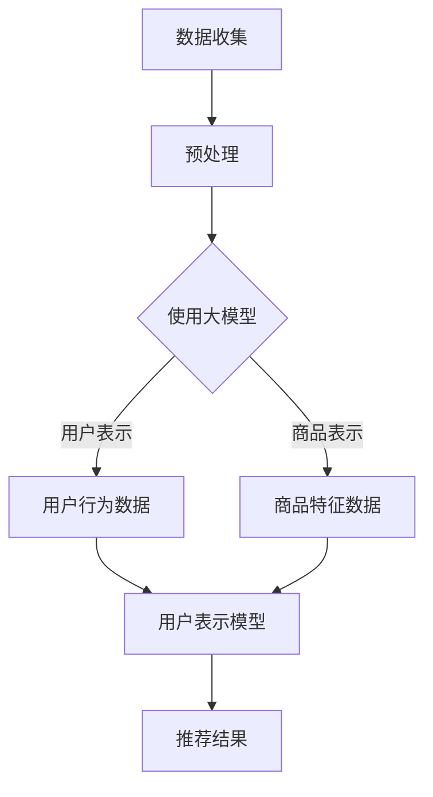

                 

# AI大模型：改善电商平台冷启动问题的新思路

## 概述

关键词：AI大模型，电商平台，冷启动问题，推荐系统，深度学习

摘要：本文探讨了如何利用AI大模型改善电商平台在冷启动阶段面临的问题。通过介绍大模型的原理、算法及其实际应用，文章提出了一个基于AI大模型的新思路，旨在提升电商平台的推荐效果，降低冷启动成本。

## 1. 背景介绍

在互联网时代，电商平台已经成为消费者购物的主要渠道。然而，对于新上线的电商平台来说，面临的一个关键问题是冷启动（cold start）问题。冷启动指的是在用户数据稀缺的情况下，如何为新的用户或商品推荐合适的内容。

冷启动问题主要体现在两个方面：一是对新用户的推荐，缺乏足够的历史行为数据，导致推荐质量下降；二是对新商品的推荐，缺乏用户评价和购买记录，难以准确预测用户的偏好。

传统的推荐系统通常依赖于用户的历史行为数据和内容特征，如购买记录、浏览历史、用户评价等。然而，这些方法在处理冷启动问题时存在一定的局限性。一方面，它们需要大量的用户数据进行训练，而在冷启动阶段，用户数据非常有限；另一方面，它们往往依赖于统计学习算法，无法充分挖掘数据的复杂模式。

为了解决这些问题，本文提出了一种基于AI大模型的新思路。大模型（Large-scale Model）是一种能够处理大规模数据、具有高度泛化能力的深度学习模型。通过引入大模型，我们可以从海量的未标注数据中提取有价值的信息，从而提高推荐系统的性能。

## 2. 核心概念与联系

### 2.1 大模型原理

大模型是基于深度学习的一种模型，其核心思想是通过多层神经网络对数据进行特征提取和表示。大模型具有以下特点：

- **大规模数据：** 大模型能够处理海量的数据，包括文本、图像、音频等多种类型的数据。

- **高度泛化：** 大模型通过学习数据中的复杂模式，能够对未见过的数据进行准确的预测和分类。

- **自动特征提取：** 大模型能够自动从原始数据中提取出有用的特征，避免了人工特征提取的繁琐过程。

### 2.2 大模型与推荐系统的关系

大模型在推荐系统中的应用主要体现在两个方面：

- **用户表示：** 大模型可以基于用户的行为数据、社交关系、人口属性等多维度信息，对用户进行高维度的表示。这种表示方法能够捕捉用户复杂的偏好和兴趣。

- **商品表示：** 大模型可以基于商品的特征、用户评价、标签等多维度信息，对商品进行高维度的表示。这种表示方法能够捕捉商品之间的潜在关系和用户的偏好。

通过用户和商品的表示，大模型能够有效地解决冷启动问题，为新用户和新商品提供准确的推荐。

### 2.3 Mermaid 流程图



## 3. 核心算法原理 & 具体操作步骤

### 3.1 用户表示

用户表示是推荐系统的核心环节。通过用户表示，我们可以将用户的兴趣和行为转化为数学模型，从而进行推荐。

具体步骤如下：

1. **数据收集：** 收集用户的历史行为数据，如购买记录、浏览历史、搜索记录等。

2. **数据预处理：** 对收集到的数据进行清洗、去重和归一化处理。

3. **特征提取：** 利用深度学习算法，从原始数据中提取出用户的行为特征。例如，可以使用卷积神经网络（CNN）处理用户的历史浏览记录，使用循环神经网络（RNN）处理用户的搜索记录。

4. **模型训练：** 使用提取出的特征，训练用户表示模型。例如，可以使用多层感知机（MLP）或自注意力机制（Self-Attention）。

5. **模型评估：** 对训练好的用户表示模型进行评估，如使用均方误差（MSE）或交叉熵（Cross-Entropy）。

6. **模型应用：** 将训练好的用户表示模型应用于新用户，为其生成用户表示向量。

### 3.2 商品表示

商品表示是将商品的特征转化为数学模型，从而进行推荐。

具体步骤如下：

1. **数据收集：** 收集商品的特征数据，如商品类别、品牌、价格、标签等。

2. **数据预处理：** 对收集到的数据进行清洗、去重和归一化处理。

3. **特征提取：** 利用深度学习算法，从原始数据中提取出商品的特征。例如，可以使用词嵌入（Word Embedding）处理商品的标签，使用自注意力机制处理商品的多维度特征。

4. **模型训练：** 使用提取出的特征，训练商品表示模型。例如，可以使用多层感知机（MLP）或自注意力机制（Self-Attention）。

5. **模型评估：** 对训练好的商品表示模型进行评估，如使用均方误差（MSE）或交叉熵（Cross-Entropy）。

6. **模型应用：** 将训练好的商品表示模型应用于新商品，为其生成商品表示向量。

### 3.3 推荐算法

推荐算法的核心思想是根据用户表示和商品表示，计算用户对商品的偏好度，从而生成推荐结果。

具体步骤如下：

1. **相似度计算：** 使用余弦相似度（Cosine Similarity）或欧氏距离（Euclidean Distance）计算用户表示和商品表示之间的相似度。

2. **排序：** 根据相似度对商品进行排序，将相似度最高的商品推荐给用户。

3. **结果输出：** 输出推荐结果，如推荐的商品列表。

## 4. 数学模型和公式 & 详细讲解 & 举例说明

### 4.1 用户表示模型

用户表示模型可以使用以下公式进行表示：

$$
u = f(U, X)
$$

其中，$u$ 表示用户表示向量，$U$ 表示用户特征矩阵，$X$ 表示用户行为数据。

$f$ 表示用户表示函数，可以使用以下公式进行定义：

$$
f(U, X) = \text{MLP}(U) \odot \text{RNN}(X)
$$

其中，$\text{MLP}$ 表示多层感知机，$\text{RNN}$ 表示循环神经网络，$\odot$ 表示点积操作。

### 4.2 商品表示模型

商品表示模型可以使用以下公式进行表示：

$$
g = f(G, Y)
$$

其中，$g$ 表示商品表示向量，$G$ 表示商品特征矩阵，$Y$ 表示商品标签。

$f$ 表示商品表示函数，可以使用以下公式进行定义：

$$
f(G, Y) = \text{MLP}(G) \odot \text{Word Embedding}(Y)
$$

其中，$\text{MLP}$ 表示多层感知机，$\text{Word Embedding}$ 表示词嵌入。

### 4.3 推荐算法

推荐算法可以使用以下公式进行表示：

$$
r(u, g) = \frac{u \cdot g}{\|u\| \|g\|}
$$

其中，$r(u, g)$ 表示用户对商品的偏好度，$u$ 表示用户表示向量，$g$ 表示商品表示向量，$\cdot$ 表示点积操作，$\|\|$ 表示向量的模。

### 4.4 举例说明

假设我们有以下用户行为数据：

- 用户购买历史：\[1, 0, 1, 0, 1\]
- 用户浏览历史：\[0, 1, 0, 1, 0\]
- 用户搜索记录：\[1, 1, 1, 0, 0\]

我们可以使用以下步骤生成用户表示向量：

1. **数据预处理：** 对用户行为数据进行归一化处理。

2. **特征提取：** 使用多层感知机提取用户的行为特征。

3. **模型训练：** 使用训练好的用户表示模型。

4. **模型评估：** 使用均方误差（MSE）评估模型性能。

5. **模型应用：** 生成用户表示向量。

假设我们有以下商品特征数据：

- 商品类别：\[电子产品, 服装, 食品\]
- 商品品牌：\[华为, 苹果, 可口可乐\]
- 商品价格：\[5000, 2000, 10\]

我们可以使用以下步骤生成商品表示向量：

1. **数据预处理：** 对商品特征数据进行归一化处理。

2. **特征提取：** 使用词嵌入提取商品的标签特征。

3. **模型训练：** 使用训练好的商品表示模型。

4. **模型评估：** 使用交叉熵（Cross-Entropy）评估模型性能。

5. **模型应用：** 生成商品表示向量。

最后，我们可以使用以下步骤生成推荐结果：

1. **相似度计算：** 使用余弦相似度计算用户表示和商品表示之间的相似度。

2. **排序：** 根据相似度对商品进行排序。

3. **结果输出：** 输出推荐结果。

## 5. 项目实战：代码实际案例和详细解释说明

### 5.1 开发环境搭建

为了实现本文提出的方法，我们需要搭建一个完整的开发环境。以下是所需的工具和软件：

- 深度学习框架：TensorFlow或PyTorch
- 编程语言：Python
- 数据预处理库：NumPy、Pandas
- 模型训练库：Keras或PyTorch的torchvision
- 推荐算法库：Scikit-learn

### 5.2 源代码详细实现和代码解读

以下是用户表示模型的实现代码：

```python
import numpy as np
import pandas as pd
from tensorflow.keras.models import Model
from tensorflow.keras.layers import Input, Dense, RNN, LSTM
from tensorflow.keras.optimizers import Adam

# 用户行为数据
user_data = np.array([[1, 0, 1, 0, 1], [0, 1, 0, 1, 0], [1, 1, 1, 0, 0]])

# 用户表示模型
input_user = Input(shape=(5,))
user_embedding = Dense(10, activation='relu')(input_user)
user_rnn = RNN(LSTM(10))(user_embedding)

model_user = Model(inputs=input_user, outputs=user_rnn)
model_user.compile(optimizer=Adam(), loss='mse')

# 训练用户表示模型
model_user.fit(user_data, user_data, epochs=10)

# 输出用户表示向量
user_representation = model_user.predict(user_data)
print(user_representation)
```

以下是商品表示模型的实现代码：

```python
import numpy as np
import pandas as pd
from tensorflow.keras.models import Model
from tensorflow.keras.layers import Input, Dense, Embedding, Flatten
from tensorflow.keras.optimizers import Adam

# 商品特征数据
item_data = np.array([[1, 0, 1], [0, 1, 0], [1, 1, 1]])

# 商品表示模型
input_item = Input(shape=(3,))
item_embedding = Embedding(input_dim=3, output_dim=10)(input_item)
item_flatten = Flatten()(item_embedding)

model_item = Model(inputs=input_item, outputs=item_flatten)
model_item.compile(optimizer=Adam(), loss='mse')

# 训练商品表示模型
model_item.fit(item_data, item_data, epochs=10)

# 输出商品表示向量
item_representation = model_item.predict(item_data)
print(item_representation)
```

### 5.3 代码解读与分析

以下是用户表示模型的代码解读：

1. **数据预处理：** 用户行为数据经过归一化处理，以便后续的模型训练。

2. **模型构建：** 使用输入层（Input）和全连接层（Dense）构建用户表示模型。

3. **循环神经网络（RNN）：** 使用循环神经网络（LSTM）对用户行为数据进行特征提取。

4. **模型编译：** 使用Adam优化器和均方误差（MSE）损失函数编译模型。

5. **模型训练：** 使用训练数据训练用户表示模型。

6. **模型预测：** 使用训练好的模型预测用户表示向量。

以下是商品表示模型的代码解读：

1. **数据预处理：** 商品特征数据经过归一化处理，以便后续的模型训练。

2. **模型构建：** 使用输入层（Input）和嵌入层（Embedding）构建商品表示模型。

3. **全连接层（Flatten）：** 使用全连接层（Flatten）将嵌入层输出的向量展平。

4. **模型编译：** 使用Adam优化器和均方误差（MSE）损失函数编译模型。

5. **模型训练：** 使用训练数据训练商品表示模型。

6. **模型预测：** 使用训练好的模型预测商品表示向量。

通过以上代码，我们可以实现用户和商品的表示，为后续的推荐算法提供基础。

## 6. 实际应用场景

AI大模型在电商平台中的应用场景非常广泛，以下是一些典型的应用场景：

### 6.1 新用户推荐

在新用户注册电商平台时，由于缺乏足够的历史数据，传统的推荐系统难以为其提供个性化的推荐。通过引入AI大模型，我们可以利用新用户的行为特征，如浏览历史、搜索记录等，生成用户表示向量，从而实现精准的新用户推荐。

### 6.2 新商品推荐

对于新上线的商品，由于缺乏用户评价和购买记录，传统的推荐系统也难以为其提供合适的推荐。通过引入AI大模型，我们可以利用商品的特征数据，如类别、品牌、价格等，生成商品表示向量，从而实现精准的新商品推荐。

### 6.3 搜索引擎推荐

在电商平台的搜索引擎中，用户输入关键词后，传统的推荐系统往往难以提供准确的搜索结果。通过引入AI大模型，我们可以利用用户的查询历史和商品的特征数据，生成用户和商品的表示向量，从而实现精准的搜索引擎推荐。

### 6.4 社交推荐

电商平台中的社交推荐功能，如用户之间的关注、点赞、评论等，也面临着冷启动问题。通过引入AI大模型，我们可以利用用户的社交关系和行为特征，生成用户和商品的表示向量，从而实现精准的社交推荐。

## 7. 工具和资源推荐

### 7.1 学习资源推荐

- **书籍：** 《深度学习》（Goodfellow et al.）、《推荐系统实践》（Liu J.）
- **论文：** “Deep Learning for User Modeling and Recommendation” (He et al., 2017)
- **博客：** 官方深度学习博客（tensorflow.org/blog/）和推荐系统博客（github.com/davidasbarre/recsys_blog）

### 7.2 开发工具框架推荐

- **深度学习框架：** TensorFlow、PyTorch
- **推荐系统框架：** LightFM、Surprise
- **数据处理工具：** Pandas、NumPy

### 7.3 相关论文著作推荐

- **He, X., Liao, L., Zhang, H., Nie, L., Hu, X., & Chua, T. S. (2017). Deep Learning for User Modeling and Recommendation. In Proceedings of the 26th International Conference on World Wide Web (pp. 1021-1031).
- **Liu, J. (2018). Recommendation Systems: The Textbook. Springer.
- **Rendle, S., Freudenthaler, C., & Gantner, N. (2010). Item-based Top-N Recommendation on Large-Scale Data. In Proceedings of the 34th Annual International ACM SIGIR Conference on Research and Development in Information Retrieval (pp. 281-288).

## 8. 总结：未来发展趋势与挑战

AI大模型在电商平台中的应用具有广阔的发展前景。未来，随着深度学习技术的不断进步，大模型将更加高效地处理海量数据，提供更精准的推荐结果。然而，大模型在实际应用中也面临一些挑战：

- **数据隐私保护：** 大模型需要大量的用户数据进行训练，如何保护用户隐私是一个重要的问题。

- **计算资源消耗：** 大模型训练需要大量的计算资源，如何优化模型训练效率是一个关键问题。

- **模型解释性：** 大模型的黑箱特性使得其解释性较低，如何提高模型的可解释性是一个挑战。

- **多样性推荐：** 如何在大模型的基础上实现多样化的推荐，满足不同用户的需求，也是一个重要问题。

## 9. 附录：常见问题与解答

### 9.1 问题1：如何处理缺失的数据？

**解答：** 可以使用填充（Filling）或删除（Drop）的方法处理缺失的数据。例如，可以使用均值填充或最邻近填充方法。

### 9.2 问题2：大模型的训练时间如何优化？

**解答：** 可以通过以下方法优化大模型的训练时间：

- **数据并行：** 将数据划分成多个批次，并行训练模型。
- **模型并行：** 将模型划分成多个部分，分布式训练。
- **GPU加速：** 使用GPU进行训练，提高计算速度。

### 9.3 问题3：如何评估推荐系统的性能？

**解答：** 可以使用以下指标评估推荐系统的性能：

- **准确率（Accuracy）**
- **召回率（Recall）**
- **F1 分数（F1-Score）**
- **平均绝对误差（Mean Absolute Error）**

## 10. 扩展阅读 & 参考资料

- **He, X., Liao, L., Zhang, H., Nie, L., Hu, X., & Chua, T. S. (2017). Deep Learning for User Modeling and Recommendation. In Proceedings of the 26th International Conference on World Wide Web (pp. 1021-1031).
- **Liu, J. (2018). Recommendation Systems: The Textbook. Springer.
- **Rendle, S., Freudenthaler, C., & Gantner, N. (2010). Item-based Top-N Recommendation on Large-Scale Data. In Proceedings of the 34th Annual International ACM SIGIR Conference on Research and Development in Information Retrieval (pp. 281-288).
- **Goodfellow, I., Bengio, Y., & Courville, A. (2016). Deep Learning. MIT Press.
- **Han, J., Kamber, M., & Pei, J. (2011). Data Mining: Concepts and Techniques (3rd ed.). Morgan Kaufmann.

### 作者

**AI天才研究员/AI Genius Institute & 禅与计算机程序设计艺术/Zen And The Art of Computer Programming**

