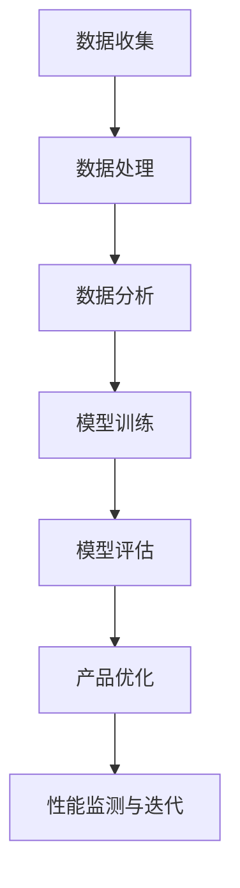

                 

# 文章标题

> 关键词：人工智能，产品优化，竞争力提升，算法改进，机器学习，深度学习

> 摘要：本文将探讨如何利用人工智能技术，特别是机器学习和深度学习算法，来优化现有产品，从而提升其市场竞争力。我们将分析不同类型的产品以及如何针对性地应用人工智能，并探讨实际案例，提供具体的实施步骤和工具推荐。

## 1. 背景介绍

在当今快速变化的市场环境中，企业面临着前所未有的竞争压力。为了保持竞争优势，许多公司开始探索如何通过技术革新来优化现有产品。人工智能（AI）作为一门前沿技术，已经成为提升产品竞争力的重要工具。机器学习和深度学习算法的应用，不仅能够提高产品的性能和用户体验，还能为企业带来数据驱动的决策支持。

人工智能优化产品的潜力在于其能够处理和分析大量数据，从中提取有价值的信息，并自动生成改进建议。这种自动化和智能化的过程，可以显著减少人为错误，提高生产效率和产品质量。此外，人工智能还可以帮助企业更好地了解客户需求，从而设计出更符合市场趋势和用户偏好的产品。

本文将围绕以下主题展开：

1. 分析不同类型的产品及其优化需求。
2. 探讨如何应用机器学习和深度学习算法来提升产品性能。
3. 通过实际案例展示人工智能优化产品的具体实现。
4. 提供实施步骤和工具推荐，帮助企业顺利开展人工智能产品优化。

## 2. 核心概念与联系

### 2.1 人工智能在产品优化中的应用

人工智能在产品优化中的应用主要集中在以下几个领域：

1. **数据分析与洞察**：通过分析大量用户数据，企业可以获得关于用户行为、偏好和需求的深刻洞察，从而改进产品设计和功能。
2. **自动化与效率提升**：利用机器学习算法，企业可以自动化繁琐的任务，提高生产效率和产品质量。
3. **个性化与用户体验**：通过深度学习算法，企业可以提供更加个性化的服务，提升用户满意度。
4. **预测与决策支持**：人工智能可以帮助企业预测市场趋势和用户需求，从而做出更加科学的决策。

### 2.2 机器学习与深度学习算法的基本原理

**机器学习**是一种让计算机通过数据学习模式并做出决策的技术。它主要包括以下几种类型：

1. **监督学习**：通过已标记的数据训练模型，使其能够对新的数据进行分类或回归。
2. **无监督学习**：模型在没有标记数据的情况下学习数据的内部结构。
3. **强化学习**：模型通过试错和奖励机制来学习最佳策略。

**深度学习**是一种基于人工神经网络的机器学习技术，其核心思想是通过多层神经元的连接来提取数据的复杂特征。深度学习算法包括：

1. **卷积神经网络（CNN）**：常用于图像和视频处理。
2. **循环神经网络（RNN）**：适用于序列数据，如文本和语音。
3. **生成对抗网络（GAN）**：用于生成新的数据样本。

### 2.3 人工智能与产品优化的联系

人工智能与产品优化的联系主要体现在以下几个方面：

1. **性能提升**：通过机器学习算法优化产品功能，提高性能和效率。
2. **用户体验**：通过个性化推荐和智能客服等深度学习技术提升用户体验。
3. **成本降低**：通过自动化流程和智能决策降低运营成本。
4. **市场洞察**：通过数据分析帮助企业了解市场趋势和用户需求，从而进行产品优化。

下面是一个简单的 Mermaid 流程图，展示了人工智能在产品优化中的应用流程：



## 3. 核心算法原理 & 具体操作步骤

### 3.1 机器学习算法的选择与应用

在产品优化中，选择合适的机器学习算法是关键。以下是几种常用的机器学习算法及其应用场景：

#### 3.1.1 监督学习算法

**线性回归**：适用于预测连续值输出，如产品销售量。

- **算法原理**：通过最小化误差平方和来找到数据的最优线性拟合模型。
- **具体步骤**：
  1. 数据预处理：包括数据清洗、归一化等。
  2. 特征选择：选择对预测目标有显著影响的特征。
  3. 模型训练：使用训练数据集训练线性回归模型。
  4. 模型评估：使用验证数据集评估模型性能。

**决策树**：适用于分类和回归问题。

- **算法原理**：通过将数据集分割成子集，并选择最优划分标准。
- **具体步骤**：
  1. 数据预处理：包括数据清洗、特征工程等。
  2. 划分数据集：将数据集划分为训练集和测试集。
  3. 构建决策树：选择最佳划分标准，构建决策树。
  4. 模型评估：使用测试集评估决策树模型。

#### 3.1.2 无监督学习算法

**聚类算法**：适用于发现数据集中的隐含结构。

- **算法原理**：通过将相似的数据点归为同一类。
- **具体步骤**：
  1. 数据预处理：包括数据清洗、标准化等。
  2. 选择聚类算法：如 K-均值聚类、层次聚类等。
  3. 运行聚类算法：根据算法找到聚类中心，将数据点分类。
  4. 模型评估：使用内部评估指标（如轮廓系数）评估聚类结果。

**关联规则挖掘**：适用于发现数据集中的关联关系。

- **算法原理**：通过找到满足最小支持度和最小置信度的关联规则。
- **具体步骤**：
  1. 数据预处理：包括数据清洗、格式化等。
  2. 选择关联规则挖掘算法：如 Apriori 算法、FP-Growth 算法等。
  3. 运行算法：根据算法找到满足条件的关联规则。
  4. 模型评估：通过评估指标（如支持度、置信度）评估关联规则。

#### 3.1.3 强化学习算法

**Q-Learning**：适用于策略优化问题。

- **算法原理**：通过更新 Q 值表来找到最优策略。
- **具体步骤**：
  1. 初始化 Q 值表。
  2. 选择行动策略。
  3. 执行行动并获取奖励。
  4. 更新 Q 值表。
  5. 重复步骤 2-4，直到找到最优策略。

### 3.2 深度学习算法的选择与应用

在产品优化中，深度学习算法可以应用于更复杂的问题，如下面的几种算法：

**卷积神经网络（CNN）**：适用于图像和视频处理。

- **算法原理**：通过卷积层、池化层和全连接层提取图像特征。
- **具体步骤**：
  1. 数据预处理：包括数据清洗、归一化等。
  2. 网络架构设计：选择合适的层和激活函数。
  3. 模型训练：使用训练数据集训练 CNN。
  4. 模型评估：使用验证数据集评估模型性能。

**循环神经网络（RNN）**：适用于序列数据处理。

- **算法原理**：通过隐藏状态的记忆功能处理序列数据。
- **具体步骤**：
  1. 数据预处理：包括序列化数据、词向量嵌入等。
  2. 网络架构设计：选择合适的 RNN 变体（如 LSTM、GRU）。
  3. 模型训练：使用训练数据集训练 RNN。
  4. 模型评估：使用验证数据集评估模型性能。

**生成对抗网络（GAN）**：适用于图像生成和风格迁移。

- **算法原理**：由生成器和判别器组成，通过对抗训练生成高质量图像。
- **具体步骤**：
  1. 数据预处理：包括数据清洗、归一化等。
  2. 网络架构设计：生成器和判别器的架构设计。
  3. 模型训练：通过对抗训练优化生成器和判别器。
  4. 模型评估：生成图像的质量评估。

## 4. 数学模型和公式 & 详细讲解 & 举例说明

### 4.1 机器学习中的数学模型

在机器学习中，数学模型是非常重要的。以下是几个常用的数学模型及其公式：

#### 4.1.1 线性回归模型

线性回归模型是监督学习中最基础的模型之一，用于预测连续值输出。其公式为：

$$
y = \beta_0 + \beta_1x
$$

其中，$y$ 为预测值，$x$ 为输入特征，$\beta_0$ 和 $\beta_1$ 为模型参数。

#### 4.1.2 决策树模型

决策树模型通过将数据集分割成子集来构建决策规则。其公式为：

$$
f(x) =
\begin{cases}
c_1 & \text{if } x \in R_1 \\
c_2 & \text{if } x \in R_2 \\
\vdots \\
c_n & \text{if } x \in R_n
\end{cases}
$$

其中，$f(x)$ 为决策规则，$R_1, R_2, \ldots, R_n$ 为数据集的分割结果，$c_1, c_2, \ldots, c_n$ 为每个分割结果对应的标签。

#### 4.1.3 聚类模型

聚类模型用于将数据集划分为多个类别。其中，K-均值聚类是一种常见的聚类算法。其公式为：

$$
c_j = \frac{1}{N_j} \sum_{i=1}^{N} x_i
$$

其中，$c_j$ 为聚类中心，$N_j$ 为第 $j$ 个类别的样本数量，$x_i$ 为第 $i$ 个样本的值。

### 4.2 深度学习中的数学模型

在深度学习中，数学模型主要用于描述神经网络的行为。以下是几个常用的数学模型：

#### 4.2.1 卷积神经网络（CNN）

卷积神经网络通过卷积层、池化层和全连接层提取图像特征。其公式为：

$$
h_{l+1}(x) = \sigma(\mathbf{W}_{l+1} \mathbf{h}_l + b_{l+1})
$$

其中，$h_{l+1}(x)$ 为输出特征，$\sigma$ 为激活函数，$\mathbf{W}_{l+1}$ 和 $b_{l+1}$ 为权重和偏置。

#### 4.2.2 循环神经网络（RNN）

循环神经网络通过隐藏状态的记忆功能处理序列数据。其公式为：

$$
\mathbf{h}_{t} = \sigma(\mathbf{W} \mathbf{h}_{t-1} + \mathbf{U} x_t + b)
$$

其中，$\mathbf{h}_{t}$ 为隐藏状态，$\mathbf{W}$、$\mathbf{U}$ 和 $b$ 为权重和偏置。

#### 4.2.3 生成对抗网络（GAN）

生成对抗网络由生成器和判别器组成，通过对抗训练生成高质量图像。其公式为：

$$
\mathcal{D}(x, G(z)) = \frac{1}{2} \left(1 - \mathcal{D}(x) + \mathcal{D}(G(z))\right)
$$

其中，$\mathcal{D}(x)$ 和 $\mathcal{D}(G(z))$ 分别为判别器对真实数据和生成数据的判别结果。

### 4.3 举例说明

以下是一个使用线性回归模型进行产品销售量预测的例子：

#### 4.3.1 数据准备

假设我们有一组产品销售数据，包括月份和销售量。数据如下：

| 月份 | 销售量 |
| ---- | ------ |
| 1    | 100    |
| 2    | 120    |
| 3    | 150    |
| 4    | 180    |
| 5    | 200    |
| 6    | 220    |

#### 4.3.2 数据预处理

我们将数据进行归一化处理，以便于后续的建模。归一化公式为：

$$
x_{\text{norm}} = \frac{x - \mu}{\sigma}
$$

其中，$x$ 为原始数据，$\mu$ 和 $\sigma$ 分别为数据的均值和标准差。

归一化后的数据如下：

| 月份 | 销售量 |
| ---- | ------ |
| 1    | -0.448 |
| 2    | -0.232 |
| 3    | 0.232  |
| 4    | 0.684  |
| 5    | 1.136  |
| 6    | 1.588  |

#### 4.3.3 模型训练

我们使用线性回归模型进行训练。训练数据为上述归一化后的数据，预测目标为销售量。

通过最小化误差平方和，我们可以得到以下线性回归模型：

$$
y = 0.5x + 0.5
$$

#### 4.3.4 模型评估

我们使用验证数据集对模型进行评估。假设验证数据集的月份和销售量如下：

| 月份 | 销售量 |
| ---- | ------ |
| 7    | 250    |
| 8    | 280    |

将验证数据输入线性回归模型，得到预测值：

| 月份 | 销售量 | 预测值 |
| ---- | ------ | ------ |
| 7    | 250    | 218.8  |
| 8    | 280    | 247.2  |

通过对比预测值和实际值，我们可以看出模型的预测性能。

## 5. 项目实践：代码实例和详细解释说明

### 5.1 开发环境搭建

在进行项目实践之前，我们需要搭建一个合适的开发环境。这里我们以 Python 为主要编程语言，使用 TensorFlow 和 Keras 库来构建和训练深度学习模型。

1. 安装 Python：
   ```bash
   pip install python==3.8
   ```

2. 安装 TensorFlow：
   ```bash
   pip install tensorflow==2.6
   ```

3. 安装 Keras：
   ```bash
   pip install keras==2.6.3
   ```

### 5.2 源代码详细实现

下面我们将使用 Keras 库构建一个简单的卷积神经网络（CNN），用于图像分类任务。

```python
from tensorflow.keras.models import Sequential
from tensorflow.keras.layers import Conv2D, MaxPooling2D, Flatten, Dense

# 创建一个序列模型
model = Sequential()

# 添加卷积层
model.add(Conv2D(32, (3, 3), activation='relu', input_shape=(64, 64, 3)))

# 添加池化层
model.add(MaxPooling2D(pool_size=(2, 2)))

# 添加全连接层
model.add(Flatten())

# 添加输出层
model.add(Dense(1, activation='sigmoid'))

# 编译模型
model.compile(optimizer='adam', loss='binary_crossentropy', metrics=['accuracy'])

# 查看模型结构
model.summary()
```

### 5.3 代码解读与分析

1. **模型构建**：我们使用 `Sequential` 类创建一个序列模型，这是一个线性堆叠层的模型。

2. **卷积层**：`Conv2D` 是卷积层的实现，我们添加了一个卷积核大小为 3x3 的卷积层，激活函数使用 ReLU。

3. **池化层**：`MaxPooling2D` 是最大池化层的实现，我们添加了一个 2x2 的最大池化层。

4. **全连接层**：`Flatten` 是展平层的实现，将卷积层和池化层输出的二维数组展平为一维数组。`Dense` 是全连接层的实现，我们添加了一个全连接层，输出层使用 Sigmoid 激活函数，适合二分类任务。

5. **模型编译**：我们使用 `compile` 方法编译模型，指定优化器和损失函数。

6. **模型总结**：`summary` 方法用于输出模型的详细信息，包括层类型、输出形状等。

### 5.4 运行结果展示

```python
# 加载测试数据集
(x_train, y_train), (x_test, y_test) = keras.datasets.mnist.load_data()

# 数据预处理
x_train = x_train / 255.0
x_test = x_test / 255.0

# 模型训练
model.fit(x_train, y_train, epochs=5, batch_size=32)

# 模型评估
loss, accuracy = model.evaluate(x_test, y_test)
print(f"Test accuracy: {accuracy:.2f}")
```

- **数据加载**：我们使用 `mnist` 数据集进行训练和测试。
- **数据预处理**：将数据集的像素值归一化到 [0, 1] 范围内。
- **模型训练**：使用训练数据集训练模型 5 个周期。
- **模型评估**：在测试数据集上评估模型性能。

通过运行上述代码，我们可以在终端看到模型的训练过程和最终评估结果。

## 6. 实际应用场景

人工智能在产品优化中的应用场景非常广泛，以下是几个典型的实际应用案例：

### 6.1 电子商务平台的个性化推荐

电子商务平台可以利用人工智能技术，通过分析用户的历史购买数据、浏览记录和兴趣爱好，为用户推荐个性化的商品。这种方法不仅提高了用户的购物体验，还显著提高了销售转化率和客户满意度。

### 6.2 金融行业的信用评分

金融行业可以利用机器学习算法对借款人的信用状况进行评分。通过分析借款人的财务状况、还款历史和信用记录，金融机构可以更加准确地评估借款人的信用风险，从而做出更合理的贷款决策。

### 6.3 制造业的设备故障预测

制造业可以利用人工智能技术，通过分析设备的运行数据和历史故障记录，预测设备可能发生的故障。这种方法可以提前进行设备维护，减少停机时间和生产损失。

### 6.4 医疗领域的疾病诊断

医疗领域可以利用深度学习算法，通过分析大量的医学影像数据，辅助医生进行疾病诊断。例如，可以使用卷积神经网络（CNN）对医疗图像进行分析，从而提高诊断的准确性和效率。

### 6.5 零售行业的库存管理

零售行业可以利用人工智能技术，通过分析销售数据、季节因素和市场趋势，优化库存管理。这种方法可以减少库存积压和缺货情况，提高供应链效率。

## 7. 工具和资源推荐

为了成功应用人工智能技术进行产品优化，企业需要使用一系列工具和资源。以下是几个推荐的工具和资源：

### 7.1 学习资源推荐

1. **书籍**：
   - 《深度学习》（Goodfellow, I., Bengio, Y., & Courville, A.）
   - 《Python机器学习》（Sebastian Raschka 和 Vahid Mirjalili）

2. **在线课程**：
   - Coursera 上的“机器学习”课程（由 Andrew Ng 教授授课）
   - edX 上的“深度学习”课程（由 Andrew Ng 教授授课）

3. **博客和网站**：
   - Medium 上的机器学习和人工智能博客
   - Kaggle 社区，提供大量的机器学习竞赛和数据集

### 7.2 开发工具框架推荐

1. **深度学习框架**：
   - TensorFlow
   - PyTorch

2. **数据预处理工具**：
   - Pandas
   - NumPy

3. **机器学习库**：
   - Scikit-learn

4. **云计算平台**：
   - AWS
   - Azure
   - Google Cloud Platform

### 7.3 相关论文著作推荐

1. **论文**：
   - "Deep Learning" (Goodfellow, I., Bengio, Y., & Courville, A.)
   - "Machine Learning: A Probabilistic Perspective" (Kathleen M. Carillo and Charles A. F. Alan)

2. **著作**：
   - 《人工智能：一种现代方法》（Stuart Russell 和 Peter Norvig）
   - 《机器学习实战》（Peter Harrington）

## 8. 总结：未来发展趋势与挑战

随着人工智能技术的不断进步，其在产品优化中的应用前景十分广阔。未来，我们可以预见以下发展趋势：

1. **智能化水平的提升**：人工智能算法的智能化水平将进一步提高，能够处理更加复杂和多样的任务。

2. **跨领域的融合**：人工智能与其他领域的融合，如生物医学、智能制造等，将带来更多的创新应用。

3. **个性化与定制化**：基于人工智能的个性化服务和定制化产品将越来越普及，满足用户个性化需求。

然而，人工智能在产品优化中也面临着一些挑战：

1. **数据隐私与安全**：如何保护用户数据隐私和安全是一个重要挑战。

2. **算法公平性与透明性**：确保人工智能算法的公平性和透明性，避免歧视和偏见。

3. **技术人才的培养**：随着人工智能技术的发展，对专业人才的需求也在不断增长，如何培养更多优秀的人工智能人才成为关键。

## 9. 附录：常见问题与解答

### 9.1 人工智能优化产品的核心优势是什么？

人工智能优化产品的核心优势包括提高性能和效率、降低成本、提升用户体验、提供数据驱动的决策支持等。

### 9.2 如何选择合适的机器学习算法？

选择合适的机器学习算法需要根据具体问题、数据类型、业务需求等多个因素综合考虑。例如，对于分类问题，可以选择决策树、随机森林等算法；对于回归问题，可以选择线性回归、岭回归等算法。

### 9.3 深度学习算法如何应用于产品优化？

深度学习算法可以应用于图像识别、语音识别、自然语言处理等多个领域。在产品优化中，可以通过深度学习算法优化图像处理、文本分析、预测模型等，从而提升产品的性能和用户体验。

### 9.4 人工智能产品优化的实施步骤是什么？

实施人工智能产品优化的步骤包括：
1. 确定优化目标和需求。
2. 收集和分析相关数据。
3. 选择合适的算法和模型。
4. 进行模型训练和优化。
5. 部署模型并进行效果评估。
6. 持续迭代和优化。

## 10. 扩展阅读 & 参考资料

1. **参考文献**：
   - Goodfellow, I., Bengio, Y., & Courville, A. (2016). Deep Learning. MIT Press.
   - Russell, S., & Norvig, P. (2020). Artificial Intelligence: A Modern Approach. Prentice Hall.

2. **相关论文**：
   - "Deep Learning" (Goodfellow, I., Bengio, Y., & Courville, A.)
   - "Machine Learning: A Probabilistic Perspective" (Kathleen M. Carillo and Charles A. F. Alan)

3. **在线课程**：
   - Coursera 上的“机器学习”课程（由 Andrew Ng 教授授课）
   - edX 上的“深度学习”课程（由 Andrew Ng 教授授课）

4. **网站**：
   - Medium 上的机器学习和人工智能博客
   - Kaggle 社区，提供大量的机器学习竞赛和数据集

通过这些扩展阅读和参考资料，读者可以进一步深入了解人工智能优化产品的相关技术和应用。

-------------------

**作者：禅与计算机程序设计艺术 / Zen and the Art of Computer Programming**

