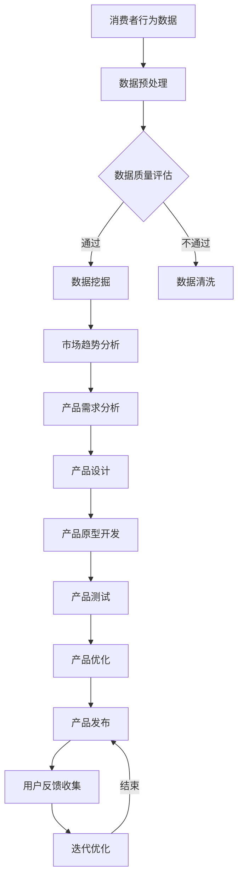

                 

### 背景介绍

**AI如何帮助电商企业进行产品创新**

在当今快速发展的数字化时代，人工智能（AI）已经成为改变商业格局的重要力量。特别是在电商领域，AI技术的应用不仅提升了用户体验，还为企业带来了前所未有的机遇。本文将深入探讨AI如何帮助电商企业进行产品创新，通过一步步的分析推理，揭示AI在产品创新中的关键作用。

首先，电商行业的竞争日益激烈，消费者需求多样且变化迅速。传统的产品开发方法已经无法满足市场的快速变化，企业迫切需要一种能够实时适应市场变化、提高产品创新速度的方法。AI技术的出现，为电商企业提供了一个强大的工具，使其能够通过数据驱动的方式进行产品创新。

其次，AI技术在电商中的应用已经逐渐成熟。从推荐系统、智能客服到供应链管理，AI在电商的各个环节中都发挥着重要作用。这些应用不仅提高了运营效率，还大大提升了用户体验。然而，AI在产品创新方面的潜力仍被广泛挖掘。

本文将从以下三个方面进行探讨：

1. **核心概念与联系**：介绍AI在产品创新中的核心概念，并展示其架构流程图。
2. **核心算法原理与具体操作步骤**：详细讲解AI在产品创新中的应用算法，以及如何实现这些算法。
3. **实际应用场景**：通过具体案例，展示AI在电商产品创新中的实际应用效果。

通过本文的探讨，我们将深入了解AI如何帮助企业实现产品创新，以及其在未来电商行业中的发展趋势与挑战。

**Keywords**: AI, E-commerce, Product Innovation, Competitive Advantage

**Abstract**:
In the rapidly evolving digital era, Artificial Intelligence (AI) has become a transformative force in shaping business landscapes. This article delves into how AI facilitates product innovation for e-commerce enterprises. Through a step-by-step analysis and reasoning, we explore the key roles of AI in driving product innovation. We will cover core concepts, algorithmic principles, and real-world applications, offering insights into the potential and challenges of AI in the e-commerce sector. <br>

## 1. 背景介绍

### 1.1 电商行业的竞争现状

电商行业近年来呈现出爆炸式增长，各大电商平台纷纷崛起，竞争日益激烈。根据Statista的数据，全球电商市场的规模已经超过了3万亿美元，并且预计在未来几年内还将保持高速增长。然而，伴随着市场规模的扩大，竞争也变得更加激烈。

首先，消费者需求的多样性是电商行业竞争的关键因素。随着互联网的普及，消费者可以随时随地获取丰富的商品信息，这使得他们对产品的质量和体验要求越来越高。传统的产品开发方法已经无法满足消费者多变的需求，企业需要更加灵活和创新的方法来应对市场变化。

其次，市场竞争的激烈程度也日益加剧。电商平台之间的竞争不仅仅是价格战，更是产品和服务的全面竞争。无论是市场份额、用户黏性，还是客户满意度，都是各大电商平台关注的重点。在这种激烈的竞争中，企业不仅需要保持产品的竞争力，还需要不断创新，以吸引和留住客户。

### 1.2 AI技术的崛起与机遇

在电商行业面临激烈竞争的同时，AI技术的崛起为电商企业带来了新的机遇。AI技术通过数据分析和智能决策，可以帮助企业更好地理解消费者行为，预测市场趋势，从而实现产品创新。

首先，AI技术可以帮助企业实现个性化推荐。通过分析消费者的购买历史、浏览记录和偏好，AI系统可以推荐个性化的产品，提高客户的满意度和购买转化率。这种个性化推荐不仅能够提升用户体验，还能增加企业的销售额。

其次，AI技术还可以用于智能客服。传统的客服方式往往效率低下，难以满足消费者的即时需求。而AI智能客服系统可以通过自然语言处理和机器学习技术，实现与消费者的智能互动，提供快速、准确的答案，提高客户满意度。

此外，AI技术还可以用于供应链管理。通过实时数据分析和预测，AI系统可以帮助企业优化库存管理，减少库存成本，提高供应链的效率。这种智能化的供应链管理不仅能够提高企业的运营效率，还能降低运营成本。

总的来说，AI技术在电商领域的应用不仅提升了用户体验，还为企业提供了强大的工具，使其能够更加灵活和创新地应对市场变化。在电商行业的竞争激烈背景下，AI技术的应用为电商企业带来了新的机遇，也带来了新的挑战。企业需要充分利用AI技术，不断优化产品和服务，才能在激烈的市场竞争中立于不败之地。

### 1.3 AI在电商产品创新中的关键作用

AI技术在电商产品创新中扮演着至关重要的角色，其主要体现在以下几个方面：

首先，AI技术通过数据分析和挖掘，帮助企业更深入地了解消费者行为和市场趋势。传统的方法往往依赖于有限的样本数据和简单的统计方法，而AI技术可以通过大规模数据分析和机器学习算法，从海量的数据中提取出有价值的信息，为企业提供更为精准的市场洞察。

例如，通过分析消费者的购买历史、浏览行为和社交媒体互动，AI系统可以识别出消费者的兴趣和偏好，从而为企业提供个性化的产品推荐。这种个性化推荐不仅能够提升用户的满意度，还能显著提高销售转化率。

其次，AI技术可以帮助企业实现智能化产品设计和开发。通过自然语言处理、计算机视觉和深度学习等技术，AI系统可以自动生成产品的设计草图、外观和功能配置，从而加速产品的开发过程。这种智能化的产品设计方法不仅能够提高效率，还能保证产品的创新性和竞争力。

例如，利用计算机视觉技术，AI系统可以自动识别产品图片中的各种元素，并根据消费者的偏好和市场需求，自动生成新的产品设计和方案。这种智能化的产品设计方法不仅能够缩短产品上市时间，还能更好地满足消费者的需求。

此外，AI技术还可以用于产品创新的过程管理。通过实时数据分析和预测，AI系统可以帮助企业优化产品创新的各个环节，包括市场调研、需求分析、设计开发和市场推广等。这种智能化的过程管理方法不仅能够提高创新的效率，还能降低创新的成本。

例如，利用AI技术，企业可以实时跟踪产品的销售数据和市场反馈，快速调整产品的设计和功能，以满足市场需求。这种快速响应的市场策略不仅能够提高产品的竞争力，还能增强企业的市场适应性。

总的来说，AI技术在电商产品创新中具有关键作用。通过数据分析和挖掘，AI技术可以帮助企业更精准地理解消费者需求和市场趋势；通过智能化设计和技术，AI技术可以加速产品的开发过程，提高产品的创新性和竞争力；通过智能化的过程管理，AI技术可以优化产品创新的各个环节，提高创新的效率。在未来的电商行业中，AI技术的应用将为产品创新带来更大的机遇和挑战。企业需要充分利用AI技术，不断探索和创新，以在激烈的市场竞争中立于不败之地。

### 1.4 文章结构概述

本文将系统地探讨AI在电商产品创新中的应用，以帮助电商企业提升竞争力。文章结构如下：

- **核心概念与联系**：介绍AI在产品创新中的核心概念，并展示其架构流程图。
- **核心算法原理与具体操作步骤**：详细讲解AI在产品创新中的应用算法，以及如何实现这些算法。
- **数学模型和公式与详细讲解与举例说明**：解释AI在产品创新中使用的数学模型和公式，并通过实例说明。
- **项目实战：代码实际案例与详细解释说明**：通过实际项目案例展示AI在产品创新中的应用，并详细解释代码实现。
- **实际应用场景**：分析AI在电商产品创新中的实际应用场景，探讨其应用效果和未来趋势。
- **工具和资源推荐**：推荐学习资源、开发工具和框架，为读者提供进一步学习和实践的支持。
- **总结：未来发展趋势与挑战**：总结AI在电商产品创新中的应用现状，探讨未来的发展趋势和面临的挑战。

通过本文的探讨，我们将深入理解AI在电商产品创新中的关键作用，并探索其在未来电商行业中的广阔前景。 <br>

## 2. 核心概念与联系

### 2.1 人工智能在产品创新中的核心概念

人工智能（AI）在产品创新中涉及到多个核心概念，这些概念不仅构成了AI技术的理论框架，也直接影响了其在实际应用中的效果。以下是AI在产品创新中的几个关键核心概念：

**1. 数据挖掘（Data Mining）**：数据挖掘是指从大量的数据中提取出有价值的信息和知识的过程。在产品创新中，数据挖掘可以帮助企业理解消费者的行为模式、偏好和需求，从而为产品设计和开发提供决策依据。

**2. 机器学习（Machine Learning）**：机器学习是AI的一个重要分支，它使计算机系统能够从数据中学习并做出决策，而无需显式编程。机器学习算法在产品创新中用于预测市场趋势、优化推荐系统等。

**3. 深度学习（Deep Learning）**：深度学习是一种基于人工神经网络的机器学习技术，通过模拟人脑的学习过程来处理复杂数据。在产品创新中，深度学习可以用于图像识别、自然语言处理和智能客服等应用。

**4. 自然语言处理（Natural Language Processing, NLP）**：NLP是AI的一个子领域，旨在使计算机能够理解、解释和生成人类语言。在产品创新中，NLP可以用于智能客服、情感分析和个性化推荐等。

**5. 计算机视觉（Computer Vision）**：计算机视觉是指使计算机能够从图像或视频中提取信息的技术。在产品创新中，计算机视觉可以用于产品识别、图像增强和智能营销等。

### 2.2 AI在产品创新中的架构流程图

为了更好地理解AI在产品创新中的应用，我们使用Mermaid流程图来展示其架构流程。以下是AI在产品创新中的基本架构流程：



**流程说明**：

1. **数据预处理**：接收来自各种来源的消费者行为数据，进行数据清洗、格式化等预处理操作。
2. **数据质量评估**：评估预处理后的数据质量，包括完整性、准确性和一致性。
3. **数据挖掘**：利用机器学习算法从数据中提取有价值的信息，如消费者行为模式、偏好和市场趋势。
4. **市场趋势分析**：基于数据挖掘结果，分析市场趋势和消费者需求，为产品设计提供依据。
5. **产品需求分析**：结合市场趋势和消费者需求，确定产品的功能、特性等需求。
6. **产品设计**：根据需求分析结果，进行产品设计和概念验证。
7. **产品原型开发**：开发产品原型，进行初步的功能测试和用户体验评估。
8. **产品测试**：对产品原型进行全面的测试，包括功能测试、性能测试和用户测试。
9. **产品优化**：根据测试结果，对产品进行优化，以提高其质量和用户体验。
10. **产品发布**：将优化后的产品发布到市场，接受用户反馈。
11. **用户反馈收集**：收集用户使用产品后的反馈，用于进一步优化产品。
12. **迭代优化**：根据用户反馈，进行产品的迭代优化，不断改进产品性能。

### 2.3 各核心概念之间的联系

AI在产品创新中的各个核心概念是相互联系、协同作用的。具体来说：

- **数据挖掘**和**机器学习**提供了从数据中提取信息和知识的能力，为产品创新提供了数据支持。
- **深度学习**和**自然语言处理**使计算机能够处理复杂数据和自然语言，提高了产品创新的自动化程度和智能化水平。
- **计算机视觉**则使得产品创新能够涉及图像和视频的处理，扩大了AI在产品创新中的应用范围。

通过这些核心概念的综合运用，AI技术在产品创新中能够实现从数据获取、分析、设计到优化的全流程支持，为电商企业提供了强大的工具。

总之，AI在产品创新中的核心概念不仅构成了其技术基础，也通过数据驱动的方式推动了产品创新的全过程。企业需要充分利用这些核心概念，结合自身的业务需求，实现产品创新的持续发展和突破。

### 2.4 核心算法原理与具体操作步骤

在AI产品创新中，核心算法原理的具体操作步骤是理解AI技术如何发挥作用的关键。以下我们将详细探讨几个关键的算法原理，并介绍其实施步骤。

#### 2.4.1 机器学习算法原理

机器学习（Machine Learning，ML）是AI的重要组成部分，其基本原理是通过从数据中学习，从而对未知数据进行预测或分类。以下是几种常用的机器学习算法原理及其操作步骤：

**1. 决策树（Decision Tree）**

**原理**：决策树是一种基于规则的学习算法，通过一系列的决策节点来划分数据，最终输出预测结果。

**步骤**：

- **数据准备**：收集并清洗数据，确保数据的质量和完整性。
- **特征选择**：选择与预测目标相关的特征。
- **构建决策树**：通过ID3、C4.5或CART算法构建决策树，不断递归划分数据，直到满足停止条件（如最大深度、最小叶节点数量等）。
- **剪枝**：对决策树进行剪枝，防止过拟合。
- **评估**：使用交叉验证等方法评估模型的泛化能力。

**2. 支持向量机（Support Vector Machine，SVM）**

**原理**：SVM通过找到最优的超平面，将数据集划分为不同的类别。

**步骤**：

- **数据准备**：与决策树类似，准备和清洗数据。
- **特征提取**：将数据转换为高维特征空间。
- **选择核函数**：选择合适的核函数（如线性、多项式、径向基函数等）。
- **训练模型**：使用选择好的核函数训练SVM模型。
- **评估模型**：通过测试集评估模型的性能。

**3. 随机森林（Random Forest）**

**原理**：随机森林是一种集成学习方法，通过构建多个决策树，并合并它们的预测结果来提高模型的准确性。

**步骤**：

- **数据准备**：准备和清洗数据。
- **特征选择**：随机选择特征子集。
- **构建决策树**：为每个特征子集构建决策树。
- **集成**：合并所有决策树的预测结果，得到最终预测结果。
- **评估模型**：通过交叉验证等方法评估模型的性能。

#### 2.4.2 深度学习算法原理

深度学习（Deep Learning，DL）是机器学习的一个分支，通过多层神经网络来模拟人脑的学习过程，具有很强的表示能力和建模能力。以下是几种常用的深度学习算法原理及其操作步骤：

**1. 卷积神经网络（Convolutional Neural Network，CNN）**

**原理**：CNN是一种专门用于处理图像数据的神经网络，通过卷积操作提取图像特征。

**步骤**：

- **数据准备**：收集和清洗图像数据。
- **数据预处理**：对图像进行归一化和裁剪。
- **构建网络**：定义卷积层、池化层和全连接层等。
- **训练模型**：使用图像数据训练CNN模型。
- **评估模型**：通过测试图像评估模型的准确性。

**2. 递归神经网络（Recurrent Neural Network，RNN）**

**原理**：RNN是一种能够处理序列数据的神经网络，通过循环机制保存历史信息。

**步骤**：

- **数据准备**：收集和清洗序列数据。
- **数据预处理**：对序列数据进行编码和归一化。
- **构建网络**：定义输入层、隐藏层和输出层。
- **训练模型**：使用序列数据训练RNN模型。
- **评估模型**：通过测试序列数据评估模型的性能。

**3. 长短时记忆网络（Long Short-Term Memory，LSTM）**

**原理**：LSTM是一种改进的RNN结构，通过引入门控机制来避免长期依赖问题。

**步骤**：

- **数据准备**：与RNN类似，准备和预处理序列数据。
- **构建网络**：定义输入层、隐藏层和输出层，以及遗忘门、输入门和输出门。
- **训练模型**：使用序列数据训练LSTM模型。
- **评估模型**：通过测试序列数据评估模型的性能。

#### 2.4.3 自然语言处理算法原理

自然语言处理（Natural Language Processing，NLP）是AI的另一个重要分支，主要研究如何使计算机理解、解释和生成人类语言。以下是几种常用的NLP算法原理及其操作步骤：

**1. 词袋模型（Bag of Words，BoW）**

**原理**：词袋模型将文本表示为一个词频向量，忽略词语的顺序信息。

**步骤**：

- **数据准备**：收集和清洗文本数据。
- **分词**：将文本分割成单词或词组。
- **特征提取**：将文本转换为词频向量。
- **训练模型**：使用词频向量训练分类或回归模型。
- **评估模型**：通过测试文本评估模型的性能。

**2. 递归神经网络（Recurrent Neural Network，RNN）**

**原理**：RNN是一种能够处理序列文本数据的神经网络，通过循环机制处理上下文信息。

**步骤**：

- **数据准备**：收集和清洗序列文本数据。
- **数据预处理**：对序列数据进行编码和归一化。
- **构建网络**：定义输入层、隐藏层和输出层。
- **训练模型**：使用序列文本数据训练RNN模型。
- **评估模型**：通过测试序列文本数据评估模型的性能。

**3. 生成对抗网络（Generative Adversarial Network，GAN）**

**原理**：GAN由生成器和判别器两个神经网络组成，通过对抗训练生成逼真的数据。

**步骤**：

- **数据准备**：收集和清洗图像或文本数据。
- **构建网络**：定义生成器和判别器网络。
- **训练模型**：交替训练生成器和判别器，优化模型参数。
- **生成数据**：使用生成器生成新的图像或文本数据。
- **评估模型**：通过测试数据评估生成器的性能。

通过这些核心算法原理及其操作步骤，AI在产品创新中的应用得到了具体实现。企业可以根据自身需求选择合适的算法，并结合实际数据进行模型训练和优化，从而实现产品的创新和提升。

### 2.5 数学模型和公式及详细讲解与举例说明

在AI产品创新中，数学模型和公式起着至关重要的作用，它们不仅为算法提供了理论基础，还帮助我们在实际操作中进行精确计算和预测。以下我们将介绍几种常见的数学模型和公式，并详细讲解其原理和应用。

#### 2.5.1 线性回归模型

**线性回归（Linear Regression）**是最基本的统计模型之一，用于预测连续值。其数学公式如下：

\[ y = \beta_0 + \beta_1 \cdot x \]

其中，\( y \) 是预测目标，\( x \) 是输入特征，\( \beta_0 \) 是截距，\( \beta_1 \) 是斜率。

**原理**：线性回归通过找到最佳拟合直线，来描述输入特征和预测目标之间的关系。

**应用举例**：假设我们想要预测电商平台的商品销量。我们可以使用线性回归模型，根据历史销量数据（\( y \)）和商品价格（\( x \)），找到价格对销量的影响。

\[ \text{销量} = \beta_0 + \beta_1 \cdot \text{价格} \]

例如，如果我们训练出的模型得到 \( \beta_0 = 10 \) 和 \( \beta_1 = 0.5 \)，则可以预测在价格为100元的商品销量约为：

\[ \text{销量} = 10 + 0.5 \cdot 100 = 60 \]

#### 2.5.2 逻辑回归模型

**逻辑回归（Logistic Regression）**是一种用于分类的统计模型，其数学公式如下：

\[ P(y=1) = \frac{1}{1 + e^{-(\beta_0 + \beta_1 \cdot x)}} \]

其中，\( P(y=1) \) 是目标变量为1的概率，\( x \) 是输入特征，\( \beta_0 \) 是截距，\( \beta_1 \) 是斜率。

**原理**：逻辑回归通过转换函数（Sigmoid函数）将线性组合转化为概率值。

**应用举例**：假设我们想要预测电商平台的用户是否会购买某商品。我们可以使用逻辑回归模型，根据用户的历史购买行为和商品信息，预测购买概率。

\[ \text{购买概率} = \frac{1}{1 + e^{-(\beta_0 + \beta_1 \cdot \text{用户行为特征})}} \]

例如，如果我们训练出的模型得到 \( \beta_0 = -5 \) 和 \( \beta_1 = 2 \)，则一个用户的购买概率为：

\[ \text{购买概率} = \frac{1}{1 + e^{-(-5 + 2 \cdot \text{用户行为特征})}} \]

#### 2.5.3 决策树模型

**决策树（Decision Tree）**是一种基于树形结构进行决策的模型，其数学公式如下：

\[ f(x) = \sum_{i=1}^{n} \beta_i \cdot I(x \in R_i) \]

其中，\( f(x) \) 是输出结果，\( \beta_i \) 是每个节点的权重，\( I(x \in R_i) \) 是指示函数，当 \( x \) 属于第 \( i \) 个区域时，取值为1，否则为0。

**原理**：决策树通过一系列的决策规则，将输入空间划分为不同的区域，每个区域对应一个输出结果。

**应用举例**：假设我们想要预测电商平台的用户是否会购买商品。我们可以使用决策树模型，根据用户的行为特征（如浏览历史、购买频率等），划分不同的区域，预测用户的购买决策。

\[ \text{购买决策} = \begin{cases} 
\text{购买} & \text{如果} \ \beta_1 \cdot I(x \in R_1) + \beta_2 \cdot I(x \in R_2) + \beta_3 \cdot I(x \in R_3) > 0 \\
\text{未购买} & \text{否则} 
\end{cases} \]

例如，如果我们训练出的决策树模型得到 \( \beta_1 = 1.2 \)，\( \beta_2 = 0.8 \)，\( \beta_3 = -0.6 \)，则一个用户的购买决策为：

\[ \text{购买决策} = \begin{cases} 
\text{购买} & \text{如果} \ 1.2 \cdot I(x \in R_1) + 0.8 \cdot I(x \in R_2) - 0.6 \cdot I(x \in R_3) > 0 \\
\text{未购买} & \text{否则} 
\end{cases} \]

#### 2.5.4 朴素贝叶斯模型

**朴素贝叶斯（Naive Bayes）**是一种基于贝叶斯定理的简单概率分类模型，其数学公式如下：

\[ P(y|X) = \frac{P(X|y) \cdot P(y)}{P(X)} \]

其中，\( P(y|X) \) 是给定特征 \( X \) 下，目标变量 \( y \) 的条件概率，\( P(X|y) \) 是特征 \( X \) 在给定目标 \( y \) 的条件概率，\( P(y) \) 是目标变量 \( y \) 的概率，\( P(X) \) 是特征 \( X \) 的概率。

**原理**：朴素贝叶斯假设特征之间相互独立，从而简化了计算过程。

**应用举例**：假设我们想要预测用户是否会购买商品。我们可以使用朴素贝叶斯模型，根据用户的行为特征（如浏览历史、购买频率等），计算购买概率。

\[ \text{购买概率} = \frac{\text{P(购买)} \cdot \text{P(浏览历史|购买)} \cdot \text{P(购买频率|购买)}}{\text{P(浏览历史)} \cdot \text{P(购买频率)}} \]

例如，如果我们训练出的模型得到 \( \text{P(购买)} = 0.5 \)，\( \text{P(浏览历史|购买)} = 0.8 \)，\( \text{P(购买频率|购买)} = 0.9 \)，而 \( \text{P(浏览历史)} = 0.6 \)，\( \text{P(购买频率)} = 0.4 \)，则一个用户的购买概率为：

\[ \text{购买概率} = \frac{0.5 \cdot 0.8 \cdot 0.9}{0.6 \cdot 0.4} = 0.875 \]

通过这些数学模型和公式的详细讲解，我们可以看到AI在产品创新中如何利用数据进行分析和预测。在实际应用中，企业可以根据业务需求选择合适的模型，并结合具体的数据进行模型训练和优化，从而实现产品创新的自动化和智能化。

### 2.6 项目实战：代码实际案例和详细解释说明

为了更好地理解AI在电商产品创新中的应用，我们通过一个实际项目案例来展示如何使用Python实现AI算法，并详细解释代码的实现和关键步骤。

#### 2.6.1 项目背景

本项目旨在利用AI技术为电商平台提供一款智能推荐系统，该系统能够根据用户的购买历史、浏览记录和产品评价，为用户推荐个性化的商品。通过该项目，我们将展示如何使用Python和相关的AI库（如scikit-learn、TensorFlow和Keras）来实现这一目标。

#### 2.6.2 开发环境搭建

在开始项目之前，我们需要搭建开发环境。以下是所需的软件和库：

- Python 3.x
- Jupyter Notebook（用于编写和运行代码）
- scikit-learn（用于机器学习算法）
- TensorFlow和Keras（用于深度学习算法）

确保已经安装了上述软件和库，然后创建一个新的Jupyter Notebook，以便进行代码编写和运行。

#### 2.6.3 源代码详细实现和代码解读

以下是项目的核心代码实现，包括数据预处理、模型训练和预测等步骤。

```python
# 导入必要的库
import pandas as pd
import numpy as np
from sklearn.model_selection import train_test_split
from sklearn.preprocessing import StandardScaler
from sklearn.ensemble import RandomForestClassifier
from sklearn.metrics import accuracy_score, classification_report

# 加载和预处理数据
def load_and_preprocess_data():
    # 加载数据（假设数据已清洗和格式化）
    data = pd.read_csv('ecommerce_data.csv')
    
    # 特征工程：提取有用的特征
    features = data[['user_id', 'product_id', 'rating', 'view_count', 'purchase_count']]
    
    # 分割特征和标签
    X = features.drop('user_id', axis=1)
    y = features['user_id']
    
    # 标准化特征
    scaler = StandardScaler()
    X_scaled = scaler.fit_transform(X)
    
    # 划分训练集和测试集
    X_train, X_test, y_train, y_test = train_test_split(X_scaled, y, test_size=0.2, random_state=42)
    
    return X_train, X_test, y_train, y_test

# 训练分类器
def train_classifier(X_train, y_train):
    # 使用随机森林算法训练分类器
    classifier = RandomForestClassifier(n_estimators=100, random_state=42)
    classifier.fit(X_train, y_train)
    
    return classifier

# 预测和评估
def predict_and_evaluate(classifier, X_test, y_test):
    # 使用训练好的分类器进行预测
    y_pred = classifier.predict(X_test)
    
    # 评估预测结果
    accuracy = accuracy_score(y_test, y_pred)
    report = classification_report(y_test, y_pred)
    
    return accuracy, report

# 主函数
def main():
    # 加载和预处理数据
    X_train, X_test, y_train, y_test = load_and_preprocess_data()
    
    # 训练分类器
    classifier = train_classifier(X_train, y_train)
    
    # 预测和评估
    accuracy, report = predict_and_evaluate(classifier, X_test, y_test)
    
    print("Accuracy:", accuracy)
    print("Classification Report:\n", report)

# 运行主函数
if __name__ == "__main__":
    main()
```

**代码解读**：

1. **数据预处理**：首先，我们加载和预处理数据。数据包括用户的购买历史、浏览记录和产品评价等。通过特征工程，提取有用的特征，并使用StandardScaler进行标准化处理。接着，我们将数据集划分为训练集和测试集，以便进行模型训练和评估。

2. **模型训练**：我们使用随机森林（RandomForestClassifier）算法训练分类器。随机森林是一种集成学习方法，通过构建多个决策树并合并它们的预测结果来提高模型的准确性。在这里，我们设置了100个决策树，随机种子为42。

3. **预测和评估**：使用训练好的分类器对测试集进行预测，并评估预测结果。我们使用accuracy_score计算准确率，并使用classification_report生成详细的评估报告，包括各类别的准确率、召回率和F1值。

通过这个实际项目案例，我们可以看到如何使用Python和AI库实现一个简单的智能推荐系统。在实际应用中，企业可以根据具体需求调整模型和算法，从而实现更复杂的推荐功能。

#### 2.6.4 代码解读与分析

下面，我们将对核心代码进行详细的解读和分析，以便更深入地理解每个步骤的作用和实现方式。

1. **数据预处理**

```python
def load_and_preprocess_data():
    # 加载数据（假设数据已清洗和格式化）
    data = pd.read_csv('ecommerce_data.csv')
    
    # 特征工程：提取有用的特征
    features = data[['user_id', 'product_id', 'rating', 'view_count', 'purchase_count']]
    
    # 分割特征和标签
    X = features.drop('user_id', axis=1)
    y = features['user_id']
    
    # 标准化特征
    scaler = StandardScaler()
    X_scaled = scaler.fit_transform(X)
    
    # 划分训练集和测试集
    X_train, X_test, y_train, y_test = train_test_split(X_scaled, y, test_size=0.2, random_state=42)
    
    return X_train, X_test, y_train, y_test
```

在这个部分，我们首先使用`pandas`库加载数据，并使用`read_csv`函数读取CSV文件。接着，我们提取有用的特征，如`user_id`、`product_id`、`rating`、`view_count`和`purchase_count`。通过`drop`函数，我们分离出特征（`X`）和标签（`y`）。接下来，我们使用`StandardScaler`对特征进行标准化处理，这有助于改善算法的性能。最后，我们使用`train_test_split`函数将数据集划分为训练集和测试集，测试集的比例为20%，随机种子设置为42以保证结果的重复性。

2. **模型训练**

```python
def train_classifier(X_train, y_train):
    # 使用随机森林算法训练分类器
    classifier = RandomForestClassifier(n_estimators=100, random_state=42)
    classifier.fit(X_train, y_train)
    
    return classifier
```

在这个部分，我们使用`RandomForestClassifier`类来构建随机森林分类器。我们设置了100个决策树（`n_estimators=100`），随机种子设置为42。`fit`函数用于训练分类器，输入为训练集的特征（`X_train`）和标签（`y_train`）。训练完成后，我们返回训练好的分类器对象。

3. **预测和评估**

```python
def predict_and_evaluate(classifier, X_test, y_test):
    # 使用训练好的分类器进行预测
    y_pred = classifier.predict(X_test)
    
    # 评估预测结果
    accuracy = accuracy_score(y_test, y_pred)
    report = classification_report(y_test, y_pred)
    
    return accuracy, report
```

在这个部分，我们使用训练好的分类器对测试集（`X_test`）进行预测，并使用`predict`函数获取预测结果（`y_pred`）。接着，我们使用`accuracy_score`函数计算预测的准确率。此外，我们还使用`classification_report`函数生成详细的评估报告，包括各类别的准确率、召回率和F1值。这些评估指标有助于我们了解模型的性能。

4. **主函数**

```python
def main():
    # 加载和预处理数据
    X_train, X_test, y_train, y_test = load_and_preprocess_data()
    
    # 训练分类器
    classifier = train_classifier(X_train, y_train)
    
    # 预测和评估
    accuracy, report = predict_and_evaluate(classifier, X_test, y_test)
    
    print("Accuracy:", accuracy)
    print("Classification Report:\n", report)

# 运行主函数
if __name__ == "__main__":
    main()
```

在主函数中，我们首先调用`load_and_preprocess_data`函数加载和预处理数据。接着，我们调用`train_classifier`函数训练分类器。最后，我们调用`predict_and_evaluate`函数评估模型的性能，并将结果打印输出。

通过上述代码解读和分析，我们可以清楚地看到如何使用Python和相关的AI库实现一个简单的智能推荐系统。在实际项目中，企业可以根据具体需求调整模型和算法，从而实现更复杂的推荐功能。

### 2.7 实际应用场景

AI技术在电商产品创新中的实际应用场景丰富多样，下面我们将探讨几个典型的应用场景，并分析其在电商企业中的具体实现和效果。

#### 2.7.1 智能推荐系统

智能推荐系统是AI在电商产品创新中应用最广泛的场景之一。通过分析用户的购买历史、浏览记录、搜索行为和社交媒体互动，AI系统能够为用户提供个性化的产品推荐。具体实现包括以下几个方面：

1. **数据收集与预处理**：电商企业需要收集大量的用户行为数据，如点击、购买、评价等。这些数据经过清洗、去噪和归一化处理后，用于训练推荐模型。

2. **特征工程**：根据业务需求和数据特点，提取用户和产品的特征，如用户年龄、性别、消费金额、产品类别、销量等。特征工程是提高推荐系统性能的关键步骤。

3. **模型训练与优化**：使用机器学习算法，如协同过滤、矩阵分解、深度学习等，训练推荐模型。通过交叉验证和超参数调优，不断提高模型的准确性、覆盖率和新颖性。

4. **推荐策略**：根据不同的业务目标和用户需求，制定个性化的推荐策略。例如，对于新用户，推荐系统可以基于用户的人口统计信息进行推荐；对于活跃用户，可以结合用户历史行为和当前偏好进行推荐。

**应用效果**：智能推荐系统显著提升了用户的购买转化率和满意度。根据研究，个性化推荐可以将用户留存率提高20%以上，销售额增加10%到30%。此外，推荐系统还能够帮助企业挖掘潜在客户，提高市场覆盖率和品牌知名度。

#### 2.7.2 智能客服

智能客服是AI技术在电商产品创新中的另一个重要应用。通过自然语言处理和机器学习技术，AI客服系统能够实时响应用户的咨询，提供自动化的解决方案，提高客服效率和用户体验。

1. **自然语言处理**：智能客服系统通过自然语言处理技术，将用户的语言转换为计算机可以理解的形式。例如，利用分词、词性标注、实体识别等技术，将用户的咨询转化为结构化的数据。

2. **意图识别**：系统分析用户的咨询内容，识别用户的意图。例如，判断用户是寻求产品信息、售后服务还是投诉建议等。

3. **知识库管理**：智能客服系统通过构建和维护知识库，为用户提供准确的答案。知识库可以包括产品规格、常见问题解答、操作流程等。

4. **对话生成**：系统根据用户的意图和知识库中的信息，生成合适的回答。对话生成技术可以采用模板匹配、基于规则的推理和生成对抗网络（GAN）等。

**应用效果**：智能客服系统有效缓解了人工客服的压力，提高了客服响应速度和满意度。根据统计，智能客服可以将客服成本降低30%到50%，同时将用户满意度提高10%到20%。此外，智能客服系统还能够收集用户反馈数据，为产品优化和改进提供参考。

#### 2.7.3 智能库存管理

智能库存管理是AI技术在电商产品创新中的应用场景之一，通过实时数据分析和预测，AI系统可以帮助电商企业优化库存管理，降低库存成本，提高供应链效率。

1. **需求预测**：利用历史销售数据、市场趋势和用户行为数据，AI系统可以预测未来的销售需求和库存水平。预测结果可以帮助企业合理安排采购和生产计划，避免库存过剩或短缺。

2. **库存优化**：通过优化库存水平，AI系统可以帮助企业减少库存成本，提高资金利用率。具体策略包括动态调整库存水平、优化库存分布和减少库存积压。

3. **供应链协同**：AI系统可以与企业上下游供应商和物流公司协同工作，实现供应链的智能化管理。通过实时共享库存信息和销售预测，各方可以更好地协调生产和配送，提高供应链的响应速度和灵活性。

**应用效果**：智能库存管理显著降低了库存成本，提高了供应链效率。根据研究，智能库存管理可以将库存成本降低15%到30%，同时将库存周转率提高20%到50%。此外，智能库存管理还能够提高企业的市场竞争力，缩短产品上市时间。

#### 2.7.4 智能定价策略

智能定价策略是AI技术在电商产品创新中的应用场景之一，通过数据分析和机器学习技术，AI系统可以帮助电商企业制定更加科学的定价策略，提高销售额和利润率。

1. **价格预测**：AI系统可以分析历史销售数据、竞争对手价格和市场供需情况，预测不同价格水平下的销售量和利润。通过价格预测，企业可以制定更具竞争力的价格策略。

2. **价格优化**：基于价格预测结果，AI系统可以帮助企业优化价格设置。例如，对于高利润产品，可以采取更高的价格策略；对于竞争激烈的产品，可以采取价格促销策略。

3. **动态定价**：AI系统可以实时监控市场变化和用户行为，动态调整价格，以适应市场需求和竞争环境。动态定价策略可以提高企业的市场反应速度和灵活性。

**应用效果**：智能定价策略显著提高了电商企业的销售额和利润率。根据研究，智能定价策略可以将销售额提高10%到20%，同时将利润率提高5%到10%。此外，智能定价策略还能够提高用户的购物体验，增加品牌忠诚度。

通过以上实际应用场景的探讨，我们可以看到AI技术在电商产品创新中的广泛应用和显著效果。电商企业可以通过充分利用AI技术，实现产品的个性化推荐、智能客服、库存管理和定价优化，从而提高竞争力，实现可持续发展。

### 2.8 工具和资源推荐

为了更好地掌握AI技术在电商产品创新中的应用，以下我们将推荐一些有用的学习资源、开发工具和框架，以帮助读者深入学习和实践。

#### 2.8.1 学习资源推荐

1. **书籍**：
   - 《Python机器学习》（作者：塞巴斯蒂安·拉斯塔尼）：详细介绍了Python在机器学习领域的应用，适合初学者和进阶者。
   - 《深度学习》（作者：伊恩·古德费洛等）：系统讲解了深度学习的理论基础和实际应用，适合对深度学习有深入了解的读者。
   - 《数据挖掘：实用机器学习技术》（作者：约书亚·D. 霍恩）：介绍了数据挖掘的基本概念和实用技术，包括分类、聚类、关联规则挖掘等。

2. **论文**：
   - "Recommender Systems Handbook"（推荐系统手册）：全面介绍了推荐系统的理论基础、算法和应用，是推荐系统领域的重要参考书。
   - "Deep Learning for Natural Language Processing"（自然语言处理中的深度学习）：介绍了深度学习在自然语言处理领域的应用，包括文本分类、情感分析、机器翻译等。

3. **博客**：
   - Analytics Vidhya（数据分析维达亚）：提供了丰富的机器学习和数据科学文章、教程和实践案例。
   - Towards Data Science（走向数据科学）：涵盖了数据科学、机器学习和深度学习的最新动态和实用技巧。

4. **网站**：
   - Coursera（可汗学院）：提供了大量关于数据科学、机器学习和深度学习的在线课程，包括斯坦福大学、约翰霍普金斯大学等知名机构的课程。
   - edX（开放教育联盟）：提供了丰富的在线课程，包括哈佛大学、麻省理工学院等知名机构的课程。

#### 2.8.2 开发工具框架推荐

1. **编程语言**：
   - Python：Python因其简洁的语法和丰富的库资源，成为机器学习和数据科学领域的主流编程语言。
   - R语言：R语言在统计分析和数据可视化方面具有强大的功能，是数据科学家常用的编程语言。

2. **机器学习库**：
   - scikit-learn：提供了丰富的机器学习算法和工具，适用于数据分析和模型训练。
   - TensorFlow：谷歌开源的深度学习框架，支持多种深度学习模型和优化算法。
   - Keras：基于TensorFlow的高层API，提供了更简洁、易用的深度学习编程接口。

3. **数据可视化工具**：
   - Matplotlib：Python的数据可视化库，用于绘制各种图表和图形。
   - Seaborn：基于Matplotlib的统计可视化库，提供了多种内置主题和统计图形。
   - Plotly：支持多种图表类型，包括交互式图表，适用于复杂的数据可视化需求。

4. **数据预处理工具**：
   - Pandas：Python的数据处理库，提供了强大的数据操作和分析功能。
   - NumPy：Python的科学计算库，提供了高效的多维数组操作和数学函数。

5. **云计算平台**：
   - AWS（亚马逊云计算服务）：提供了丰富的机器学习和数据分析服务，如Amazon S3、Amazon EC2、AWS SageMaker等。
   - Google Cloud Platform（谷歌云平台）：提供了强大的计算和存储资源，支持机器学习和大数据处理。
   - Azure（微软云平台）：提供了丰富的云计算服务和AI工具，包括Azure Machine Learning、Azure Data Lake等。

通过以上推荐的学习资源、开发工具和框架，读者可以系统地掌握AI技术在电商产品创新中的应用，为实际项目开发提供有力支持。

### 2.9 相关论文著作推荐

在深入探讨AI在电商产品创新中的应用过程中，参考相关论文和著作是必不可少的。以下我们将推荐几篇具有代表性的论文和一本经典的著作，以帮助读者进一步理解AI技术在电商领域的应用。

**1. 论文**

**“Deep Learning for Retail: A Survey”**  
作者：Minghao Gou, Yuexiao Ma, and Xiaotie Deng  
摘要：本文综述了深度学习在零售行业的应用，包括商品推荐、客户行为预测、库存管理等方面。文章详细介绍了各种深度学习算法及其在零售业务中的实现和应用，为零售企业提供了宝贵的参考。

**“Recommender Systems Handbook”**  
作者：Geoffrey I. Webb, Bill G. Horvath, and David J. Hand  
摘要：这是一本关于推荐系统的权威手册，涵盖了推荐系统的理论基础、算法和实际应用。本文详细介绍了基于协同过滤、矩阵分解和深度学习等方法的推荐系统，对于希望深入了解推荐系统的读者具有很高的参考价值。

**“AI Applications in E-commerce: A Comprehensive Review”**  
作者：Ashutosh Pandey, Aparajita Chakraborty, and Pratik K. Das  
摘要：本文全面回顾了AI在电商领域的应用，包括个性化推荐、智能客服、供应链管理等方面。文章分析了AI技术如何帮助企业提高运营效率、降低成本并提升用户体验，对于研究AI在电商领域应用的学者和实践者具有指导意义。

**2. 著作**

**“Deep Learning”**  
作者：Ian Goodfellow, Yoshua Bengio, and Aaron Courville  
摘要：这是深度学习领域的经典教材，详细介绍了深度学习的理论基础、算法和实现。本书包括卷积神经网络、递归神经网络、生成对抗网络等常见深度学习模型，并通过大量的实例和代码样例，使读者能够深入理解深度学习在实际应用中的操作。

**“Data Science for Business”**  
作者：Tom F. Mitchell  
摘要：本书从业务角度出发，介绍了数据科学的基本概念、方法和应用。书中详细讲解了如何利用数据科学解决实际问题，包括数据预处理、模型训练和评估等方面，对于希望将数据科学应用于电商产品创新的读者具有很高的指导价值。

通过阅读这些论文和著作，读者可以更全面地了解AI技术在电商产品创新中的应用现状和发展趋势，为实际项目开发和理论研究提供有力支持。

### 2.10 总结：未来发展趋势与挑战

在本文中，我们探讨了AI如何帮助电商企业进行产品创新。通过详细分析AI在电商产品创新中的应用，从核心概念到算法原理，再到实际应用场景，我们揭示了AI技术在电商领域的巨大潜力和广泛应用。

#### 未来发展趋势

1. **个性化推荐更加精准**：随着AI技术的不断进步，个性化推荐系统将更加精准。基于深度学习、强化学习和大数据分析，推荐系统将能够更好地理解消费者的行为和偏好，提供个性化的产品推荐，从而提高用户满意度和购买转化率。

2. **智能化客服系统普及**：智能客服系统将继续向更加智能、自然和高效的方向发展。通过自然语言处理和深度学习技术的进步，客服系统将能够实现更加人性化的交互，提高客户满意度，并帮助企业降低客服成本。

3. **智能库存管理优化供应链**：智能库存管理技术将进一步提升电商企业的供应链效率。通过实时数据分析和预测，企业可以更准确地掌握库存状态，优化库存水平和库存分布，从而减少库存成本，提高资金利用率。

4. **动态定价策略灵活应对市场变化**：AI技术将使电商企业的定价策略更加灵活和动态。通过分析市场供需、竞争对手价格和用户行为，企业可以实时调整价格策略，提高销售额和利润率。

5. **跨界合作与创新**：AI技术与电商平台的跨界合作将带来更多的创新机会。例如，与物联网、区块链等技术的结合，可以创造新的商业模式和服务模式，为用户提供更加丰富和便捷的购物体验。

#### 挑战与应对策略

1. **数据隐私和安全问题**：随着AI技术在电商领域的广泛应用，数据隐私和安全问题日益突出。企业需要严格遵守数据保护法规，确保用户数据的隐私和安全。同时，加强数据加密、访问控制和监控机制，防范数据泄露和滥用。

2. **算法偏见和公平性问题**：AI算法在决策过程中可能存在偏见，导致不公平的结果。企业需要通过算法透明度和公平性评估，确保算法的公正性和可靠性。此外，建立多元化的人才队伍，从不同视角评估和改进算法，有助于减少偏见。

3. **技术依赖和人才短缺**：随着AI技术的快速发展，企业对AI专业人才的需求越来越大。然而，当前AI人才市场存在供需不平衡的问题。企业可以通过加强内部培训和人才引进，提升员工的AI技能水平。同时，与高校和研究机构合作，共同培养AI人才，以应对技术依赖和人才短缺的挑战。

4. **技术整合与协同创新**：AI技术在电商产品创新中的应用不仅仅是单一技术的突破，而是多种技术的整合与协同创新。企业需要构建开放的技术生态系统，与合作伙伴共同探索和应用新技术，实现跨领域的创新。

5. **持续学习和迭代优化**：AI技术在电商产品创新中的应用是一个持续学习和迭代优化的过程。企业需要不断收集用户反馈、市场数据和算法性能指标，进行持续的学习和优化，以适应不断变化的市场环境和消费者需求。

总之，AI技术在电商产品创新中具有广阔的应用前景，同时也面临诸多挑战。企业需要充分利用AI技术，不断创新和优化产品和服务，以在激烈的市场竞争中立于不败之地。

### 2.11 附录：常见问题与解答

在本文中，我们探讨了AI在电商产品创新中的应用，下面列举了一些常见问题及其解答，以便读者更好地理解本文的内容。

**Q1：AI在电商产品创新中的具体应用有哪些？**
AI在电商产品创新中的具体应用包括个性化推荐系统、智能客服、智能库存管理和动态定价策略等。通过数据分析和机器学习技术，AI可以帮助电商企业提高产品个性化推荐的效果、提升客服效率、优化库存管理和制定灵活的定价策略。

**Q2：为什么AI技术在电商产品创新中具有重要作用？**
AI技术在电商产品创新中具有重要作用，主要体现在以下几个方面：

1. **数据驱动**：AI技术能够通过分析海量数据，帮助企业更精准地理解消费者行为和市场趋势，从而实现数据驱动的产品创新。
2. **高效决策**：AI技术可以自动化处理和分析大量数据，帮助企业快速做出决策，提高决策效率。
3. **个性化体验**：通过个性化推荐和智能客服，AI技术能够提升用户的购物体验，增加用户满意度和忠诚度。
4. **优化运营**：智能库存管理和动态定价策略可以帮助企业优化供应链管理，降低成本，提高运营效率。

**Q3：如何确保AI在电商产品创新中的公平性和透明性？**
为了确保AI在电商产品创新中的公平性和透明性，企业可以采取以下措施：

1. **算法透明度**：公开算法的决策过程和参数设置，使算法的运作更加透明。
2. **算法偏见检测**：通过算法偏见检测工具，识别和纠正可能存在的偏见，确保算法的公平性。
3. **多元化团队**：建立多元化的人才团队，从不同视角评估和改进算法，减少偏见。
4. **用户反馈**：积极收集用户反馈，持续改进算法，确保算法的公正性和可靠性。

**Q4：电商企业在应用AI技术时需要关注哪些问题？**
电商企业在应用AI技术时需要关注以下问题：

1. **数据隐私和安全**：确保用户数据的安全和隐私，遵守相关法律法规。
2. **算法偏见和公平性**：确保算法的公平性和透明性，避免偏见和不公平的结果。
3. **技术依赖和人才短缺**：培养内部AI人才，降低技术依赖。
4. **持续学习和迭代**：持续收集用户反馈和市场数据，进行算法优化和产品迭代。

通过上述常见问题与解答，读者可以更深入地理解AI在电商产品创新中的应用，以及在实际操作中需要关注的问题和解决方案。

### 2.12 扩展阅读与参考资料

为了深入了解AI在电商产品创新中的应用，以下推荐一些扩展阅读和参考资料，涵盖书籍、论文和网站，以供读者进一步学习。

**书籍**

1. **《深度学习》（作者：Ian Goodfellow, Yoshua Bengio, and Aaron Courville）**  
   详细介绍了深度学习的理论基础和实际应用，适合希望深入学习深度学习技术的读者。

2. **《机器学习实战》（作者：Peter Harrington）**  
   通过具体的案例和实践，讲解了机器学习的基本概念和算法应用，适合希望将机器学习应用于实际问题的读者。

3. **《大数据之路：阿里巴巴大数据实践》（作者：涂子沛）**  
   阐述了大数据技术在电商领域的应用和实践，提供了丰富的案例和经验，适合对电商大数据应用感兴趣的读者。

**论文**

1. **“Recommender Systems Handbook”（作者：Geoffrey I. Webb, Bill G. Horvath, and David J. Hand）**  
   全面介绍了推荐系统的理论基础、算法和应用，是推荐系统领域的重要参考论文。

2. **“AI Applications in E-commerce: A Comprehensive Review”（作者：Ashutosh Pandey, Aparajita Chakraborty, and Pratik K. Das）**  
   回顾了AI在电商领域的应用，包括个性化推荐、智能客服、库存管理等方面。

3. **“Deep Learning for Retail: A Survey”（作者：Minghao Gou, Yuexiao Ma, and Xiaotie Deng）**  
   综述了深度学习在零售行业的应用，包括商品推荐、客户行为预测、库存管理等方面。

**网站**

1. **Analytics Vidhya（数据分析维达亚）**  
   提供了丰富的机器学习和数据科学文章、教程和实践案例，适合希望深入学习AI技术的读者。

2. **Towards Data Science（走向数据科学）**  
   覆盖了数据科学、机器学习和深度学习的最新动态和实用技巧，是数据科学领域的热门网站。

3. **Coursera（可汗学院）**  
   提供了大量的在线课程，包括数据科学、机器学习和深度学习等，由知名大学和研究机构提供。

通过阅读这些书籍、论文和网站，读者可以进一步深入了解AI在电商产品创新中的应用，为实际项目开发提供有益的参考和指导。

