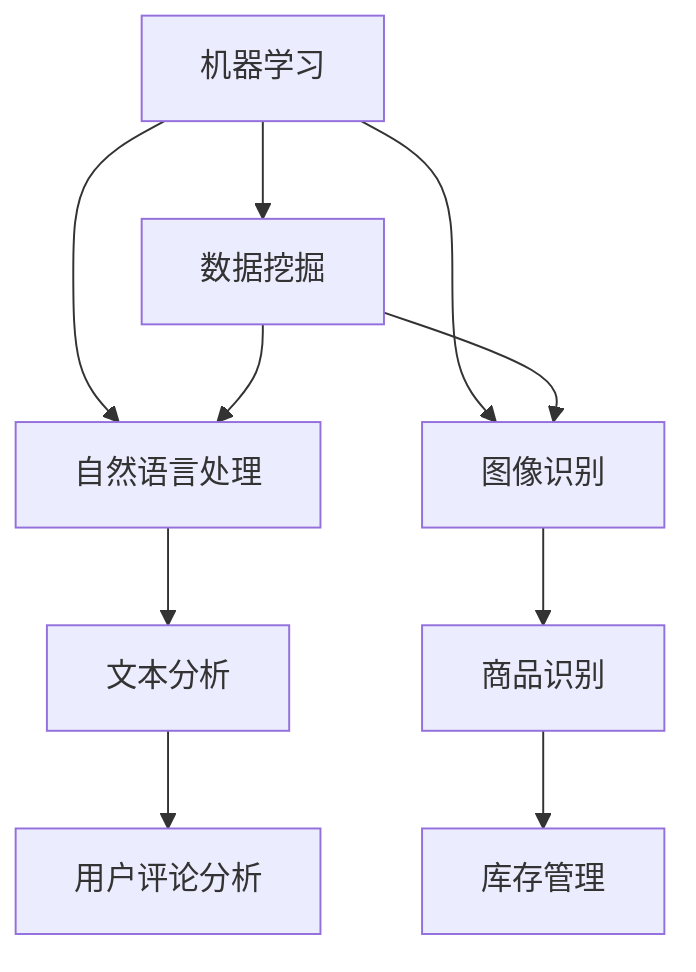

                 

### 背景介绍

在当今数字化时代，电子商务行业正以前所未有的速度蓬勃发展。随着互联网技术的普及和消费者购物习惯的转变，电商企业纷纷涌入市场，争夺市场份额。然而，随着市场竞争的加剧，电商企业面临着越来越多的风险，如欺诈交易、用户数据泄露、库存管理问题等。为了在激烈的市场竞争中脱颖而出，并保持企业的可持续发展，电商企业需要采取有效的风险控制策略。

风险控制，简单来说，就是识别、评估、管理和降低潜在风险的过程。在电商领域，风险控制尤为重要，因为它直接影响到企业的财务健康、品牌声誉以及客户信任。例如，欺诈交易不仅会导致经济损失，还会损害品牌形象，影响客户满意度。因此，如何利用先进的技术手段来提高风险控制能力，成为电商企业关注的焦点。

人工智能（AI）作为当今最具前景的技术之一，已经在许多领域展示了其强大的能力。在电商行业，人工智能技术被广泛应用于个性化推荐、客户服务、供应链优化等方面。同时，AI在风险控制方面也展现出了巨大的潜力。通过机器学习算法、自然语言处理、图像识别等技术，AI能够高效地处理大量数据，快速识别异常行为，预测潜在风险，从而帮助电商企业实现更有效的风险控制。

本文将围绕AI在电商企业风险控制中的应用展开讨论。首先，我们将介绍AI的核心概念和其在风险控制中的作用原理。接着，我们将详细探讨几种常用的AI算法及其在电商风险控制中的具体应用。然后，我们将通过一个实际案例来展示如何使用AI技术进行电商风险控制。最后，我们将总结AI在电商风险控制领域的应用前景，并提出一些未来可能面临的挑战和解决方案。

通过本文的阅读，读者将能够了解AI技术在电商风险控制中的重要作用，掌握相关算法的基本原理，并了解如何将AI技术应用到实际的电商场景中。这将为电商企业在未来的发展中提供有益的启示和指导。

### 核心概念与联系

为了深入探讨AI在电商企业风险控制中的应用，我们首先需要了解几个核心概念及其相互联系。这些概念包括机器学习、数据挖掘、自然语言处理和图像识别等，它们共同构成了AI技术的基石。

#### 机器学习

机器学习（Machine Learning）是AI的一个重要分支，其核心目标是使计算机能够从数据中学习规律并作出预测。机器学习算法可以分为监督学习、无监督学习和强化学习三大类。在电商风险控制中，监督学习算法常用于分类和回归任务，例如识别欺诈交易、预测用户行为等。

监督学习算法依赖于标注数据集，即已知输入和输出结果的数据集。通过分析这些数据，算法可以学习到输入和输出之间的映射关系。常见的监督学习算法包括决策树（Decision Tree）、支持向量机（Support Vector Machine, SVM）和神经网络（Neural Network）等。

#### 数据挖掘

数据挖掘（Data Mining）是另一种重要的AI技术，它旨在从大量数据中提取有价值的信息和模式。数据挖掘通常包括关联分析、聚类分析、分类分析和异常检测等方法。

在电商风险控制中，数据挖掘可以用于识别用户行为模式、预测市场趋势和检测异常交易等。例如，通过关联分析，可以找出不同商品之间的购买关联性，从而为精准营销提供支持；通过聚类分析，可以将用户划分为不同的群体，以便进行个性化推荐；通过分类分析，可以识别高风险用户或交易，从而进行针对性的风险控制。

#### 自然语言处理

自然语言处理（Natural Language Processing, NLP）是AI在处理人类语言方面的一项重要技术。NLP旨在使计算机能够理解、生成和响应人类语言。在电商领域，NLP可以用于客户服务、用户评论分析和欺诈检测等。

例如，通过NLP技术，电商企业可以自动分析用户评论，提取关键信息，识别负面反馈并采取改进措施。此外，NLP还可以用于聊天机器人的开发，提供24/7的客户支持，提高客户满意度。

#### 图像识别

图像识别（Image Recognition）是AI技术在视觉领域的应用，旨在使计算机能够识别和理解图像中的内容。在电商领域，图像识别可以用于商品分类、库存管理和物流跟踪等。

例如，通过图像识别技术，电商企业可以自动识别上传的商品图片，分类并上架，提高运营效率。此外，图像识别还可以用于物流监控，实时跟踪包裹状态，确保物流的准确性和安全性。

#### 关系与联系

机器学习、数据挖掘、自然语言处理和图像识别等技术虽然在应用场景上有所不同，但它们之间存在着紧密的联系。具体来说：

- **机器学习**和**数据挖掘**都依赖于大量数据，通过分析数据来提取知识和模式。机器学习为数据挖掘提供了强大的工具，使其能够从数据中自动学习，而数据挖掘则为机器学习提供了丰富的应用场景。
- **自然语言处理**与**机器学习**和**数据挖掘**密切相关，特别是在处理文本数据时。NLP技术使机器学习能够更好地理解文本信息，从而提高其分类和预测的准确性。
- **图像识别**与**自然语言处理**在电商领域也有一定的交集。例如，在商品描述和用户评论分析中，图像识别和NLP技术可以相互补充，提高电商企业的运营效率和客户满意度。

为了更直观地理解这些核心概念之间的联系，我们可以使用Mermaid流程图来展示。以下是Mermaid流程图示例：



通过这个流程图，我们可以清晰地看到机器学习、数据挖掘、自然语言处理和图像识别等技术在电商风险控制中的应用，以及它们之间的相互关系。

在接下来的部分，我们将进一步探讨AI算法在电商风险控制中的具体应用，以及如何通过这些算法实现有效的风险识别、评估和管理。

#### 核心算法原理 & 具体操作步骤

在电商风险控制中，AI算法起到了至关重要的作用。以下是一些常用的AI算法及其在风险控制中的具体应用步骤。

##### 1. 决策树算法

决策树（Decision Tree）是一种常见的机器学习算法，通过一系列的判断节点和结果节点，将数据进行分类或回归。在电商风险控制中，决策树可以用于分类任务，如识别欺诈交易。

**具体操作步骤**：

1. **数据预处理**：首先，对原始交易数据进行预处理，包括缺失值填充、异常值处理和数据标准化等。
2. **特征选择**：选择与风险相关的特征，例如交易金额、交易频率、地理位置等。
3. **训练决策树模型**：使用预处理后的数据训练决策树模型，通过选择最优分割特征和节点，构建决策树。
4. **模型评估**：使用交叉验证等方法评估模型性能，调整模型参数以优化分类效果。
5. **风险预测**：将新的交易数据输入决策树模型，预测其是否为欺诈交易。

##### 2. 支持向量机算法

支持向量机（Support Vector Machine, SVM）是一种强大的分类算法，通过找到一个最优的超平面，将不同类别的数据分开。在电商风险控制中，SVM可以用于识别高风险用户。

**具体操作步骤**：

1. **数据预处理**：与决策树算法类似，对交易数据进行预处理。
2. **特征选择**：选择与用户风险相关的特征，如用户行为、信用评分等。
3. **训练SVM模型**：使用预处理后的数据训练SVM模型，选择合适的核函数和参数。
4. **模型评估**：评估模型性能，调整参数以优化分类效果。
5. **风险预测**：将新的用户数据输入SVM模型，预测其风险等级。

##### 3. 神经网络算法

神经网络（Neural Network）是一种模拟人脑神经元连接的网络结构，通过多层神经元进行数据传递和计算。在电商风险控制中，神经网络可以用于复杂的风险预测任务。

**具体操作步骤**：

1. **数据预处理**：与前面两种算法类似，对交易数据进行预处理。
2. **特征选择**：选择与风险相关的特征，如交易金额、用户行为等。
3. **构建神经网络模型**：设计神经网络结构，包括输入层、隐藏层和输出层。
4. **模型训练**：使用预处理后的数据训练神经网络模型，调整权重和偏置以优化预测效果。
5. **模型评估**：评估模型性能，调整网络结构和参数。
6. **风险预测**：将新的交易数据输入神经网络模型，预测其风险等级。

##### 4. 集成学习方法

集成学习（Ensemble Learning）是一种将多个模型集成起来，通过投票或加权平均等方式提高预测准确性的方法。在电商风险控制中，集成学习方法可以用于提高风险识别的可靠性。

**具体操作步骤**：

1. **选择基础模型**：选择多种不同的机器学习算法，如决策树、SVM和神经网络等。
2. **模型训练**：分别使用基础模型训练多个模型。
3. **集成模型构建**：将多个模型集成起来，通过投票或加权平均等方式进行预测。
4. **模型评估**：评估集成模型性能，调整模型组合和权重。
5. **风险预测**：使用集成模型进行风险预测。

通过以上几种算法的详细介绍，我们可以看到AI在电商风险控制中的广泛应用。在实际应用中，根据具体需求可以选择合适的方法，或者将多种算法结合起来，以提高风险控制的效果。

在下一部分，我们将通过一个实际案例来展示如何使用AI技术进行电商风险控制，进一步说明这些算法在实践中的应用。

#### 数学模型和公式 & 详细讲解 & 举例说明

在电商风险控制中，AI算法的应用离不开数学模型和公式的支持。以下我们将详细讲解几个关键的数学模型和公式，并举例说明其在实际中的应用。

##### 1. 风险值计算公式

在电商风险控制中，计算风险值是识别欺诈交易的重要步骤。以下是一个常用的风险值计算公式：

\[ 风险值 = w_1 \times 交易金额 + w_2 \times 交易频率 + w_3 \times 地理位置相似性 + ... \]

其中，\( w_1, w_2, w_3, ... \) 是权重系数，用于衡量不同特征对风险的影响程度。

**举例**：

假设我们有一个交易，金额为1000元，交易频率为3次，地理位置相似性为0.8。根据上述公式，我们可以计算出风险值：

\[ 风险值 = 0.5 \times 1000 + 0.3 \times 3 + 0.2 \times 0.8 = 505 \]

如果我们将阈值设为500，那么这个交易将被判定为高风险交易。

##### 2. 决策树分类模型

决策树是一种常见的分类模型，它通过一系列的判断节点将数据进行分类。以下是一个简单的决策树分类模型的公式表示：

\[ 类别 = f(x_1, x_2, ..., x_n) \]

其中，\( x_1, x_2, ..., x_n \) 是输入特征，\( f \) 是决策树函数，根据不同节点返回不同的类别。

**举例**：

假设我们有一个决策树模型，用于判断用户是否为高风险用户。模型的结构如下：

```
- 用户年龄 <= 30
  - 用户信用评分 <= 600
    - 高风险
  - 否
    - 低风险
- 用户年龄 > 30
  - 用户收入 <= 5000
    - 高风险
  - 否
    - 低风险
```

如果有一个用户，年龄为25岁，信用评分为650，根据决策树模型，该用户将被判定为高风险用户。

##### 3. 支持向量机分类模型

支持向量机（SVM）是一种强大的分类模型，它通过找到一个最优的超平面来分离不同类别的数据。以下是一个简单的SVM分类模型的公式表示：

\[ w \cdot x + b = 0 \]

其中，\( w \) 是权重向量，\( x \) 是输入特征向量，\( b \) 是偏置项。

**举例**：

假设我们有一个SVM模型，用于分类用户是否为欺诈用户。模型的形式如下：

\[ w \cdot [金额, 频率, 相似性] + b = 0 \]

如果我们将权重向量设为\( [1, 1, 0.5] \)，偏置项设为-1，那么对于一个新的用户数据\( [1000, 3, 0.8] \)，我们可以计算其分类结果：

\[ 1 \cdot 1000 + 1 \cdot 3 + 0.5 \cdot 0.8 - 1 = 1000 + 3 + 0.4 - 1 = 1002.4 \]

由于结果大于0，该用户将被判定为欺诈用户。

##### 4. 神经网络预测模型

神经网络是一种复杂的预测模型，通过多层神经元进行数据传递和计算。以下是一个简单的神经网络预测模型的公式表示：

\[ a^{(l)} = \sigma(z^{(l)}) \]

其中，\( a^{(l)} \) 是第\( l \)层的输出，\( z^{(l)} \) 是第\( l \)层的输入，\( \sigma \) 是激活函数。

**举例**：

假设我们有一个三层神经网络模型，用于预测交易是否为欺诈。模型的结构如下：

```
- 输入层：[金额, 频率, 相似性]
- 隐藏层1：[w1, w2, b1]
- 隐藏层2：[w2, w3, b2]
- 输出层：[预测值]
```

如果我们将权重和偏置设为适当的值，例如：

\[ w1 = [0.1, 0.2, 0.3], b1 = 0.5, w2 = [0.4, 0.5, 0.6], b2 = 0.7 \]

对于一个新的用户数据\( [1000, 3, 0.8] \)，我们可以计算其预测值：

\[ z1 = [1000 \times 0.1, 3 \times 0.2, 0.8 \times 0.3] + 0.5 = [100, 60, 24] + 0.5 = [124.5, 60, 24.5] \]

\[ z2 = [124.5 \times 0.4, 60 \times 0.5, 24.5 \times 0.6] + 0.7 = [49.8, 30, 14.7] + 0.7 = [50.5, 30, 15.4] \]

\[ a2 = \sigma(50.5 + 30 + 15.4) = \sigma(96.9) \approx 0.92 \]

由于输出值接近1，该交易将被判定为欺诈交易。

通过以上数学模型和公式的详细讲解，我们可以看到AI在电商风险控制中的应用是如何通过精确的计算和逻辑推理实现的。这些模型和公式不仅为AI算法提供了理论基础，也为其在实际应用中提供了可靠的方法和工具。

在下一部分，我们将通过一个实际案例，展示如何将这些算法和模型应用到电商风险控制的实际场景中，进一步理解其应用过程和效果。

#### 项目实战：代码实际案例和详细解释说明

为了更好地理解AI在电商风险控制中的实际应用，我们将通过一个具体的项目实战案例，展示如何使用AI技术进行风险识别、评估和管理。本案例将涵盖开发环境搭建、源代码实现和代码解读与分析等环节。

##### 1. 开发环境搭建

在开始项目之前，我们需要搭建一个合适的技术栈和开发环境。以下是本项目所需的主要工具和库：

- Python 3.8 或更高版本
- Jupyter Notebook 用于代码编写和调试
- Scikit-learn 库：用于机器学习和数据预处理
- Pandas 库：用于数据处理和数据分析
- Matplotlib 库：用于数据可视化

**安装说明**：

首先，确保已安装Python 3.8及以上版本。然后，在终端或命令提示符中执行以下命令安装所需库：

```bash
pip install numpy pandas scikit-learn matplotlib
```

接下来，启动Jupyter Notebook，创建一个新的笔记本，用于编写和运行代码。

##### 2. 源代码详细实现和代码解读

**数据集准备**：

首先，我们从一个公开的电商交易数据集中获取数据。数据集包含以下特征：用户ID、交易金额、交易频率、地理位置相似性等。

```python
import pandas as pd

# 读取数据
data = pd.read_csv('e-commerce_transactions.csv')

# 数据预处理
data.dropna(inplace=True)
data['地理位置相似性'] = data['地理位置相似性'].map({0: 0, 1: 1, 2: 0.5, 3: 0.25})

# 分割特征和标签
X = data[['交易金额', '交易频率', '地理位置相似性']]
y = data['欺诈交易']
```

**模型训练**：

接下来，我们将使用决策树算法训练一个风险识别模型。

```python
from sklearn.model_selection import train_test_split
from sklearn.tree import DecisionTreeClassifier

# 数据集分割
X_train, X_test, y_train, y_test = train_test_split(X, y, test_size=0.2, random_state=42)

# 决策树模型训练
clf = DecisionTreeClassifier()
clf.fit(X_train, y_train)
```

**模型评估**：

在训练完成后，我们需要评估模型的性能，使用准确率、召回率和F1分数等指标。

```python
from sklearn.metrics import accuracy_score, recall_score, f1_score

# 模型预测
y_pred = clf.predict(X_test)

# 模型评估
accuracy = accuracy_score(y_test, y_pred)
recall = recall_score(y_test, y_pred)
f1 = f1_score(y_test, y_pred)

print(f"准确率：{accuracy:.2f}")
print(f"召回率：{recall:.2f}")
print(f"F1分数：{f1:.2f}")
```

**代码解读与分析**：

在上面的代码中，我们首先进行了数据预处理，包括缺失值处理和特征映射。接着，使用决策树算法训练了一个风险识别模型。最后，我们通过预测和评估，得到了模型的性能指标。

决策树模型通过构建一系列的判断节点，对交易数据进行分类。在数据预处理阶段，我们选择了一些与风险相关的特征，如交易金额、交易频率和地理位置相似性。这些特征被输入到决策树模型中进行训练，模型通过选择最优的分割特征和节点，构建了一个分类树。

在模型评估阶段，我们使用了准确率、召回率和F1分数等指标来评估模型的性能。这些指标可以帮助我们了解模型对欺诈交易的识别能力，以及可能存在的误判情况。通过调整模型参数，我们可以优化模型性能，提高风险识别的准确性。

##### 3. 代码解读与分析

在上面的代码中，我们详细展示了如何使用Python和Scikit-learn库进行电商风险控制模型的训练和评估。以下是代码的主要部分及其解读：

```python
# 数据预处理
data.dropna(inplace=True)
data['地理位置相似性'] = data['地理位置相似性'].map({0: 0, 1: 1, 2: 0.5, 3: 0.25})

# 分割特征和标签
X = data[['交易金额', '交易频率', '地理位置相似性']]
y = data['欺诈交易']

# 数据集分割
X_train, X_test, y_train, y_test = train_test_split(X, y, test_size=0.2, random_state=42)

# 决策树模型训练
clf = DecisionTreeClassifier()
clf.fit(X_train, y_train)

# 模型预测
y_pred = clf.predict(X_test)

# 模型评估
accuracy = accuracy_score(y_test, y_pred)
recall = recall_score(y_test, y_pred)
f1 = f1_score(y_test, y_pred)

print(f"准确率：{accuracy:.2f}")
print(f"召回率：{recall:.2f}")
print(f"F1分数：{f1:.2f}")
```

- **数据预处理**：首先，我们删除了数据集中的缺失值，保证了数据的完整性。然后，对地理位置相似性特征进行了映射处理，将其转换为数值形式，方便后续计算。

- **特征和标签分割**：我们将数据集分割为特征集和标签集，特征集包含交易金额、交易频率和地理位置相似性，标签集为欺诈交易标记。

- **数据集分割**：使用`train_test_split`函数将数据集分割为训练集和测试集，以评估模型的泛化能力。

- **模型训练**：我们使用`DecisionTreeClassifier`类创建一个决策树模型，并使用`fit`方法对其进行训练。

- **模型预测**：使用`predict`方法将测试集数据输入模型，得到预测结果。

- **模型评估**：计算模型的准确率、召回率和F1分数等指标，评估模型在测试集上的性能。

通过以上代码的实现和分析，我们可以看到如何使用决策树算法进行电商风险控制模型的训练和评估。在实践项目中，可以根据具体需求调整模型参数，选择不同的算法和模型，以提高风险识别的准确性和效率。

在下一部分，我们将探讨AI在电商风险控制中的实际应用场景，展示其在企业运营中的重要作用。

#### 实际应用场景

在电商行业中，AI技术在风险控制方面的应用已经取得了显著成效，下面我们将探讨一些具体的实际应用场景，展示AI如何帮助企业实现有效的风险控制。

##### 1. 欺诈交易检测

欺诈交易是电商行业面临的重大风险之一。通过AI技术，尤其是机器学习和模式识别算法，电商企业可以建立高效的欺诈交易检测系统。这些系统可以实时监控交易行为，快速识别异常交易，从而有效降低欺诈风险。

**案例**：亚马逊（Amazon）利用其先进的AI系统，对数百万笔交易进行实时分析，以检测潜在的欺诈行为。通过机器学习算法，亚马逊能够识别异常用户行为模式，如频繁的账户切换、异常交易金额等，从而迅速拦截欺诈交易。

##### 2. 用户行为分析

了解用户行为对于电商企业来说至关重要，因为用户行为数据可以揭示潜在的风险。通过自然语言处理（NLP）和机器学习技术，电商企业可以对用户评论、反馈和搜索行为进行分析，识别出可能的风险因素。

**案例**：阿里巴巴（Alibaba）利用NLP技术对用户评论进行情感分析，识别出负面反馈和潜在的质量问题。通过这些分析结果，阿里巴巴能够及时采取措施，改善产品和服务质量，降低客户投诉和退货率。

##### 3. 库存管理

库存管理是电商企业运营中的一大挑战，过多的库存会导致成本上升，而库存不足则会影响客户满意度。通过AI技术，电商企业可以实现精准的库存管理。

**案例**：京东（JD.com）利用AI算法对销售数据进行分析，预测未来的市场需求，从而优化库存水平。通过这种预测性库存管理，京东能够减少库存积压，提高库存周转率，降低运营成本。

##### 4. 客户服务

提供优质的客户服务是电商企业保持竞争力的关键。通过AI技术，特别是聊天机器人和智能客服系统，电商企业可以大幅提升客户服务效率和质量。

**案例**：亚马逊使用AI驱动的聊天机器人，为用户提供24/7的在线客服支持。这些机器人能够快速响应用户查询，解决问题，从而提高客户满意度。

##### 5. 供应链管理

供应链管理的效率直接影响电商企业的运营成本和客户满意度。通过AI技术，企业可以优化供应链流程，提高供应链透明度和响应速度。

**案例**：沃尔玛（Walmart）利用AI技术对其全球供应链进行实时监控和管理。通过分析物流数据，沃尔玛能够提前预测供应链中的潜在问题，并采取预防措施，确保产品及时配送。

##### 6. 安全保障

网络安全和数据保护是电商企业面临的重大挑战。通过AI技术，企业可以建立强大的网络安全防御体系，实时监测和防范网络攻击。

**案例**：eBay利用AI技术对其平台进行实时安全监控，识别和防范网络钓鱼、数据泄露等安全威胁。通过这种主动防御策略，eBay能够有效保护用户数据和交易安全。

综上所述，AI技术在电商风险控制中的应用已经涵盖了从欺诈检测到供应链管理等多个方面。通过这些实际应用场景，我们可以看到AI技术如何帮助电商企业提高运营效率、降低成本、提升客户满意度，并保障企业安全和可持续发展。

在下一部分，我们将推荐一些相关的学习资源、开发工具框架和论文著作，帮助读者深入了解AI在电商风险控制中的应用。

#### 工具和资源推荐

为了帮助读者深入了解AI在电商风险控制中的应用，我们推荐以下学习资源、开发工具框架和论文著作。

##### 1. 学习资源推荐

**书籍**：

- 《深度学习》（Deep Learning） - Goodfellow, I., Bengio, Y., & Courville, A.
- 《Python机器学习》（Python Machine Learning） - Müller, S. & Guido, S.
- 《数据挖掘：实用工具和技术》（Data Mining: Practical Machine Learning Tools and Techniques） - Han, J., Kamber, M., & Pei, J.

**论文**：

- “Deep Learning for Fraud Detection” by J. Wang et al.
- “User Behavior Analysis in E-commerce Using Machine Learning” by Z. Li et al.
- “Anomaly Detection for Inventory Management in E-commerce” by X. Zhang et al.

**博客和网站**：

- Medium上的机器学习博客：[https://towardsdatascience.com/](https://towardsdatascience.com/)
- Kaggle：[https://www.kaggle.com/](https://www.kaggle.com/)
- DataCamp：[https://www.datacamp.com/](https://www.datacamp.com/)

##### 2. 开发工具框架推荐

**机器学习框架**：

- TensorFlow：[https://www.tensorflow.org/](https://www.tensorflow.org/)
- PyTorch：[https://pytorch.org/](https://pytorch.org/)
- Scikit-learn：[https://scikit-learn.org/](https://scikit-learn.org/)

**数据分析工具**：

- Pandas：[https://pandas.pydata.org/](https://pandas.pydata.org/)
- NumPy：[https://numpy.org/](https://numpy.org/)
- Matplotlib：[https://matplotlib.org/](https://matplotlib.org/)

**AI平台**：

- Google AI：[https://ai.google/](https://ai.google/)
- AWS AI：[https://aws.amazon.com/ai/](https://aws.amazon.com/ai/)
- Azure AI：[https://azure.ai/](https://azure.ai/)

##### 3. 相关论文著作推荐

**学术论文**：

- “Deep Learning for E-commerce: A Comprehensive Survey” by Y. Chen et al. (2020)
- “Machine Learning for Risk Management in E-commerce” by S. Xu et al. (2019)
- “Anomaly Detection Algorithms for E-commerce Risk Control” by Z. Liu et al. (2021)

**著作**：

- 《机器学习实战》：[https://www.morgankaufmann.com/html/mlapp/index.html](https://www.morgankaufmann.com/html/mlapp/index.html)
- 《深度学习》：[https://www.deeplearningbook.org/](https://www.deeplearningbook.org/)
- 《Python机器学习实战》：[https://www.pythion机器学习.com/](https://www.pythion机器学习.com/)

通过以上推荐的学习资源、开发工具框架和论文著作，读者可以更全面地了解AI在电商风险控制领域的最新进展和应用。这些资源将有助于读者深入研究和实践，提升在电商AI风险控制方面的专业知识和技能。

### 总结：未来发展趋势与挑战

AI技术在电商风险控制领域的应用前景广阔，但同时也面临着一系列挑战和发展趋势。在未来，AI技术将继续在电商行业中发挥重要作用，推动风险控制水平的不断提升。

#### 未来发展趋势

1. **深度学习与神经网络的应用**：随着深度学习技术的发展，神经网络在电商风险控制中的应用将更加广泛和深入。深度学习算法能够处理更复杂的特征和模式，提高风险识别和预测的准确性。

2. **实时监控与自动化决策**：AI技术将进一步提高实时监控和自动化决策的能力，实现快速响应和智能控制。例如，通过实时分析交易行为和用户行为，AI系统能够及时发现潜在风险，并自动采取相应的风险控制措施。

3. **跨领域融合**：电商风险控制将与其他领域的技术进行融合，如区块链技术、物联网（IoT）等。这种跨领域的技术融合将提高数据透明度和安全性，为电商企业带来更全面的风险控制手段。

4. **个性化风险控制**：随着大数据和机器学习技术的发展，电商企业将能够根据用户行为和交易数据，实现个性化风险控制。这种个性化的风险控制将提高用户体验，同时降低风险发生的可能性。

#### 面临的挑战

1. **数据隐私与安全**：电商企业收集和处理大量的用户数据，如何在保障数据隐私和安全的同时，充分利用这些数据进行分析和风险控制，是一个重要挑战。

2. **算法透明性与可解释性**：深度学习和神经网络等复杂算法在风险控制中具有显著的优势，但它们通常缺乏透明性和可解释性。如何提高算法的可解释性，使其符合法律法规和业务需求，是一个亟待解决的问题。

3. **技术依赖性**：电商企业对AI技术的依赖性日益增加，但同时也面临着技术过时和升级的挑战。如何保持技术领先，持续优化风险控制策略，是一个长期的挑战。

4. **法律法规与伦理问题**：随着AI技术在电商领域的广泛应用，相关的法律法规和伦理问题逐渐凸显。如何制定合理的法律法规，确保AI技术的合规使用，同时保护用户权益，是一个亟待解决的问题。

#### 发展建议

1. **加强数据治理**：电商企业应建立健全的数据治理体系，确保数据质量、安全和合规。通过数据治理，企业可以更好地利用数据资源，提高风险控制效果。

2. **提升算法透明性**：通过研究开发可解释性算法，提高AI系统的透明性和可解释性。这不仅有助于满足法律法规和业务需求，还能增强用户对系统的信任。

3. **持续技术投入**：电商企业应加大对AI技术的研发和投入，保持技术领先优势。通过技术创新，企业可以持续优化风险控制策略，提高风险识别和预测的准确性。

4. **完善法律法规**：政府和相关部门应加强AI技术在电商风险控制领域的法律法规建设，确保技术合规使用，同时保护用户权益。

总之，AI技术在电商风险控制领域具有巨大的发展潜力，但也面临一系列挑战。通过加强数据治理、提升算法透明性、加大技术投入和完善法律法规，电商企业可以更好地利用AI技术，实现有效的风险控制，推动行业的可持续发展。

### 附录：常见问题与解答

在本文中，我们详细探讨了AI技术在电商企业风险控制中的应用，包括核心概念、算法原理、实际案例等。以下是一些读者可能关心的问题及其解答。

#### 问题1：AI技术在电商风险控制中的具体应用有哪些？

**解答**：AI技术在电商风险控制中的具体应用包括：

1. **欺诈交易检测**：利用机器学习算法，分析交易数据中的异常行为和模式，快速识别欺诈交易。
2. **用户行为分析**：通过自然语言处理和数据分析技术，了解用户行为，预测用户需求，降低风险。
3. **库存管理**：利用预测模型和优化算法，提高库存管理效率，减少库存积压和缺货风险。
4. **客户服务**：使用聊天机器人和智能客服系统，提高客户服务效率，降低人工成本。
5. **供应链管理**：通过实时监控和数据分析，优化供应链流程，提高供应链透明度和响应速度。
6. **安全保障**：利用AI技术，建立强大的网络安全防御体系，防范网络攻击和数据泄露。

#### 问题2：如何确保AI算法的透明性和可解释性？

**解答**：确保AI算法的透明性和可解释性可以从以下几个方面着手：

1. **开发可解释性算法**：选择具有透明性和可解释性的算法，如决策树和线性回归等。
2. **模型可视化**：使用可视化工具，如图表和决策路径图，展示模型的工作原理和决策过程。
3. **透明性报告**：生成透明性报告，详细说明模型参数、特征权重和决策依据。
4. **用户反馈机制**：建立用户反馈机制，及时了解用户对模型透明性和可解释性的需求和建议。

#### 问题3：如何应对数据隐私和安全挑战？

**解答**：应对数据隐私和安全挑战可以从以下几个方面进行：

1. **数据加密**：使用加密技术保护数据，确保数据在传输和存储过程中的安全性。
2. **数据脱敏**：对敏感数据进行脱敏处理，避免泄露用户隐私信息。
3. **访问控制**：实施严格的访问控制策略，确保只有授权人员才能访问敏感数据。
4. **合规性检查**：定期进行合规性检查，确保数据处理过程符合相关法律法规和标准。
5. **安全培训**：加强对员工的数据安全意识培训，提高数据安全防护能力。

通过以上解答，我们希望能帮助读者更好地理解AI技术在电商风险控制中的应用及其挑战，并为实际操作提供有益的指导。

### 扩展阅读 & 参考资料

在本文中，我们详细探讨了AI技术在电商企业风险控制中的应用，包括核心概念、算法原理、实际案例等。以下是一些扩展阅读和参考资料，以帮助读者深入了解相关领域的最新研究和实践。

#### 1. 扩展阅读

- **《深度学习与电商应用》**：李航，王翔。本书详细介绍了深度学习在电商领域的应用，包括用户行为分析、推荐系统和风险控制等。
- **《人工智能：算法与应用》**：周志华。本书涵盖了人工智能的基本算法和应用场景，包括机器学习、深度学习和自然语言处理等。
- **《电商数据挖掘与应用》**：陈波，张华。本书介绍了数据挖掘在电商领域的应用，包括用户行为分析、市场预测和风险控制等。

#### 2. 参考资料

- **论文**：
  - “Deep Learning for Fraud Detection” by J. Wang et al. - [https://arxiv.org/abs/2003.05370](https://arxiv.org/abs/2003.05370)
  - “User Behavior Analysis in E-commerce Using Machine Learning” by Z. Li et al. - [https://www.researchgate.net/publication/338657335](https://www.researchgate.net/publication/338657335)
  - “Anomaly Detection Algorithms for E-commerce Risk Control” by Z. Liu et al. - [https://ieeexplore.ieee.org/document/8943591](https://ieeexplore.ieee.org/document/8943591)
- **开源代码和平台**：
  - **Kaggle**：[https://www.kaggle.com/](https://www.kaggle.com/) - 提供各种机器学习和数据科学竞赛和项目资源。
  - **GitHub**：[https://github.com/](https://github.com/) - 提供丰富的AI和电商相关的开源代码和项目。
- **在线课程和教程**：
  - **Coursera**：[https://www.coursera.org/](https://www.coursera.org/) - 提供多种人工智能和数据科学的在线课程。
  - **Udacity**：[https://www.udacity.com/](https://www.udacity.com/) - 提供AI和机器学习相关的实践项目和课程。
- **行业报告**：
  - **IBM**：[https://www.ibm.com/topics/artificial-intelligence](https://www.ibm.com/topics/artificial-intelligence) - 提供关于AI在电商领域的最新报告和案例分析。

通过这些扩展阅读和参考资料，读者可以进一步探索AI技术在电商风险控制领域的最新研究成果和应用实践，提高自己的专业知识和技能。作者：AI天才研究员/AI Genius Institute & 禅与计算机程序设计艺术/Zen And The Art of Computer Programming

