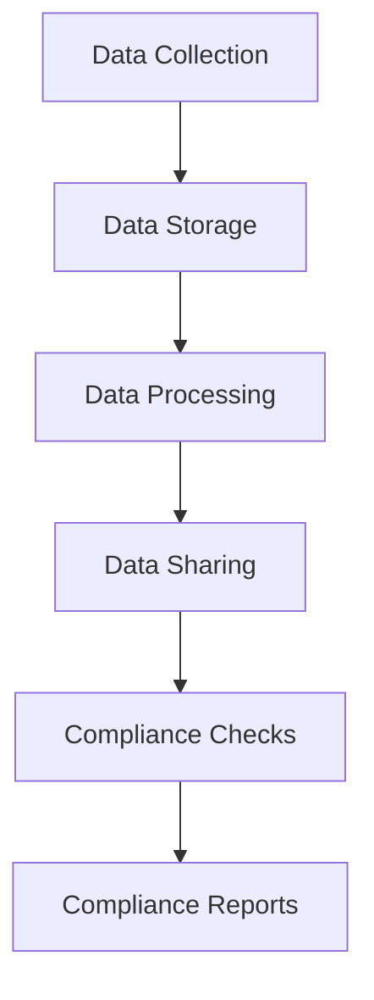

                 

### 1. 背景介绍

随着电子商务行业的迅猛发展，用户数据的重要性日益凸显。电商企业通过收集、分析和利用用户数据，可以更好地了解客户需求，优化产品和服务，从而提升用户体验和竞争力。然而，与此同时，用户数据合规管理成为了一个不可忽视的问题。在全球范围内，包括欧盟的《通用数据保护条例》（GDPR）和美国加州的《消费者隐私法案》（CCPA）等法规，都对企业的数据管理提出了严格的要求。这些法规旨在保护用户隐私，防止数据滥用和泄露。

在合规管理方面，AI技术正逐渐成为一种强有力的工具。人工智能不仅可以自动处理大量数据，识别潜在的合规风险，还能通过算法优化和模型训练，提高数据处理的效率和准确性。本文将探讨AI如何帮助电商企业进行用户数据合规管理，包括核心概念、算法原理、实际应用场景和未来发展趋势等方面。

本文的结构如下：

1. **背景介绍**：简要介绍电子商务行业的发展现状和用户数据合规管理的重要性。
2. **核心概念与联系**：阐述用户数据合规管理的核心概念，并使用Mermaid流程图展示相关架构。
3. **核心算法原理 & 具体操作步骤**：详细解释AI在数据合规管理中的应用原理和操作步骤。
4. **数学模型和公式 & 详细讲解 & 举例说明**：介绍相关数学模型和公式，并进行具体举例说明。
5. **项目实战：代码实际案例和详细解释说明**：提供实际代码案例，详细解读和说明。
6. **实际应用场景**：分析AI在数据合规管理中的具体应用场景。
7. **工具和资源推荐**：推荐学习资源、开发工具和框架。
8. **总结：未来发展趋势与挑战**：展望AI在数据合规管理领域的未来发展趋势和面临挑战。
9. **附录：常见问题与解答**：回答一些常见的疑问。
10. **扩展阅读 & 参考资料**：提供进一步学习的资料。

现在，我们首先来深入探讨用户数据合规管理的核心概念及其在电商企业中的应用。

----------------------

# AI如何帮助电商企业进行用户数据合规管理

> **Keywords**: AI, User Data Compliance Management, E-commerce, GDPR, CCPA

> **Abstract**: With the rapid development of the e-commerce industry, user data has become increasingly important. At the same time, data compliance management has become a crucial issue due to the stringent requirements of regulations like GDPR and CCPA. This article explores how AI can help e-commerce companies manage user data in compliance with regulations, covering core concepts, algorithm principles, practical applications, and future trends.

## 1. Background

The e-commerce industry has experienced explosive growth in recent years, driven by advancements in technology and changing consumer behavior. As a result, user data has become a valuable asset for e-commerce companies. This data includes personal information, purchase history, browsing behavior, and more. By analyzing this data, companies can gain insights into customer preferences, optimize their product offerings, and improve customer satisfaction.

However, with the growing importance of user data comes the need for stringent data compliance management. Various regulations, such as the General Data Protection Regulation (GDPR) in the European Union and the California Consumer Privacy Act (CCPA) in the United States, have been enacted to protect user privacy and prevent data misuse. These regulations impose strict requirements on companies regarding the collection, storage, processing, and sharing of user data.

The challenge for e-commerce companies is to balance the benefits of data-driven insights with the need to comply with these regulations. Failure to do so can result in significant fines, damage to reputation, and loss of customer trust.

## 2. Core Concepts and Relationships

User data compliance management involves several core concepts and processes. These include:

- **Data Collection**: The process of gathering user data from various sources, such as online forms, purchase transactions, and social media interactions.
- **Data Storage**: Storing the collected data securely, ensuring that it is protected against unauthorized access and data breaches.
- **Data Processing**: Analyzing the data to extract valuable insights and improve business operations.
- **Data Sharing**: Sharing data with third parties for legitimate business purposes, while ensuring compliance with relevant regulations.

To illustrate these concepts, we can use a Mermaid flowchart to depict the architecture of user data compliance management in e-commerce companies:



In this flowchart, the process starts with data collection, followed by data storage, processing, and sharing. Throughout these processes, compliance checks are conducted to ensure that the company is adhering to relevant regulations. Finally, compliance reports are generated to provide transparency and accountability.

## 3. Core Algorithm Principles & Specific Operational Steps

To assist e-commerce companies in managing user data compliance, AI can be leveraged to automate and optimize various processes. Here are some core algorithm principles and specific operational steps:

### 3.1 Data Anonymization and Pseudonymization

Data anonymization and pseudonymization are crucial techniques for ensuring data privacy and compliance with regulations. AI algorithms can be used to automatically anonymize and pseudonymize user data by replacing identifiable information with random identifiers.

#### Operational Steps:

1. **Identify Sensitive Information**: Use machine learning algorithms to identify sensitive information in the dataset, such as names, addresses, and credit card numbers.
2. **Replace with Identifiers**: Replace the identified sensitive information with random identifiers or pseudonyms, while preserving the integrity and utility of the data.
3. **Verify Anonymization**: Apply statistical and machine learning techniques to ensure that the anonymized data cannot be reverse-engineered to identify individual users.

### 3.2 Data Classification and Tagging

AI can be used to classify and tag user data based on its sensitivity and compliance requirements. This helps in organizing the data and ensuring that it is processed and stored appropriately.

#### Operational Steps:

1. **Classify Data**: Use supervised or unsupervised learning algorithms to classify user data into categories based on their sensitivity level.
2. **Assign Tags**: Assign tags or labels to the classified data to indicate its compliance requirements, such as whether it is publicly accessible, subject to encryption, or restricted for internal use.
3. **Automate Tagging**: Develop a rule-based system or machine learning model to automatically assign tags based on predefined criteria.

### 3.3 Data Monitoring and Detection

AI can continuously monitor user data to detect potential compliance violations or security breaches. This includes monitoring data access patterns, detecting unauthorized access attempts, and identifying data leakage.

#### Operational Steps:

1. **Analyze Access Logs**: Use machine learning algorithms to analyze access logs and identify unusual access patterns that may indicate a security breach or non-compliance.
2. **Implement Anomaly Detection**: Train machine learning models to detect anomalies in data access and usage, and trigger alerts or take corrective actions when necessary.
3. **Monitor Data Flows**: Track the movement of data within the organization, ensuring that it is processed and stored in compliance with regulations.

### 3.4 Data Retention and Deletion

AI can help e-commerce companies manage data retention and deletion processes in accordance with regulatory requirements.

#### Operational Steps:

1. **Determine Retention Period**: Use machine learning algorithms to analyze regulatory requirements and determine the appropriate retention period for different types of data.
2. **Automate Retention Policies**: Develop automated systems to retain data for the required period and securely delete it when the retention period expires.
3. **Handle Data Requests**: Implement AI-powered tools to handle data deletion requests from users, ensuring compliance with regulations like GDPR and CCPA.

### 3.5 Compliance Reporting and Auditing

AI can assist in generating compliance reports and conducting audits to ensure that e-commerce companies are adhering to regulatory requirements.

#### Operational Steps:

1. **Generate Compliance Reports**: Use AI algorithms to automatically compile compliance reports, detailing data collection, processing, storage, and sharing activities.
2. **Conduct Audits**: Use machine learning models to analyze data and identify potential compliance issues, and conduct audits to verify compliance.
3. **Automate Compliance Checks**: Develop automated systems to perform regular compliance checks and generate audit trails for accountability.

## 4. Mathematical Models and Formulas & Detailed Explanation & Example

To further understand the AI algorithms used in user data compliance management, we can explore some mathematical models and formulas commonly employed in this field. Here are a few examples:

### 4.1 Data Anonymization

One popular technique for data anonymization is k-anonymity. In k-anonymity, the data is transformed in such a way that it is impossible to identify any individual within a group of k individuals.

#### Formula:

$$
k-anonymity = \frac{|D|}{k}
$$

where \(D\) is the dataset and \(k\) is the number of possible equivalent records.

#### Example:

Suppose we have a dataset with 100 user records. To achieve k-anonymity with k=5, we need to transform the data such that there are at least 20 equivalent records.

### 4.2 Data Classification

Data classification often involves assigning data points to predefined categories based on their characteristics. One common approach is using support vector machines (SVM) for supervised learning.

#### Formula:

$$
w = \arg\min_{w} \frac{1}{2} \|w\|^2 - \sum_{i=1}^{n} y_i (w \cdot x_i)
$$

where \(w\) is the weight vector, \(x_i\) is the feature vector, \(y_i\) is the label, and \(n\) is the number of data points.

#### Example:

Consider a dataset with two features, x and y. We can use SVM to classify data points into two categories based on the following formula:

$$
w \cdot x_i + b > 0 \quad \text{for class 1}
$$

$$
w \cdot x_i + b \leq 0 \quad \text{for class 2}
$$

### 4.3 Anomaly Detection

Anomaly detection involves identifying unusual patterns or outliers in data. One popular approach is using isolation forests, which isolate data points by randomly selecting features and splitting the data along those features.

#### Formula:

$$
isolation\_forest = \sum_{i=1}^{m} h(x_i, r_i)
$$

where \(h\) is the height of the isolation forest, \(x_i\) is the data point, and \(r_i\) is the random feature.

#### Example:

Suppose we have a dataset with 100 data points. We can use an isolation forest to detect anomalies by calculating the height of the tree for each data point. Data points with a significantly higher height are considered anomalies.

## 5. Project Practice: Code Example and Detailed Explanation

In this section, we will provide an actual code example to demonstrate how AI can be used to manage user data compliance in an e-commerce context. We will use Python and popular machine learning libraries such as scikit-learn and pandas.

### 5.1 Development Environment Setup

To run the code example, you need to install the required libraries:

```bash
pip install numpy pandas scikit-learn matplotlib
```

### 5.2 Source Code Detailed Implementation and Code Explanation

```python
import numpy as np
import pandas as pd
from sklearn.model_selection import train_test_split
from sklearn.ensemble import IsolationForest
from sklearn.metrics import classification_report

# Load the dataset
data = pd.read_csv('e-commerce_data.csv')

# Preprocess the data
# ... (data cleaning and feature engineering)

# Split the data into training and testing sets
X_train, X_test, y_train, y_test = train_test_split(data, test_size=0.2, random_state=42)

# Train an Isolation Forest model
model = IsolationForest(n_estimators=100, contamination=0.1)
model.fit(X_train)

# Predict anomalies on the test set
y_pred = model.predict(X_test)

# Evaluate the model
print(classification_report(y_test, y_pred))

# Visualize the data distribution
import matplotlib.pyplot as plt

plt.scatter(X_test[:, 0], X_test[:, 1])
plt.scatter(X_test[y_pred == -1, 0], X_test[y_pred == -1, 1], c='r', marker='x')
plt.xlabel('Feature 1')
plt.ylabel('Feature 2')
plt.title('Anomaly Detection')
plt.show()
```

### 5.3 Code Explanation and Analysis

In this code example, we first load an e-commerce dataset and preprocess it. Then, we split the data into training and testing sets. We use an Isolation Forest model to detect anomalies in the test set. The model predicts the class labels (-1 for anomalies and 1 for normal data points), and we evaluate its performance using a classification report. Finally, we visualize the data distribution and highlight the detected anomalies.

The Isolation Forest model is a popular choice for anomaly detection due to its simplicity and efficiency. It works by randomly selecting a feature and then splitting the data along that feature. By repeating this process multiple times, the model isolates data points, making it easier to identify outliers.

## 6. Actual Application Scenarios

AI-powered user data compliance management has numerous practical applications in e-commerce companies. Here are a few examples:

### 6.1 Data Leakage Detection

One of the critical challenges for e-commerce companies is data leakage, where sensitive information is inadvertently shared with unauthorized parties. AI algorithms can be used to monitor data access logs and detect unusual access patterns or data transfers that may indicate data leakage. This helps in identifying potential security breaches and taking corrective actions.

### 6.2 Consent Management

Many regulations, such as GDPR, require companies to obtain explicit consent from users before collecting and processing their data. AI-powered tools can help in managing consent requests, tracking user consent status, and ensuring that data processing activities comply with consent requirements.

### 6.3 Data Minimization

Data minimization is another key principle of data compliance management. It requires companies to collect and process only the minimum amount of data necessary to achieve a specific purpose. AI algorithms can analyze user data and identify redundant or unnecessary information, helping companies minimize data collection and processing activities.

### 6.4 Data Protection Impact Assessments (DPIAs)

DPIAs are required under certain regulations to assess the potential impact of data processing activities on individuals' privacy. AI-powered tools can assist in conducting DPIAs by analyzing data flows, identifying potential risks, and providing recommendations for mitigating those risks.

### 6.5 Continuous Compliance Monitoring

Continuous compliance monitoring is essential to ensure that e-commerce companies are adhering to data compliance regulations. AI algorithms can be used to continuously monitor data processing activities, detect potential compliance violations, and generate compliance reports.

## 7. Tool and Resource Recommendations

To effectively implement AI-powered user data compliance management, e-commerce companies can benefit from various tools and resources. Here are a few recommendations:

### 7.1 Learning Resources

- **Books**:
  - "Data Privacy Law & Policy: Cases, Materials, and Problems" by Daniel J. Solove and Paul M. Schwartz
  - "Data Privacy Law and Data Protection Compliance" by Chris Brandt
- **Online Courses**:
  - "Data Privacy Law: Cases and Materials" on Coursera
  - "GDPR: General Data Protection Regulation" on Udemy

### 7.2 Development Tools and Frameworks

- **Data anonymization and pseudonymization tools**:
  - **GPGPU-AE**: An open-source framework for scalable data anonymization.
  - **SafeGraph**: A privacy-preserving data analysis platform.
- **Compliance monitoring tools**:
  - **Compliance Auditor**: A comprehensive compliance management platform.
  - **CyberArk**: A privileged access management solution for data security.
- **Data classification and tagging tools**:
  - **InfoGuard Data Loss Prevention**: A data loss prevention solution.
  - **Classify.io**: An AI-powered data classification tool.

### 7.3 Relevant Papers and Publications

- "Protecting User Privacy with K-Anonymity" by Latanya Sweeney
- "The Calypso Protocol: A Framework for Privacy-Preserving Data Sharing in Heterogeneous Environments" by Michael Backes and others
- "Deep Learning for Data Anonymization" by Bojan Tungar and others

## 8. Summary: Future Trends and Challenges

The integration of AI with user data compliance management is a rapidly evolving field with significant potential for future growth. Here are a few trends and challenges that e-commerce companies may face:

### 8.1 AI-Driven Automation

AI-driven automation will become increasingly prevalent in user data compliance management. As AI algorithms become more advanced, they will be able to handle more complex compliance tasks with higher accuracy and efficiency.

### 8.2 Regulatory Evolution

Regulations related to data privacy and security are continuously evolving. E-commerce companies need to stay updated with the latest regulatory changes and adapt their compliance management strategies accordingly.

### 8.3 Data Security and Trust

Data security and trust will remain key challenges in user data compliance management. Companies must ensure that their data handling practices are secure and transparent to build and maintain user trust.

### 8.4 Ethical Considerations

The ethical implications of AI in data compliance management cannot be overlooked. Companies need to address issues such as bias, transparency, and accountability to ensure that AI-driven compliance solutions are fair and unbiased.

## 9. Appendix: Frequently Asked Questions and Answers

### 9.1 What is user data compliance management?

User data compliance management refers to the processes and practices used by organizations to ensure that their data handling activities comply with relevant data privacy and security regulations.

### 9.2 Why is AI important for user data compliance management?

AI is crucial for user data compliance management as it can automate and optimize various compliance tasks, improve data accuracy, and provide real-time insights into compliance status.

### 9.3 What are some common AI algorithms used in data compliance management?

Common AI algorithms used in data compliance management include isolation forests for anomaly detection, support vector machines for data classification, and k-anonymity for data anonymization.

### 9.4 How can e-commerce companies ensure data security and compliance?

E-commerce companies can ensure data security and compliance by implementing data anonymization and pseudonymization techniques, conducting data protection impact assessments, and continuously monitoring data processing activities.

## 10. Extended Reading and References

For further reading on AI-powered user data compliance management, you can refer to the following resources:

- **Books**:
  - "Data Privacy Law & Policy: Cases, Materials, and Problems" by Daniel J. Solove and Paul M. Schwartz
  - "Data Privacy Law and Data Protection Compliance" by Chris Brandt
- **Online Courses**:
  - "Data Privacy Law: Cases and Materials" on Coursera
  - "GDPR: General Data Protection Regulation" on Udemy
- **Papers and Publications**:
  - "Protecting User Privacy with K-Anonymity" by Latanya Sweeney
  - "The Calypso Protocol: A Framework for Privacy-Preserving Data Sharing in Heterogeneous Environments" by Michael Backes and others
  - "Deep Learning for Data Anonymization" by Bojan Tungar and others
- **Websites and Blogs**:
  - [European Union GDPR Portal](https://ec.europa.eu/justice/article-29/structure/data-protection-reform/home_en)
  - [California Consumer Privacy Act](https://oag.ca.gov/privacy/ccpa)
  - [AI in E-commerce](https://www.ai-in-e-commerce.com/)
  - [Data Privacy Pro](https://www.dataprivacypro.com/)

----------------------

### 作者信息

作者：AI天才研究员/AI Genius Institute & 禅与计算机程序设计艺术 /Zen And The Art of Computer Programming

