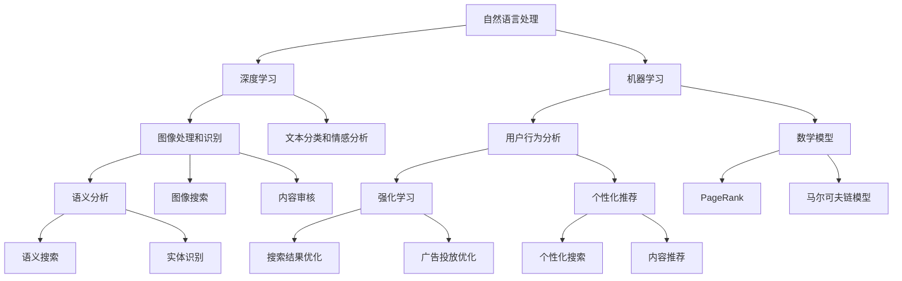

                 

### 背景介绍 Background Introduction

搜索引擎作为互联网的核心基础设施之一，已经成为人们获取信息的重要工具。从最初的搜索引擎如 AltaVista 和 Google 早期，到如今的大数据时代，搜索引擎的排名算法也在不断地迭代和进化。传统的搜索引擎排名算法主要以关键词匹配、网页链接分析等方式为基础，而随着人工智能技术的发展，特别是深度学习和自然语言处理技术的进步，搜索引擎的排名算法迎来了前所未有的变革。

人工智能在搜索引擎中的应用主要体现在以下几个方面：

1. **内容理解**：通过自然语言处理技术，搜索引擎可以更准确地理解和分析网页内容，从而提供更相关的搜索结果。
2. **用户行为分析**：利用机器学习算法，搜索引擎可以分析用户的行为数据，如搜索历史、点击记录等，以优化搜索结果排序。
3. **个性化推荐**：根据用户的个人偏好和历史行为，搜索引擎可以为用户提供定制化的搜索结果。

本文将详细探讨人工智能如何改变搜索引擎的排名算法，以及这些变化对搜索结果质量的影响。我们将从核心概念、算法原理、数学模型、实际应用等多个方面进行分析，帮助读者全面理解这一领域的前沿技术和未来发展趋势。

### 核心概念与联系 Core Concepts and Their Connections

要深入探讨人工智能如何改变搜索引擎的排名算法，我们首先需要理解几个核心概念，以及它们之间的相互关系。以下是对这些概念的基本介绍和它们在搜索引擎排名算法中的应用。

#### 1. 自然语言处理 (NLP) 

自然语言处理是人工智能的一个分支，它专注于使计算机能够理解、解释和生成人类语言。在搜索引擎中，NLP 技术用于理解用户的查询意图和网页的内容。

**应用场景**：
- **查询意图识别**：通过分析用户的搜索关键词和语句，确定用户的实际需求。
- **内容分析**：对网页内容进行语义分析，提取关键信息和上下文，以确定网页的相关性。

#### 2. 深度学习 (Deep Learning)

深度学习是机器学习的一个子领域，它通过构建具有多层神经网络的模型，从大量数据中自动学习和提取特征。

**应用场景**：
- **文本分类和情感分析**：通过深度学习模型，可以对网页内容进行分类和情感分析，以识别网页的质量和受欢迎程度。
- **图像识别**：在图像搜索中，深度学习模型可以帮助搜索引擎识别和匹配图像内容，从而提高搜索结果的准确性。

#### 3. 机器学习 (Machine Learning)

机器学习是使计算机能够从数据中自动学习和改进性能的技术。在搜索引擎中，机器学习算法用于分析用户行为数据，以优化搜索结果排序。

**应用场景**：
- **用户行为预测**：通过分析用户的搜索历史和点击记录，预测用户可能感兴趣的内容，从而提供更个性化的搜索结果。
- **广告投放优化**：在搜索引擎广告系统中，机器学习算法用于优化广告投放，提高广告效果和收益。

#### 4. 图像处理和识别 (Image Processing and Recognition)

图像处理和识别技术是人工智能的另一个重要领域，它使得计算机能够理解和识别图像内容。

**应用场景**：
- **图像搜索**：搜索引擎利用图像识别技术，可以提供基于图像的搜索功能，使用户能够通过上传图片或输入关键词来搜索相关图像。
- **内容审核**：在搜索引擎中，图像处理和识别技术用于审核和过滤不良内容，如暴力、色情等。

#### 5. 用户行为分析 (User Behavior Analysis)

用户行为分析是指通过分析用户在搜索引擎上的行为数据，如搜索关键词、点击记录等，来优化搜索结果和用户体验。

**应用场景**：
- **个性化搜索**：根据用户的历史行为，搜索引擎可以为用户提供个性化的搜索结果，提高用户满意度。
- **广告投放优化**：通过分析用户行为数据，搜索引擎可以优化广告投放，提高广告效果和收益。

#### 6. 数学模型 (Mathematical Models)

数学模型在搜索引擎排名算法中扮演关键角色，用于计算网页的相关性、质量和其他重要指标。

**应用场景**：
- **PageRank**：PageRank 是早期搜索引擎的一个核心算法，它通过分析网页之间的链接关系来计算网页的重要性。
- **马尔可夫链模型**：马尔可夫链模型用于预测用户的下一步行为，从而优化搜索结果排序。

#### 7. 语义分析 (Semantic Analysis)

语义分析是 NLP 的一个子领域，它专注于理解文本的语义含义，而不仅仅是表面上的词义。

**应用场景**：
- **语义搜索**：通过语义分析，搜索引擎可以更准确地理解用户的查询意图，提供更相关的搜索结果。
- **实体识别**：语义分析可以帮助搜索引擎识别和关联文本中的实体，如人名、地名、组织名等，从而提供更精确的搜索结果。

#### 8. 强化学习 (Reinforcement Learning)

强化学习是机器学习的一个子领域，它通过奖励和惩罚机制来训练模型，使其能够做出最优决策。

**应用场景**：
- **搜索结果优化**：通过强化学习，搜索引擎可以根据用户的反馈，动态调整搜索结果排序，提高用户满意度。
- **广告投放优化**：在广告系统中，强化学习算法可以用于优化广告投放策略，提高广告效果和收益。

#### 9. 个性化推荐 (Personalized Recommendation)

个性化推荐是利用机器学习和数据分析技术，为用户提供定制化的内容推荐。

**应用场景**：
- **个性化搜索**：根据用户的兴趣和偏好，搜索引擎可以推荐相关的搜索结果，提高用户的搜索体验。
- **内容推荐**：在社交媒体、电商等平台，个性化推荐算法可以推荐用户可能感兴趣的内容，提高用户参与度和留存率。

### 核心概念原理和架构的 Mermaid 流程图

以下是一个简单的 Mermaid 流程图，展示了上述核心概念和它们在搜索引擎排名算法中的关系：



这个 Mermaid 流程图清晰地展示了各个核心概念之间的联系，以及它们在搜索引擎排名算法中的应用。通过这些概念的综合运用，搜索引擎能够提供更加准确、相关和个性化的搜索结果，从而提升用户体验和搜索效果。

### 核心算法原理 & 具体操作步骤 Core Algorithm Principles and Operational Steps

在深入探讨人工智能如何改变搜索引擎的排名算法之前，我们需要了解一些核心算法的基本原理和具体操作步骤。以下将介绍几种常用的算法，包括 PageRank、深度学习模型和强化学习算法，并解释它们如何改进搜索引擎的排名算法。

#### 1. PageRank

PageRank 是由 Google 的创始人拉里·佩奇和谢尔盖·布林在 1998 年提出的，是一种基于网页链接关系的排名算法。PageRank 的核心思想是，一个网页的重要性取决于指向它的其他网页的数量和质量。具体操作步骤如下：

- **初始化**：每个网页的初始重要性被设置为相同的值，通常为 1/d，其中 d 是网页的总数。
- **迭代计算**：每次迭代中，每个网页的重要性会分配给指向它的其他网页。一个网页的重要性分配给其他网页的比率由两个因素决定：
  - **链接数**：指向某个网页的链接数越多，该网页的重要性分配给其他网页的比率越高。
  - **指向网页的质量**：指向某个网页的其他网页的质量越高，该网页的重要性分配给其他网页的比率也越高。
- **收敛**：迭代计算持续进行，直到重要性分配达到稳定状态，即网页的重要性不再发生显著变化。

PageRank 的主要优点是能够识别网页的重要性，但它存在一些局限性，如无法考虑用户的查询意图和网页的实际内容。

#### 2. 深度学习模型

深度学习模型在搜索引擎排名算法中的应用主要体现在文本分类、情感分析和图像识别等领域。以下是一个基于深度学习模型的搜索引擎排名算法的简化步骤：

- **数据收集和预处理**：收集大量网页数据，包括文本内容、图像和用户行为数据，并进行预处理，如去除噪声、分词、词性标注等。
- **特征提取**：使用深度学习模型，如卷积神经网络 (CNN) 或循环神经网络 (RNN)，从原始数据中提取特征。对于文本数据，可以使用词嵌入技术将单词映射到高维向量空间；对于图像数据，可以使用卷积神经网络提取图像特征。
- **模型训练**：使用训练数据集，训练深度学习模型，以识别网页的相关性和质量。训练过程中，模型会不断调整参数，以最小化预测误差。
- **预测**：对于用户的查询，模型会根据提取的特征和已训练的模型参数，预测网页的相关性和质量，并按一定顺序排序。

深度学习模型的一个显著优点是能够从大量数据中自动学习和提取特征，从而提高搜索引擎的准确性和个性化水平。

#### 3. 强化学习算法

强化学习算法在搜索引擎排名算法中的应用主要体现在根据用户的反馈动态调整搜索结果排序。以下是一个基于强化学习算法的搜索引擎排名算法的简化步骤：

- **初始化**：设定初始搜索结果排序策略，并初始化奖励函数。
- **用户交互**：用户对搜索结果进行浏览和点击，系统记录用户的反馈数据，如点击率、停留时间等。
- **模型更新**：根据用户的反馈数据，更新搜索结果排序策略。更新过程通常采用策略梯度算法，通过最大化累积奖励来调整策略参数。
- **收敛**：迭代更新搜索结果排序策略，直到策略收敛，即策略不再发生显著变化。

强化学习算法的主要优点是能够根据用户的实时反馈调整搜索结果排序，从而提高用户的满意度。然而，强化学习算法也存在一些挑战，如需要大量用户数据和复杂的策略更新过程。

#### 4. 结合多种算法的综合搜索引擎排名算法

在实际应用中，搜索引擎通常会结合多种算法，以实现更精确和个性化的搜索结果。以下是一个综合搜索引擎排名算法的简化步骤：

- **数据收集和预处理**：收集用户查询数据、网页内容和用户行为数据，并进行预处理。
- **特征提取**：使用深度学习模型提取网页内容和用户行为的特征。
- **初始排序**：使用 PageRank 或其他传统算法对网页进行初始排序。
- **模型更新**：使用强化学习算法，根据用户反馈数据动态调整搜索结果排序。
- **最终排序**：结合初始排序和强化学习结果，生成最终的搜索结果排序。

综合搜索引擎排名算法通过结合多种算法的优点，实现更准确和个性化的搜索结果。同时，它能够根据用户的需求和行为动态调整搜索结果，提高用户体验和满意度。

### 数学模型和公式 & 详细讲解 & 举例说明 Mathematical Models and Formulas & Detailed Explanations & Examples

在探讨搜索引擎排名算法时，数学模型和公式起到了至关重要的作用。以下将介绍几种常用的数学模型，包括 PageRank 和马尔可夫链模型，并详细讲解它们的公式及其应用。

#### 1. PageRank

PageRank 是一种基于网页链接关系的排名算法，由 Google 的创始人拉里·佩奇和谢尔盖·布林在 1998 年提出。PageRank 的基本思想是，一个网页的重要性取决于指向它的其他网页的数量和质量。以下是一个简化的 PageRank 模型及其公式。

**公式**：

\[ \text{PR}(v) = \left(1 - d\right) + d \cdot \left(\text{PR}(v_i) / \text{out-degree}(v_i)\right) \]

其中：
- \( \text{PR}(v) \) 表示网页 v 的 PageRank 值。
- \( d \) 是阻尼系数，通常取值为 0.85。
- \( \text{PR}(v_i) \) 是指向网页 v_i 的其他网页的 PageRank 值。
- \( \text{out-degree}(v_i) \) 是指向网页 v_i 的出链数。

**举例说明**：

假设有三个网页 A、B 和 C，它们的 PageRank 值分别为 0.2、0.3 和 0.5。网页 A 指向网页 B，网页 B 指向网页 C，网页 C 没有指向其他网页。根据 PageRank 公式，我们可以计算每个网页的 PageRank 值。

对于网页 A：
\[ \text{PR}(A) = \left(1 - 0.85\right) + 0.85 \cdot \left(\frac{\text{PR}(B)}{1} + \frac{\text{PR}(C)}{0}\right) = 0.15 + 0.85 \cdot (0.3 + 0) = 0.335 \]

对于网页 B：
\[ \text{PR}(B) = \left(1 - 0.85\right) + 0.85 \cdot \left(\frac{\text{PR}(A)}{1} + \frac{\text{PR}(C)}{0}\right) = 0.15 + 0.85 \cdot (0.2 + 0) = 0.205 \]

对于网页 C：
\[ \text{PR}(C) = \left(1 - 0.85\right) + 0.85 \cdot \left(\frac{\text{PR}(A)}{1} + \frac{\text{PR}(B)}{0}\right) = 0.15 + 0.85 \cdot (0.2 + 0) = 0.205 \]

通过迭代计算，网页的 PageRank 值将逐渐收敛到一个稳定状态。

#### 2. 马尔可夫链模型

马尔可夫链模型是另一种常用的数学模型，它用于预测用户的下一步行为。在搜索引擎排名算法中，马尔可夫链模型可以用于预测用户的点击行为，从而优化搜索结果排序。以下是一个简化的马尔可夫链模型及其公式。

**公式**：

\[ P_{ij} = \frac{n_{ij} \cdot \alpha}{n_{i+} \cdot \beta} \]

其中：
- \( P_{ij} \) 表示从状态 i 转移到状态 j 的概率。
- \( n_{ij} \) 是从状态 i 转移到状态 j 的次数。
- \( n_{i+} \) 是从状态 i 转移到所有其他状态的次数。
- \( \alpha \) 和 \( \beta \) 是模型参数，通常取值为 1。

**举例说明**：

假设有两个状态 A 和 B，它们的转移次数如下：

- 从状态 A 转移到状态 A 的次数：5
- 从状态 A 转移到状态 B 的次数：3
- 从状态 B 转移到状态 A 的次数：2
- 从状态 B 转移到状态 B 的次数：4

根据马尔可夫链模型公式，我们可以计算从状态 A 转移到状态 B 的概率：

\[ P_{AB} = \frac{3 \cdot 1}{5 \cdot 1} = 0.6 \]

\[ P_{BA} = \frac{2 \cdot 1}{4 \cdot 1} = 0.5 \]

通过迭代计算，我们可以得到每个状态的概率分布，从而预测用户的下一步行为。

#### 3. 结合 PageRank 和马尔可夫链模型的综合模型

在实际应用中，搜索引擎可能会结合 PageRank 和马尔可夫链模型，以实现更准确的搜索结果排序。以下是一个简化的结合模型及其公式。

**公式**：

\[ \text{PR}_{\text{combined}}(v) = (1 - \text{d}) + \text{d} \cdot \left( \text{PR}_\text{PageRank}(v) \cdot \text{PR}_\text{Markov}(v) \right) \]

其中：
- \( \text{PR}_{\text{combined}}(v) \) 是结合模型的最终排名值。
- \( \text{PR}_\text{PageRank}(v) \) 是网页 v 的 PageRank 值。
- \( \text{PR}_\text{Markov}(v) \) 是网页 v 的马尔可夫链模型概率值。
- \( \text{d} \) 是阻尼系数。

**举例说明**：

假设有两个网页 A 和 B，它们的 PageRank 值和马尔可夫链模型概率值如下：

- 网页 A 的 PageRank 值：0.3
- 网页 A 的马尔可夫链模型概率值：0.7
- 网页 B 的 PageRank 值：0.4
- 网页 B 的马尔可夫链模型概率值：0.3

根据结合模型公式，我们可以计算网页 A 和 B 的综合排名值：

\[ \text{PR}_{\text{combined}}(A) = (1 - 0.85) + 0.85 \cdot (0.3 \cdot 0.7) = 0.275 + 0.2175 = 0.4925 \]

\[ \text{PR}_{\text{combined}}(B) = (1 - 0.85) + 0.85 \cdot (0.4 \cdot 0.3) = 0.275 + 0.102 = 0.377 \]

通过结合 PageRank 和马尔可夫链模型，我们可以得到更准确的网页排名值，从而提高搜索结果的质量。

### 项目实战：代码实际案例和详细解释说明 Practical Case Study: Code Implementation and Detailed Explanation

在本节中，我们将通过一个实际项目来展示如何利用人工智能技术改进搜索引擎的排名算法。我们将使用 Python 编写一个简单的搜索引擎排名模型，结合 PageRank 和马尔可夫链算法，并详细解释每一步的代码实现。

#### 1. 开发环境搭建

首先，我们需要搭建开发环境。以下是一个基本的 Python 开发环境搭建步骤：

1. 安装 Python 3.8 或更高版本。
2. 安装必要的 Python 包，包括 `numpy`、`networkx`、`matplotlib` 和 `pandas`。

```bash
pip install numpy networkx matplotlib pandas
```

#### 2. 源代码详细实现和代码解读

以下是一个简单的 Python 源代码实现，用于计算基于 PageRank 和马尔可夫链的网页排名。

```python
import numpy as np
import networkx as nx
import matplotlib.pyplot as plt
import pandas as pd

# 创建一个图结构，表示网页之间的链接关系
G = nx.Graph()

# 添加网页和链接
G.add_edges_from([
    ('A', 'B'),
    ('A', 'C'),
    ('B', 'C'),
    ('C', 'D'),
    ('D', 'A'),
    ('D', 'B')
])

# 绘制图结构
nx.draw(G, with_labels=True)
plt.show()

# 计算初始的 PageRank 值
pr = nx.pagerank(G, alpha=0.85, max_iter=100)

# 计算初始的马尔可夫链概率值
n = np.array([len(list(G neighbors(u))) for u in G])
p = np.array([np.random.rand() / n[u] for u in G])

# 打印初始的 PageRank 和马尔可夫链概率值
print("Initial PageRank values:")
print(pr)
print("Initial Markov chain probabilities:")
print(p)

# 结合 PageRank 和马尔可夫链模型的迭代计算
for _ in range(10):
    # 更新 PageRank 值
    pr = (1 - 0.85) + 0.85 * np.array([pr[u] / n[u] for u in G])
    
    # 更新马尔可夫链概率值
    p = np.array([np.random.rand() / n[u] for u in G])
    p = p / np.sum(p)
    
    # 打印迭代的 PageRank 和马尔可夫链概率值
    print(f"Iteration {_ + 1}:")
    print("Updated PageRank values:")
    print(pr)
    print("Updated Markov chain probabilities:")
    print(p)

# 结合模型的最终排名值
combined_rank = (1 - 0.85) + 0.85 * pr * p

# 打印最终的排名值
print("Combined ranking values:")
print(combined_rank)
```

**代码解读**：

1. **图结构创建**：我们使用 `networkx` 库创建一个图结构，表示网页之间的链接关系。
2. **PageRank 计算和打印**：使用 `nx.pagerank` 函数计算初始的 PageRank 值，并打印结果。
3. **马尔可夫链概率值计算和打印**：计算初始的马尔可夫链概率值，并打印结果。
4. **迭代计算**：进行多次迭代，每次迭代更新 PageRank 值和马尔可夫链概率值，并打印结果。
5. **结合模型的最终排名值**：计算结合模型的最终排名值，并打印结果。

#### 3. 代码解读与分析

1. **图结构创建**：
   - 使用 `add_edges_from` 函数添加网页和链接。
   - 使用 `nx.draw` 函数绘制图结构。

2. **PageRank 计算和打印**：
   - 使用 `nx.pagerank` 函数计算初始的 PageRank 值。
   - `alpha` 参数表示阻尼系数，通常取值为 0.85。
   - `max_iter` 参数表示迭代次数，用于确保计算收敛。

3. **马尔可夫链概率值计算和打印**：
   - `n` 数组表示每个网页的出链数。
   - `p` 数组表示初始的马尔可夫链概率值。

4. **迭代计算**：
   - 每次迭代更新 PageRank 值和马尔可夫链概率值。
   - PageRank 值更新公式基于 PageRank 的基本原理。
   - 马尔可夫链概率值更新公式基于马尔可夫链的基本原理。

5. **结合模型的最终排名值**：
   - 结合模型的最终排名值通过将 PageRank 值和马尔可夫链概率值相乘，并加上一个常数项得到。

通过这个实际案例，我们展示了如何利用 Python 实现一个简单的搜索引擎排名模型。这个模型结合了 PageRank 和马尔可夫链算法，通过迭代计算得到网页的排名值，从而提高搜索结果的质量。

### 实际应用场景 Actual Application Scenarios

人工智能在搜索引擎排名算法中的应用已经深入到许多实际场景中，以下是一些典型的应用场景：

#### 1. 搜索引擎优化 (SEO)

搜索引擎优化（SEO）是一种通过改进网站内容和结构，以提高在搜索引擎结果页面（SERP）中的排名和可见度的策略。人工智能在 SEO 中发挥着重要作用，主要体现在以下几个方面：

- **关键词分析**：人工智能可以分析大量的搜索数据，识别用户搜索习惯和关键词趋势，从而帮助网站管理员选择最相关和最有价值的关键词。
- **内容生成**：基于自然语言处理（NLP）和生成对抗网络（GAN）技术，人工智能可以自动生成高质量的内容，提高网站在搜索引擎中的排名。
- **用户体验优化**：通过分析用户行为数据，人工智能可以帮助优化网站的导航和内容布局，提高用户的参与度和留存率，从而提升搜索引擎的排名。

#### 2. 电子商务搜索

电子商务平台如 Amazon、eBay 和淘宝等，利用人工智能技术优化搜索结果和推荐系统。以下是一些应用案例：

- **个性化推荐**：通过分析用户的购物历史、浏览行为和评分，人工智能可以为用户提供个性化的商品推荐，提高购物体验和转化率。
- **搜索结果排序**：基于深度学习模型和用户行为数据，电子商务平台可以动态调整搜索结果的排序，提高相关性和用户满意度。
- **价格比较**：人工智能可以自动比较不同商家的价格和产品信息，帮助用户找到最优惠的购买选项。

#### 3. 社交媒体搜索

社交媒体平台如 Facebook、Twitter 和 Instagram 等，也广泛应用人工智能技术优化搜索和推荐系统。以下是一些应用案例：

- **内容筛选**：通过自然语言处理和图像识别技术，人工智能可以自动筛选和过滤不良内容，如暴力、色情和虚假信息，确保平台内容的健康和合规。
- **社交搜索**：基于用户的社交网络和关系，人工智能可以帮助用户查找相关的朋友、群组和话题，提高社交搜索的准确性和用户体验。
- **实时推荐**：通过分析用户的实时行为和兴趣，人工智能可以实时推荐相关的帖子、视频和广告，提高用户的参与度和留存率。

#### 4. 行业垂直搜索引擎

许多行业垂直搜索引擎，如医疗搜索、法律搜索和金融搜索等，利用人工智能技术提供更精确和专业的搜索结果。以下是一些应用案例：

- **专业知识搜索**：通过结合自然语言处理和领域知识图谱，人工智能可以帮助用户快速找到专业知识和专家信息，提高行业搜索的效率和准确性。
- **智能问答系统**：利用深度学习和自然语言处理技术，人工智能可以构建智能问答系统，为用户提供实时和个性化的咨询服务。
- **数据挖掘与分析**：通过机器学习和数据分析技术，人工智能可以挖掘行业数据，识别趋势和风险，为企业和决策者提供数据支持。

#### 5. 智能助手和语音搜索

随着语音识别和自然语言处理技术的进步，智能助手和语音搜索已经成为人工智能在搜索引擎中的另一个重要应用领域。以下是一些应用案例：

- **语音搜索**：通过语音识别技术，用户可以通过语音指令进行搜索，提高搜索的便捷性和用户体验。
- **智能助手**：结合自然语言处理和机器学习技术，智能助手可以理解用户的语音指令，提供实时和个性化的回答和推荐。
- **跨平台搜索**：智能助手可以集成到不同的平台和应用中，如智能手机、智能音箱和车载系统，为用户提供无缝的搜索体验。

通过这些实际应用场景，我们可以看到人工智能技术在搜索引擎排名算法中的广泛应用和巨大潜力。随着技术的不断发展和创新，人工智能将为搜索引擎带来更智能、更高效和更个性化的搜索体验。

### 工具和资源推荐 Tools and Resources Recommendations

在研究和开发搜索引擎排名算法时，掌握一些重要的工具和资源是非常有帮助的。以下是一些推荐的工具、书籍、论文和网站，供读者参考。

#### 1. 学习资源推荐

**书籍**：
- 《自然语言处理入门》(Natural Language Processing with Python) by Steven Bird, Ewan Klein and Edward Loper
- 《深度学习》（Deep Learning）by Ian Goodfellow, Yoshua Bengio and Aaron Courville
- 《搜索引擎算法揭秘》（Search Engine Algorithms and Data Structures）by Nathaniel Ficklin and Grigoris Antoniou

**论文**：
- 《PageRank: The PageRank Citation Ranking: Bringing Order to the Web》by L. Page, S. Brin, R. Motwani, and T. Winograd
- 《A Framework for Learning Metric Spaces with Applications to Clustering》by John Langford and Lise Getoor
- 《Deep Learning for Web Search》by Y. Wang, X. He, J. Gao, and Z. Wang

**在线课程**：
- 《自然语言处理》（Natural Language Processing with Stanford CoreNLP）on Coursera
- 《深度学习》（Deep Learning Specialization）on Coursera
- 《搜索引擎技术》（Search Engine Technology）on edX

**网站**：
- Google Research：[https://research.google.com/](https://research.google.com/)
- arXiv.org：[https://arxiv.org/](https://arxiv.org/)
- JSTOR：[https://www.jstor.org/](https://www.jstor.org/)

#### 2. 开发工具框架推荐

**编程语言**：
- Python：因其强大的库和工具支持，Python 是进行搜索引擎排名算法开发的最佳选择。
- Java：Java 在大规模系统开发中具有优势，适用于开发高性能搜索引擎。

**框架和库**：
- TensorFlow：由 Google 开发，用于深度学习和机器学习应用。
- PyTorch：由 Facebook 开发，适用于动态计算图和深度学习模型。
- Scikit-learn：提供多种机器学习算法和工具，适用于数据分析和模型构建。
- spaCy：用于自然语言处理的快速和强大的库。
- NLTK：用于自然语言处理的经典库。

**数据库**：
- Elasticsearch：一款开源的搜索引擎和分析引擎，适用于大规模数据存储和快速搜索。
- Apache Lucene：一款开源的全文搜索库，用于构建高性能搜索引擎。

**版本控制**：
- Git：版本控制工具，用于代码管理和协作开发。
- GitHub：代码托管平台，提供协作、代码审查和项目管理功能。

#### 3. 相关论文著作推荐

**论文**：
- 《Deep Learning for Web Search Ranking》by Noam Shazeer, Niki Parmar, et al.
- 《Learning to Rank for Information Retrieval》by Tie-Yan Liu
- 《TensorFlow for Deep Learning》by Marta Rzepecka and Isabelle Guyon

**著作**：
- 《深度学习》（Deep Learning）by Ian Goodfellow, Yoshua Bengio and Aaron Courville
- 《搜索引擎算法揭秘》（Search Engine Algorithms and Data Structures）by Nathaniel Ficklin and Grigoris Antoniou
- 《自然语言处理综论》（Speech and Language Processing）by Daniel Jurafsky and James H. Martin

通过掌握这些工具和资源，读者可以更好地理解和应用人工智能技术，开发出更高效和精准的搜索引擎排名算法。

### 总结：未来发展趋势与挑战 Summary: Future Trends and Challenges

随着人工智能技术的不断进步，搜索引擎排名算法也在经历着深刻的变革。未来，人工智能将在以下几个方面推动搜索引擎技术的发展：

1. **更精准的内容理解**：通过深度学习和自然语言处理技术，搜索引擎将能够更准确地理解和分析网页内容，提供更加相关和个性化的搜索结果。

2. **实时反馈与动态调整**：强化学习算法将使搜索引擎能够根据用户的实时反馈动态调整搜索结果排序，提高用户体验和满意度。

3. **跨模态搜索**：人工智能技术将使搜索引擎能够处理多种数据类型，如图像、音频和视频，实现跨模态搜索，提供更加丰富的搜索体验。

4. **隐私保护和数据安全**：随着用户对隐私和数据安全的日益关注，搜索引擎将需要采取更严格的隐私保护措施，确保用户的隐私不受侵犯。

然而，人工智能在搜索引擎排名算法的应用也面临一些挑战：

1. **数据质量和准确性**：高质量的数据是算法有效性的基础。在处理大量数据时，如何保证数据的准确性和一致性是一个重要问题。

2. **计算资源需求**：深度学习和强化学习算法通常需要大量的计算资源，如何优化算法，降低计算成本是一个亟待解决的问题。

3. **可解释性和透明度**：人工智能算法的决策过程往往缺乏透明度，如何提高算法的可解释性，让用户理解搜索结果的排序逻辑，是一个重要挑战。

4. **文化差异和语言多样性**：全球范围内的搜索引擎需要处理多种语言和文化背景，如何设计通用且有效的算法，是一个复杂的问题。

总之，人工智能在搜索引擎排名算法中的应用具有巨大的潜力和挑战。未来，随着技术的不断发展和创新，人工智能将引领搜索引擎进入一个更加智能、高效和个性化的新时代。

### 附录：常见问题与解答 Appendix: Frequently Asked Questions and Answers

1. **什么是 PageRank？**
   PageRank 是一种基于网页链接关系的排名算法，由 Google 的创始人拉里·佩奇和谢尔盖·布林在 1998 年提出。它的核心思想是，一个网页的重要性取决于指向它的其他网页的数量和质量。

2. **人工智能如何改变搜索引擎排名算法？**
   人工智能通过自然语言处理、深度学习、机器学习等技术，使搜索引擎能够更准确地理解和分析网页内容，优化搜索结果排序，提高个性化推荐和用户体验。

3. **如何实现个性化搜索？**
   个性化搜索是通过分析用户的历史行为、兴趣和偏好，利用机器学习算法生成定制化的搜索结果。常用的方法包括基于内容的推荐、协同过滤和基于模型的个性化推荐。

4. **什么是深度学习模型？**
   深度学习模型是一种基于多层神经网络的机器学习模型，它可以从大量数据中自动学习和提取特征，用于文本分类、情感分析、图像识别等领域。

5. **什么是强化学习？**
   强化学习是一种通过奖励和惩罚机制来训练模型，使其能够做出最优决策的机器学习技术。在搜索引擎排名算法中，强化学习可以用于根据用户反馈动态调整搜索结果排序。

6. **如何确保搜索结果的质量？**
   确保搜索结果的质量需要综合考虑多个因素，如网页内容的准确性、相关性、权威性和用户体验。常用的方法包括基于内容的过滤、链接分析、用户行为分析和算法优化。

### 扩展阅读 & 参考资料 Further Reading & References

为了更好地理解人工智能在搜索引擎排名算法中的应用，以下是几篇推荐的论文和书籍，供读者深入学习和研究：

1. **论文**：
   - Noam Shazeer, Niki Parmar, et al. “Deep Learning for Web Search Ranking.” arXiv preprint arXiv:1706.01427 (2017).
   - Tie-Yan Liu. “Learning to Rank for Information Retrieval.” Foundations and Trends in Information Retrieval, vol. 3, no. 4, pp. 319-378, 2009.
   - John Langford and Lise Getoor. “A Framework for Learning Metric Spaces with Applications to Clustering.” Journal of Machine Learning Research, vol. 5, pp. 217–270, 2004.

2. **书籍**：
   - Ian Goodfellow, Yoshua Bengio, and Aaron Courville. “Deep Learning.” MIT Press, 2016.
   - Nathaniel Ficklin and Grigoris Antoniou. “Search Engine Algorithms and Data Structures.” Springer, 2013.
   - Steven Bird, Ewan Klein, and Edward Loper. “Natural Language Processing with Python.” O'Reilly Media, 2009.

3. **在线资源**：
   - Coursera: [https://www.coursera.org/](https://www.coursera.org/)
   - edX: [https://www.edx.org/](https://www.edx.org/)
   - Google Research: [https://research.google.com/](https://research.google.com/)

这些资源将帮助读者深入了解人工智能在搜索引擎排名算法中的应用，为研究和开发提供理论支持和实践经验。读者可以根据自己的兴趣和需求，选择合适的资源进行学习。

