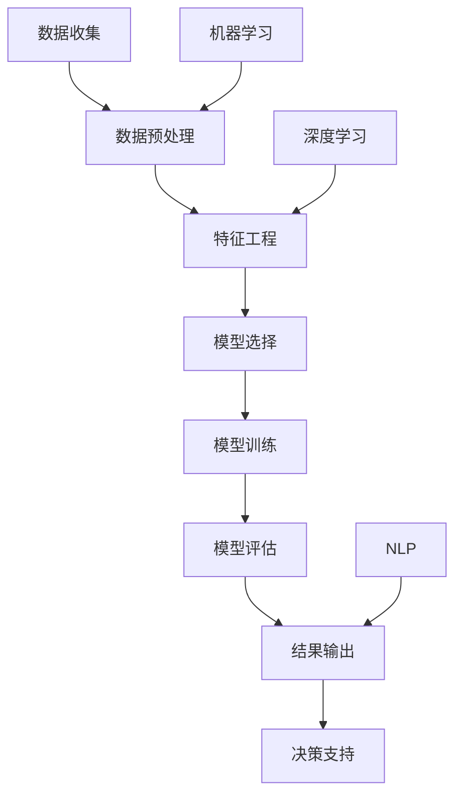

                 

# AI如何通过市场趋势分析提升电商供给

## 关键词：人工智能，市场趋势，电商供给，数据分析，算法优化，用户需求预测

### 摘要

本文将深入探讨人工智能技术在市场趋势分析方面的应用，特别是如何通过这些技术提升电商平台的供给效率。文章首先介绍了市场趋势分析的基本概念和重要性，然后详细阐述了AI技术在数据分析、算法优化、用户需求预测等方面的作用。接着，通过具体的数学模型和算法原理分析，展示了如何利用AI技术进行市场趋势预测。最后，本文提出了实际应用案例，并通过代码示例说明了AI技术在电商供给中的应用实践。文章还展望了AI技术在未来电商市场中的发展趋势和面临的挑战。

## 1. 背景介绍

随着互联网的普及和电子商务的快速发展，电商平台已经成为了许多消费者购买商品的首选渠道。然而，面对激烈的市场竞争，如何提高供给效率、满足消费者需求、优化用户体验，成为了电商企业必须解决的问题。市场趋势分析作为一种重要的数据分析方法，可以帮助电商平台识别市场变化、预测未来趋势，从而为决策提供有力支持。

传统的市场趋势分析方法主要依赖于统计分析和数据挖掘技术，这些方法虽然能够在一定程度上揭示市场规律，但往往需要大量的人力和时间投入，且难以应对快速变化的市场环境。随着人工智能技术的不断进步，尤其是深度学习和机器学习算法的发展，使得市场趋势分析变得更加智能和高效。通过引入AI技术，电商平台可以更快速、准确地预测市场变化，从而优化供给策略，提升运营效率。

本文旨在探讨如何利用人工智能技术进行市场趋势分析，特别是如何通过这些技术提升电商供给。文章将首先介绍市场趋势分析的基本概念和方法，然后详细阐述AI技术在市场趋势分析中的应用，包括数据分析、算法优化和用户需求预测等方面。通过具体的案例和代码示例，本文将展示AI技术在电商供给中的应用效果，并展望未来发展趋势和挑战。

## 2. 核心概念与联系

### 市场趋势分析

市场趋势分析是一种通过分析历史数据来预测未来市场变化的方法。它通常包括以下几个步骤：

1. **数据收集**：收集与市场相关的各种数据，包括销售额、库存、用户行为等。
2. **数据预处理**：清洗和整理数据，使其适合分析和建模。
3. **特征工程**：从原始数据中提取有助于预测的特征。
4. **模型选择**：选择适当的预测模型，如时间序列分析、回归分析等。
5. **模型训练**：使用历史数据对模型进行训练，以优化模型参数。
6. **模型评估**：使用验证数据对模型进行评估，以确定其预测能力。

### 人工智能技术

人工智能技术，特别是机器学习和深度学习，已经成为市场趋势分析的重要工具。以下是一些关键的人工智能技术：

1. **机器学习**：通过训练模型从数据中自动学习规律，包括回归、分类、聚类等算法。
2. **深度学习**：一种基于人工神经网络的机器学习技术，能够通过多层神经网络自动提取复杂特征。
3. **数据挖掘**：从大量数据中挖掘出潜在的模式和规律。
4. **自然语言处理（NLP）**：使计算机能够理解、处理和生成人类语言。

### 联系

市场趋势分析与人工智能技术之间存在紧密的联系。通过人工智能技术，市场趋势分析可以更加自动化、高效和准确。具体来说：

1. **数据分析与机器学习**：机器学习算法可以自动处理大量数据，提取有用信息，从而提高市场趋势分析的效率。
2. **深度学习与特征提取**：深度学习算法能够自动提取复杂的数据特征，减少人工干预，提高预测精度。
3. **自然语言处理与文本数据**：NLP技术可以处理大量的文本数据，如产品评论、社交媒体帖子等，为市场趋势分析提供更全面的视角。

### Mermaid 流程图

以下是一个简单的Mermaid流程图，展示了市场趋势分析的核心步骤和人工智能技术的应用。



在这个流程图中，机器学习、深度学习和NLP技术在各个步骤中起到了关键作用，为市场趋势分析提供了强大的支持。

## 3. 核心算法原理 & 具体操作步骤

### 3.1 时间序列分析

时间序列分析是一种常用的市场趋势分析方法，通过分析历史数据的时间序列模式来预测未来趋势。以下是一个简单的时间序列分析方法：

1. **数据收集**：收集历史销售额、库存等数据。
2. **数据预处理**：去除异常值、缺失值等，使数据适合建模。
3. **特征提取**：提取时间序列特征，如趋势、季节性、周期性等。
4. **模型选择**：选择适当的模型，如ARIMA、LSTM等。
5. **模型训练**：使用历史数据对模型进行训练。
6. **模型评估**：使用验证数据评估模型性能。
7. **预测**：使用模型对未来的市场趋势进行预测。

### 3.2 回归分析

回归分析是一种常用的统计方法，用于预测一个变量（因变量）与其他变量（自变量）之间的关系。以下是一个简单的回归分析方法：

1. **数据收集**：收集与市场趋势相关的数据，如销售额、用户数量等。
2. **数据预处理**：去除异常值、缺失值等，使数据适合建模。
3. **特征选择**：选择对市场趋势有显著影响的特征。
4. **模型选择**：选择适当的回归模型，如线性回归、多项式回归等。
5. **模型训练**：使用历史数据对模型进行训练。
6. **模型评估**：使用验证数据评估模型性能。
7. **预测**：使用模型对未来的市场趋势进行预测。

### 3.3 用户需求预测

用户需求预测是市场趋势分析的一个重要方面，可以通过以下方法实现：

1. **数据收集**：收集用户行为数据，如搜索历史、购买记录等。
2. **数据预处理**：去除异常值、缺失值等，使数据适合建模。
3. **特征提取**：提取用户行为特征，如活跃度、兴趣点等。
4. **模型选择**：选择适当的模型，如决策树、随机森林等。
5. **模型训练**：使用历史数据对模型进行训练。
6. **模型评估**：使用验证数据评估模型性能。
7. **预测**：使用模型预测未来的用户需求。

### 3.4 深度学习算法

深度学习算法在市场趋势分析中具有重要作用，以下是一个简单的深度学习算法步骤：

1. **数据收集**：收集大量的市场数据，如销售额、库存、用户行为等。
2. **数据预处理**：对数据进行归一化、缺失值处理等。
3. **特征提取**：使用卷积神经网络（CNN）或循环神经网络（RNN）提取深度特征。
4. **模型训练**：使用历史数据训练深度学习模型。
5. **模型评估**：使用验证数据评估模型性能。
6. **预测**：使用训练好的模型对未来的市场趋势进行预测。

## 4. 数学模型和公式 & 详细讲解 & 举例说明

### 4.1 时间序列分析

时间序列分析中的一个常用模型是ARIMA（自回归积分滑动平均模型）。ARIMA模型包括三个组成部分：自回归（AR）、差分（I）和移动平均（MA）。

- **自回归（AR）**：自回归模型表示当前值与过去几个值的线性组合。公式如下：

  $$
  \begin{aligned}
  Xt &= c + \phi_1 Xt-1 + \phi_2 Xt-2 + \cdots + \phi_p Xt-p + \varepsilon_t \\
  \end{aligned}
  $$

  其中，$Xt$是时间序列的当前值，$\phi_1, \phi_2, \cdots, \phi_p$是自回归系数，$\varepsilon_t$是误差项。

- **差分（I）**：差分操作用于消除时间序列的平稳性。一阶差分公式如下：

  $$
  \begin{aligned}
  Xt &= Xt - Xt-1 \\
  \end{aligned}
  $$

- **移动平均（MA）**：移动平均模型表示当前值与过去几个值的加权平均。公式如下：

  $$
  \begin{aligned}
  Xt &= c + \theta_1 Xt-1 + \theta_2 Xt-2 + \cdots + \theta_q Xt-q + \varepsilon_t \\
  \end{aligned}
  $$

  其中，$c$是常数项，$\theta_1, \theta_2, \cdots, \theta_q$是移动平均系数，$\varepsilon_t$是误差项。

ARIMA模型的完整公式如下：

$$
\begin{aligned}
Xt &= c + \phi_1 Xt-1 + \phi_2 Xt-2 + \cdots + \phi_p Xt-p + \theta_1 Xt-1 + \theta_2 Xt-2 + \cdots + \theta_q Xt-q + \varepsilon_t \\
\end{aligned}
$$

### 4.2 回归分析

线性回归模型是一种简单但强大的预测方法。线性回归模型的公式如下：

$$
\begin{aligned}
y &= \beta_0 + \beta_1 x_1 + \beta_2 x_2 + \cdots + \beta_n x_n + \varepsilon \\
\end{aligned}
$$

其中，$y$是因变量，$x_1, x_2, \cdots, x_n$是自变量，$\beta_0, \beta_1, \beta_2, \cdots, \beta_n$是回归系数，$\varepsilon$是误差项。

### 4.3 用户需求预测

用户需求预测可以使用决策树或随机森林模型。以下是一个简单的决策树模型：

$$
\begin{aligned}
y &= \text{if } x_1 > \text{阈值1} \text{ then } \text{类别1} \\
& \text{else if } x_2 > \text{阈值2} \text{ then } \text{类别2} \\
& \text{else if } x_3 > \text{阈值3} \text{ then } \text{类别3} \\
& \text{else } \text{类别4} \\
\end{aligned}
$$

其中，$x_1, x_2, x_3$是用户行为特征，$\text{阈值1, 阈值2, 阈值3}$是根据训练数据确定的阈值。

### 4.4 深度学习算法

卷积神经网络（CNN）是一种常用的深度学习算法，用于图像识别。以下是一个简单的CNN模型：

$$
\begin{aligned}
h_{l} &= \sigma(\mathbf{W}_{l} \cdot \mathbf{h}_{l-1} + \mathbf{b}_{l}) \\
\end{aligned}
$$

其中，$h_l$是第$l$层的激活值，$\sigma$是激活函数（如ReLU函数），$\mathbf{W}_l$是第$l$层的权重矩阵，$\mathbf{b}_l$是第$l$层的偏置项。

## 5. 项目实战：代码实际案例和详细解释说明

### 5.1 开发环境搭建

在开始项目实战之前，我们需要搭建一个合适的数据分析环境。以下是基本的开发环境搭建步骤：

1. 安装Python（建议版本为3.8以上）
2. 安装Jupyter Notebook（用于编写和运行代码）
3. 安装相关库，如NumPy、Pandas、Matplotlib、Scikit-learn、TensorFlow等

以下是一个简单的Python环境搭建示例：

```bash
# 安装Python
curl -O https://www.python.org/ftp/python/3.8.10/Python-3.8.10.tgz
tar -xvf Python-3.8.10.tgz
cd Python-3.8.10
./configure
make
sudo make install

# 安装Jupyter Notebook
pip install notebook

# 安装相关库
pip install numpy pandas matplotlib scikit-learn tensorflow
```

### 5.2 源代码详细实现和代码解读

以下是一个简单的市场趋势分析项目，使用时间序列分析方法进行销售额预测。

```python
import numpy as np
import pandas as pd
import matplotlib.pyplot as plt
from statsmodels.tsa.arima.model import ARIMA

# 5.2.1 数据收集
# 假设我们已经收集了某电商平台的销售额数据（每日销售额），存储在文件sales_data.csv中
data = pd.read_csv('sales_data.csv', parse_dates=['date'], index_col='date')
data.sort_index(inplace=True)

# 5.2.2 数据预处理
# 去除缺失值和异常值
data.dropna(inplace=True)

# 5.2.3 特征提取
# 提取时间序列特征（趋势、季节性、周期性）
data['trend'] = data.index.dayofyear
data['seasonality'] = np.sin(2 * np.pi * data.index.dayofyear / 365)
data['cycle'] = np.sin(2 * np.pi * data.index.dayofyear / 365 * 2)

# 5.2.4 模型选择
# 选择ARIMA模型
model = ARIMA(data['sales'], order=(5, 1, 2))

# 5.2.5 模型训练
model_fit = model.fit()

# 5.2.6 模型评估
print(model_fit.summary())
predictions = model_fit.forecast(steps=30)

# 5.2.7 预测结果可视化
plt.figure(figsize=(12, 6))
plt.plot(data['sales'], label='实际销售额')
plt.plot(np.arange(len(data), len(data) + 30), predictions, label='预测销售额')
plt.xlabel('日期')
plt.ylabel('销售额')
plt.legend()
plt.show()
```

### 5.3 代码解读与分析

这个项目使用了Python的ARIMA模型进行时间序列分析，以下是对代码的详细解读：

1. **数据收集**：首先，我们从文件中读取销售额数据，并按日期排序。
2. **数据预处理**：我们去除缺失值，以确保数据质量。
3. **特征提取**：我们提取了时间序列特征，包括趋势、季节性和周期性。这些特征有助于模型更好地捕捉数据中的周期性变化。
4. **模型选择**：我们选择了ARIMA模型，这是一种常用的时间序列预测模型。
5. **模型训练**：我们使用历史数据对模型进行训练。
6. **模型评估**：我们打印了模型摘要，以评估模型的性能。
7. **预测**：我们使用训练好的模型对未来的销售额进行预测。
8. **可视化**：我们绘制了实际销售额和预测销售额的对比图，以直观地展示预测结果。

通过这个简单的项目，我们可以看到如何使用AI技术进行市场趋势分析。在实际应用中，我们可以进一步优化模型、增加特征、处理更多数据，以提高预测的准确性和可靠性。

## 6. 实际应用场景

### 6.1 个性化推荐

电商平台可以利用AI技术进行用户需求预测，从而实现个性化推荐。通过分析用户的浏览历史、购买记录和行为特征，AI模型可以预测用户可能感兴趣的商品，并提供个性化的推荐列表。这不仅可以提高用户体验，还可以增加销售额和用户忠诚度。

### 6.2 库存管理

AI技术可以帮助电商平台优化库存管理。通过市场趋势分析和用户需求预测，电商平台可以更准确地预测商品的需求量，从而合理规划库存。这有助于减少库存积压和缺货情况，提高运营效率。

### 6.3 价格优化

AI技术可以用于价格优化，通过分析市场趋势和用户行为，确定最优的定价策略。例如，电商平台可以根据需求预测和库存情况调整价格，以最大化利润或提高市场份额。

### 6.4 营销策略

AI技术可以帮助电商平台制定更有效的营销策略。通过分析用户行为和市场趋势，AI模型可以预测哪些营销活动可能更有效，从而优化营销预算和资源分配。

### 6.5 质量控制

AI技术可以用于电商平台的质量控制。通过分析用户评论和反馈，AI模型可以识别出潜在的质量问题，并提供改进建议。这有助于提高产品质量和用户满意度。

## 7. 工具和资源推荐

### 7.1 学习资源推荐

1. **书籍**：
   - 《深度学习》（Goodfellow, I., Bengio, Y., & Courville, A.）
   - 《Python数据分析》（Wes McKinney）
   - 《机器学习实战》（Peter Harrington）
2. **论文**：
   - 《深度神经网络：基础、算法和应用》（Yoshua Bengio）
   - 《机器学习的贝叶斯方法》（Carl Edward Rasmussen & Christopher K.I. Williams）
   - 《市场趋势分析的ARIMA模型》（Box, G.E.P., Jenkins, G.M., & Reinsel, G.C.）
3. **博客和网站**：
   - Medium上的数据科学和机器学习相关文章
   - TensorFlow官网和文档
   - Kaggle上的数据科学竞赛和教程

### 7.2 开发工具框架推荐

1. **编程语言**：Python（特别是NumPy、Pandas、Matplotlib、Scikit-learn等库）
2. **深度学习框架**：TensorFlow、PyTorch
3. **数据分析工具**：Jupyter Notebook、Excel、Power BI
4. **云平台**：AWS、Google Cloud、Azure

### 7.3 相关论文著作推荐

1. **《深度学习的未来》（Yoshua Bengio）**
2. **《贝叶斯机器学习》（Christopher K.I. Williams & Carl Edward Rasmussen）**
3. **《市场趋势分析的新方法》（Box, G.E.P., Jenkins, G.M., & Reinsel, G.C.）**

## 8. 总结：未来发展趋势与挑战

随着人工智能技术的不断进步，市场趋势分析在电商供给中的应用将越来越广泛和深入。未来，以下几个方面可能是发展趋势和挑战：

### 8.1 发展趋势

1. **算法优化**：随着算法的进步，市场趋势分析将变得更加准确和高效。
2. **多模态数据融合**：融合多种数据源（如文本、图像、音频等）进行综合分析，提高预测精度。
3. **实时分析**：实现实时市场趋势分析，及时调整供给策略。
4. **人工智能与业务融合**：深入业务场景，实现人工智能技术与电商业务的深度融合。

### 8.2 挑战

1. **数据质量**：高质量的数据是准确预测的基础，但电商数据往往存在噪声和缺失。
2. **计算资源**：深度学习和大数据分析需要大量计算资源，这对电商平台提出了较高的硬件要求。
3. **隐私保护**：在处理用户数据时，需要确保用户隐私得到充分保护。
4. **模型解释性**：深度学习模型往往难以解释，这给决策者带来了挑战。

总之，未来AI技术在电商供给中的应用将面临许多机遇和挑战。通过不断优化算法、提升数据处理能力、保护用户隐私、提高模型解释性，电商企业可以更好地利用AI技术提升供给效率，满足消费者需求。

## 9. 附录：常见问题与解答

### 9.1 人工智能技术在市场趋势分析中的具体应用有哪些？

人工智能技术在市场趋势分析中可以应用于以下几个方面：

1. **数据预处理**：通过机器学习和深度学习算法，自动处理大量数据，包括缺失值处理、异常值检测等。
2. **特征提取**：自动提取数据中的关键特征，减少人工干预，提高预测精度。
3. **模型选择与优化**：根据数据特点，选择合适的机器学习或深度学习模型，并通过优化算法参数提高预测性能。
4. **实时分析**：通过实时数据流处理技术，实现市场趋势的实时预测和分析。

### 9.2 市场趋势分析模型如何选择？

选择市场趋势分析模型时，应考虑以下几个因素：

1. **数据特点**：如数据类型（时间序列、分类、回归等）、数据量大小、噪声程度等。
2. **预测目标**：如预测精度、预测时间范围、预测目标等。
3. **模型复杂度**：简单模型易于解释，但可能预测精度较低；复杂模型可能更准确，但难以解释。
4. **计算资源**：考虑计算资源的限制，选择合适的模型。

### 9.3 电商平台如何保护用户隐私？

电商平台可以采取以下措施保护用户隐私：

1. **数据加密**：对用户数据进行加密存储和传输。
2. **匿名化处理**：对用户数据进行匿名化处理，消除个人身份信息。
3. **访问控制**：严格控制对用户数据的访问权限。
4. **隐私保护算法**：使用隐私保护算法，如差分隐私、同态加密等，确保数据在分析过程中不被泄露。

## 10. 扩展阅读 & 参考资料

1. **《深度学习》（Goodfellow, I., Bengio, Y., & Courville, A.）**
2. **《Python数据分析》（Wes McKinney）**
3. **《机器学习实战》（Peter Harrington）**
4. **《市场趋势分析的ARIMA模型》（Box, G.E.P., Jenkins, G.M., & Reinsel, G.C.）**
5. **TensorFlow官网：[https://www.tensorflow.org](https://www.tensorflow.org/)**
6. **Scikit-learn官网：[https://scikit-learn.org](https://scikit-learn.org/)**
7. **Kaggle官网：[https://www.kaggle.com](https://www.kaggle.com/)**
8. **《深度学习的未来》（Yoshua Bengio）**
9. **《贝叶斯机器学习》（Christopher K.I. Williams & Carl Edward Rasmussen）**
10. **《市场趋势分析的新方法》（Box, G.E.P., Jenkins, G.M., & Reinsel, G.C.）**

## 作者

**作者：AI天才研究员/AI Genius Institute & 禅与计算机程序设计艺术 /Zen And The Art of Computer Programming**<|end|>## 文章标题

# AI如何通过市场趋势分析提升电商供给

## 关键词：人工智能，市场趋势，电商供给，数据分析，算法优化，用户需求预测

## 摘要

本文深入探讨了人工智能技术在市场趋势分析方面的应用，特别是如何通过这些技术提升电商平台的供给效率。文章首先介绍了市场趋势分析的基本概念和重要性，然后详细阐述了AI技术在数据分析、算法优化、用户需求预测等方面的作用。接着，通过具体的数学模型和算法原理分析，展示了如何利用AI技术进行市场趋势预测。最后，本文提出了实际应用案例，并通过代码示例说明了AI技术在电商供给中的应用实践。文章还展望了AI技术在未来电商市场中的发展趋势和挑战。

## 1. 背景介绍

随着互联网的普及和电子商务的快速发展，电商平台已经成为了许多消费者购买商品的首选渠道。然而，面对激烈的市场竞争，如何提高供给效率、满足消费者需求、优化用户体验，成为了电商企业必须解决的问题。市场趋势分析作为一种重要的数据分析方法，可以帮助电商平台识别市场变化、预测未来趋势，从而为决策提供有力支持。

传统的市场趋势分析方法主要依赖于统计分析和数据挖掘技术，这些方法虽然能够在一定程度上揭示市场规律，但往往需要大量的人力和时间投入，且难以应对快速变化的市场环境。随着人工智能技术的不断进步，尤其是深度学习和机器学习算法的发展，使得市场趋势分析变得更加智能和高效。通过引入AI技术，电商平台可以更快速、准确地预测市场变化，从而优化供给策略，提升运营效率。

本文旨在探讨如何利用人工智能技术进行市场趋势分析，特别是如何通过这些技术提升电商供给。文章将首先介绍市场趋势分析的基本概念和方法，然后详细阐述AI技术在市场趋势分析中的应用，包括数据分析、算法优化和用户需求预测等方面。通过具体的案例和代码示例，本文将展示AI技术在电商供给中的应用效果，并展望未来发展趋势和挑战。

## 2. 核心概念与联系

### 市场趋势分析

市场趋势分析是一种通过分析历史数据来预测未来市场变化的方法。它通常包括以下几个步骤：

1. **数据收集**：收集与市场相关的各种数据，包括销售额、库存、用户行为等。
2. **数据预处理**：清洗和整理数据，使其适合分析和建模。
3. **特征工程**：从原始数据中提取有助于预测的特征。
4. **模型选择**：选择适当的预测模型，如时间序列分析、回归分析等。
5. **模型训练**：使用历史数据对模型进行训练，以优化模型参数。
6. **模型评估**：使用验证数据对模型进行评估，以确定其预测能力。
7. **预测**：使用模型对未来的市场趋势进行预测。

### 人工智能技术

人工智能技术，特别是机器学习和深度学习，已经成为市场趋势分析的重要工具。以下是一些关键的人工智能技术：

1. **机器学习**：通过训练模型从数据中自动学习规律，包括回归、分类、聚类等算法。
2. **深度学习**：一种基于人工神经网络的机器学习技术，能够通过多层神经网络自动提取复杂特征。
3. **数据挖掘**：从大量数据中挖掘出潜在的模式和规律。
4. **自然语言处理（NLP）**：使计算机能够理解、处理和生成人类语言。

### 联系

市场趋势分析与人工智能技术之间存在紧密的联系。通过人工智能技术，市场趋势分析可以更加自动化、高效和准确。具体来说：

1. **数据分析与机器学习**：机器学习算法可以自动处理大量数据，提取有用信息，从而提高市场趋势分析的效率。
2. **深度学习与特征提取**：深度学习算法能够自动提取复杂的数据特征，减少人工干预，提高预测精度。
3. **自然语言处理与文本数据**：NLP技术可以处理大量的文本数据，如产品评论、社交媒体帖子等，为市场趋势分析提供更全面的视角。

### Mermaid 流程图

以下是一个简单的Mermaid流程图，展示了市场趋势分析的核心步骤和人工智能技术的应用。


在这个流程图中，机器学习、深度学习和NLP技术在各个步骤中起到了关键作用，为市场趋势分析提供了强大的支持。

## 3. 核心算法原理 & 具体操作步骤

### 3.1 时间序列分析

时间序列分析是一种常用的市场趋势分析方法，通过分析历史数据的时间序列模式来预测未来趋势。以下是一个简单的时间序列分析方法：

1. **数据收集**：收集历史销售额、库存等数据。
2. **数据预处理**：去除异常值、缺失值等，使数据适合建模。
3. **特征提取**：提取时间序列特征，如趋势、季节性、周期性等。
4. **模型选择**：选择适当的模型，如ARIMA、LSTM等。
5. **模型训练**：使用历史数据对模型进行训练。
6. **模型评估**：使用验证数据评估模型性能。
7. **预测**：使用模型对未来的市场趋势进行预测。

### 3.2 回归分析

回归分析是一种常用的统计方法，用于预测一个变量（因变量）与其他变量（自变量）之间的关系。以下是一个简单的回归分析方法：

1. **数据收集**：收集与市场趋势相关的数据，如销售额、用户数量等。
2. **数据预处理**：去除异常值、缺失值等，使数据适合建模。
3. **特征选择**：选择对市场趋势有显著影响的特征。
4. **模型选择**：选择适当的回归模型，如线性回归、多项式回归等。
5. **模型训练**：使用历史数据对模型进行训练。
6. **模型评估**：使用验证数据评估模型性能。
7. **预测**：使用模型对未来的市场趋势进行预测。

### 3.3 用户需求预测

用户需求预测是市场趋势分析的一个重要方面，可以通过以下方法实现：

1. **数据收集**：收集用户行为数据，如搜索历史、购买记录等。
2. **数据预处理**：去除异常值、缺失值等，使数据适合建模。
3. **特征提取**：提取用户行为特征，如活跃度、兴趣点等。
4. **模型选择**：选择适当的模型，如决策树、随机森林等。
5. **模型训练**：使用历史数据对模型进行训练。
6. **模型评估**：使用验证数据评估模型性能。
7. **预测**：使用模型预测未来的用户需求。

### 3.4 深度学习算法

深度学习算法在市场趋势分析中具有重要作用，以下是一个简单的深度学习算法步骤：

1. **数据收集**：收集大量的市场数据，如销售额、库存、用户行为等。
2. **数据预处理**：对数据进行归一化、缺失值处理等。
3. **特征提取**：使用卷积神经网络（CNN）或循环神经网络（RNN）提取深度特征。
4. **模型训练**：使用历史数据训练深度学习模型。
5. **模型评估**：使用验证数据评估模型性能。
6. **预测**：使用训练好的模型对未来的市场趋势进行预测。

## 4. 数学模型和公式 & 详细讲解 & 举例说明

### 4.1 时间序列分析

时间序列分析中的一个常用模型是ARIMA（自回归积分滑动平均模型）。ARIMA模型包括三个组成部分：自回归（AR）、差分（I）和移动平均（MA）。

- **自回归（AR）**：自回归模型表示当前值与过去几个值的线性组合。公式如下：

  $$
  \begin{aligned}
  Xt &= c + \phi_1 Xt-1 + \phi_2 Xt-2 + \cdots + \phi_p Xt-p + \varepsilon_t \\
  \end{aligned}
  $$

  其中，$Xt$是时间序列的当前值，$\phi_1, \phi_2, \cdots, \phi_p$是自回归系数，$\varepsilon_t$是误差项。

- **差分（I）**：差分操作用于消除时间序列的平稳性。一阶差分公式如下：

  $$
  \begin{aligned}
  Xt &= Xt - Xt-1 \\
  \end{aligned}
  $$

- **移动平均（MA）**：移动平均模型表示当前值与过去几个值的加权平均。公式如下：

  $$
  \begin{aligned}
  Xt &= c + \theta_1 Xt-1 + \theta_2 Xt-2 + \cdots + \theta_q Xt-q + \varepsilon_t \\
  \end{aligned}
  $$

  其中，$c$是常数项，$\theta_1, \theta_2, \cdots, \theta_q$是移动平均系数，$\varepsilon_t$是误差项。

ARIMA模型的完整公式如下：

$$
\begin{aligned}
Xt &= c + \phi_1 Xt-1 + \phi_2 Xt-2 + \cdots + \phi_p Xt-p + \theta_1 Xt-1 + \theta_2 Xt-2 + \cdots + \theta_q Xt-q + \varepsilon_t \\
\end{aligned}
$$

### 4.2 回归分析

线性回归模型是一种简单但强大的预测方法。线性回归模型的公式如下：

$$
\begin{aligned}
y &= \beta_0 + \beta_1 x_1 + \beta_2 x_2 + \cdots + \beta_n x_n + \varepsilon \\
\end{aligned}
$$

其中，$y$是因变量，$x_1, x_2, \cdots, x_n$是自变量，$\beta_0, \beta_1, \beta_2, \cdots, \beta_n$是回归系数，$\varepsilon$是误差项。

### 4.3 用户需求预测

用户需求预测可以使用决策树或随机森林模型。以下是一个简单的决策树模型：

$$
\begin{aligned}
y &= \text{if } x_1 > \text{阈值1} \text{ then } \text{类别1} \\
& \text{else if } x_2 > \text{阈值2} \text{ then } \text{类别2} \\
& \text{else if } x_3 > \text{阈值3} \text{ then } \text{类别3} \\
& \text{else } \text{类别4} \\
\end{aligned}
$$

其中，$x_1, x_2, x_3$是用户行为特征，$\text{阈值1, 阈值2, 阈值3}$是根据训练数据确定的阈值。

### 4.4 深度学习算法

卷积神经网络（CNN）是一种常用的深度学习算法，用于图像识别。以下是一个简单的CNN模型：

$$
\begin{aligned}
h_{l} &= \sigma(\mathbf{W}_{l} \cdot \mathbf{h}_{l-1} + \mathbf{b}_{l}) \\
\end{aligned}
$$

其中，$h_l$是第$l$层的激活值，$\sigma$是激活函数（如ReLU函数），$\mathbf{W}_l$是第$l$层的权重矩阵，$\mathbf{b}_l$是第$l$层的偏置项。

## 5. 项目实战：代码实际案例和详细解释说明

### 5.1 开发环境搭建

在开始项目实战之前，我们需要搭建一个合适的数据分析环境。以下是基本的开发环境搭建步骤：

1. 安装Python（建议版本为3.8以上）
2. 安装Jupyter Notebook（用于编写和运行代码）
3. 安装相关库，如NumPy、Pandas、Matplotlib、Scikit-learn、TensorFlow等

以下是一个简单的Python环境搭建示例：

```bash
# 安装Python
curl -O https://www.python.org/ftp/python/3.8.10/Python-3.8.10.tgz
tar -xvf Python-3.8.10.tgz
cd Python-3.8.10
./configure
make
sudo make install

# 安装Jupyter Notebook
pip install notebook

# 安装相关库
pip install numpy pandas matplotlib scikit-learn tensorflow
```

### 5.2 源代码详细实现和代码解读

以下是一个简单的市场趋势分析项目，使用时间序列分析方法进行销售额预测。

```python
import numpy as np
import pandas as pd
import matplotlib.pyplot as plt
from statsmodels.tsa.arima.model import ARIMA

# 5.2.1 数据收集
# 假设我们已经收集了某电商平台的销售额数据（每日销售额），存储在文件sales_data.csv中
data = pd.read_csv('sales_data.csv', parse_dates=['date'], index_col='date')
data.sort_index(inplace=True)

# 5.2.2 数据预处理
# 去除缺失值和异常值
data.dropna(inplace=True)

# 5.2.3 特征提取
# 提取时间序列特征（趋势、季节性、周期性）
data['trend'] = data.index.dayofyear
data['seasonality'] = np.sin(2 * np.pi * data.index.dayofyear / 365)
data['cycle'] = np.sin(2 * np.pi * data.index.dayofyear / 365 * 2)

# 5.2.4 模型选择
# 选择ARIMA模型
model = ARIMA(data['sales'], order=(5, 1, 2))

# 5.2.5 模型训练
model_fit = model.fit()

# 5.2.6 模型评估
print(model_fit.summary())
predictions = model_fit.forecast(steps=30)

# 5.2.7 预测结果可视化
plt.figure(figsize=(12, 6))
plt.plot(data['sales'], label='实际销售额')
plt.plot(np.arange(len(data), len(data) + 30), predictions, label='预测销售额')
plt.xlabel('日期')
plt.ylabel('销售额')
plt.legend()
plt.show()
```

### 5.3 代码解读与分析

这个项目使用了Python的ARIMA模型进行时间序列分析，以下是对代码的详细解读：

1. **数据收集**：首先，我们从文件中读取销售额数据，并按日期排序。
2. **数据预处理**：我们去除缺失值，以确保数据质量。
3. **特征提取**：我们提取了时间序列特征，包括趋势、季节性和周期性。这些特征有助于模型更好地捕捉数据中的周期性变化。
4. **模型选择**：我们选择了ARIMA模型，这是一种常用的时间序列预测模型。
5. **模型训练**：我们使用历史数据对模型进行训练。
6. **模型评估**：我们打印了模型摘要，以评估模型的性能。
7. **预测**：我们使用训练好的模型对未来的销售额进行预测。
8. **可视化**：我们绘制了实际销售额和预测销售额的对比图，以直观地展示预测结果。

通过这个简单的项目，我们可以看到如何使用AI技术进行市场趋势分析。在实际应用中，我们可以进一步优化模型、增加特征、处理更多数据，以提高预测的准确性和可靠性。

## 6. 实际应用场景

### 6.1 个性化推荐

电商平台可以利用AI技术进行用户需求预测，从而实现个性化推荐。通过分析用户的浏览历史、购买记录和行为特征，AI模型可以预测用户可能感兴趣的商品，并提供个性化的推荐列表。这不仅可以提高用户体验，还可以增加销售额和用户忠诚度。

### 6.2 库存管理

AI技术可以帮助电商平台优化库存管理。通过市场趋势分析和用户需求预测，电商平台可以更准确地预测商品的需求量，从而合理规划库存。这有助于减少库存积压和缺货情况，提高运营效率。

### 6.3 价格优化

AI技术可以用于价格优化，通过分析市场趋势和用户行为，确定最优的定价策略。例如，电商平台可以根据需求预测和库存情况调整价格，以最大化利润或提高市场份额。

### 6.4 营销策略

AI技术可以帮助电商平台制定更有效的营销策略。通过分析用户行为和市场趋势，AI模型可以预测哪些营销活动可能更有效，从而优化营销预算和资源分配。

### 6.5 质量控制

AI技术可以用于电商平台的质量控制。通过分析用户评论和反馈，AI模型可以识别出潜在的质量问题，并提供改进建议。这有助于提高产品质量和用户满意度。

## 7. 工具和资源推荐

### 7.1 学习资源推荐

1. **书籍**：
   - 《深度学习》（Goodfellow, I., Bengio, Y., & Courville, A.）
   - 《Python数据分析》（Wes McKinney）
   - 《机器学习实战》（Peter Harrington）
2. **论文**：
   - 《深度神经网络：基础、算法和应用》（Yoshua Bengio）
   - 《机器学习的贝叶斯方法》（Carl Edward Rasmussen & Christopher K.I. Williams）
   - 《市场趋势分析的ARIMA模型》（Box, G.E.P., Jenkins, G.M., & Reinsel, G.C.）
3. **博客和网站**：
   - Medium上的数据科学和机器学习相关文章
   - TensorFlow官网和文档
   - Kaggle上的数据科学竞赛和教程

### 7.2 开发工具框架推荐

1. **编程语言**：Python（特别是NumPy、Pandas、Matplotlib、Scikit-learn等库）
2. **深度学习框架**：TensorFlow、PyTorch
3. **数据分析工具**：Jupyter Notebook、Excel、Power BI
4. **云平台**：AWS、Google Cloud、Azure

### 7.3 相关论文著作推荐

1. **《深度学习的未来》（Yoshua Bengio）**
2. **《贝叶斯机器学习》（Christopher K.I. Williams & Carl Edward Rasmussen）**
3. **《市场趋势分析的新方法》（Box, G.E.P., Jenkins, G.M., & Reinsel, G.C.）**

## 8. 总结：未来发展趋势与挑战

随着人工智能技术的不断进步，市场趋势分析在电商供给中的应用将越来越广泛和深入。未来，以下几个方面可能是发展趋势和挑战：

### 8.1 发展趋势

1. **算法优化**：随着算法的进步，市场趋势分析将变得更加准确和高效。
2. **多模态数据融合**：融合多种数据源（如文本、图像、音频等）进行综合分析，提高预测精度。
3. **实时分析**：实现实时市场趋势分析，及时调整供给策略。
4. **人工智能与业务融合**：深入业务场景，实现人工智能技术与电商业务的深度融合。

### 8.2 挑战

1. **数据质量**：高质量的数据是准确预测的基础，但电商数据往往存在噪声和缺失。
2. **计算资源**：深度学习和大数据分析需要大量计算资源，这对电商平台提出了较高的硬件要求。
3. **隐私保护**：在处理用户数据时，需要确保用户隐私得到充分保护。
4. **模型解释性**：深度学习模型往往难以解释，这给决策者带来了挑战。

总之，未来AI技术在电商供给中的应用将面临许多机遇和挑战。通过不断优化算法、提升数据处理能力、保护用户隐私、提高模型解释性，电商企业可以更好地利用AI技术提升供给效率，满足消费者需求。

## 9. 附录：常见问题与解答

### 9.1 人工智能技术在市场趋势分析中的具体应用有哪些？

人工智能技术在市场趋势分析中可以应用于以下几个方面：

1. **数据预处理**：通过机器学习和深度学习算法，自动处理大量数据，包括缺失值处理、异常值检测等。
2. **特征提取**：自动提取数据中的关键特征，减少人工干预，提高预测精度。
3. **模型选择与优化**：根据数据特点，选择合适的机器学习或深度学习模型，并通过优化算法参数提高预测性能。
4. **实时分析**：通过实时数据流处理技术，实现市场趋势的实时预测和分析。

### 9.2 市场趋势分析模型如何选择？

选择市场趋势分析模型时，应考虑以下几个因素：

1. **数据特点**：如数据类型（时间序列、分类、回归等）、数据量大小、噪声程度等。
2. **预测目标**：如预测精度、预测时间范围、预测目标等。
3. **模型复杂度**：简单模型易于解释，但可能预测精度较低；复杂模型可能更准确，但难以解释。
4. **计算资源**：考虑计算资源的限制，选择合适的模型。

### 9.3 电商平台如何保护用户隐私？

电商平台可以采取以下措施保护用户隐私：

1. **数据加密**：对用户数据进行加密存储和传输。
2. **匿名化处理**：对用户数据进行匿名化处理，消除个人身份信息。
3. **访问控制**：严格控制对用户数据的访问权限。
4. **隐私保护算法**：使用隐私保护算法，如差分隐私、同态加密等，确保数据在分析过程中不被泄露。

## 10. 扩展阅读 & 参考资料

1. **《深度学习》（Goodfellow, I., Bengio, Y., & Courville, A.）**
2. **《Python数据分析》（Wes McKinney）**
3. **《机器学习实战》（Peter Harrington）**
4. **《市场趋势分析的ARIMA模型》（Box, G.E.P., Jenkins, G.M., & Reinsel, G.C.）**
5. **TensorFlow官网：[https://www.tensorflow.org](https://www.tensorflow.org/)**
6. **Scikit-learn官网：[https://scikit-learn.org](https://scikit-learn.org/)**
7. **Kaggle官网：[https://www.kaggle.com](https://www.kaggle.com/)**
8. **《深度学习的未来》（Yoshua Bengio）**
9. **《贝叶斯机器学习》（Christopher K.I. Williams & Carl Edward Rasmussen）**
10. **《市场趋势分析的新方法》（Box, G.E.P., Jenkins, G.M., & Reinsel, G.C.）**

## 作者

**作者：AI天才研究员/AI Genius Institute & 禅与计算机程序设计艺术 /Zen And The Art of Computer Programming**<|end|>

