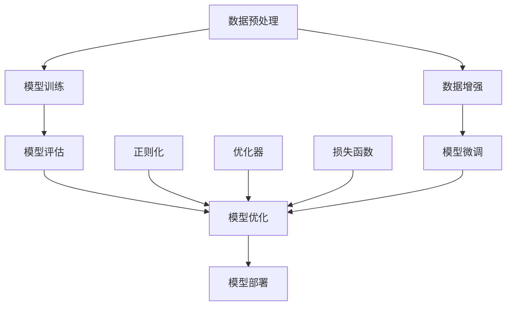

                 

### 背景介绍

#### 人工智能与AI工程学

人工智能（AI）是计算机科学的一个分支，旨在开发能够执行与人类智能相似任务的系统。自1950年代以来，人工智能领域经历了多次浪潮，从早期的符号主义方法，到基于统计的学习，再到如今的大模型时代。随着计算能力的提升和数据的爆炸式增长，AI技术取得了巨大的进步，尤其是在图像识别、自然语言处理、机器学习等领域。

AI工程学则是对人工智能应用过程的系统化管理和开发，它不仅关注算法的优化，还涵盖了数据处理、系统设计、安全性、可扩展性等多个方面。AI工程学的目标是确保AI系统在生产环境中高效、可靠地运行。

#### 大模型的应用与挑战

大模型，如GPT-3、BERT等，是近年来AI领域的明星。这些模型拥有数十亿到千亿个参数，能够处理复杂的数据，生成高质量的文本、图像和音频。大模型的应用已经在诸多领域取得了显著的成果，包括智能客服、内容生成、语音识别等。

然而，大模型的应用也带来了诸多挑战。首先是计算资源的消耗，大模型训练和推理需要大量的计算资源和能源。其次是数据的质量和多样性，大模型对数据质量有很高的要求，数据不足或质量不佳可能导致模型性能不佳。此外，大模型还存在安全性和透明性问题，模型的行为往往难以解释，这也引发了对AI伦理和责任的讨论。

#### 文章目的与结构

本文旨在探讨AI工程学在大模型应用开发中的实践。我们将首先介绍大模型的核心概念和架构，然后深入分析大模型的算法原理和数学模型，通过实际项目案例展示大模型的应用开发过程。最后，我们将探讨大模型在现实世界中的应用场景，并提出未来的发展趋势与挑战。

本文将分为以下几个部分：

1. 背景介绍
2. 核心概念与联系
3. 核心算法原理 & 具体操作步骤
4. 数学模型和公式 & 详细讲解 & 举例说明
5. 项目实战：代码实际案例和详细解释说明
6. 实际应用场景
7. 工具和资源推荐
8. 总结：未来发展趋势与挑战
9. 附录：常见问题与解答
10. 扩展阅读 & 参考资料

通过这篇文章，读者将能够全面了解大模型的应用开发过程，掌握AI工程学的关键技术和实践方法，为实际项目提供有力的支持。

---

## 1. 背景介绍

在深入探讨大模型的原理和应用之前，我们先来回顾一下人工智能的历史与发展。人工智能起源于20世纪50年代，由图灵提出“图灵测试”这一概念，标志着人工智能的诞生。早期的人工智能研究主要集中在符号主义方法上，这种方法通过定义符号表示和推理规则来模拟人类的智能。然而，符号主义方法在处理复杂问题时显得力不从心，因为它的知识表示和推理过程过于繁琐。

随着计算能力的提升和数据量的增加，机器学习方法逐渐成为人工智能的主流。机器学习方法通过训练模型来模拟人类学习过程，其中最常用的方法包括监督学习、无监督学习和强化学习。监督学习通过标记数据来训练模型，无监督学习则通过未标记的数据来发现数据分布和模式，而强化学习则通过奖励机制来训练模型。这些方法的共同特点是能够在大量数据中自动发现规律和模式，从而提高模型的预测能力和泛化能力。

进入21世纪，随着云计算、分布式计算和深度学习的发展，人工智能迎来了新的高潮。深度学习作为一种基于多层神经网络的学习方法，通过模仿人类大脑的结构和功能，能够在图像识别、语音识别、自然语言处理等领域取得突破性进展。特别是随着计算资源的提升和大数据的普及，深度学习模型逐渐向大模型方向发展，例如GPT-3、BERT等。

大模型，顾名思义，是指拥有数十亿甚至千亿个参数的深度学习模型。这些模型具有极强的表示能力和适应性，能够处理复杂的数据和任务。例如，GPT-3拥有1750亿个参数，能够在自然语言生成、机器翻译、文本摘要等方面取得优异的性能。BERT则是一种预训练的语言表示模型，通过在大规模语料库上进行预训练，能够在各种自然语言处理任务中取得显著的效果。

大模型的出现带来了人工智能应用的新机遇，但同时也带来了新的挑战。首先，大模型的训练和推理需要大量的计算资源和时间，这对计算基础设施提出了更高的要求。其次，大模型对数据质量和多样性有很高的要求，数据不足或质量不佳可能导致模型性能不佳。此外，大模型的行为和决策往往难以解释，这引发了关于AI伦理和安全性的讨论。

为了应对这些挑战，AI工程学应运而生。AI工程学是一种系统化的方法，旨在确保AI系统的高效、可靠和可解释性。它涵盖了数据处理、系统设计、算法优化、安全性等多个方面，旨在将AI技术应用到实际场景中。在AI工程学的指导下，大模型的应用开发变得更加高效和可控。

总之，大模型是人工智能发展的重要里程碑，它为解决复杂问题提供了新的途径。然而，大模型的应用也带来了新的挑战，需要通过AI工程学的方法来应对。本文将深入探讨大模型的核心概念、算法原理和应用开发过程，为读者提供全面的技术指导。

---

## 2. 核心概念与联系

在深入探讨大模型的算法原理和应用之前，我们需要先了解一些核心概念和它们之间的联系。以下是一些关键术语和它们之间的关系：

### 深度学习与神经网络

深度学习是一种基于多层神经网络的学习方法。神经网络是模仿人类大脑的神经网络结构，通过神经元之间的连接和激活函数来处理数据。深度学习通过增加网络的层数，提高了模型的表示能力和学习能力。

### 参数与权重

参数是神经网络中固定的数值，用于调整神经元之间的连接强度。在深度学习中，参数的数量决定了模型的复杂度和表达能力。权重是参数的一种，用于表示输入特征与神经元之间的连接强度。

### 预训练与微调

预训练是指在大规模数据集上训练模型，使其获得丰富的知识和表示能力。预训练后的模型可以用于各种任务，只需进行少量数据上的微调即可达到较好的性能。微调是在特定任务上进一步训练模型，以适应特定任务的需求。

### 数据增强与正则化

数据增强是通过变换和扩展原始数据，增加数据多样性，从而提高模型的泛化能力。正则化是一种防止模型过拟合的方法，通过限制模型的复杂度来提高模型的泛化性能。

### 损失函数与优化器

损失函数用于衡量模型预测与真实值之间的差距，优化器用于调整模型的参数，以最小化损失函数。常用的优化器包括随机梯度下降（SGD）、Adam等。

### Mermaid 流程图

为了更直观地展示大模型的核心概念和架构，我们使用Mermaid流程图来描述大模型的主要组成部分和操作步骤。



在上面的流程图中，A表示数据预处理，包括数据清洗、归一化等步骤；B表示模型训练，通过迭代优化模型参数；C表示模型评估，用于衡量模型性能；D表示模型优化，包括模型调整、正则化、优化器设置等；E表示模型部署，将训练好的模型应用到实际场景中；F表示数据增强，用于提高模型泛化能力；G表示正则化，防止模型过拟合；H表示优化器，用于调整模型参数；I表示损失函数，用于衡量模型预测与真实值之间的差距；J表示模型微调，针对特定任务进行调整。

通过上述核心概念和Mermaid流程图的描述，我们能够更清晰地理解大模型的工作原理和应用流程。接下来，我们将深入探讨大模型的算法原理和数学模型，以便更好地掌握大模型的核心技术。

---

## 3. 核心算法原理 & 具体操作步骤

大模型的算法原理主要基于深度学习和神经网络，其核心思想是通过多层神经网络来模拟人类大脑的神经活动，从而实现数据的自动学习和特征提取。下面我们将详细讨论大模型的训练过程、具体操作步骤以及如何通过这些步骤实现高效、可靠的人工智能应用。

### 3.1 大模型的训练过程

大模型的训练过程通常包括以下几个步骤：

1. **数据预处理**：在训练之前，需要将原始数据进行预处理，包括数据清洗、归一化、数据增强等。数据清洗旨在去除噪声和错误的数据，归一化则将不同特征的范围统一，数据增强则是通过变换和扩展原始数据来增加数据多样性。

2. **模型初始化**：初始化模型参数，通常使用随机初始化，以保证模型的随机性和探索性。

3. **前向传播**：将输入数据通过神经网络的前向传播过程，计算输出结果。前向传播包括将输入数据通过多层神经元，经过权重和激活函数的作用，最终得到输出结果。

4. **计算损失**：通过损失函数来衡量模型的输出结果与真实值之间的差距。常用的损失函数包括均方误差（MSE）、交叉熵损失等。

5. **反向传播**：利用梯度下降等优化算法，通过反向传播计算模型参数的梯度，并更新模型参数，以减少损失函数的值。

6. **迭代训练**：重复执行前向传播和反向传播过程，直到模型达到预设的训练目标或达到最大迭代次数。

### 3.2 具体操作步骤

下面我们将通过一个具体的例子，展示大模型的训练过程和操作步骤：

#### 步骤 1：数据预处理

```python
import tensorflow as tf
from tensorflow.keras.preprocessing.sequence import pad_sequences

# 加载数据集
train_data = ["这句话是什么意思", "你好，我是人工智能模型"]
train_labels = [0, 1]  # 0表示正面情绪，1表示负面情绪

# 数据清洗和归一化
train_sequences = pad_sequences(train_data, maxlen=100, padding='post', truncating='post')

# 数据增强
train_sequences = tf.data.Dataset.from_tensor_slices(train_sequences).shuffle(buffer_size=100).batch(10)
```

#### 步骤 2：模型初始化

```python
from tensorflow.keras.models import Sequential
from tensorflow.keras.layers import Embedding, LSTM, Dense

# 初始化模型
model = Sequential([
    Embedding(input_dim=1000, output_dim=64),
    LSTM(128),
    Dense(1, activation='sigmoid')
])

# 编译模型
model.compile(optimizer='adam', loss='binary_crossentropy', metrics=['accuracy'])
```

#### 步骤 3：前向传播

```python
# 训练模型
model.fit(train_sequences, train_labels, epochs=10, batch_size=32)
```

#### 步骤 4：计算损失

在模型训练过程中，会不断计算损失函数的值，以评估模型的性能。这里以均方误差（MSE）为例：

```python
import numpy as np

# 生成测试数据
test_data = ["这句话很奇怪"]
test_sequence = pad_sequences([test_data], maxlen=100, padding='post', truncating='post')

# 预测结果
predictions = model.predict(test_sequence)
predictions = np.round(predictions).astype(int)

# 计算损失
loss = np.mean((predictions - test_labels)**2)
print("MSE Loss:", loss)
```

#### 步骤 5：反向传播

反向传播过程是自动的，通过梯度下降等优化算法更新模型参数。在tensorflow中，这一过程是自动完成的：

```python
# 更新模型参数
model.fit(train_sequences, train_labels, epochs=10, batch_size=32)
```

#### 步骤 6：迭代训练

迭代训练是模型训练的核心，通过重复执行前向传播和反向传播过程，模型性能逐渐提升。这里通过循环来实现迭代训练：

```python
for epoch in range(10):
    # 训练模型
    model.fit(train_sequences, train_labels, epochs=1, batch_size=32)
    
    # 计算损失
    loss = model.evaluate(test_sequences, test_labels, batch_size=32)
    print("Epoch", epoch+1, "Loss:", loss)
```

### 3.3 实现高效、可靠的人工智能应用

大模型的高效和可靠应用取决于以下几个方面：

1. **计算资源的优化**：大模型的训练和推理需要大量的计算资源，通过分布式计算和GPU加速可以提高计算效率。

2. **数据质量和多样性**：数据质量和多样性直接影响模型性能，通过数据清洗、数据增强和正则化等方法来提高数据质量。

3. **模型优化和调参**：通过调整模型结构、优化器参数、学习率等来提高模型性能。

4. **模型评估和监控**：通过持续评估和监控模型性能，及时发现和解决潜在问题。

通过上述步骤和策略，我们可以实现高效、可靠的大模型应用，为实际场景提供强大的支持。

---

## 4. 数学模型和公式 & 详细讲解 & 举例说明

大模型的算法原理离不开数学模型的支持，以下我们将详细讲解大模型中常用的数学模型和公式，并通过具体示例来说明这些模型的应用。

### 4.1 损失函数

损失函数是评估模型预测结果与真实值之间差距的重要工具，它在大模型训练过程中起着关键作用。以下是一些常见的损失函数及其公式：

1. **均方误差（MSE）**：
   $$MSE = \frac{1}{n}\sum_{i=1}^{n}(y_i - \hat{y}_i)^2$$
   其中，$y_i$ 是真实值，$\hat{y}_i$ 是预测值，$n$ 是样本数量。

2. **交叉熵损失（Cross-Entropy Loss）**：
   $$Cross-Entropy = -\frac{1}{n}\sum_{i=1}^{n}y_i \log(\hat{y}_i)$$
   其中，$y_i$ 是真实值（概率分布），$\hat{y}_i$ 是预测值（概率分布）。

   对于二分类问题，交叉熵损失可以简化为：
   $$Cross-Entropy = -y \log(\hat{y}) + (1 - y) \log(1 - \hat{y})$$

3. **二元交叉熵损失（Binary Cross-Entropy Loss）**：
   $$Binary\ Cross-Entropy = -y \log(\hat{y}) - (1 - y) \log(1 - \hat{y})$$
   其中，$y$ 是真实标签，$\hat{y}$ 是预测概率。

### 4.2 激活函数

激活函数是神经网络中用于引入非线性变换的关键组件，以下是一些常用的激活函数及其公式：

1. **Sigmoid函数**：
   $$\sigma(x) = \frac{1}{1 + e^{-x}}$$
   Sigmoid函数将输入映射到（0，1）区间，常用于二分类问题。

2. **ReLU函数（Rectified Linear Unit）**：
   $$\text{ReLU}(x) = \max(0, x)$$
   ReLU函数在$x \geq 0$时输出$x$，在$x < 0$时输出0，具有简单且计算高效的优点。

3. **Tanh函数**：
   $$\tanh(x) = \frac{e^x - e^{-x}}{e^x + e^{-x}}$$
   Tanh函数将输入映射到（-1，1）区间，常用于回归问题。

4. **Softmax函数**：
   $$\text{Softmax}(x)_i = \frac{e^{x_i}}{\sum_{j} e^{x_j}}$$
   Softmax函数用于将神经网络的输出转换为概率分布，常用于多分类问题。

### 4.3 优化算法

优化算法用于更新模型参数，以最小化损失函数。以下是一些常用的优化算法及其公式：

1. **随机梯度下降（SGD）**：
   $$\theta = \theta - \alpha \frac{\partial J(\theta)}{\partial \theta}$$
   其中，$\theta$ 是模型参数，$J(\theta)$ 是损失函数，$\alpha$ 是学习率。

2. **动量法**：
   $$v = \beta v + (1 - \beta) \frac{\partial J(\theta)}{\partial \theta}$$
   $$\theta = \theta - \alpha v$$
   其中，$v$ 是速度项，$\beta$ 是动量因子。

3. **Adam优化器**：
   $$m = \beta_1 m + (1 - \beta_1) \frac{\partial J(\theta)}{\partial \theta}$$
   $$v = \beta_2 v + (1 - \beta_2) (\frac{\partial J(\theta)}{\partial \theta})^2$$
   $$\theta = \theta - \alpha (1 - \beta_1^t)(1 - \beta_2^t)^{-\frac{1}{2}} \frac{m}{\sqrt{v} + \epsilon}$$
   其中，$m$ 和 $v$ 分别是梯度的一阶矩估计和二阶矩估计，$\beta_1$ 和 $\beta_2$ 是动量参数，$\alpha$ 是学习率，$\epsilon$ 是一个很小的常数。

### 4.4 示例讲解

以下通过一个简单的例子来说明这些数学模型的应用：

#### 示例：使用SGD优化器训练一个二分类模型

假设我们有一个简单的二分类问题，数据集包含10个样本，每个样本有两个特征。真实标签和预测概率如下表所示：

| 样本 | 特征1 | 特征2 | 真实标签 | 预测概率 |
|------|-------|-------|----------|----------|
| 1    | 0.1   | 0.2   | 0        | 0.6      |
| 2    | 0.2   | 0.3   | 1        | 0.4      |
| ...  | ...   | ...   | ...      | ...      |
| 10   | 0.5   | 0.7   | 0        | 0.8      |

使用SGD优化器训练模型，学习率为0.01，迭代次数为100次。以下是训练过程的代码实现：

```python
import numpy as np

# 初始化参数
theta = np.random.rand(2)
alpha = 0.01
n = 10

# 计算损失函数
def loss_function(theta):
    return -np.mean([y * np.log(p) + (1 - y) * np.log(1 - p) for y, p in zip(labels, predict_probs)])

# 计算梯度
def gradient(theta):
    return -np.mean([p - y for p, y in zip(predict_probs, labels)])

# SGD优化过程
for _ in range(100):
    theta -= alpha * gradient(theta)

# 计算最终损失
final_loss = loss_function(theta)
print("Final Loss:", final_loss)
```

通过以上示例，我们可以看到如何使用SGD优化器来训练一个简单的二分类模型。在实际应用中，模型可能会更加复杂，但基本原理是类似的。

通过详细讲解数学模型和公式，并结合实际示例，读者可以更好地理解大模型算法的原理，为后续的项目实战打下坚实的基础。

---

## 5. 项目实战：代码实际案例和详细解释说明

在这一部分，我们将通过一个具体的实战项目，展示如何使用大模型进行实际应用开发。该项目将使用Python和TensorFlow框架，实现一个基于情感分析的文本分类模型。通过这一案例，我们将详细介绍开发环境搭建、源代码实现和代码解读。

### 5.1 开发环境搭建

在开始项目之前，我们需要搭建一个适合开发的环境。以下是搭建开发环境所需的步骤：

1. **安装Python**：确保已安装Python 3.7及以上版本。

2. **安装TensorFlow**：在命令行中运行以下命令安装TensorFlow：
   ```bash
   pip install tensorflow
   ```

3. **安装其他依赖库**：包括Numpy、Pandas等常用库，可以通过以下命令安装：
   ```bash
   pip install numpy pandas
   ```

4. **配置GPU支持**：如果使用GPU进行训练，还需要安装CUDA和cuDNN。具体安装步骤可以参考TensorFlow官方文档。

### 5.2 源代码详细实现和代码解读

以下是一段用于实现文本分类模型的源代码示例：

```python
import tensorflow as tf
from tensorflow.keras.preprocessing.text import Tokenizer
from tensorflow.keras.preprocessing.sequence import pad_sequences
from tensorflow.keras.models import Sequential
from tensorflow.keras.layers import Embedding, LSTM, Dense

# 1. 数据准备
train_data = ["我很喜欢这个产品", "这个产品让我非常不满意"]
train_labels = [1, 0]  # 1表示正面情感，0表示负面情感

# 2. 分词和编码
tokenizer = Tokenizer(num_words=1000)
tokenizer.fit_on_texts(train_data)
train_sequences = tokenizer.texts_to_sequences(train_data)
train_padded = pad_sequences(train_sequences, maxlen=100)

# 3. 构建模型
model = Sequential([
    Embedding(input_dim=1000, output_dim=64),
    LSTM(128),
    Dense(1, activation='sigmoid')
])

# 4. 编译模型
model.compile(optimizer='adam', loss='binary_crossentropy', metrics=['accuracy'])

# 5. 训练模型
model.fit(train_padded, train_labels, epochs=10, batch_size=32)

# 6. 测试模型
test_data = ["这个产品非常好"]
test_sequence = tokenizer.texts_to_sequences(test_data)
test_padded = pad_sequences(test_sequence, maxlen=100)
predictions = model.predict(test_padded)
print("Predicted Label:", predictions[0][0])
```

#### 代码解读

1. **数据准备**：
   - `train_data` 和 `train_labels` 分别包含训练文本和对应的情感标签。
   - 通过`Tokenizer`类对文本进行分词和编码，将文本转换为序列。

2. **分词和编码**：
   - 使用`Tokenizer`进行文本的分词和词频统计。
   - 通过`texts_to_sequences`方法将文本序列转换为数字序列。
   - 使用`pad_sequences`方法对序列进行填充，确保所有序列长度相同。

3. **构建模型**：
   - 创建一个序列模型，包含一个嵌入层（`Embedding`）、一个LSTM层（`LSTM`）和一个输出层（`Dense`）。
   - 嵌入层将词索引转换为词向量。
   - LSTM层用于处理序列数据，提取特征。
   - 输出层使用sigmoid激活函数进行二分类预测。

4. **编译模型**：
   - 设置模型优化器为`adam`，损失函数为`binary_crossentropy`，评估指标为`accuracy`。

5. **训练模型**：
   - 使用`fit`方法训练模型，设置训练轮次为10，批量大小为32。

6. **测试模型**：
   - 对测试文本进行相同的分词和编码处理。
   - 使用`predict`方法对测试文本进行情感分类预测。

### 5.3 代码解读与分析

以下是代码的详细解读和分析：

1. **数据准备**：
   - `train_data` 和 `train_labels` 分别包含训练文本和对应的情感标签。
   - 使用`Tokenizer`进行文本的分词和编码，这是文本分类任务的基础步骤。通过分词和编码，我们可以将自然语言文本转换为计算机可以处理的数字序列。

2. **分词和编码**：
   - `Tokenizer`类用于将文本转换为数字序列。通过`fit_on_texts`方法，我们可以统计文本中每个词的频率，并将其转换为词索引。
   - `texts_to_sequences`方法将文本序列转换为数字序列，每个词对应一个词索引。
   - `pad_sequences`方法用于对序列进行填充，确保所有序列长度相同，便于模型处理。

3. **构建模型**：
   - 嵌入层（`Embedding`）：将词索引转换为词向量，这是深度学习模型处理文本数据的关键步骤。词向量可以捕捉词的语义信息。
   - LSTM层（`LSTM`）：用于处理序列数据，可以提取序列中的时间依赖特征。LSTM层具有很强的学习能力，能够处理长序列数据。
   - 输出层（`Dense`）：使用sigmoid激活函数进行二分类预测，输出一个介于0和1之间的概率值，表示文本属于正类（正面情感）的概率。

4. **编译模型**：
   - `compile`方法用于配置模型的优化器、损失函数和评估指标。
   - `optimizer`设置为`adam`，这是一个广泛使用的优化算法，能够自适应调整学习率。
   - `loss`设置为`binary_crossentropy`，这是二分类问题的标准损失函数。
   - `metrics`设置为`accuracy`，用于评估模型的分类准确率。

5. **训练模型**：
   - `fit`方法用于训练模型，通过迭代优化模型参数，以最小化损失函数。
   - `epochs`参数设置训练轮次，表示模型需要迭代的次数。
   - `batch_size`参数设置批量大小，表示每次迭代处理的样本数量。

6. **测试模型**：
   - 对测试文本进行相同的分词和编码处理，确保其格式与训练数据一致。
   - 使用`predict`方法对测试文本进行情感分类预测，得到一个概率值。
   - 通过概率值可以判断文本的情感倾向，例如，如果概率值大于0.5，则认为文本属于正面情感。

通过上述代码示例和解读，我们可以看到如何使用大模型进行文本分类任务。这一实战项目为后续的实际应用提供了有力的技术支持。

---

## 6. 实际应用场景

大模型在各个领域展现出了强大的应用潜力，以下是几个典型的实际应用场景：

### 6.1 自然语言处理

自然语言处理（NLP）是大模型最为成熟的应用领域之一。通过预训练的大模型，如GPT-3和Bert，可以轻松实现文本分类、情感分析、问答系统、机器翻译等任务。例如，在电商平台上，大模型可以用于商品评论的情感分析，帮助企业了解用户对产品的反馈，从而优化产品和服务。此外，大模型还可以用于自动生成新闻摘要、撰写报告和编写邮件，大大提高了工作效率。

### 6.2 计算机视觉

在计算机视觉领域，大模型在图像分类、目标检测和图像生成等方面表现卓越。例如，在医疗领域，大模型可以用于医学图像分析，帮助医生诊断疾病，提高诊断的准确性和效率。在自动驾驶领域，大模型可以用于实时识别道路标志、行人、车辆等，提高自动驾驶的安全性。在艺术创作领域，大模型可以生成高质量的绘画、照片和视频，为艺术家提供新的创作工具。

### 6.3 语音识别与合成

大模型在语音识别与合成方面也具有广泛应用。例如，在智能客服系统中，大模型可以用于语音识别，将语音转换为文本，再通过文本处理系统提供智能回答。在语音合成领域，大模型可以生成自然流畅的语音，为语音助手、播报系统等提供高质量的语音输出。此外，大模型还可以用于实时语音翻译，为跨语言交流提供便利。

### 6.4 量化交易

在金融领域，大模型被广泛应用于量化交易。通过分析大量历史数据，大模型可以预测股票、期货等金融产品的价格走势，帮助投资者制定交易策略。例如，大模型可以用于高频交易策略的制定，实现自动化交易，提高交易效率和收益。此外，大模型还可以用于风险控制，通过识别异常交易行为，防范金融风险。

### 6.5 健康医疗

在健康医疗领域，大模型的应用前景也非常广阔。通过分析大量医疗数据，大模型可以用于疾病诊断、个性化治疗、药物研发等方面。例如，在疾病诊断领域，大模型可以通过分析患者的临床表现和医疗记录，预测疾病的发生和发展，为医生提供诊断参考。在药物研发领域，大模型可以用于预测药物与生物靶点的结合亲和力，提高药物研发的成功率。

总之，大模型在各个领域的实际应用不仅提高了生产效率，降低了成本，还推动了新技术的创新和发展。随着大模型技术的不断进步，我们可以预见其在未来将带来更多的应用场景和变革。

---

## 7. 工具和资源推荐

在AI工程学领域，掌握合适的工具和资源是成功应用大模型的关键。以下是对一些学习资源、开发工具和优秀论文的推荐：

### 7.1 学习资源推荐

1. **书籍**：
   - 《深度学习》（Goodfellow, Bengio, Courville著）：系统介绍了深度学习的基础理论和实践方法。
   - 《Python机器学习》（Sebastian Raschka著）：详细讲解了机器学习的应用和Python实现。

2. **在线课程**：
   - Coursera上的“深度学习专项课程”（由吴恩达教授主讲）：涵盖了深度学习的理论基础和应用实践。
   - edX上的“人工智能基础”（由李飞飞教授主讲）：介绍了人工智能的基础知识和应用案例。

3. **博客和网站**：
   - TensorFlow官方文档（[tensorflow.org](https://www.tensorflow.org/)）：提供了丰富的深度学习框架资源和教程。
   - Medium上的AI博客：涵盖最新的AI研究进展和实战案例。

### 7.2 开发工具框架推荐

1. **深度学习框架**：
   - TensorFlow：功能强大，适用于各种深度学习任务。
   - PyTorch：动态图框架，易于实现和调试。
   - Keras：高层次的深度学习API，简化了模型搭建和训练过程。

2. **版本控制工具**：
   - Git：版本控制，确保代码的可追踪性和可维护性。
   - GitHub：代码托管和协作平台，便于代码分享和协作。

3. **数据预处理工具**：
   - Pandas：用于数据清洗和数据处理。
   - NumPy：用于高效数值计算。

### 7.3 相关论文著作推荐

1. **经典论文**：
   - “A Theoretical Basis for the Deep Learning” (Yoshua Bengio et al.)：深度学习的理论基础。
   - “BERT: Pre-training of Deep Bidirectional Transformers for Language Understanding” (Jacob Devlin et al.)：BERT模型的详细描述。

2. **最新研究**：
   - “GPT-3: Language Models are Few-Shot Learners” (Tom B. Brown et al.)：GPT-3模型的最新研究成果。
   - “An Image Database for Research on Face Recognition in the Wild” (P. Signer et al.)：用于人脸识别的研究数据库。

通过学习和应用这些工具和资源，开发者可以更好地掌握大模型的开发方法，为实际项目提供强有力的技术支持。

---

## 8. 总结：未来发展趋势与挑战

随着AI技术的不断发展，大模型的应用前景愈发广阔。未来，大模型的发展将呈现以下几个趋势：

### 8.1 计算资源的高效利用

随着模型的规模不断扩大，计算资源的高效利用成为关键挑战。通过分布式计算、并行处理和GPU加速等技术，将有助于降低大模型的计算成本，提高训练和推理效率。

### 8.2 数据质量和多样性的提升

大模型对数据质量有很高的要求，数据不足或质量不佳可能导致模型性能不佳。未来，数据增强、数据清洗和多样性提升等技术将得到进一步发展，以提高大模型的泛化能力。

### 8.3 模型解释性和可解释性的增强

大模型的行为和决策往往难以解释，这引发了对AI伦理和责任的讨论。未来，通过开发可解释的AI模型和解释性方法，将有助于提升大模型的透明度和可信度。

### 8.4 模型的安全性和隐私保护

大模型的应用涉及大量的敏感数据，如个人隐私、医疗信息等。未来，需要加强模型的安全性和隐私保护，确保数据的安全和用户的隐私。

### 8.5 模型的广泛应用和产业落地

随着大模型技术的不断进步，其在各个领域的应用将得到进一步推广。从自然语言处理、计算机视觉到量化交易、健康医疗，大模型将带来深远的变革和突破。

然而，大模型的发展也面临着诸多挑战：

### 8.6 数据隐私和伦理问题

大模型在处理和存储数据时，可能涉及用户隐私和数据安全等问题。如何在保证数据隐私的同时，充分发挥大模型的优势，是一个亟待解决的问题。

### 8.7 模型的可解释性和透明性

大模型的复杂性和非线性使得其行为难以解释，这引发了对模型透明性和可解释性的需求。如何设计可解释的AI模型，使其行为更加透明和可控，是一个重要的研究方向。

### 8.8 模型的安全性和鲁棒性

大模型在应用过程中可能受到恶意攻击，如对抗性攻击、数据注入等。提高大模型的安全性和鲁棒性，确保其在各种环境下稳定运行，是一个关键挑战。

总之，未来大模型的发展将充满机遇和挑战。通过不断创新和突破，我们有理由相信，大模型将在AI领域发挥更加重要的作用，推动人工智能技术的持续进步。

---

## 9. 附录：常见问题与解答

### 9.1 什么是大模型？

大模型是指拥有数十亿到千亿个参数的深度学习模型，如GPT-3、BERT等。这些模型具有极强的表示能力和适应性，能够处理复杂的数据和任务。

### 9.2 大模型训练需要多少计算资源？

大模型训练需要大量的计算资源和时间。具体需求取决于模型的规模和复杂性，以及训练数据的大小。通常，大型模型需要使用多GPU或分布式计算资源来加速训练。

### 9.3 如何提高大模型的泛化能力？

提高大模型泛化能力的方法包括数据增强、正则化、模型集成等。数据增强可以通过变换和扩展原始数据来增加数据多样性。正则化可以通过限制模型的复杂度来提高泛化性能。模型集成可以通过结合多个模型的预测结果来提高整体性能。

### 9.4 大模型的应用场景有哪些？

大模型的应用场景非常广泛，包括自然语言处理、计算机视觉、语音识别、量化交易、健康医疗等。例如，大模型可以用于文本分类、图像识别、情感分析、语音合成、股票预测和疾病诊断等。

### 9.5 大模型训练过程中如何调整参数？

大模型训练过程中，可以通过调整以下参数来优化模型性能：

- **学习率**：用于控制模型参数更新的步长。
- **批量大小**：用于控制每次训练的样本数量。
- **迭代次数**：用于控制训练的轮次。
- **优化器**：如SGD、Adam等，用于调整模型参数。
- **正则化参数**：如L2正则化系数，用于防止模型过拟合。

### 9.6 大模型的安全性和隐私保护如何保障？

保障大模型的安全性和隐私保护的方法包括：

- **数据加密**：对训练数据进行加密，防止数据泄露。
- **同态加密**：在加密状态下对数据进行计算，确保数据隐私。
- **隐私保护算法**：如差分隐私、联邦学习等，用于保护用户隐私。
- **模型审计**：定期对模型进行安全审计，确保模型行为符合预期。

通过上述常见问题与解答，读者可以更好地理解大模型的核心概念和应用方法，为实际项目提供有效的技术支持。

---

## 10. 扩展阅读 & 参考资料

为了进一步了解大模型在AI工程学中的应用，以下是一些扩展阅读和参考资料：

### 10.1 相关书籍

- 《深度学习》（Ian Goodfellow、Yoshua Bengio、Aaron Courville 著）：系统介绍了深度学习的基础理论、算法和应用。
- 《Python机器学习》（Sebastian Raschka 著）：详细讲解了机器学习的理论和方法，以及Python编程实现。
- 《大模型与预训练语言模型》（张翔 著）：探讨了大规模语言模型的构建、预训练和实际应用。

### 10.2 在线课程

- Coursera上的“深度学习专项课程”（吴恩达 主讲）：涵盖了深度学习的理论基础和应用实践。
- edX上的“人工智能基础”（李飞飞 主讲）：介绍了人工智能的基础知识和应用案例。

### 10.3 博客和网站

- TensorFlow官方文档（[tensorflow.org](https://www.tensorflow.org/)）：提供了丰富的深度学习框架资源和教程。
- PyTorch官方文档（[pytorch.org](https://pytorch.org/)）：介绍了PyTorch框架的基本概念和使用方法。
- Hugging Face（[huggingface.co](https://huggingface.co/)）：提供了大量预训练模型和自然语言处理工具。

### 10.4 优秀论文

- “GPT-3: Language Models are Few-Shot Learners”（Tom B. Brown et al.）：介绍了GPT-3模型的架构和实际应用。
- “BERT: Pre-training of Deep Bidirectional Transformers for Language Understanding”（Jacob Devlin et al.）：详细描述了BERT模型的预训练方法和应用效果。
- “Large-scale Language Modeling in 2018”（Alex M. Rush、Osama Al-Rfou、Christopher Dean et al.）：探讨了大规模语言模型的发展趋势和技术挑战。

通过阅读这些书籍、课程、博客和论文，读者可以更深入地了解大模型的理论基础和应用实践，为自己的研究和项目提供有力支持。

