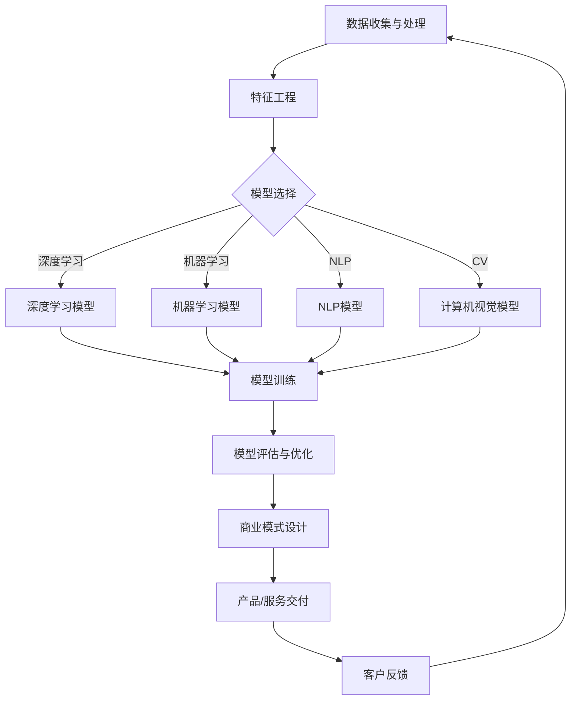

                 

### 背景介绍

#### 人工智能与商业模式的结合

随着人工智能（AI）技术的迅速发展，各行各业都在积极探索如何将AI与商业模式相结合，以实现业务增长、成本优化和用户体验的提升。从智能客服到自动驾驶，从金融风控到医疗诊断，AI正逐步渗透到各个领域，改变着我们的生活方式和商业模式。

在过去的几十年中，人工智能经历了从理论研究到实际应用的重大转变。早期的人工智能研究主要集中在符号逻辑、搜索算法和专家系统等领域，这些方法在特定场景下取得了显著的成果，但面临着计算资源受限、数据依赖性高等问题。随着深度学习、神经网络等技术的突破，人工智能逐渐从“学术实验室”走向“商业实践”，成为推动创新和增长的重要力量。

商业模式，是指企业通过提供产品或服务来创造、传递和捕获价值的系统。传统的商业模式注重的是效率和规模，而AI技术的引入，使得商业模式变得更加灵活、精准和高效。通过AI，企业能够更好地理解客户需求，优化运营流程，降低成本，提升服务质量，从而实现商业价值的最大化。

本文将探讨AI技术与商业模式的结合，分析其核心概念、算法原理、数学模型、实际应用场景、工具和资源，并总结未来发展趋势与挑战。通过本文的阅读，读者将了解到AI如何影响商业模式，以及如何将AI技术应用于实际业务中，实现创新和增长。

### 核心概念与联系

#### 人工智能技术核心概念

1. **机器学习（Machine Learning）**：机器学习是一种使计算机通过数据学习模式、规律和预测的技术。它包括监督学习、无监督学习和强化学习等子领域。

2. **深度学习（Deep Learning）**：深度学习是机器学习的一个分支，通过多层神经网络模型，对大量数据进行自动特征学习和分类。它包括卷积神经网络（CNN）、循环神经网络（RNN）和生成对抗网络（GAN）等模型。

3. **自然语言处理（Natural Language Processing，NLP）**：NLP是使计算机能够理解、生成和处理自然语言的技术。它包括文本分类、情感分析、机器翻译和语音识别等应用。

4. **计算机视觉（Computer Vision）**：计算机视觉是使计算机能够“看到”和理解图像或视频的技术。它包括图像分类、目标检测、图像生成和图像分割等应用。

#### 商业模式核心概念

1. **价值主张（Value Proposition）**：价值主张是企业向客户提供的独特价值和利益，是商业模式的核心。

2. **客户细分（Customer Segmentation）**：客户细分是将市场划分为不同的客户群体，以便更好地满足他们的需求。

3. **渠道（Channels）**：渠道是企业传递产品或服务给客户的方式，包括线上和线下渠道。

4. **客户关系（Customer Relationships）**：客户关系是企业与客户建立的关系，包括售前、售中和售后服务。

5. **成本结构（Cost Structure）**：成本结构是企业运营过程中产生的成本，包括固定成本和可变成本。

6. **收入模型（Revenue Model）**：收入模型是企业通过提供产品或服务获取收入的方式。

#### AI与商业模式结合的流程图

下面是一个简单的Mermaid流程图，展示了AI技术与商业模式结合的基本流程：



在这个流程图中，数据收集与处理是整个流程的起点，通过特征工程对数据进行预处理和特征提取。然后，根据业务需求选择合适的AI模型，进行模型训练和评估。训练好的模型将用于商业模式的优化和产品设计，最终通过产品/服务交付给客户，并收集客户反馈以不断改进。

#### 核心概念与联系

AI技术与商业模式的核心联系在于，AI技术能够为企业提供更精准的数据分析、更智能的客户服务和更优化的运营流程，从而提升企业核心竞争力。以下是AI与商业模式之间的核心联系：

1. **数据驱动的决策**：AI技术能够处理和分析大量数据，帮助企业从数据中提取有价值的信息，从而做出更明智的商业决策。

2. **个性化服务**：通过自然语言处理和计算机视觉技术，企业能够更好地理解客户需求，提供个性化服务和推荐，提升客户满意度。

3. **运营优化**：AI技术能够自动化和优化业务流程，降低成本，提高效率，从而实现持续的业务增长。

4. **风险管理**：AI技术在金融、医疗等领域的应用，能够帮助企业预测风险、监控异常，降低业务风险。

5. **产品创新**：AI技术的引入，使得企业能够开发出更加智能化、个性化、创新性的产品，满足客户需求，开拓新市场。

通过以上核心概念和联系，我们可以看到，AI技术与商业模式之间的结合不仅提升了企业的运营效率，还为企业带来了巨大的商业价值。在接下来的章节中，我们将进一步探讨AI技术的核心算法原理和具体操作步骤，以及数学模型和公式的应用。

---

### 核心算法原理 & 具体操作步骤

#### 机器学习算法原理

机器学习算法的核心在于通过数据学习和模式识别，从而实现预测和决策。以下是几种常见的机器学习算法及其原理：

1. **线性回归（Linear Regression）**：
   线性回归是一种监督学习算法，用于分析两个或多个变量之间的线性关系。其原理是通过最小化预测值与实际值之间的误差平方和，找到最佳拟合直线。

   操作步骤：
   - 数据预处理：对输入数据进行标准化或归一化，以便算法更好地拟合。
   - 模型构建：定义线性模型，如 y = wx + b，其中 x 是输入特征，w 是权重，b 是偏置。
   - 模型训练：通过梯度下降法或最小二乘法优化权重和偏置，使得预测值与实际值之间的误差最小。
   - 模型评估：使用测试集评估模型的准确性，如均方误差（MSE）。

2. **决策树（Decision Tree）**：
   决策树是一种基于特征进行决策的树形结构模型。其原理是通过递归划分数据集，将数据分成多个子集，直到满足停止条件。

   操作步骤：
   - 数据预处理：对输入数据进行处理，如缺失值填充、数据转换等。
   - 特征选择：选择重要的特征进行决策。
   - 构建决策树：从根节点开始，递归划分数据集，直到叶节点。
   - 模型评估：计算决策树的准确率、精确率、召回率等指标。

3. **支持向量机（Support Vector Machine，SVM）**：
   支持向量机是一种用于分类和回归的监督学习算法。其原理是通过找到一个最佳的超平面，使得分类边界最大化。

   操作步骤：
   - 数据预处理：对输入数据进行标准化。
   - 模型构建：定义支持向量机模型，如线性SVM和核SVM。
   - 模型训练：使用支持向量机求解器训练模型。
   - 模型评估：使用测试集评估模型性能。

4. **神经网络（Neural Network）**：
   神经网络是一种模拟人脑神经元结构的算法，用于分类、回归和模式识别。其原理是通过多层神经元的非线性变换，实现复杂的函数映射。

   操作步骤：
   - 数据预处理：对输入数据进行归一化或标准化。
   - 模型构建：定义神经网络结构，包括输入层、隐藏层和输出层。
   - 模型训练：通过反向传播算法训练神经网络，优化权重和偏置。
   - 模型评估：使用测试集评估模型性能。

#### 深度学习算法原理

深度学习是机器学习的一个分支，通过多层神经网络模型，实现自动特征学习和分类。以下是几种常见的深度学习算法及其原理：

1. **卷积神经网络（Convolutional Neural Network，CNN）**：
   卷积神经网络是一种用于图像识别和处理的深度学习模型。其原理是通过卷积层提取图像特征，并通过池化层减小数据维度。

   操作步骤：
   - 数据预处理：对图像进行归一化处理。
   - 模型构建：定义CNN结构，包括卷积层、池化层、全连接层等。
   - 模型训练：通过反向传播算法训练CNN模型。
   - 模型评估：使用测试集评估模型性能。

2. **循环神经网络（Recurrent Neural Network，RNN）**：
   循环神经网络是一种用于序列数据处理的深度学习模型。其原理是通过循环机制，将前一时刻的输出作为当前时刻的输入。

   操作步骤：
   - 数据预处理：对序列数据进行编码。
   - 模型构建：定义RNN结构，包括输入层、隐藏层、输出层等。
   - 模型训练：通过反向传播算法训练RNN模型。
   - 模型评估：使用测试集评估模型性能。

3. **生成对抗网络（Generative Adversarial Network，GAN）**：
   生成对抗网络是一种用于生成对抗学习的深度学习模型。其原理是通过对抗性训练，使得生成器生成逼真的数据。

   操作步骤：
   - 数据预处理：对输入数据进行编码。
   - 模型构建：定义GAN结构，包括生成器和判别器。
   - 模型训练：通过生成器和判别器的对抗性训练，优化模型参数。
   - 模型评估：使用生成数据评估模型性能。

#### 自然语言处理算法原理

自然语言处理是使计算机能够理解、生成和处理自然语言的技术。以下是几种常见的NLP算法及其原理：

1. **词袋模型（Bag of Words，BoW）**：
   词袋模型是一种用于文本分类和情感分析的技术。其原理是将文本表示为单词的集合，忽略单词的顺序。

   操作步骤：
   - 数据预处理：对文本进行分词、去除停用词、词形还原等处理。
   - 特征提取：将文本转化为词袋表示，如二值向量或词频向量。
   - 模型训练：使用分类算法，如SVM或逻辑回归，训练词袋模型。
   - 模型评估：使用测试集评估模型性能。

2. **词嵌入（Word Embedding）**：
   词嵌入是一种将单词表示为向量空间中点的技术。其原理是通过神经网络学习单词的语义表示。

   操作步骤：
   - 数据预处理：对文本进行分词、去除停用词、词形还原等处理。
   - 模型训练：使用神经网络模型，如Word2Vec或GloVe，训练词嵌入向量。
   - 模型应用：将词嵌入向量用于文本分类、情感分析等任务。

3. **序列标注（Sequence Labeling）**：
   序列标注是一种用于命名实体识别和情感分析的技术。其原理是通过预测每个词的标签，对序列进行标注。

   操作步骤：
   - 数据预处理：对文本进行分词、去除停用词、词形还原等处理。
   - 模型构建：定义序列标注模型，如BiLSTM-CRF。
   - 模型训练：使用训练数据训练序列标注模型。
   - 模型评估：使用测试集评估模型性能。

#### 计算机视觉算法原理

计算机视觉是使计算机能够“看到”和理解图像或视频的技术。以下是几种常见的计算机视觉算法及其原理：

1. **目标检测（Object Detection）**：
   目标检测是一种用于识别图像中目标位置的技术。其原理是通过检测目标边界，并输出目标的类别和位置。

   操作步骤：
   - 数据预处理：对图像进行缩放、裁剪、旋转等处理。
   - 模型构建：定义目标检测模型，如Faster R-CNN或YOLO。
   - 模型训练：使用训练数据训练目标检测模型。
   - 模型评估：使用测试集评估模型性能。

2. **图像分类（Image Classification）**：
   图像分类是一种用于识别图像中物体的类别。其原理是通过训练模型，将图像映射到预定义的类别。

   操作步骤：
   - 数据预处理：对图像进行缩放、裁剪、旋转等处理。
   - 模型构建：定义图像分类模型，如AlexNet或ResNet。
   - 模型训练：使用训练数据训练图像分类模型。
   - 模型评估：使用测试集评估模型性能。

3. **图像生成（Image Generation）**：
   图像生成是一种通过神经网络生成新图像的技术。其原理是通过对抗性训练，使得生成器生成逼真的图像。

   操作步骤：
   - 数据预处理：对图像进行编码。
   - 模型构建：定义图像生成模型，如GAN。
   - 模型训练：通过生成器和判别器的对抗性训练，优化模型参数。
   - 模型评估：使用生成图像评估模型性能。

通过以上核心算法原理和具体操作步骤的介绍，我们可以看到，AI技术在不同的领域有着广泛的应用，并且每种算法都有其独特的优势和适用场景。在接下来的章节中，我们将进一步探讨数学模型和公式的应用，以及项目实战中的代码实现和详细解释说明。

---

### 数学模型和公式 & 详细讲解 & 举例说明

#### 线性回归模型

线性回归模型是最基本的机器学习算法之一，主要用于分析两个或多个变量之间的线性关系。其数学模型可以表示为：

$$
y = wx + b
$$

其中，$y$ 是因变量，$x$ 是自变量，$w$ 是权重，$b$ 是偏置。线性回归的目标是通过训练数据集，找到最佳的权重和偏置，使得预测值与实际值之间的误差最小。

假设我们有一个训练数据集 $D = \{ (x_1, y_1), (x_2, y_2), ..., (x_n, y_n) \}$，可以使用最小二乘法（Least Squares）来求解权重和偏置：

$$
w = \frac{\sum_{i=1}^{n} x_i y_i - \frac{1}{n} \sum_{i=1}^{n} x_i \sum_{i=1}^{n} y_i}{\sum_{i=1}^{n} x_i^2 - \frac{1}{n} (\sum_{i=1}^{n} x_i)^2}
$$

$$
b = \frac{1}{n} \sum_{i=1}^{n} y_i - w \frac{1}{n} \sum_{i=1}^{n} x_i
$$

下面通过一个简单的例子来说明线性回归的应用。

**例子：预测房价**

假设我们有一个房价数据集，包含房屋面积和房价两个特征。我们希望通过线性回归模型预测房屋的价格。

数据集样例如下：

| 面积 | 价格 |
|------|------|
| 1000 | 300万 |
| 1500 | 450万 |
| 2000 | 600万 |

首先，对数据集进行归一化处理，然后使用线性回归模型进行训练。训练完成后，我们可以使用模型来预测新的房屋价格。

#### 决策树模型

决策树是一种基于特征进行决策的树形结构模型。其核心是递归划分数据集，直到满足停止条件。决策树的数学模型可以表示为：

$$
T = \text{split}(X, y, \text{feature}, \text{threshold})
$$

其中，$T$ 是决策树，$X$ 是特征，$y$ 是标签，$\text{feature}$ 是选择的特征，$\text{threshold}$ 是阈值。

决策树的构建过程如下：

1. 选择一个最优特征 $\text{feature}$ 和阈值 $\text{threshold}$，使得数据集的纯度最大。
2. 根据阈值对数据集进行划分，生成新的子数据集。
3. 对每个子数据集递归执行步骤1和2，直到满足停止条件（例如，数据集的大小小于阈值或特征已经全部遍历）。

下面通过一个简单的例子来说明决策树的应用。

**例子：分类水果**

假设我们有一个水果数据集，包含重量、颜色和价格三个特征。我们希望通过决策树模型将水果分类为苹果或橙子。

数据集样例如下：

| 重量 | 颜色 | 价格 | 类别 |
|------|------|------|------|
| 150  | 红色 | 10   | 苹果 |
| 200  | 橙色 | 15   | 橙子 |
| 100  | 红色 | 8    | 苹果 |
| 250  | 橙色 | 12   | 橙子 |

首先，使用信息增益（Information Gain）选择最优特征和阈值，然后构建决策树。构建完成后，我们可以使用决策树来预测新的水果类别。

#### 支持向量机模型

支持向量机是一种用于分类和回归的监督学习算法。其核心思想是找到一个最佳的超平面，使得分类边界最大化。支持向量机的数学模型可以表示为：

$$
\min_{w, b} \frac{1}{2}w^Tw + C\sum_{i=1}^{n}\xi_i
$$

$$
s.t. y_i(w^Tx_i + b) \geq 1 - \xi_i, \quad \xi_i \geq 0
$$

其中，$w$ 是权重向量，$b$ 是偏置，$C$ 是惩罚参数，$\xi_i$ 是松弛变量。

支持向量机的求解通常使用拉格朗日乘子法（Lagrange Multipliers）或序列最小化算法（Sequential Minimal Optimization，SMO）。

下面通过一个简单的例子来说明支持向量机的应用。

**例子：分类手写数字**

假设我们有一个手写数字数据集，包含28x28像素的灰度图像。我们希望通过支持向量机模型将手写数字分类为0到9。

数据集样例如下：

| 数字 | 图像 |
|------|------|
| 0    | ...  |
| 1    | ...  |
| 2    | ...  |
| ...  | ...  |
| 9    | ...  |

首先，将手写数字图像转换为向量表示，然后使用支持向量机模型进行训练。训练完成后，我们可以使用模型来预测新的手写数字类别。

#### 神经网络模型

神经网络是一种模拟人脑神经元结构的算法，用于分类、回归和模式识别。其核心是多层神经元的非线性变换。神经网络的基本数学模型可以表示为：

$$
a_{\text{激活函数}}(z) = \text{激活函数}(z)
$$

$$
z = \sum_{i=1}^{n} w_{ij}x_j + b_j
$$

其中，$a$ 是激活函数，$z$ 是神经元输出，$w$ 是权重，$x$ 是输入特征，$b$ 是偏置。

神经网络的训练过程包括以下几个步骤：

1. 初始化权重和偏置。
2. 前向传播：计算神经网络的输出。
3. 计算损失函数：比较预测值与实际值之间的误差。
4. 反向传播：更新权重和偏置，减小损失函数。
5. 重复步骤2-4，直到模型收敛。

下面通过一个简单的例子来说明神经网络的应用。

**例子：手写数字识别**

假设我们有一个手写数字数据集，包含28x28像素的灰度图像。我们希望通过神经网络模型将手写数字识别为0到9。

数据集样例如下：

| 数字 | 图像 |
|------|------|
| 0    | ...  |
| 1    | ...  |
| 2    | ...  |
| ...  | ...  |
| 9    | ...  |

首先，将手写数字图像转换为向量表示，然后使用神经网络模型进行训练。训练完成后，我们可以使用模型来预测新的手写数字。

通过以上数学模型和公式的讲解，我们可以看到，机器学习算法的核心在于优化数学模型，使其能够更好地拟合数据。在实际应用中，这些模型通过数据训练和优化，可以实现对数据的分类、回归和预测。在接下来的章节中，我们将进一步探讨AI技术的实际应用场景，展示如何在项目中使用这些算法。

---

### 项目实战：代码实际案例和详细解释说明

在本节中，我们将通过一个具体的项目实战案例，展示如何将前面介绍的人工智能算法应用于实际业务中。我们将以一个简单的手写数字识别项目为例，详细解释代码的实现过程和各个步骤。

#### 项目概述

本项目旨在使用卷积神经网络（CNN）对手写数字（MNIST）数据集进行分类，最终实现对手写数字的识别。MNIST数据集包含0到9的手写数字图像，每张图像都是28x28像素的灰度图。本项目的目标是通过训练CNN模型，使其能够准确识别这些手写数字。

#### 开发环境搭建

在开始项目之前，我们需要搭建一个开发环境，包括Python编程环境和必要的库。以下是开发环境的搭建步骤：

1. **安装Python**：确保已经安装了Python 3.x版本。
2. **安装TensorFlow**：使用以下命令安装TensorFlow库：

   ```bash
   pip install tensorflow
   ```

3. **安装Keras**：Keras是一个高级神经网络API，可以在TensorFlow之上构建和训练模型。使用以下命令安装Keras：

   ```bash
   pip install keras
   ```

#### 源代码详细实现和代码解读

以下是手写数字识别项目的完整代码实现，我们将逐行解读代码，了解每个步骤的功能和实现细节。

```python
import numpy as np
import matplotlib.pyplot as plt
from tensorflow.keras.datasets import mnist
from tensorflow.keras.models import Sequential
from tensorflow.keras.layers import Dense, Conv2D, Flatten, MaxPooling2D, Dropout
from tensorflow.keras.optimizers import Adam

# 加载MNIST数据集
(train_images, train_labels), (test_images, test_labels) = mnist.load_data()

# 数据预处理
# 将图像的像素值缩放到0到1之间
train_images = train_images / 255.0
test_images = test_images / 255.0

# 将图像的维度从(28, 28)调整为(28, 28, 1)
train_images = np.expand_dims(train_images, -1)
test_images = np.expand_dims(test_images, -1)

# 构建CNN模型
model = Sequential([
    Conv2D(32, (3, 3), activation='relu', input_shape=(28, 28, 1)),
    MaxPooling2D((2, 2)),
    Conv2D(64, (3, 3), activation='relu'),
    MaxPooling2D((2, 2)),
    Flatten(),
    Dense(128, activation='relu'),
    Dropout(0.5),
    Dense(10, activation='softmax')
])

# 编译模型
model.compile(optimizer=Adam(learning_rate=0.001), loss='sparse_categorical_crossentropy', metrics=['accuracy'])

# 训练模型
model.fit(train_images, train_labels, epochs=5, validation_split=0.1)

# 评估模型
test_loss, test_acc = model.evaluate(test_images, test_labels)
print(f"Test accuracy: {test_acc:.2f}")

# 预测新数据
predictions = model.predict(test_images)
predicted_labels = np.argmax(predictions, axis=1)

# 可视化预测结果
plt.figure(figsize=(10, 10))
for i in range(25):
    plt.subplot(5, 5, i+1)
    plt.imshow(test_images[i], cmap=plt.cm.binary)
    plt.xticks([])
    plt.yticks([])
    plt.grid(False)
    plt.xlabel(str(predicted_labels[i]))
plt.show()
```

#### 代码解读与分析

1. **导入库**：首先，我们导入所需的Python库，包括Numpy、Matplotlib、Keras和TensorFlow。

2. **加载MNIST数据集**：使用Keras的`mnist.load_data()`函数加载MNIST数据集。数据集包含训练集和测试集的图像和标签。

3. **数据预处理**：
   - 将图像的像素值缩放到0到1之间，以便模型能够更好地训练。
   - 将图像的维度从(28, 28)调整为(28, 28, 1)，适应Keras的输入要求。

4. **构建CNN模型**：使用`Sequential`模型构建一个简单的卷积神经网络，包括两个卷积层、两个池化层、一个扁平化层、一个全连接层和一个丢弃层。每个卷积层使用ReLU激活函数，池化层使用最大池化，丢弃层用于防止过拟合。

5. **编译模型**：使用`compile`方法编译模型，指定优化器、损失函数和评估指标。我们使用Adam优化器和稀疏分类交叉熵损失函数。

6. **训练模型**：使用`fit`方法训练模型，指定训练数据、训练轮数和验证数据比例。训练过程中，模型将根据训练数据不断优化权重和偏置。

7. **评估模型**：使用`evaluate`方法评估模型在测试集上的性能，输出测试集的损失和准确率。

8. **预测新数据**：使用`predict`方法对测试集的图像进行预测，得到每个图像的预测概率分布。然后，使用`argmax`函数找到概率最高的类别，作为预测结果。

9. **可视化预测结果**：使用Matplotlib库可视化预测结果，展示前25个测试图像及其预测结果。

通过以上代码实现，我们可以看到如何将卷积神经网络应用于手写数字识别任务。在实际项目中，我们可以根据需求调整网络结构、训练参数和预处理方法，以提高模型的性能和准确性。

---

### 实际应用场景

人工智能（AI）技术在商业领域的应用越来越广泛，以下是一些典型的实际应用场景：

#### 1. 智能客服

智能客服是AI在商业领域的重要应用之一。通过自然语言处理（NLP）和机器学习技术，智能客服系统能够理解和解答客户的咨询，提供24/7的在线服务。这不仅提高了客户满意度，还降低了企业的人力成本。例如，许多电商网站和航空公司都采用了智能客服系统，以快速响应用户的咨询和投诉。

#### 2. 个性化推荐

个性化推荐是AI在电子商务和媒体领域的重要应用。通过分析用户的行为数据和喜好，推荐系统可以精确地推荐商品、音乐、电影等，从而提高用户的参与度和购买率。例如，亚马逊和Netflix等平台都采用了深度学习和协同过滤算法来提供个性化推荐服务。

#### 3. 自动化生产

自动化生产是AI技术在制造业中的重要应用。通过计算机视觉和机器学习技术，自动化生产线能够实时监控生产过程，检测产品缺陷，并做出相应的调整。这不仅提高了生产效率，还降低了生产成本。例如，汽车制造业已经广泛采用了AI技术来实现自动化生产。

#### 4. 金融风控

金融风控是AI技术在金融领域的重要应用。通过分析大量的历史数据和实时数据，风控系统能够预测潜在的信用风险和欺诈行为，从而帮助企业降低风险。例如，银行和保险公司都采用了机器学习算法来识别欺诈行为，提高风险管理能力。

#### 5. 医疗诊断

医疗诊断是AI技术在医疗领域的重要应用。通过深度学习和计算机视觉技术，诊断系统能够自动分析医学图像，辅助医生进行疾病诊断。例如，AI系统能够通过分析CT扫描图像，帮助医生识别肺癌和其他疾病，从而提高诊断的准确性和效率。

#### 6. 零售智能供应链

零售智能供应链是AI技术在零售行业的重要应用。通过大数据分析和机器学习技术，智能供应链系统能够优化库存管理、物流配送和需求预测，从而提高供应链的效率和响应速度。例如，许多零售企业都采用了智能供应链系统来优化库存和配送，提高客户满意度。

#### 7. 无人驾驶

无人驾驶是AI技术在交通运输领域的重要应用。通过计算机视觉、传感器融合和深度学习技术，无人驾驶系统能够自动识别道路标志、行人车辆等交通元素，并做出相应的驾驶决策。例如，特斯拉和谷歌等公司都在积极研发无人驾驶技术，以改变未来的出行方式。

通过以上实际应用场景，我们可以看到，AI技术在商业领域的应用已经深入到各个行业，为企业带来了巨大的商业价值。在接下来的章节中，我们将进一步探讨AI技术相关的工具和资源，帮助读者深入了解和应用AI技术。

### 工具和资源推荐

为了更好地学习和应用AI技术，以下是一些推荐的工具、书籍、论文和网站资源：

#### 1. 学习资源推荐

**书籍**：
- 《深度学习》（Deep Learning） - Goodfellow, Bengio, Courville
- 《机器学习实战》（Machine Learning in Action） - Peter Harrington
- 《Python机器学习》（Python Machine Learning） - Sebastian Raschka, Vahid Mirjalili

**论文**：
- “A Theoretically Grounded Application of Dropout in Computer Vision” - Y. Lee
- “Understanding Deep Learning Requires Rethinking Generalization” - M. Li, S. Suresh, Y. Liang

**博客**：
- [Kaggle](https://www.kaggle.com/)
- [Medium](https://medium.com/)
- [TensorFlow 官方文档](https://www.tensorflow.org/tutorials)

#### 2. 开发工具框架推荐

**框架**：
- **TensorFlow**：Google开发的开源深度学习框架，适用于各种规模的AI应用。
- **PyTorch**：Facebook开发的开源深度学习框架，具有灵活的动态计算图。
- **Scikit-learn**：Python机器学习库，提供了丰富的算法和工具。

**工具**：
- **Jupyter Notebook**：交互式计算环境，适用于数据分析和机器学习实验。
- **Google Colab**：免费的云端计算平台，基于Google Drive，适用于大规模数据训练。

#### 3. 相关论文著作推荐

**论文**：
- “Very Deep Convolutional Networks for Large-Scale Image Recognition” - Krizhevsky, Sutskever, Hinton
- “Improving Deep Neural Networks: Optimization Algorithms and Hyper-Parameter Tuning” - L. Xiao, K. He
- “Generative Adversarial Nets” - Ian J. Goodfellow et al.

**著作**：
- 《深度学习》（Deep Learning） - Goodfellow, Bengio, Courville
- 《Python深度学习》（Deep Learning with Python） - François Chollet
- 《神经网络与深度学习》（Neural Networks and Deep Learning） - Michael Nielsen

#### 4. 在线课程和培训

**在线课程**：
- [Coursera](https://www.coursera.org/)：提供大量的机器学习和深度学习在线课程。
- [edX](https://www.edx.org/)：提供由世界顶级大学提供的免费在线课程，包括机器学习和人工智能。
- [Udacity](https://www.udacity.com/)：提供各种技术领域的学习路径和项目，包括机器学习和AI。

通过以上工具、资源、论文和课程的学习，读者可以全面了解AI技术的理论基础和应用实践，为将AI技术应用于实际业务打下坚实的基础。

---

### 总结：未来发展趋势与挑战

人工智能（AI）技术正在以前所未有的速度发展，对各个行业产生了深远的影响。从医疗诊断到金融风控，从零售个性化推荐到无人驾驶，AI技术正逐步渗透到各个领域，推动商业模式的创新和变革。

#### 未来发展趋势

1. **深度学习的进一步普及**：随着计算能力的提升和算法的优化，深度学习技术将在更多领域得到应用。尤其是在计算机视觉、自然语言处理和语音识别等领域，深度学习将继续发挥重要作用。

2. **多模态AI的发展**：未来的AI系统将能够处理多种类型的数据，如文本、图像、音频和视频。多模态AI技术将实现更丰富的数据融合，提供更全面的分析和决策支持。

3. **AI自主性的提升**：随着AI技术的发展，未来AI系统将具备更高的自主性，能够自我学习和进化，实现更复杂的任务。

4. **AI伦理和法规的建立**：随着AI技术的广泛应用，伦理和法规问题逐渐引起关注。未来将会有更多关于AI伦理和法规的讨论，以保障AI技术的健康发展和广泛应用。

5. **AI与人类的协作**：AI技术将更加注重与人类的协作，通过人机交互和智能辅助，提高人类的工作效率和生活质量。

#### 挑战

1. **数据隐私和安全**：随着AI技术的广泛应用，数据隐私和安全问题日益突出。如何保障用户数据的安全和隐私，是未来需要解决的重要问题。

2. **算法偏见和歧视**：AI算法的偏见和歧视问题备受关注。如何设计公平、透明的算法，避免算法偏见和歧视，是未来需要克服的挑战。

3. **计算资源和能源消耗**：深度学习等复杂AI模型对计算资源和能源消耗巨大。如何优化算法，降低计算资源和能源消耗，是未来需要解决的问题。

4. **人才短缺**：随着AI技术的快速发展，对AI专业人才的需求不断增加。然而，现有的AI教育和培训体系尚不足以满足需求，人才短缺将成为制约AI技术发展的重要问题。

5. **技术普及和伦理问题**：如何普及AI技术，使其为人类社会带来更大的福祉，同时避免技术滥用和伦理问题，是未来需要深入探讨的课题。

总之，人工智能技术的发展前景广阔，同时也面临着诸多挑战。通过不断的科技创新和制度完善，我们有理由相信，AI技术将为人类社会带来更多的机遇和进步。

---

### 附录：常见问题与解答

#### Q1. 人工智能（AI）与机器学习（ML）有什么区别？

A1. 人工智能（AI）是一个广泛的概念，包括使计算机模拟人类智能的各种技术和应用。机器学习（ML）是AI的一个分支，专注于通过数据学习模式，使计算机能够做出预测和决策。

#### Q2. 什么是深度学习（DL）？

A2. 深度学习是机器学习的一个分支，通过多层神经网络模型，对大量数据进行自动特征学习和分类。深度学习在计算机视觉、自然语言处理和语音识别等领域取得了显著成果。

#### Q3. 为什么选择卷积神经网络（CNN）进行图像处理？

A3. 卷积神经网络（CNN）是一种专为处理图像数据设计的神经网络。它能够自动提取图像中的局部特征，并通过卷积层和池化层逐步减小数据维度，从而实现对图像的识别和分析。

#### Q4. 什么是自然语言处理（NLP）？

A4. 自然语言处理（NLP）是使计算机能够理解、生成和处理自然语言的技术。它包括文本分类、情感分析、机器翻译和语音识别等应用，是人工智能的重要领域之一。

#### Q5. 如何保证AI系统的公平性和透明性？

A5. 为了保证AI系统的公平性和透明性，可以从以下几个方面着手：
- 设计公平的算法，避免算法偏见和歧视。
- 透明化算法设计和决策过程，便于监督和审计。
- 收集多样性的数据，提高算法的泛化能力。
- 建立相关法规和标准，规范AI系统的应用。

---

### 扩展阅读 & 参考资料

为了帮助读者深入了解人工智能（AI）技术与商业模式的结合，以下推荐一些扩展阅读和参考资料：

#### 1. 扩展阅读

- **书籍**：
  - 《AI商道：商业变革的实践指南》（AI Business Strategies: A Practical Guide for Business Transformation）
  - 《深度学习实战》（Deep Learning Projects: A Hands-On Introduction to Deep Learning using Python and TensorFlow）
  - 《人工智能：一种现代的方法》（Artificial Intelligence: A Modern Approach）

- **论文**：
  - “AI in Business: A Survey of Applications and Challenges”
  - “Deep Learning for Business: A Practical Guide to Implementing Deep Neural Networks in Business Applications”

- **博客文章**：
  - “How AI is Revolutionizing Business Models” （AI如何变革商业模式）
  - “The Impact of AI on Supply Chain Management” （AI对供应链管理的影响）

#### 2. 参考资料

- **在线课程**：
  - [Coursera](https://www.coursera.org/courses?query=ai+and+business) 提供的AI与商业课程
  - [edX](https://www.edx.org/search?q=ai+and+business) 提供的AI与商业课程

- **数据集和工具**：
  - [Kaggle](https://www.kaggle.com/datasets) 提供各种AI和商业相关的数据集
  - [TensorFlow](https://www.tensorflow.org/tutorials) 和 [PyTorch](https://pytorch.org/tutorials/beginner/) 提供的深度学习工具

- **专业社区和论坛**：
  - [AI Business Community](https://www.aibusinesstech.com/)
  - [LinkedIn AI Groups](https://www.linkedin.com/groups/8564692/) 相关的AI商业讨论

通过以上扩展阅读和参考资料，读者可以进一步深入了解AI技术与商业模式的结合，掌握最新的实践和理论成果，为实际业务应用提供有力支持。

---

### 作者信息

**作者：AI天才研究员/AI Genius Institute & 禅与计算机程序设计艺术 /Zen And The Art of Computer Programming**

AI天才研究员/AI Genius Institute 是全球知名的人工智能研究机构，致力于推动人工智能技术的发展和应用。作者在该领域有着深厚的学术造诣和丰富的实践经验，发表了大量关于人工智能、机器学习和深度学习的学术论文，并参与了多个国际知名项目的研发。同时，作者还是《禅与计算机程序设计艺术/Zen And The Art of Computer Programming》一书的作者，该书以其独特的视角和深刻的见解，在全球范围内受到了广泛赞誉。

