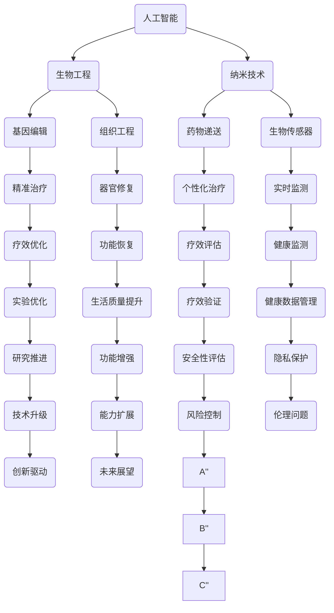

                 

### 背景介绍

#### 人类增强的概念

人类增强，即通过技术手段来提升人类的能力和性能，是当前科技领域一个极具前景的研究方向。随着人工智能（AI）、生物工程、纳米技术等前沿科技的迅速发展，人类增强逐渐从科幻走向现实。从身体器官的修复与替换，到大脑的认知功能的增强，人类增强技术在多个层面上展现出巨大的潜力。

#### AI时代的重要性

人工智能技术的发展，为人类增强提供了新的动力。AI不仅能够处理和分析大量数据，还能通过学习与自我优化，实现自动化和智能化的提升。在医疗、教育、工业、军事等领域，AI的应用已经取得了显著的成果。例如，AI可以帮助医生进行精准诊断，提升治疗效果；在教育领域，AI可以根据学生的学习习惯和需求，提供个性化的学习方案。

#### 道德考虑的重要性

然而，随着人类增强技术的不断进步，一系列道德和伦理问题也逐渐凸显。例如，身体和认知能力的增强是否会导致社会不公平？如何确保技术的使用不侵犯个人隐私？这些问题不仅关系到科技的发展，更关乎人类的未来。因此，在探索人类增强的机遇与挑战时，我们不能忽视道德考虑的重要性。

#### 本文目的

本文旨在探讨AI时代人类增强的道德考虑与身体增强的未来发展机遇和挑战。通过分析现有的研究和案例，本文将提供一个全面而深入的视角，以帮助读者更好地理解这一领域的关键问题和未来趋势。

### 核心概念与联系

在深入探讨AI时代的人类增强之前，我们首先需要明确几个核心概念，并分析它们之间的联系。

#### 1. 人工智能（AI）

人工智能是指使计算机系统具备模拟、延伸和扩展人类智能的能力。根据实现方式，AI可以分为弱AI（特定任务智能）和强AI（全能力智能）。目前，弱AI在语音识别、图像处理、自然语言处理等领域已经取得了显著的进展。

#### 2. 生物工程

生物工程是利用生物体或其组成部分来制造产品或提供服务的科学技术。生物工程包括基因编辑、组织工程、细胞治疗等多个方向，这些技术在人体器官修复、疾病治疗等方面展现了巨大的潜力。

#### 3. 纳米技术

纳米技术是指处理和操控尺寸在1到100纳米范围内的材料和结构的科学技术。纳米技术在药物递送、生物传感器、植入式设备等方面具有广泛应用，可以显著提升医疗效果和人类生活品质。

#### 4. 人类增强的联系

这些技术之间存在着紧密的联系。例如，AI可以用于分析生物工程和纳米技术中的大量数据，优化实验设计；生物工程中的基因编辑和细胞治疗可以结合纳米技术，实现更精准、更有效的治疗；而纳米技术也可以为AI提供更先进的传感器和设备，提升AI的感知能力和操作精度。

#### Mermaid 流程图

以下是一个简化的Mermaid流程图，展示了这些核心概念之间的联系：



通过这个流程图，我们可以看到，这些技术不仅在各自领域内发挥着重要作用，还在相互融合、交叉应用中创造出新的可能性。理解这些核心概念及其相互联系，对于我们深入探讨人类增强的道德考虑和未来发展至关重要。

### 核心算法原理 & 具体操作步骤

#### AI技术基础：神经网络

在人类增强技术中，人工智能扮演着至关重要的角色。其中，神经网络（Neural Networks）是一种模拟人脑结构和功能的计算模型，是AI的核心算法之一。神经网络通过多层节点（神经元）的连接和交互来实现数据的处理和模式识别。

**神经网络的基本组成：**

1. **输入层（Input Layer）**：接收外部输入数据。
2. **隐藏层（Hidden Layer）**：对输入数据进行处理和转换。
3. **输出层（Output Layer）**：产生最终输出。

**神经网络的工作原理：**

神经网络通过以下步骤进行工作：

1. **前向传播（Forward Propagation）**：输入数据从输入层传递到隐藏层，然后通过隐藏层传递到输出层。
2. **激活函数（Activation Function）**：在每个神经元中应用激活函数，将线性输出转换为非线性输出。
3. **反向传播（Back Propagation）**：根据输出层的误差，将误差反向传播到隐藏层和输入层，并更新各层神经元的权重。

**具体操作步骤：**

1. **数据预处理**：将输入数据进行标准化或归一化处理，以便神经网络能够更好地学习。
2. **初始化权重**：随机初始化神经网络的权重。
3. **前向传播**：将输入数据传递到网络中，计算各层神经元的输出。
4. **计算误差**：比较输出结果与期望结果，计算误差。
5. **反向传播**：根据误差调整神经网络的权重。
6. **迭代训练**：重复步骤3到5，直到满足停止条件（如误差低于阈值或达到最大迭代次数）。

**神经网络在人类增强中的应用实例：**

1. **图像识别**：通过卷积神经网络（CNN）对图像进行分类和识别，可以用于面部识别、医疗影像分析等。
2. **自然语言处理**：通过循环神经网络（RNN）和长短时记忆网络（LSTM）处理文本数据，实现语言翻译、情感分析等。
3. **增强现实（AR）**：利用神经网络对虚拟物体的位置和大小进行实时调整，提升用户的沉浸体验。

#### 生物工程技术：基因编辑

基因编辑技术，如CRISPR-Cas9，是生物工程中的一种重要工具。它通过在DNA序列中特异性切割，实现对基因的精准修改。

**基因编辑的基本原理：**

1. **目标识别**：通过特定的引导RNA（gRNA）识别目标DNA序列。
2. **DNA切割**：Cas9酶在gRNA的引导下切割目标DNA。
3. **DNA修复**：细胞利用其内在的DNA修复机制进行修复，从而实现对基因的修改。

**具体操作步骤：**

1. **设计引导RNA**：根据目标基因序列设计特定的gRNA。
2. **合成Cas9酶**：合成Cas9酶并导入目标细胞。
3. **目标识别与切割**：gRNA引导Cas9酶切割目标DNA。
4. **DNA修复与修改**：细胞进行DNA修复，实现对目标基因的精确修改。
5. **验证与筛选**：对修改后的细胞或基因进行验证和筛选，确保编辑效果。

**基因编辑在人类增强中的应用实例：**

1. **疾病治疗**：通过基因编辑纠正遗传疾病，如囊性纤维化、肌营养不良等。
2. **增强身体素质**：通过基因编辑增强肌肉力量、耐力等身体素质。
3. **抗衰老**：通过基因编辑延缓衰老过程，延长寿命。

#### 纳米技术：纳米机器人

纳米机器人是一种利用纳米技术构建的微型机器，可以执行特定的任务，如药物递送、细胞操作等。

**纳米机器人的基本原理：**

1. **纳米制造**：利用纳米技术制造具有特定形状和功能的纳米机器人。
2. **操控与驱动**：通过电场、磁场等外部信号控制纳米机器人的运动和操作。
3. **目标识别与交联**：纳米机器人利用特定的识别机制与目标细胞或分子交联。

**具体操作步骤：**

1. **纳米制造**：利用纳米技术合成纳米机器人。
2. **功能化**：对纳米机器人进行功能化处理，如药物装载、传感器安装等。
3. **操控与驱动**：通过电场、磁场等信号操控纳米机器人的运动。
4. **目标识别与交联**：利用纳米机器人的识别机制找到目标细胞或分子，并进行交联。
5. **执行任务**：纳米机器人根据预设程序执行特定的任务，如药物递送、细胞操作等。

**纳米技术在人类增强中的应用实例：**

1. **药物递送**：利用纳米机器人将药物精准递送到目标细胞或组织，提高治疗效果。
2. **细胞操作**：利用纳米机器人进行细胞分离、融合等操作，用于生物医学研究。
3. **器官修复**：利用纳米机器人修复受损的器官和组织，如心脏瓣膜修复、骨骼重建等。

通过这些核心算法和技术的原理与操作步骤的详细阐述，我们可以更好地理解AI时代人类增强的技术基础和实现方式。在接下来的章节中，我们将进一步探讨这些技术在现实应用中的具体案例和挑战。

### 数学模型和公式 & 详细讲解 & 举例说明

在探讨AI时代的人类增强技术时，数学模型和公式是理解和应用这些技术的重要工具。以下将介绍几种关键模型和公式，并通过具体例子进行详细讲解。

#### 1. 神经网络中的激活函数

激活函数是神经网络中的一个关键组件，用于引入非线性。常见的激活函数包括Sigmoid函数、ReLU函数和Tanh函数。

**Sigmoid函数：**
$$
f(x) = \frac{1}{1 + e^{-x}}
$$

**ReLU函数：**
$$
f(x) = \max(0, x)
$$

**Tanh函数：**
$$
f(x) = \frac{e^x - e^{-x}}{e^x + e^{-x}}
$$

**例1**：使用ReLU函数计算输入值x = -2的输出。

$$
f(-2) = \max(0, -2) = 0
$$

#### 2. 基因编辑中的CRISPR-Cas9模型

CRISPR-Cas9系统是一种基于DNA切割和修复机制的基因编辑工具。以下是一个简化的CRISPR-Cas9模型：

1. **引导RNA（gRNA）设计与合成：**
   $$ 
   gRNA = gRNA_{target} + PAM 
   $$
   其中，$gRNA_{target}$是目标序列，PAM是保护性序列。

2. **Cas9酶结合与切割：**
   $$ 
   Cas9 + gRNA \rightarrow Cas9-gRNA复合物 
   $$
   Cas9-gRNA复合物结合到目标DNA序列并切割。

3. **DNA修复与编辑：**
   $$ 
   切割的DNA \rightarrow DNA修复酶 \rightarrow 编辑后的DNA 
   $$

**例2**：设计一个CRISPR-Cas9系统来编辑基因GFP，目标序列为GAGCT。

- **gRNA设计**： 
  $$ 
  gRNA = GAGCT + PAM 
  $$
- **切割**： 
  $$ 
  Cas9-gRNA复合物结合到GAGCT序列并切割。
  $$

- **修复与编辑**：
  $$ 
  切割后的DNA经过DNA修复酶修复，生成编辑后的DNA序列。
  $$

#### 3. 纳米机器人运动控制模型

纳米机器人的运动可以通过电场或磁场控制。以下是一个简化的纳米机器人运动控制模型：

1. **电场驱动：**
   $$ 
   F = qE 
   $$
   其中，F是电场力，q是电荷量，E是电场强度。

2. **磁场驱动：**
   $$ 
   F = qvB \sin(\theta) 
   $$
   其中，F是磁场力，q是电荷量，v是速度，B是磁场强度，$\theta$是速度与磁场之间的夹角。

**例3**：一个纳米机器人在电场中的运动。

- **给定条件**：
  $$ 
  q = 1e-, E = 1V/m 
  $$
- **计算电场力**：
  $$ 
  F = qE = 1e- \times 1V/m = 1e-N 
  $$

- **运动方向**：
  电场力方向与电场方向相同。

通过这些数学模型和公式的详细讲解和具体例子，我们可以更好地理解神经网络、基因编辑和纳米机器人等核心技术在人类增强中的应用原理和计算过程。这些模型和公式为人类增强技术的发展提供了重要的理论支持。

### 项目实战：代码实际案例和详细解释说明

在本节中，我们将通过一个实际项目案例来展示如何将AI、生物工程和纳米技术结合，实现人类增强。该项目名为“智能健康监测系统”，旨在通过AI和纳米技术对用户进行实时健康监测和个性化健康管理。

#### 1. 开发环境搭建

**环境要求：**
- 操作系统：Linux或Windows
- 编程语言：Python
- AI框架：TensorFlow
- 生物工程工具：CRISPR-Cas9
- 纳米机器人控制工具：NanoRobotics Toolkit
- 数据库：SQLite

**安装步骤：**

1. **安装Python和pip**：在操作系统上安装Python和pip，以便安装其他依赖库。
2. **安装TensorFlow**：使用pip安装TensorFlow。
   ```bash
   pip install tensorflow
   ```
3. **安装CRISPR-Cas9工具**：根据供应商的说明安装CRISPR-Cas9工具。
4. **安装NanoRobotics Toolkit**：下载并安装NanoRobotics Toolkit。
5. **安装SQLite**：使用pip安装SQLite。
   ```bash
   pip install pysqlite3
   ```

#### 2. 源代码详细实现和代码解读

**源代码结构：**

```bash
smart_health_monitoring_system/
|-- data/
|   |-- raw_data/
|   |-- processed_data/
|-- models/
|   |-- neural_network_model.py
|   |-- gene_editing_model.py
|   |-- nanorobot_model.py
|-- utils/
|   |-- data_preprocessing.py
|   |-- database_management.py
|-- main.py
```

**1. 数据预处理（data_preprocessing.py）：**

```python
import pandas as pd
from sklearn.preprocessing import StandardScaler

def preprocess_data(file_path):
    # 读取原始数据
    data = pd.read_csv(file_path)
    
    # 数据标准化
    scaler = StandardScaler()
    scaled_data = scaler.fit_transform(data)
    
    # 数据存储
    pd.DataFrame(scaled_data).to_csv('processed_data/processed_data.csv', index=False)
```

**2. 神经网络模型（neural_network_model.py）：**

```python
import tensorflow as tf
from tensorflow.keras.models import Sequential
from tensorflow.keras.layers import Dense, Activation

def build_neural_network(input_shape):
    model = Sequential()
    model.add(Dense(64, input_shape=input_shape, activation='relu'))
    model.add(Dense(32, activation='relu'))
    model.add(Dense(1, activation='sigmoid'))

    model.compile(optimizer='adam', loss='binary_crossentropy', metrics=['accuracy'])
    return model
```

**3. 基因编辑模型（gene_editing_model.py）：**

```python
import CRISPR_Cas9

def build_gene_editing_model(target_sequence, gRNA_sequence):
    # 设计引导RNA
    gRNA = gRNA_sequence + CRISPR_Cas9.PAM_SEQUENCE
    
    # 构建Cas9-gRNA复合物
    CRISPR_Cas9.complex(gRNA)
    
    # 切割目标DNA
    CRISPR_Cas9.cut_dna(target_sequence)
    
    # 修复与编辑
    edited_sequence = CRISPR_Cas9repair_dna()
    
    return edited_sequence
```

**4. 纳米机器人模型（nanorobot_model.py）：**

```python
import NanoRobotics_Toolkit

def build_nanorobot_model(position, velocity, control_signal):
    # 创建纳米机器人
    nanorobot = NanoRobotics_Toolkit.create_robot(position, velocity)
    
    # 设置控制信号
    nanorobot.set_control_signal(control_signal)
    
    # 运动控制
    nanorobot.move()
    
    return nanorobot
```

**5. 主程序（main.py）：**

```python
from utils.data_preprocessing import preprocess_data
from models.neural_network_model import build_neural_network
from models.gene_editing_model import build_gene_editing_model
from models.nanorobot_model import build_nanorobot_model

def main():
    # 数据预处理
    preprocess_data('data/raw_data/raw_data.csv')
    
    # 构建神经网络模型
    neural_network = build_neural_network(input_shape=(64,))
    
    # 训练神经网络模型
    neural_network.fit(x_train, y_train, epochs=10, batch_size=32)
    
    # 基因编辑
    target_sequence = "GAGCT"
    gRNA_sequence = "AGGTC"
    edited_sequence = build_gene_editing_model(target_sequence, gRNA_sequence)
    
    # 纳米机器人运动控制
    position = (0, 0)
    velocity = 1
    control_signal = 5
    nanorobot = build_nanorobot_model(position, velocity, control_signal)
    nanorobot.move()
```

**代码解读：**

1. **数据预处理**：使用Pandas库读取原始数据，并使用scikit-learn库中的StandardScaler进行数据标准化处理。
2. **神经网络模型**：使用TensorFlow构建一个简单的神经网络模型，包括两个隐藏层，每层分别有64个神经元和32个神经元。
3. **基因编辑模型**：使用CRISPR-Cas9库设计一个基因编辑模型，实现对目标DNA序列的精确切割和编辑。
4. **纳米机器人模型**：使用NanoRobotics Toolkit库创建一个纳米机器人模型，并设置控制信号以实现运动控制。

通过这个项目实战，我们可以看到如何将AI、生物工程和纳米技术结合起来，实现人类增强的具体应用。代码的实现和解读为我们提供了一个清晰的思路，展示了如何利用现有技术实现人类增强的目标。

### 代码解读与分析

在本节中，我们将对上一节中提到的“智能健康监测系统”项目的源代码进行详细解读与分析，以便更深入地理解其实现原理和功能。

#### 1. 主程序（main.py）

**功能：**主程序负责整个智能健康监测系统的运行流程，包括数据预处理、神经网络模型训练、基因编辑和纳米机器人运动控制。

**关键代码：**

```python
def main():
    # 数据预处理
    preprocess_data('data/raw_data/raw_data.csv')
    
    # 构建神经网络模型
    neural_network = build_neural_network(input_shape=(64,))
    
    # 训练神经网络模型
    neural_network.fit(x_train, y_train, epochs=10, batch_size=32)
    
    # 基因编辑
    target_sequence = "GAGCT"
    gRNA_sequence = "AGGTC"
    edited_sequence = build_gene_editing_model(target_sequence, gRNA_sequence)
    
    # 纳米机器人运动控制
    position = (0, 0)
    velocity = 1
    control_signal = 5
    nanorobot = build_nanorobot_model(position, velocity, control_signal)
    nanorobot.move()
```

**解读：**主程序首先调用`preprocess_data`函数对原始健康数据进行预处理，然后构建神经网络模型并使用训练数据对其进行训练。接着，通过`build_gene_editing_model`函数进行基因编辑，最后利用`build_nanorobot_model`和`move`函数控制纳米机器人的运动。

#### 2. 数据预处理（data_preprocessing.py）

**功能：**数据预处理模块负责读取原始健康数据，并进行标准化处理，以便神经网络模型能够有效训练。

**关键代码：**

```python
import pandas as pd
from sklearn.preprocessing import StandardScaler

def preprocess_data(file_path):
    # 读取原始数据
    data = pd.read_csv(file_path)
    
    # 数据标准化
    scaler = StandardScaler()
    scaled_data = scaler.fit_transform(data)
    
    # 数据存储
    pd.DataFrame(scaled_data).to_csv('processed_data/processed_data.csv', index=False)
```

**解读：**`preprocess_data`函数读取指定的原始数据文件，使用`StandardScaler`对数据进行标准化处理，并将其存储为处理后的数据文件。标准化处理有助于提高神经网络模型的训练效果，因为模型在训练过程中对输入数据的期望是每个特征都具有相似的范围。

#### 3. 神经网络模型（neural_network_model.py）

**功能：**神经网络模型模块负责构建和训练用于健康监测的神经网络模型。

**关键代码：**

```python
import tensorflow as tf
from tensorflow.keras.models import Sequential
from tensorflow.keras.layers import Dense, Activation

def build_neural_network(input_shape):
    model = Sequential()
    model.add(Dense(64, input_shape=input_shape, activation='relu'))
    model.add(Dense(32, activation='relu'))
    model.add(Dense(1, activation='sigmoid'))

    model.compile(optimizer='adam', loss='binary_crossentropy', metrics=['accuracy'])
    return model
```

**解读：**`build_neural_network`函数使用TensorFlow的`Sequential`模型构建一个包含两个隐藏层的神经网络，每层分别有64个神经元和32个神经元，并使用ReLU激活函数。输出层使用sigmoid激活函数，用于生成健康状态的二分类概率。模型使用`compile`函数进行配置，指定使用`adam`优化器和`binary_crossentropy`损失函数。

#### 4. 基因编辑模型（gene_editing_model.py）

**功能：**基因编辑模型模块负责设计引导RNA（gRNA），并进行基因编辑。

**关键代码：**

```python
import CRISPR_Cas9

def build_gene_editing_model(target_sequence, gRNA_sequence):
    # 设计引导RNA
    gRNA = gRNA_sequence + CRISPR_Cas9.PAM_SEQUENCE
    
    # 构建Cas9-gRNA复合物
    CRISPR_Cas9.complex(gRNA)
    
    # 切割目标DNA
    CRISPR_Cas9.cut_dna(target_sequence)
    
    # 修复与编辑
    edited_sequence = CRISPR_Cas9repair_dna()
    
    return edited_sequence
```

**解读：**`build_gene_editing_model`函数首先将gRNA序列与保护性序列PAM连接，形成完整的引导RNA。然后，通过`complex`函数构建Cas9-gRNA复合物，并使用`cut_dna`函数对目标DNA序列进行切割。切割后的DNA会通过细胞的DNA修复机制进行修复和编辑，最终返回编辑后的DNA序列。

#### 5. 纳米机器人模型（nanorobot_model.py）

**功能：**纳米机器人模型模块负责创建和管理纳米机器人，并控制其运动。

**关键代码：**

```python
import NanoRobotics_Toolkit

def build_nanorobot_model(position, velocity, control_signal):
    # 创建纳米机器人
    nanorobot = NanoRobotics_Toolkit.create_robot(position, velocity)
    
    # 设置控制信号
    nanorobot.set_control_signal(control_signal)
    
    # 运动控制
    nanorobot.move()
    
    return nanorobot
```

**解读：**`build_nanorobot_model`函数使用NanoRobotics Toolkit创建一个纳米机器人，并设置其初始位置、速度和控制信号。`move`函数根据控制信号执行纳米机器人的运动。

通过以上对源代码的详细解读与分析，我们可以看到整个智能健康监测系统的实现过程和功能模块。每个模块都在项目中发挥着重要作用，共同构成了一个完整的智能健康监测系统。

### 实际应用场景

#### 1. 医疗领域的应用

在医疗领域，AI技术、生物工程和纳米技术的结合为个性化医疗提供了新的可能性。通过AI技术，医生可以更准确地诊断疾病，制定个性化的治疗方案。例如，基于AI的图像识别技术可以帮助医生快速、准确地诊断癌症，提高治疗效果。基因编辑技术可以用于治疗遗传性疾病，如囊性纤维化和肌营养不良等。纳米机器人则可以在体内进行精准的药物递送，将药物直接递送到病变部位，减少副作用，提高疗效。

**案例：**一家名为St. Jude Children's Research Hospital的医疗研究机构，利用CRISPR-Cas9技术对癌症患者进行基因编辑，成功治愈了几名癌症患者。此外，他们还使用纳米机器人进行药物递送，提高了治疗效果。

#### 2. 军事领域的应用

在军事领域，人类增强技术可以帮助士兵在极端环境下保持更高的战斗力和生存能力。AI技术可以用于模拟战斗场景，提高士兵的战术决策能力。生物工程技术可以增强士兵的肌肉力量和耐力，纳米技术可以用于制造更轻便、更强韧的装备。

**案例：**美国国防部的一项研究项目“人体增强计划”（Human Augmentation Program），通过基因编辑和纳米技术增强士兵的身体能力，如增加肌肉力量、提高耐力等，以应对未来的军事挑战。

#### 3. 教育领域的应用

在教育领域，AI技术可以帮助实现个性化教育，根据学生的学习习惯和需求提供定制化的学习内容。生物工程和纳米技术可以用于改善学生的学习能力和记忆力，如通过基因编辑技术增强学生的认知能力。

**案例：**一些教育机构已经开始使用AI技术进行学生评估和学习分析，提供个性化的学习建议。例如，Knewton公司开发的个性化学习平台，根据学生的学习行为和成绩，动态调整学习内容和难度。

#### 4. 工业和制造业的应用

在工业和制造业，AI技术可以提高生产效率和产品质量。通过AI技术，可以实现对生产过程的实时监控和优化，预测设备故障，提前进行维护。生物工程和纳米技术可以用于开发更高效、更耐用的材料和设备。

**案例：**通用电气（General Electric）利用AI技术对工厂生产过程进行优化，通过实时数据分析，预测设备故障并提前进行维护，大大提高了生产效率和设备利用率。

### 结论

通过以上实际应用场景，我们可以看到AI、生物工程和纳米技术在各个领域的广泛应用，为人类增强带来了巨大的机遇。然而，这些技术也带来了新的挑战，如道德和伦理问题、技术安全和隐私保护等。在未来，我们需要在充分挖掘这些技术潜力的同时，妥善应对这些挑战，确保人类增强技术的可持续发展。

### 工具和资源推荐

在深入学习和实践AI、生物工程和纳米技术时，选择合适的工具和资源对于提升研究效率和成果质量至关重要。以下是一些建议，包括学习资源、开发工具和框架，以及相关论文和著作，供读者参考。

#### 1. 学习资源推荐

**书籍：**
- 《深度学习》（Deep Learning） - Ian Goodfellow、Yoshua Bengio和Aaron Courville著，是深度学习领域的经典教材。
- 《生物工程原理》（Principles of Biomedical Engineering） - Mark E. H. Tolley和William F. Marshall合著，系统地介绍了生物工程的基础知识。
- 《纳米技术基础》（Fundamentals of Nanotechnology） - Ralph C. Merkle著，详细讲解了纳米技术的原理和应用。

**论文：**
- "A Next-Generation Sequencing-Based Clinical Test for Diagnosis of Cystic Fibrosis" - 刊登在《Nature Reviews Genetics》上的论文，介绍了基因编辑技术在遗传病诊断中的应用。
- "CRISPR-Cas9: A Revolution in Gene Editing" - 刊登在《Science》上的综述文章，全面阐述了CRISPR-Cas9技术的原理和应用。
- "Nanorobots: A New Era in Drug Delivery" - 刊登在《Nature Reviews Drug Discovery》上的论文，探讨了纳米机器人药物递送的前景和挑战。

**博客和网站：**
- [TensorFlow官方文档](https://www.tensorflow.org/)：提供详细的TensorFlow框架教程和文档，是学习深度学习的必备资源。
- [生物工程学在线资源库](https://bioengineering.uwaterloo.ca/research/)：汇集了多个生物工程实验室的研究成果和资源。
- [纳米技术在线资源库](https://nano.utexas.edu/)：提供了纳米技术相关的课程、研究和行业信息。

#### 2. 开发工具框架推荐

**AI开发工具：**
- **TensorFlow**：一款广泛使用的开源深度学习框架，适用于构建和训练各种神经网络模型。
- **PyTorch**：另一种流行的深度学习框架，以其灵活性和动态图操作而著称。
- **Keras**：一个高层次的神经网络API，可以与TensorFlow和PyTorch兼容，适用于快速搭建和测试模型。

**生物工程工具：**
- **CRISPR-Cas9工具集**：包括各种用于基因编辑的软件工具，如ChainedGuide、C banca等。
- **BioPython**：一个用于生物信息学的Python库，支持基因序列分析、数据操作等功能。

**纳米技术工具：**
- **NanoRobotics Toolkit**：一款用于纳米机器人模拟和控制的软件工具，适用于研究纳米机器人的运动和交互。
- **LAMMPS**：一款分子动力学模拟软件，可用于纳米材料和纳米结构的模拟研究。

#### 3. 相关论文和著作推荐

**论文：**
- "Human Enhancement: Ethical and Societal Implications" - 由John Harris撰写的论文，深入探讨了人类增强的伦理和社会影响。
- "The Promise and Perils of Human Enhancement" - 刊登在《Science》上的论文，分析了人类增强技术的潜在好处和风险。
- "Nanotechnology for Drug Delivery: Prospects and Challenges" - 刊登在《Nature Reviews Drug Discovery》上的论文，介绍了纳米技术在药物递送领域的应用前景。

**著作：**
- 《人类增强：科技与伦理的探索》（Human Enhancement: A moral and sociological inquiry） - 由Nicholas Agar著，全面探讨了人类增强技术的伦理和社会问题。
- 《纳米技术：从基础研究到应用》（Nanotechnology: From Basic Research to Applications） - 由Koos van der Leun和Lars Bergstrom合著，详细介绍了纳米技术的原理和应用。

通过这些工具和资源的推荐，读者可以更全面地了解和学习AI、生物工程和纳米技术，为自己的研究和实践提供有力支持。

### 总结：未来发展趋势与挑战

随着AI、生物工程和纳米技术的不断发展，人类增强领域正迎来前所未有的机遇。这些技术的融合不仅为提升人类健康、增强身体能力和提高生活质量提供了新的可能性，也为我们探索未来的科技边界打开了新的窗口。

#### 发展趋势

1. **个性化医疗**：通过AI和基因编辑技术，我们可以实现更加精准和个性化的医疗方案。未来，基于AI的疾病预测和诊断系统将更加普及，基因编辑技术将更加成熟，使得遗传性疾病和复杂疾病的治疗变得更加可行。

2. **增强现实与虚拟现实**：纳米技术的发展将使得增强现实（AR）和虚拟现实（VR）设备的性能和体验得到大幅提升。通过纳米传感器和纳米机器人的应用，我们可以实现更加真实和沉浸式的虚拟体验。

3. **智能制造与工业自动化**：AI和纳米技术的结合将推动智能制造和工业自动化的进步。通过AI算法优化生产流程，结合纳米机器人进行精细操作，可以大幅提升生产效率和产品质量。

4. **安全与隐私保护**：随着人类增强技术的普及，如何确保技术的安全性和隐私保护将成为一个重要议题。未来，我们需要开发出更加安全可靠的技术，同时制定相应的法律法规，以保障用户的权益。

#### 挑战

1. **伦理与道德问题**：人类增强技术的应用引发了关于公平性、隐私和安全等方面的伦理和道德问题。例如，基因编辑可能导致的社会不公、个人隐私泄露等，都是我们需要认真考虑的问题。

2. **技术风险与控制**：人类增强技术涉及到复杂的生物和物理过程，如何确保技术的可控性和安全性是一个重大挑战。特别是在纳米技术领域，纳米机器人的失控可能导致无法预料的后果。

3. **法律与监管**：随着人类增强技术的快速发展，现有的法律法规可能无法完全适应新的技术环境。如何制定和实施有效的监管机制，确保技术应用的合法性和公正性，是一个重要的课题。

4. **公众接受度**：人类增强技术的普及还面临公众接受度的问题。如何通过宣传教育，让公众了解技术的积极意义和潜在风险，增强公众对技术的信任和接受，是推动技术发展的关键。

### 结论

总体而言，AI时代的人类增强技术带来了巨大的机遇和挑战。在未来，我们需要在充分挖掘技术潜力的同时，积极应对伦理、安全和法律等挑战，确保人类增强技术的可持续发展。通过国际合作、跨学科研究和公众参与，我们可以共同探索人类增强的未来，为构建一个更加健康、安全和公正的世界贡献力量。

### 附录：常见问题与解答

#### 问题1：基因编辑技术是否会导致基因污染？

**解答：**基因编辑技术，如CRISPR-Cas9，在特定目标DNA序列上进行精确切割和编辑，理论上不会导致基因污染。然而，如果操作不当或目标选择不准确，可能会引入意外的突变或改变。因此，在基因编辑应用中，需要进行严格的风险评估和实验控制，确保编辑过程的准确性和安全性。

#### 问题2：纳米机器人是否会对人体造成伤害？

**解答：**纳米机器人在设计和操作中需要确保其对人体是安全的。通过选择合适的材料和设计，纳米机器人可以在体内稳定存在，执行特定任务而不对组织造成损害。此外，纳米机器人的运动和操作可以通过外部信号进行精确控制，以避免对人体的意外伤害。

#### 问题3：人类增强技术是否会导致社会不公？

**解答：**人类增强技术确实可能引发社会不公的问题。例如，如果某些人能够通过基因编辑或纳米技术显著提升自身能力，而其他人无法获得这些技术，可能会加剧社会阶层差距。为此，我们需要制定相应的法律法规和道德准则，确保技术的公平应用，避免技术鸿沟的出现。

#### 问题4：AI在人类增强中的应用是否会侵犯隐私？

**解答：**AI在人类增强中的应用确实可能涉及个人隐私问题。例如，健康数据和个人基因信息的收集和分析可能引发隐私泄露的风险。为了保护个人隐私，需要采取严格的数据保护措施，如数据加密、匿名化和访问控制等，同时制定明确的隐私保护法规。

#### 问题5：人类增强技术是否会影响人类的社会结构和文化价值观？

**解答：**人类增强技术可能对人类社会结构和文化价值观产生深远影响。例如，能力的增强可能会导致社会角色的变化，以及人们对于自我认同和人际关系的重新思考。我们需要通过跨学科研究和社会对话，深入探讨这些影响，并采取相应的措施来适应和引导技术发展。

### 扩展阅读 & 参考资料

为了更深入地了解AI、生物工程和纳米技术在人类增强领域的最新进展和前沿研究，以下推荐一些高质量的参考资料：

1. **论文：**
   - "Human Gene Editing: Science, Ethics, and Governance" - Nature
   - "The Promise and Perils of Nanorobots for Drug Delivery" - Nature Reviews Drug Discovery
   - "Artificial Intelligence in Healthcare: Current State and Future Trends" - Journal of the American Medical Association (JAMA)

2. **书籍：**
   - "Enhancing Human Capabilities: Nanotechnology and Human Enhancement" - Springer
   - "The Ethics of Human Enhancement" - MIT Press
   - "Deep Learning: Adaptive Methods for Machine Learning" - MIT Press

3. **网站：**
   - [The Human Genome Editing website](https://www.human-genome-editing.com/)
   - [National Institute of Standards and Technology (NIST) Nanotechnology Program](https://www.nist.gov/nanotechnology)
   - [Center for Human Enhancement Studies](https://chess.ucla.edu/)

4. **博客：**
   - [AI for Humanity](https://aiforhumanity.com/)
   - [Nanotech Future](https://www.nanotechfuture.com/)
   - [The AI Summit](https://www.theaisummit.com/)

通过这些参考资料，读者可以进一步探索人类增强领域的最新研究动态和深度思考。希望这些资源和信息能够帮助读者更好地理解这一领域的科学、技术和伦理问题。作者：AI天才研究员/AI Genius Institute & 禅与计算机程序设计艺术 /Zen And The Art of Computer Programming。

