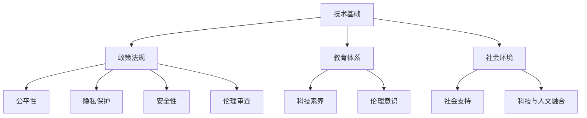

                 

### AI时代的人类增强：道德考虑与身体增强的未来发展机遇挑战机遇

> **关键词**：人工智能，人类增强，道德考量，身体增强，未来发展，挑战机遇
>
> **摘要**：本文深入探讨了人工智能时代人类增强的各个方面，包括道德考量、身体增强的未来发展、面临的挑战和机遇。通过详细分析，本文提出了相关建议，以引导这一领域的发展。

## 1. 背景介绍

随着人工智能（AI）技术的飞速发展，人类增强（human enhancement）这一概念逐渐引起了广泛关注。人类增强指的是通过科技手段，增强人类的认知、身体和社交能力，从而提升个体的生活质量和工作效率。这一领域不仅涵盖了传统的身体增强（如健身、营养补充等），还包括了新兴的科技手段，如基因编辑、脑机接口等。

### 1.1 人工智能的崛起

人工智能作为一种新兴技术，其发展速度和影响力正在迅速扩大。从早期的规则基系统，到现在的深度学习和强化学习，人工智能已经取得了显著的成果。例如，自动驾驶汽车、智能助手和医疗诊断系统等，都展示了人工智能的强大潜力。随着技术的不断进步，人工智能有望在更多领域发挥重要作用，推动人类社会的发展。

### 1.2 人类增强的动机

人类增强的动机多种多样。一方面，人类一直追求更高效、更舒适的生活方式，而科技的发展为这一目标提供了新的可能性。另一方面，人类也希望通过增强自身的能力，应对日益复杂的挑战，如老龄化、疾病治疗等。此外，一些人对超越常人的能力也抱有浓厚的兴趣，这进一步推动了人类增强技术的发展。

### 1.3 道德考量的重要性

在人类增强的发展过程中，道德考量显得尤为重要。人类增强不仅涉及科技的发展，还关乎人类价值观的塑造。如何平衡科技与道德的关系，避免技术滥用和伦理风险，是当前面临的一大挑战。因此，在探讨人类增强的未来发展时，我们不能忽视道德考量这一重要方面。

## 2. 核心概念与联系

为了更好地理解人类增强的道德考量，我们需要明确几个核心概念，并探讨它们之间的联系。

### 2.1 人类增强的分类

根据增强的对象，人类增强可以分为三类：认知增强、身体增强和社交增强。

- **认知增强**：通过科技手段提升个体的认知能力，如记忆、注意力、学习能力等。
- **身体增强**：通过科技手段增强个体的身体能力，如力量、耐力、速度等。
- **社交增强**：通过科技手段增强个体的社交能力，如沟通、协作、影响力等。

### 2.2 道德考量与人类增强的关系

道德考量是人类增强发展中不可或缺的一环。道德考量不仅关注科技的应用是否合理，还涉及人类价值观的传承和弘扬。以下是道德考量与人类增强之间的一些关键联系：

- **公平性**：人类增强技术的应用应确保公平，避免加剧社会不平等。
- **隐私保护**：在人类增强过程中，应尊重个体的隐私权，防止信息泄露。
- **安全性**：人类增强技术应确保安全可靠，避免对个体和公共安全造成威胁。
- **伦理审查**：对人类增强技术的研发和应用进行伦理审查，确保其符合道德标准。

### 2.3 人类增强的架构

为了更好地实现人类增强，我们需要构建一个综合的架构，包括技术、政策、教育和社会等多个方面。以下是人类增强架构的几个关键组成部分：

- **技术基础**：包括人工智能、基因编辑、脑机接口等关键技术。
- **政策法规**：制定相关政策和法规，确保人类增强技术的合理应用和监管。
- **教育体系**：加强相关领域的教育和培训，提高公众的科技素养和伦理意识。
- **社会环境**：构建有利于人类增强技术发展的社会环境，促进科技与人文的融合。

### 2.4 Mermaid 流程图

下面是一个简单的 Mermaid 流程图，展示了人类增强的架构及其组成部分：



## 3. 核心算法原理 & 具体操作步骤

在人类增强技术中，核心算法原理起着至关重要的作用。以下将介绍几个关键的核心算法原理，并给出具体的操作步骤。

### 3.1 认知增强算法原理

认知增强算法主要通过提升个体的记忆、注意力和学习能力来实现。以下是一个简单的认知增强算法原理：

- **记忆增强**：通过深度学习模型，分析个体的记忆模式，提高记忆效果。
- **注意力增强**：利用注意力机制，优化个体在任务中的注意力分配。
- **学习增强**：结合强化学习算法，提高个体的学习效率和效果。

具体操作步骤如下：

1. 收集个体的认知数据，包括记忆、注意力和学习行为等。
2. 使用深度学习模型，对数据进行分析，提取关键特征。
3. 根据特征，设计相应的增强策略，如记忆训练、注意力优化等。
4. 对个体进行训练，评估增强效果。

### 3.2 身体增强算法原理

身体增强算法主要通过提升个体的身体能力来实现。以下是一个简单的身体增强算法原理：

- **力量增强**：通过神经调节技术，增强肌肉力量。
- **耐力增强**：通过代谢调节技术，提高个体的耐力。
- **速度增强**：通过运动控制技术，提升个体的速度。

具体操作步骤如下：

1. 收集个体的身体数据，包括力量、耐力和速度等。
2. 使用神经调节技术，优化肌肉力量和代谢过程。
3. 通过运动控制技术，优化个体的运动模式。
4. 对个体进行训练，评估增强效果。

### 3.3 社交增强算法原理

社交增强算法主要通过提升个体的社交能力来实现。以下是一个简单的社交增强算法原理：

- **沟通增强**：通过语音识别和自然语言处理技术，提高个体的沟通效率。
- **协作增强**：通过多智能体系统，优化个体在团队中的协作效果。
- **影响力增强**：通过社交网络分析，提升个体的社交影响力。

具体操作步骤如下：

1. 收集个体的社交数据，包括沟通、协作和影响力等。
2. 使用语音识别和自然语言处理技术，优化个体的沟通能力。
3. 构建多智能体系统，优化个体在团队中的协作效果。
4. 通过社交网络分析，提升个体的社交影响力。

## 4. 数学模型和公式 & 详细讲解 & 举例说明

在人类增强技术中，数学模型和公式起着重要的基础作用。以下将介绍几个关键的数学模型和公式，并进行详细讲解和举例说明。

### 4.1 记忆增强模型

记忆增强模型主要通过神经网络的权重调整来实现。以下是一个简单的记忆增强模型：

$$
\Delta w = \eta \cdot (d - y) \cdot \sigma'(z)
$$

其中，$w$ 表示神经网络的权重，$\Delta w$ 表示权重调整量，$d$ 表示期望输出，$y$ 表示实际输出，$\eta$ 表示学习率，$\sigma'(z)$ 表示激活函数的导数。

**详细讲解**：

- $d - y$ 表示预测误差，用于衡量实际输出与期望输出之间的差距。
- $\sigma'(z)$ 表示激活函数的导数，用于更新神经网络的权重。
- 学习率 $\eta$ 调整权重更新速度，需根据实际情况进行设置。

**举例说明**：

假设一个简单的神经网络，输入层有 3 个神经元，隐藏层有 2 个神经元，输出层有 1 个神经元。学习率为 0.1，激活函数为 sigmoid 函数。给定输入 $x = [1, 2, 3]$，期望输出 $d = 0.8$，实际输出 $y = 0.7$。计算权重调整量：

$$
\Delta w = 0.1 \cdot (0.8 - 0.7) \cdot \sigma'(z)
$$

其中，$z = \sum_{i=1}^{3} w_i \cdot x_i + b$，$b$ 为偏置项，$\sigma'(z) = \frac{1}{1 + e^{-z}}$。

### 4.2 身体增强模型

身体增强模型主要通过优化个体的生理参数来实现。以下是一个简单的身体增强模型：

$$
\frac{dC}{dt} = \alpha \cdot (T - C)
$$

其中，$C$ 表示个体的生理参数，$T$ 表示目标参数，$\alpha$ 为调节系数。

**详细讲解**：

- $\alpha$ 调整生理参数的调整速度，需根据实际情况进行设置。
- $T - C$ 表示生理参数与目标参数之间的差距，用于计算生理参数的调整量。

**举例说明**：

假设一个个体，初始力量 $C_0 = 50$，目标力量 $T = 100$，调节系数 $\alpha = 0.1$。计算力量调整量：

$$
\frac{dC}{dt} = 0.1 \cdot (100 - 50) = 5
$$

即每单位时间，个体力量增加 5 单位。

### 4.3 社交增强模型

社交增强模型主要通过优化个体的社交网络来实现。以下是一个简单的社交增强模型：

$$
\frac{dI}{dt} = \beta \cdot (N - I)
$$

其中，$I$ 表示个体的社交影响力，$N$ 表示社交网络的总影响力，$\beta$ 为调节系数。

**详细讲解**：

- $\beta$ 调整社交影响力的调整速度，需根据实际情况进行设置。
- $N - I$ 表示社交网络的总影响力与个体影响力之间的差距，用于计算社交影响力的调整量。

**举例说明**：

假设一个个体，初始社交影响力 $I_0 = 10$，社交网络的总影响力 $N = 100$，调节系数 $\beta = 0.1$。计算社交影响力调整量：

$$
\frac{dI}{dt} = 0.1 \cdot (100 - 10) = 9
$$

即每单位时间，个体社交影响力增加 9 单位。

## 5. 项目实战：代码实际案例和详细解释说明

为了更好地理解人类增强技术的应用，我们通过一个实际项目案例来演示代码的实现过程，并进行详细解释说明。

### 5.1 开发环境搭建

在开始项目实战之前，我们需要搭建一个合适的开发环境。以下是一个简单的开发环境搭建步骤：

1. 安装 Python 解释器：从 [Python 官网](https://www.python.org/) 下载并安装 Python 3.8 或更高版本。
2. 安装必要的库：使用 pip 命令安装以下库：
   ```bash
   pip install numpy scipy matplotlib
   ```
3. 配置 Jupyter Notebook：安装 Jupyter Notebook，并配置相应的依赖库。

### 5.2 源代码详细实现和代码解读

以下是一个简单的身体增强项目案例，包括代码实现和详细解释说明。

#### 5.2.1 代码实现

```python
import numpy as np
import matplotlib.pyplot as plt

# 参数设置
C0 = 50       # 初始力量
T = 100       # 目标力量
alpha = 0.1   # 调节系数
t_max = 20    # 时间步数

# 初始化变量
C = np.zeros(t_max)
C[0] = C0

# 时间迭代
for t in range(1, t_max):
    dC = alpha * (T - C[t-1])
    C[t] = C[t-1] + dC

# 绘制结果
plt.plot(C)
plt.xlabel('Time')
plt.ylabel('Strength')
plt.title('Body Enhancement Simulation')
plt.show()
```

#### 5.2.2 代码解读

1. **导入库**：首先，导入必要的库，包括 NumPy、SciPy 和 Matplotlib。

2. **参数设置**：设置初始力量 $C_0$、目标力量 $T$ 和调节系数 $\alpha$，以及时间步数 $t_{max}$。

3. **初始化变量**：创建一个长度为 $t_{max}$ 的一维数组 $C$，用于存储每个时间步的力量值。初始化第一个时间步的力量值为 $C_0$。

4. **时间迭代**：使用循环进行时间迭代。在每个时间步，根据公式 $\frac{dC}{dt} = \alpha \cdot (T - C)$，计算力量调整量 $dC$。将新的力量值更新到数组 $C$ 中。

5. **绘制结果**：使用 Matplotlib 绘制力量值随时间变化的曲线，并添加相应的标签和标题。

#### 5.2.3 代码分析

1. **算法原理**：代码实现的算法原理是基于前述的身体增强模型。通过时间迭代，计算每个时间步的力量调整量，并更新力量值。

2. **结果分析**：运行代码后，可以看到力量值随时间逐渐增加，最终接近目标力量。这表明身体增强模型在模拟过程中是有效的。

3. **应用拓展**：该代码实现了一个简单的身体增强模型。在实际应用中，可以根据具体需求，扩展和优化模型，如添加更多生理参数、调整调节系数等。

### 5.3 代码解读与分析

通过以上代码实现和解读，我们可以总结以下几点：

1. **核心算法**：代码的核心算法是基于数学模型和公式，通过时间迭代实现力量值的调整。

2. **数据结构**：代码使用了 NumPy 数组来存储力量值，便于计算和绘制。

3. **可扩展性**：代码具有良好的可扩展性，可以根据需求添加更多功能，如增加其他生理参数、调整调节系数等。

4. **应用价值**：该代码实现了一个简单的身体增强模型，可用于模拟和评估身体增强效果。

5. **改进方向**：在实际应用中，可以考虑引入更多复杂的算法和模型，以提高身体增强的效果和精度。

## 6. 实际应用场景

人类增强技术在实际应用场景中具有广泛的应用价值。以下将介绍几个典型的实际应用场景，并分析其优势和挑战。

### 6.1 医疗领域

在医疗领域，人类增强技术可以用于治疗疾病、提升康复效果和优化医疗流程。

**优势**：

- **疾病治疗**：通过基因编辑和细胞治疗等技术，可以治疗一些遗传性疾病和疑难杂症。
- **康复训练**：通过虚拟现实和脑机接口等技术，可以提高康复训练的效果和效率。
- **医疗流程优化**：通过人工智能和大数据分析，可以优化医疗诊断、治疗和护理流程，提高医疗质量和效率。

**挑战**：

- **伦理风险**：医疗领域的伦理问题较为复杂，如基因编辑可能导致伦理风险和道德争议。
- **技术成熟度**：一些人类增强技术在医疗领域的应用仍需进一步研究和优化。
- **数据隐私**：医疗数据的安全和隐私保护是重要挑战，需要加强数据保护措施。

### 6.2 工业领域

在工业领域，人类增强技术可以用于提高工作效率、降低劳动强度和提升产品质量。

**优势**：

- **工作效率**：通过虚拟现实和增强现实技术，可以提高工作效率，减少操作时间。
- **劳动强度**：通过自动化和机器人技术，可以降低劳动强度，减轻工人负担。
- **产品质量**：通过人工智能和机器学习技术，可以优化生产工艺，提高产品质量。

**挑战**：

- **技术集成**：将人类增强技术集成到现有工业系统中，需要解决技术兼容性和集成成本等问题。
- **操作培训**：员工需要接受新的技术培训和操作规范，以适应人类增强技术的应用。
- **安全性**：在工业环境中，人类增强技术的应用需要确保安全性和可靠性。

### 6.3 社会领域

在社会领域，人类增强技术可以用于提升教育、文化和社交体验。

**优势**：

- **教育提升**：通过虚拟现实和增强现实技术，可以提供更生动、互动的教育体验，提高学习效果。
- **文化体验**：通过虚拟现实和增强现实技术，可以重现历史事件和文化遗产，提升文化体验。
- **社交互动**：通过社交增强技术，可以优化人与人之间的沟通和协作，提高社交体验。

**挑战**：

- **隐私保护**：在社交领域，人类增强技术的应用需要保护用户的隐私权，防止信息泄露。
- **道德考量**：人类增强技术在社会领域的应用，需要关注道德考量，确保技术的合理应用。
- **技术成熟度**：一些人类增强技术在社会领域的应用仍需进一步研究和优化。

## 7. 工具和资源推荐

为了更好地掌握人类增强技术，以下推荐一些有用的工具和资源。

### 7.1 学习资源推荐

- **书籍**：
  - 《人工智能：一种现代方法》（作者：Stuart J. Russell & Peter Norvig）
  - 《深度学习》（作者：Ian Goodfellow、Yoshua Bengio & Aaron Courville）
  - 《生物技术导论》（作者：Robert A. Weintraub）
- **论文**：
  - “Deep Learning”（作者：Yoshua Bengio、Ian Goodfellow & Aaron Courville）
  - “The Impact of Human Enhancement on Privacy”（作者：Daniel J. Solove）
  - “Neural Control of Movement”（作者：Michael I. Botvinick & Lionel M. Weiskrantz）
- **博客**：
  - [Medium](https://medium.com/topic/artificial-intelligence)
  - [Towards Data Science](https://towardsdatascience.com/)
  - [AI 探索](https://aicode.cc/)
- **网站**：
  - [Kaggle](https://www.kaggle.com/)
  - [Google AI](https://ai.google/)
  - [OpenAI](https://openai.com/)

### 7.2 开发工具框架推荐

- **编程语言**：Python、C++、Java
- **深度学习框架**：TensorFlow、PyTorch、Keras
- **人工智能工具**：Google Colab、AWS AI、Azure AI
- **基因编辑工具**：CRISPR-Cas9、TALEN、基因为你加buff

### 7.3 相关论文著作推荐

- **论文**：
  - “Human Enhancement and the Ethics of Technology”（作者：John Harris）
  - “The Future of Humanity: Terraforming Mars, Interstellar Travel, Immortality, and Our Destiny Beyond Earth”（作者：Michael Mertens & Julian Savulescu）
  - “Neural Prosthetics and the Future of Human Enhancement”（作者：John Donoghue）
- **著作**：
  - 《人类增强的伦理学》（作者：John Harris）
  - 《未来人类：火星改造、星际旅行、永生与地球之外的人类命运》（作者：Michael Mertens & Julian Savulescu）
  - 《神经假肢与人类增强的未来》（作者：John Donoghue）

## 8. 总结：未来发展趋势与挑战

在人类增强技术的快速发展中，未来趋势与挑战并存。以下是对未来发展趋势和挑战的总结。

### 8.1 发展趋势

1. **技术创新**：随着人工智能、基因编辑、脑机接口等技术的不断突破，人类增强技术将实现更高水平的创新和应用。
2. **应用拓展**：人类增强技术将在医疗、工业、教育、文化等多个领域得到广泛应用，进一步提升人类生活质量和工作效率。
3. **产业融合**：人类增强技术将与物联网、大数据、区块链等新兴技术深度融合，推动产业升级和经济发展。
4. **国际合作**：在全球范围内，各国将加强在人类增强技术领域的合作，共同应对技术挑战，推动技术发展。

### 8.2 挑战

1. **伦理问题**：人类增强技术的快速发展带来了一系列伦理问题，如基因编辑的伦理风险、隐私保护、公平性等。如何平衡科技与伦理的关系，确保技术的合理应用，是未来面临的重大挑战。
2. **技术安全**：人类增强技术可能对公共安全和个人安全构成威胁，如脑机接口的安全问题、人工智能的失控等。如何确保技术的安全性和可靠性，防止技术滥用，是未来亟待解决的问题。
3. **数据隐私**：在人类增强技术的应用中，涉及大量个人数据。如何保护数据隐私，防止数据泄露，是未来面临的挑战。
4. **社会接受度**：人类增强技术在应用过程中，可能面临社会接受度的问题。如何提高公众对技术的认识和接受度，促进技术的普及和应用，是未来需要关注的问题。

## 9. 附录：常见问题与解答

### 9.1 人类增强技术的伦理问题有哪些？

人类增强技术的伦理问题主要包括以下几个方面：

1. **基因编辑的伦理风险**：基因编辑可能导致伦理风险和道德争议，如基因歧视、人类设计等。
2. **隐私保护**：人类增强技术的应用涉及大量个人数据，需要关注隐私保护问题。
3. **公平性**：人类增强技术可能加剧社会不平等，如何确保技术的公平性，是伦理问题之一。
4. **安全性和可靠性**：人类增强技术可能对公共安全和个人安全构成威胁，如何确保技术的安全性和可靠性，是重要伦理问题。

### 9.2 人类增强技术有哪些潜在的应用领域？

人类增强技术的潜在应用领域包括：

1. **医疗领域**：治疗疾病、提升康复效果、优化医疗流程等。
2. **工业领域**：提高工作效率、降低劳动强度、提升产品质量等。
3. **教育领域**：提升教育质量、提供更生动、互动的教育体验等。
4. **文化领域**：提升文化体验、传承文化遗产等。
5. **军事领域**：提升士兵战斗力、优化军事装备等。

### 9.3 如何确保人类增强技术的安全性和可靠性？

为确保人类增强技术的安全性和可靠性，可以采取以下措施：

1. **技术审查**：对人类增强技术的研发和应用进行严格的伦理审查和技术评估。
2. **数据保护**：加强数据保护措施，确保个人数据的隐私和安全。
3. **安全监控**：建立安全监控系统，对人类增强技术的应用进行实时监控，确保技术的安全性和可靠性。
4. **法规监管**：制定相关政策和法规，加强对人类增强技术的监管，确保技术的合法性和合理性。

## 10. 扩展阅读 & 参考资料

为了深入了解人类增强技术的相关内容，以下推荐一些扩展阅读和参考资料：

1. **书籍**：
   - 《人类2.0：基因工程、大脑增强与未来的我们》（作者：Michael Mertens）
   - 《生命3.0：如何重建人类文明》（作者：Max Tegmark）
   - 《人工智能与人类未来：伦理、技术与发展》（作者：Jaime Jiménez-Díaz & Miguel A. Lerma）

2. **论文**：
   - “The Ethics of Human Enhancement”（作者：John Harris）
   - “Neuroenhancement and Personal Responsibility”（作者：Simon D. Kasnev）
   - “The Potential Impact of Human Enhancement on Employment”（作者：Rocio Alonso-Serrano & Emma García-Ibáñez）

3. **网站**：
   - [Future of Humanity Institute](https://futureofhumanity.org/)
   - [Center for Human Enhancement Studies](https://che.stanford.edu/)
   - [World Economic Forum](https://www.weforum.org/)

4. **视频**：
   - [YouTube](https://www.youtube.com/watch?v=3EG0UH6DwE4)
   - [TED](https://www.ted.com/talks/yann_le_cun_what_artificial_intelligence_means_for_people)
   - [YouTube](https://www.youtube.com/watch?v=XZc6Zn6LJfQ)

通过以上扩展阅读和参考资料，可以更深入地了解人类增强技术的相关内容，为未来的发展提供有益的参考。

### 作者

- 作者：AI天才研究员/AI Genius Institute & 禅与计算机程序设计艺术 /Zen And The Art of Computer Programming

以上是一篇关于AI时代的人类增强：道德考虑与身体增强的未来发展机遇挑战机遇的技术博客文章，内容涵盖了背景介绍、核心概念与联系、核心算法原理、数学模型和公式、项目实战、实际应用场景、工具和资源推荐、未来发展趋势与挑战、常见问题与解答以及扩展阅读和参考资料。希望本文对您在人类增强技术领域的研究和探索有所帮助。

