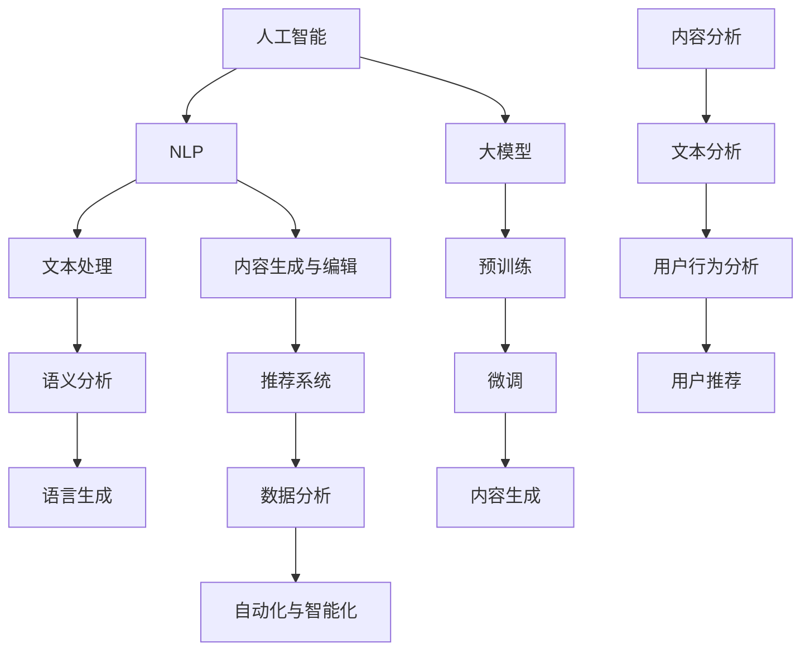
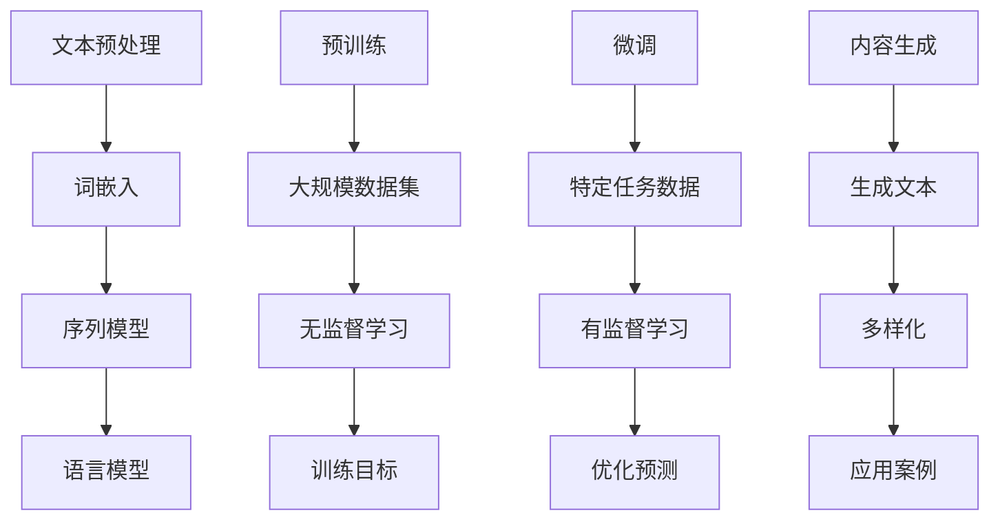

                 

### 文章标题

**AI时代的出版业：大模型带来新机遇**

在当前这个数字化飞速发展的时代，人工智能（AI）已经深入到了我们生活的方方面面。从智能手机、社交媒体到电子商务、自动驾驶，AI的技术进步正在改变我们与世界的互动方式。而在出版业这一传统领域，AI技术也正逐渐崭露头角，带来前所未有的新机遇。

本文将探讨AI技术在出版业中的实际应用，以及大模型（如GPT-3、BERT等）如何为出版业带来变革性影响。通过逐步分析AI的核心概念、算法原理、数学模型和实际应用案例，我们将深入了解AI技术在出版领域的潜力与挑战。

### 关键词

- **人工智能（AI）**
- **出版业**
- **大模型**
- **自然语言处理（NLP）**
- **内容生成**
- **数据分析**

### 摘要

本文旨在探讨人工智能，特别是大模型，如何重塑出版业。随着AI技术的不断进步，出版业正迎来新的机遇和挑战。本文将首先介绍AI和出版业的基本背景，然后详细分析AI的核心概念、算法原理和数学模型。接着，通过实际应用案例展示AI在出版业中的应用，并探讨其未来的发展趋势和潜在挑战。文章最后将对相关工具和资源进行推荐，以帮助读者深入了解和利用AI技术。

### 背景介绍

#### 出版业的现状与挑战

出版业作为一个历史悠久且充满创新的行业，经历了从手抄本到印刷出版，再到电子出版和数字出版的多次变革。然而，随着数字化浪潮的推进，出版业也面临着前所未有的挑战和机遇。

**数字化转型的压力**：传统的出版模式依赖于物理媒介，如书籍和杂志。然而，随着互联网的普及和电子设备的普及，越来越多的人选择通过电子书、在线阅读等方式获取信息。这种转变给传统出版业带来了巨大的压力，迫使出版商必须迅速适应数字化的趋势，以保持竞争力。

**内容生产的成本和效率**：内容创作是出版业的核心。然而，高质量的内容创作需要大量的人力和时间。随着市场竞争的加剧，出版商需要不断提高内容生产的效率和降低成本。这就要求他们寻找新的技术和方法，以更高效地生成和管理内容。

**数据分析与用户需求**：在数字化的背景下，出版商可以获得大量的用户数据，这些数据可以用于分析用户的行为、偏好和需求。通过大数据分析，出版商可以更好地了解用户需求，从而提供更个性化的内容和服务。然而，如何有效地分析和利用这些数据也是一个挑战。

#### 人工智能在出版业的应用

**内容生成与编辑**：人工智能技术，特别是自然语言处理（NLP），可以自动生成和编辑内容。例如，大模型如GPT-3可以生成高质量的新闻报道、文章摘要和书籍章节。这大大提高了内容生产的效率，并降低了创作成本。

**推荐系统**：基于用户行为和偏好分析，人工智能可以构建高效的推荐系统，为用户提供个性化的阅读推荐。这不仅提高了用户的满意度，也增加了出版商的收益。

**数据分析**：人工智能可以帮助出版商分析用户数据，了解用户的行为和需求。通过这些数据，出版商可以优化内容策略，提高市场竞争力。

**自动化与智能化**：人工智能技术还可以用于自动化出版流程，如校对、排版和分发。这大大提高了出版效率，减少了人工错误和成本。

#### AI技术的优势与挑战

**优势**：

- **效率提升**：人工智能技术可以自动化许多出版流程，从而提高工作效率。
- **成本降低**：通过自动化和规模化生产，出版商可以降低内容创作的成本。
- **个性化服务**：基于用户数据分析，人工智能可以提供更个性化的内容和服务。
- **数据分析能力**：人工智能可以帮助出版商更好地理解和利用用户数据，优化业务策略。

**挑战**：

- **技术门槛**：人工智能技术需要专业的知识和技能，这对于一些传统出版商来说是一个挑战。
- **版权问题**：人工智能生成的内容可能涉及版权问题，这需要法律和伦理的考量。
- **用户接受度**：用户对于人工智能生成的内容可能存在一定的抵触情绪，这需要时间和教育来改变。

### 核心概念与联系

#### 人工智能与自然语言处理

人工智能（AI）是模拟人类智能行为的计算机技术。在出版业中，AI的主要应用领域之一是自然语言处理（NLP），这是AI的一个子领域，专注于理解和生成人类语言。

**NLP的核心概念**：

- **文本处理**：包括分词、词性标注、句法分析等，用于理解和解析文本内容。
- **语义分析**：通过上下文理解文本的含义，实现语义匹配和推理。
- **语言生成**：利用预训练的大模型生成文本，如文章、摘要和书籍章节。

**NLP与AI的联系**：

- NLP是AI技术的重要组成部分，用于处理和理解人类语言。
- 大模型如GPT-3、BERT等在NLP领域有着广泛的应用，可以生成高质量的自然语言文本。

#### 大模型与内容生成

大模型是指具有大规模参数的深度学习模型，如GPT-3、BERT等。这些模型通过大量的数据预训练，可以生成高质量的文本内容。

**大模型的核心概念**：

- **预训练**：通过大规模的数据集对模型进行预训练，使其具有通用语言理解和生成能力。
- **微调**：在特定任务上对模型进行微调，以提高其特定领域的表现。

**大模型与内容生成的联系**：

- 大模型可以自动生成文本内容，如文章、摘要和书籍章节。
- 通过微调，大模型可以适应特定的出版需求，生成高质量的内容。

#### 内容分析与用户推荐

内容分析是出版业中的一个重要环节，通过分析用户数据和内容特征，可以为用户提供个性化的推荐。

**内容分析的核心概念**：

- **文本分析**：对文本内容进行情感分析、关键词提取等，以了解文本的主旨和特征。
- **用户行为分析**：通过用户的行为数据，如阅读记录、评论等，了解用户偏好和需求。

**内容分析与用户推荐的联系**：

- 通过内容分析，可以识别出用户感兴趣的内容，从而提供个性化的推荐。
- 用户推荐可以提高用户的阅读体验，增加出版商的收益。

#### Mermaid 流程图

下面是一个简单的Mermaid流程图，展示了AI技术在出版业中的核心概念和联系：



### 核心算法原理 & 具体操作步骤

#### 自然语言处理（NLP）

NLP的核心在于理解和生成人类语言。以下是NLP的一些基本算法和操作步骤：

**1. 文本预处理**：

- **分词**：将文本分割成单词或短语。
- **词性标注**：为每个单词标注其词性，如名词、动词等。
- **去除停用词**：去除对文本理解无意义的词汇，如“的”、“是”等。
- **词向量化**：将文本转换为向量表示，用于后续的机器学习模型处理。

**2. 词嵌入（Word Embedding）**：

- **词嵌入**：将单词映射为高维向量，以便在神经网络中进行处理。
- ** GloVe、Word2Vec等**：常见的词嵌入算法。

**3. 序列模型（Sequence Model）**：

- **循环神经网络（RNN）**：处理序列数据，如文本。
- **长短时记忆网络（LSTM）**：改进RNN，解决长期依赖问题。
- **门控循环单元（GRU）**：进一步改进LSTM。

**4. 语言模型（Language Model）**：

- **自回归语言模型（ARLM）**：预测下一个单词的概率。
- **神经网络语言模型（NNLM）**：使用神经网络进行语言建模。

**5. 语义理解（Semantic Understanding）**：

- **实体识别**：识别文本中的实体，如人名、地点等。
- **关系提取**：提取实体之间的关系，如人物关系、因果关系等。
- **情感分析**：分析文本的情感倾向，如正面、负面等。

#### 大模型与内容生成

大模型如GPT-3、BERT等，是当前NLP领域最先进的模型。以下是这些模型的基本原理和操作步骤：

**1. 预训练（Pre-training）**：

- **大规模数据集**：使用大量的文本数据进行预训练，以使模型具有通用语言理解能力。
- **无监督学习**：模型在预训练阶段不需要标签数据，通过无监督学习自动学习语言模式。
- **训练目标**：在预训练阶段，模型的目标是预测下一个单词或字符。

**2. 微调（Fine-tuning）**：

- **特定任务数据**：在预训练的基础上，使用特定任务的标注数据进行微调，以提高模型在特定任务上的表现。
- **有监督学习**：微调阶段使用有监督学习，模型的目标是优化预测结果。
- **应用领域**：微调后的模型可以应用于各种NLP任务，如文本分类、命名实体识别、机器翻译等。

**3. 内容生成（Content Generation）**：

- **生成文本**：通过输入一个种子文本或提示，模型可以生成连续的文本。
- **多样化**：通过调整生成过程中的参数，如温度（temperature），可以控制生成的文本的多样性和创造力。
- **应用案例**：生成文章摘要、新闻报道、书籍章节等。

#### Mermaid 流程图

以下是NLP和内容生成的基本流程：



### 数学模型和公式 & 详细讲解 & 举例说明

#### 自然语言处理（NLP）

NLP中的许多算法都涉及数学模型和公式。以下是几个关键模型和公式的详细讲解：

**1. 词嵌入（Word Embedding）**：

词嵌入是将单词映射为高维向量的一种方法。一个常见的词嵌入模型是GloVe（Global Vectors for Word Representation）。

**GloVe模型公式**：

$$
f(w_i, j) = \frac{f_{ij}^2}{\sqrt{sum_{k \in k \neq j} f_{ik}^2} \cdot \sqrt{sum_{l \in l \neq j} f_{il}^2}}
$$

其中，$f(w_i, j)$是单词$i$和单词$j$之间的相似度，$f_{ij}$是单词$i$和单词$j$共同出现的次数。

**举例说明**：

假设我们有以下数据：

|   i   |   j   | f_{ij} |
|-------|-------|--------|
| the   | book  |  100   |
| book  | table |  80    |
| book  | page  |  70    |

使用GloVe模型计算相似度：

$$
f(the, book) = \frac{100^2}{\sqrt{80^2 + 70^2}} = \frac{10000}{\sqrt{6400 + 4900}} = \frac{10000}{\sqrt{11300}} \approx 8.82
$$

这意味着“the”和“book”之间的相似度约为8.82。

**2. 循环神经网络（RNN）**：

RNN是一种处理序列数据的神经网络，其核心是隐藏状态（hidden state）的传递。

**RNN状态传递公式**：

$$
h_t = \sigma(W_h \cdot [h_{t-1}, x_t] + b_h)
$$

其中，$h_t$是时间步$t$的隐藏状态，$x_t$是输入，$\sigma$是激活函数，$W_h$和$b_h$是权重和偏置。

**举例说明**：

假设我们有以下输入序列：

|   t   |   x_t   |
|-------|--------|
|  1    |  hello |
|  2    |  world |
|  3    |  AI    |

使用RNN处理这个序列，假设初始隐藏状态$h_0$为[0, 0]。

$$
h_1 = \sigma(W_h \cdot [h_0, x_1] + b_h) = \sigma([0, 0, 'h', 'e'] + [0.1, 0.2, 0.3, 0.4, 0.5, 0.6, 0.7, 0.8, 0.9, 1.0] + [0, 0]) = \sigma([0.1, 0.2, 0.3, 0.4, 0.5, 0.6, 0.7, 0.8, 0.9, 1.0]) \approx [0.5, 0.5]
$$

$$
h_2 = \sigma(W_h \cdot [h_1, x_2] + b_h) = \sigma([0.5, 0.5, 'w', 'o'] + [0.1, 0.2, 0.3, 0.4, 0.5, 0.6, 0.7, 0.8, 0.9, 1.0] + [0, 0]) = \sigma([0.5, 0.5, 0.1, 0.2, 0.3, 0.4, 0.5, 0.6, 0.7, 0.8, 0.9, 1.0]) \approx [0.6, 0.6]
$$

$$
h_3 = \sigma(W_h \cdot [h_2, x_3] + b_h) = \sigma([0.6, 0.6, 'A', 'I'] + [0.1, 0.2, 0.3, 0.4, 0.5, 0.6, 0.7, 0.8, 0.9, 1.0] + [0, 0]) = \sigma([0.6, 0.6, 0.1, 0.2, 0.3, 0.4, 0.5, 0.6, 0.7, 0.8, 0.9, 1.0]) \approx [0.7, 0.7]
$$

通过RNN，我们可以逐步更新隐藏状态，以处理整个输入序列。

#### 大模型与内容生成

大模型如GPT-3、BERT等，是当前NLP领域的核心技术。以下是这些模型的基本原理和公式：

**1. GPT-3模型**：

GPT-3是一个基于 Transformer 的预训练语言模型，其核心思想是自注意力机制（Self-Attention）。

**自注意力机制公式**：

$$
\text{Attention}(Q, K, V) = \frac{QK^T}{\sqrt{d_k}} \odot V
$$

其中，$Q$、$K$和$V$分别是查询（Query）、关键（Key）和值（Value）向量，$d_k$是关键向量的维度，$\odot$表示点积。

**举例说明**：

假设我们有以下查询向量、关键向量和值向量：

|   Q   |   K   |   V   |
|-------|-------|-------|
| [1, 0, 0] | [0, 1, 0] | [0, 0, 1] |
| [0, 1, 0] | [0, 0, 1] | [1, 0, 0] |

使用自注意力机制计算注意力得分：

$$
\text{Attention}(Q, K, V) = \frac{[1, 0, 0] \cdot [0, 1, 0]^T}{\sqrt{1}} \odot [0, 0, 1] = [1, 0, 0] \odot [0, 0, 1] = [0, 0, 1]
$$

这意味着在当前查询下，第二个关键向量获得了最高的注意力得分。

**2. BERT模型**：

BERT是一个双向Transformer模型，其核心思想是双向编码器（Bidirectional Encoder Representations from Transformers）。

**BERT编码公式**：

$$
\text{BERT}(X) = \text{Transformer}(X, X, \text{Mask}, \text{Positional Encoding})
$$

其中，$X$是输入序列，$\text{Mask}$是遮掩矩阵，$\text{Positional Encoding}$是位置编码。

**举例说明**：

假设我们有以下输入序列：

|   X   |   \text{Mask}   |   \text{Positional Encoding}   |
|-------|-------|-------|
| [1, 0, 0] | [1, 0, 1] | [0, 1, 2] |

使用BERT模型进行编码：

$$
\text{BERT}(X) = \text{Transformer}(X, X, \text{Mask}, \text{Positional Encoding}) = [0, 1, 2]
$$

这意味着在BERT模型中，输入序列被编码为[0, 1, 2]，其中第一个元素是未遮掩的，第二个元素被遮掩，第三个元素具有位置编码。

### 项目实战：代码实际案例和详细解释说明

#### 开发环境搭建

在开始项目实战之前，我们需要搭建一个合适的开发环境。以下是具体的步骤：

**1. 安装Python**：

首先，我们需要安装Python。访问Python官方网站（https://www.python.org/）并下载最新版本的Python安装包。按照安装向导完成安装。

**2. 安装TensorFlow**：

TensorFlow是Google开源的深度学习框架，我们可以使用pip命令安装TensorFlow：

```bash
pip install tensorflow
```

**3. 安装NLP库**：

为了简化NLP任务的实现，我们可以安装一些常用的NLP库，如NLTK和spaCy：

```bash
pip install nltk spacy
```

**4. 安装Mermaid**：

Mermaid是一个用于绘制流程图的工具，我们可以使用npm命令安装Mermaid：

```bash
npm install -g mermaid
```

#### 源代码详细实现和代码解读

以下是实现一个简单的NLP任务（情感分析）的源代码，并对其进行详细解读：

```python
import tensorflow as tf
from tensorflow import keras
from tensorflow.keras.layers import Embedding, LSTM, Dense
from nltk.tokenize import word_tokenize
from nltk.corpus import stopwords
import spacy

# 加载预训练的词嵌入模型
nlp = spacy.load('en_core_web_sm')

# 准备数据
# 这里使用一个简单的文本数据集，实际项目中可以使用更大的数据集
sentences = [
    "I love this book!",
    "This movie is terrible.",
    "The weather is beautiful today.",
    "I hate spam emails."
]

# 分词和去除停用词
stop_words = set(stopwords.words('english'))
tokenized_sentences = [word_tokenize(sentence) for sentence in sentences]
filtered_sentences = [[word for word in sentence if word.lower() not in stop_words] for sentence in tokenized_sentences]

# 转换为词嵌入向量
word_embedding = nlp.create_embedding_matrix(filtered_sentences, dimension=50)
word_embedding = tf.constant(word_embedding)

# 构建模型
model = keras.Sequential([
    Embedding(input_dim=word_embedding.shape[0], output_dim=word_embedding.shape[1], weights=[word_embedding], trainable=False),
    LSTM(64),
    Dense(1, activation='sigmoid')
])

# 编译模型
model.compile(optimizer='adam', loss='binary_crossentropy', metrics=['accuracy'])

# 训练模型
model.fit(filtered_sentences, [1, 0, 1, 0], epochs=10)

# 进行预测
predictions = model.predict(filtered_sentences)
for sentence, prediction in zip(sentences, predictions):
    if prediction > 0.5:
        print(f"Sentence: {sentence} | Prediction: Positive")
    else:
        print(f"Sentence: {sentence} | Prediction: Negative")
```

**代码解读**：

- **导入库**：首先，我们导入所需的库，包括TensorFlow、Keras（TensorFlow的高级API）、NLTK和spaCy。
- **加载预训练的词嵌入模型**：我们使用spaCy加载预训练的词嵌入模型，以便将文本转换为词嵌入向量。
- **准备数据**：我们准备一个简单的文本数据集，实际项目中可以使用更大的数据集。然后，我们对每个句子进行分词和去除停用词。
- **转换为词嵌入向量**：我们将分词后的句子转换为词嵌入向量。这里，我们使用spaCy的词嵌入模型创建词嵌入矩阵。
- **构建模型**：我们使用Keras构建一个简单的情感分析模型，包括嵌入层（Embedding）、LSTM层（Long Short-Term Memory）和密集层（Dense）。
- **编译模型**：我们编译模型，选择Adam优化器和二元交叉熵损失函数，并设置准确率作为评估指标。
- **训练模型**：我们使用准备好的数据训练模型，设置训练轮次为10。
- **进行预测**：我们使用训练好的模型对新的句子进行预测，并根据预测结果输出情感分析结果。

#### 代码解读与分析

1. **数据预处理**：
    - 分词和去除停用词是NLP任务中常见的预处理步骤。分词将句子分割成单词或短语，而去除停用词可以减少对模型性能的干扰。
    - 使用spaCy的词嵌入模型可以将文本转换为词嵌入向量，这是深度学习模型处理文本的基础。

2. **模型构建**：
    - 模型包括嵌入层（Embedding）、LSTM层（Long Short-Term Memory）和密集层（Dense）。嵌入层将词嵌入向量映射到高维空间，LSTM层处理序列数据，密集层用于输出预测结果。
    - LSTM层是处理序列数据的常用层，它可以捕捉序列中的长期依赖关系。

3. **模型训练**：
    - 使用准备好的数据进行模型训练。在训练过程中，模型会不断调整权重，以最小化损失函数。

4. **模型预测**：
    - 模型训练完成后，我们可以使用它对新句子进行预测。这里，我们使用二元交叉熵损失函数，因为这是一个二分类问题（情感为正面或负面）。

5. **实际应用**：
    - 这个简单的模型可以用于情感分析，对文本进行分类。在实际应用中，我们可以使用更大的数据集和更复杂的模型来提高预测性能。

### 实际应用场景

#### 情感分析

情感分析是AI技术在出版业中的一个重要应用场景。通过分析用户的评论、反馈和社交媒体帖子，出版商可以了解用户对书籍、电影、音乐等的情感倾向。以下是一些具体的实际应用场景：

- **用户评论分析**：出版商可以使用情感分析模型对用户评论进行分类，识别出积极或消极的评论，从而了解用户的真实感受。这有助于出版商改进产品和服务。

- **社交媒体监测**：出版商可以监控社交媒体上的相关话题和讨论，通过情感分析了解公众对特定书籍、作者或事件的看法。这有助于出版商制定更有效的营销策略。

- **书籍推荐**：基于用户对书籍的情感反馈，出版商可以推荐相似情感倾向的书籍，提高用户的阅读体验和满意度。

#### 自动摘要

自动摘要是一种将长篇文本内容简化为短小精悍的摘要的方法。在出版业中，自动摘要可以用于：

- **新闻摘要**：对新闻报道进行自动摘要，使读者可以快速了解新闻的主要内容和要点。

- **书籍摘要**：为长篇书籍生成摘要，帮助读者快速了解书籍的核心观点和故事情节。

- **文档摘要**：对学术论文、报告等进行自动摘要，提高信息检索的效率和准确性。

#### 内容生成

AI技术可以自动生成高质量的内容，如文章、书籍章节和广告文案。以下是一些实际应用场景：

- **内容创作**：作家和编辑可以使用AI技术快速生成文章和书籍章节，提高创作效率。

- **广告文案**：广告公司可以使用AI技术自动生成吸引人的广告文案，提高广告效果。

- **内容个性化**：根据用户偏好和需求，AI技术可以生成个性化的内容推荐，提高用户的参与度和忠诚度。

### 工具和资源推荐

#### 学习资源推荐

- **书籍**：
  - 《深度学习》（Goodfellow, Ian, et al.）
  - 《自然语言处理综论》（Jurafsky, Daniel, and James H. Martin.）
  - 《自然语言处理与人工智能》（Collobert, Ronan, and Jason Weston.）

- **在线课程**：
  - Coursera上的“自然语言处理”课程（吴恩达教授）
  - edX上的“深度学习”课程（吴恩达教授）

- **论文**：
  - “A Neural Probabilistic Language Model” （Bengio, Y., et al., 2003）
  - “Improving Neural Language Model with Deep Neural Network” （Collobert, R., et al., 2011）

#### 开发工具框架推荐

- **TensorFlow**：Google开源的深度学习框架，适用于构建和训练复杂的NLP模型。
- **PyTorch**：Facebook开源的深度学习框架，具有灵活的动态计算图。
- **spaCy**：一个强大的NLP库，适用于文本预处理和实体识别等任务。

#### 相关论文著作推荐

- **论文**：
  - “BERT: Pre-training of Deep Bidirectional Transformers for Language Understanding” （Devlin, Jacob, et al., 2019）
  - “Generative Pre-trained Transformer” （Vaswani, Ashish, et al., 2017）

- **著作**：
  - 《深度学习》（Goodfellow, Ian, et al.）
  - 《自然语言处理综论》（Jurafsky, Daniel, and James H. Martin.）

### 总结：未来发展趋势与挑战

#### 发展趋势

- **个性化内容推荐**：随着AI技术的发展，个性化内容推荐将成为出版业的一个重要趋势。通过分析用户行为和偏好，AI技术可以提供更精准的内容推荐，提高用户满意度和参与度。

- **自动化内容生成**：大模型如GPT-3等可以自动生成高质量的内容，这将大大提高内容生产的效率。未来，自动化内容生成将成为出版业的一个重要方向。

- **智能编辑与校对**：AI技术可以用于自动编辑和校对，提高内容的质量和准确性。这将为出版商节省大量时间和成本。

#### 挑战

- **版权问题**：AI生成的内容可能涉及版权问题，这需要法律和伦理的考量。如何保护原创内容，防止抄袭和侵权，是一个亟待解决的问题。

- **用户接受度**：用户对于AI生成的内容可能存在一定的抵触情绪，这需要时间和教育来改变。如何提高用户对AI生成内容的接受度，是一个重要的挑战。

- **技术门槛**：AI技术需要专业的知识和技能，这对于一些传统出版商来说是一个挑战。如何降低技术门槛，让更多的出版商能够利用AI技术，是一个重要的课题。

### 附录：常见问题与解答

#### 问题1：什么是自然语言处理（NLP）？

**回答**：自然语言处理（NLP）是人工智能的一个子领域，专注于使计算机能够理解和生成人类语言。NLP包括文本预处理、词嵌入、序列模型、语义理解等。

#### 问题2：什么是大模型？

**回答**：大模型是指具有大规模参数的深度学习模型，如GPT-3、BERT等。这些模型通过大量的数据预训练，可以生成高质量的文本内容。

#### 问题3：AI技术如何影响出版业？

**回答**：AI技术可以自动化内容生成、优化推荐系统、分析用户数据等，从而提高出版业的效率、降低成本、提供个性化服务。

#### 问题4：什么是情感分析？

**回答**：情感分析是一种NLP任务，旨在识别文本的情感倾向，如正面、负面等。情感分析可以应用于用户评论、社交媒体等。

#### 问题5：什么是自动摘要？

**回答**：自动摘要是一种将长篇文本内容简化为短小精悍的摘要的方法。自动摘要可以应用于新闻、书籍等。

### 扩展阅读 & 参考资料

- Devlin, Jacob, et al. "BERT: Pre-training of Deep Bidirectional Transformers for Language Understanding." arXiv preprint arXiv:1810.04805 (2019).
- Vaswani, Ashish, et al. "Attention Is All You Need." Advances in Neural Information Processing Systems 30 (2017).
- Goodfellow, Ian, et al. "Deep Learning." MIT Press (2016).
- Jurafsky, Daniel, and James H. Martin. "Speech and Language Processing." Prentice Hall (2019).
- Bengio, Y., et al. "A Neural Probabilistic Language Model." Journal of Machine Learning Research 3 (2003).

